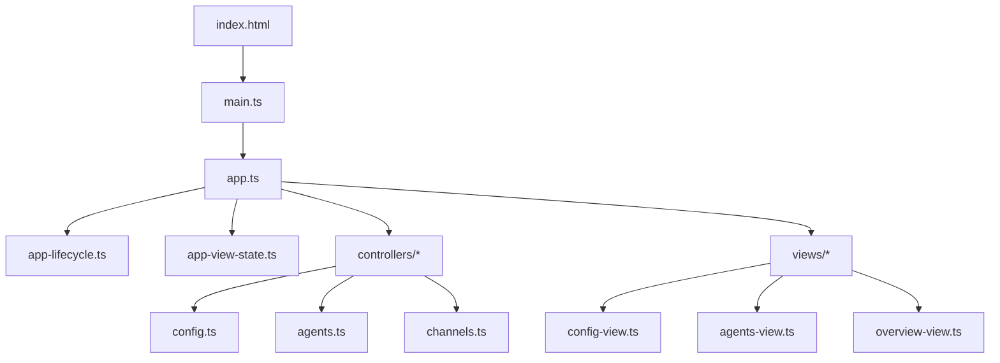
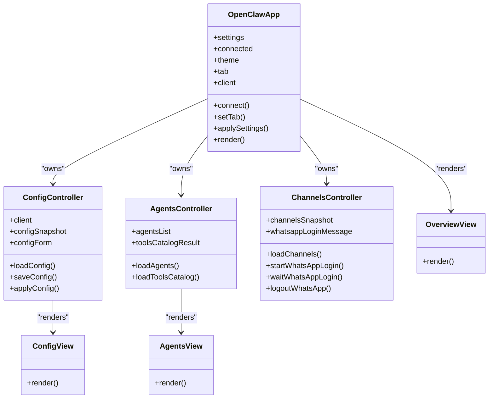
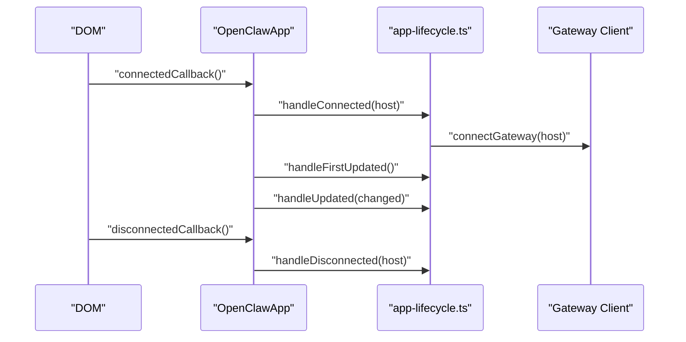
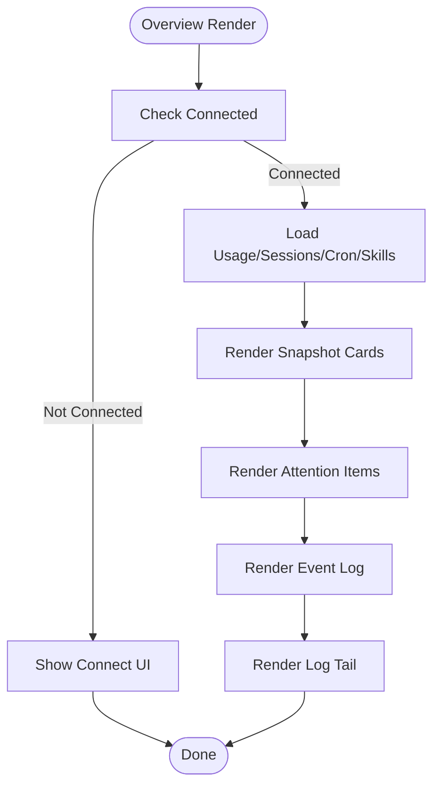
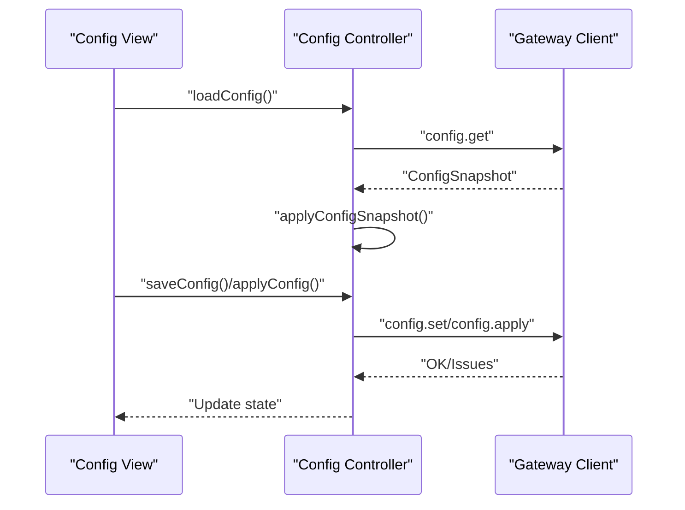
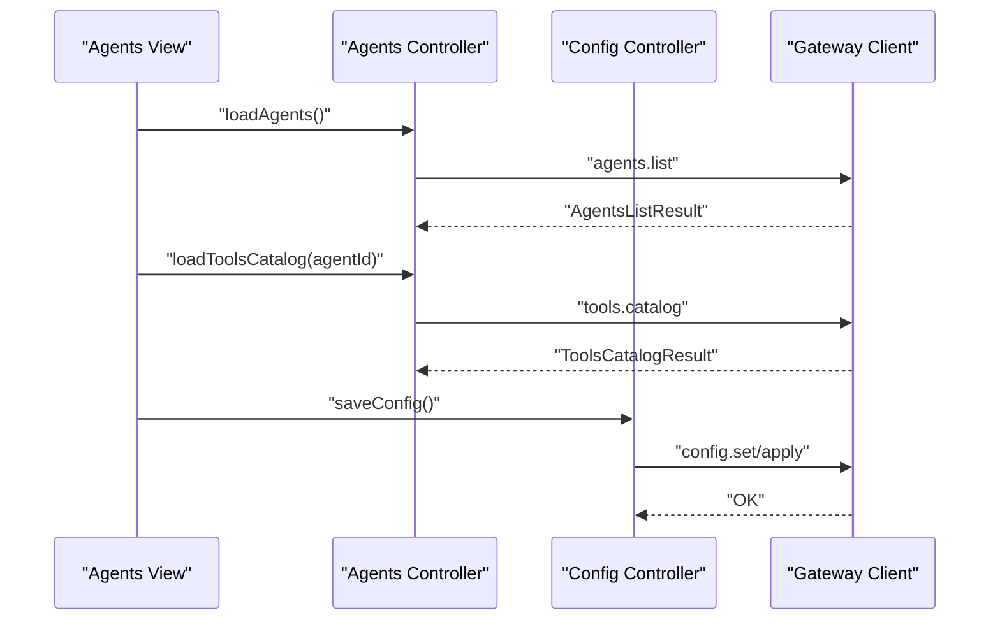
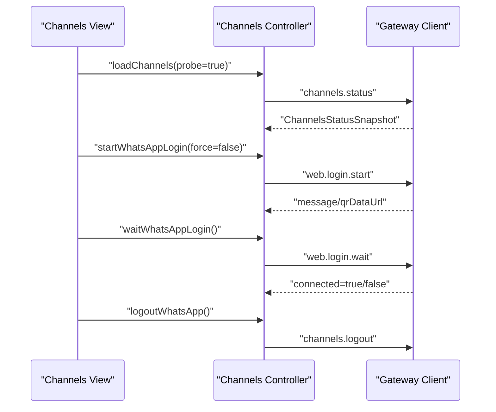
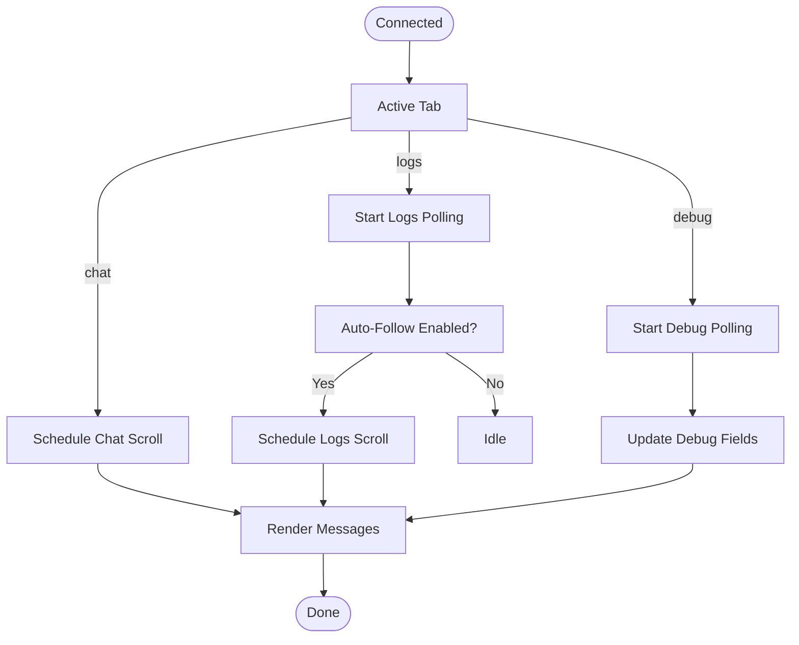
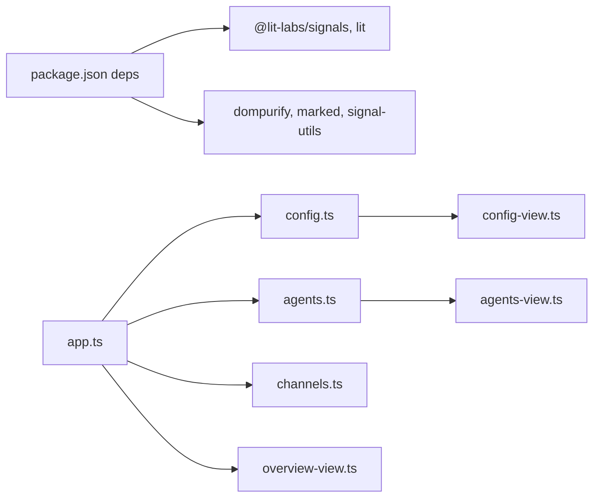

# Control UI

<cite>
**Referenced Files in This Document**
- [index.html](file://ui/index.html)
- [main.ts](file://ui/src/main.ts)
- [package.json](file://ui/package.json)
- [app.ts](file://ui/src/ui/app.ts)
- [app-lifecycle.ts](file://ui/src/ui/app-lifecycle.ts)
- [app-view-state.ts](file://ui/src/ui/app-view-state.ts)
- [config.ts](file://ui/src/ui/controllers/config.ts)
- [agents.ts](file://ui/src/ui/controllers/agents.ts)
- [channels.ts](file://ui/src/ui/controllers/channels.ts)
- [config-view.ts](file://ui/src/ui/views/config.ts)
- [agents-view.ts](file://ui/src/ui/views/agents.ts)
- [overview-view.ts](file://ui/src/ui/views/overview.ts)
</cite>

## Table of Contents
1. [Introduction](#introduction)
2. [Project Structure](#project-structure)
3. [Core Components](#core-components)
4. [Architecture Overview](#architecture-overview)
5. [Detailed Component Analysis](#detailed-component-analysis)
6. [Dependency Analysis](#dependency-analysis)
7. [Performance Considerations](#performance-considerations)
8. [Troubleshooting Guide](#troubleshooting-guide)
9. [Conclusion](#conclusion)
10. [Appendices](#appendices)

## Introduction
This document describes the Control UI for OpenClaw’s web-based control panel. It explains the Lit-based component architecture, state management with signals, and controller patterns. It documents the dashboard layout, configuration panels, and real-time status displays. It also covers UI components for agent management, channel configuration, and system monitoring, along with practical guidance for UI customization, theming, responsive design, component composition, data binding, event handling, and backend integration via WebSocket connections.

## Project Structure
The Control UI is implemented as a standalone web application packaged under the ui directory. It uses Lit for reactive UI, integrates with a gateway via a browser client, and organizes state into controllers and views.

**Diagram sources**
- [index.html:1-17](file://ui/index.html#L1-L17)
- [main.ts:1-3](file://ui/src/main.ts#L1-L3)
- [app.ts:1-723](file://ui/src/ui/app.ts#L1-L723)
- [app-lifecycle.ts:1-119](file://ui/src/ui/app-lifecycle.ts#L1-L119)
- [app-view-state.ts:1-373](file://ui/src/ui/app-view-state.ts#L1-L373)
- [config.ts:1-284](file://ui/src/ui/controllers/config.ts#L1-L284)
- [agents.ts:1-96](file://ui/src/ui/controllers/agents.ts#L1-L96)
- [channels.ts:1-95](file://ui/src/ui/controllers/channels.ts#L1-L95)
- [config-view.ts:1-800](file://ui/src/ui/views/config.ts#L1-L800)
- [agents-view.ts:1-382](file://ui/src/ui/views/agents.ts#L1-L382)
- [overview-view.ts:1-407](file://ui/src/ui/views/overview.ts#L1-L407)

**Section sources**
- [index.html:1-17](file://ui/index.html#L1-L17)
- [main.ts:1-3](file://ui/src/main.ts#L1-L3)
- [package.json:1-29](file://ui/package.json#L1-L29)

## Core Components
- Application shell: The root element is a custom element that wires lifecycle, state, and rendering.
- Controllers: Typed state machines for configuration, agents, channels, and other subsystems.
- Views: Presentational components that render UI for dashboards, forms, and lists.
- Signals and context: The UI leverages signals and context for efficient reactivity and cross-component communication.

Key implementation references:
- Root application element and state declarations: [app.ts:113-723](file://ui/src/ui/app.ts#L113-L723)
- Lifecycle wiring and polling: [app-lifecycle.ts:45-119](file://ui/src/ui/app-lifecycle.ts#L45-L119)
- Centralized view state contract: [app-view-state.ts:40-373](file://ui/src/ui/app-view-state.ts#L40-L373)
- Configuration controller: [config.ts:12-284](file://ui/src/ui/controllers/config.ts#L12-L284)
- Agents controller: [agents.ts:6-96](file://ui/src/ui/controllers/agents.ts#L6-L96)
- Channels controller: [channels.ts:6-95](file://ui/src/ui/controllers/channels.ts#L6-L95)
- Configuration view: [config-view.ts:16-800](file://ui/src/ui/views/config.ts#L16-L800)
- Agents view: [agents-view.ts:68-382](file://ui/src/ui/views/agents.ts#L68-L382)
- Overview view: [overview-view.ts:27-407](file://ui/src/ui/views/overview.ts#L27-L407)

**Section sources**
- [app.ts:113-723](file://ui/src/ui/app.ts#L113-L723)
- [app-lifecycle.ts:45-119](file://ui/src/ui/app-lifecycle.ts#L45-L119)
- [app-view-state.ts:40-373](file://ui/src/ui/app-view-state.ts#L40-L373)
- [config.ts:12-284](file://ui/src/ui/controllers/config.ts#L12-L284)
- [agents.ts:6-96](file://ui/src/ui/controllers/agents.ts#L6-L96)
- [channels.ts:6-95](file://ui/src/ui/controllers/channels.ts#L6-L95)
- [config-view.ts:16-800](file://ui/src/ui/views/config.ts#L16-L800)
- [agents-view.ts:68-382](file://ui/src/ui/views/agents.ts#L68-L382)
- [overview-view.ts:27-407](file://ui/src/ui/views/overview.ts#L27-L407)

## Architecture Overview
The Control UI follows a layered architecture:
- Presentation layer: Views render UI and bind to state.
- Controller layer: Controllers encapsulate domain logic and API interactions.
- State layer: Reactive state is declared on the root element and passed to controllers and views.
- Integration layer: The gateway client communicates over WebSocket to fetch and mutate system state.

**Diagram sources**
- [app.ts:113-723](file://ui/src/ui/app.ts#L113-L723)
- [config.ts:12-284](file://ui/src/ui/controllers/config.ts#L12-L284)
- [agents.ts:6-96](file://ui/src/ui/controllers/agents.ts#L6-L96)
- [channels.ts:6-95](file://ui/src/ui/controllers/channels.ts#L6-L95)
- [config-view.ts:16-800](file://ui/src/ui/views/config.ts#L16-L800)
- [agents-view.ts:68-382](file://ui/src/ui/views/agents.ts#L68-L382)
- [overview-view.ts:27-407](file://ui/src/ui/views/overview.ts#L27-L407)

## Detailed Component Analysis

### Application Shell and Lifecycle
- The root element initializes i18n, manages connection generation, and exposes methods to connect, apply settings, and manage tabs.
- Lifecycle hooks attach listeners, start polling, and coordinate cleanup on disconnect.

**Diagram sources**
- [app.ts:467-498](file://ui/src/ui/app.ts#L467-L498)
- [app-lifecycle.ts:45-85](file://ui/src/ui/app-lifecycle.ts#L45-L85)

**Section sources**
- [app.ts:113-723](file://ui/src/ui/app.ts#L113-L723)
- [app-lifecycle.ts:45-119](file://ui/src/ui/app-lifecycle.ts#L45-L119)

### State Management with Signals and Context
- The UI relies on signals and context for reactive updates and cross-component coordination.
- The root element holds all state and passes it down to controllers and views through a unified view state contract.

Practical implications:
- Use signals for fine-grained reactivity without unnecessary renders.
- Use context for theme, locale, and other shared concerns.

**Section sources**
- [package.json:11-21](file://ui/package.json#L11-L21)
- [app-view-state.ts:40-373](file://ui/src/ui/app-view-state.ts#L40-L373)

### Dashboard Layout and Navigation
- The overview view aggregates connectivity, usage, presence, and attention items.
- Navigation tabs drive which panel is active, and the app maintains a split ratio for side-by-side layouts.

**Diagram sources**
- [overview-view.ts:61-407](file://ui/src/ui/views/overview.ts#L61-L407)

**Section sources**
- [overview-view.ts:27-407](file://ui/src/ui/views/overview.ts#L27-L407)

### Configuration Panels
- The configuration controller loads snapshots, applies schema, and serializes changes for save/apply/update.
- The configuration view renders categorized sections, supports raw and form modes, and computes diffs for unsaved changes.

**Diagram sources**
- [config.ts:39-178](file://ui/src/ui/controllers/config.ts#L39-L178)
- [config-view.ts:661-800](file://ui/src/ui/views/config.ts#L661-L800)

**Section sources**
- [config.ts:12-284](file://ui/src/ui/controllers/config.ts#L12-L284)
- [config-view.ts:16-800](file://ui/src/ui/views/config.ts#L16-L800)

### Agent Management
- The agents controller lists agents, loads tools catalogs, and coordinates saving agent-specific configuration.
- The agents view renders tabs for overview, files, tools, skills, channels, and cron, and binds actions to controller methods.

**Diagram sources**
- [agents.ts:21-96](file://ui/src/ui/controllers/agents.ts#L21-L96)
- [agents-view.ts:109-382](file://ui/src/ui/views/agents.ts#L109-L382)

**Section sources**
- [agents.ts:6-96](file://ui/src/ui/controllers/agents.ts#L6-L96)
- [agents-view.ts:68-382](file://ui/src/ui/views/agents.ts#L68-L382)

### Channel Configuration and WhatsApp Login
- The channels controller handles channel status retrieval and WhatsApp login flows (start, wait, logout).
- The configuration view integrates channel-specific sections and status summaries.

**Diagram sources**
- [channels.ts:6-95](file://ui/src/ui/controllers/channels.ts#L6-L95)
- [config-view.ts:109-137](file://ui/src/ui/views/config.ts#L109-L137)

**Section sources**
- [channels.ts:6-95](file://ui/src/ui/controllers/channels.ts#L6-L95)
- [config-view.ts:109-137](file://ui/src/ui/views/config.ts#L109-L137)

### Real-Time Status Displays and Polling
- The lifecycle module starts and stops polling for logs, nodes, and debug data based on the active tab.
- The app reacts to state changes to auto-scroll chats and logs.

**Diagram sources**
- [app-lifecycle.ts:45-119](file://ui/src/ui/app-lifecycle.ts#L45-L119)

**Section sources**
- [app-lifecycle.ts:45-119](file://ui/src/ui/app-lifecycle.ts#L45-L119)

### Theming, Localization, and Responsive Design
- Theming: The app supports theme families and modes (system/light/dark). The configuration view renders theme cards and mode toggles.
- Localization: The overview view includes a language selector backed by i18n.
- Responsive: The UI uses grid layouts and adaptive spacing; ensure media queries in styles for small screens.

Practical examples:
- Switch themes via the appearance section in the configuration view.
- Toggle dark/light/system mode to match OS preferences.
- Adjust split ratios for chat and tool output panes.

**Section sources**
- [config-view.ts:516-620](file://ui/src/ui/views/config.ts#L516-L620)
- [overview-view.ts:286-301](file://ui/src/ui/views/overview.ts#L286-L301)

### Component Composition, Data Binding, and Event Handling
- Composition: Controllers own state and expose methods; views receive props and dispatch callbacks.
- Data binding: Properties bound to inputs and selects; event handlers update state and trigger saves.
- Events: Keyboard shortcuts (e.g., palette toggle), scroll handlers, and click actions.

Example patterns:
- Use a single source of truth for form values and serialize before submit.
- Debounce search/filter updates to reduce re-renders.
- Use split ratio to balance chat and tool output areas.

**Section sources**
- [config-view.ts:744-800](file://ui/src/ui/views/config.ts#L744-L800)
- [agents-view.ts:134-382](file://ui/src/ui/views/agents.ts#L134-L382)
- [app.ts:452-461](file://ui/src/ui/app.ts#L452-L461)

### Backend Integration and WebSocket Connections
- The app connects to the gateway via a browser client and requests snapshots and mutations for configuration, agents, channels, and cron.
- The lifecycle module coordinates connection establishment and polling intervals.

Integration highlights:
- Use the client to request config.get, config.set, config.apply, agents.list, tools.catalog, channels.status, and channel-specific operations.
- Handle errors and present user-friendly messages.

**Section sources**
- [config.ts:39-178](file://ui/src/ui/controllers/config.ts#L39-L178)
- [agents.ts:21-96](file://ui/src/ui/controllers/agents.ts#L21-L96)
- [channels.ts:6-95](file://ui/src/ui/controllers/channels.ts#L6-L95)
- [app-lifecycle.ts:45-85](file://ui/src/ui/app-lifecycle.ts#L45-L85)

## Dependency Analysis
The UI depends on Lit for rendering, signals for reactivity, and a gateway client for data. Controllers encapsulate API interactions and transform responses into UI-ready state.

**Diagram sources**
- [package.json:11-21](file://ui/package.json#L11-L21)
- [app.ts:1-90](file://ui/src/ui/app.ts#L1-L90)
- [config.ts:1-10](file://ui/src/ui/controllers/config.ts#L1-L10)
- [agents.ts:1-4](file://ui/src/ui/controllers/agents.ts#L1-L4)
- [channels.ts:1-4](file://ui/src/ui/controllers/channels.ts#L1-L4)
- [config-view.ts:1-14](file://ui/src/ui/views/config.ts#L1-L14)
- [agents-view.ts:1-11](file://ui/src/ui/views/agents.ts#L1-L11)
- [overview-view.ts:1-8](file://ui/src/ui/views/overview.ts#L1-L8)

**Section sources**
- [package.json:11-21](file://ui/package.json#L11-L21)
- [app.ts:1-90](file://ui/src/ui/app.ts#L1-L90)

## Performance Considerations
- Minimize re-renders by using signals for granular updates and avoiding unnecessary property churn.
- Debounce search and filter inputs to reduce frequent renders.
- Use virtualization for long lists (logs, sessions) when extending views.
- Batch configuration updates and avoid concurrent save/apply operations.
- Leverage polling intervals judiciously; stop polling when inactive.

## Troubleshooting Guide
Common issues and remedies:
- Connection failures: Verify gateway URL, token, and password; check overview hints for authentication and insecure context warnings.
- Configuration save/apply errors: Ensure a valid base hash exists; review issues returned by the gateway.
- Channel login timeouts: Retry start/wait/logout flows; confirm network reachability.
- Excessive polling: Reduce log limits and disable debug polling when not needed.

**Section sources**
- [overview-view.ts:104-191](file://ui/src/ui/views/overview.ts#L104-L191)
- [config.ts:130-178](file://ui/src/ui/controllers/config.ts#L130-L178)
- [channels.ts:29-95](file://ui/src/ui/controllers/channels.ts#L29-L95)

## Conclusion
The Control UI is a modular, reactive web application built with Lit and signals. It separates concerns across controllers and views, integrates tightly with the gateway via WebSocket, and provides robust configuration, agent management, and monitoring capabilities. By following the patterns documented here—controller-driven state, view-driven presentation, and careful integration with the backend—you can extend the UI while maintaining consistency and responsiveness.

## Appendices
- Extending with custom components: Add a new controller under ui/src/ui/controllers and a corresponding view under ui/src/ui/views, then wire them into the root app state and render pipeline.
- Maintaining design consistency: Reuse theme families and mode toggles from the configuration view; adhere to grid layouts and spacing conventions.