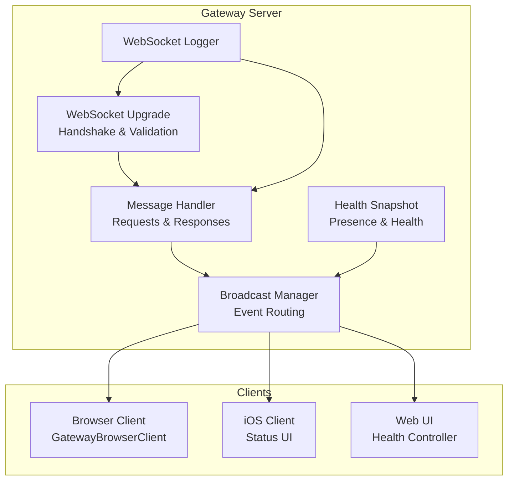
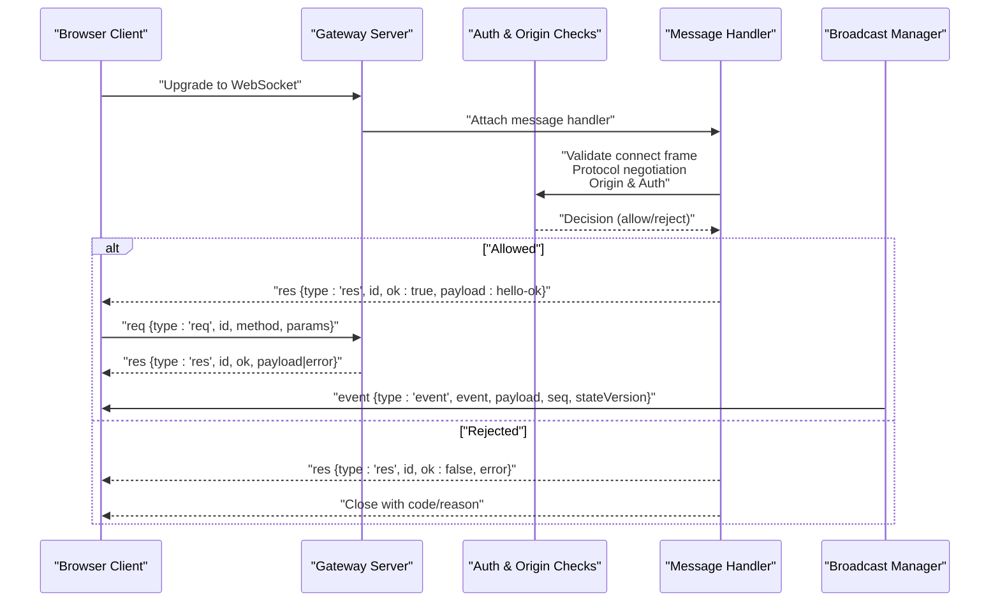
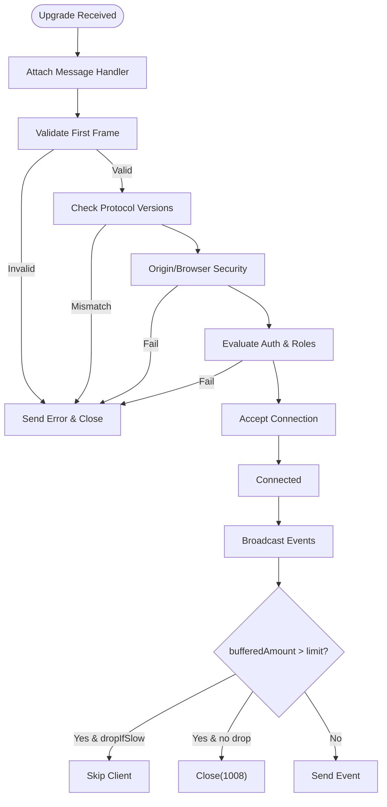
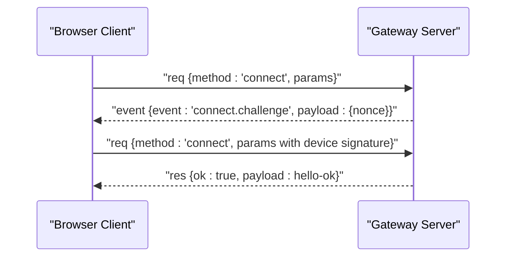
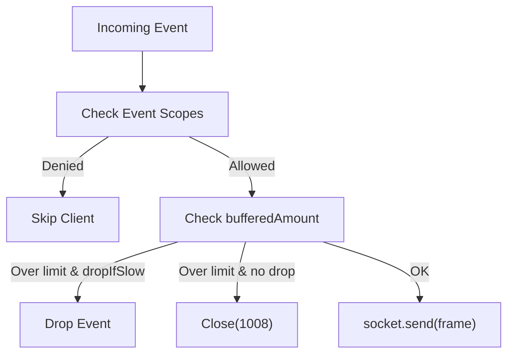
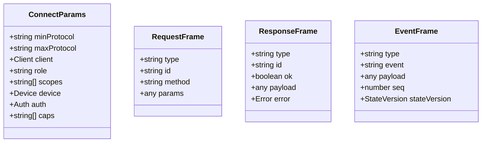
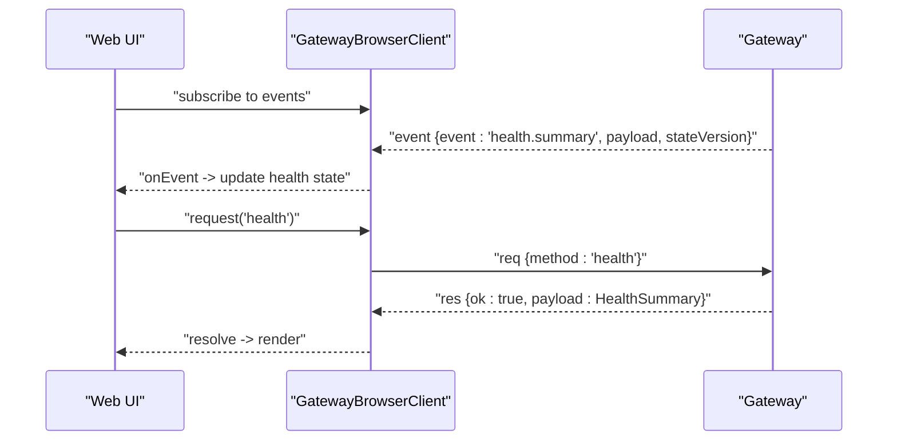
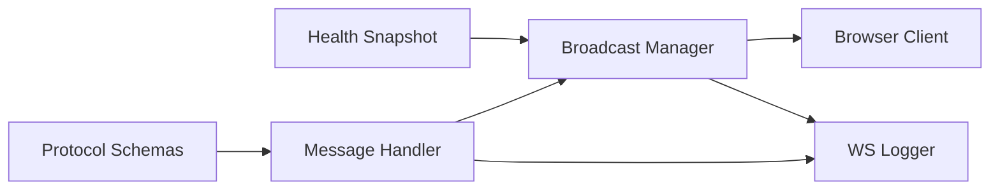

# Real-time Communication

<cite>
**Referenced Files in This Document**
- [ws-types.ts](file://src/gateway/server/ws-types.ts)
- [server-broadcast.ts](file://src/gateway/server-broadcast.ts)
- [message-handler.ts](file://src/gateway/server/ws-connection/message-handler.ts)
- [index.ts](file://src/gateway/protocol/index.ts)
- [gateway.ts](file://ui/src/ui/gateway.ts)
- [health-state.ts](file://src/gateway/server/health-state.ts)
- [ws-log.ts](file://src/gateway/ws-log.ts)
- [server.auth.control-ui.suite.ts](file://src/gateway/server.auth.control-ui.suite.ts)
- [auth-rate-limit.test.ts](file://src/gateway/auth-rate-limit.test.ts)
- [server.canvas-auth.test.ts](file://src/gateway/server.canvas-auth.test.ts)
- [health.ts](file://ui/src/ui/controllers/health.ts)
- [GatewayStatusBuilder.swift](file://apps/ios/Sources/Status/GatewayStatusBuilder.swift)
- [GatewayOnboardingView.swift](file://apps/ios/Sources/Onboarding/GatewayOnboardingView.swift)
</cite>

## Table of Contents
1. [Introduction](#introduction)
2. [Project Structure](#project-structure)
3. [Core Components](#core-components)
4. [Architecture Overview](#architecture-overview)
5. [Detailed Component Analysis](#detailed-component-analysis)
6. [Dependency Analysis](#dependency-analysis)
7. [Performance Considerations](#performance-considerations)
8. [Troubleshooting Guide](#troubleshooting-guide)
9. [Conclusion](#conclusion)
10. [Appendices](#appendices)

## Introduction
This document explains OpenClaw’s WebSocket-based real-time messaging system. It covers the WebSocket server implementation, connection lifecycle, authentication and rate limiting, message routing, and UI integration for live updates. It also documents the protocol frames, event handling, and practical guidance for establishing connections, handling disconnections, and implementing robust reconnection logic.

## Project Structure
OpenClaw’s real-time system spans:
- Gateway server: WebSocket upgrade, handshake, request/response handling, broadcasting, and logging.
- Protocol definitions: Frame schemas and validation for connect, requests, responses, and events.
- Browser client: WebSocket client with automatic reconnection, nonce challenge handling, and request/response tracking.
- UI integrations: Web UI, iOS UI, and health controllers consuming real-time events and snapshots.

**Diagram sources**
- [message-handler.ts:132-199](file://src/gateway/server/ws-connection/message-handler.ts#L132-L199)
- [server-broadcast.ts:57-131](file://src/gateway/server-broadcast.ts#L57-L131)
- [health-state.ts:17-47](file://src/gateway/server/health-state.ts#L17-L47)
- [gateway.ts:149-493](file://ui/src/ui/gateway.ts#L149-L493)
- [ws-log.ts:256-314](file://src/gateway/ws-log.ts#L256-L314)

**Section sources**
- [message-handler.ts:132-199](file://src/gateway/server/ws-connection/message-handler.ts#L132-L199)
- [server-broadcast.ts:57-131](file://src/gateway/server-broadcast.ts#L57-L131)
- [health-state.ts:17-47](file://src/gateway/server/health-state.ts#L17-L47)
- [gateway.ts:149-493](file://ui/src/ui/gateway.ts#L149-L493)
- [ws-log.ts:256-314](file://src/gateway/ws-log.ts#L256-L314)

## Core Components
- Gateway WebSocket client model: Tracks per-connection state, authentication, and capabilities.
- Broadcast manager: Routes events to clients with optional scoping and slow-consumer handling.
- Message handler: Validates frames, performs authentication and origin checks, negotiates protocol, and dispatches requests.
- Protocol schemas: Define connect parameters, request/response frames, and event frames.
- Browser client: Manages WebSocket lifecycle, nonce challenges, retries, and request tracking.
- Health snapshot: Provides presence and health snapshots with versioning for UI updates.

**Section sources**
- [ws-types.ts:4-13](file://src/gateway/server/ws-types.ts#L4-L13)
- [server-broadcast.ts:57-131](file://src/gateway/server-broadcast.ts#L57-L131)
- [message-handler.ts:258-341](file://src/gateway/server/ws-connection/message-handler.ts#L258-L341)
- [index.ts:173-183](file://src/gateway/protocol/index.ts#L173-L183)
- [gateway.ts:149-493](file://ui/src/ui/gateway.ts#L149-L493)
- [health-state.ts:17-47](file://src/gateway/server/health-state.ts#L17-L47)

## Architecture Overview
The Gateway accepts WebSocket upgrades, validates the first frame as a connect request, authenticates the client, negotiates protocol versions, and transitions to a connected state. Once connected, clients can send request frames and receive response frames and event frames. The broadcast manager routes events to subscribed clients, enforcing event-scoped permissions and protecting slow consumers.

**Diagram sources**
- [message-handler.ts:303-384](file://src/gateway/server/ws-connection/message-handler.ts#L303-L384)
- [message-handler.ts:1122-1143](file://src/gateway/server/ws-connection/message-handler.ts#L1122-L1143)
- [server-broadcast.ts:60-118](file://src/gateway/server-broadcast.ts#L60-L118)
- [index.ts:173-183](file://src/gateway/protocol/index.ts#L173-L183)

## Detailed Component Analysis

### WebSocket Server Implementation
- Connection lifecycle: The server attaches a message handler on upgrade, validates the first frame as a connect request, enforces protocol compatibility, and applies origin checks for browsers and Control UI.
- Authentication and authorization: The server resolves authentication state, evaluates device identity, checks roles/scopes, and enforces device token/device signature requirements. It supports rate limiting for shared secrets and device tokens.
- Slow consumer protection: Broadcasts check bufferedAmount against a threshold and either drop or close slow consumers depending on policy.

**Diagram sources**
- [message-handler.ts:258-341](file://src/gateway/server/ws-connection/message-handler.ts#L258-L341)
- [message-handler.ts:370-384](file://src/gateway/server/ws-connection/message-handler.ts#L370-L384)
- [message-handler.ts:406-444](file://src/gateway/server/ws-connection/message-handler.ts#L406-L444)
- [server-broadcast.ts:100-117](file://src/gateway/server-broadcast.ts#L100-L117)

**Section sources**
- [message-handler.ts:258-341](file://src/gateway/server/ws-connection/message-handler.ts#L258-L341)
- [message-handler.ts:406-444](file://src/gateway/server/ws-connection/message-handler.ts#L406-L444)
- [server-broadcast.ts:100-117](file://src/gateway/server-broadcast.ts#L100-L117)

### Connection Management and Handshake
- Connect frame: Clients must send a connect request with min/max protocol, client metadata, optional auth, device identity, and capabilities.
- Challenge-response: The server may send a connect.challenge event with a nonce; clients must respond with a properly signed device payload.
- Hello-ok: On success, the server replies with hello-ok containing protocol version, server info, features, snapshot, and policy.

**Diagram sources**
- [gateway.ts:397-404](file://ui/src/ui/gateway.ts#L397-L404)
- [message-handler.ts:344-384](file://src/gateway/server/ws-connection/message-handler.ts#L344-L384)

**Section sources**
- [gateway.ts:397-404](file://ui/src/ui/gateway.ts#L397-L404)
- [message-handler.ts:344-384](file://src/gateway/server/ws-connection/message-handler.ts#L344-L384)

### Message Routing and Broadcasting
- Event scoping: Certain events require specific operator scopes; the broadcaster checks client roles/scopes before sending.
- Targeted vs global broadcasts: Broadcast supports targeted delivery to specific connection IDs.
- Slow consumer handling: Broadcast drops or closes slow consumers based on policy and thresholds.

**Diagram sources**
- [server-broadcast.ts:41-55](file://src/gateway/server-broadcast.ts#L41-L55)
- [server-broadcast.ts:93-117](file://src/gateway/server-broadcast.ts#L93-L117)

**Section sources**
- [server-broadcast.ts:41-55](file://src/gateway/server-broadcast.ts#L41-L55)
- [server-broadcast.ts:93-117](file://src/gateway/server-broadcast.ts#L93-L117)

### Protocol Specifications and Frames
- ConnectParams: Defines client identity, role, scopes, device identity, auth, and capabilities.
- RequestFrame: Standardized request envelope with id/method/params.
- ResponseFrame: Standardized response envelope with id/ok/payload or error.
- EventFrame: Event envelope with event name, payload, optional sequence, and stateVersion.

**Diagram sources**
- [index.ts:79-80](file://src/gateway/protocol/index.ts#L79-L80)
- [index.ts:173-183](file://src/gateway/protocol/index.ts#L173-L183)
- [index.ts:126-127](file://src/gateway/protocol/index.ts#L126-L127)

**Section sources**
- [index.ts:79-80](file://src/gateway/protocol/index.ts#L79-L80)
- [index.ts:173-183](file://src/gateway/protocol/index.ts#L173-L183)
- [index.ts:126-127](file://src/gateway/protocol/index.ts#L126-L127)

### Real-time Updates for UI Components
- Web UI: The GatewayBrowserClient consumes event frames and exposes onEvent callbacks. It tracks sequence numbers and gaps, and triggers UI updates accordingly.
- Health controller: Loads health summaries and falls back to a safe default when the gateway is unreachable.
- iOS UI: Status builder interprets gateway connection state and displays appropriate pill states.

**Diagram sources**
- [gateway.ts:395-418](file://ui/src/ui/gateway.ts#L395-L418)
- [health.ts:31-38](file://ui/src/ui/controllers/health.ts#L31-L38)
- [GatewayStatusBuilder.swift:4-21](file://apps/ios/Sources/Status/GatewayStatusBuilder.swift#L4-L21)

**Section sources**
- [gateway.ts:395-418](file://ui/src/ui/gateway.ts#L395-L418)
- [health.ts:31-38](file://ui/src/ui/controllers/health.ts#L31-L38)
- [GatewayStatusBuilder.swift:4-21](file://apps/ios/Sources/Status/GatewayStatusBuilder.swift#L4-L21)

### Practical Examples

- Establishing a WebSocket connection:
  - Create a WebSocket to the gateway URL.
  - Wait for open; queue a connect request after a short delay.
  - Handle connect.challenge by responding with a signed device payload.
  - On hello-ok, initialize UI state and reset reconnection backoff.

- Handling disconnections:
  - On close, flush pending requests and call onClose with code/reason/error.
  - Determine whether to reconnect based on error detail codes.

- Implementing reconnection logic:
  - Exponential backoff with jitter up to a maximum.
  - Respect non-recoverable auth errors; suppress reconnect for certain detail codes.

**Section sources**
- [gateway.ts:164-221](file://ui/src/ui/gateway.ts#L164-L221)
- [gateway.ts:189-212](file://ui/src/ui/gateway.ts#L189-L212)
- [gateway.ts:328-384](file://ui/src/ui/gateway.ts#L328-L384)

### Security Considerations, Authentication, and Rate Limiting
- Origin checks: Enforced for browser clients and Control UI; supports host-header fallback with warnings.
- Device identity and signatures: Required for non-local clients; nonce validation and signature freshness enforced.
- Role and scopes: Operator roles and explicit scopes govern event visibility; device-less clients default to no scopes.
- Rate limiting: Separate limits for device tokens, shared secrets, and hook auth; lockouts return 429 with Retry-After.
- Canvas auth: HTTP and WS upgrades share rate limiting; spoofed loopback headers from trusted proxies are handled carefully.

**Section sources**
- [message-handler.ts:406-444](file://src/gateway/server/ws-connection/message-handler.ts#L406-L444)
- [message-handler.ts:515-568](file://src/gateway/server/ws-connection/message-handler.ts#L515-L568)
- [message-handler.ts:637-664](file://src/gateway/server/ws-connection/message-handler.ts#L637-L664)
- [server.auth.control-ui.suite.ts:475-507](file://src/gateway/server.auth.control-ui.suite.ts#L475-L507)
- [auth-rate-limit.test.ts:36-42](file://src/gateway/auth-rate-limit.test.ts#L36-L42)
- [server.canvas-auth.test.ts:353-385](file://src/gateway/server.canvas-auth.test.ts#L353-L385)

### Integration Between Web Interface and Gateway Protocol
- The browser client sends requests via req/res frames and subscribes to events via hello-ok features and snapshot.
- The gateway maintains a health snapshot with presence and health versions; UIs can rely on stateVersion to detect updates.
- iOS UI integrates gateway status via status builder and onboarding views.

**Section sources**
- [gateway.ts:108-115](file://ui/src/ui/gateway.ts#L108-L115)
- [health-state.ts:17-47](file://src/gateway/server/health-state.ts#L17-L47)
- [GatewayOnboardingView.swift:325-354](file://apps/ios/Sources/Onboarding/GatewayOnboardingView.swift#L325-L354)

## Dependency Analysis
The real-time system depends on:
- Protocol schemas for frame validation.
- Broadcast manager for event routing and scoping.
- Message handler for handshake, auth, and request dispatch.
- Browser client for lifecycle and reconnection.
- Logging subsystem for WS traffic visibility.

**Diagram sources**
- [index.ts:253-262](file://src/gateway/protocol/index.ts#L253-L262)
- [message-handler.ts:67-68](file://src/gateway/server/ws-connection/message-handler.ts#L67-L68)
- [server-broadcast.ts:57-64](file://src/gateway/server-broadcast.ts#L57-L64)
- [ws-log.ts:26-26](file://src/gateway/ws-log.ts#L26-L26)

**Section sources**
- [index.ts:253-262](file://src/gateway/protocol/index.ts#L253-L262)
- [message-handler.ts:67-68](file://src/gateway/server/ws-connection/message-handler.ts#L67-L68)
- [server-broadcast.ts:57-64](file://src/gateway/server-broadcast.ts#L57-L64)
- [ws-log.ts:26-26](file://src/gateway/ws-log.ts#L26-L26)

## Performance Considerations
- Backpressure and slow consumers: Broadcasts protect downstream by dropping or closing slow sockets when bufferedAmount exceeds thresholds.
- Payload limits: Pre-handshake payload size is capped to mitigate resource exhaustion.
- Logging overhead: WS logs support optimized modes and redaction to reduce noise and cost in verbose environments.
- Health refresh: Health snapshots are refreshed asynchronously to avoid blocking event delivery.

**Section sources**
- [server-broadcast.ts:100-117](file://src/gateway/server-broadcast.ts#L100-L117)
- [message-handler.ts:264-272](file://src/gateway/server/ws-connection/message-handler.ts#L264-L272)
- [ws-log.ts:87-89](file://src/gateway/ws-log.ts#L87-L89)
- [health-state.ts:70-85](file://src/gateway/server/health-state.ts#L70-L85)

## Troubleshooting Guide
- Parse errors: Invalid JSON or missing type fields trigger parse-error logs; inspect WS logs for details.
- Handshake failures: Origin mismatches, protocol version conflicts, or invalid connect params lead to immediate closure with descriptive reasons.
- Authentication failures: Non-recoverable errors (e.g., missing device token, pairing required) suppress auto-reconnect; review error detail codes.
- Slow consumers: Consumers exceeding buffer limits are closed; adjust client-side buffering or reduce event frequency.
- Rate limiting: Repeated auth failures result in 429 responses; verify credentials and consider whitelisting trusted proxies.

**Section sources**
- [message-handler.ts:1135-1142](file://src/gateway/server/ws-connection/message-handler.ts#L1135-L1142)
- [ws-log.ts:332-343](file://src/gateway/ws-log.ts#L332-L343)
- [gateway.ts:65-80](file://ui/src/ui/gateway.ts#L65-L80)
- [server.canvas-auth.test.ts:353-385](file://src/gateway/server.canvas-auth.test.ts#L353-L385)

## Conclusion
OpenClaw’s WebSocket real-time system provides a secure, structured, and resilient communication channel between clients and the gateway. With strict handshake and authentication, scoped event routing, and robust client-side reconnection, it enables responsive UI updates and reliable live data synchronization across web and native clients.

## Appendices

### Appendix A: Example Client Lifecycle
- Create WebSocket to gateway URL.
- On open, queue connect after a brief timeout.
- On connect.challenge, respond with signed device payload.
- On hello-ok, reset backoff and subscribe to events.
- On close, flush pending requests and reconnect with exponential backoff unless non-recoverable.

**Section sources**
- [gateway.ts:164-221](file://ui/src/ui/gateway.ts#L164-L221)
- [gateway.ts:397-404](file://ui/src/ui/gateway.ts#L397-L404)
- [gateway.ts:328-384](file://ui/src/ui/gateway.ts#L328-L384)