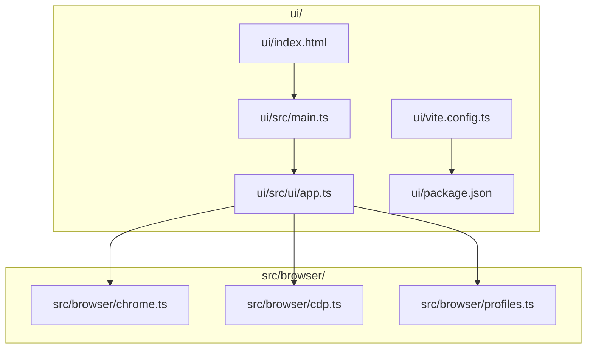
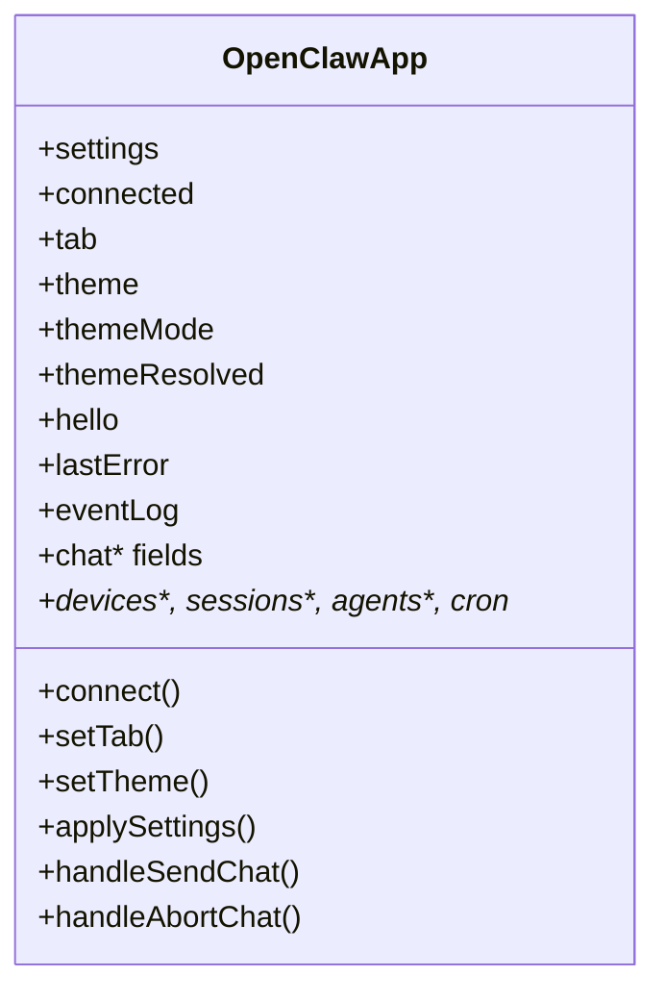
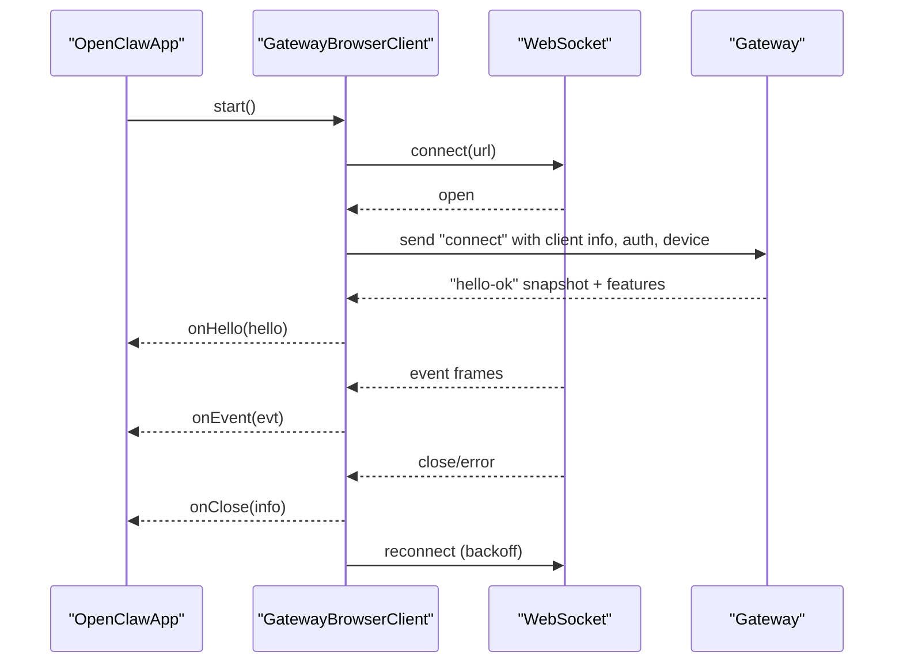
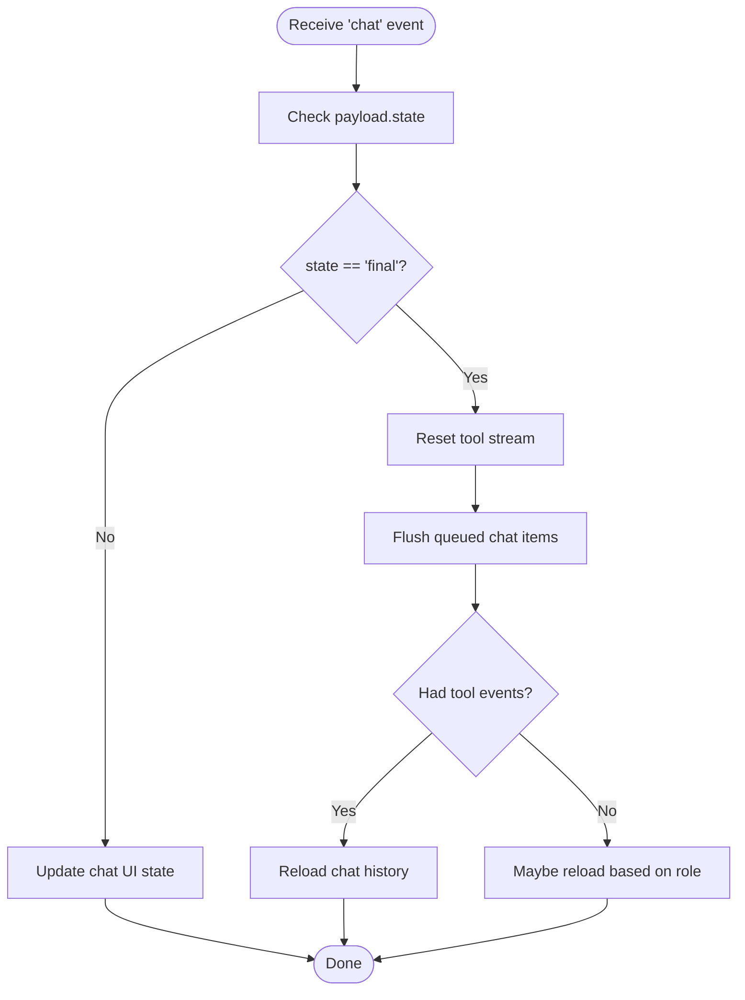
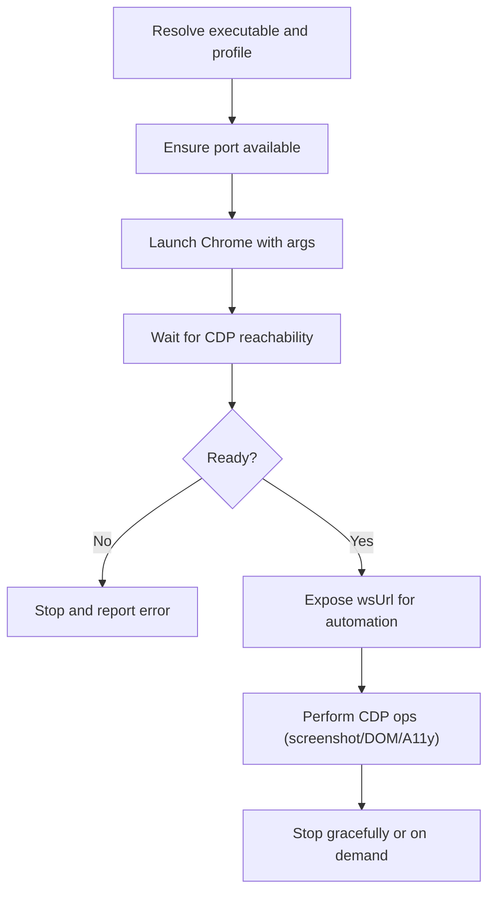
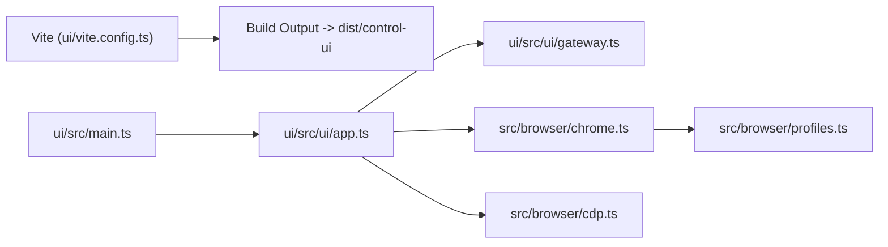

# Web Interface

<cite>
**Referenced Files in This Document**
- [index.html](file://ui/index.html)
- [package.json](file://ui/package.json)
- [vite.config.ts](file://ui/vite.config.ts)
- [main.ts](file://ui/src/main.ts)
- [app.ts](file://ui/src/ui/app.ts)
- [app-gateway.ts](file://ui/src/ui/app-gateway.ts)
- [gateway.ts](file://ui/src/ui/gateway.ts)
- [chat-event-reload.ts](file://ui/src/ui/chat-event-reload.ts)
- [chrome.ts](file://src/browser/chrome.ts)
- [cdp.ts](file://src/browser/cdp.ts)
- [profiles.ts](file://src/browser/profiles.ts)
</cite>

## Table of Contents
1. [Introduction](#introduction)
2. [Project Structure](#project-structure)
3. [Core Components](#core-components)
4. [Architecture Overview](#architecture-overview)
5. [Detailed Component Analysis](#detailed-component-analysis)
6. [Dependency Analysis](#dependency-analysis)
7. [Performance Considerations](#performance-considerations)
8. [Troubleshooting Guide](#troubleshooting-guide)
9. [Conclusion](#conclusion)
10. [Appendices](#appendices)

## Introduction
This document explains OpenClaw’s web-based control panel and chat interface. It covers the Vite-powered frontend built with Lit, the real-time WebSocket integration with the Gateway, browser control capabilities, and the automation layer for managing Chrome/Chromium via the Chrome DevTools Protocol (CDP). It also provides practical guidance on setup, configuration, theming, deployment, security, and cross-platform compatibility.

## Project Structure
The web interface is implemented as a standalone Vite application under ui/. It defines a single-page application (SPA) that mounts the OpenClaw control UI element and connects to the Gateway over WebSocket. The browser automation subsystem lives under src/browser/ and provides utilities to launch and manage Chrome instances and interact with them via CDP.



**Diagram sources**
- [index.html:1-17](file://ui/index.html#L1-L17)
- [main.ts:1-3](file://ui/src/main.ts#L1-L3)
- [app.ts:1-723](file://ui/src/ui/app.ts#L1-L723)
- [vite.config.ts:1-62](file://ui/vite.config.ts#L1-L62)
- [package.json:1-29](file://ui/package.json#L1-L29)
- [chrome.ts:1-466](file://src/browser/chrome.ts#L1-L466)
- [cdp.ts:1-486](file://src/browser/cdp.ts#L1-L486)
- [profiles.ts:1-114](file://src/browser/profiles.ts#L1-L114)

**Section sources**
- [index.html:1-17](file://ui/index.html#L1-L17)
- [main.ts:1-3](file://ui/src/main.ts#L1-L3)
- [vite.config.ts:1-62](file://ui/vite.config.ts#L1-L62)
- [package.json:1-29](file://ui/package.json#L1-L29)

## Core Components
- Control UI SPA: A Lit-based single-page application that renders the dashboard, chat, settings, and related views. It manages state for tabs, themes, logs, sessions, and real-time updates from the Gateway.
- Gateway client: A WebSocket client that negotiates connection with the Gateway, handles authentication and device identity, and dispatches incoming events to UI controllers.
- Browser automation: Utilities to launch and manage Chrome/Chromium locally or remotely, expose a CDP endpoint, and perform CDP operations such as screenshotting, DOM snapshots, and JavaScript evaluation.

Key responsibilities:
- Frontend rendering and user interactions
- Real-time synchronization with the Gateway
- Browser lifecycle and CDP orchestration
- Profile management and port/color allocation

**Section sources**
- [app.ts:113-723](file://ui/src/ui/app.ts#L113-L723)
- [gateway.ts:149-493](file://ui/src/ui/gateway.ts#L149-L493)
- [app-gateway.ts:177-430](file://ui/src/ui/app-gateway.ts#L177-L430)
- [chrome.ts:256-466](file://src/browser/chrome.ts#L256-L466)
- [cdp.ts:1-486](file://src/browser/cdp.ts#L1-L486)
- [profiles.ts:1-114](file://src/browser/profiles.ts#L1-L114)

## Architecture Overview
The UI communicates with the Gateway over a WebSocket connection. The Gateway streams events (chat, agent, presence, cron, device pairing, approvals, and others) that the UI consumes to update state and views. The UI also sends requests to the Gateway for configuration, sessions, tools, and approvals. On the automation side, the system can launch and control Chrome/Chromium via CDP for tasks like screenshots, DOM inspection, and page automation.

```mermaid
graph TB
UI["OpenClawApp (ui/src/ui/app.ts)"]
GW["GatewayBrowserClient (ui/src/ui/gateway.ts)"]
GW_CONN["WebSocket Endpoint"]
GW_EVT["Gateway Events"]
AUT["Automation Layer<br/>src/browser/chrome.ts / cdp.ts"]
UI --> GW
GW --> GW_CONN
GW_CONN <- --> GW_EVT
UI --> AUT
```

**Diagram sources**
- [app.ts:113-723](file://ui/src/ui/app.ts#L113-L723)
- [gateway.ts:149-493](file://ui/src/ui/gateway.ts#L149-L493)
- [app-gateway.ts:177-430](file://ui/src/ui/app-gateway.ts#L177-L430)
- [chrome.ts:256-466](file://src/browser/chrome.ts#L256-L466)
- [cdp.ts:1-486](file://src/browser/cdp.ts#L1-L486)

## Detailed Component Analysis

### Control UI Application
The Control UI is a LitElement-based application that:
- Initializes internationalization and theme settings
- Manages tabs, chat state, logs, sessions, and configuration forms
- Connects to the Gateway and reacts to connection events and snapshots
- Exposes methods to send chat messages, manage tool output, and adjust UI state



**Diagram sources**
- [app.ts:113-723](file://ui/src/ui/app.ts#L113-L723)

**Section sources**
- [app.ts:113-723](file://ui/src/ui/app.ts#L113-L723)

### Gateway WebSocket Integration
The GatewayBrowserClient encapsulates:
- WebSocket lifecycle and reconnection with exponential backoff
- Authentication negotiation including device identity and optional password/token
- Request/response framing and event dispatch
- Gap detection and error classification



**Diagram sources**
- [gateway.ts:149-493](file://ui/src/ui/gateway.ts#L149-L493)
- [app-gateway.ts:177-268](file://ui/src/ui/app-gateway.ts#L177-L268)

**Section sources**
- [gateway.ts:149-493](file://ui/src/ui/gateway.ts#L149-L493)
- [app-gateway.ts:177-430](file://ui/src/ui/app-gateway.ts#L177-L430)

### Real-Time Updates and Chat Behavior
- Incoming chat events update UI state and may trigger history reloads depending on the finality and role of the message.
- Terminal chat events reset tool stream state and optionally refresh sessions.



**Diagram sources**
- [app-gateway.ts:270-407](file://ui/src/ui/app-gateway.ts#L270-L407)
- [chat-event-reload.ts:1-17](file://ui/src/ui/chat-event-reload.ts#L1-L17)

**Section sources**
- [app-gateway.ts:270-407](file://ui/src/ui/app-gateway.ts#L270-L407)
- [chat-event-reload.ts:1-17](file://ui/src/ui/chat-event-reload.ts#L1-L17)

### Browser Automation and CDP Integration
The automation subsystem:
- Launches Chrome/Chromium with OpenClaw-specific profile decoration and headless/no-sandbox options
- Validates reachability and readiness of the CDP endpoint
- Provides CDP helpers for screenshots, DOM snapshots, ARIA tree snapshots, JavaScript evaluation, and target creation



**Diagram sources**
- [chrome.ts:256-466](file://src/browser/chrome.ts#L256-L466)
- [cdp.ts:1-486](file://src/browser/cdp.ts#L1-L486)
- [profiles.ts:1-114](file://src/browser/profiles.ts#L1-L114)

**Section sources**
- [chrome.ts:256-466](file://src/browser/chrome.ts#L256-L466)
- [cdp.ts:1-486](file://src/browser/cdp.ts#L1-L486)
- [profiles.ts:1-114](file://src/browser/profiles.ts#L1-L114)

### WebChat Functionality
- The UI maintains chat state, attachments, streaming segments, and run identifiers.
- It exposes methods to send messages, abort chats, scroll to bottom, and export chat logs.
- Chat events drive UI updates and may trigger tool stream resets and history reloads.

Practical usage patterns:
- Compose and submit a message; observe streaming tokens and tool outputs.
- Use sidebar to inspect tool results; adjust split ratio for layout.
- Export chat sessions for later review.

**Section sources**
- [app.ts:579-644](file://ui/src/ui/app.ts#L579-L644)
- [app-gateway.ts:309-321](file://ui/src/ui/app-gateway.ts#L309-L321)

### Dashboard Features
- Overview tab displays presence, health, and recent events.
- Logs tab supports filtering, auto-follow, and export.
- Sessions, agents, tools, and cron views provide operational insights and controls.
- Settings include theme selection, locale, and UI behavior toggles.

**Section sources**
- [app.ts:387-434](file://ui/src/ui/app.ts#L387-L434)
- [app.ts:571-577](file://ui/src/ui/app.ts#L571-L577)

### Browser Control Capabilities
- Profile management: name validation, color allocation, and port assignment.
- Chrome lifecycle: launch, readiness checks, graceful stop, and diagnostics.
- CDP operations: screenshots, DOM and ARIA snapshots, JavaScript evaluation, and target creation.

Security and compatibility:
- Headless mode and no-sandbox flags for containerized environments.
- Loopback vs. remote endpoint handling and wildcard address normalization.
- SSRF guard enforcement for navigation and CDP endpoints.

**Section sources**
- [profiles.ts:1-114](file://src/browser/profiles.ts#L1-L114)
- [chrome.ts:256-466](file://src/browser/chrome.ts#L256-L466)
- [cdp.ts:1-486](file://src/browser/cdp.ts#L1-L486)

## Dependency Analysis
The UI depends on:
- Gateway client for real-time updates and RPC-like requests
- Browser automation for Chrome/Chromium control and CDP operations
- Vite for development and build tooling



**Diagram sources**
- [vite.config.ts:1-62](file://ui/vite.config.ts#L1-L62)
- [main.ts:1-3](file://ui/src/main.ts#L1-L3)
- [app.ts:1-723](file://ui/src/ui/app.ts#L1-L723)
- [gateway.ts:1-493](file://ui/src/ui/gateway.ts#L1-L493)
- [chrome.ts:1-466](file://src/browser/chrome.ts#L1-L466)
- [cdp.ts:1-486](file://src/browser/cdp.ts#L1-L486)
- [profiles.ts:1-114](file://src/browser/profiles.ts#L1-L114)

**Section sources**
- [package.json:1-29](file://ui/package.json#L1-L29)
- [vite.config.ts:1-62](file://ui/vite.config.ts#L1-L62)

## Performance Considerations
- Chunk size warnings are tuned to accommodate current UI bundle sizes.
- Streaming chat and tool events are rendered incrementally to reduce perceived latency.
- Logs and sessions are paginated and filtered to keep UI responsive.
- CDP operations are batched and scoped to minimize overhead.

[No sources needed since this section provides general guidance]

## Troubleshooting Guide
Common issues and remedies:
- Gateway connection failures: Inspect formatted error messages and detail codes; verify token/password/device identity; check for non-recoverable auth errors.
- Reconnection loops: Review backoff behavior and ensure endpoint trust for device token retries.
- Browser launch failures: Confirm port availability, platform-specific flags, and container/no-sandbox constraints; review stderr hints.
- CDP readiness problems: Validate endpoint reachability and WebSocket handshake timeouts; ensure loopback/remote normalization is correct.

**Section sources**
- [gateway.ts:51-80](file://ui/src/ui/gateway.ts#L51-L80)
- [gateway.ts:214-221](file://ui/src/ui/gateway.ts#L214-L221)
- [chrome.ts:397-414](file://src/browser/chrome.ts#L397-L414)
- [cdp.ts:243-254](file://src/browser/cdp.ts#L243-L254)

## Conclusion
OpenClaw’s web interface combines a modern Vite/Lit SPA with a robust Gateway WebSocket client and a powerful browser automation layer. Together, they enable a responsive control panel, real-time chat, and flexible browser automation via CDP. The design emphasizes reliability, security, and cross-platform compatibility.

[No sources needed since this section summarizes without analyzing specific files]

## Appendices

### Setup and Configuration
- Install dependencies and run the dev server using Vite.
- Configure base path via environment variable for deployments under subpaths.
- Set Gateway URL and credentials in UI settings; the client will negotiate device identity automatically in secure contexts.

**Section sources**
- [package.json:5-10](file://ui/package.json#L5-L10)
- [vite.config.ts:21-29](file://ui/vite.config.ts#L21-L29)
- [app-gateway.ts:177-268](file://ui/src/ui/app-gateway.ts#L177-L268)

### Theming and Deployment
- Themes and modes are managed in-app; the active theme order is derived from the selected theme.
- Build artifacts are emitted to dist/control-ui; serve statically behind a reverse proxy or CDN.

**Section sources**
- [app.ts:552-570](file://ui/src/ui/app.ts#L552-L570)
- [vite.config.ts:30-36](file://ui/vite.config.ts#L30-L36)

### Security and Permissions
- Device identity and signatures are used for secure contexts; on insecure contexts, token-only auth may be used with appropriate gateway configuration.
- Gateway error detail codes classify non-recoverable auth errors; the client avoids auto-reconnecting for certain conditions.
- CDP endpoints enforce SSRF policies and loopback/remote normalization.

**Section sources**
- [gateway.ts:240-243](file://ui/src/ui/gateway.ts#L240-L243)
- [gateway.ts:65-80](file://ui/src/ui/gateway.ts#L65-L80)
- [cdp.ts:19-47](file://src/browser/cdp.ts#L19-L47)

### Cross-Platform Compatibility
- Executable resolution and platform-specific flags are handled for macOS, Linux, and Windows.
- Headless mode and no-sandbox options improve reliability in containers and CI environments.

**Section sources**
- [chrome.ts:265-313](file://src/browser/chrome.ts#L265-L313)
- [chrome.ts:402-405](file://src/browser/chrome.ts#L402-L405)