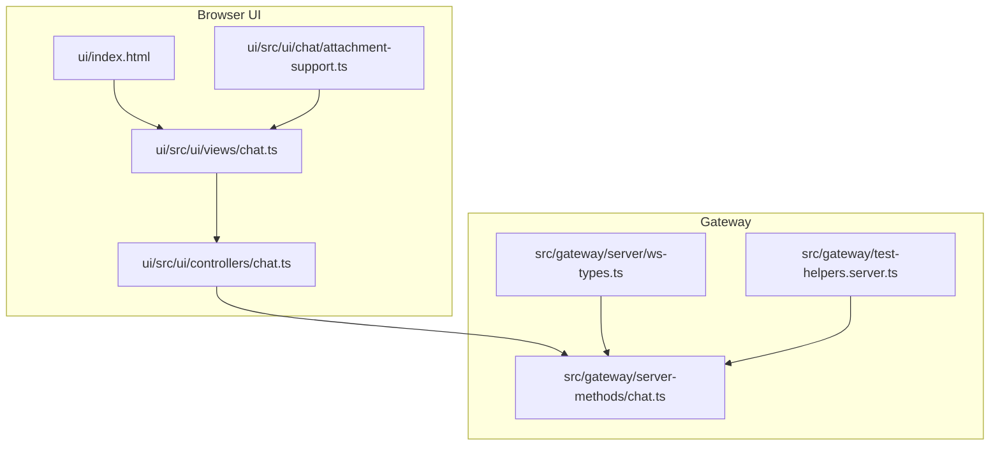
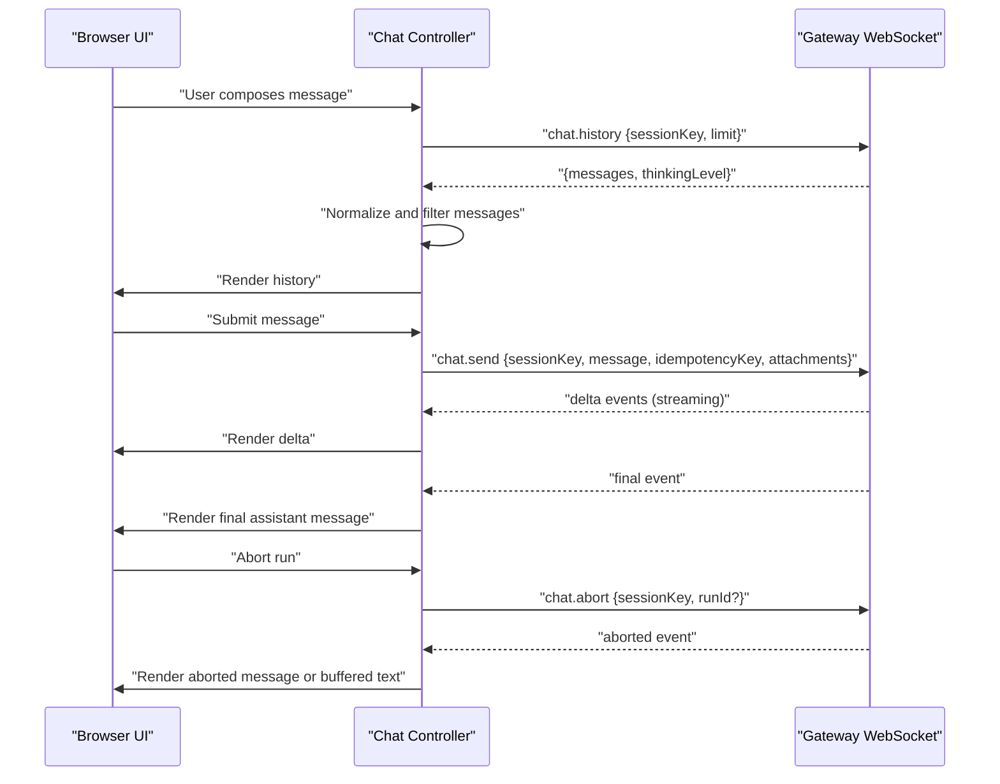
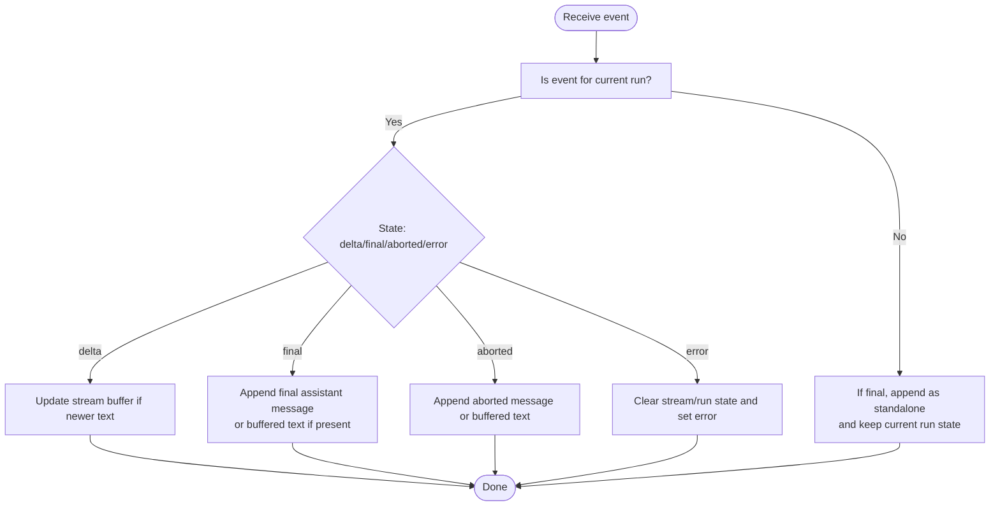
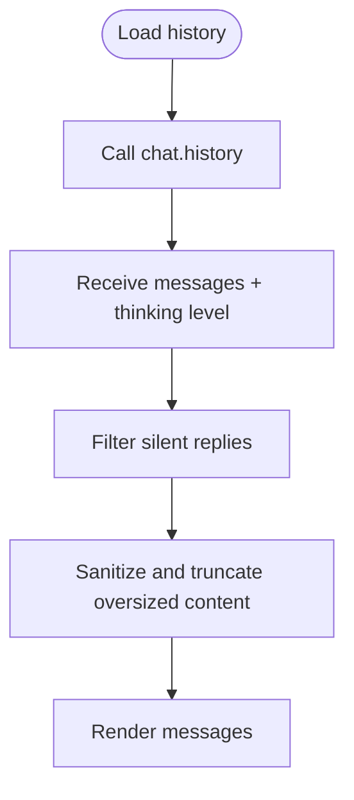
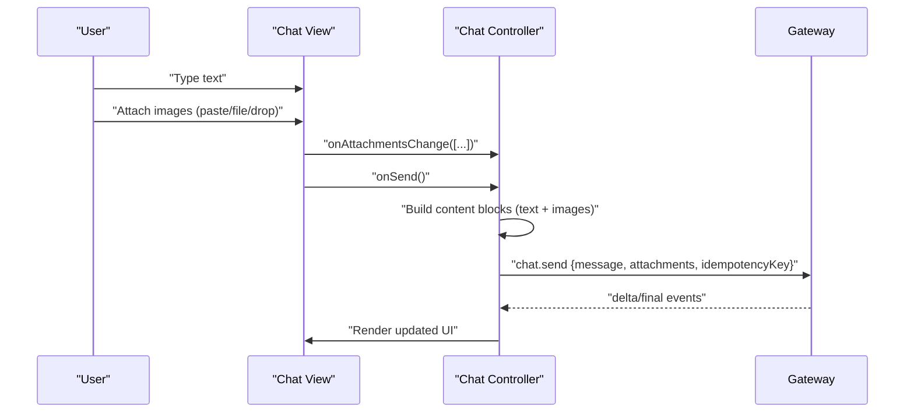
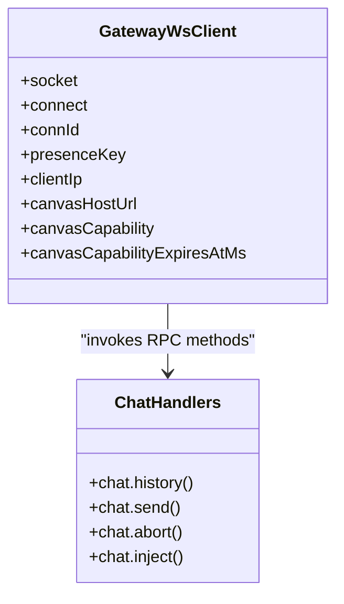
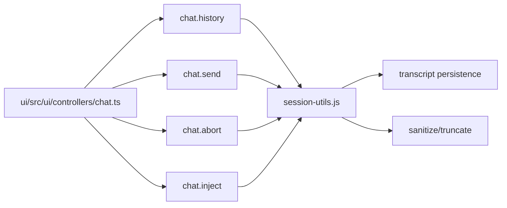

# WebChat

<cite>
**Referenced Files in This Document**
- [docs/web/webchat.md](file://docs/web/webchat.md)
- [ui/src/ui/controllers/chat.ts](file://ui/src/ui/controllers/chat.ts)
- [ui/src/ui/views/chat.ts](file://ui/src/ui/views/chat.ts)
- [ui/src/ui/chat/attachment-support.ts](file://ui/src/ui/chat/attachment-support.ts)
- [src/gateway/server-methods/chat.ts](file://src/gateway/server-methods/chat.ts)
- [src/gateway/server/ws-types.ts](file://src/gateway/server/ws-types.ts)
- [src/gateway/test-helpers.server.ts](file://src/gateway/test-helpers.server.ts)
- [ui/index.html](file://ui/index.html)
</cite>

## Table of Contents
1. [Introduction](#introduction)
2. [Project Structure](#project-structure)
3. [Core Components](#core-components)
4. [Architecture Overview](#architecture-overview)
5. [Detailed Component Analysis](#detailed-component-analysis)
6. [Dependency Analysis](#dependency-analysis)
7. [Performance Considerations](#performance-considerations)
8. [Troubleshooting Guide](#troubleshooting-guide)
9. [Conclusion](#conclusion)
10. [Appendices](#appendices)

## Introduction
This document explains OpenClaw’s WebChat: a browser-based chat interface that connects directly to the Gateway via WebSocket. It covers the real-time messaging system, chat rendering, message history management, input and attachment handling, rich text formatting, Gateway protocol integration, theming and responsiveness, persistence and offline behavior, and the relationship to the browser automation system and session handling. Practical guidance is included for customization, extensibility, and integration with external chat systems.

## Project Structure
WebChat spans two primary areas:
- Browser UI: a Lit-based chat view and controller that communicate with the Gateway over WebSocket.
- Gateway server: WebSocket handlers for chat.history, chat.send, chat.abort, and chat.inject, plus session and transcript persistence.

**Diagram sources**
- [ui/index.html:1-17](file://ui/index.html#L1-L17)
- [ui/src/ui/views/chat.ts:1-120](file://ui/src/ui/views/chat.ts#L1-L120)
- [ui/src/ui/controllers/chat.ts:67-94](file://ui/src/ui/controllers/chat.ts#L67-L94)
- [ui/src/ui/chat/attachment-support.ts:1-5](file://ui/src/ui/chat/attachment-support.ts#L1-L5)
- [src/gateway/server-methods/chat.ts:1-120](file://src/gateway/server-methods/chat.ts#L1-L120)
- [src/gateway/server/ws-types.ts:1-13](file://src/gateway/server/ws-types.ts#L1-L13)
- [src/gateway/test-helpers.server.ts:668-704](file://src/gateway/test-helpers.server.ts#L668-L704)

**Section sources**
- [docs/web/webchat.md:8-32](file://docs/web/webchat.md#L8-L32)
- [ui/index.html:1-17](file://ui/index.html#L1-L17)

## Core Components
- Browser chat controller: orchestrates connection state, loads history, sends messages, handles streaming deltas, aborts runs, and normalizes assistant messages.
- Browser chat view: renders messages, attachments, slash commands, search, pinned messages, and UI affordances (typing indicators, context notices).
- Attachment support: validates and reads image attachments for preview and transport.
- Gateway chat handlers: implement chat.history, chat.send, chat.abort, chat.inject, sanitization, truncation, and transcript persistence.
- WebSocket client typing: describes client connection metadata and capabilities.

**Section sources**
- [ui/src/ui/controllers/chat.ts:31-94](file://ui/src/ui/controllers/chat.ts#L31-L94)
- [ui/src/ui/views/chat.ts:54-120](file://ui/src/ui/views/chat.ts#L54-L120)
- [ui/src/ui/chat/attachment-support.ts:1-5](file://ui/src/ui/chat/attachment-support.ts#L1-L5)
- [src/gateway/server-methods/chat.ts:289-527](file://src/gateway/server-methods/chat.ts#L289-L527)
- [src/gateway/server/ws-types.ts:4-13](file://src/gateway/server/ws-types.ts#L4-L13)

## Architecture Overview
WebChat is a WebSocket-driven UI that:
- Connects to the Gateway and invokes RPC methods: chat.history, chat.send, chat.abort, chat.inject.
- Renders messages and streaming deltas in real time.
- Persists aborted partial assistant text into transcripts and marks entries with abort metadata.
- Enforces bounded history and sanitizes content for stability and safety.

**Diagram sources**
- [ui/src/ui/controllers/chat.ts:67-94](file://ui/src/ui/controllers/chat.ts#L67-L94)
- [ui/src/ui/controllers/chat.ts:153-244](file://ui/src/ui/controllers/chat.ts#L153-L244)
- [ui/src/ui/controllers/chat.ts:246-261](file://ui/src/ui/controllers/chat.ts#L246-L261)
- [ui/src/ui/controllers/chat.ts:263-337](file://ui/src/ui/controllers/chat.ts#L263-L337)
- [src/gateway/server-methods/chat.ts:733-763](file://src/gateway/server-methods/chat.ts#L733-L763)

**Section sources**
- [docs/web/webchat.md:24-32](file://docs/web/webchat.md#L24-L32)
- [src/gateway/server-methods/chat.ts:733-763](file://src/gateway/server-methods/chat.ts#L733-L763)

## Detailed Component Analysis

### Real-time Messaging and Streaming
- The controller tracks streaming state (runId, stream buffer, timestamps) and updates the UI on delta/final/aborted/error events.
- Assistant messages are normalized to ensure consistent content shapes and filtered for silent reply tokens.
- Aborted runs preserve buffered text and append it to history with abort metadata.

**Diagram sources**
- [ui/src/ui/controllers/chat.ts:263-337](file://ui/src/ui/controllers/chat.ts#L263-L337)

**Section sources**
- [ui/src/ui/controllers/chat.ts:263-337](file://ui/src/ui/controllers/chat.ts#L263-L337)

### Message History Management
- Loads bounded history from the Gateway and filters out silent replies.
- Sanitizes and truncates oversized content blocks and replaces oversized entries with placeholders.
- Ensures numeric usage/cost fields are finite to prevent UI crashes.

**Diagram sources**
- [ui/src/ui/controllers/chat.ts:67-94](file://ui/src/ui/controllers/chat.ts#L67-L94)
- [src/gateway/server-methods/chat.ts:509-527](file://src/gateway/server-methods/chat.ts#L509-L527)
- [src/gateway/server-methods/chat.ts:299-339](file://src/gateway/server-methods/chat.ts#L299-L339)
- [src/gateway/server-methods/chat.ts:348-401](file://src/gateway/server-methods/chat.ts#L348-L401)

**Section sources**
- [ui/src/ui/controllers/chat.ts:67-94](file://ui/src/ui/controllers/chat.ts#L67-L94)
- [src/gateway/server-methods/chat.ts:289-527](file://src/gateway/server-methods/chat.ts#L289-L527)

### Message Input, Attachments, and Rich Text
- Input composition supports text and image attachments. Images are base64-encoded and sent as content blocks.
- Attachment handling supports paste, file selection, and drag-and-drop with MIME filtering.
- Slash commands provide structured input and instant execution where applicable.
- Rich text formatting is supported via Markdown rendering in the chat view.

**Diagram sources**
- [ui/src/ui/views/chat.ts:301-335](file://ui/src/ui/views/chat.ts#L301-L335)
- [ui/src/ui/views/chat.ts:337-395](file://ui/src/ui/views/chat.ts#L337-L395)
- [ui/src/ui/controllers/chat.ts:153-244](file://ui/src/ui/controllers/chat.ts#L153-L244)
- [ui/src/ui/chat/attachment-support.ts:1-5](file://ui/src/ui/chat/attachment-support.ts#L1-L5)

**Section sources**
- [ui/src/ui/views/chat.ts:301-395](file://ui/src/ui/views/chat.ts#L301-L395)
- [ui/src/ui/controllers/chat.ts:153-244](file://ui/src/ui/controllers/chat.ts#L153-L244)
- [ui/src/ui/chat/attachment-support.ts:1-5](file://ui/src/ui/chat/attachment-support.ts#L1-L5)

### Gateway Protocol Integration
- The UI invokes chat.history, chat.send, chat.abort, and chat.inject over the Gateway WebSocket.
- The Gateway enforces idempotency keys, deduplication, and sanitization.
- Delivery routing respects explicit deliver flags and session scoping; WebChat clients do not inherit external delivery routes.

**Diagram sources**
- [src/gateway/server/ws-types.ts:4-13](file://src/gateway/server/ws-types.ts#L4-L13)
- [src/gateway/server-methods/chat.ts:1-120](file://src/gateway/server-methods/chat.ts#L1-L120)

**Section sources**
- [docs/web/webchat.md:26-31](file://docs/web/webchat.md#L26-L31)
- [src/gateway/server-methods/chat.ts:144-239](file://src/gateway/server-methods/chat.ts#L144-L239)

### Persistence, Offline Behavior, and Synchronization
- Gateway persists aborted partial assistant text into transcript history and marks entries with abort metadata.
- History is always fetched from the Gateway; there is no local file watching.
- If the Gateway is unreachable, WebChat is read-only.

**Section sources**
- [docs/web/webchat.md:24-32](file://docs/web/webchat.md#L24-L32)
- [src/gateway/server-methods/chat.ts:733-763](file://src/gateway/server-methods/chat.ts#L733-L763)

### Relationship to Browser Automation and Session Handling
- WebChat is a native chat UI for the Gateway and uses the same sessions and routing rules as other channels.
- Deterministic routing ensures replies always return to WebChat.
- The Gateway distinguishes WebChat clients from CLI and other clients for routing decisions.

**Section sources**
- [docs/web/webchat.md:12-16](file://docs/web/webchat.md#L12-L16)
- [src/gateway/server-methods/chat.ts:195-217](file://src/gateway/server-methods/chat.ts#L195-L217)

### Theming, Customization, and Responsive Design
- The UI index declares a color-scheme meta tag enabling dark/light themes.
- The chat view renders context notices with dynamic colors and compact token formatting.
- The UI uses a resizable divider component and responsive layout primitives.

**Section sources**
- [ui/index.html:7-8](file://ui/index.html#L7-L8)
- [ui/src/ui/views/chat.ts:254-295](file://ui/src/ui/views/chat.ts#L254-L295)
- [ui/src/ui/views/chat.ts:36-36](file://ui/src/ui/views/chat.ts#L36-L36)

### Extending Chat Functionality and Integrating External Systems
- chat.inject allows appending assistant notes directly to the transcript and broadcasting to the UI without invoking an agent run.
- chat.abort enables cancellation of runs and preserves buffered assistant text for persistence.
- chat.history is bounded and sanitized for stability; oversized entries are replaced with placeholders.

**Section sources**
- [docs/web/webchat.md:27-31](file://docs/web/webchat.md#L27-L31)
- [src/gateway/server-methods/chat.ts:529-567](file://src/gateway/server-methods/chat.ts#L529-L567)
- [src/gateway/server-methods/chat.ts:733-763](file://src/gateway/server-methods/chat.ts#L733-L763)

## Dependency Analysis
- UI depends on Gateway RPC methods for chat operations.
- Gateway handlers depend on session utilities, sanitization, and transcript persistence.
- Test helpers demonstrate connecting a WebChat client and validating handshake.

**Diagram sources**
- [ui/src/ui/controllers/chat.ts:67-94](file://ui/src/ui/controllers/chat.ts#L67-L94)
- [src/gateway/server-methods/chat.ts:509-527](file://src/gateway/server-methods/chat.ts#L509-L527)
- [src/gateway/server-methods/chat.ts:529-567](file://src/gateway/server-methods/chat.ts#L529-L567)
- [src/gateway/server-methods/chat.ts:639-706](file://src/gateway/server-methods/chat.ts#L639-L706)

**Section sources**
- [src/gateway/server-methods/chat.ts:509-706](file://src/gateway/server-methods/chat.ts#L509-L706)
- [src/gateway/test-helpers.server.ts:668-704](file://src/gateway/test-helpers.server.ts#L668-L704)

## Performance Considerations
- History is bounded and sanitized to control payload size and prevent UI crashes.
- Oversized messages are truncated or replaced with placeholders to maintain stability.
- Streaming deltas update the UI incrementally to reduce perceived latency.

[No sources needed since this section provides general guidance]

## Troubleshooting Guide
- If the Gateway is unreachable, WebChat becomes read-only. Verify connectivity and authentication.
- Authentication failures: ensure Gateway auth is configured (required by default, even on loopback).
- Silent replies: assistant messages containing only silent reply tokens are filtered from history.
- Aborted runs: buffered assistant text is persisted with abort metadata; verify transcript entries for partial content.

**Section sources**
- [docs/web/webchat.md:20-32](file://docs/web/webchat.md#L20-L32)
- [ui/src/ui/controllers/chat.ts:14-29](file://ui/src/ui/controllers/chat.ts#L14-L29)
- [src/gateway/server-methods/chat.ts:733-763](file://src/gateway/server-methods/chat.ts#L733-L763)

## Conclusion
WebChat delivers a robust, real-time chat experience powered by the Gateway’s WebSocket protocol. Its UI is responsive, supports attachments and slash commands, and integrates tightly with session routing and transcript persistence. By leveraging chat.inject, chat.abort, and bounded history, it balances functionality, reliability, and performance.

[No sources needed since this section summarizes without analyzing specific files]

## Appendices

### Practical Examples and Recipes
- Customize thinking level and tool visibility via the UI props exposed to the chat view.
- Theme support: rely on the declared color-scheme meta tag and ensure CSS respects dark/light modes.
- Responsive layout: use the resizable divider and adjust container widths for different screen sizes.
- Extend input handling: add new slash commands and ensure they integrate with the slash menu rendering and execution pipeline.

**Section sources**
- [ui/src/ui/views/chat.ts:54-120](file://ui/src/ui/views/chat.ts#L54-L120)
- [ui/index.html:7-8](file://ui/index.html#L7-L8)
- [ui/src/ui/views/chat.ts:424-545](file://ui/src/ui/views/chat.ts#L424-L545)