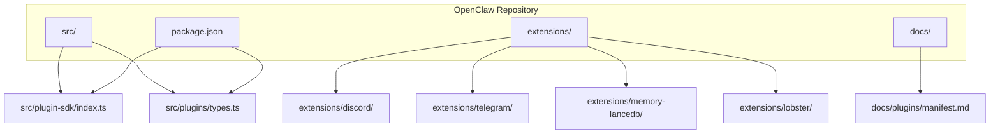
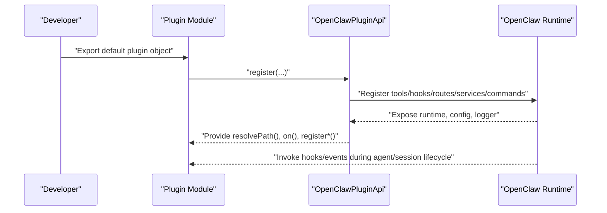
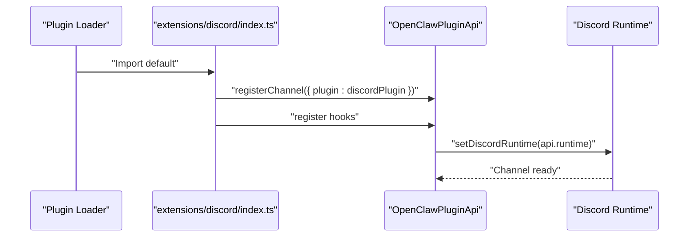
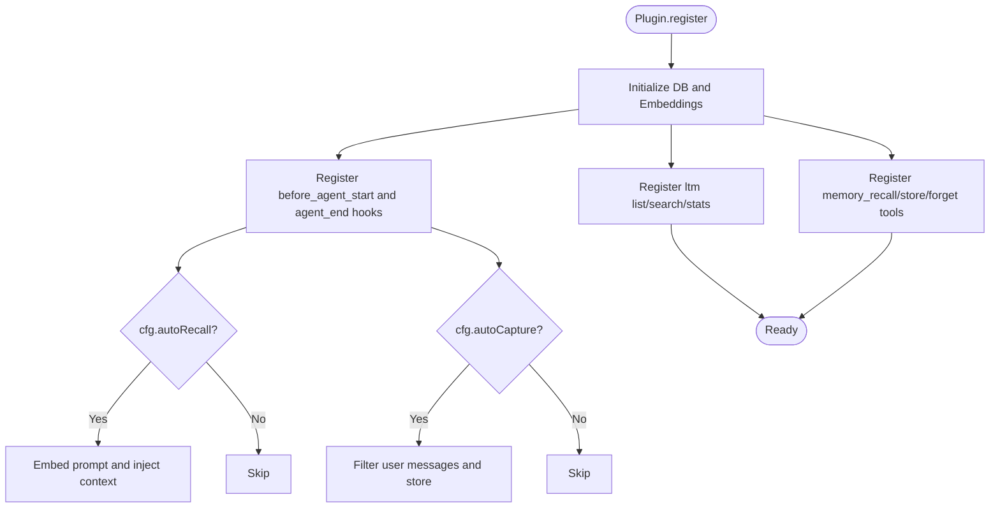
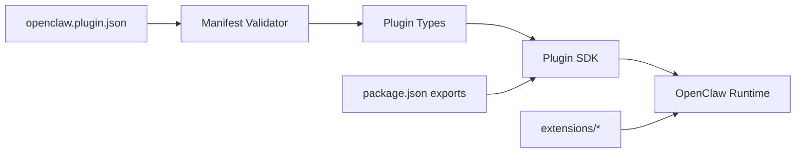

# Development Workflow

<cite>
**Referenced Files in This Document**
- [README.md](file://README.md)
- [package.json](file://package.json)
- [src/plugin-sdk/index.ts](file://src/plugin-sdk/index.ts)
- [src/plugins/types.ts](file://src/plugins/types.ts)
- [docs/plugins/manifest.md](file://docs/plugins/manifest.md)
- [extensions/discord/index.ts](file://extensions/discord/index.ts)
- [extensions/telegram/index.ts](file://extensions/telegram/index.ts)
- [extensions/memory-lancedb/index.ts](file://extensions/memory-lancedb/index.ts)
- [extensions/lobster/index.ts](file://extensions/lobster/index.ts)
</cite>

## Table of Contents
1. [Introduction](#introduction)
2. [Project Structure](#project-structure)
3. [Core Components](#core-components)
4. [Architecture Overview](#architecture-overview)
5. [Detailed Component Analysis](#detailed-component-analysis)
6. [Dependency Analysis](#dependency-analysis)
7. [Performance Considerations](#performance-considerations)
8. [Troubleshooting Guide](#troubleshooting-guide)
9. [Conclusion](#conclusion)
10. [Appendices](#appendices)

## Introduction
This guide explains how to develop OpenClaw plugins from setup to deployment. It covers the development environment, project layout, plugin SDK, manifest requirements, build and packaging, testing, debugging, and distribution. Practical examples demonstrate creating channel plugins, memory plugins, and tool-based plugins, along with implementing hooks and handling plugin events.

## Project Structure
OpenClaw is a monorepo with multiple concerns:
- Core runtime and platform under src/
- Example plugins under extensions/
- Documentation under docs/
- Build and packaging configuration under package.json and scripts
- Companion apps under apps/

Key areas for plugin development:
- Plugin SDK surface exposed via src/plugin-sdk/index.ts
- Plugin types and lifecycle under src/plugins/types.ts
- Manifest schema and validation under docs/plugins/manifest.md
- Example plugins under extensions/ (e.g., discord, telegram, memory-lancedb, lobster)

**Diagram sources**
- [src/plugin-sdk/index.ts](file://src/plugin-sdk/index.ts#L1-L812)
- [src/plugins/types.ts](file://src/plugins/types.ts#L1-L893)
- [docs/plugins/manifest.md](file://docs/plugins/manifest.md#L1-L76)
- [package.json](file://package.json#L1-L458)

**Section sources**
- [README.md](file://README.md#L92-L111)
- [package.json](file://package.json#L1-L458)

## Core Components
- Plugin SDK: Central exports for channel adapters, runtime helpers, webhook utilities, status helpers, and more. See [src/plugin-sdk/index.ts](file://src/plugin-sdk/index.ts#L1-L812).
- Plugin types: Defines OpenClawPluginApi, hook names, tool contexts, HTTP routes, CLI registration, services, and provider auth. See [src/plugins/types.ts](file://src/plugins/types.ts#L1-L893).
- Plugin manifest: Required openclaw.plugin.json with strict schema validation. See [docs/plugins/manifest.md](file://docs/plugins/manifest.md#L1-L76).

Key responsibilities:
- Define plugin entry points and registration APIs
- Provide channel-specific adapters and normalization helpers
- Offer lifecycle hooks for agent/session/tool/message events
- Enforce configuration validation via JSON Schema

**Section sources**
- [src/plugin-sdk/index.ts](file://src/plugin-sdk/index.ts#L1-L812)
- [src/plugins/types.ts](file://src/plugins/types.ts#L248-L306)
- [docs/plugins/manifest.md](file://docs/plugins/manifest.md#L9-L76)

## Architecture Overview
OpenClaw’s plugin system integrates with the runtime through a typed API. Plugins register tools, hooks, HTTP routes, CLI commands, services, and channel adapters. The manifest ensures configuration correctness before runtime.

**Diagram sources**
- [src/plugins/types.ts](file://src/plugins/types.ts#L263-L306)
- [src/plugin-sdk/index.ts](file://src/plugin-sdk/index.ts#L125-L176)

## Detailed Component Analysis

### Plugin SDK Surface
The SDK re-exports channel adapters, runtime helpers, webhook utilities, and status helpers. It centralizes:
- Channel adapters and normalization helpers
- Runtime store, keyed queues, webhook targets, and guards
- Status builders, allowlist resolution, and command auth
- Windows spawn helpers and persistent dedupe caches
- SSRF guards and fetch utilities

Practical usage:
- Import SDK helpers for channel-specific tasks (e.g., Discord, Telegram)
- Use runtime store and queues for concurrency control
- Register HTTP routes and webhook targets for external integrations

**Section sources**
- [src/plugin-sdk/index.ts](file://src/plugin-sdk/index.ts#L1-L812)

### Plugin Types and Lifecycle
The plugin system defines:
- OpenClawPluginApi: Registration surface for tools, hooks, HTTP routes, CLI, services, providers, and commands
- Hook names: Comprehensive set covering model resolution, prompt building, agent lifecycle, compaction, message flow, tool calls, session lifecycle, subagent spawning, and gateway lifecycle
- Tool context: Includes session identifiers, requester sender, sandbox flag, and workspace paths
- HTTP route params: Path, handler, auth mode, and matching strategy
- CLI registrar: Program, config, workspace dir, and logger injection

Lifecycle hooks enable:
- Pre/post agent runs (model resolve, prompt build, agent start/end)
- Message lifecycle (received, sending, sent)
- Tool call lifecycle (before/after, result persist)
- Session lifecycle (start/end)
- Subagent lifecycle (spawning/delivery/spawned/ended)
- Gateway lifecycle (start/stop)

**Section sources**
- [src/plugins/types.ts](file://src/plugins/types.ts#L248-L306)
- [src/plugins/types.ts](file://src/plugins/types.ts#L321-L372)
- [src/plugins/types.ts](file://src/plugins/types.ts#L397-L488)
- [src/plugins/types.ts](file://src/plugins/types.ts#L490-L517)
- [src/plugins/types.ts](file://src/plugins/types.ts#L519-L526)
- [src/plugins/types.ts](file://src/plugins/types.ts#L527-L556)
- [src/plugins/types.ts](file://src/plugins/types.ts#L558-L591)
- [src/plugins/types.ts](file://src/plugins/types.ts#L593-L657)
- [src/plugins/types.ts](file://src/plugins/types.ts#L659-L669)
- [src/plugins/types.ts](file://src/plugins/types.ts#L671-L691)
- [src/plugins/types.ts](file://src/plugins/types.ts#L693-L770)
- [src/plugins/types.ts](file://src/plugins/types.ts#L771-L784)

### Plugin Manifest and Validation
Every plugin must include openclaw.plugin.json in its root with:
- id: canonical plugin id
- configSchema: JSON Schema for plugin config
- Optional: kind, channels, providers, skills, name, description, uiHints, version

Validation behavior:
- Unknown channel/provider keys are errors unless declared by a manifest
- plugins entries must reference discoverable plugin ids
- Broken or missing manifest prevents config validation
- Disabled plugin with existing config emits warnings

**Section sources**
- [docs/plugins/manifest.md](file://docs/plugins/manifest.md#L9-L76)

### Example: Channel Plugin (Discord)
A channel plugin registers a ChannelPlugin and sets runtime context:
- Imports SDK helpers and channel adapter
- Exports default plugin with id, name, description, configSchema
- Registers channel adapter and runtime in register()

**Diagram sources**
- [extensions/discord/index.ts](file://extensions/discord/index.ts#L1-L20)

**Section sources**
- [extensions/discord/index.ts](file://extensions/discord/index.ts#L1-L20)

### Example: Channel Plugin (Telegram)
A minimal Telegram plugin:
- Imports SDK helpers and channel adapter
- Exports default plugin with id, name, description, empty config schema
- Registers channel adapter in register()

**Section sources**
- [extensions/telegram/index.ts](file://extensions/telegram/index.ts#L1-L18)

### Example: Memory Plugin (LanceDB)
A memory plugin demonstrates:
- Tool registration (recall, store, forget)
- CLI commands (list, search, stats)
- Lifecycle hooks (auto-recall, auto-capture)
- Service registration

Highlights:
- Uses SDK for embedding and vector search
- Implements lifecycle hooks to inject context and capture memories
- Provides CLI commands for diagnostics

**Diagram sources**
- [extensions/memory-lancedb/index.ts](file://extensions/memory-lancedb/index.ts#L292-L679)

**Section sources**
- [extensions/memory-lancedb/index.ts](file://extensions/memory-lancedb/index.ts#L1-L679)

### Example: Tool Plugin (Lobster)
A tool plugin:
- Registers a tool factory that conditionally creates tools based on sandboxed context
- Uses SDK to create tool instances
- Marks tool as optional

**Section sources**
- [extensions/lobster/index.ts](file://extensions/lobster/index.ts#L1-L19)

## Dependency Analysis
OpenClaw’s plugin system relies on:
- Plugin SDK exports for channel adapters and utilities
- Plugin types for API contracts and hook definitions
- Manifest validation for configuration correctness
- Build scripts and package exports for distribution

**Diagram sources**
- [docs/plugins/manifest.md](file://docs/plugins/manifest.md#L9-L76)
- [src/plugins/types.ts](file://src/plugins/types.ts#L248-L306)
- [src/plugin-sdk/index.ts](file://src/plugin-sdk/index.ts#L1-L812)
- [package.json](file://package.json#L37-L216)

**Section sources**
- [package.json](file://package.json#L37-L216)
- [src/plugin-sdk/index.ts](file://src/plugin-sdk/index.ts#L1-L812)
- [src/plugins/types.ts](file://src/plugins/types.ts#L248-L306)
- [docs/plugins/manifest.md](file://docs/plugins/manifest.md#L9-L76)

## Performance Considerations
- Use keyed async queues for rate limiting and concurrency control
- Apply webhook in-flight limits and body size guards
- Prefer streaming and chunked text/media delivery for outbound messages
- Cache embeddings and vectors judiciously; leverage vector dimension hints
- Limit auto-capture frequency and content length thresholds

[No sources needed since this section provides general guidance]

## Troubleshooting Guide
Common issues and remedies:
- Manifest errors: Ensure openclaw.plugin.json exists and schema is valid; unknown channel/provider keys will fail validation
- Missing plugin config: If disabled but config exists, Doctor will warn; enable plugin or remove config
- Hook misuse: Verify hook names and signatures against PluginHookName and event/result types
- Webhook abuse: Use in-flight limits and body guards; monitor anomaly counters
- Memory plugin initialization: On platforms lacking native bindings, loading LanceDB may fail—install prerequisites or switch providers

**Section sources**
- [docs/plugins/manifest.md](file://docs/plugins/manifest.md#L53-L76)
- [src/plugins/types.ts](file://src/plugins/types.ts#L321-L372)
- [src/plugin-sdk/index.ts](file://src/plugin-sdk/index.ts#L428-L440)

## Conclusion
OpenClaw’s plugin system offers a robust, typed API for extending channels, tools, memory, and lifecycle behaviors. By adhering to manifest requirements, leveraging SDK helpers, and registering hooks thoughtfully, developers can build reliable, testable, and distributable plugins.

[No sources needed since this section summarizes without analyzing specific files]

## Appendices

### Development Environment Setup
- Runtime: Node ≥22
- Package manager: Prefer pnpm for builds; bun optional for running TypeScript directly
- Recommended workflow: Use pnpm scripts for build, watch, and tests

**Section sources**
- [README.md](file://README.md#L50-L111)
- [package.json](file://package.json#L217-L334)

### Build and Packaging
- Build pipeline: TypeScript transpile, plugin SDK DTS generation, aliasing, and metadata writing
- Exports: Multiple plugin SDK entry points for different channels and utilities
- Distribution: Files include bin, dist, docs, extensions, skills

**Section sources**
- [package.json](file://package.json#L217-L234)
- [package.json](file://package.json#L37-L216)

### Testing Strategies
- Unit and integration tests via Vitest configurations
- Channel-specific and extension tests
- E2E and live tests for gateway and models
- Parallel test runner for speed

**Section sources**
- [package.json](file://package.json#L301-L334)

### Debugging Techniques
- Use plugin logger to emit structured logs
- Enable verbose logging and diagnostics
- Inspect hook events and tool call results
- Validate webhook requests and anomalies

**Section sources**
- [src/plugins/types.ts](file://src/plugins/types.ts#L22-L27)
- [src/plugin-sdk/index.ts](file://src/plugin-sdk/index.ts#L606-L628)

### Versioning and Distribution
- Manifest version: informational; use semantic versioning for releases
- Slots and kinds: Select exclusive kinds via plugins.slots.*
- Dependencies: Respect overrides and onlyBuiltDependencies for native modules

**Section sources**
- [docs/plugins/manifest.md](file://docs/plugins/manifest.md#L38-L76)
- [package.json](file://package.json#L420-L456)