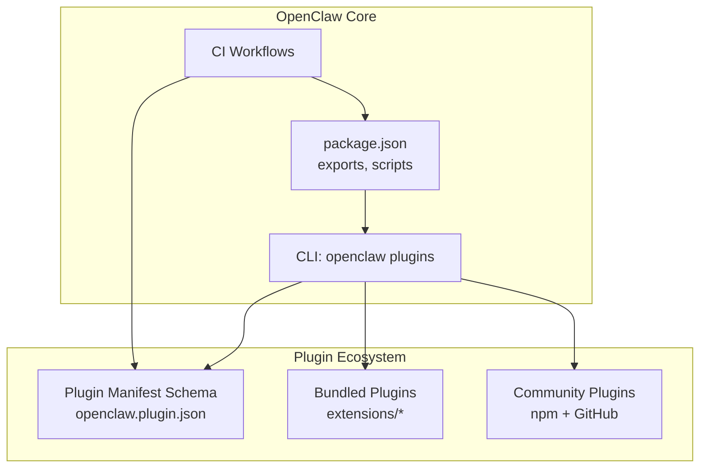
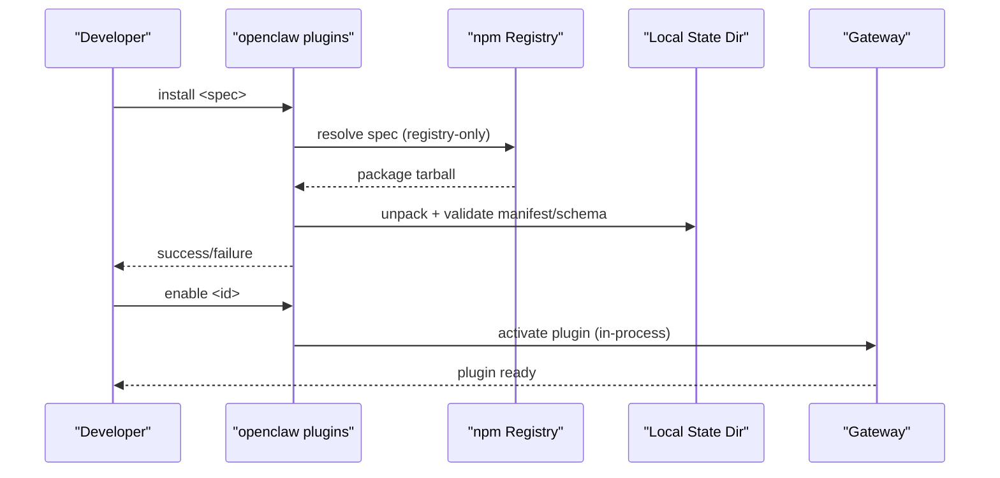
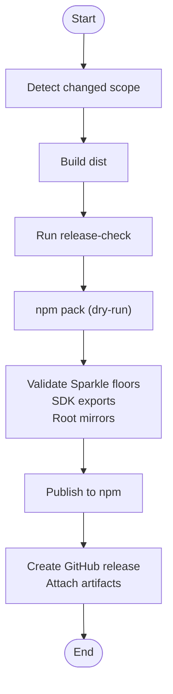
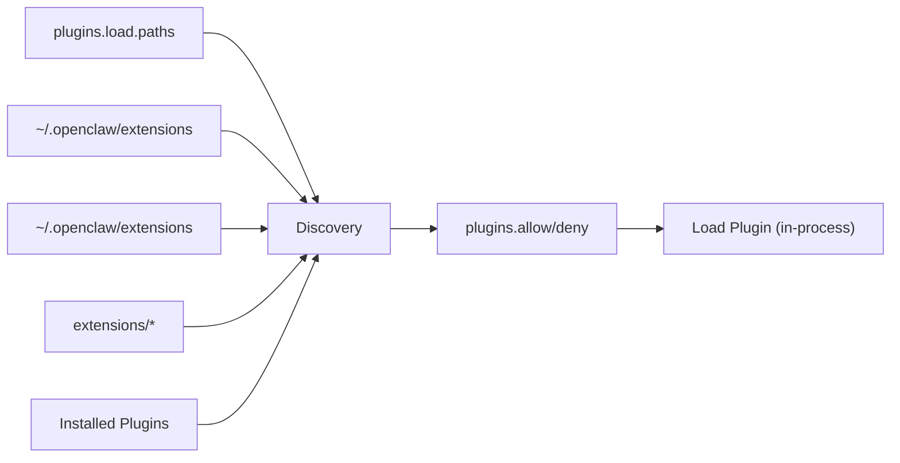

# Distribution & Deployment

<cite>
**Referenced Files in This Document**
- [docs/plugins/manifest.md](file://docs/plugins/manifest.md)
- [docs/plugins/community.md](file://docs/plugins/community.md)
- [docs/cli/plugins.md](file://docs/cli/plugins.md)
- [docs/tools/plugin.md](file://docs/tools/plugin.md)
- [docs/refactor/plugin-sdk.md](file://docs/refactor/plugin-sdk.md)
- [docs/reference/RELEASING.md](file://docs/reference/RELEASING.md)
- [scripts/release-check.ts](file://scripts/release-check.ts)
- [scripts/sync-plugin-versions.ts](file://scripts/sync-plugin-versions.ts)
- [package.json](file://package.json)
- [.github/workflows/ci.yml](file://.github/workflows/ci.yml)
- [extensions/acpx/openclaw.plugin.json](file://extensions/acpx/openclaw.plugin.json)
- [extensions/diffs/openclaw.plugin.json](file://extensions/diffs/openclaw.plugin.json)
</cite>

## Table of Contents
1. [Introduction](#introduction)
2. [Project Structure](#project-structure)
3. [Core Components](#core-components)
4. [Architecture Overview](#architecture-overview)
5. [Detailed Component Analysis](#detailed-component-analysis)
6. [Dependency Analysis](#dependency-analysis)
7. [Performance Considerations](#performance-considerations)
8. [Troubleshooting Guide](#troubleshooting-guide)
9. [Conclusion](#conclusion)
10. [Appendices](#appendices)

## Introduction
This document explains how to distribute and deploy OpenClaw plugins. It covers packaging requirements, distribution channels, installation procedures, versioning, dependency management, compatibility, the plugin marketplace and community submission process, documentation and licensing expectations, and automated deployment and release management.

## Project Structure
OpenClaw ships a plugin system with:
- Official bundled plugins under extensions/
- A plugin manifest schema enforced at install time
- A CLI for installing, enabling, disabling, updating, and diagnosing plugins
- CI/CD and release tooling to validate packaging and version alignment

**Diagram sources**
- [package.json](file://package.json#L1-L458)
- [docs/cli/plugins.md](file://docs/cli/plugins.md#L1-L103)
- [docs/plugins/manifest.md](file://docs/plugins/manifest.md#L1-L76)
- [.github/workflows/ci.yml](file://.github/workflows/ci.yml#L1-L765)

**Section sources**
- [package.json](file://package.json#L1-L458)
- [docs/plugins/manifest.md](file://docs/plugins/manifest.md#L1-L76)
- [docs/cli/plugins.md](file://docs/cli/plugins.md#L1-L103)
- [.github/workflows/ci.yml](file://.github/workflows/ci.yml#L1-L765)

## Core Components
- Plugin manifest and schema: Every plugin must include a manifest with a JSON Schema for configuration. The system validates configuration without executing plugin code.
- Installation and management: The CLI supports installing from npm, linking local directories, updating, enabling/disabling, and diagnosing issues.
- Versioning and synchronization: Root version drives plugin versions; a script synchronizes plugin versions and changelogs.
- Release validation: A release checker ensures npm pack contents, Sparkle appcast version floors, plugin SDK exports, and root dependency mirrors are correct.
- CI/CD: Automated checks for docs, tests, platform builds, and secrets scanning; release validation runs on pushes.

**Section sources**
- [docs/plugins/manifest.md](file://docs/plugins/manifest.md#L1-L76)
- [docs/cli/plugins.md](file://docs/cli/plugins.md#L1-L103)
- [scripts/sync-plugin-versions.ts](file://scripts/sync-plugin-versions.ts#L1-L109)
- [scripts/release-check.ts](file://scripts/release-check.ts#L1-L451)
- [.github/workflows/ci.yml](file://.github/workflows/ci.yml#L1-L765)

## Architecture Overview
The plugin distribution pipeline integrates CLI, manifests, CI, and release tooling.

**Diagram sources**
- [docs/cli/plugins.md](file://docs/cli/plugins.md#L1-L103)
- [docs/plugins/manifest.md](file://docs/plugins/manifest.md#L1-L76)

## Detailed Component Analysis

### Plugin Packaging Requirements
- Manifest requirement: Every plugin must include openclaw.plugin.json in its root. The manifest defines id, configSchema, and optional metadata (kind, channels, providers, skills, uiHints, version).
- JSON Schema: A strict inline JSON Schema is required for config validation. Empty schemas are acceptable.
- Skills: Plugins may list skills directories to load relative to the plugin root.
- Native modules: If a plugin depends on native modules, document build steps and any package-manager allowlists (for example, rebuild steps).

Examples of manifests:
- ACPX plugin manifest demonstrates a rich configSchema and uiHints.
- Diffs plugin manifest demonstrates defaults and security settings.

**Section sources**
- [docs/plugins/manifest.md](file://docs/plugins/manifest.md#L1-L76)
- [extensions/acpx/openclaw.plugin.json](file://extensions/acpx/openclaw.plugin.json#L1-L106)
- [extensions/diffs/openclaw.plugin.json](file://extensions/diffs/openclaw.plugin.json#L1-L183)

### Distribution Channels
- Official plugins: Bundled under extensions/ and distributed via npm under the @openclaw scope.
- Community plugins: Third-party plugins listed in the community page; must be installable via npm and hosted on GitHub with docs and an issue tracker.
- Installation sources: CLI supports installing from npm specs, local archives (.zip, .tgz, .tar.gz, .tar), and local directories (with optional linking).

**Section sources**
- [docs/plugins/community.md](file://docs/plugins/community.md#L1-L52)
- [docs/cli/plugins.md](file://docs/cli/plugins.md#L1-L103)
- [docs/reference/RELEASING.md](file://docs/reference/RELEASING.md#L93-L122)

### Installation Procedures
- Install from npm: Use registry-only specs; bare specs and @latest remain on the stable track; prereleases require explicit tags or exact versions.
- Archives and local installs: Supported archive formats; local installs can link (avoid copying) for development.
- Pinning: Use --pin to record the exact resolved spec in plugins.installs.
- Enable/disable/update: After install, enable the plugin; updates apply only to npm-installed plugins with stored integrity metadata.

**Section sources**
- [docs/cli/plugins.md](file://docs/cli/plugins.md#L1-L103)

### Versioning, Dependency Management, and Compatibility
- Root version alignment: The root package version drives plugin versions. A script synchronizes plugin versions and changelogs.
- Plugin SDK exports: Release validation enforces critical exports from dist/plugin-sdk/index.js.
- Root dependency mirrors: Release validation checks that bundled extension dependencies mirror root package dependencies according to an allowlist.
- Compatibility: The plugin SDK refactor proposes a stable SDK and runtime surface; plugins declare required runtime ranges.

**Section sources**
- [scripts/sync-plugin-versions.ts](file://scripts/sync-plugin-versions.ts#L1-L109)
- [scripts/release-check.ts](file://scripts/release-check.ts#L221-L267)
- [scripts/release-check.ts](file://scripts/release-check.ts#L346-L405)
- [scripts/release-check.ts](file://scripts/release-check.ts#L188-L210)
- [docs/refactor/plugin-sdk.md](file://docs/refactor/plugin-sdk.md#L188-L193)

### Plugin Marketplace and Community Submission
- Listing criteria: Published on npm, hosted on GitHub, includes setup/use docs and an issue tracker, and signals active maintenance.
- Submission path: Open a PR adding the plugin with name, npm package, repo URL, one-line description, and install command.
- Review bar: Prefer useful, documented, and safe plugins; low-effort wrappers or unmaintained packages may be declined.

**Section sources**
- [docs/plugins/community.md](file://docs/plugins/community.md#L1-L52)

### Documentation, Licensing, and Support Requirements
- Documentation: Include setup/use docs and an issue tracker in the repository.
- Licensing: The project is MIT licensed; ensure plugin licensing is compatible.
- Support: Maintain responsiveness to issues and updates.

**Section sources**
- [docs/plugins/community.md](file://docs/plugins/community.md#L15-L21)
- [package.json](file://package.json#L10-L10)

### Automated Deployment Pipelines, CI/CD Integration, and Release Management
- CI jobs: Detect docs-only changes, scope changed areas, build artifacts, run checks (tests, lint, format), secrets scanning, and platform-specific jobs (Windows, macOS, Android).
- Release validation: npm pack dry-run, Sparkle appcast version floors, plugin SDK exports, and root dependency mirrors.
- Release checklist: Version bump, plugin sync, build artifacts, changelog, validation, macOS app Sparkle appcast generation, publish to npm, GitHub release, and announcements.

**Diagram sources**
- [.github/workflows/ci.yml](file://.github/workflows/ci.yml#L1-L765)
- [scripts/release-check.ts](file://scripts/release-check.ts#L407-L446)
- [docs/reference/RELEASING.md](file://docs/reference/RELEASING.md#L1-L122)

**Section sources**
- [.github/workflows/ci.yml](file://.github/workflows/ci.yml#L1-L765)
- [scripts/release-check.ts](file://scripts/release-check.ts#L1-L451)
- [docs/reference/RELEASING.md](file://docs/reference/RELEASING.md#L1-L122)

## Dependency Analysis
- Plugin discovery and precedence: Config paths, workspace/global extensions, bundled extensions, then installed plugins. Hardening includes safety checks for candidate paths and provenance warnings.
- Package packs: A package.json with openclaw.extensions can split a directory into multiple plugins.
- Security guardrails: Dependencies are installed with lifecycle scripts disabled; openclaw.plugins.install rejects git/url/file specs and semver ranges.

**Diagram sources**
- [docs/tools/plugin.md](file://docs/tools/plugin.md#L228-L304)

**Section sources**
- [docs/tools/plugin.md](file://docs/tools/plugin.md#L228-L304)

## Performance Considerations
- Plugin discovery and manifest caching: Short in-process caches reduce bursty startup/reload work; caches can be tuned or disabled via environment variables.
- Windows test sharding: CI uses sharded test runs to balance resource usage on Windows runners.

**Section sources**
- [docs/tools/plugin.md](file://docs/tools/plugin.md#L219-L227)
- [.github/workflows/ci.yml](file://.github/workflows/ci.yml#L357-L481)

## Troubleshooting Guide
Common issues and resolutions:
- Missing or invalid manifest/schema: Blocks config validation; ensure openclaw.plugin.json exists and configSchema is valid.
- Pre-release npm specs: Bare specs and @latest remain on stable track; use explicit prerelease tags or exact prerelease versions.
- Integrity changes on update: When stored integrity hash changes, OpenClaw warns and asks for confirmation; use global --yes in CI/non-interactive runs.
- Forbidden files in npm pack: Ensure dist/OpenClaw.app is excluded; whitelist publish contents via package.json files.
- Plugin SDK exports missing: Release validation requires critical exports from dist/plugin-sdk/index.js.

**Section sources**
- [docs/plugins/manifest.md](file://docs/plugins/manifest.md#L53-L63)
- [docs/cli/plugins.md](file://docs/cli/plugins.md#L34-L56)
- [docs/cli/plugins.md](file://docs/cli/plugins.md#L100-L103)
- [scripts/release-check.ts](file://scripts/release-check.ts#L346-L405)
- [docs/reference/RELEASING.md](file://docs/reference/RELEASING.md#L76-L82)

## Conclusion
OpenClaw’s plugin distribution and deployment system emphasizes safety, transparency, and automation. By adhering to manifest and schema requirements, following the CLI installation procedures, aligning versions with the release process, and meeting community submission criteria, plugin authors can deliver reliable, maintainable plugins that integrate seamlessly with OpenClaw.

## Appendices
- Plugin manifest schema reference: Required id and configSchema; optional metadata and uiHints.
- CLI reference: List, info, enable, disable, uninstall, doctor, update, install with archive and link support.
- Plugin SDK refactor: Stable SDK and runtime surface to unify messaging connectors.

**Section sources**
- [docs/plugins/manifest.md](file://docs/plugins/manifest.md#L18-L76)
- [docs/cli/plugins.md](file://docs/cli/plugins.md#L19-L103)
- [docs/refactor/plugin-sdk.md](file://docs/refactor/plugin-sdk.md#L1-L215)