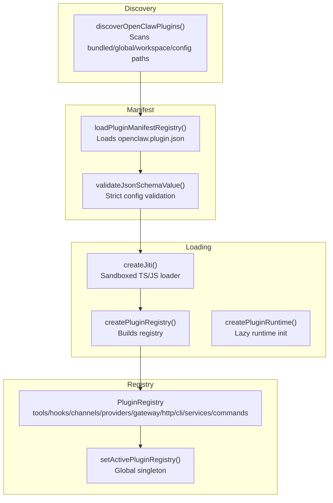
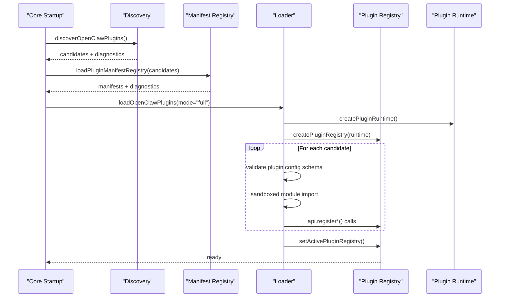
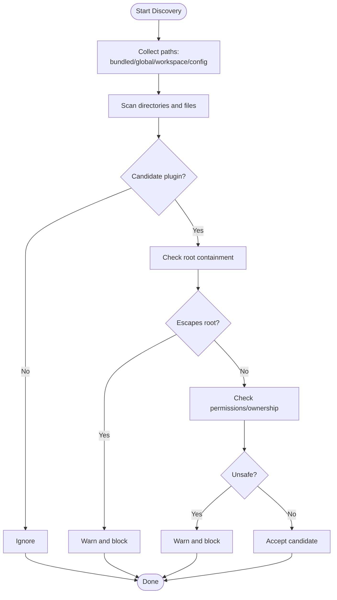
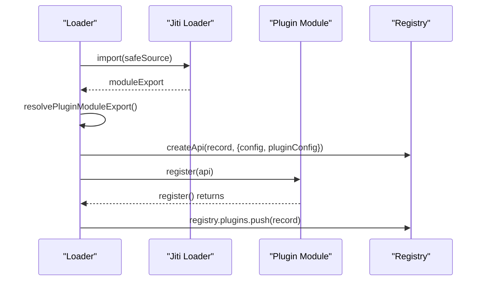
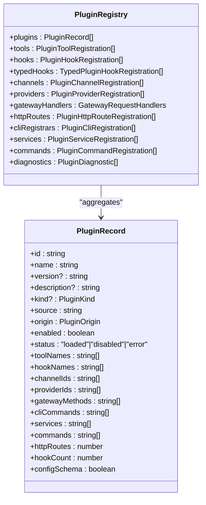
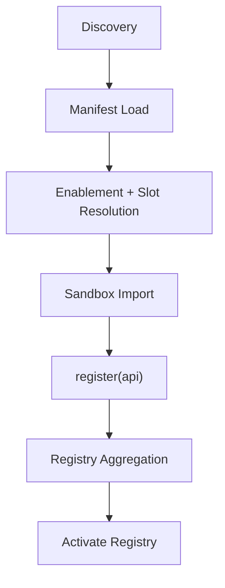
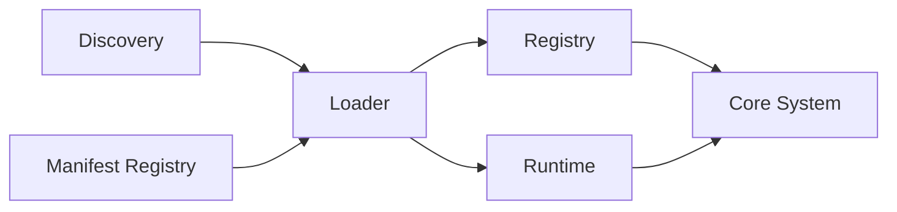

# Plugin Architecture

<cite>
**Referenced Files in This Document**
- [loader.ts](file://src/plugins/loader.ts)
- [discovery.ts](file://src/plugins/discovery.ts)
- [registry.ts](file://src/plugins/registry.ts)
- [runtime.ts](file://src/plugins/runtime.ts)
- [types.ts](file://src/plugins/types.ts)
- [manifest.md](file://docs/plugins/manifest.md)
- [plugin-sdk.md](file://docs/refactor/plugin-sdk.md)
- [openclaw.plugin.json (memory-core)](file://extensions/memory-core/openclaw.plugin.json)
- [openclaw.plugin.json (memory-lancedb)](file://extensions/memory-lancedb/openclaw.plugin.json)
- [openclaw.plugin.json (discord)](file://extensions/discord/openclaw.plugin.json)
- [openclaw.plugin.json (voice-call)](file://extensions/voice-call/openclaw.plugin.json)
- [openclaw.plugin.json (google-gemini-cli-auth)](file://extensions/google-gemini-cli-auth/openclaw.plugin.json)
</cite>

## Table of Contents
1. [Introduction](#introduction)
2. [Project Structure](#project-structure)
3. [Core Components](#core-components)
4. [Architecture Overview](#architecture-overview)
5. [Detailed Component Analysis](#detailed-component-analysis)
6. [Dependency Analysis](#dependency-analysis)
7. [Performance Considerations](#performance-considerations)
8. [Troubleshooting Guide](#troubleshooting-guide)
9. [Conclusion](#conclusion)

## Introduction
This document explains OpenClaw’s plugin architecture: how plugins are discovered, loaded, validated, and integrated into the core system. It covers the plugin lifecycle, isolation and security boundaries, resource management, and the different plugin types (channel, memory, provider/authentication, and others). It also documents the plugin registry, dependency resolution, and conflict handling, with diagrams that map to actual source files.

## Project Structure
OpenClaw organizes plugin-related logic under src/plugins and ships plugin examples under extensions. The core plugin system comprises:
- Discovery: scans for plugin entry points across bundled, workspace, and global locations.
- Manifest validation: ensures every plugin ships a strict JSON Schema for configuration.
- Loader: orchestrates discovery, manifest validation, sandboxed loading, and registration.
- Registry: aggregates plugin capabilities (tools, hooks, HTTP routes, channels, providers, services, commands).
- Runtime: a global singleton registry accessor and a stable SDK/runtime surface for plugins.

**Diagram sources**
- [discovery.ts](file://src/plugins/discovery.ts#L618-L712)
- [loader.ts](file://src/plugins/loader.ts#L447-L800)
- [registry.ts](file://src/plugins/registry.ts#L185-L625)
- [runtime.ts](file://src/plugins/runtime.ts#L25-L50)

**Section sources**
- [discovery.ts](file://src/plugins/discovery.ts#L1-L712)
- [loader.ts](file://src/plugins/loader.ts#L1-L829)
- [registry.ts](file://src/plugins/registry.ts#L1-L625)
- [runtime.ts](file://src/plugins/runtime.ts#L1-L50)

## Core Components
- Plugin types and lifecycle hooks: defines the plugin API surface, tool context, command and HTTP route registration, and a comprehensive set of agent/session/tool/message lifecycle hooks.
- Discovery and safety: enforces root containment, permission checks, and ownership validation to prevent unsafe plugin sources.
- Manifest and schema: requires every plugin to ship a strict JSON Schema for configuration, validated before execution.
- Loader and runtime: lazy initialization of the runtime, sandboxed module loading, and strict enablement rules (including exclusive slots like memory).
- Registry: central aggregation of plugin capabilities with conflict detection and diagnostics.

**Section sources**
- [types.ts](file://src/plugins/types.ts#L1-L893)
- [discovery.ts](file://src/plugins/discovery.ts#L117-L251)
- [manifest.md](file://docs/plugins/manifest.md#L1-L76)
- [loader.ts](file://src/plugins/loader.ts#L447-L800)
- [registry.ts](file://src/plugins/registry.ts#L185-L625)

## Architecture Overview
The plugin system is layered:
- Discovery layer finds plugin entry points and validates their roots.
- Manifest layer reads and validates plugin configuration schemas.
- Loading layer sandbox-executes plugin modules and registers their capabilities.
- Registry layer consolidates capabilities and exposes them to the rest of the system.
- Runtime layer provides a stable, versioned interface for plugins to access core services.

**Diagram sources**
- [discovery.ts](file://src/plugins/discovery.ts#L618-L712)
- [loader.ts](file://src/plugins/loader.ts#L447-L800)
- [registry.ts](file://src/plugins/registry.ts#L185-L625)
- [runtime.ts](file://src/plugins/runtime.ts#L25-L50)

## Detailed Component Analysis

### Plugin Discovery and Safety
Discovery scans multiple locations:
- Bundled plugins directory
- Global config extensions directory
- Workspace-specific extensions directory
- Explicitly configured load paths

It enforces safety:
- Root containment: rejects sources outside the plugin root.
- Permissions: flags world-writable directories.
- Ownership: warns on suspicious UID mismatches (non-Windows).

**Diagram sources**
- [discovery.ts](file://src/plugins/discovery.ts#L117-L251)

**Section sources**
- [discovery.ts](file://src/plugins/discovery.ts#L1-L712)

### Manifest and Strict Configuration Validation
Every plugin must ship openclaw.plugin.json with:
- id (canonical plugin id)
- configSchema (JSON Schema for plugin config)
- Optional: kind, channels, providers, skills, uiHints, version

Validation occurs before execution:
- Unknown channels/providers referenced by plugins are errors.
- Unknown plugin ids in configuration are errors.
- Broken or missing manifests fail validation and are surfaced in diagnostics.

**Section sources**
- [manifest.md](file://docs/plugins/manifest.md#L1-L76)

### Plugin Loading and Registration
The loader:
- Normalizes plugin configuration and resolves enablement state.
- Lazily initializes the runtime to avoid loading heavy dependencies unnecessarily.
- Uses a sandboxed loader to import plugin modules safely.
- Validates plugin config against the manifest schema.
- Calls the plugin’s register/activate function and records capabilities in the registry.

**Diagram sources**
- [loader.ts](file://src/plugins/loader.ts#L675-L799)

**Section sources**
- [loader.ts](file://src/plugins/loader.ts#L1-L829)

### Plugin Registry and Capability Aggregation
The registry aggregates:
- Tools (factories or instances)
- Hooks (internal and typed)
- HTTP routes (with auth and overlap checks)
- Channels (and docks)
- Providers (authentication/provider integrations)
- Gateway methods
- CLI registrars
- Services
- Commands

It also tracks plugin origins, statuses, and diagnostics.

**Diagram sources**
- [registry.ts](file://src/plugins/registry.ts#L129-L142)
- [registry.ts](file://src/plugins/registry.ts#L102-L127)

**Section sources**
- [registry.ts](file://src/plugins/registry.ts#L1-L625)

### Plugin Types and Examples
- Channel plugins: register channel adapters and capabilities. Example: discord declares channels: ["discord"].
- Memory plugins: implement persistent storage/backends. Two examples:
  - memory-core: minimal memory plugin.
  - memory-lancedb: vector-backed memory with embedding configuration and UI hints.
- Authentication/Provider plugins: integrate external providers. Example: google-gemini-cli-auth registers provider id "google-gemini-cli".
- Voice call plugin: complex configuration with extensive UI hints and nested schemas for providers, streaming, tunneling, and TTS/STT.

**Section sources**
- [openclaw.plugin.json (discord)](file://extensions/discord/openclaw.plugin.json#L1-L10)
- [openclaw.plugin.json (memory-core)](file://extensions/memory-core/openclaw.plugin.json#L1-L10)
- [openclaw.plugin.json (memory-lancedb)](file://extensions/memory-lancedb/openclaw.plugin.json#L1-L89)
- [openclaw.plugin.json (google-gemini-cli-auth)](file://extensions/google-gemini-cli-auth/openclaw.plugin.json#L1-L10)
- [openclaw.plugin.json (voice-call)](file://extensions/voice-call/openclaw.plugin.json#L1-L601)

### Plugin Lifecycle: From Discovery to Execution
- Discovery: locate plugin entry points and validate roots.
- Manifest: load and validate openclaw.plugin.json.
- Enablement: resolve effective enable state and slot decisions (e.g., memory selection).
- Sandbox load: import plugin module with a sandboxed loader.
- Registration: call register(api) and record capabilities.
- Activation: set active registry and initialize global hook runner.

**Diagram sources**
- [loader.ts](file://src/plugins/loader.ts#L447-L800)
- [discovery.ts](file://src/plugins/discovery.ts#L618-L712)
- [registry.ts](file://src/plugins/registry.ts#L185-L625)
- [runtime.ts](file://src/plugins/runtime.ts#L25-L50)

**Section sources**
- [loader.ts](file://src/plugins/loader.ts#L447-L800)
- [runtime.ts](file://src/plugins/runtime.ts#L1-L50)

### Plugin Isolation, Security Boundaries, and Resource Management
- Root containment: plugin entry must reside within the plugin root; otherwise blocked.
- Permission checks: world-writable paths are flagged; ownership mismatches are warned.
- Hardlink rejection: non-bundled plugins reject hardlinks to reduce symlink abuse.
- Sandboxed loader: uses a dedicated loader to import plugin modules safely.
- Lazy runtime: runtime is created on demand to avoid loading unnecessary channel dependencies.
- Diagnostics: comprehensive warnings and errors surfaced for misconfiguration and conflicts.

**Section sources**
- [discovery.ts](file://src/plugins/discovery.ts#L117-L251)
- [loader.ts](file://src/plugins/loader.ts#L538-L558)
- [loader.ts](file://src/plugins/loader.ts#L470-L502)

### Plugin Registry System, Dependency Resolution, and Conflict Handling
- Dependency resolution:
  - plugins.entries.<id>: controls enablement, hooks policy, and per-plugin overrides.
  - plugins.slots.*: selects exclusive plugins (e.g., memory).
- Conflict handling:
  - HTTP route overlap: rejects overlapping paths with conflicting auth modes.
  - Duplicate provider ids: rejected with diagnostics.
  - Unknown ids in configuration: treated as errors.
  - Overridden plugin ids: marked disabled with a reason.

**Section sources**
- [registry.ts](file://src/plugins/registry.ts#L318-L400)
- [registry.ts](file://src/plugins/registry.ts#L430-L457)
- [manifest.md](file://docs/plugins/manifest.md#L53-L76)

### Plugin SDK and Runtime Refactor Plan
OpenClaw aims to unify all channel connectors behind a stable SDK/runtime:
- SDK: compile-time, stable, publishable types and helpers.
- Runtime: execution surface accessed via OpenClawPluginApi.runtime.
- Migration plan: phased adoption with compatibility checks and golden tests.

**Section sources**
- [plugin-sdk.md](file://docs/refactor/plugin-sdk.md#L1-L215)

## Dependency Analysis
The plugin system composes several subsystems with clear boundaries:
- Discovery depends on path safety and boundary checks.
- Loader depends on discovery, manifest registry, and runtime creation.
- Registry depends on types and internal hook systems.
- Runtime is a thin global accessor for the active registry.

**Diagram sources**
- [discovery.ts](file://src/plugins/discovery.ts#L618-L712)
- [loader.ts](file://src/plugins/loader.ts#L447-L800)
- [registry.ts](file://src/plugins/registry.ts#L185-L625)
- [runtime.ts](file://src/plugins/runtime.ts#L25-L50)

**Section sources**
- [discovery.ts](file://src/plugins/discovery.ts#L1-L712)
- [loader.ts](file://src/plugins/loader.ts#L1-L829)
- [registry.ts](file://src/plugins/registry.ts#L1-L625)
- [runtime.ts](file://src/plugins/runtime.ts#L1-L50)

## Performance Considerations
- Discovery caching: discovery results can be cached to reduce startup overhead.
- Lazy runtime: runtime is initialized only when needed, avoiding heavy imports.
- Strict validation: manifest and schema validation occur before execution to fail fast.
- Exclusive slots: memory and other exclusive plugins are resolved early to avoid importing unused modules.

[No sources needed since this section provides general guidance]

## Troubleshooting Guide
Common issues and diagnostics:
- Missing or invalid manifest: validation fails; see diagnostics for details.
- Unknown plugin ids in configuration: treated as errors.
- Overlapping HTTP routes: rejected with ownership details.
- Duplicate provider ids: rejected with diagnostics.
- Unsafe plugin sources: blocked with warnings about root escapes, world-writable paths, or suspicious ownership.
- Deprecated APIs: registerHttpHandler replaced with registerHttpRoute; loader detects and surfaces deprecation hints.

**Section sources**
- [manifest.md](file://docs/plugins/manifest.md#L53-L76)
- [registry.ts](file://src/plugins/registry.ts#L318-L400)
- [registry.ts](file://src/plugins/registry.ts#L430-L457)
- [discovery.ts](file://src/plugins/discovery.ts#L216-L251)
- [loader.ts](file://src/plugins/loader.ts#L266-L284)

## Conclusion
OpenClaw’s plugin architecture balances flexibility and safety. It enforces strict manifest-driven configuration, isolates plugin execution, and provides a robust registry for capabilities. The system supports diverse plugin types—channel, memory, provider/authentication—and offers a clear migration path toward a unified SDK/runtime surface. By leveraging discovery caching, lazy runtime initialization, and comprehensive diagnostics, the system remains performant and maintainable while keeping user environments secure.