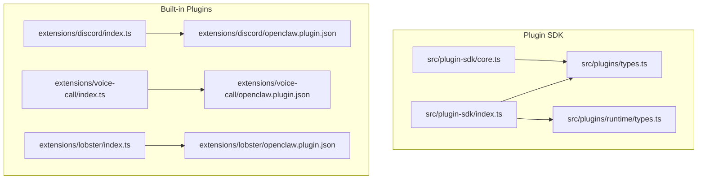
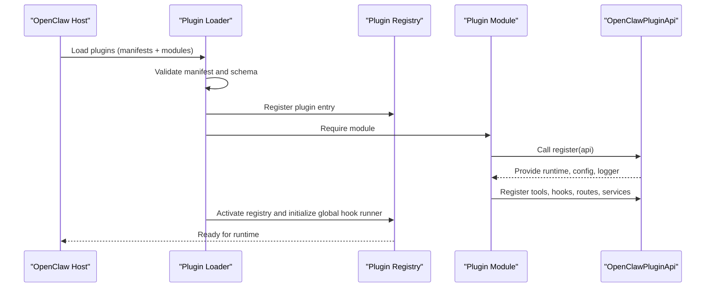
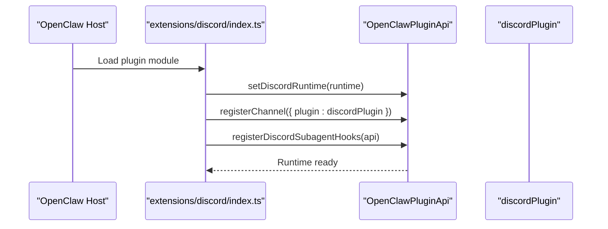
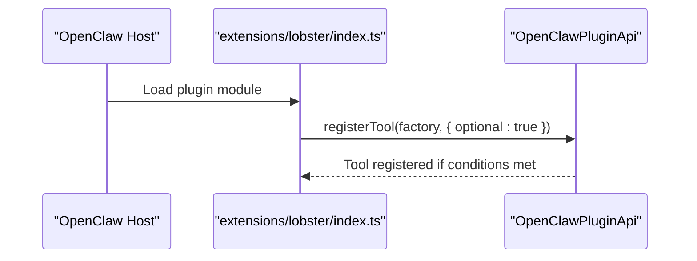
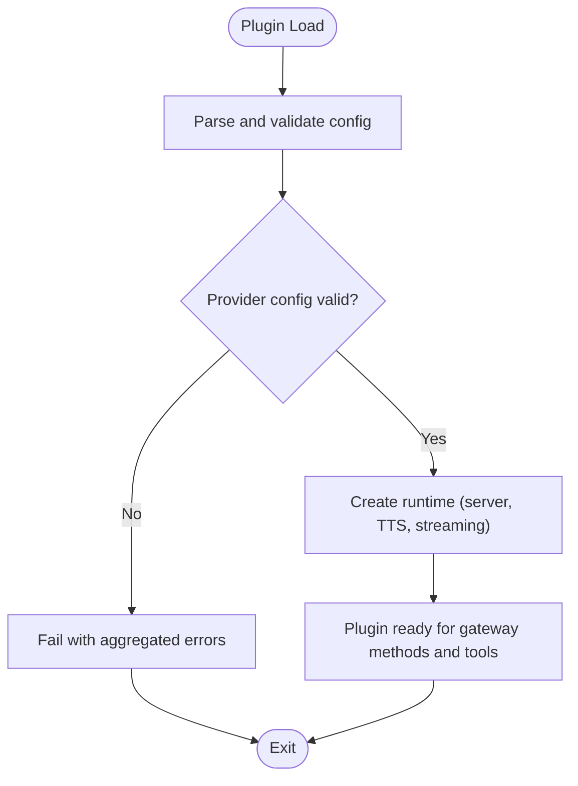
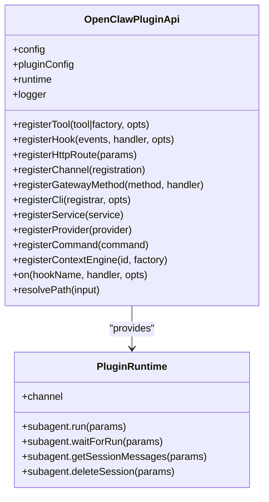
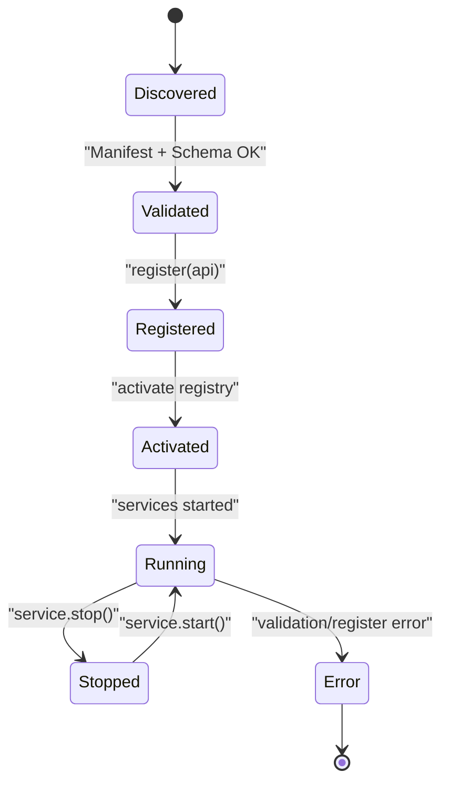
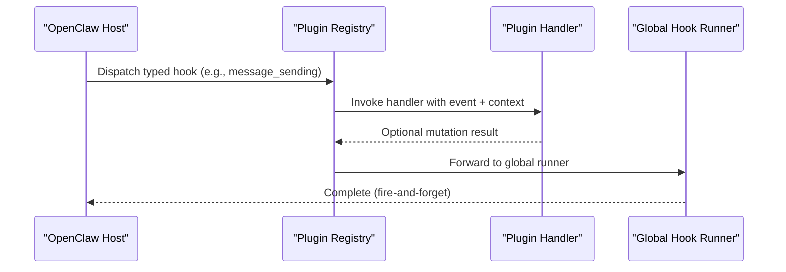
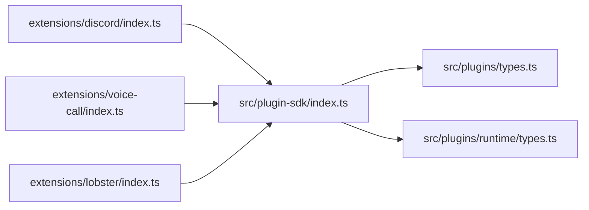

# Plugin Development

<cite>
**Referenced Files in This Document**
- [index.ts](file://src/plugin-sdk/index.ts)
- [core.ts](file://src/plugin-sdk/core.ts)
- [types.ts](file://src/plugins/types.ts)
- [runtime/types.ts](file://src/plugins/runtime/types.ts)
- [manifest.md](file://docs/plugins/manifest.md)
- [community.md](file://docs/plugins/community.md)
- [discord/index.ts](file://extensions/discord/index.ts)
- [discord/openclaw.plugin.json](file://extensions/discord/openclaw.plugin.json)
- [voice-call/index.ts](file://extensions/voice-call/index.ts)
- [voice-call/openclaw.plugin.json](file://extensions/voice-call/openclaw.plugin.json)
- [lobster/index.ts](file://extensions/lobster/index.ts)
- [lobster/openclaw.plugin.json](file://extensions/lobster/openclaw.plugin.json)
- [loader.ts](file://src/plugins/loader.ts)
- [hooks.ts](file://src/plugins/hooks.ts)
- [hook-runner-global.ts](file://src/plugins/hook-runner-global.ts)
- [registry.ts](file://src/plugins/registry.ts)
</cite>

## Table of Contents
1. [Introduction](#introduction)
2. [Project Structure](#project-structure)
3. [Core Components](#core-components)
4. [Architecture Overview](#architecture-overview)
5. [Detailed Component Analysis](#detailed-component-analysis)
6. [Dependency Analysis](#dependency-analysis)
7. [Performance Considerations](#performance-considerations)
8. [Troubleshooting Guide](#troubleshooting-guide)
9. [Conclusion](#conclusion)
10. [Appendices](#appendices)

## Introduction
This document explains how to develop plugins for OpenClaw using the Plugin SDK. It covers the plugin architecture, manifest format, plugin types (channel, skill/tool, authentication), SDK APIs, lifecycle, hooks, testing, deployment, distribution, versioning, and community contribution guidelines. The goal is to enable developers to build reliable, secure, and performant plugins that integrate seamlessly with OpenClaw’s runtime and gateway.

## Project Structure
OpenClaw organizes plugin-related code under a dedicated SDK and a set of built-in extensions. The SDK exposes a unified surface for registering tools, commands, HTTP routes, gateway methods, CLI commands, services, channels, providers, and hooks. Built-in plugins demonstrate real-world patterns for channel plugins, voice-call plugins, and tool plugins.

**Diagram sources**
- [index.ts](file://src/plugin-sdk/index.ts#L1-L135)
- [core.ts](file://src/plugin-sdk/core.ts#L1-L37)
- [types.ts](file://src/plugins/types.ts#L248-L306)
- [runtime/types.ts](file://src/plugins/runtime/types.ts#L51-L63)
- [discord/index.ts](file://extensions/discord/index.ts#L1-L20)
- [discord/openclaw.plugin.json](file://extensions/discord/openclaw.plugin.json#L1-L10)
- [voice-call/index.ts](file://extensions/voice-call/index.ts#L1-L543)
- [voice-call/openclaw.plugin.json](file://extensions/voice-call/openclaw.plugin.json#L1-L601)
- [lobster/index.ts](file://extensions/lobster/index.ts#L1-L19)
- [lobster/openclaw.plugin.json](file://extensions/lobster/openclaw.plugin.json#L1-L11)

**Section sources**
- [index.ts](file://src/plugin-sdk/index.ts#L1-L135)
- [core.ts](file://src/plugin-sdk/core.ts#L1-L37)
- [types.ts](file://src/plugins/types.ts#L248-L306)
- [runtime/types.ts](file://src/plugins/runtime/types.ts#L51-L63)
- [discord/index.ts](file://extensions/discord/index.ts#L1-L20)
- [discord/openclaw.plugin.json](file://extensions/discord/openclaw.plugin.json#L1-L10)
- [voice-call/index.ts](file://extensions/voice-call/index.ts#L1-L543)
- [voice-call/openclaw.plugin.json](file://extensions/voice-call/openclaw.plugin.json#L1-L601)
- [lobster/index.ts](file://extensions/lobster/index.ts#L1-L19)
- [lobster/openclaw.plugin.json](file://extensions/lobster/openclaw.plugin.json#L1-L11)

## Core Components
- Plugin SDK exports:
  - Channel plugin types and adapters for messaging, threading, directory, security, and more.
  - Runtime abstractions for subagents, channels, and logging.
  - HTTP route registration, webhook targets, and guards.
  - Utilities for status helpers, allowlist resolution, SSRF policy, and OAuth helpers.
- Plugin types:
  - OpenClawPluginApi: Registration surface for tools, hooks, HTTP routes, channels, gateway methods, CLI, services, providers, commands, and context engines.
  - OpenClawPluginDefinition: Plugin identity, metadata, config schema, and lifecycle hooks (register, activate).
  - PluginRuntime: Access to subagent execution, session queries, and channel operations.
- Plugin loader and registry:
  - Loads plugins, validates manifests, enforces slots (e.g., memory), and records diagnostics.
  - Initializes a global hook runner to dispatch typed hooks across the system.

**Section sources**
- [index.ts](file://src/plugin-sdk/index.ts#L1-L135)
- [types.ts](file://src/plugins/types.ts#L248-L306)
- [runtime/types.ts](file://src/plugins/runtime/types.ts#L51-L63)
- [loader.ts](file://src/plugins/loader.ts#L769-L820)
- [registry.ts](file://src/plugins/registry.ts#L241-L288)

## Architecture Overview
OpenClaw’s plugin architecture centers on a manifest-driven discovery and validation pipeline, followed by a registration phase where plugins attach capabilities to the host runtime. The SDK provides a single API surface for all integrations.

**Diagram sources**
- [loader.ts](file://src/plugins/loader.ts#L769-L820)
- [registry.ts](file://src/plugins/registry.ts#L241-L288)
- [hook-runner-global.ts](file://src/plugins/hook-runner-global.ts#L36-L46)
- [types.ts](file://src/plugins/types.ts#L263-L306)

## Detailed Component Analysis

### Plugin Manifest Format
Every plugin must include a manifest named openclaw.plugin.json at the plugin root. The manifest drives discovery, validation, and selection of plugin capabilities.

- Required fields:
  - id: Canonical plugin id.
  - configSchema: JSON Schema for plugin configuration.
- Optional fields:
  - kind: Plugin kind (e.g., memory, context-engine).
  - channels: Channel ids registered by the plugin.
  - providers: Provider ids registered by the plugin.
  - skills: Skill directories to load (relative to plugin root).
  - name, description, uiHints, version.
- Validation behavior:
  - Unknown channel/provider/skill ids are errors.
  - plugins.entries.<id>, plugins.allow, plugins.deny, plugins.slots.* must reference discoverable plugin ids.
  - Broken or missing manifest/schema blocks config validation and is reported by Doctor.
  - Disabled plugin with existing config keeps config and warns in Doctor/logs.

**Section sources**
- [manifest.md](file://docs/plugins/manifest.md#L11-L76)

### Plugin Types and Examples

#### Channel Plugin
A channel plugin integrates a specific messaging platform (e.g., Discord). It registers a ChannelPlugin and sets up runtime context.

- Example: Discord plugin
  - Registers a ChannelPlugin and runtime hooks.
  - Manifest declares the channel id.

**Diagram sources**
- [discord/index.ts](file://extensions/discord/index.ts#L1-L20)
- [discord/openclaw.plugin.json](file://extensions/discord/openclaw.plugin.json#L1-L10)

**Section sources**
- [discord/index.ts](file://extensions/discord/index.ts#L1-L20)
- [discord/openclaw.plugin.json](file://extensions/discord/openclaw.plugin.json#L1-L10)

#### Skill/Tool Plugin
A tool plugin contributes executable tools to the agent toolset. It can conditionally register tools based on environment or sandbox constraints.

- Example: Lobster plugin
  - Registers a tool factory that returns a tool when not sandboxed.
  - Uses optional flag to avoid failures in restricted environments.

**Diagram sources**
- [lobster/index.ts](file://extensions/lobster/index.ts#L1-L19)
- [lobster/openclaw.plugin.json](file://extensions/lobster/openclaw.plugin.json#L1-L11)

**Section sources**
- [lobster/index.ts](file://extensions/lobster/index.ts#L1-L19)
- [lobster/openclaw.plugin.json](file://extensions/lobster/openclaw.plugin.json#L1-L11)

#### Authentication Plugin
Authentication plugins provide provider authentication methods (OAuth, API keys, tokens, device code). They contribute ProviderPlugin definitions with auth flows and optional model configurations.

- Example: voice-call plugin
  - Declares a rich config schema with provider-specific sections (Twilio, Telnyx, Plivo).
  - Provides UI hints for configuration fields.
  - Validates provider configuration and manages runtime lifecycle.

**Diagram sources**
- [voice-call/index.ts](file://extensions/voice-call/index.ts#L146-L197)
- [voice-call/openclaw.plugin.json](file://extensions/voice-call/openclaw.plugin.json#L162-L599)

**Section sources**
- [voice-call/index.ts](file://extensions/voice-call/index.ts#L146-L197)
- [voice-call/openclaw.plugin.json](file://extensions/voice-call/openclaw.plugin.json#L162-L599)

### Plugin SDK API and Integration Patterns
The OpenClawPluginApi offers a comprehensive integration surface:

- Tools and factories: registerTool(tool | factory, options)
- Hooks: registerHook(events, handler, options)
- HTTP routes: registerHttpRoute(params)
- Channels: registerChannel(registration)
- Gateway methods: registerGatewayMethod(method, handler)
- CLI: registerCli(registrar, opts)
- Services: registerService(service)
- Providers: registerProvider(provider)
- Commands: registerCommand(command)
- Context engines: registerContextEngine(id, factory)
- Lifecycle hooks: on(hookName, handler, opts)

**Diagram sources**
- [types.ts](file://src/plugins/types.ts#L263-L306)
- [runtime/types.ts](file://src/plugins/runtime/types.ts#L51-L63)

**Section sources**
- [types.ts](file://src/plugins/types.ts#L263-L306)
- [runtime/types.ts](file://src/plugins/runtime/types.ts#L51-L63)

### Plugin Lifecycle
- Discovery and validation:
  - Manifest and JSON Schema validated before loading.
  - Unknown ids and missing manifests cause errors.
- Registration:
  - Plugin module is required and register(api) invoked synchronously.
  - Async registration is warned and ignored.
- Activation:
  - Registry activated and global hook runner initialized.
- Runtime:
  - Services may be started/stopped via registerService.
  - Hooks are dispatched across the system.

**Diagram sources**
- [loader.ts](file://src/plugins/loader.ts#L769-L820)
- [hook-runner-global.ts](file://src/plugins/hook-runner-global.ts#L36-L46)

**Section sources**
- [loader.ts](file://src/plugins/loader.ts#L769-L820)
- [hook-runner-global.ts](file://src/plugins/hook-runner-global.ts#L36-L46)

### Hooks and Typed Events
OpenClaw defines a comprehensive set of typed hooks for agent lifecycle, message flow, tool execution, session management, subagent spawning, and gateway lifecycle. Plugins can subscribe to hooks and mutate or observe runtime behavior.

- Hook categories:
  - Agent lifecycle: before_model_resolve, before_prompt_build, before_agent_start, llm_input, llm_output, agent_end.
  - Memory/session: before_compaction, after_compaction, before_reset, session_start, session_end.
  - Message flow: message_received, message_sending, message_sent, before_message_write.
  - Tool lifecycle: before_tool_call, after_tool_call, tool_result_persist.
  - Subagent lifecycle: subagent_spawning, subagent_delivery_target, subagent_spawned, subagent_ended.
  - Gateway lifecycle: gateway_start, gateway_stop.

**Diagram sources**
- [hooks.ts](file://src/plugins/hooks.ts#L685-L723)
- [hook-runner-global.ts](file://src/plugins/hook-runner-global.ts#L36-L46)

**Section sources**
- [hooks.ts](file://src/plugins/hooks.ts#L685-L723)
- [hook-runner-global.ts](file://src/plugins/hook-runner-global.ts#L36-L46)

## Dependency Analysis
- SDK exports:
  - Channel types and adapters for multiple platforms.
  - Runtime types for subagents and channels.
  - HTTP/webhook utilities and security policies.
- Built-in plugin dependencies:
  - Channel plugins depend on channel-specific adapters and runtime helpers.
  - Tool plugins depend on sandbox-awareness and optional registration.
  - Voice-call plugin depends on provider configs, TTS, streaming, and tunneling utilities.

**Diagram sources**
- [index.ts](file://src/plugin-sdk/index.ts#L1-L135)
- [types.ts](file://src/plugins/types.ts#L248-L306)
- [runtime/types.ts](file://src/plugins/runtime/types.ts#L51-L63)
- [discord/index.ts](file://extensions/discord/index.ts#L1-L20)
- [voice-call/index.ts](file://extensions/voice-call/index.ts#L1-L543)
- [lobster/index.ts](file://extensions/lobster/index.ts#L1-L19)

**Section sources**
- [index.ts](file://src/plugin-sdk/index.ts#L1-L135)
- [types.ts](file://src/plugins/types.ts#L248-L306)
- [runtime/types.ts](file://src/plugins/runtime/types.ts#L51-L63)
- [discord/index.ts](file://extensions/discord/index.ts#L1-L20)
- [voice-call/index.ts](file://extensions/voice-call/index.ts#L1-L543)
- [lobster/index.ts](file://extensions/lobster/index.ts#L1-L19)

## Performance Considerations
- Prefer lightweight initialization in register; defer heavy work to service start or lazy runtime creation.
- Use runtime.subagent APIs for asynchronous orchestration and avoid blocking the main thread.
- Apply webhook request guards and rate limits to protect resources.
- Minimize repeated parsing/validation by caching validated config where appropriate.
- Keep tool parameters minimal and validated early to reduce downstream overhead.

## Troubleshooting Guide
- Manifest and schema errors:
  - Ensure openclaw.plugin.json exists and configSchema is present.
  - Fix unknown channel/provider/skill ids referenced by plugins.entries/plugins.slots.
- Plugin activation errors:
  - Review loader diagnostics for “plugin register returned a promise” warnings and fix synchronous registration.
  - Confirm slot selections (e.g., memory) match exactly one plugin id.
- Hook diagnostics:
  - Use Doctor to surface plugin errors and warnings.
  - Verify hook names are valid and typed hooks are properly registered.

**Section sources**
- [manifest.md](file://docs/plugins/manifest.md#L53-L76)
- [loader.ts](file://src/plugins/loader.ts#L775-L784)
- [registry.ts](file://src/plugins/registry.ts#L241-L288)

## Conclusion
OpenClaw’s Plugin SDK provides a robust, manifest-driven framework for building channel integrations, tools, authentication flows, and more. By adhering to the manifest requirements, leveraging the OpenClawPluginApi, and using typed hooks, developers can create secure, maintainable, and performant plugins that integrate cleanly with the host runtime.

## Appendices

### Plugin Distribution, Versioning, and Dependencies
- Distribution:
  - Publish community plugins on npmjs for installable packages.
  - Maintain a public GitHub repository with setup/use docs and an issue tracker.
- Versioning:
  - Include a version field in the manifest for informational purposes.
  - Align plugin versions with breaking changes and provider API updates.
- Dependencies:
  - Document native module build steps and package manager allowlists if applicable.
  - Pin provider SDK versions and communicate minimum host versions.

**Section sources**
- [community.md](file://docs/plugins/community.md#L15-L35)
- [manifest.md](file://docs/plugins/manifest.md#L64-L76)

### Community Plugin Ecosystem and Contribution Guidelines
- Quality bar:
  - Useful, documented, and safe to operate.
  - Active maintenance and responsive issue handling.
- Submission:
  - Open a PR adding your plugin with name, npm package, repo URL, one-line description, and install command.
- Listed plugins:
  - Verified candidates appear on the community page with standardized formatting.

**Section sources**
- [community.md](file://docs/plugins/community.md#L11-L52)