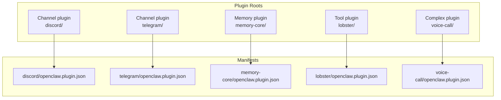
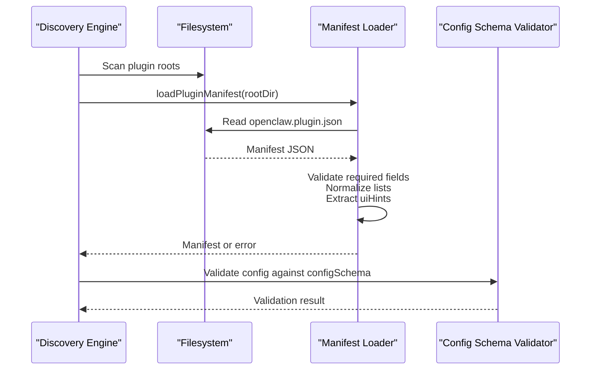
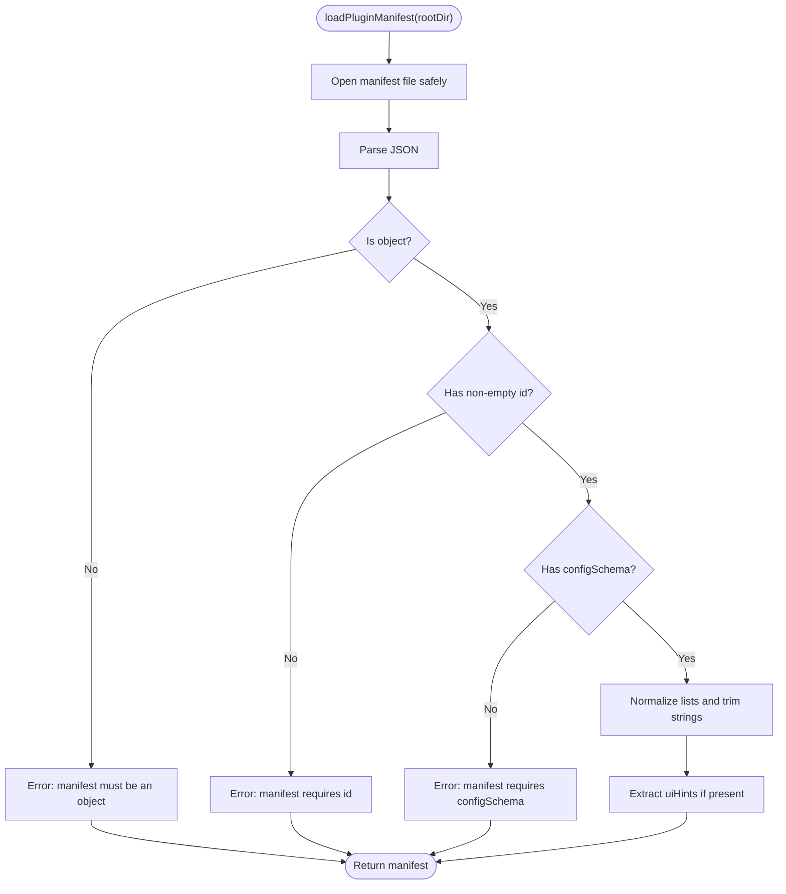
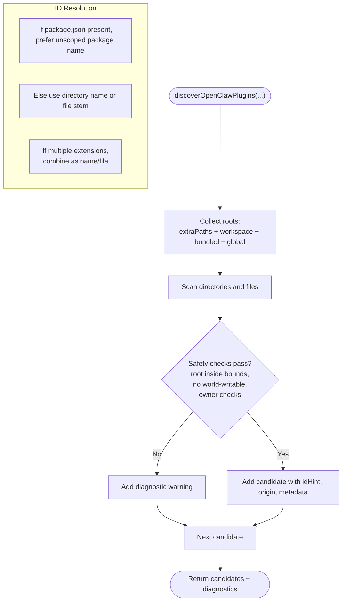
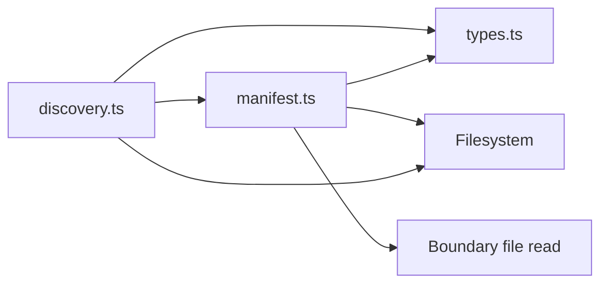

# Plugin Manifest & Configuration

<cite>
**Referenced Files in This Document**
- [docs/plugins/manifest.md](file://docs/plugins/manifest.md)
- [src/plugins/manifest.ts](file://src/plugins/manifest.ts)
- [src/plugins/discovery.ts](file://src/plugins/discovery.ts)
- [src/plugins/config-schema.ts](file://src/plugins/config-schema.ts)
- [src/plugins/types.ts](file://src/plugins/types.ts)
- [extensions/discord/openclaw.plugin.json](file://extensions/discord/openclaw.plugin.json)
- [extensions/telegram/openclaw.plugin.json](file://extensions/telegram/openclaw.plugin.json)
- [extensions/memory-core/openclaw.plugin.json](file://extensions/memory-core/openclaw.plugin.json)
- [extensions/lobster/openclaw.plugin.json](file://extensions/lobster/openclaw.plugin.json)
- [extensions/voice-call/openclaw.plugin.json](file://extensions/voice-call/openclaw.plugin.json)
</cite>

## Table of Contents
1. [Introduction](#introduction)
2. [Project Structure](#project-structure)
3. [Core Components](#core-components)
4. [Architecture Overview](#architecture-overview)
5. [Detailed Component Analysis](#detailed-component-analysis)
6. [Dependency Analysis](#dependency-analysis)
7. [Performance Considerations](#performance-considerations)
8. [Troubleshooting Guide](#troubleshooting-guide)
9. [Conclusion](#conclusion)
10. [Appendices](#appendices)

## Introduction
This document explains the OpenClaw plugin manifest format and configuration schema requirements. It covers the openclaw.plugin.json contract, required and optional fields, JSON Schema validation rules, UI hints for rendering, manifest discovery and ID resolution, slot assignments, and practical troubleshooting. Examples from real plugins illustrate typical manifest patterns across channel, memory, and tool-focused plugins.

## Project Structure
OpenClaw organizes plugins as directories containing an openclaw.plugin.json manifest and a plugin entry script. Discovery scans bundled, global, workspace, and explicit paths to assemble candidates for loading and validation.

**Diagram sources**
- [extensions/discord/openclaw.plugin.json](file://extensions/discord/openclaw.plugin.json#L1-L10)
- [extensions/telegram/openclaw.plugin.json](file://extensions/telegram/openclaw.plugin.json#L1-L10)
- [extensions/memory-core/openclaw.plugin.json](file://extensions/memory-core/openclaw.plugin.json#L1-L10)
- [extensions/lobster/openclaw.plugin.json](file://extensions/lobster/openclaw.plugin.json#L1-L11)
- [extensions/voice-call/openclaw.plugin.json](file://extensions/voice-call/openclaw.plugin.json#L1-L601)

**Section sources**
- [docs/plugins/manifest.md](file://docs/plugins/manifest.md#L9-L16)
- [src/plugins/discovery.ts](file://src/plugins/discovery.ts#L618-L711)

## Core Components
- Manifest loader and validator: reads and validates openclaw.plugin.json, normalizes fields, and extracts uiHints and lists.
- Discovery engine: finds plugin roots, resolves entry points, and builds candidates with safety checks.
- Empty schema helper: provides a minimal JSON Schema for plugins that accept no configuration.
- Types and UI hints: define the shape of uiHints and the plugin configuration schema contract.

Key responsibilities:
- Enforce required fields and schema presence.
- Normalize lists and trim strings.
- Provide uiHints for UI rendering.
- Support exclusive plugin kinds via slots.

**Section sources**
- [src/plugins/manifest.ts](file://src/plugins/manifest.ts#L11-L119)
- [src/plugins/discovery.ts](file://src/plugins/discovery.ts#L394-L500)
- [src/plugins/config-schema.ts](file://src/plugins/config-schema.ts#L13-L33)
- [src/plugins/types.ts](file://src/plugins/types.ts#L29-L36)

## Architecture Overview
The manifest and configuration pipeline integrates discovery, loading, validation, and UI hinting.

**Diagram sources**
- [src/plugins/discovery.ts](file://src/plugins/discovery.ts#L618-L711)
- [src/plugins/manifest.ts](file://src/plugins/manifest.ts#L45-L119)
- [src/plugins/config-schema.ts](file://src/plugins/config-schema.ts#L13-L33)

## Detailed Component Analysis

### Manifest Format and Fields
The manifest defines the plugin identity, configuration schema, and metadata. Required and optional fields are enforced during load.

Required fields:
- id: Canonical plugin identifier.
- configSchema: Inline JSON Schema for plugin configuration.

Optional fields:
- kind: Plugin kind (e.g., memory, context-engine).
- channels: Declared channel identifiers.
- providers: Declared provider identifiers.
- skills: Skill directories to load.
- name: Human-readable display name.
- description: Short summary.
- version: Informational version.
- uiHints: UI rendering hints keyed by config property path.

Validation behavior:
- Unknown channels must be declared by manifests.
- Plugin entries, allow/deny lists, and slots must reference discoverable plugin ids.
- Broken or missing manifests fail validation; disabled plugins produce warnings.

Exclusive kinds and slots:
- kind: memory selects plugins.slots.memory.
- kind: context-engine selects plugins.slots.contextEngine (default legacy).

**Section sources**
- [docs/plugins/manifest.md](file://docs/plugins/manifest.md#L11-L16)
- [docs/plugins/manifest.md](file://docs/plugins/manifest.md#L18-L46)
- [docs/plugins/manifest.md](file://docs/plugins/manifest.md#L47-L51)
- [docs/plugins/manifest.md](file://docs/plugins/manifest.md#L53-L75)
- [src/plugins/manifest.ts](file://src/plugins/manifest.ts#L11-L22)
- [src/plugins/types.ts](file://src/plugins/types.ts#L38-L38)

### Manifest Loading and Validation
Manifest loading enforces:
- Presence of manifest file.
- JSON object form.
- Non-empty id and present configSchema.
- Normalization of string lists and trimming.
- Optional uiHints extraction.

**Diagram sources**
- [src/plugins/manifest.ts](file://src/plugins/manifest.ts#L45-L119)

**Section sources**
- [src/plugins/manifest.ts](file://src/plugins/manifest.ts#L35-L119)

### Discovery, ID Resolution, and Slot Assignments
Discovery scans multiple locations and builds candidates with origin and metadata. Safety checks prevent unsafe paths. ID resolution prefers package names for stability. Slots select exclusive kinds.

**Diagram sources**
- [src/plugins/discovery.ts](file://src/plugins/discovery.ts#L618-L711)
- [src/plugins/discovery.ts](file://src/plugins/discovery.ts#L299-L320)

**Section sources**
- [src/plugins/discovery.ts](file://src/plugins/discovery.ts#L394-L500)
- [src/plugins/discovery.ts](file://src/plugins/discovery.ts#L618-L711)
- [docs/plugins/manifest.md](file://docs/plugins/manifest.md#L69-L72)

### UI Hints for Rendering
uiHints enables UIs to render labels, help text, placeholders, sensitivity flags, and advanced toggles for each configuration property. uiHints keys mirror configSchema property paths.

Common uiHints fields:
- label: Display label for the field.
- help: Tooltip or help text.
- placeholder: Example value.
- sensitive: Hide input (e.g., tokens).
- advanced: Collapse by default.
- tags: Additional categorization.

**Section sources**
- [src/plugins/types.ts](file://src/plugins/types.ts#L29-L36)
- [docs/plugins/manifest.md](file://docs/plugins/manifest.md#L44-L44)

### JSON Schema Requirements and Validation
- Every plugin must ship a JSON Schema for config, even if empty.
- Schemas are validated at config read/write time.
- The empty schema helper ensures an empty object is accepted when no config is needed.

Validation rules:
- additionalProperties: false for strictness.
- Enumerations and numeric constraints for typed fields.
- Nested objects for grouped settings (e.g., providers, tunnels, streaming).

**Section sources**
- [docs/plugins/manifest.md](file://docs/plugins/manifest.md#L47-L51)
- [src/plugins/config-schema.ts](file://src/plugins/config-schema.ts#L13-L33)

### Examples of Manifests

- Minimal channel plugin manifest:
  - See [extensions/discord/openclaw.plugin.json](file://extensions/discord/openclaw.plugin.json#L1-L10)
  - See [extensions/telegram/openclaw.plugin.json](file://extensions/telegram/openclaw.plugin.json#L1-L10)

- Memory plugin manifest:
  - See [extensions/memory-core/openclaw.plugin.json](file://extensions/memory-core/openclaw.plugin.json#L1-L10)

- Tool plugin manifest:
  - See [extensions/lobster/openclaw.plugin.json](file://extensions/lobster/openclaw.plugin.json#L1-L11)

- Complex plugin with extensive uiHints and schema:
  - See [extensions/voice-call/openclaw.plugin.json](file://extensions/voice-call/openclaw.plugin.json#L1-L601)

**Section sources**
- [extensions/discord/openclaw.plugin.json](file://extensions/discord/openclaw.plugin.json#L1-L10)
- [extensions/telegram/openclaw.plugin.json](file://extensions/telegram/openclaw.plugin.json#L1-L10)
- [extensions/memory-core/openclaw.plugin.json](file://extensions/memory-core/openclaw.plugin.json#L1-L10)
- [extensions/lobster/openclaw.plugin.json](file://extensions/lobster/openclaw.plugin.json#L1-L11)
- [extensions/voice-call/openclaw.plugin.json](file://extensions/voice-call/openclaw.plugin.json#L1-L601)

## Dependency Analysis
Manifest and discovery dependencies:

**Diagram sources**
- [src/plugins/discovery.ts](file://src/plugins/discovery.ts#L1-L13)
- [src/plugins/manifest.ts](file://src/plugins/manifest.ts#L1-L6)

**Section sources**
- [src/plugins/discovery.ts](file://src/plugins/discovery.ts#L1-L13)
- [src/plugins/manifest.ts](file://src/plugins/manifest.ts#L1-L6)

## Performance Considerations
- Discovery caches results for a short period to reduce repeated scans during startup.
- Use OPENCLAW_PLUGIN_DISCOVERY_CACHE_MS to tune cache TTL; set to 0 to disable.
- OPENCLAW_DISABLE_PLUGIN_DISCOVERY_CACHE to bypass caching entirely.

**Section sources**
- [src/plugins/discovery.ts](file://src/plugins/discovery.ts#L36-L66)
- [src/plugins/discovery.ts](file://src/plugins/discovery.ts#L618-L711)

## Troubleshooting Guide
Common issues and resolutions:
- Manifest not found or unsafe path:
  - Ensure openclaw.plugin.json exists in the plugin root and is readable.
  - Avoid world-writable directories and suspicious ownership on Unix-like systems.
- Invalid or missing required fields:
  - Confirm id and configSchema are present and non-empty.
- Unknown channel ids:
  - Declare channels in the manifest or remove references from configuration.
- Unknown plugin ids in entries/allow/deny/slots:
  - Fix references to discoverable plugin ids resolved by discovery.
- Disabled plugin with existing config:
  - Doctor surfaces a warning; the config remains but the plugin is not loaded.
- Complex schema validation failures:
  - Review uiHints and nested object constraints; align with configSchema.

**Section sources**
- [src/plugins/manifest.ts](file://src/plugins/manifest.ts#L45-L119)
- [docs/plugins/manifest.md](file://docs/plugins/manifest.md#L53-L62)
- [src/plugins/discovery.ts](file://src/plugins/discovery.ts#L117-L251)

## Conclusion
OpenClaw’s plugin manifest system provides a strict, schema-driven contract for plugin configuration and discovery. By enforcing required fields, validating schemas, and offering uiHints for UI rendering, it ensures reliable plugin behavior and predictable configuration management. Correctly authored manifests enable robust discovery, accurate slot assignments, and smooth integration across channel, memory, and tool plugins.

## Appendices

### Field Reference
- id: string, required
- configSchema: object, required (JSON Schema)
- kind: string, optional (memory, context-engine)
- channels: string[], optional
- providers: string[], optional
- skills: string[], optional
- name: string, optional
- description: string, optional
- version: string, optional
- uiHints: object, optional (keys mirror config paths)

**Section sources**
- [docs/plugins/manifest.md](file://docs/plugins/manifest.md#L18-L46)
- [src/plugins/manifest.ts](file://src/plugins/manifest.ts#L11-L22)
- [src/plugins/types.ts](file://src/plugins/types.ts#L29-L36)