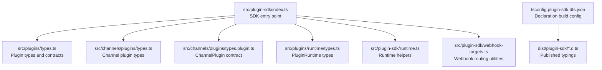
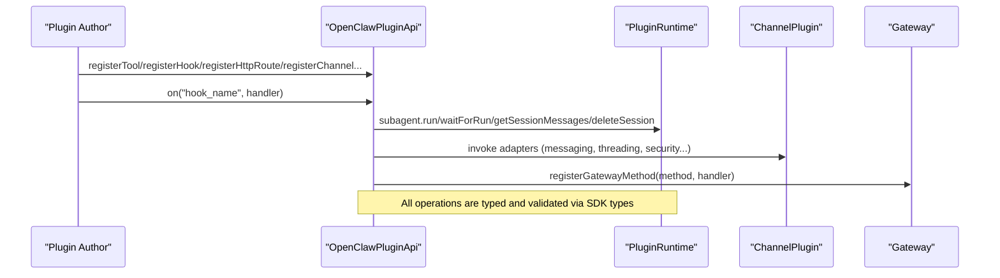
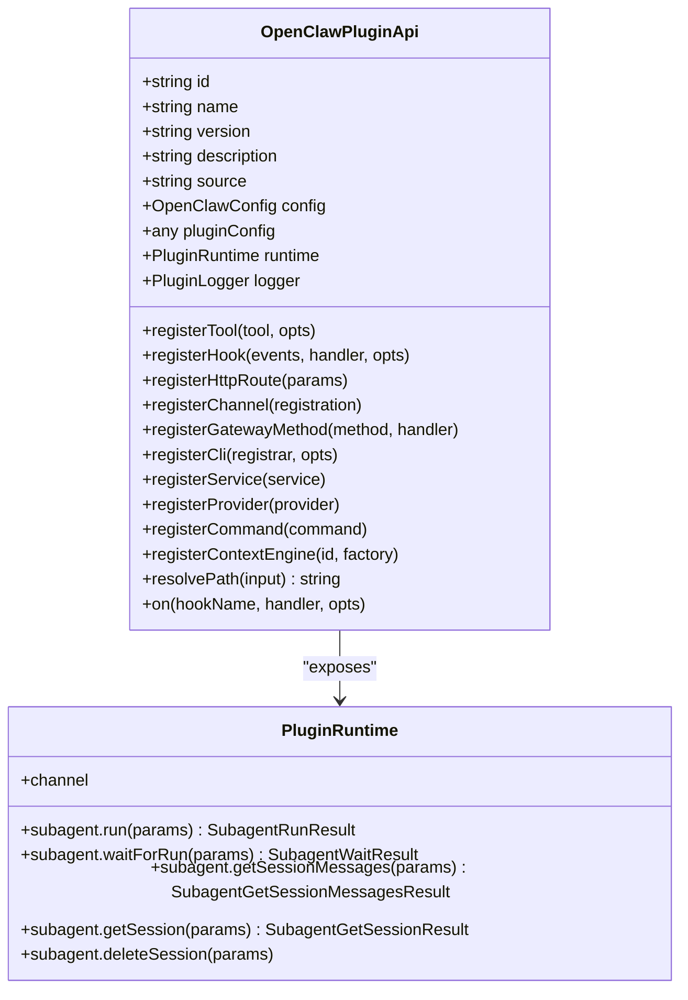
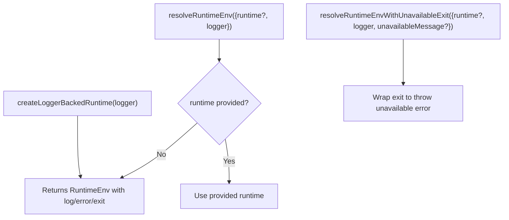
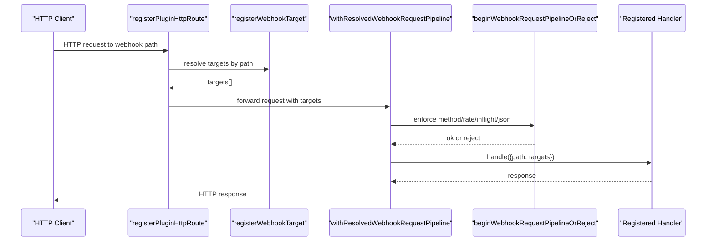
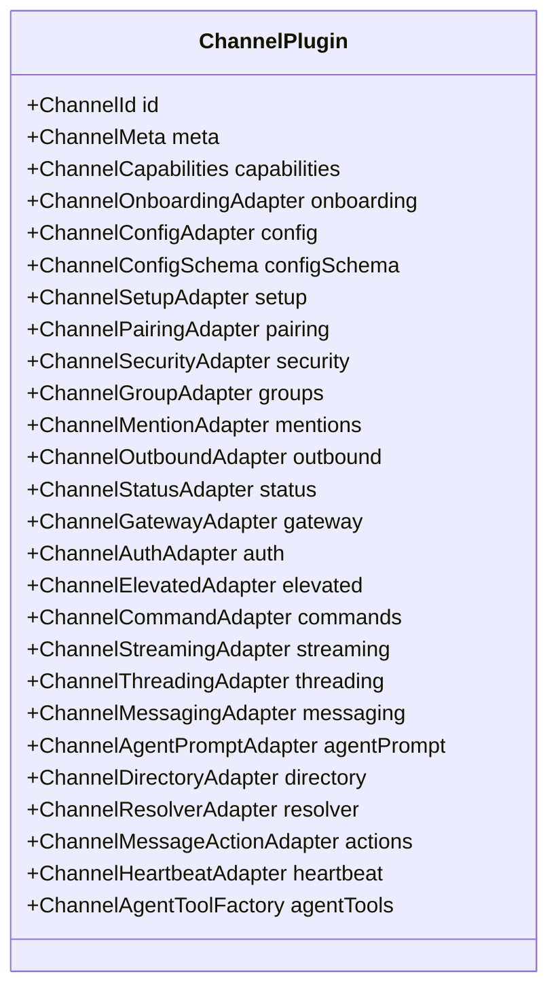
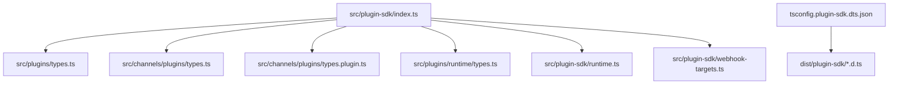

# Plugin SDK Reference

<cite>
**Referenced Files in This Document**
- [index.ts](file://src/plugin-sdk/index.ts)
- [core.ts](file://src/plugin-sdk/core.ts)
- [runtime.ts](file://src/plugin-sdk/runtime.ts)
- [webhook-targets.ts](file://src/plugin-sdk/webhook-targets.ts)
- [tsconfig.plugin-sdk.dts.json](file://tsconfig.plugin-sdk.dts.json)
- [types.ts](file://src/plugins/types.ts)
- [types.ts](file://src/channels/plugins/types.ts)
- [types.plugin.ts](file://src/channels/plugins/types.plugin.ts)
- [types.ts](file://src/plugins/runtime/types.ts)
- [index.ts](file://extensions/diffs/index.ts)
- [index.ts](file://extensions/memory-core/index.ts)
</cite>

## Table of Contents
1. [Introduction](#introduction)
2. [Project Structure](#project-structure)
3. [Core Components](#core-components)
4. [Architecture Overview](#architecture-overview)
5. [Detailed Component Analysis](#detailed-component-analysis)
6. [Dependency Analysis](#dependency-analysis)
7. [Performance Considerations](#performance-considerations)
8. [Troubleshooting Guide](#troubleshooting-guide)
9. [Conclusion](#conclusion)
10. [Appendices](#appendices)

## Introduction
This document is the comprehensive API reference for the OpenClaw Plugin SDK. It describes the exported APIs, interfaces, and types available to plugin authors, along with the runtime environment, utilities, and integration points with the core system. It explains plugin interface contracts, callback mechanisms, event handling patterns, TypeScript definitions, type safety features, and development tooling. Practical examples and best practices for SDK consumption are included.

## Project Structure
The Plugin SDK is primarily exposed via a single entry point that re-exports a curated set of utilities, types, adapters, and runtime helpers. The TypeScript declaration artifacts are emitted into a dedicated output directory for distribution and IDE support.

**Diagram sources**
- [index.ts](file://src/plugin-sdk/index.ts#L1-L812)
- [types.ts](file://src/plugins/types.ts#L1-L893)
- [types.ts](file://src/channels/plugins/types.ts#L1-L66)
- [types.plugin.ts](file://src/channels/plugins/types.plugin.ts#L1-L86)
- [types.ts](file://src/plugins/runtime/types.ts#L1-L64)
- [runtime.ts](file://src/plugin-sdk/runtime.ts#L1-L45)
- [webhook-targets.ts](file://src/plugin-sdk/webhook-targets.ts#L1-L282)
- [tsconfig.plugin-sdk.dts.json](file://tsconfig.plugin-sdk.dts.json#L1-L62)

**Section sources**
- [index.ts](file://src/plugin-sdk/index.ts#L1-L812)
- [tsconfig.plugin-sdk.dts.json](file://tsconfig.plugin-sdk.dts.json#L1-L62)

## Core Components
This section summarizes the primary SDK exports and their roles.

- Plugin definition and registration
  - OpenClawPluginDefinition, OpenClawPluginModule, OpenClawPluginApi
  - Registration methods: registerTool, registerHook, registerHttpRoute, registerChannel, registerGatewayMethod, registerCli, registerService, registerProvider, registerCommand, registerContextEngine, on
- Runtime environment
  - PluginRuntime, Subagent* operations, channel runtime access
- Channel plugin contracts
  - ChannelPlugin, Channel* adapter interfaces, capabilities, and metadata
- Utilities and helpers
  - HTTP route registration, webhook target routing, runtime logger bridging, configuration schemas, security and SSRF guards, dedupe caches, media helpers, and more

Key exported namespaces and categories:
- Plugin lifecycle and registration
- Hook system and event contracts
- Runtime and subagent orchestration
- Channel plugin contracts and adapters
- HTTP/webhook infrastructure
- Security and SSRF policies
- Configuration and schema helpers
- Utilities for media, dedupe, time formatting, and more

**Section sources**
- [index.ts](file://src/plugin-sdk/index.ts#L1-L812)
- [core.ts](file://src/plugin-sdk/core.ts#L1-L37)
- [types.ts](file://src/plugins/types.ts#L248-L306)
- [types.ts](file://src/plugins/runtime/types.ts#L51-L63)
- [types.ts](file://src/channels/plugins/types.ts#L7-L65)
- [types.plugin.ts](file://src/channels/plugins/types.plugin.ts#L49-L85)

## Architecture Overview
The Plugin SDK exposes a unified API surface for plugin authors to integrate with the core system. Plugins register capabilities (tools, hooks, HTTP routes, channels, services, providers, commands, context engines) through OpenClawPluginApi. The runtime provides subagent orchestration and channel access. Webhook utilities enable secure, rate-limited, and in-flight-limited webhook handling.

**Diagram sources**
- [types.ts](file://src/plugins/types.ts#L263-L306)
- [types.ts](file://src/plugins/runtime/types.ts#L51-L63)
- [types.plugin.ts](file://src/channels/plugins/types.plugin.ts#L49-L85)

## Detailed Component Analysis

### Plugin Contracts and Registration
- OpenClawPluginDefinition and OpenClawPluginModule define plugin identity, metadata, and lifecycle hooks (register, activate).
- OpenClawPluginApi is the central contract for registering capabilities and accessing runtime facilities.
- Hook system supports a comprehensive set of named hooks for prompt injection, agent lifecycle, message flow, tool execution, session lifecycle, subagent spawning, and gateway lifecycle.

**Diagram sources**
- [types.ts](file://src/plugins/types.ts#L263-L306)
- [types.ts](file://src/plugins/runtime/types.ts#L51-L63)

**Section sources**
- [types.ts](file://src/plugins/types.ts#L248-L306)
- [types.ts](file://src/plugins/runtime/types.ts#L1-L64)

### Hook System and Event Contracts
- Hook names enumerate lifecycle stages (model resolve, prompt build, agent start/end, compaction/reset, message receive/send/sent, tool call before/after, tool result persist, message write, session start/end, subagent spawning/delivery/spawned/ended, gateway start/stop).
- Each hook has typed event and result contracts enabling mutation of prompts, blocking tool calls, filtering messages, and controlling subagent delivery.

```mermaid
flowchart TD
Start(["Hook Invocation"]) --> Choose["Select Hook Name"]
Choose --> PMR["before_model_resolve"]
Choose --> PPB["before_prompt_build"]
Choose --> PAS["before_agent_start"]
Choose --> LLMI["llm_input"]
Choose --> LLMO["llm_output"]
Choose --> AE["agent_end"]
Choose --> BC["before_compaction"]
Choose --> AC["after_compaction"]
Choose --> BR["before_reset"]
Choose --> MR["message_received"]
Choose --> MS["message_sending"]
Choose --> MSG["message_sent"]
Choose --> BTC["before_tool_call"]
Choose --> ATC["after_tool_call"]
Choose --> TRP["tool_result_persist"]
Choose --> BMW["before_message_write"]
Choose --> SS["session_start"]
Choose --> SE["session_end"]
Choose --> SPS["subagent_spawning"]
Choose --> SDT["subagent_delivery_target"]
Choose --> SSA["subagent_spawned"]
Choose --> SSE["subagent_ended"]
Choose --> GS["gateway_start"]
Choose --> GST["gateway_stop"]
PMR --> PMR_Res["Return model/provider overrides"]
PPB --> PPB_Res["Return system/prepend/append context"]
PAS --> PAS_Res["Combined prompt/model overrides"]
BTC --> BTC_Res["Block tool call or mutate params"]
TRP --> TRP_Res["Mutate persisted tool result message"]
BMW --> BMW_Res["Block or mutate message"]
SPS --> SPS_Res["Thread binding readiness"]
SDT --> SDT_Res["Override delivery origin"]
```

**Diagram sources**
- [types.ts](file://src/plugins/types.ts#L321-L394)
- [types.ts](file://src/plugins/types.ts#L410-L517)
- [types.ts](file://src/plugins/types.ts#L606-L653)
- [types.ts](file://src/plugins/types.ts#L716-L751)

**Section sources**
- [types.ts](file://src/plugins/types.ts#L321-L394)
- [types.ts](file://src/plugins/types.ts#L410-L517)
- [types.ts](file://src/plugins/types.ts#L606-L653)
- [types.ts](file://src/plugins/types.ts#L716-L751)

### Runtime Environment and Helpers
- createLoggerBackedRuntime bridges a LoggerLike to the RuntimeEnv contract, enabling plugins to log and exit gracefully.
- resolveRuntimeEnv and resolveRuntimeEnvWithUnavailableExit provide flexible runtime resolution with fallbacks.

**Diagram sources**
- [runtime.ts](file://src/plugin-sdk/runtime.ts#L9-L44)

**Section sources**
- [runtime.ts](file://src/plugin-sdk/runtime.ts#L1-L45)

### HTTP/Webhook Infrastructure
- registerPluginHttpRoute registers routes under the gateway.
- registerWebhookTargetWithPluginRoute integrates webhook target registration with automatic route creation.
- withResolvedWebhookRequestPipeline orchestrates method checks, rate limiting, in-flight limits, content-type enforcement, and invokes handlers safely.
- resolveWebhookTargetWithAuthOrReject and resolveWebhookTargetWithAuthOrRejectSync provide synchronous and asynchronous target resolution with standardized rejection responses.

**Diagram sources**
- [webhook-targets.ts](file://src/plugin-sdk/webhook-targets.ts#L27-L162)

**Section sources**
- [webhook-targets.ts](file://src/plugin-sdk/webhook-targets.ts#L1-L282)

### Channel Plugin Contracts
- ChannelPlugin defines the contract for channel integrations, including adapters for auth, config, setup, pairing, security, groups, mentions, outbound, status, gateway, elevated, commands, streaming, threading, messaging, agent prompt, directory, resolver, actions, and heartbeat.
- Channel* types define capabilities, contexts, and result structures for each adapter.

**Diagram sources**
- [types.plugin.ts](file://src/channels/plugins/types.plugin.ts#L49-L85)

**Section sources**
- [types.ts](file://src/channels/plugins/types.ts#L1-L66)
- [types.plugin.ts](file://src/channels/plugins/types.plugin.ts#L1-L86)

### Practical Examples and Patterns
- Example: Diffs plugin
  - Registers tools, HTTP routes, and a lifecycle hook to inject agent guidance.
  - Uses runtime path resolution and a logger.
  - Demonstrates prefix-matched HTTP route registration and hook usage.
  - See [index.ts](file://extensions/diffs/index.ts#L14-L42).

- Example: Memory Core plugin
  - Declares plugin kind "memory".
  - Registers memory search and get tools via a factory.
  - Exposes CLI commands for memory operations.
  - See [index.ts](file://extensions/memory-core/index.ts#L4-L36).

Best practices:
- Use registerTool with factories for session-scoped tool instances.
- Prefer registerHttpRoute with "plugin" auth for internal-only endpoints.
- Use registerWebhookTargetWithPluginRoute for dynamic webhook routing.
- Leverage hooks for prompt injection and tool gating.
- Keep configuration schemas minimal and use uiHints for UX.

**Section sources**
- [index.ts](file://extensions/diffs/index.ts#L14-L42)
- [index.ts](file://extensions/memory-core/index.ts#L4-L36)

## Dependency Analysis
The SDK entry aggregates exports from multiple subsystems. The declaration build targets a curated subset of files to produce distributable TypeScript definitions.

**Diagram sources**
- [index.ts](file://src/plugin-sdk/index.ts#L1-L812)
- [tsconfig.plugin-sdk.dts.json](file://tsconfig.plugin-sdk.dts.json#L13-L59)

**Section sources**
- [index.ts](file://src/plugin-sdk/index.ts#L1-L812)
- [tsconfig.plugin-sdk.dts.json](file://tsconfig.plugin-sdk.dts.json#L1-L62)

## Performance Considerations
- Use keyed async queues for rate-limiting and concurrency control around outbound operations.
- Employ in-flight request limits and bounded counters for webhook endpoints to prevent resource exhaustion.
- Prefer chunked text and media sending for large payloads.
- Utilize dedupe caches to avoid duplicate processing.
- Apply SSRF guards and hostname allowlists to restrict outbound requests.

[No sources needed since this section provides general guidance]

## Troubleshooting Guide
Common areas to inspect:
- Hook handler signatures and return types to ensure correct mutation or blocking behavior.
- Webhook target resolution failures (ambiguous or unauthorized) and HTTP method mismatches.
- Runtime environment availability and exit semantics when integrating with external loggers.
- Configuration schema validation errors and UI hints for misconfiguration.

**Section sources**
- [webhook-targets.ts](file://src/plugin-sdk/webhook-targets.ts#L222-L281)
- [runtime.ts](file://src/plugin-sdk/runtime.ts#L34-L44)

## Conclusion
The OpenClaw Plugin SDK provides a strongly-typed, extensible framework for building plugins that integrate with the core system. It offers robust registration APIs, a comprehensive hook system, runtime orchestration, secure webhook infrastructure, and channel plugin contracts. By following the patterns and best practices outlined here, plugin authors can develop reliable, maintainable, and performant integrations.

## Appendices

### Type Safety and Development Tooling
- Declaration build emits d.ts files to dist/plugin-sdk for IDE support and distribution.
- Curated include list ensures only intended modules are published as public API.

**Section sources**
- [tsconfig.plugin-sdk.dts.json](file://tsconfig.plugin-sdk.dts.json#L1-L62)