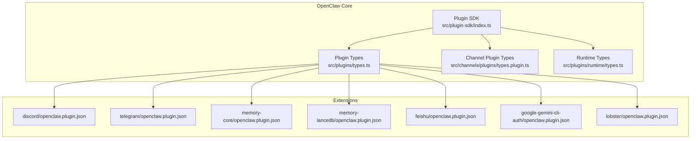
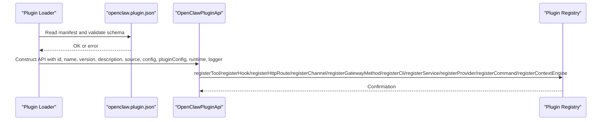
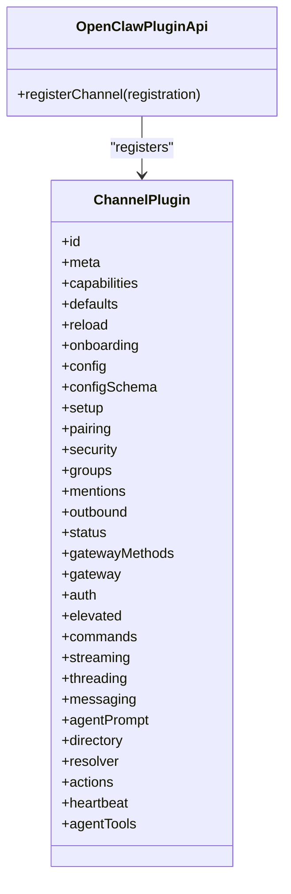
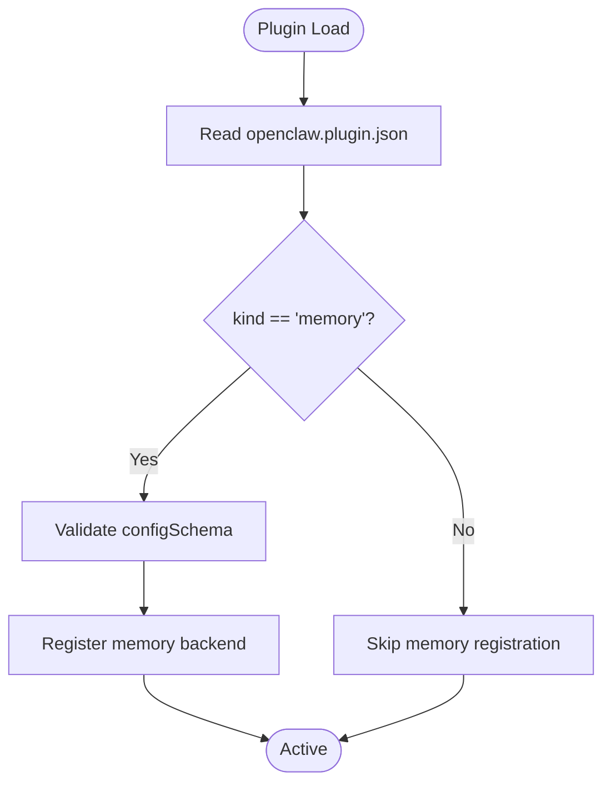
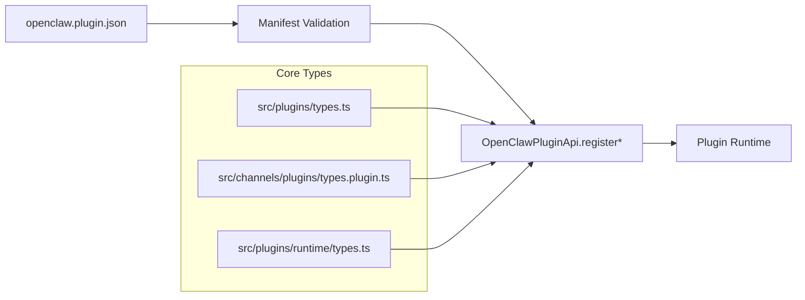

# Plugin Types & Categories

<cite>
**Referenced Files in This Document**
- [index.ts](file://src/plugin-sdk/index.ts)
- [types.ts](file://src/plugins/types.ts)
- [types.plugin.ts](file://src/channels/plugins/types.plugin.ts)
- [runtime/types.ts](file://src/plugins/runtime/types.ts)
- [manifest.md](file://docs/plugins/manifest.md)
- [discord/openclaw.plugin.json](file://extensions/discord/openclaw.plugin.json)
- [telegram/openclaw.plugin.json](file://extensions/telegram/openclaw.plugin.json)
- [memory-core/openclaw.plugin.json](file://extensions/memory-core/openclaw.plugin.json)
- [memory-lancedb/openclaw.plugin.json](file://extensions/memory-lancedb/openclaw.plugin.json)
- [google-gemini-cli-auth/openclaw.plugin.json](file://extensions/google-gemini-cli-auth/openclaw.plugin.json)
- [feishu/openclaw.plugin.json](file://extensions/feishu/openclaw.plugin.json)
- [lobster/openclaw.plugin.json](file://extensions/lobster/openclaw.plugin.json)
</cite>

## Table of Contents
1. [Introduction](#introduction)
2. [Project Structure](#project-structure)
3. [Core Components](#core-components)
4. [Architecture Overview](#architecture-overview)
5. [Detailed Component Analysis](#detailed-component-analysis)
6. [Dependency Analysis](#dependency-analysis)
7. [Performance Considerations](#performance-considerations)
8. [Troubleshooting Guide](#troubleshooting-guide)
9. [Conclusion](#conclusion)

## Introduction
This document explains the plugin types and categories available in OpenClaw, focusing on how plugins integrate into the system and how to develop them. It covers:
- Channel plugins for integrating new messaging platforms
- Skill plugins for domain-specific functionality
- Memory plugins for storage backends
- Authentication plugins for new provider auth methods

It also documents the development requirements, interfaces, and integration patterns for each category, with references to real plugin manifests and examples.

## Project Structure
OpenClaw organizes plugins primarily under two locations:
- Built-in SDK surface and plugin APIs: src/plugin-sdk/index.ts and src/plugins/types.ts define the plugin system’s public API and core types.
- Extension plugins: extensions/<plugin>/openclaw.plugin.json defines plugin manifests and capabilities.

**Diagram sources**
- [index.ts](file://src/plugin-sdk/index.ts#L1-L130)
- [types.ts](file://src/plugins/types.ts#L248-L306)
- [types.plugin.ts](file://src/channels/plugins/types.plugin.ts#L49-L85)
- [runtime/types.ts](file://src/plugins/runtime/types.ts#L51-L63)
- [discord/openclaw.plugin.json](file://extensions/discord/openclaw.plugin.json#L1-L10)
- [telegram/openclaw.plugin.json](file://extensions/telegram/openclaw.plugin.json#L1-L10)
- [memory-core/openclaw.plugin.json](file://extensions/memory-core/openclaw.plugin.json#L1-L10)
- [memory-lancedb/openclaw.plugin.json](file://extensions/memory-lancedb/openclaw.plugin.json#L1-L89)
- [feishu/openclaw.plugin.json](file://extensions/feishu/openclaw.plugin.json#L1-L11)
- [google-gemini-cli-auth/openclaw.plugin.json](file://extensions/google-gemini-cli-auth/openclaw.plugin.json#L1-L10)
- [lobster/openclaw.plugin.json](file://extensions/lobster/openclaw.plugin.json#L1-L11)

**Section sources**
- [index.ts](file://src/plugin-sdk/index.ts#L1-L130)
- [types.ts](file://src/plugins/types.ts#L248-L306)
- [types.plugin.ts](file://src/channels/plugins/types.plugin.ts#L49-L85)
- [runtime/types.ts](file://src/plugins/runtime/types.ts#L51-L63)
- [discord/openclaw.plugin.json](file://extensions/discord/openclaw.plugin.json#L1-L10)
- [telegram/openclaw.plugin.json](file://extensions/telegram/openclaw.plugin.json#L1-L10)
- [memory-core/openclaw.plugin.json](file://extensions/memory-core/openclaw.plugin.json#L1-L10)
- [memory-lancedb/openclaw.plugin.json](file://extensions/memory-lancedb/openclaw.plugin.json#L1-L89)
- [feishu/openclaw.plugin.json](file://extensions/feishu/openclaw.plugin.json#L1-L11)
- [google-gemini-cli-auth/openclaw.plugin.json](file://extensions/google-gemini-cli-auth/openclaw.plugin.json#L1-L10)
- [lobster/openclaw.plugin.json](file://extensions/lobster/openclaw.plugin.json#L1-L11)

## Core Components
OpenClaw’s plugin system centers around a small set of core types and an API surface that plugins use to register capabilities:
- OpenClawPluginApi: The primary interface plugins receive during registration, enabling them to register tools, hooks, HTTP routes, channels, gateway methods, CLI commands, services, providers, and commands.
- OpenClawPluginDefinition: The shape of a plugin definition object or function that returns one.
- Plugin kinds: “memory” and “context-engine” are supported via the manifest’s kind field.
- ChannelPlugin: The interface for channel integrations, including adapters for configuration, setup, pairing, security, groups, mentions, outbound messaging, status, gateway, auth, elevated operations, commands, streaming, threading, messaging, agent prompts, directory, resolver, message actions, heartbeat, and agent tools.

Key responsibilities:
- Channel plugins expose a ChannelPlugin with capability adapters to integrate a new messaging platform.
- Memory plugins declare kind: "memory" and supply a config schema; only one memory plugin is active at a time (exclusive slot).
- Authentication plugins declare providers and supply provider auth methods for new model/provider auth flows.
- Skill plugins are loaded from plugin directories and provide domain-specific tools and commands.

**Section sources**
- [types.ts](file://src/plugins/types.ts#L248-L306)
- [types.ts](file://src/plugins/types.ts#L259-L261)
- [types.ts](file://src/plugins/types.ts#L38-L42)
- [types.plugin.ts](file://src/channels/plugins/types.plugin.ts#L49-L85)

## Architecture Overview
The plugin system composes three layers:
- Manifest-driven discovery and validation: Every plugin must include a manifest with an id and a configSchema. The manifest can also declare kind, channels, providers, and skills directories.
- Registration API: Plugins register capabilities via OpenClawPluginApi during activation.
- Runtime integration: Plugins can expose tools, hooks, HTTP routes, gateway methods, CLI commands, services, providers, and commands.

**Diagram sources**
- [manifest.md](file://docs/plugins/manifest.md#L9-L76)
- [types.ts](file://src/plugins/types.ts#L263-L306)

**Section sources**
- [manifest.md](file://docs/plugins/manifest.md#L9-L76)
- [types.ts](file://src/plugins/types.ts#L263-L306)

## Detailed Component Analysis

### Channel Plugins
Purpose:
- Integrate a new messaging platform by implementing a ChannelPlugin with capability adapters.

Interfaces and capabilities:
- ChannelPlugin exposes adapters for configuration, setup, pairing, security, groups, mentions, outbound messaging, status, gateway, auth, elevated operations, commands, streaming, threading, messaging, agent prompts, directory, resolver, message actions, heartbeat, and agent tools.

Integration pattern:
- Declare channels in the manifest (e.g., channels: ["discord"]).
- Implement and register the ChannelPlugin via OpenClawPluginApi.registerChannel.

Examples:
- Discord plugin manifest declares channels: ["discord"].
- Telegram plugin manifest declares channels: ["telegram"].
- Feishu plugin manifest declares channels: ["feishu"] and skills: ["./skills"].

Best practices:
- Keep configSchema minimal and explicit.
- Provide onboarding adapters for streamlined setup.
- Implement only the adapters your platform supports to reduce complexity.

**Diagram sources**
- [types.plugin.ts](file://src/channels/plugins/types.plugin.ts#L49-L85)
- [types.ts](file://src/plugins/types.ts#L283-L283)

**Section sources**
- [types.plugin.ts](file://src/channels/plugins/types.plugin.ts#L49-L85)
- [discord/openclaw.plugin.json](file://extensions/discord/openclaw.plugin.json#L1-L10)
- [telegram/openclaw.plugin.json](file://extensions/telegram/openclaw.plugin.json#L1-L10)
- [feishu/openclaw.plugin.json](file://extensions/feishu/openclaw.plugin.json#L1-L11)

### Skill Plugins
Purpose:
- Provide domain-specific tools and commands that extend agent capabilities.

Integration pattern:
- Declare skills directories in the manifest (e.g., skills: ["./skills"]).
- Implement tools and commands; they are automatically loaded and available to agents.

Example:
- Feishu plugin manifest includes skills: ["./skills"].

Best practices:
- Keep skills self-contained and idempotent.
- Use clear command names and descriptions.
- Provide helpful help text and validation.

**Section sources**
- [feishu/openclaw.plugin.json](file://extensions/feishu/openclaw.plugin.json#L1-L11)

### Memory Plugins
Purpose:
- Provide persistent storage backends for memories and embeddings.

Integration pattern:
- Declare kind: "memory" in the manifest.
- Supply a configSchema that describes required and optional settings (e.g., embedding provider configuration, database path, auto-capture/recall toggles).

Examples:
- memory-core plugin manifest declares kind: "memory".
- memory-lancedb plugin manifest declares kind: "memory" and includes uiHints and a comprehensive configSchema for embedding settings, dbPath, and behavior toggles.

Best practices:
- Clearly document sensitive configuration fields using uiHints.
- Validate required fields in the configSchema.
- Support exclusive selection via plugins.slots.memory.

**Diagram sources**
- [manifest.md](file://docs/plugins/manifest.md#L38-L72)
- [memory-core/openclaw.plugin.json](file://extensions/memory-core/openclaw.plugin.json#L1-L10)
- [memory-lancedb/openclaw.plugin.json](file://extensions/memory-lancedb/openclaw.plugin.json#L1-L89)

**Section sources**
- [manifest.md](file://docs/plugins/manifest.md#L38-L72)
- [memory-core/openclaw.plugin.json](file://extensions/memory-core/openclaw.plugin.json#L1-L10)
- [memory-lancedb/openclaw.plugin.json](file://extensions/memory-lancedb/openclaw.plugin.json#L1-L89)

### Authentication Plugins
Purpose:
- Add new provider authentication methods (OAuth, API key, token, device code, or custom).

Integration pattern:
- Declare providers in the manifest (e.g., providers: ["google-gemini-cli"]).
- Implement ProviderPlugin with auth methods that produce ProviderAuthResult profiles and optional model/default selections.

Example:
- google-gemini-cli-auth plugin manifest declares providers: ["google-gemini-cli"].

Best practices:
- Provide clear labels and hints for auth methods.
- Use WizardPrompter and runtime helpers to guide users through setup.
- Support refreshOAuth when applicable.

**Section sources**
- [google-gemini-cli-auth/openclaw.plugin.json](file://extensions/google-gemini-cli-auth/openclaw.plugin.json#L1-L10)
- [types.ts](file://src/plugins/types.ts#L122-L132)
- [types.ts](file://src/plugins/types.ts#L114-L120)

## Dependency Analysis
The plugin system’s core types and SDK surface are decoupled from specific implementations. Manifests drive discovery and validation, while the API enables registration.

**Diagram sources**
- [manifest.md](file://docs/plugins/manifest.md#L9-L76)
- [types.ts](file://src/plugins/types.ts#L263-L306)
- [types.plugin.ts](file://src/channels/plugins/types.plugin.ts#L49-L85)
- [runtime/types.ts](file://src/plugins/runtime/types.ts#L51-L63)

**Section sources**
- [manifest.md](file://docs/plugins/manifest.md#L9-L76)
- [types.ts](file://src/plugins/types.ts#L263-L306)
- [types.plugin.ts](file://src/channels/plugins/types.plugin.ts#L49-L85)
- [runtime/types.ts](file://src/plugins/runtime/types.ts#L51-L63)

## Performance Considerations
- Prefer lightweight ChannelPlugin adapters that implement only required capabilities to minimize overhead.
- Use runtime subagent APIs judiciously; batch operations when possible.
- For memory plugins, tune auto-capture/recall thresholds to balance recall quality and performance.
- Keep configSchema minimal to reduce validation overhead.

## Troubleshooting Guide
Common issues and resolutions:
- Missing or invalid manifest: The loader validates the manifest and blocks installation if invalid. Ensure id and configSchema are present and valid.
- Unknown channel/provider ids: Only declared ids are recognized; fix manifest entries or implement the missing adapter.
- Disabled plugin with existing config: The system keeps config and warns; enable the plugin or remove stale config.
- Exclusive slots: Only one memory or context engine plugin can be active; adjust plugins.slots.* accordingly.

**Section sources**
- [manifest.md](file://docs/plugins/manifest.md#L53-L62)

## Conclusion
OpenClaw’s plugin system offers a clear, manifest-driven approach to extending the platform:
- Channel plugins integrate new messaging platforms via a rich set of capability adapters.
- Skill plugins add domain-specific tools and commands.
- Memory plugins provide storage backends with exclusive selection.
- Authentication plugins bring new provider auth methods.

Follow the manifest requirements, implement only the necessary adapters, and leverage the OpenClawPluginApi to register capabilities cleanly.