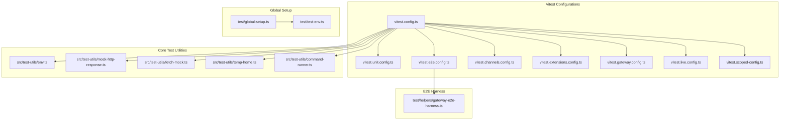
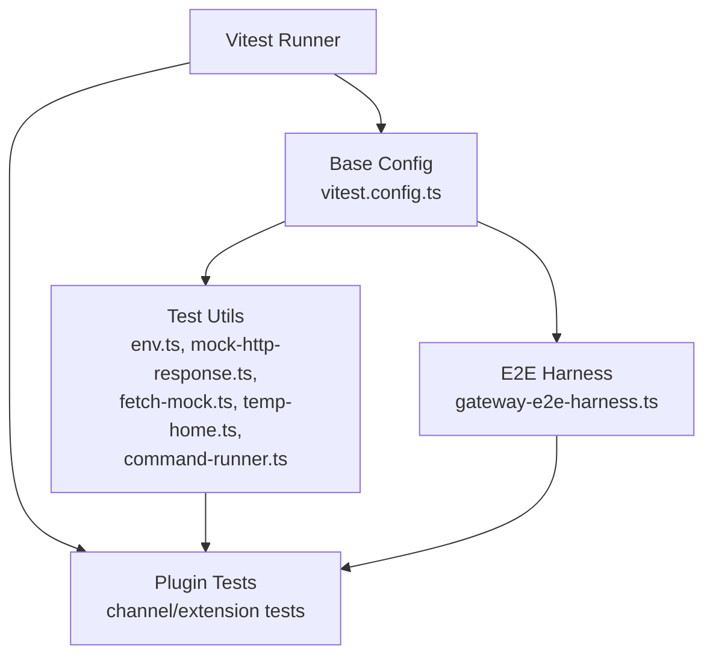
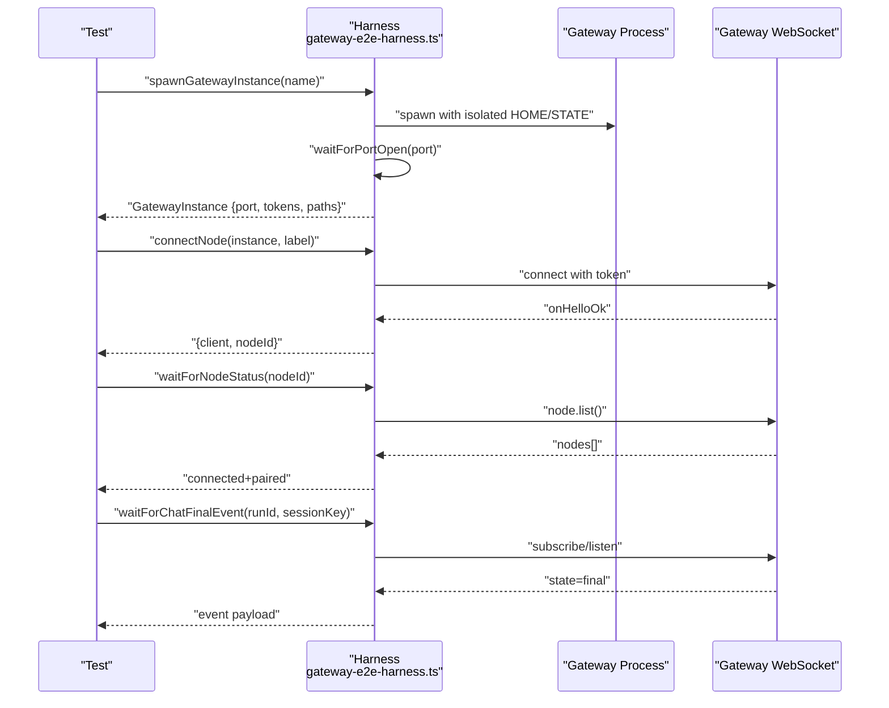
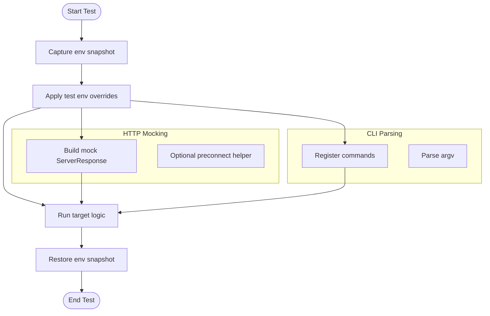
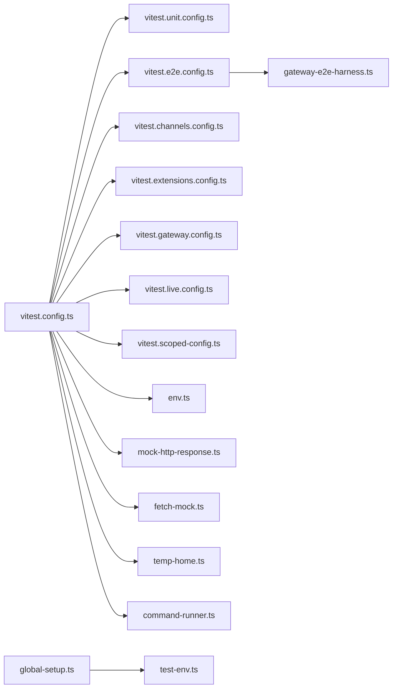

# Testing & Quality Assurance

<cite>
**Referenced Files in This Document**
- [vitest.config.ts](file://vitest.config.ts)
- [vitest.unit.config.ts](file://vitest.unit.config.ts)
- [vitest.e2e.config.ts](file://vitest.e2e.config.ts)
- [env.ts](file://src/test-utils/env.ts)
- [mock-http-response.ts](file://src/test-utils/mock-http-response.ts)
- [fetch-mock.ts](file://src/test-utils/fetch-mock.ts)
- [temp-home.ts](file://src/test-utils/temp-home.ts)
- [command-runner.ts](file://src/test-utils/command-runner.ts)
- [gateway-e2e-harness.ts](file://test/helpers/gateway-e2e-harness.ts)
- [global-setup.ts](file://test/global-setup.ts)
- [test-env.ts](file://test/test-env.ts)
- [channels.config.ts](file://vitest.channels.config.ts)
- [extensions.config.ts](file://vitest.extensions.config.ts)
- [gateway.config.ts](file://vitest.gateway.config.ts)
- [live.config.ts](file://vitest.live.config.ts)
- [scoped.config.ts](file://vitest.scoped-config.ts)
- [unit.config.ts](file://vitest.unit.config.ts)
- [appcast.test.ts](file://test/appcast.test.ts)
- [cli-json-stdout.e2e.test.ts](file://test/cli-json-stdout.e2e.test.ts)
- [gateway.multi.e2e.test.ts](file://test/gateway.multi.e2.e2e.test.ts)
- [git-hooks-pre-commit.test.ts](file://test/git-hooks-pre-commit.test.ts)
- [release-check.test.ts](file://test/release-check.test.ts)
- [ui.presenter-next-run.test.ts](file://test/ui.presenter-next-run.test.ts)
- [bluebubbles.accounts.test.ts](file://extensions/bluebubbles/src/accounts.test.ts)
- [memory-lancedb.index.test.ts](file://extensions/memory-lancedb/src/index.test.ts)
- [phone-control.index.test.ts](file://extensions/phone-control/src/index.test.ts)
- [thread-ownership.index.test.ts](file://extensions/thread-ownership/src/index.test.ts)
- [google-gemini-cli-auth.oauth.test.ts](file://extensions/google-gemini-cli-auth/src/oauth.test.ts)
- [twitch.test.ts](file://extensions/twitch/src/test/)
- [nostr.test.ts](file://extensions/nostr/src/test/)
</cite>

## Table of Contents
1. [Introduction](#introduction)
2. [Project Structure](#project-structure)
3. [Core Components](#core-components)
4. [Architecture Overview](#architecture-overview)
5. [Detailed Component Analysis](#detailed-component-analysis)
6. [Dependency Analysis](#dependency-analysis)
7. [Performance Considerations](#performance-considerations)
8. [Troubleshooting Guide](#troubleshooting-guide)
9. [Conclusion](#conclusion)
10. [Appendices](#appendices)

## Introduction
This document describes the testing and quality assurance approach for OpenClaw plugins and the broader platform. It covers unit testing, integration and end-to-end (E2E) testing, plugin-specific testing utilities, mock frameworks, and helpers. It also outlines best practices, common patterns, and continuous integration considerations to ensure reliable plugin behavior across diverse environments.

## Project Structure
OpenClaw organizes tests around Vitest configurations tailored to different scopes:
- Unit tests: focused on pure logic and small units
- E2E tests: integration with real processes and external systems
- Plugin tests: channel plugins, extensions, and specialized helpers
- Global setup and environment management for deterministic runs

**Diagram sources**
- [vitest.config.ts](file://vitest.config.ts#L57-L202)
- [vitest.unit.config.ts](file://vitest.unit.config.ts#L1-L31)
- [vitest.e2e.config.ts](file://vitest.e2e.config.ts#L1-L33)
- [env.ts](file://src/test-utils/env.ts#L1-L73)
- [mock-http-response.ts](file://src/test-utils/mock-http-response.ts#L1-L28)
- [fetch-mock.ts](file://src/test-utils/fetch-mock.ts#L1-L23)
- [temp-home.ts](file://src/test-utils/temp-home.ts#L1-L44)
- [command-runner.ts](file://src/test-utils/command-runner.ts#L1-L11)
- [gateway-e2e-harness.ts](file://test/helpers/gateway-e2e-harness.ts#L104-L191)
- [global-setup.ts](file://test/global-setup.ts#L1-L7)
- [test-env.ts](file://test/test-env.ts)

**Section sources**
- [vitest.config.ts](file://vitest.config.ts#L57-L202)
- [vitest.unit.config.ts](file://vitest.unit.config.ts#L1-L31)
- [vitest.e2e.config.ts](file://vitest.e2e.config.ts#L1-L33)

## Core Components
- Vitest base configuration defines worker pools, timeouts, environment stubbing, coverage thresholds, and inclusion/exclusion patterns for tests across core, extensions, and app packages.
- Unit and E2E scoped configs refine include/exclude sets and worker counts for determinism and performance.
- Test utilities provide environment capture/restore, temporary home directories, mock HTTP response builders, and CLI command runners.
- E2E harness spawns a minimal gateway instance, manages lifecycle, and exposes helpers to wait for node connectivity and chat completion events.

Key capabilities:
- Deterministic environment isolation via scoped env snapshots and restoration
- Lightweight HTTP mocking helpers for plugin HTTP clients
- Temporary filesystem roots for state and configuration isolation
- CLI parsing helpers for testing command registration and argument parsing
- Robust E2E lifecycle management for gateway instances

**Section sources**
- [env.ts](file://src/test-utils/env.ts#L1-L73)
- [mock-http-response.ts](file://src/test-utils/mock-http-response.ts#L1-L28)
- [fetch-mock.ts](file://src/test-utils/fetch-mock.ts#L1-L23)
- [temp-home.ts](file://src/test-utils/temp-home.ts#L1-L44)
- [command-runner.ts](file://src/test-utils/command-runner.ts#L1-L11)
- [gateway-e2e-harness.ts](file://test/helpers/gateway-e2e-harness.ts#L104-L191)

## Architecture Overview
The testing architecture separates concerns across layers:
- Test runner layer: Vitest configurations orchestrate test discovery, execution, and coverage
- Utility layer: Shared helpers enable environment isolation, HTTP mocking, and CLI parsing
- E2E layer: Gateway harness manages a real gateway process and exposes connection/status helpers
- Plugin layer: Channel and extension tests leverage shared utilities and harnesses

**Diagram sources**
- [vitest.config.ts](file://vitest.config.ts#L57-L202)
- [env.ts](file://src/test-utils/env.ts#L1-L73)
- [mock-http-response.ts](file://src/test-utils/mock-http-response.ts#L1-L28)
- [fetch-mock.ts](file://src/test-utils/fetch-mock.ts#L1-L23)
- [temp-home.ts](file://src/test-utils/temp-home.ts#L1-L44)
- [command-runner.ts](file://src/test-utils/command-runner.ts#L1-L11)
- [gateway-e2e-harness.ts](file://test/helpers/gateway-e2e-harness.ts#L104-L191)

## Detailed Component Analysis

### Unit Testing Strategy
- Scope: Pure functions, small modules, and isolated logic
- Coverage: Enforced thresholds; excludes large integration surfaces and entrypoints
- Determinism: Environment stubbing and per-test isolation to prevent cross-file pollution
- Workers: Balanced CPU utilization with CI-aware defaults

Recommended patterns:
- Use environment capture/restore helpers to isolate process.env effects
- Prefer deterministic time sources and frozen time utilities when applicable
- Mock external HTTP calls with lightweight helpers to avoid flakiness

**Section sources**
- [vitest.config.ts](file://vitest.config.ts#L71-L120)
- [vitest.config.ts](file://vitest.config.ts#L101-L122)
- [env.ts](file://src/test-utils/env.ts#L1-L73)

### Integration Testing Patterns
- Focus on module boundaries and inter-module contracts
- Use temporary home directories to avoid state leakage across tests
- Employ CLI command runners to validate argument parsing and command registration

Best practices:
- Encapsulate environment mutations in a scoped block and restore after
- Use temporary directories for config/state to avoid side effects
- Validate CLI behavior by registering commands and asserting parse outcomes

**Section sources**
- [temp-home.ts](file://src/test-utils/temp-home.ts#L1-L44)
- [command-runner.ts](file://src/test-utils/command-runner.ts#L1-L11)
- [env.ts](file://src/test-utils/env.ts#L51-L73)

### End-to-End (E2E) Testing Workflow
- Lifecycle: Spawn a minimal gateway instance with ephemeral config and state directories
- Connectivity: Wait for the gateway to bind a free port and establish node connections
- Assertions: Poll for node pairing/connectivity and chat finalization events
- Cleanup: Stop the gateway gracefully and remove temporary directories

**Diagram sources**
- [gateway-e2e-harness.ts](file://test/helpers/gateway-e2e-harness.ts#L104-L191)
- [gateway-e2e-harness.ts](file://test/helpers/gateway-e2e-harness.ts#L265-L288)
- [gateway-e2e-harness.ts](file://test/helpers/gateway-e2e-harness.ts#L339-L362)
- [gateway-e2e-harness.ts](file://test/helpers/gateway-e2e-harness.ts#L364-L382)

**Section sources**
- [gateway-e2e-harness.ts](file://test/helpers/gateway-e2e-harness.ts#L104-L191)
- [gateway-e2e-harness.ts](file://test/helpers/gateway-e2e-harness.ts#L265-L288)
- [gateway-e2e-harness.ts](file://test/helpers/gateway-e2e-harness.ts#L339-L362)
- [gateway-e2e-harness.ts](file://test/helpers/gateway-e2e-harness.ts#L364-L382)

### Plugin Test Utilities and Helpers
- Environment management: Capture and restore environment variables to ensure test isolation
- HTTP mocking: Build mock server responses and optional preconnect helpers for fetch-like APIs
- CLI parsing: Register and parse CLI commands programmatically for testing
- Temporary home: Create isolated HOME and state directories for tests

**Diagram sources**
- [env.ts](file://src/test-utils/env.ts#L1-L73)
- [mock-http-response.ts](file://src/test-utils/mock-http-response.ts#L1-L28)
- [fetch-mock.ts](file://src/test-utils/fetch-mock.ts#L1-L23)
- [command-runner.ts](file://src/test-utils/command-runner.ts#L1-L11)

**Section sources**
- [env.ts](file://src/test-utils/env.ts#L1-L73)
- [mock-http-response.ts](file://src/test-utils/mock-http-response.ts#L1-L28)
- [fetch-mock.ts](file://src/test-utils/fetch-mock.ts#L1-L23)
- [command-runner.ts](file://src/test-utils/command-runner.ts#L1-L11)

### Example: Testing Plugin Functionality
Common scenarios:
- Channel plugin authentication flows: Validate OAuth handlers and webhook routes
- Memory plugin persistence: Assert database writes and reads under controlled state
- Device control plugin: Verify command execution and response handling
- Thread ownership plugin: Confirm ownership transitions and conflict resolution

Patterns:
- Use environment helpers to inject credentials and disable non-essential subsystems
- Use temporary home to isolate persistent state
- For HTTP-dependent plugins, wrap fetch with preconnect helpers to simulate network conditions
- For CLI-driven plugins, register commands and assert parse outcomes

**Section sources**
- [env.ts](file://src/test-utils/env.ts#L51-L73)
- [temp-home.ts](file://src/test-utils/temp-home.ts#L1-L44)
- [fetch-mock.ts](file://src/test-utils/fetch-mock.ts#L1-L23)
- [google-gemini-cli-auth.oauth.test.ts](file://extensions/google-gemini-cli-auth/src/oauth.test.ts)
- [memory-lancedb.index.test.ts](file://extensions/memory-lancedb/src/index.test.ts)
- [phone-control.index.test.ts](file://extensions/phone-control/src/index.test.ts)
- [thread-ownership.index.test.ts](file://extensions/thread-ownership/src/index.test.ts)

### Continuous Integration Considerations
- Worker scaling: CI workers are tuned per platform and CPU availability
- Determinism: vmForks can leak state; E2E uses process forks for isolation
- Coverage: Thresholds and include/exclude lists focus coverage on exercised code
- Global setup: A single global setup installs a consistent test environment and cleans up afterward

Recommendations:
- Keep E2E suites deterministic; avoid relying on external timing-sensitive resources
- Use environment helpers to stub platform-specific paths and credentials
- Parallelize unit tests but cap concurrency for resource-intensive suites

**Section sources**
- [vitest.config.ts](file://vitest.config.ts#L7-L11)
- [vitest.config.ts](file://vitest.config.ts#L71-L120)
- [vitest.e2e.config.ts](file://vitest.e2e.config.ts#L24-L26)
- [global-setup.ts](file://test/global-setup.ts#L1-L7)
- [test-env.ts](file://test/test-env.ts)

## Dependency Analysis
The testing stack depends on:
- Vitest base configuration for test discovery, timeouts, coverage, and worker management
- Scoped configurations for unit and E2E suites
- Shared utilities for environment and filesystem isolation
- E2E harness for gateway lifecycle and connectivity

**Diagram sources**
- [vitest.config.ts](file://vitest.config.ts#L57-L202)
- [vitest.unit.config.ts](file://vitest.unit.config.ts#L1-L31)
- [vitest.e2e.config.ts](file://vitest.e2e.config.ts#L1-L33)
- [env.ts](file://src/test-utils/env.ts#L1-L73)
- [mock-http-response.ts](file://src/test-utils/mock-http-response.ts#L1-L28)
- [fetch-mock.ts](file://src/test-utils/fetch-mock.ts#L1-L23)
- [temp-home.ts](file://src/test-utils/temp-home.ts#L1-L44)
- [command-runner.ts](file://src/test-utils/command-runner.ts#L1-L11)
- [gateway-e2e-harness.ts](file://test/helpers/gateway-e2e-harness.ts#L104-L191)
- [global-setup.ts](file://test/global-setup.ts#L1-L7)
- [test-env.ts](file://test/test-env.ts)

**Section sources**
- [vitest.config.ts](file://vitest.config.ts#L57-L202)
- [env.ts](file://src/test-utils/env.ts#L1-L73)
- [gateway-e2e-harness.ts](file://test/helpers/gateway-e2e-harness.ts#L104-L191)

## Performance Considerations
- Worker selection: Base config scales workers based on CPU and platform; E2E config limits concurrency for determinism
- Coverage scope: Excludes heavy integration surfaces to maintain manageable coverage thresholds
- Pool choice: vmForks for unit tests; forks for E2E to avoid module-state leakage
- Timeouts: Extended test and hook timeouts accommodate slower environments

[No sources needed since this section provides general guidance]

## Troubleshooting Guide
Common issues and resolutions:
- Flaky E2E due to timing: Use harness helpers to poll for node status and chat finalization; reduce concurrency
- Environment leakage: Ensure env snapshots are captured and restored around sensitive tests
- Temporary directory cleanup: Use temporary home helpers to guarantee cleanup after failures
- HTTP mocking: Prefer mock server response builders for predictable assertions

**Section sources**
- [gateway-e2e-harness.ts](file://test/helpers/gateway-e2e-harness.ts#L339-L362)
- [env.ts](file://src/test-utils/env.ts#L1-L73)
- [temp-home.ts](file://src/test-utils/temp-home.ts#L1-L44)

## Conclusion
OpenClaw’s testing framework emphasizes isolation, determinism, and scalability. Unit tests enforce quality with scoped environment management and targeted coverage. Integration and E2E tests validate real-world behavior using a robust gateway harness. Plugin authors can leverage shared utilities to implement reliable, portable tests across platforms and environments.

[No sources needed since this section summarizes without analyzing specific files]

## Appendices

### Appendix A: Example Test Categories
- Application-level smoke checks: [appcast.test.ts](file://test/appcast.test.ts)
- CLI E2E: [cli-json-stdout.e2e.test.ts](file://test/cli-json-stdout.e2e.test.ts)
- Multi-gateway E2E: [gateway.multi.e2e.test.ts](file://test/gateway.multi.e2e.test.ts)
- Pre-commit validations: [git-hooks-pre-commit.test.ts](file://test/git-hooks-pre-commit.test.ts)
- Release checks: [release-check.test.ts](file://test/release-check.test.ts)
- UI presenter run: [ui.presenter-next-run.test.ts](file://test/ui.presenter-next-run.test.ts)

**Section sources**
- [appcast.test.ts](file://test/appcast.test.ts)
- [cli-json-stdout.e2e.test.ts](file://test/cli-json-stdout.e2e.test.ts)
- [gateway.multi.e2e.test.ts](file://test/gateway.multi.e2e.test.ts)
- [git-hooks-pre-commit.test.ts](file://test/git-hooks-pre-commit.test.ts)
- [release-check.test.ts](file://test/release-check.test.ts)
- [ui.presenter-next-run.test.ts](file://test/ui.presenter-next-run.test.ts)

### Appendix B: Plugin-Specific Test Examples
- Bluebubbles accounts: [bluebubbles.accounts.test.ts](file://extensions/bluebubbles/src/accounts.test.ts)
- Memory LanceDB: [memory-lancedb.index.test.ts](file://extensions/memory-lancedb/src/index.test.ts)
- Phone control: [phone-control.index.test.ts](file://extensions/phone-control/src/index.test.ts)
- Thread ownership: [thread-ownership.index.test.ts](file://extensions/thread-ownership/src/index.test.ts)
- Google Gemini CLI auth: [google-gemini-cli-auth.oauth.test.ts](file://extensions/google-gemini-cli-auth/src/oauth.test.ts)
- Twitch tests: [twitch.test.ts](file://extensions/twitch/src/test/)
- Nostr tests: [nostr.test.ts](file://extensions/nostr/src/test/)

**Section sources**
- [bluebubbles.accounts.test.ts](file://extensions/bluebubbles/src/accounts.test.ts)
- [memory-lancedb.index.test.ts](file://extensions/memory-lancedb/src/index.test.ts)
- [phone-control.index.test.ts](file://extensions/phone-control/src/index.test.ts)
- [thread-ownership.index.test.ts](file://extensions/thread-ownership/src/index.test.ts)
- [google-gemini-cli-auth.oauth.test.ts](file://extensions/google-gemini-cli-auth/src/oauth.test.ts)
- [twitch.test.ts](file://extensions/twitch/src/test/)
- [nostr.test.ts](file://extensions/nostr/src/test/)