# Plugin Development

<cite>
**Referenced Files in This Document**
- [docs/plugins/manifest.md](file://docs/plugins/manifest.md)
- [docs/tools/plugin.md](file://docs/tools/plugin.md)
- [src/plugin-sdk/index.ts](file://src/plugin-sdk/index.ts)
- [src/plugins/types.ts](file://src/plugins/types.ts)
- [extensions/anthropic/openclaw.plugin.json](file://extensions/anthropic/openclaw.plugin.json)
- [extensions/discord/openclaw.plugin.json](file://extensions/discord/openclaw.plugin.json)
- [extensions/anthropic/index.ts](file://extensions/anthropic/index.ts)
- [extensions/discord/index.ts](file://extensions/discord/index.ts)
- [extensions/google/index.ts](file://extensions/google/index.ts)
- [extensions/memory-core/index.ts](file://extensions/memory-core/index.ts)
- [extensions/lobster/index.ts](file://extensions/lobster/index.ts)
- [extensions/firecrawl/index.ts](file://extensions/firecrawl/index.ts)
- [extensions/openshell/index.ts](file://extensions/openshell/index.ts)
- [extensions/voice-call/index.ts](file://extensions/voice-call/index.ts)
</cite>

## Table of Contents
1. [Introduction](#introduction)
2. [Project Structure](#project-structure)
3. [Core Components](#core-components)
4. [Architecture Overview](#architecture-overview)
5. [Detailed Component Analysis](#detailed-component-analysis)
6. [Dependency Analysis](#dependency-analysis)
7. [Performance Considerations](#performance-considerations)
8. [Troubleshooting Guide](#troubleshooting-guide)
9. [Conclusion](#conclusion)
10. [Appendices](#appendices)

## Introduction
This document explains how to develop plugins for OpenClaw, from concept to deployment. It covers the plugin project structure, manifest creation, development environment setup, lifecycle (registration, activation, deactivation), best practices, testing strategies, and step-by-step tutorials for creating channel adapters, skills, tools, and authentication providers. It also documents packaging, distribution, version management, debugging, logging, performance profiling, common patterns, error handling, security considerations, integration with external APIs, data persistence, and real-time communication.

## Project Structure
OpenClaw organizes plugins into two primary forms:
- Native OpenClaw plugins: TypeScript modules with an openclaw.plugin.json manifest and a register(api) entrypoint. These run in-process with the Gateway.
- Compatible bundles: Vendor-specific plugin layouts (.codex-plugin, .claude-plugin, .cursor-plugin) recognized by OpenClaw as capability packs without in-process runtime code.

Key locations:
- Native plugins: extensions/<vendor>/ (e.g., extensions/discord, extensions/anthropic)
- Manifests: openclaw.plugin.json at plugin root
- Plugin SDK: src/plugin-sdk/index.ts exports SDK subpaths for different plugin categories
- Core plugin types and registration contracts: src/plugins/types.ts

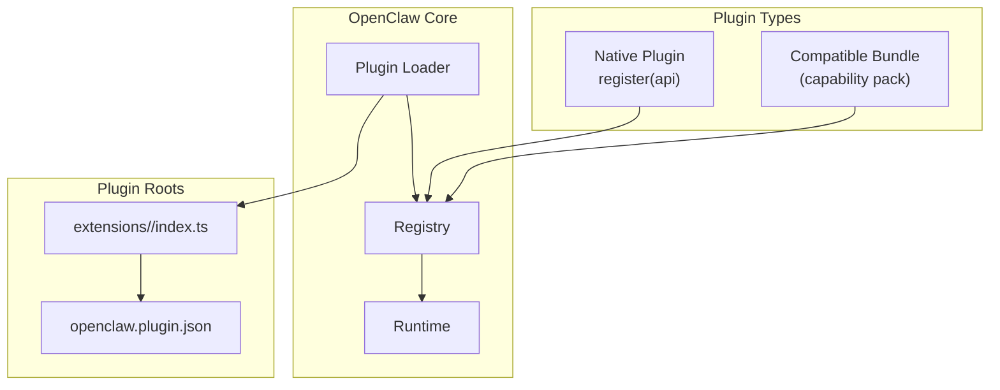

**Diagram sources**
- [docs/tools/plugin.md:60-86](file://docs/tools/plugin.md#L60-L86)
- [src/plugin-sdk/index.ts:1-20](file://src/plugin-sdk/index.ts#L1-L20)

**Section sources**
- [docs/tools/plugin.md:10-21](file://docs/tools/plugin.md#L10-L21)
- [docs/tools/plugin.md:60-86](file://docs/tools/plugin.md#L60-L86)
- [src/plugin-sdk/index.ts:1-20](file://src/plugin-sdk/index.ts#L1-L20)

## Core Components
- Plugin manifest (openclaw.plugin.json): Defines id, configSchema, optional metadata (kind, channels, providers, providerAuthEnvVars, skills, uiHints, version), and validation behavior.
- Plugin SDK: Provides typed APIs for registering providers, channels, tools, CLI commands, HTTP routes, services, and runtime helpers.
- Plugin types: Contracts for provider hooks, tool factories, gateway methods, and web search providers.

Key responsibilities:
- Manifest-first validation prevents unsafe or misconfigured plugins from executing.
- register(api) is the single entrypoint for native plugins to register capabilities.
- Provider hooks enable model catalog, dynamic model resolution, runtime auth, usage, and stream customization.

**Section sources**
- [docs/plugins/manifest.md:9-100](file://docs/plugins/manifest.md#L9-L100)
- [src/plugin-sdk/index.ts:1-20](file://src/plugin-sdk/index.ts#L1-L20)
- [src/plugins/types.ts:545-738](file://src/plugins/types.ts#L545-L738)

## Architecture Overview
OpenClaw’s plugin system has four layers:
1. Manifest + discovery: Reads manifests and package metadata from configured roots.
2. Enablement + validation: Decides enablement, blocked/disabled states, and exclusive slot selection.
3. Runtime loading: Loads native plugins via jiti and invokes register(api).
4. Surface consumption: Exposes capabilities (tools, channels, providers, hooks, HTTP routes) to the rest of OpenClaw.

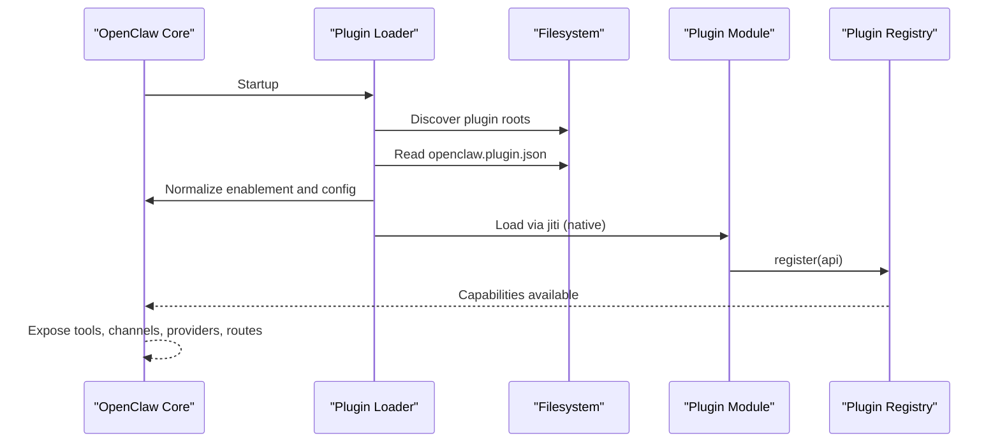

**Diagram sources**
- [docs/tools/plugin.md:440-470](file://docs/tools/plugin.md#L440-L470)
- [docs/tools/plugin.md:658-752](file://docs/tools/plugin.md#L658-L752)

**Section sources**
- [docs/tools/plugin.md:60-86](file://docs/tools/plugin.md#L60-L86)
- [docs/tools/plugin.md:440-481](file://docs/tools/plugin.md#L440-L481)
- [docs/tools/plugin.md:658-752](file://docs/tools/plugin.md#L658-L752)

## Detailed Component Analysis

### Plugin Manifest (openclaw.plugin.json)
- Required fields: id, configSchema.
- Optional fields: kind, channels, providers, providerAuthEnvVars, skills, name, description, uiHints, version.
- Validation behavior: Unknown channels/providers, invalid plugin ids, and missing/invalid manifests are treated as errors. Disabled plugins keep config with warnings.

Best practices:
- Ship a strict JSON Schema even if accepting no config.
- Use uiHints to improve Control UI labeling and guidance.
- Document providerAuthEnvVars for cheap auth probes without loading runtime.

**Section sources**
- [docs/plugins/manifest.md:36-100](file://docs/plugins/manifest.md#L36-L100)

### Plugin SDK and Registration API
- SDK exports subpaths for channel-specific plugins (e.g., openclaw/plugin-sdk/discord) and generic/core APIs.
- registerProvider, registerChannel, registerTool, registerCli, registerGatewayMethod, registerHttpRoute, registerService are the primary registration functions.
- Provider hooks include catalog, resolveDynamicModel, prepareDynamicModel, normalizeResolvedModel, capabilities, prepareExtraParams, wrapStreamFn, isCacheTtlEligible, buildMissingAuthMessage, suppressBuiltInModel, augmentModelCatalog, isBinaryThinking, supportsXHighThinking, resolveDefaultThinkingLevel, isModernModelRef, prepareRuntimeAuth, resolveUsageAuth, fetchUsageSnapshot.

**Section sources**
- [src/plugin-sdk/index.ts:1-20](file://src/plugin-sdk/index.ts#L1-L20)
- [src/plugins/types.ts:545-738](file://src/plugins/types.ts#L545-L738)

### Provider Plugin Patterns
Examples demonstrate provider catalog publication, dynamic model resolution, runtime auth exchange, and usage integration.

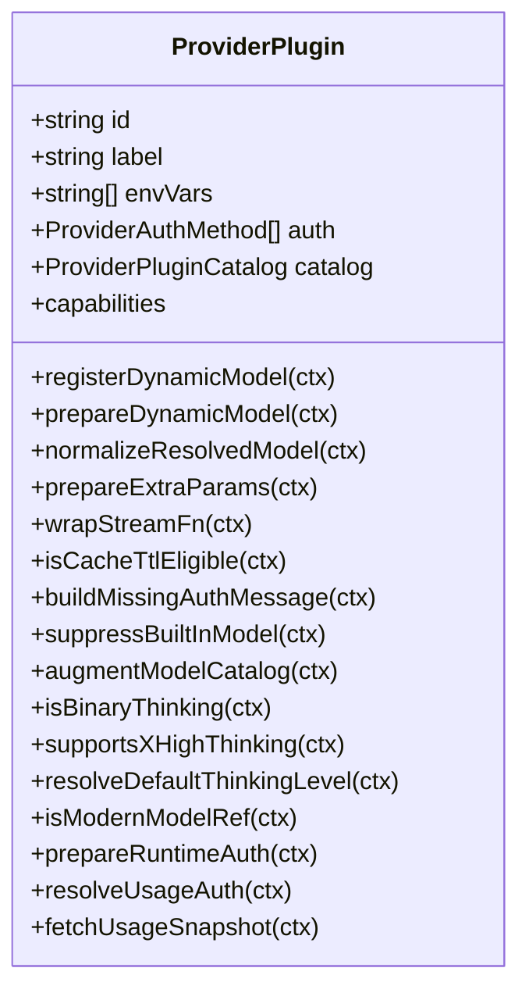

**Diagram sources**
- [src/plugins/types.ts:545-738](file://src/plugins/types.ts#L545-L738)

**Section sources**
- [extensions/anthropic/index.ts:261-319](file://extensions/anthropic/index.ts#L261-L319)
- [extensions/github-copilot/index.ts:75-142](file://extensions/github-copilot/index.ts#L75-L142)
- [extensions/google/index.ts:11-47](file://extensions/google/index.ts#L11-L47)

### Channel Adapter Plugin Pattern
Channel adapters register a ChannelPlugin and runtime helpers, and optionally subagent hooks.

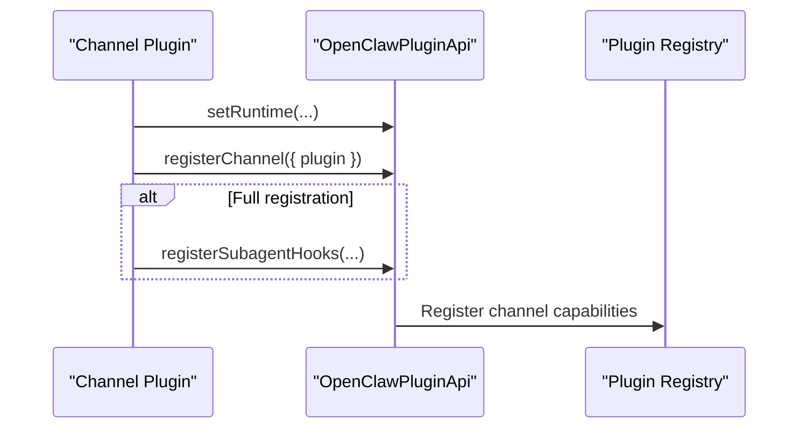

**Diagram sources**
- [extensions/discord/index.ts:7-23](file://extensions/discord/index.ts#L7-L23)

**Section sources**
- [extensions/discord/index.ts:7-23](file://extensions/discord/index.ts#L7-L23)
- [extensions/discord/openclaw.plugin.json:1-10](file://extensions/discord/openclaw.plugin.json#L1-L10)

### Tool Plugin Pattern
Tools are registered via api.registerTool and can be optional or sandbox-aware.

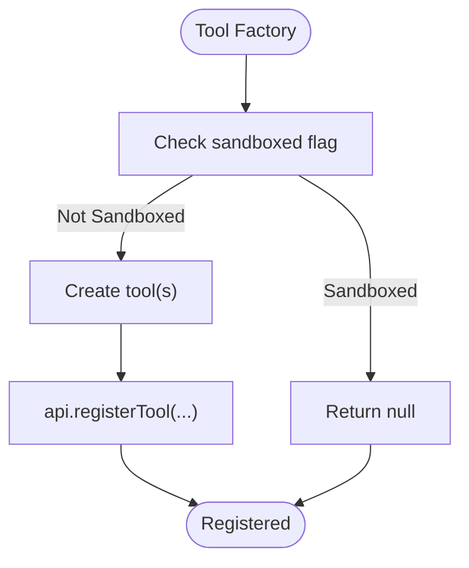

**Diagram sources**
- [extensions/lobster/index.ts:8-19](file://extensions/lobster/index.ts#L8-L19)

**Section sources**
- [extensions/lobster/index.ts:8-19](file://extensions/lobster/index.ts#L8-L19)

### Authentication Provider Plugin Pattern
Authentication providers define auth methods and wizard setup choices, and may integrate with usage endpoints.

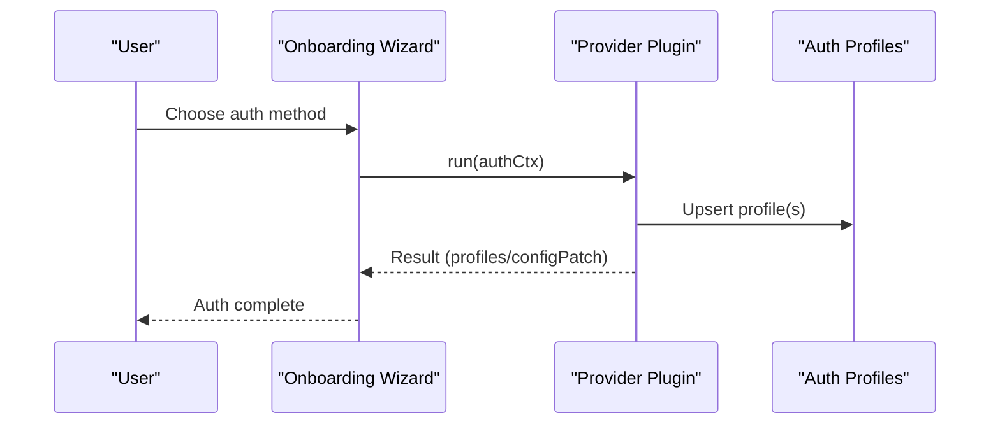

**Diagram sources**
- [extensions/anthropic/index.ts:261-319](file://extensions/anthropic/index.ts#L261-L319)

**Section sources**
- [extensions/anthropic/index.ts:261-319](file://extensions/anthropic/index.ts#L261-L319)

### Web Search Provider Plugin Pattern
Plugins can register web search providers with credential helpers and tools.

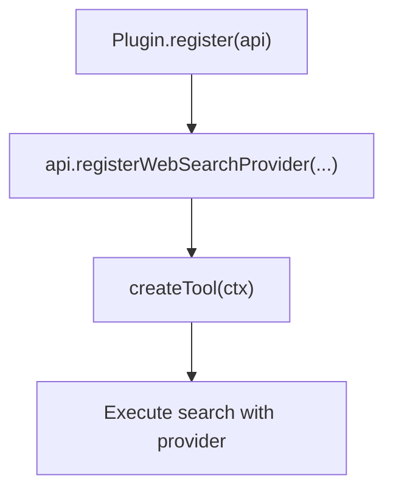

**Diagram sources**
- [extensions/firecrawl/index.ts:8-21](file://extensions/firecrawl/index.ts#L8-L21)

**Section sources**
- [extensions/firecrawl/index.ts:8-21](file://extensions/firecrawl/index.ts#L8-L21)

### Sandbox Backend Plugin Pattern
Sandbox backends can be registered conditionally based on registration mode and plugin config.

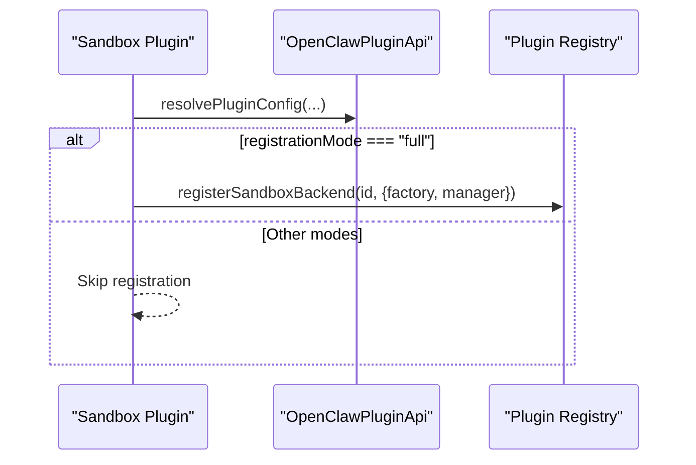

**Diagram sources**
- [extensions/openshell/index.ts:9-31](file://extensions/openshell/index.ts#L9-L31)

**Section sources**
- [extensions/openshell/index.ts:9-31](file://extensions/openshell/index.ts#L9-L31)

### Voice Call Plugin Pattern
Voice call plugin demonstrates gateway methods, tools, CLI, service lifecycle, and runtime initialization with validation.

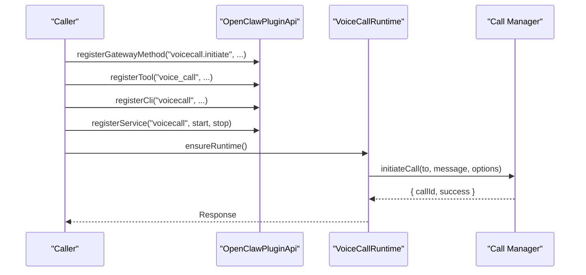

**Diagram sources**
- [extensions/voice-call/index.ts:146-565](file://extensions/voice-call/index.ts#L146-L565)

**Section sources**
- [extensions/voice-call/index.ts:146-565](file://extensions/voice-call/index.ts#L146-L565)

### Memory Plugin Pattern
Memory plugins register tools and CLI commands for memory search and retrieval.

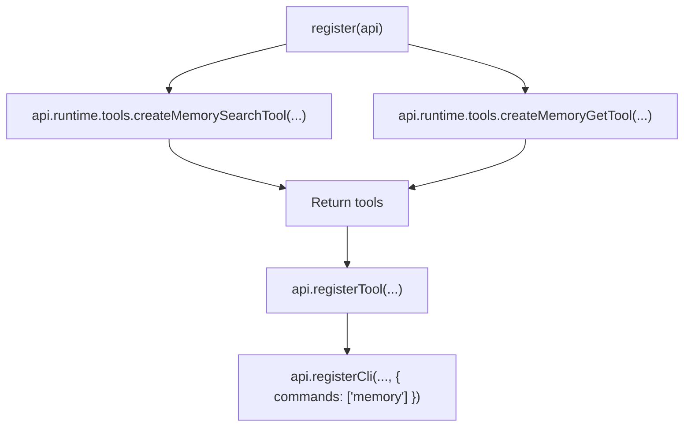

**Diagram sources**
- [extensions/memory-core/index.ts:4-39](file://extensions/memory-core/index.ts#L4-L39)

**Section sources**
- [extensions/memory-core/index.ts:4-39](file://extensions/memory-core/index.ts#L4-L39)

## Dependency Analysis
- Manifest-first design ensures discovery and validation occur before runtime execution.
- Native plugins depend on the Plugin SDK and register capabilities into the central registry.
- Provider plugins integrate with OpenClaw’s model catalog and usage systems via hooks.
- Channel adapters integrate with channel-specific SDKs and runtime helpers.

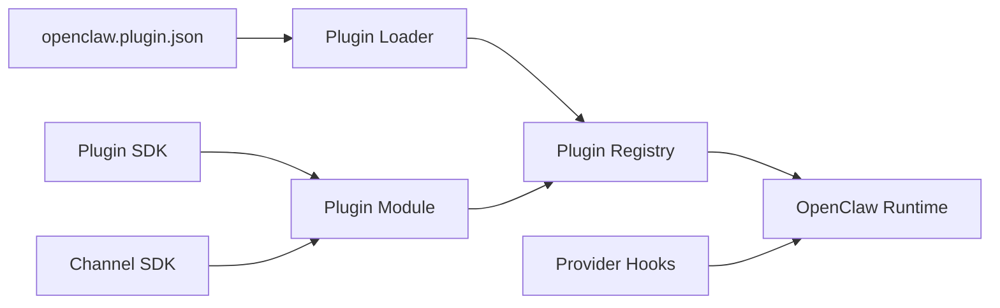

**Diagram sources**
- [docs/tools/plugin.md:458-470](file://docs/tools/plugin.md#L458-L470)
- [src/plugin-sdk/index.ts:1-20](file://src/plugin-sdk/index.ts#L1-L20)

**Section sources**
- [docs/tools/plugin.md:458-470](file://docs/tools/plugin.md#L458-L470)
- [src/plugin-sdk/index.ts:1-20](file://src/plugin-sdk/index.ts#L1-L20)

## Performance Considerations
- Short in-process caches for discovery, manifest registry, and loaded plugin registries reduce startup and reload overhead.
- Tune cache windows via OPENCLAW_PLUGIN_DISCOVERY_CACHE_MS and OPENCLAW_PLUGIN_MANIFEST_CACHE_MS.
- Disable caches for debugging using OPENCLAW_DISABLE_PLUGIN_DISCOVERY_CACHE=1 and OPENCLAW_DISABLE_PLUGIN_MANIFEST_CACHE=1.

**Section sources**
- [docs/tools/plugin.md:649-657](file://docs/tools/plugin.md#L649-L657)

## Troubleshooting Guide
Common issues and remedies:
- Manifest errors: Missing or invalid openclaw.plugin.json or configSchema cause immediate rejection. Fix schema and fields per manifest requirements.
- Unknown plugin ids: Ensure plugins are discoverable and ids match enablement lists.
- Disabled plugin with existing config: Config is kept with warnings; enable plugin or remove config.
- Unsafe candidates: Non-bundled plugin roots must not be world-writable or suspiciously owned; adjust permissions and ownership.
- Provider auth failures: Use providerAuthEnvVars for cheap checks; leverage buildMissingAuthMessage for provider-specific hints.
- Runtime crashes: Native plugins run in-process; isolate by disabling suspect plugins and checking logs.

**Section sources**
- [docs/plugins/manifest.md:74-84](file://docs/plugins/manifest.md#L74-L84)
- [docs/tools/plugin.md:722-730](file://docs/tools/plugin.md#L722-L730)
- [src/plugins/types.ts:416-424](file://src/plugins/types.ts#L416-L424)

## Conclusion
OpenClaw’s plugin system balances flexibility and safety through manifest-first validation, typed provider hooks, and in-process execution for native plugins. By following the patterns and best practices outlined here—careful manifest design, strict schemas, robust provider hooks, secure auth flows, and clear lifecycle management—you can build reliable, maintainable plugins that integrate seamlessly with OpenClaw’s runtime and ecosystem.

## Appendices

### Step-by-Step: Creating a Channel Adapter Plugin
1. Create plugin root with openclaw.plugin.json declaring channels and a minimal configSchema.
2. Implement index.ts exporting a plugin object with id, name, description, configSchema, and register(api).
3. Inside register(api), set runtime helpers and call api.registerChannel({ plugin: yourChannelPlugin }).
4. Optionally register subagent hooks if supported.
5. Test discovery and enablement via CLI, then validate channel behavior.

**Section sources**
- [extensions/discord/openclaw.plugin.json:1-10](file://extensions/discord/openclaw.plugin.json#L1-L10)
- [extensions/discord/index.ts:7-23](file://extensions/discord/index.ts#L7-L23)

### Step-by-Step: Creating a Provider Plugin
1. Define provider id, label, envVars, and auth methods in register(api).
2. Implement catalog (preferred) or discovery to publish provider config and models.
3. Add resolveDynamicModel for pass-through or forward-compat model ids.
4. Integrate prepareRuntimeAuth, resolveUsageAuth, and fetchUsageSnapshot for runtime auth and usage.
5. Use uiHints in manifest for improved Control UI labeling.

**Section sources**
- [extensions/anthropic/index.ts:261-319](file://extensions/anthropic/index.ts#L261-L319)
- [extensions/github-copilot/index.ts:75-142](file://extensions/github-copilot/index.ts#L75-L142)
- [extensions/google/index.ts:11-47](file://extensions/google/index.ts#L11-L47)

### Step-by-Step: Creating a Tool Plugin
1. Export default function that receives api and returns a tool factory.
2. Inside the factory, check sandboxed context and create tool(s) if allowed.
3. Register tools via api.registerTool(factory, options).
4. Provide optional: true to avoid blocking activation if tool is unavailable.

**Section sources**
- [extensions/lobster/index.ts:8-19](file://extensions/lobster/index.ts#L8-L19)

### Step-by-Step: Creating a Web Search Provider Plugin
1. Implement createWebSearchProvider returning a provider definition with id, label, hint, envVars, and credential helpers.
2. Register via api.registerWebSearchProvider(provider).
3. Optionally register tools that use the provider.

**Section sources**
- [extensions/firecrawl/index.ts:8-21](file://extensions/firecrawl/index.ts#L8-L21)

### Step-by-Step: Creating a Sandbox Backend Plugin
1. Build plugin config schema and resolver.
2. In register(api), conditionally register sandbox backend when registrationMode === "full".
3. Provide factory and manager for backend lifecycle.

**Section sources**
- [extensions/openshell/index.ts:9-31](file://extensions/openshell/index.ts#L9-L31)

### Step-by-Step: Creating a Voice Call Plugin
1. Define a strict config schema and uiHints for the Control UI.
2. In register(api), validate config, initialize runtime lazily, and register gateway methods for call control.
3. Register tools and CLI commands for voice call operations.
4. Register a service with start/stop hooks for lifecycle management.

**Section sources**
- [extensions/voice-call/index.ts:146-565](file://extensions/voice-call/index.ts#L146-L565)

### Packaging and Distribution
- Native plugins: Ship openclaw.plugin.json and TypeScript module; install via npm registry or local paths.
- Compatible bundles: Install from local directories or archives; OpenClaw treats them as capability packs.
- Version management: NPM specs are registry-only; bare specs and @latest stay on stable track unless prerelease explicitly opted-in.

**Section sources**
- [docs/tools/plugin.md:34-51](file://docs/tools/plugin.md#L34-L51)
- [docs/tools/plugin.md:43-46](file://docs/tools/plugin.md#L43-L46)

### Security Considerations
- Native plugins run in-process with core trust boundaries; treat as trusted code.
- Use allowlists and explicit install/load paths; workspace plugins are disabled by default.
- Prefer providerAuthEnvVars for cheap auth probes; avoid loading runtime for env-only checks.
- Harden discovery by ensuring plugin roots are not world-writable and ownership is appropriate.

**Section sources**
- [docs/tools/plugin.md:129-148](file://docs/tools/plugin.md#L129-L148)
- [docs/tools/plugin.md:722-730](file://docs/tools/plugin.md#L722-L730)

### Debugging and Logging
- Use api.logger for structured logs within plugins.
- For runtime helpers (e.g., TTS/STT), leverage api.runtime.tts and api.runtime.stt.
- For HTTP routes, use api.registerHttpRoute with explicit auth and path matching.
- For diagnostics, use diagnostic events and transports exposed by the SDK.

**Section sources**
- [src/plugins/types.ts:36-41](file://src/plugins/types.ts#L36-L41)
- [docs/tools/plugin.md:482-514](file://docs/tools/plugin.md#L482-L514)
- [src/plugin-sdk/index.ts:644-666](file://src/plugin-sdk/index.ts#L644-L666)

### Testing Strategies
- Unit tests: Validate provider hooks, tool factories, and config schemas.
- Integration tests: Exercise plugin registration and capability exposure.
- End-to-end tests: Verify plugin lifecycle (activation/deactivation) and runtime behavior.

[No sources needed since this section provides general guidance]