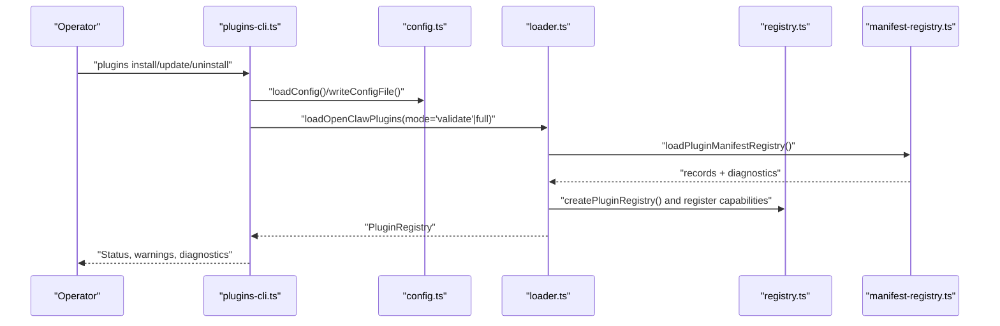
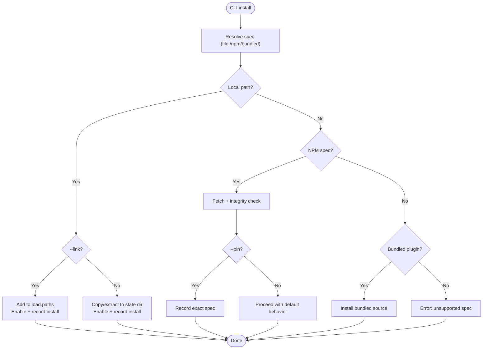
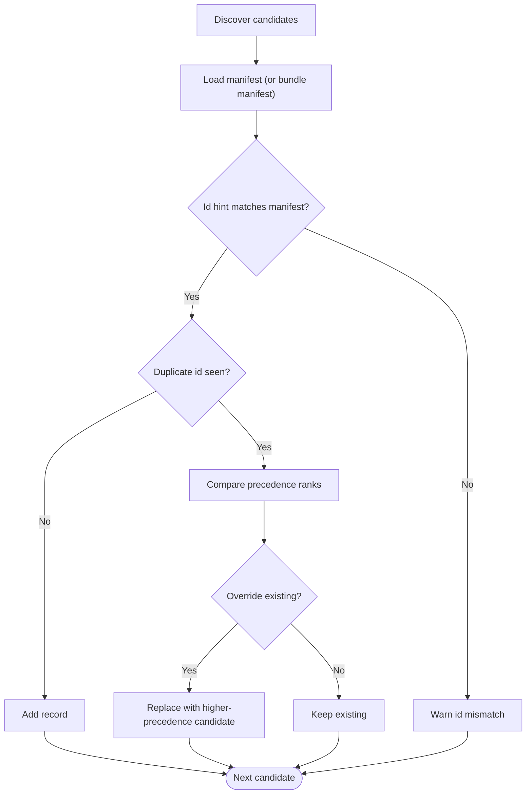
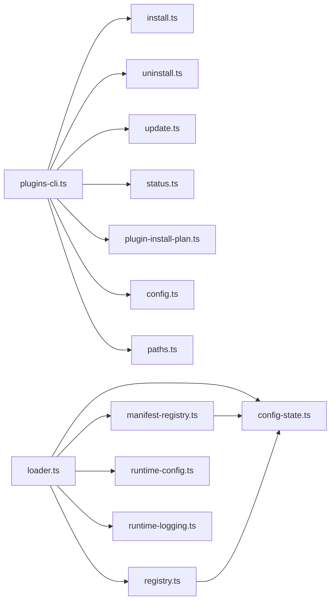

# Plugin Management

<cite>
**Referenced Files in This Document**
- [plugins-cli.ts](file://src/cli/plugins-cli.ts)
- [plugins.md](file://docs/cli/plugins.md)
- [manifest-registry.ts](file://src/plugins/manifest-registry.ts)
- [loader.ts](file://src/plugins/loader.ts)
- [uninstall.ts](file://src/plugins/uninstall.ts)
- [config-state.ts](file://src/plugins/config-state.ts)
- [registry.ts](file://src/plugins/registry.ts)
- [runtime-config.ts](file://src/plugins/runtime/runtime-config.ts)
- [runtime-logging.ts](file://src/plugins/runtime/runtime-logging.ts)
- [logger.ts](file://src/plugins/logger.ts)
- [update.ts](file://src/plugins/update.ts)
- [install.ts](file://src/plugins/install.ts)
- [status.ts](file://src/plugins/status.ts)
- [bundled-sources.ts](file://src/plugins/bundled-sources.ts)
- [plugin-install-plan.ts](file://src/cli/plugin-install-plan.ts)
- [install-spec.ts](file://src/cli/install-spec.ts)
- [npm-resolution.ts](file://src/cli/npm-resolution.ts)
- [plugins-config.ts](file://src/cli/plugins-config.ts)
- [prompt.ts](file://src/cli/prompt.ts)
- [paths.ts](file://src/config/paths.ts)
- [config.ts](file://src/config/config.ts)
- [table.ts](file://src/terminal/table.ts)
- [theme.ts](file://src/terminal/theme.ts)
- [links.ts](file://src/terminal/links.ts)
- [utils.ts](file://src/utils.ts)
- [SECURITY.md](file://SECURITY.md)
- [docker.ts](file://src/agents/sandbox/docker.ts)
- [validate-sandbox-security.ts](file://src/agents/sandbox/validate-sandbox-security.ts)
- [sandbox-tool-policy.ts](file://src/agents/sandbox-tool-policy.ts)
- [pi-tools-agent-config.test.ts](file://src/agents/pi-tools-agent-config.test.ts)
- [scaffold.ts](file://scripts/copy-plugin-sdk-root-alias.mjs)
</cite>

## Table of Contents
1. [Introduction](#introduction)
2. [Project Structure](#project-structure)
3. [Core Components](#core-components)
4. [Architecture Overview](#architecture-overview)
5. [Detailed Component Analysis](#detailed-component-analysis)
6. [Dependency Analysis](#dependency-analysis)
7. [Performance Considerations](#performance-considerations)
8. [Troubleshooting Guide](#troubleshooting-guide)
9. [Conclusion](#conclusion)
10. [Appendices](#appendices)

## Introduction
This document explains plugin management in OpenClaw, covering installation, configuration, lifecycle, registry and dependency resolution, conflict detection, CLI operations, runtime configuration, security and sandboxing, monitoring and diagnostics, troubleshooting, backup/migration/recovery, and administration across environments. It synthesizes the CLI, loader, registry, and runtime subsystems to present a complete picture for operators and developers.

## Project Structure
OpenClaw’s plugin management spans CLI commands, plugin loader, manifest registry, configuration normalization, and runtime APIs. The CLI orchestrates install/uninstall/update and exposes status and diagnostics. The loader builds a registry of discovered plugins, validates configuration, and registers plugin capabilities. The manifest registry resolves duplicates and precedence across plugin origins. Configuration state normalization enforces allowlists, denials, and memory slots. Runtime APIs expose config and logging to plugins.

```mermaid
graph TB
subgraph "CLI"
CLI["plugins-cli.ts"]
DOCS["plugins.md"]
end
subgraph "Plugin System"
MANREG["manifest-registry.ts"]
LOADR["loader.ts"]
REG["registry.ts"]
CFG["config-state.ts"]
RUNTIME_CFG["runtime-config.ts"]
RUNTIME_LOG["runtime-logging.ts"]
end
subgraph "Operations"
INST["install.ts"]
UNINST["uninstall.ts"]
UPDATE["update.ts"]
STATUS["status.ts"]
BUNDLED["bundled-sources.ts"]
PLAN["plugin-install-plan.ts"]
end
subgraph "Config"
PATHS["paths.ts"]
CONF["config.ts"]
end
CLI --> INST
CLI --> UNINST
CLI --> UPDATE
CLI --> STATUS
CLI --> BUNDLED
CLI --> PLAN
CLI --> CONF
CLI --> PATHS
LOADR --> MANREG
LOADR --> REG
LOADR --> CFG
LOADR --> RUNTIME_CFG
LOADR --> RUNTIME_LOG
MANREG --> CFG
REG --> CFG
```

**Diagram sources**
- [plugins-cli.ts:369-800](file://src/cli/plugins-cli.ts#L369-L800)
- [manifest-registry.ts:265-427](file://src/plugins/manifest-registry.ts#L265-L427)
- [loader.ts:774-1322](file://src/plugins/loader.ts#L774-L1322)
- [registry.ts:234-800](file://src/plugins/registry.ts#L234-L800)
- [config-state.ts:135-336](file://src/plugins/config-state.ts#L135-L336)
- [runtime-config.ts:1-10](file://src/plugins/runtime/runtime-config.ts#L1-L10)
- [runtime-logging.ts:1-21](file://src/plugins/runtime/runtime-logging.ts#L1-L21)
- [install.ts](file://src/plugins/install.ts)
- [uninstall.ts:1-238](file://src/plugins/uninstall.ts#L1-L238)
- [update.ts](file://src/plugins/update.ts)
- [status.ts](file://src/plugins/status.ts)
- [bundled-sources.ts](file://src/plugins/bundled-sources.ts)
- [plugin-install-plan.ts](file://src/cli/plugin-install-plan.ts)
- [paths.ts](file://src/config/paths.ts)
- [config.ts](file://src/config/config.ts)

**Section sources**
- [plugins-cli.ts:369-800](file://src/cli/plugins-cli.ts#L369-L800)
- [manifest-registry.ts:265-427](file://src/plugins/manifest-registry.ts#L265-L427)
- [loader.ts:774-1322](file://src/plugins/loader.ts#L774-L1322)
- [registry.ts:234-800](file://src/plugins/registry.ts#L234-L800)
- [config-state.ts:135-336](file://src/plugins/config-state.ts#L135-L336)
- [runtime-config.ts:1-10](file://src/plugins/runtime/runtime-config.ts#L1-L10)
- [runtime-logging.ts:1-21](file://src/plugins/runtime/runtime-logging.ts#L1-L21)
- [install.ts](file://src/plugins/install.ts)
- [uninstall.ts:1-238](file://src/plugins/uninstall.ts#L1-L238)
- [update.ts](file://src/plugins/update.ts)
- [status.ts](file://src/plugins/status.ts)
- [bundled-sources.ts](file://src/plugins/bundled-sources.ts)
- [plugin-install-plan.ts](file://src/cli/plugin-install-plan.ts)
- [paths.ts](file://src/config/paths.ts)
- [config.ts](file://src/config/config.ts)

## Core Components
- CLI plugin commands: list, info, enable, disable, install, uninstall, update, doctor.
- Manifest registry: discovers plugins, loads manifests, detects duplicates, ranks origins.
- Loader: builds plugin registry, validates config, registers hooks/tools/routes/services.
- Configuration state: normalizes allow/deny/entries/load paths/memory slots; resolves enable state.
- Runtime APIs: exposes config and logging to plugins.
- Uninstall: removes config entries, cleans allowlist/load paths, resets memory slot, optionally deletes files.
- Update: updates npm-installed plugins with integrity checks and prompts.

**Section sources**
- [plugins-cli.ts:369-800](file://src/cli/plugins-cli.ts#L369-L800)
- [manifest-registry.ts:265-427](file://src/plugins/manifest-registry.ts#L265-L427)
- [loader.ts:774-1322](file://src/plugins/loader.ts#L774-L1322)
- [config-state.ts:135-336](file://src/plugins/config-state.ts#L135-L336)
- [runtime-config.ts:1-10](file://src/plugins/runtime/runtime-config.ts#L1-L10)
- [runtime-logging.ts:1-21](file://src/plugins/runtime/runtime-logging.ts#L1-L21)
- [uninstall.ts:65-238](file://src/plugins/uninstall.ts#L65-L238)
- [update.ts:204-246](file://src/plugins/update.ts#L204-L246)

## Architecture Overview
The plugin system is centered around a manifest registry and a loader that produces a runtime registry. CLI commands mutate configuration and trigger reloads. Plugins register capabilities via a typed API, and the system enforces allowlists, denials, and memory slot selection.



**Diagram sources**
- [plugins-cli.ts:369-800](file://src/cli/plugins-cli.ts#L369-L800)
- [loader.ts:774-1322](file://src/plugins/loader.ts#L774-L1322)
- [manifest-registry.ts:265-427](file://src/plugins/manifest-registry.ts#L265-L427)
- [registry.ts:234-800](file://src/plugins/registry.ts#L234-L800)
- [config.ts](file://src/config/config.ts)

## Detailed Component Analysis

### CLI Plugin Management
- List and info: display discovered plugins, origins, formats, versions, and install records.
- Enable/disable: toggle per-plugin enable state and apply memory slot decisions.
- Install: supports local paths, archives, and npm specs; handles bundled fallbacks; records installs and pins versions; links paths to load paths.
- Uninstall: removes entries, installs, allowlist entries, load paths, resets memory slot; optionally deletes installed directory for non-linked plugins.
- Update: updates npm-installed plugins with integrity drift checks and prompts; supports dry-run and “all”.



**Diagram sources**
- [plugins-cli.ts:204-368](file://src/cli/plugins-cli.ts#L204-L368)
- [plugin-install-plan.ts](file://src/cli/plugin-install-plan.ts)
- [install-spec.ts](file://src/cli/install-spec.ts)
- [npm-resolution.ts](file://src/cli/npm-resolution.ts)
- [bundled-sources.ts](file://src/plugins/bundled-sources.ts)

**Section sources**
- [plugins-cli.ts:369-800](file://src/cli/plugins-cli.ts#L369-L800)
- [plugins.md:44-122](file://docs/cli/plugins.md#L44-L122)
- [plugin-install-plan.ts](file://src/cli/plugin-install-plan.ts)
- [install-spec.ts](file://src/cli/install-spec.ts)
- [npm-resolution.ts](file://src/cli/npm-resolution.ts)
- [bundled-sources.ts](file://src/plugins/bundled-sources.ts)

### Plugin Registry System and Conflict Detection
- Manifest registry loads plugin manifests from discovered candidates, ranks origins, and detects duplicates. Duplicate precedence is determined by origin rank and explicit install tracking.
- Loader orders candidates by duplicate rank, validates config, and registers plugin capabilities. It warns about untracked loaded plugins and missing memory slot.



**Diagram sources**
- [manifest-registry.ts:265-427](file://src/plugins/manifest-registry.ts#L265-L427)
- [loader.ts:947-1321](file://src/plugins/loader.ts#L947-L1321)

**Section sources**
- [manifest-registry.ts:235-427](file://src/plugins/manifest-registry.ts#L235-L427)
- [loader.ts:947-1321](file://src/plugins/loader.ts#L947-L1321)

### Dependency Resolution and Integrity Checks
- NPM installs are recorded with resolved specs; optional pinning stores exact versions.
- Integrity drift triggers prompts for confirmation; dry-run mode previews changes.
- Updates operate only on npm-installed plugins tracked in installs.

**Section sources**
- [plugins-cli.ts:745-800](file://src/cli/plugins-cli.ts#L745-L800)
- [update.ts:204-246](file://src/plugins/update.ts#L204-L246)
- [npm-resolution.ts](file://src/cli/npm-resolution.ts)

### Lifecycle Management
- Enable/disable: toggles per-plugin enable state and applies memory slot selection.
- Uninstall: removes config entries, cleans allowlist/load paths, resets memory slot, optionally deletes files.
- Doctor/status: lists diagnostics and plugin statuses.

**Section sources**
- [plugins-cli.ts:566-733](file://src/cli/plugins-cli.ts#L566-L733)
- [uninstall.ts:65-238](file://src/plugins/uninstall.ts#L65-L238)
- [status.ts](file://src/plugins/status.ts)

### Configuration Management
- Normalized config includes allow/deny lists, load paths, memory slots, and per-plugin entries with hooks policy and runtime config.
- Runtime exposes loadConfig/writeConfigFile to plugins.
- Logging runtime provides child loggers with level normalization.

**Section sources**
- [config-state.ts:6-149](file://src/plugins/config-state.ts#L6-L149)
- [runtime-config.ts:1-10](file://src/plugins/runtime/runtime-config.ts#L1-L10)
- [runtime-logging.ts:1-21](file://src/plugins/runtime/runtime-logging.ts#L1-L21)
- [logger.ts:1-17](file://src/plugins/logger.ts#L1-L17)

### Security Policies, Sandboxing, and Permission Management
- Plugins are part of the trusted computing base; installing/enabling grants trust equivalent to local host code.
- Sandbox hardening for agents includes read-only root, no network, capability drops, limits, and profile enforcement.
- Tool policy merging: allow/deny semantics with additive alsoAllow and deny lists.
- Prompt injection policy: typed hooks can be constrained or blocked per plugin entry.

**Section sources**
- [SECURITY.md:108-114](file://SECURITY.md#L108-L114)
- [docker.ts:317-344](file://src/agents/sandbox/docker.ts#L317-L344)
- [validate-sandbox-security.ts:283-306](file://src/agents/sandbox/validate-sandbox-security.ts#L283-L306)
- [sandbox-tool-policy.ts:21-37](file://src/agents/sandbox-tool-policy.ts#L21-L37)
- [registry.ts:706-760](file://src/plugins/registry.ts#L706-L760)
- [pi-tools-agent-config.test.ts:570-611](file://src/agents/pi-tools-agent-config.test.ts#L570-L611)

### Monitoring, Logging, and Diagnostics
- Loader emits diagnostics for invalid configs, missing exports, duplicate ids, untracked loaded plugins, and allowlist warnings.
- Plugin loader logger forwards info/warn/error/debug.
- Runtime logging provides child loggers with normalized levels.

**Section sources**
- [loader.ts:737-767](file://src/plugins/loader.ts#L737-L767)
- [logger.ts:1-17](file://src/plugins/logger.ts#L1-L17)
- [runtime-logging.ts:1-21](file://src/plugins/runtime/runtime-logging.ts#L1-L21)

### Backup, Migration, and Recovery
- Install records track source/spec/source path/install path/version; use these to reconstruct installations.
- Uninstall can preserve files (--keep-files) to facilitate later recovery.
- Memory slot resets to default when uninstalling the active memory plugin.

**Section sources**
- [uninstall.ts:27-59](file://src/plugins/uninstall.ts#L27-L59)
- [plugins.md:91-122](file://docs/cli/plugins.md#L91-L122)

### Administration Across Environments
- Use allowlists to constrain which plugins auto-load.
- Normalize memory slot behavior; default memory slot is enforced unless overridden.
- Use CLI status and doctor to audit plugin fleet health.

**Section sources**
- [config-state.ts:135-149](file://src/plugins/config-state.ts#L135-L149)
- [plugins-cli.ts:369-477](file://src/cli/plugins-cli.ts#L369-L477)

## Dependency Analysis
The following diagram highlights key dependencies among plugin management components.



**Diagram sources**
- [plugins-cli.ts:369-800](file://src/cli/plugins-cli.ts#L369-L800)
- [loader.ts:774-1322](file://src/plugins/loader.ts#L774-L1322)
- [manifest-registry.ts:265-427](file://src/plugins/manifest-registry.ts#L265-L427)
- [registry.ts:234-800](file://src/plugins/registry.ts#L234-L800)
- [config-state.ts:135-336](file://src/plugins/config-state.ts#L135-L336)
- [runtime-config.ts:1-10](file://src/plugins/runtime/runtime-config.ts#L1-L10)
- [runtime-logging.ts:1-21](file://src/plugins/runtime/runtime-logging.ts#L1-L21)
- [install.ts](file://src/plugins/install.ts)
- [uninstall.ts:1-238](file://src/plugins/uninstall.ts#L1-L238)
- [update.ts](file://src/plugins/update.ts)
- [status.ts](file://src/plugins/status.ts)
- [plugin-install-plan.ts](file://src/cli/plugin-install-plan.ts)
- [config.ts](file://src/config/config.ts)
- [paths.ts](file://src/config/paths.ts)

**Section sources**
- [plugins-cli.ts:369-800](file://src/cli/plugins-cli.ts#L369-L800)
- [loader.ts:774-1322](file://src/plugins/loader.ts#L774-L1322)
- [manifest-registry.ts:265-427](file://src/plugins/manifest-registry.ts#L265-L427)
- [registry.ts:234-800](file://src/plugins/registry.ts#L234-L800)
- [config-state.ts:135-336](file://src/plugins/config-state.ts#L135-L336)
- [runtime-config.ts:1-10](file://src/plugins/runtime/runtime-config.ts#L1-L10)
- [runtime-logging.ts:1-21](file://src/plugins/runtime/runtime-logging.ts#L1-L21)
- [install.ts](file://src/plugins/install.ts)
- [uninstall.ts:1-238](file://src/plugins/uninstall.ts#L1-L238)
- [update.ts](file://src/plugins/update.ts)
- [status.ts](file://src/plugins/status.ts)
- [plugin-install-plan.ts](file://src/cli/plugin-install-plan.ts)
- [config.ts](file://src/config/config.ts)
- [paths.ts](file://src/config/paths.ts)

## Performance Considerations
- Manifest registry cache: TTL-controlled cache reduces repeated scans; environment variables can disable or tune cache.
- Loader registry cache: bounded LRU cache keyed by roots/load paths/installs; snapshot loads disable caching to avoid divergent command registries.
- Validation and diagnostics: schema validation and duplicate detection add overhead; keep allowlists tight to reduce discovery breadth.

[No sources needed since this section provides general guidance]

## Troubleshooting Guide
Common issues and resolutions:
- Duplicate plugin id: The system warns and overrides based on origin precedence; review diagnostics and adjust origins or disable conflicting plugins.
- Invalid plugin config: Loader reports validation errors; fix schema mismatches indicated in diagnostics.
- Missing register export: Loader warns when required registration function is absent; ensure plugin exports register/activate.
- Untracked loaded plugins: Warning indicates plugin loaded without install/load-path provenance; add to allowlist or install records.
- Integrity drift on update: Confirm before proceeding; use --yes in CI to bypass prompts.
- Allowlist open: Warning suggests setting plugins.allow to restrict auto-loaded plugins.

Operational steps:
- Use “plugins doctor” and “plugins list --verbose” to inspect diagnostics and origins.
- For install failures, verify spec correctness and bundling compatibility.
- For uninstall, use --dry-run to preview changes; use --keep-files to preserve artifacts.

**Section sources**
- [manifest-registry.ts:377-399](file://src/plugins/manifest-registry.ts#L377-L399)
- [loader.ts:1232-1287](file://src/plugins/loader.ts#L1232-L1287)
- [loader.ts:737-767](file://src/plugins/loader.ts#L737-L767)
- [plugins-cli.ts:745-800](file://src/cli/plugins-cli.ts#L745-L800)
- [plugins.md:91-122](file://docs/cli/plugins.md#L91-L122)

## Conclusion
OpenClaw’s plugin management integrates a robust CLI, manifest registry, loader, and runtime APIs to support safe, configurable, and observable plugin lifecycles. Operators can install, update, uninstall, and audit plugins with strong conflict detection, integrity checks, and security posture. Administrators can enforce allowlists, memory slots, and sandbox hardening to maintain trust boundaries across diverse environments.

## Appendices

### CLI Reference Summary
- List: show discovered plugins and statuses.
- Info: detailed plugin metadata and install records.
- Enable/Disable: toggle per-plugin enable state and memory slot effects.
- Install: local path, archive, npm spec; bundled fallback; pinning.
- Uninstall: remove config/install/allowlist entries; reset memory slot; optional file deletion.
- Update: update npm-installed plugins with integrity checks.

**Section sources**
- [plugins-cli.ts:369-800](file://src/cli/plugins-cli.ts#L369-L800)
- [plugins.md:20-122](file://docs/cli/plugins.md#L20-L122)

### Environment Variables and Paths
- OPENCLAW_PLUGIN_MANIFEST_CACHE_MS: controls manifest registry cache TTL.
- OPENCLAW_DISABLE_PLUGIN_MANIFEST_CACHE: disables manifest registry cache.
- OPENCLAW_STATE_DIR: state directory root used for plugin install locations.

**Section sources**
- [manifest-registry.ts:73-94](file://src/plugins/manifest-registry.ts#L73-L94)
- [paths.ts](file://src/config/paths.ts)
- [plugins-cli.ts:608-733](file://src/cli/plugins-cli.ts#L608-L733)

### Plugin SDK Root Alias
- The loader resolves plugin SDK aliases and root-alias entries to support development and production builds.

**Section sources**
- [loader.ts:102-180](file://src/plugins/loader.ts#L102-L180)
- [scaffold.ts](file://scripts/copy-plugin-sdk-root-alias.mjs)