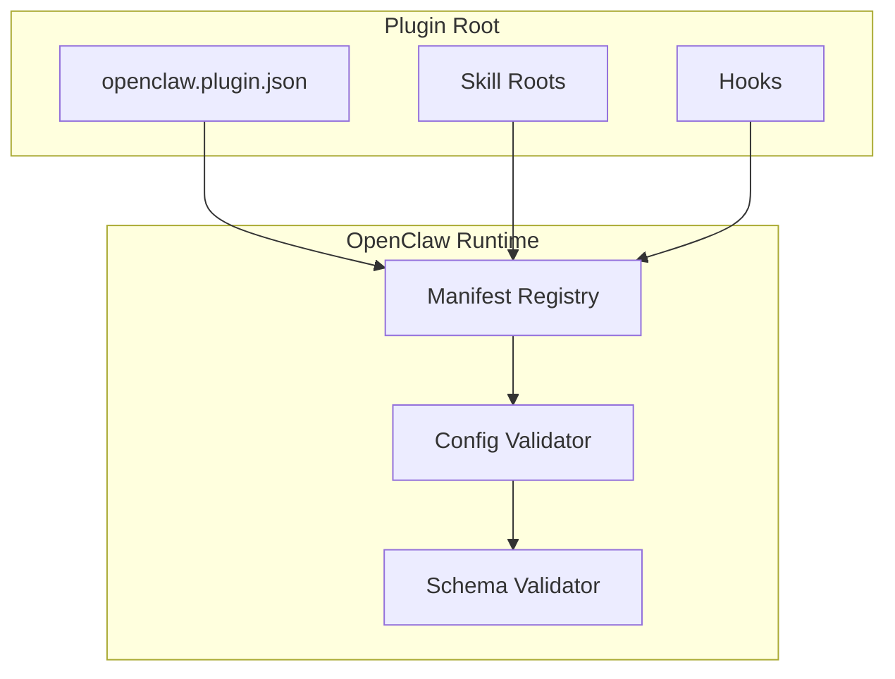
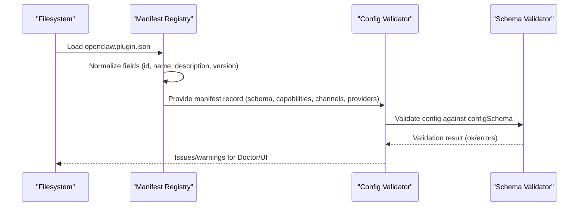
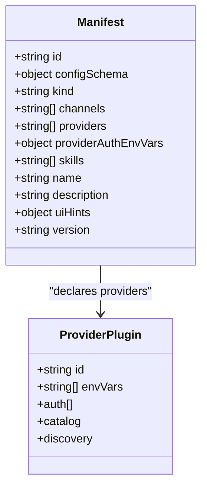
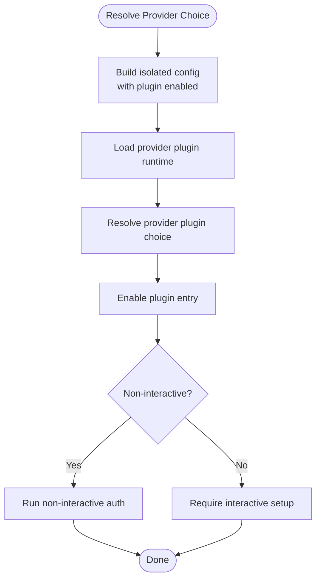
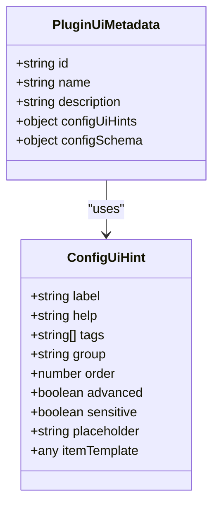
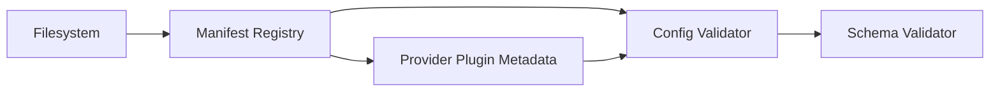

# Plugin Manifest

<cite>
**Referenced Files in This Document**
- [docs/plugins/manifest.md](file://docs/plugins/manifest.md)
- [src/config/validation.ts](file://src/config/validation.ts)
- [src/plugins/manifest-registry.ts](file://src/plugins/manifest-registry.ts)
- [src/plugins/loader.ts](file://src/plugins/loader.ts)
- [extensions/anthropic/openclaw.plugin.json](file://extensions/anthropic/openclaw.plugin.json)
- [extensions/discord/openclaw.plugin.json](file://extensions/discord/openclaw.plugin.json)
- [extensions/google/openclaw.plugin.json](file://extensions/google/openclaw.plugin.json)
- [extensions/memory-core/openclaw.plugin.json](file://extensions/memory-core/openclaw.plugin.json)
- [extensions/llm-task/openclaw.plugin.json](file://extensions/llm-task/openclaw.plugin.json)
- [extensions/voice-call/openclaw.plugin.json](file://extensions/voice-call/openclaw.plugin.json)
- [extensions/memory-lancedb/openclaw.plugin.json](file://extensions/memory-lancedb/openclaw.plugin.json)
- [extensions/talk-voice/openclaw.plugin.json](file://extensions/talk-voice/openclaw.plugin.json)
- [src/shared/config-ui-hints-types.ts](file://src/shared/config-ui-hints-types.ts)
- [src/config/schema.ts](file://src/config/schema.ts)
- [src/gateway/protocol/schema/config.ts](file://src/gateway/protocol/schema/config.ts)
- [src/plugins/types.ts](file://src/plugins/types.ts)
- [src/agents/model-auth-env-vars.ts](file://src/agents/model-auth-env-vars.ts)
- [src/commands/onboard-non-interactive/local/auth-choice.plugin-providers.ts](file://src/commands/onboard-non-interactive/local/auth-choice.plugin-providers.ts)
- [src/plugins/provider-validation.ts](file://src/plugins/provider-validation.ts)
- [src/plugins/provider-runtime.ts](file://src/plugins/provider-runtime.ts)
</cite>

## Table of Contents
1. [Introduction](#introduction)
2. [Project Structure](#project-structure)
3. [Core Components](#core-components)
4. [Architecture Overview](#architecture-overview)
5. [Detailed Component Analysis](#detailed-component-analysis)
6. [Dependency Analysis](#dependency-analysis)
7. [Performance Considerations](#performance-considerations)
8. [Troubleshooting Guide](#troubleshooting-guide)
9. [Conclusion](#conclusion)
10. [Appendices](#appendices)

## Introduction
This document explains the native OpenClaw plugin manifest format and configuration schema. It covers the openclaw.plugin.json structure, required and optional fields, validation rules, plugin identification and versioning, capabilities and dependencies declarations, and how manifests influence runtime behavior. It also provides practical examples, inheritance and override mechanisms, environment-specific configurations, capability negotiation, and troubleshooting guidance for common validation errors.

## Project Structure
OpenClaw expects a native plugin to include a manifest file named openclaw.plugin.json at the plugin root. The repository ships many example manifests under extensions/<plugin>/openclaw.plugin.json. The configuration validation pipeline reads these manifests to validate plugin configuration without executing plugin code.

**Diagram sources**
- [src/plugins/manifest-registry.ts:172-208](file://src/plugins/manifest-registry.ts#L172-L208)
- [src/config/validation.ts:581-623](file://src/config/validation.ts#L581-L623)
- [src/plugins/loader.ts:364-383](file://src/plugins/loader.ts#L364-L383)

**Section sources**
- [docs/plugins/manifest.md:29-34](file://docs/plugins/manifest.md#L29-L34)
- [src/plugins/manifest-registry.ts:172-208](file://src/plugins/manifest-registry.ts#L172-L208)

## Core Components
- Manifest file: openclaw.plugin.json at plugin root.
- Required fields:
  - id: canonical plugin identifier.
  - configSchema: inline JSON Schema for plugin configuration.
- Optional fields:
  - kind: plugin kind (for example, memory or context-engine).
  - channels: channel identifiers registered by the plugin.
  - providers: provider identifiers registered by the plugin.
  - providerAuthEnvVars: environment variable names per provider for auth probing.
  - skills: relative paths to skill directories to load.
  - name, description, uiHints, version.

Validation behavior:
- Unknown channels or plugin ids referenced in global config are errors.
- Missing or invalid manifests fail validation and block configuration.
- Disabled plugins with existing config produce warnings.

**Section sources**
- [docs/plugins/manifest.md:36-100](file://docs/plugins/manifest.md#L36-L100)
- [src/config/validation.ts:581-623](file://src/config/validation.ts#L581-L623)

## Architecture Overview
The manifest drives discovery, validation, and UI rendering. The manifest registry normalizes manifest metadata and builds records. The config validator enforces schema rules and produces actionable issues and warnings.

**Diagram sources**
- [src/plugins/manifest-registry.ts:172-208](file://src/plugins/manifest-registry.ts#L172-L208)
- [src/config/validation.ts:581-623](file://src/config/validation.ts#L581-L623)
- [src/plugins/loader.ts:364-383](file://src/plugins/loader.ts#L364-L383)

## Detailed Component Analysis

### Manifest Fields and Constraints
- id (string, required): Canonical plugin identifier. Must match entries in plugins.entries and slots.
- configSchema (object, required): Inline JSON Schema. Even if accepting no config, a schema must be present.
- kind (string, optional): Selects exclusive slot (for example, memory or context-engine).
- channels (array of strings, optional): Declares supported channel ids.
- providers (array of strings, optional): Declares provider ids.
- providerAuthEnvVars (object, optional): Env var names keyed by provider id for auth probing without loading runtime.
- skills (array of strings, optional): Relative paths to skill directories to load.
- name (string, optional): Human-readable plugin name.
- description (string, optional): Short description.
- uiHints (object, optional): UI hints for config fields (labels, placeholders, sensitivity, advanced).
- version (string, optional): Plugin version string.

Validation rules:
- Every plugin must ship a JSON Schema; schemas are validated at config read/write time.
- Unknown channel ids or plugin ids in global config are errors.
- Missing schema for native plugins yields a specific error; bundle-compatible manifests are handled differently.

**Section sources**
- [docs/plugins/manifest.md:36-100](file://docs/plugins/manifest.md#L36-L100)
- [src/config/validation.ts:581-623](file://src/config/validation.ts#L581-L623)

### Example Manifests and Their Purposes
- Anthropic provider plugin:
  - Declares providers and environment variables for auth.
  - Includes a minimal config schema.
  - Reference: [extensions/anthropic/openclaw.plugin.json:1-13](file://extensions/anthropic/openclaw.plugin.json#L1-L13)
- Discord channel plugin:
  - Declares a channel id and a minimal config schema.
  - Reference: [extensions/discord/openclaw.plugin.json:1-10](file://extensions/discord/openclaw.plugin.json#L1-L10)
- Google provider plugin:
  - Declares multiple providers and environment variables for auth.
  - Reference: [extensions/google/openclaw.plugin.json:1-13](file://extensions/google/openclaw.plugin.json#L1-L13)
- Memory core plugin:
  - Declares kind: memory.
  - Reference: [extensions/memory-core/openclaw.plugin.json:1-10](file://extensions/memory-core/openclaw.plugin.json#L1-L10)
- LLM Task plugin:
  - Rich config schema with typed fields, enums, arrays, and constraints.
  - Reference: [extensions/llm-task/openclaw.plugin.json:1-22](file://extensions/llm-task/openclaw.plugin.json#L1-L22)
- Voice call plugin:
  - Extensive uiHints and a large, strongly typed config schema covering providers, numbers, streaming, tunneling, and more.
  - Reference: [extensions/voice-call/openclaw.plugin.json:1-612](file://extensions/voice-call/openclaw.plugin.json#L1-L612)
- Memory LanceDB plugin:
  - Strongly typed embedding config with required fields and UI hints.
  - Reference: [extensions/memory-lancedb/openclaw.plugin.json:1-89](file://extensions/memory-lancedb/openclaw.plugin.json#L1-L89)
- Talk Voice plugin:
  - Minimal manifest with name and description.
  - Reference: [extensions/talk-voice/openclaw.plugin.json:1-11](file://extensions/talk-voice/openclaw.plugin.json#L1-L11)

**Section sources**
- [extensions/anthropic/openclaw.plugin.json:1-13](file://extensions/anthropic/openclaw.plugin.json#L1-L13)
- [extensions/discord/openclaw.plugin.json:1-10](file://extensions/discord/openclaw.plugin.json#L1-L10)
- [extensions/google/openclaw.plugin.json:1-13](file://extensions/google/openclaw.plugin.json#L1-L13)
- [extensions/memory-core/openclaw.plugin.json:1-10](file://extensions/memory-core/openclaw.plugin.json#L1-L10)
- [extensions/llm-task/openclaw.plugin.json:1-22](file://extensions/llm-task/openclaw.plugin.json#L1-L22)
- [extensions/voice-call/openclaw.plugin.json:1-612](file://extensions/voice-call/openclaw.plugin.json#L1-L612)
- [extensions/memory-lancedb/openclaw.plugin.json:1-89](file://extensions/memory-lancedb/openclaw.plugin.json#L1-L89)
- [extensions/talk-voice/openclaw.plugin.json:1-11](file://extensions/talk-voice/openclaw.plugin.json#L1-L11)

### Plugin Identification, Versioning, and Compatibility
- Identification:
  - id is the canonical identifier used in plugins.entries, plugins.allow/deny, plugins.slots, and diagnostics.
  - The manifest registry validates id hints from plugin candidates and warns on mismatches.
- Versioning:
  - version is informational; stored in manifest records for display and diagnostics.
- Compatibility:
  - Native plugins require a manifest; bundle-compatible formats are auto-detected but validated against different schemas and do not use openclaw.plugin.json.

**Section sources**
- [docs/plugins/manifest.md:85-100](file://docs/plugins/manifest.md#L85-L100)
- [src/plugins/manifest-registry.ts:322-340](file://src/plugins/manifest-registry.ts#L322-L340)

### Capabilities Declaration and Negotiation
- Channels and providers:
  - channels declares supported channel ids; providers declares provider ids.
  - These lists inform capability negotiation and discovery.
- Provider auth environment variables:
  - providerAuthEnvVars allows OpenClaw to probe credentials from environment without loading plugin runtime.
- Provider plugin metadata:
  - Provider plugins define auth methods, catalogs, discovery hooks, and wizard flows; these integrate with the manifest’s providers list.

**Diagram sources**
- [extensions/anthropic/openclaw.plugin.json:1-13](file://extensions/anthropic/openclaw.plugin.json#L1-L13)
- [src/plugins/types.ts:545-586](file://src/plugins/types.ts#L545-L586)

**Section sources**
- [extensions/anthropic/openclaw.plugin.json:1-13](file://extensions/anthropic/openclaw.plugin.json#L1-L13)
- [src/plugins/types.ts:545-586](file://src/plugins/types.ts#L545-L586)

### Environment-Specific Configurations and Auth Probing
- providerAuthEnvVars:
  - Allows declaring environment variable names per provider for auth checks without loading the plugin runtime.
- Known provider environment variables:
  - Utilities expose known API key candidates and lists for provider auth env vars.
- Non-interactive provider setup:
  - The CLI can resolve preferred providers and enable plugin entries for non-interactive auth flows.

**Diagram sources**
- [src/commands/onboard-non-interactive/local/auth-choice.plugin-providers.ts:49-129](file://src/commands/onboard-non-interactive/local/auth-choice.plugin-providers.ts#L49-L129)
- [src/plugins/provider-runtime.ts:147-165](file://src/plugins/provider-runtime.ts#L147-L165)

**Section sources**
- [src/agents/model-auth-env-vars.ts:1-10](file://src/agents/model-auth-env-vars.ts#L1-L10)
- [src/commands/onboard-non-interactive/local/auth-choice.plugin-providers.ts:49-129](file://src/commands/onboard-non-interactive/local/auth-choice.plugin-providers.ts#L49-L129)
- [src/plugins/provider-validation.ts:189-239](file://src/plugins/provider-validation.ts#L189-L239)

### UI Hints and Configuration Rendering
- uiHints:
  - Provides labels, help text, placeholders, sensitivity flags, and advanced toggles for fields.
  - Supports wildcard paths for map-like structures.
- Schema-driven UI:
  - The schema and uiHints drive the configuration UI, including required markers and child field discovery.

**Diagram sources**
- [src/shared/config-ui-hints-types.ts:1-13](file://src/shared/config-ui-hints-types.ts#L1-L13)
- [src/config/schema.ts:126-135](file://src/config/schema.ts#L126-L135)

**Section sources**
- [extensions/voice-call/openclaw.plugin.json:3-161](file://extensions/voice-call/openclaw.plugin.json#L3-L161)
- [src/shared/config-ui-hints-types.ts:1-13](file://src/shared/config-ui-hints-types.ts#L1-L13)
- [src/config/schema.ts:639-676](file://src/config/schema.ts#L639-L676)

### Manifest Inheritance and Overrides
- Manifests are authoritative for native plugins.
- The configuration system merges and resolves schema-derived UI hints and child fields for rendering and navigation.
- Wildcard uiHints support map-like structures (for example, plugins.entries.*.enabled).

**Section sources**
- [src/config/doc-baseline.ts:430-466](file://src/config/doc-baseline.ts#L430-L466)
- [src/config/schema.ts:639-676](file://src/config/schema.ts#L639-L676)
- [ui/src/ui/config-form.browser.test.ts:164-201](file://ui/src/ui/config-form.browser.test.ts#L164-L201)

## Dependency Analysis
- Manifest registry depends on:
  - Filesystem scanning for openclaw.plugin.json.
  - Normalization of manifest fields and capability lists.
- Config validation depends on:
  - Manifest records (schema, capabilities, channels, providers).
  - JSON schema validation engine.
- Provider plugin integration depends on:
  - Manifest-declared providers.
  - Provider plugin metadata (auth, catalogs, discovery).

**Diagram sources**
- [src/plugins/manifest-registry.ts:172-208](file://src/plugins/manifest-registry.ts#L172-L208)
- [src/config/validation.ts:581-623](file://src/config/validation.ts#L581-L623)
- [src/plugins/types.ts:545-586](file://src/plugins/types.ts#L545-L586)

**Section sources**
- [src/plugins/manifest-registry.ts:172-208](file://src/plugins/manifest-registry.ts#L172-L208)
- [src/config/validation.ts:581-623](file://src/config/validation.ts#L581-L623)
- [src/plugins/types.ts:545-586](file://src/plugins/types.ts#L545-L586)

## Performance Considerations
- Keep configSchema minimal and precise to reduce validation overhead.
- Use uiHints judiciously; avoid excessive nesting for large dynamic structures.
- providerAuthEnvVars enables cheap environment checks without loading plugin runtime.

## Troubleshooting Guide
Common validation errors and resolutions:
- Missing plugin schema:
  - Symptom: Error indicating missing schema for a native plugin.
  - Resolution: Add a configSchema to openclaw.plugin.json, even if empty.
  - Reference: [src/config/validation.ts:602-607](file://src/config/validation.ts#L602-L607)
- Unknown channel id or plugin id:
  - Symptom: Errors referencing channels or plugin entries that are not declared in manifests.
  - Resolution: Declare channels/providers in manifests or remove references from global config.
  - Reference: [docs/plugins/manifest.md:76-79](file://docs/plugins/manifest.md#L76-L79)
- Plugin disabled but config present:
  - Symptom: Warning that plugin is disabled but config exists.
  - Resolution: Enable the plugin or remove stale config.
  - Reference: [src/config/validation.ts:610-615](file://src/config/validation.ts#L610-L615)
- Schema validation failures:
  - Symptom: Invalid config errors with specific paths and allowed values hints.
  - Resolution: Adjust values to match schema types, enums, and constraints; consult allowed values hints.
  - Reference: [src/config/validation.ts:584-598](file://src/config/validation.ts#L584-L598)
- Id mismatch warning:
  - Symptom: Warning about plugin id mismatch between manifest and entry hints.
  - Resolution: Ensure manifest id matches the plugin entry id.
  - Reference: [src/plugins/manifest-registry.ts:322-329](file://src/plugins/manifest-registry.ts#L322-L329)

**Section sources**
- [src/config/validation.ts:581-623](file://src/config/validation.ts#L581-L623)
- [src/plugins/manifest-registry.ts:322-340](file://src/plugins/manifest-registry.ts#L322-L340)
- [docs/plugins/manifest.md:74-84](file://docs/plugins/manifest.md#L74-L84)

## Conclusion
The openclaw.plugin.json manifest is central to OpenClaw’s discovery, validation, and UI rendering systems. It defines plugin identity, capabilities, and configuration schema. By adhering to the required fields and constraints, using precise schemas, and leveraging providerAuthEnvVars and uiHints, plugin authors can deliver robust, user-friendly plugins with strong validation and predictable runtime behavior.

## Appendices

### Appendix A: Field Reference
- id: string, required
- configSchema: object, required
- kind: string, optional
- channels: string[], optional
- providers: string[], optional
- providerAuthEnvVars: object, optional
- skills: string[], optional
- name: string, optional
- description: string, optional
- uiHints: object, optional
- version: string, optional

**Section sources**
- [docs/plugins/manifest.md:36-100](file://docs/plugins/manifest.md#L36-L100)