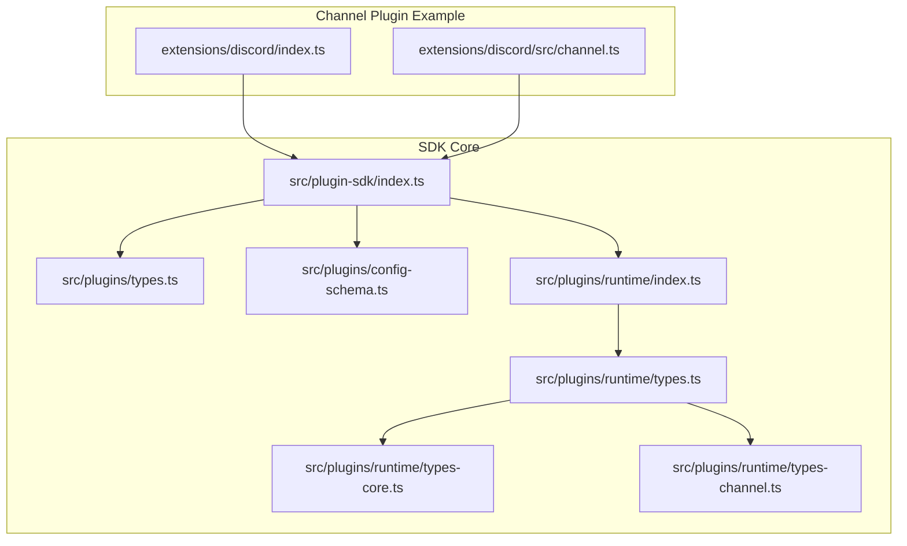
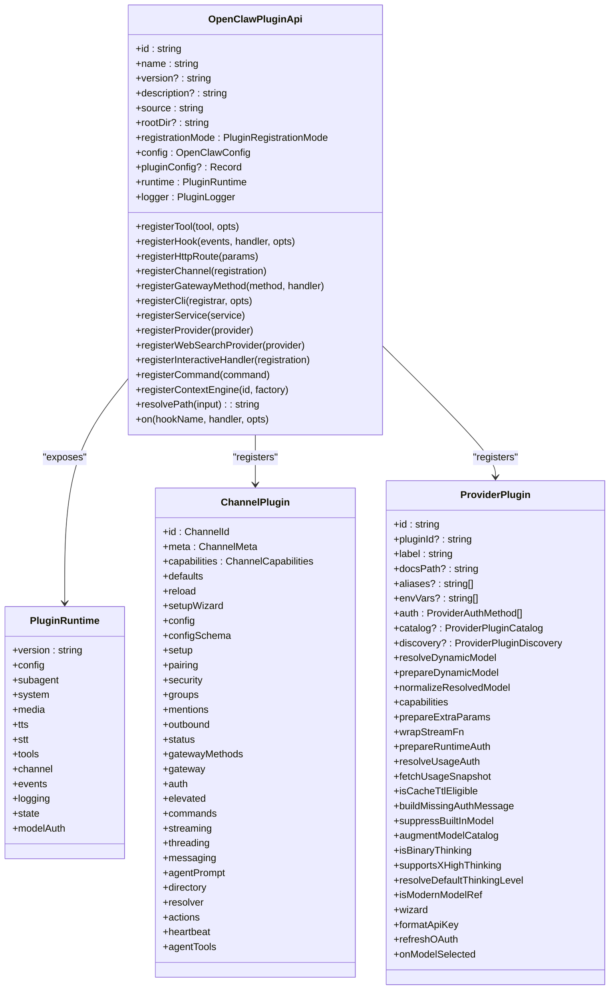
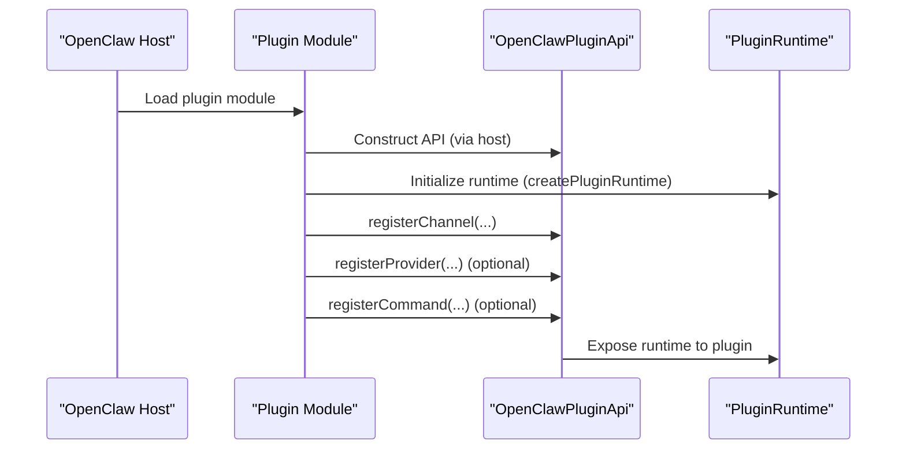
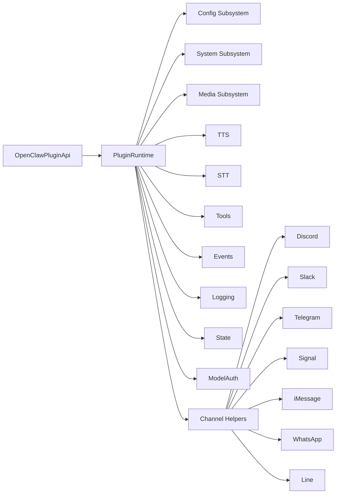

# Plugin SDK

<cite>
**Referenced Files in This Document**
- [index.ts](file://src/plugin-sdk/index.ts)
- [types.ts](file://src/plugins/types.ts)
- [types.plugin.ts](file://src/channels/plugins/types.plugin.ts)
- [types.ts](file://src/plugins/runtime/types.ts)
- [types-core.ts](file://src/plugins/runtime/types-core.ts)
- [types-channel.ts](file://src/plugins/runtime/types-channel.ts)
- [config-schema.ts](file://src/plugins/config-schema.ts)
- [runtime/index.ts](file://src/plugins/runtime/index.ts)
- [discord/index.ts](file://extensions/discord/index.ts)
- [discord/src/channel.ts](file://extensions/discord/src/channel.ts)
</cite>

## Table of Contents
1. [Introduction](#introduction)
2. [Project Structure](#project-structure)
3. [Core Components](#core-components)
4. [Architecture Overview](#architecture-overview)
5. [Detailed Component Analysis](#detailed-component-analysis)
6. [Dependency Analysis](#dependency-analysis)
7. [Performance Considerations](#performance-considerations)
8. [Troubleshooting Guide](#troubleshooting-guide)
9. [Conclusion](#conclusion)
10. [Appendices](#appendices)

## Introduction
This document describes the OpenClaw Plugin SDK, which enables building channel integrations, provider plugins, services, CLI commands, HTTP routes, and interactive handlers. It covers the SDK architecture, core interfaces, type definitions, initialization, configuration schema requirements, runtime environment, usage patterns, versioning, compatibility, and testing guidance.

## Project Structure
The Plugin SDK is primarily defined under the plugin-sdk entry point and related runtime/type modules. Channel-specific plugins (e.g., Discord) demonstrate how to implement ChannelPlugin and integrate with the SDK.

**Diagram sources**
- [index.ts:1-872](file://src/plugin-sdk/index.ts#L1-L872)
- [types.ts:1-1775](file://src/plugins/types.ts#L1-L1775)
- [config-schema.ts:1-34](file://src/plugins/config-schema.ts#L1-L34)
- [runtime/index.ts:1-90](file://src/plugins/runtime/index.ts#L1-L90)
- [types.ts:1-64](file://src/plugins/runtime/types.ts#L1-L64)
- [types-core.ts:1-68](file://src/plugins/runtime/types-core.ts#L1-L68)
- [types-channel.ts:1-220](file://src/plugins/runtime/types-channel.ts#L1-L220)
- [discord/index.ts:1-23](file://extensions/discord/index.ts#L1-L23)
- [discord/src/channel.ts:1-413](file://extensions/discord/src/channel.ts#L1-L413)

**Section sources**
- [index.ts:1-872](file://src/plugin-sdk/index.ts#L1-L872)
- [runtime/index.ts:1-90](file://src/plugins/runtime/index.ts#L1-L90)

## Core Components
- OpenClawPluginApi: The primary plugin-facing API for registering tools, hooks, HTTP routes, channels, gateway methods, CLI commands, services, providers, web search providers, interactive handlers, commands, and context engines. It also exposes runtime, logger, and path resolution helpers.
- ChannelPlugin: Contract for channel integrations, including configuration adapters, setup, pairing, security, groups, mentions, threading, messaging, directory, resolver, actions, heartbeat, and agent tools.
- ProviderPlugin: Contract for model provider integrations, including authentication methods, catalog discovery/augmentation, dynamic model resolution, runtime auth preparation, usage/billing integration, and policy hooks.
- PluginRuntime: Provides subsystems for configuration, system tasks, media, TTS/STT, tools, events, logging, state, and model authentication.
- OpenClawPluginConfigSchema: Defines a minimal schema contract for plugin configuration validation and JSON schema exposure.

Key responsibilities:
- Registration: registerTool, registerHook, registerHttpRoute, registerChannel, registerGatewayMethod, registerCli, registerService, registerProvider, registerWebSearchProvider, registerInteractiveHandler, registerCommand, registerContextEngine.
- Runtime access: subagent operations, channel helpers, system commands, media utilities, model auth.
- Configuration: emptyPluginConfigSchema for zero-config plugins.

**Section sources**
- [types.ts:1100-1147](file://src/plugins/types.ts#L1100-L1147)
- [types.plugin.ts:49-84](file://src/channels/plugins/types.plugin.ts#L49-L84)
- [types.ts:51-63](file://src/plugins/runtime/types.ts#L51-L63)
- [types-core.ts:10-67](file://src/plugins/runtime/types-core.ts#L10-L67)
- [config-schema.ts:13-33](file://src/plugins/config-schema.ts#L13-L33)

## Architecture Overview
The SDK composes a layered runtime and registration surface:
- Registration surface: OpenClawPluginApi orchestrates plugin lifecycle and integration points.
- Runtime surface: PluginRuntime aggregates subsystems (config, system, media, tools, events, logging, state, modelAuth) and exposes channel-specific helpers.
- ChannelPlugin: Implements channel-specific adapters and capabilities.
- ProviderPlugin: Extends model provider integration with hooks for discovery, auth, usage, and policy.

**Diagram sources**
- [types.ts:1100-1147](file://src/plugins/types.ts#L1100-L1147)
- [types.ts:51-63](file://src/plugins/runtime/types.ts#L51-L63)
- [types.plugin.ts:49-84](file://src/channels/plugins/types.plugin.ts#L49-L84)
- [types.ts:545-738](file://src/plugins/types.ts#L545-L738)

## Detailed Component Analysis

### OpenClawPluginApi
- Purpose: Central plugin registration and runtime access surface.
- Key methods:
  - registerTool, registerHook, registerHttpRoute, registerChannel, registerGatewayMethod, registerCli, registerService, registerProvider, registerWebSearchProvider, registerInteractiveHandler, registerCommand, registerContextEngine.
  - resolvePath, on.
- Accessors:
  - runtime (PluginRuntime), logger (PluginLogger), config (OpenClawConfig), pluginConfig (Record<string, unknown>).

Usage pattern:
- Plugins call api.register* during register or activate lifecycle to attach behavior to the host.

**Section sources**
- [types.ts:1100-1147](file://src/plugins/types.ts#L1100-L1147)

### ChannelPlugin
- Purpose: Define channel-specific behavior and capabilities.
- Core adapters:
  - config, setup, pairing, security, groups, mentions, threading, messaging, directory, resolver, actions, heartbeat, agentTools.
  - capabilities, defaults, reload, setupWizard, configSchema.
- Example: Discord ChannelPlugin demonstrates outbound send, directory listing, resolver, status collection, and gateway startup.

Practical example:
- See [discord/src/channel.ts:84-413](file://extensions/discord/src/channel.ts#L84-L413) for a full ChannelPlugin implementation.

**Section sources**
- [types.plugin.ts:49-84](file://src/channels/plugins/types.plugin.ts#L49-L84)
- [discord/src/channel.ts:84-413](file://extensions/discord/src/channel.ts#L84-L413)

### ProviderPlugin
- Purpose: Extend model provider integration with hooks for discovery, auth, usage, and policy.
- Hooks include:
  - auth methods, catalog discovery/augmentation, dynamic model resolution, runtime auth preparation, usage/billing integration, cache TTL eligibility, missing-auth messaging, built-in model suppression, final catalog augmentation, thinking policy, default thinking level, modern model matching, wizard integration, credential formatting, OAuth refresh, and model-selected callbacks.

**Section sources**
- [types.ts:545-738](file://src/plugins/types.ts#L545-L738)

### PluginRuntime
- Purpose: Provide subsystems and helpers to plugins at runtime.
- Subsystems:
  - config: loadConfig, writeConfigFile.
  - system: enqueueSystemEvent, requestHeartbeatNow, runCommandWithTimeout, formatNativeDependencyHint.
  - media: loadWebMedia, detectMime, mediaKindFromMime, isVoiceCompatibleAudio, getImageMetadata, resizeToJpeg.
  - tts: textToSpeechTelephony.
  - stt: transcribeAudioFile.
  - tools: createMemoryGetTool, createMemorySearchTool, registerMemoryCli.
  - events: onAgentEvent, onSessionTranscriptUpdate.
  - logging: shouldLogVerbose, getChildLogger.
  - state: resolveStateDir.
  - modelAuth: getApiKeyForModel, resolveApiKeyForProvider (with restricted access).
- Channel helpers: text chunking, reply dispatching, routing, pairing, media fetching/saving, activity recording, session management, mentions, reactions, group policies, debouncing, commands, and provider-specific helpers (Discord, Slack, Telegram, Signal, iMessage, WhatsApp, Line).

**Section sources**
- [types-core.ts:10-67](file://src/plugins/runtime/types-core.ts#L10-L67)
- [types-channel.ts:16-219](file://src/plugins/runtime/types-channel.ts#L16-L219)
- [types.ts:51-63](file://src/plugins/runtime/types.ts#L51-L63)

### Configuration Schema Requirements
- OpenClawPluginConfigSchema defines a contract for validating plugin configuration:
  - safeParse(value): returns success with data or failure with issues.
  - parse(value): optional synchronous parser.
  - validate(value): returns ok with value or errors array.
  - uiHints: optional UI hints for configuration surfaces.
  - jsonSchema: optional JSON schema for editor tooling.
- emptyPluginConfigSchema returns a schema that accepts undefined or an empty object, rejecting non-empty configs.

Practical usage:
- Plugins can export emptyPluginConfigSchema() for zero-config scenarios.
- Example: [extensions/discord/index.ts:11-11](file://extensions/discord/index.ts#L11-L11) uses emptyPluginConfigSchema.

**Section sources**
- [config-schema.ts:13-33](file://src/plugins/config-schema.ts#L13-L33)
- [discord/index.ts:11-11](file://extensions/discord/index.ts#L11-L11)

### SDK Initialization and Runtime Environment Setup
- createPluginRuntime constructs the PluginRuntime with:
  - version resolution from package metadata.
  - subsystem factories for config, system, media, tools, events, logging, state, and channel.
  - modelAuth wrappers that strip unsafe overrides (e.g., agentDir/store, profile steering) to prevent credential leakage.
  - subagent runtime that is unavailable outside gateway requests (throws if invoked prematurely).
- The runtime is exposed via OpenClawPluginApi.runtime and used by channel plugins and providers.

Initialization flow:

**Diagram sources**
- [runtime/index.ts:52-87](file://src/plugins/runtime/index.ts#L52-L87)
- [types.ts:51-63](file://src/plugins/runtime/types.ts#L51-L63)
- [types.ts:1100-1147](file://src/plugins/types.ts#L1100-L1147)

**Section sources**
- [runtime/index.ts:52-87](file://src/plugins/runtime/index.ts#L52-L87)

### Practical SDK Usage Patterns
- Registering a channel plugin:
  - Example: [extensions/discord/index.ts:12-20](file://extensions/discord/index.ts#L12-L20) sets runtime and registers the Discord ChannelPlugin.
- Implementing ChannelPlugin:
  - Example: [extensions/discord/src/channel.ts:84-413](file://extensions/discord/src/channel.ts#L84-L413) shows outbound send, directory, resolver, status, and gateway startup.
- Using runtime helpers:
  - Plugins access channel helpers (e.g., Discord send, typing, permissions), media utilities, and model auth via api.runtime.

**Section sources**
- [discord/index.ts:12-20](file://extensions/discord/index.ts#L12-L20)
- [discord/src/channel.ts:84-413](file://extensions/discord/src/channel.ts#L84-L413)
- [types-core.ts:10-67](file://src/plugins/runtime/types-core.ts#L10-L67)
- [types-channel.ts:89-219](file://src/plugins/runtime/types-channel.ts#L89-L219)

### Method Signatures and Parameter Handling
- OpenClawPluginApi.registerTool(tool, opts?)
  - Accepts AnyAgentTool or factory, with optional names and optionality flags.
- OpenClawPluginApi.registerHook(events, handler, opts?)
  - Registers internal hooks with optional entry, name, description, and register flags.
- OpenClawPluginApi.registerHttpRoute(params)
  - Registers HTTP routes with path, handler, auth ("gateway" | "plugin"), match strategy ("exact" | "prefix"), and replaceExisting flag.
- OpenClawPluginApi.registerChannel(registration)
  - Accepts ChannelPlugin or registration object with optional dock.
- OpenClawPluginApi.registerGatewayMethod(method, handler)
  - Registers gateway RPC methods.
- OpenClawPluginApi.registerCli(registrar, opts?)
  - Registers CLI command groups.
- OpenClawPluginApi.registerService(service)
  - Registers background services with start/stop hooks.
- OpenClawPluginApi.registerProvider(provider)
  - Registers provider with auth methods and hooks.
- OpenClawPluginApi.registerWebSearchProvider(provider)
  - Registers web search provider with credential handling and tool creation.
- OpenClawPluginApi.registerInteractiveHandler(registration)
  - Registers handlers for Telegram, Discord, and Slack interactive components.
- OpenClawPluginApi.registerCommand(command)
  - Registers custom commands that bypass agent invocation.
- OpenClawPluginApi.registerContextEngine(id, factory)
  - Registers a context engine (exclusive slot).
- OpenClawPluginApi.on(hookName, handler, opts?)
  - Registers lifecycle hooks with optional priority.

**Section sources**
- [types.ts:1112-1146](file://src/plugins/types.ts#L1112-L1146)

### SDK Versioning, Compatibility, and Migration
- Versioning:
  - PluginRuntime.version is resolved from package metadata and exposed to plugins.
- Compatibility:
  - PluginRuntime modelAuth helpers restrict credential access to prevent cross-agent and cross-provider leakage.
  - Subagent runtime is guarded to be available only during gateway requests.
- Migration:
  - Deprecated aliases and types are maintained for backward compatibility (e.g., ProviderDiscovery*, ProviderPluginDiscovery, ProviderCatalogOrder).
  - Deprecated runtime methods are retained with deprecation notices.

**Section sources**
- [runtime/index.ts:20-33](file://src/plugins/runtime/index.ts#L20-L33)
- [runtime/index.ts:35-46](file://src/plugins/runtime/index.ts#L35-L46)
- [types.ts:497-514](file://src/plugins/types.ts#L497-L514)

### Relationship Between SDK Components and Core System
- Dependency injection:
  - Plugins receive OpenClawPluginApi with injected runtime and logger.
  - Channel plugins receive runtime channel helpers for provider-specific operations.
- Service registration:
  - Services, CLI, HTTP routes, and gateway methods are registered through OpenClawPluginApi.
- Provider integration:
  - ProviderPlugin augments model catalog, handles auth, and participates in runtime auth and usage flows.

**Section sources**
- [types.ts:1100-1147](file://src/plugins/types.ts#L1100-L1147)
- [types-core.ts:55-66](file://src/plugins/runtime/types-core.ts#L55-L66)
- [types-channel.ts:89-219](file://src/plugins/runtime/types-channel.ts#L89-L219)

## Dependency Analysis
The SDK composes modular subsystems and exposes them through a unified runtime and registration API.

**Diagram sources**
- [types-core.ts:10-67](file://src/plugins/runtime/types-core.ts#L10-L67)
- [types-channel.ts:16-219](file://src/plugins/runtime/types-channel.ts#L16-L219)

**Section sources**
- [types-core.ts:10-67](file://src/plugins/runtime/types-core.ts#L10-L67)
- [types-channel.ts:16-219](file://src/plugins/runtime/types-channel.ts#L16-L219)

## Performance Considerations
- Prefer lightweight hook handlers and avoid heavy synchronous work in hot paths (e.g., before_model_resolve, before_prompt_build).
- Use runtime.modelAuth helpers to minimize repeated credential resolution overhead.
- Leverage channel-specific chunking and media utilities to reduce payload sizes and improve throughput.
- Avoid unnecessary filesystem writes; use runtime.state and runtime.config for efficient state access.

## Troubleshooting Guide
- Subagent runtime unavailable:
  - Symptom: Calling subagent methods outside a gateway request throws an error.
  - Cause: Subagent runtime is intentionally unavailable outside requests.
  - Fix: Ensure subagent operations occur during gateway request handling.
- Credential access restrictions:
  - Symptom: Plugins cannot access agentDir/store or profile steering.
  - Cause: modelAuth wrappers strip unsafe overrides.
  - Fix: Use getApiKeyForModel or resolveApiKeyForProvider with provider/model context.
- Configuration validation:
  - Symptom: Unexpected config errors.
  - Fix: Use emptyPluginConfigSchema for zero-config plugins or implement safeParse according to schema requirements.

**Section sources**
- [runtime/index.ts:35-46](file://src/plugins/runtime/index.ts#L35-L46)
- [types-core.ts:55-66](file://src/plugins/runtime/types-core.ts#L55-L66)
- [config-schema.ts:13-33](file://src/plugins/config-schema.ts#L13-L33)

## Conclusion
The OpenClaw Plugin SDK provides a robust, extensible framework for building channel integrations, provider plugins, services, and interactive experiences. Its registration surface, runtime subsystems, and configuration schema enable consistent plugin behavior while maintaining strong security and compatibility guarantees.

## Appendices

### Example: Minimal Plugin with Empty Config
- Demonstrates exporting id, name, description, empty config schema, and registering a ChannelPlugin.

**Section sources**
- [discord/index.ts:7-20](file://extensions/discord/index.ts#L7-L20)

### Example: Full ChannelPlugin Implementation
- Demonstrates outbound send, directory listing, resolver, status, and gateway startup.

**Section sources**
- [discord/src/channel.ts:84-413](file://extensions/discord/src/channel.ts#L84-L413)