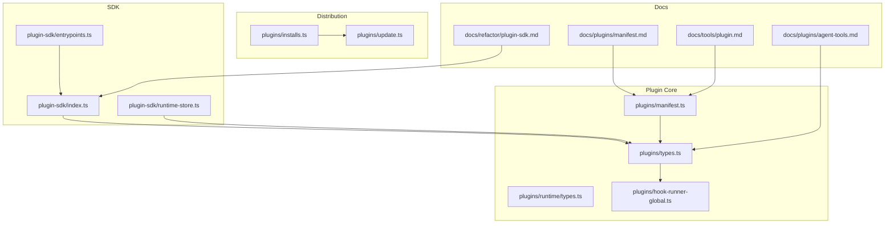
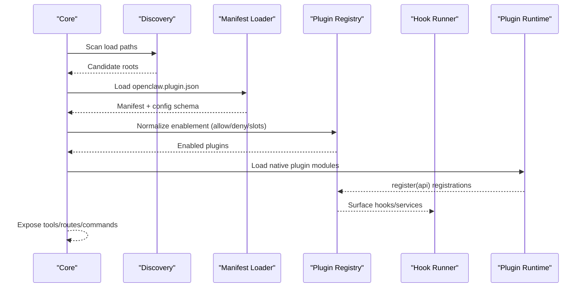
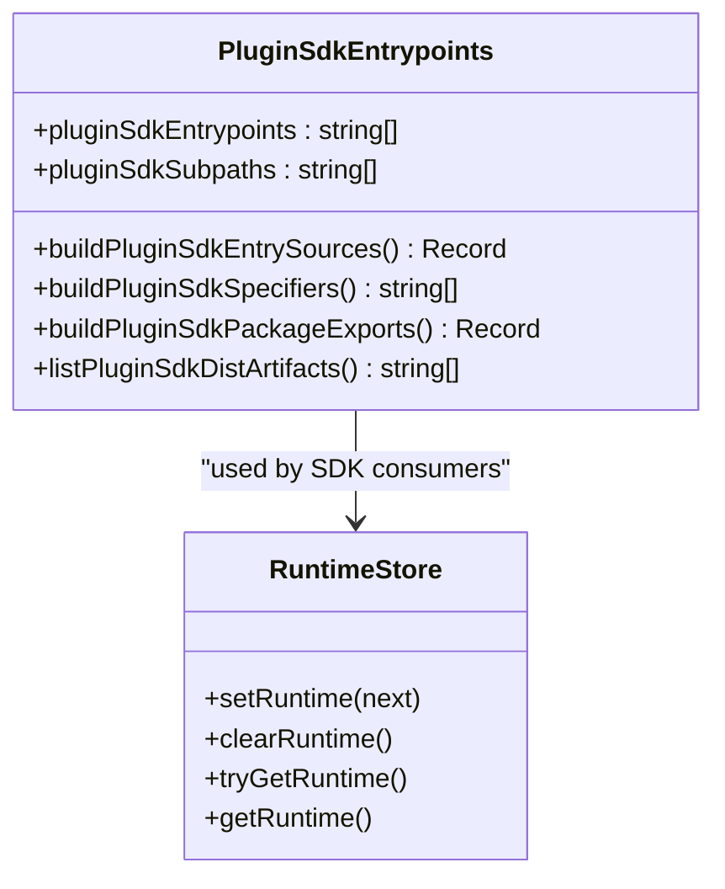
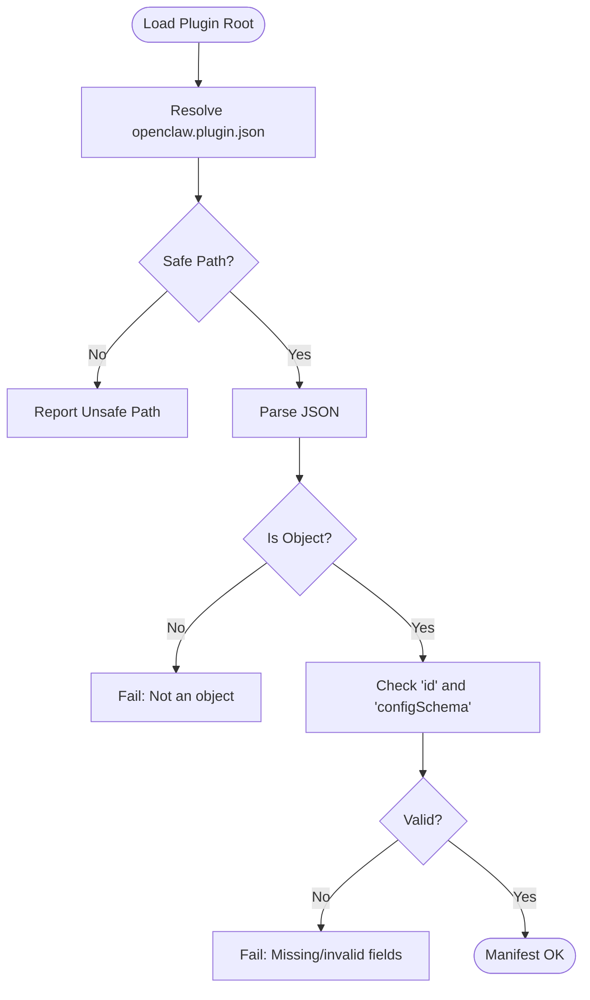
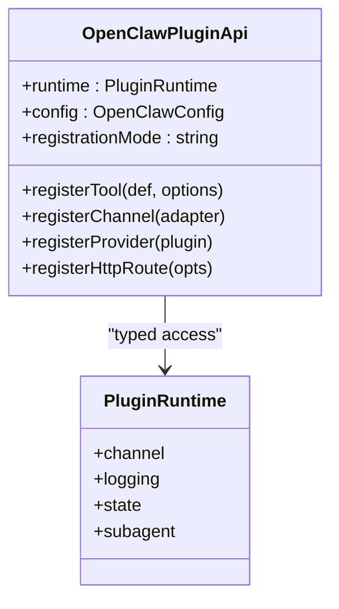
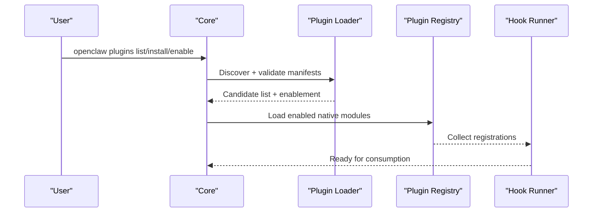
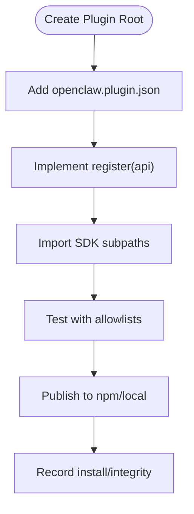
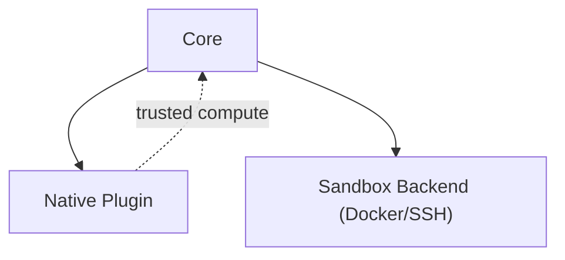
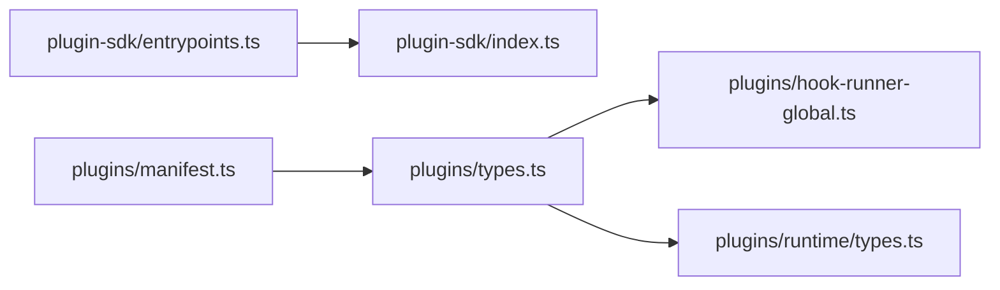

# Plugin System

<cite>
**Referenced Files in This Document**
- [plugin-sdk/index.ts](file://src/plugin-sdk/index.ts)
- [plugin-sdk/entrypoints.ts](file://src/plugin-sdk/entrypoints.ts)
- [plugin-sdk/runtime-store.ts](file://src/plugin-sdk/runtime-store.ts)
- [plugins/manifest.ts](file://src/plugins/manifest.ts)
- [plugins/types.ts](file://src/plugins/types.ts)
- [plugins/runtime/types.ts](file://src/plugins/runtime/types.ts)
- [plugins/hook-runner-global.ts](file://src/plugins/hook-runner-global.ts)
- [plugins/installs.ts](file://src/plugins/installs.ts)
- [plugins/update.ts](file://src/plugins/update.ts)
- [plugins/installs.ts](file://src/plugins/installs.ts)
- [plugins/update.ts](file://src/plugins/update.ts)
- [plugins/manifest.ts](file://src/plugins/manifest.ts)
- [plugins/types.ts](file://src/plugins/types.ts)
- [plugins/runtime/types.ts](file://src/plugins/runtime/types.ts)
- [plugins/hook-runner-global.ts](file://src/plugins/hook-runner-global.ts)
- [plugins/installs.ts](file://src/plugins/installs.ts)
- [plugins/update.ts](file://src/plugins/update.ts)
- [docs/plugins/manifest.md](file://docs/plugins/manifest.md)
- [docs/plugins/agent-tools.md](file://docs/plugins/agent-tools.md)
- [docs/refactor/plugin-sdk.md](file://docs/refactor/plugin-sdk.md)
- [docs/tools/plugin.md](file://docs/tools/plugin.md)
- [SECURITY.md](file://SECURITY.md)
- [src/agents/sandbox/backend.ts](file://src/agents/sandbox/backend.ts)
- [src/gateway/server-startup.ts](file://src/gateway/server-startup.ts)
- [extensions/discord/openclaw.plugin.json](file://extensions/discord/openclaw.plugin.json)
- [extensions/discord/index.ts](file://extensions/discord/index.ts)
</cite>

## Table of Contents
1. [Introduction](#introduction)
2. [Project Structure](#project-structure)
3. [Core Components](#core-components)
4. [Architecture Overview](#architecture-overview)
5. [Detailed Component Analysis](#detailed-component-analysis)
6. [Dependency Analysis](#dependency-analysis)
7. [Performance Considerations](#performance-considerations)
8. [Troubleshooting Guide](#troubleshooting-guide)
9. [Conclusion](#conclusion)
10. [Appendices](#appendices)

## Introduction
This document explains OpenClaw’s plugin system: its architecture, SDK, manifest format, lifecycle, and developer workflow. It covers how plugins integrate with the core system, how to develop and distribute them, and how security and sandboxing are enforced. It also documents the available plugin types (channels, skills, tools, provider integrations) and provides practical guidance for installation, configuration, and testing.

## Project Structure
OpenClaw organizes plugin-related code across several modules:
- Plugin SDK and entrypoints define the public API surface and packaging.
- Plugin manifest loading and validation enforce schema-first configuration.
- Plugin runtime types and the global hook runner coordinate plugin registration and execution.
- Installation, update, and integrity tracking manage distribution and versioning.
- Documentation pages describe the manifest schema, SDK usage, and plugin categories.

**Diagram sources**
- [plugin-sdk/index.ts:1-872](file://src/plugin-sdk/index.ts#L1-L872)
- [plugin-sdk/entrypoints.ts:1-36](file://src/plugin-sdk/entrypoints.ts#L1-L36)
- [plugin-sdk/runtime-store.ts:1-26](file://src/plugin-sdk/runtime-store.ts#L1-L26)
- [plugins/manifest.ts:1-222](file://src/plugins/manifest.ts#L1-L222)
- [plugins/types.ts:1-1775](file://src/plugins/types.ts#L1-L1775)
- [plugins/runtime/types.ts:1-64](file://src/plugins/runtime/types.ts#L1-L64)
- [plugins/hook-runner-global.ts:48-104](file://src/plugins/hook-runner-global.ts#L48-L104)
- [plugins/installs.ts:1-40](file://src/plugins/installs.ts#L1-L40)
- [plugins/update.ts:48-441](file://src/plugins/update.ts#L48-L441)
- [docs/plugins/manifest.md:1-100](file://docs/plugins/manifest.md#L1-L100)
- [docs/plugins/agent-tools.md:1-100](file://docs/plugins/agent-tools.md#L1-L100)
- [docs/refactor/plugin-sdk.md:1-215](file://docs/refactor/plugin-sdk.md#L1-L215)
- [docs/tools/plugin.md:1-800](file://docs/tools/plugin.md#L1-L800)

**Section sources**
- [plugin-sdk/index.ts:1-872](file://src/plugin-sdk/index.ts#L1-L872)
- [plugin-sdk/entrypoints.ts:1-36](file://src/plugin-sdk/entrypoints.ts#L1-L36)
- [plugin-sdk/runtime-store.ts:1-26](file://src/plugin-sdk/runtime-store.ts#L1-L26)
- [plugins/manifest.ts:1-222](file://src/plugins/manifest.ts#L1-L222)
- [plugins/types.ts:1-1775](file://src/plugins/types.ts#L1-L1775)
- [plugins/runtime/types.ts:1-64](file://src/plugins/runtime/types.ts#L1-L64)
- [plugins/hook-runner-global.ts:48-104](file://src/plugins/hook-runner-global.ts#L48-L104)
- [plugins/installs.ts:1-40](file://src/plugins/installs.ts#L1-L40)
- [plugins/update.ts:48-441](file://src/plugins/update.ts#L48-L441)
- [docs/plugins/manifest.md:1-100](file://docs/plugins/manifest.md#L1-L100)
- [docs/plugins/agent-tools.md:1-100](file://docs/plugins/agent-tools.md#L1-L100)
- [docs/refactor/plugin-sdk.md:1-215](file://docs/refactor/plugin-sdk.md#L1-L215)
- [docs/tools/plugin.md:1-800](file://docs/tools/plugin.md#L1-L800)

## Core Components
- Plugin SDK: A stable, publishable surface for plugin authors. It exports types, helpers, and channel-specific subpaths without importing core runtime internals.
- Plugin manifest: A JSON file that defines plugin identity, configuration schema, and optional metadata (channels, providers, skills).
- Plugin runtime: A typed interface that plugins use to access core runtime behavior safely.
- Registry and hooks: A global registry and hook runner that collect plugin registrations and orchestrate lifecycle events.
- Distribution: Utilities to record installs, verify integrity, and update plugins.

**Section sources**
- [plugin-sdk/index.ts:1-872](file://src/plugin-sdk/index.ts#L1-L872)
- [plugins/manifest.ts:1-222](file://src/plugins/manifest.ts#L1-L222)
- [plugins/runtime/types.ts:1-64](file://src/plugins/runtime/types.ts#L1-L64)
- [plugins/hook-runner-global.ts:48-104](file://src/plugins/hook-runner-global.ts#L48-L104)
- [plugins/installs.ts:1-40](file://src/plugins/installs.ts#L1-L40)
- [plugins/update.ts:48-441](file://src/plugins/update.ts#L48-L441)

## Architecture Overview
OpenClaw’s plugin architecture separates discovery/validation from runtime execution:
- Discovery and validation occur from manifest and schema metadata without executing plugin code.
- Native plugins are loaded in-process and register capabilities into a central registry.
- The core consumes the registry to expose tools, channels, providers, hooks, HTTP routes, CLI commands, and services.

**Diagram sources**
- [docs/tools/plugin.md:60-87](file://docs/tools/plugin.md#L60-L87)
- [plugins/manifest.ts:65-141](file://src/plugins/manifest.ts#L65-L141)
- [plugins/hook-runner-global.ts:48-104](file://src/plugins/hook-runner-global.ts#L48-L104)
- [src/gateway/server-startup.ts:153-191](file://src/gateway/server-startup.ts#L153-L191)

**Section sources**
- [docs/tools/plugin.md:60-87](file://docs/tools/plugin.md#L60-L87)
- [src/gateway/server-startup.ts:153-191](file://src/gateway/server-startup.ts#L153-L191)

## Detailed Component Analysis

### Plugin SDK Architecture
The SDK provides a stable, versioned surface for plugin authors:
- Entry points and exports are generated programmatically and mirrored in package exports.
- Subpaths target specific channel or extension domains to minimize import scope.
- Runtime store utilities provide a controlled accessor for runtime instances.

**Diagram sources**
- [plugin-sdk/entrypoints.ts:1-36](file://src/plugin-sdk/entrypoints.ts#L1-L36)
- [plugin-sdk/runtime-store.ts:1-26](file://src/plugin-sdk/runtime-store.ts#L1-L26)

**Section sources**
- [plugin-sdk/entrypoints.ts:1-36](file://src/plugin-sdk/entrypoints.ts#L1-L36)
- [plugin-sdk/runtime-store.ts:1-26](file://src/plugin-sdk/runtime-store.ts#L1-L26)
- [docs/refactor/plugin-sdk.md:19-50](file://docs/refactor/plugin-sdk.md#L19-L50)

### Manifest Format and Validation
Every native OpenClaw plugin must include a manifest file with:
- id: Canonical plugin identifier.
- configSchema: JSON Schema for plugin configuration.
- Optional: kind, channels, providers, providerAuthEnvVars, skills, name, description, uiHints, version.

Validation enforces:
- Presence of required fields.
- Safe path handling for manifest files.
- Strict schema validation prior to runtime execution.

**Diagram sources**
- [plugins/manifest.ts:55-141](file://src/plugins/manifest.ts#L55-L141)
- [docs/plugins/manifest.md:29-84](file://docs/plugins/manifest.md#L29-L84)

**Section sources**
- [plugins/manifest.ts:1-222](file://src/plugins/manifest.ts#L1-L222)
- [docs/plugins/manifest.md:1-100](file://docs/plugins/manifest.md#L1-L100)

### Plugin Types and Capabilities
OpenClaw supports several plugin categories:
- Channel adapters: Extend messaging platforms (e.g., Discord, Slack).
- Skills: Content packs integrated into the agent skill loader.
- Tools: Agent tools registered via the SDK.
- Provider integrations: Authentication flows, model catalogs, and runtime hooks for inference providers.

**Diagram sources**
- [plugins/types.ts:98-138](file://src/plugins/types.ts#L98-L138)
- [plugins/runtime/types.ts:51-63](file://src/plugins/runtime/types.ts#L51-L63)

**Section sources**
- [docs/tools/plugin.md:199-215](file://docs/tools/plugin.md#L199-L215)
- [docs/plugins/agent-tools.md:9-36](file://docs/plugins/agent-tools.md#L9-L36)
- [plugins/types.ts:545-738](file://src/plugins/types.ts#L545-L738)

### Plugin Lifecycle Management
Lifecycle stages:
- Discovery: Scans configured paths, workspace, global, and bundled roots.
- Enablement: Applies allow/deny/slots and default-on policies.
- Loading: Loads native modules via jiti and invokes register(api).
- Consumption: Surfaces tools, routes, hooks, and services.

**Diagram sources**
- [docs/tools/plugin.md:440-481](file://docs/tools/plugin.md#L440-L481)
- [src/gateway/server-startup.ts:153-191](file://src/gateway/server-startup.ts#L153-L191)

**Section sources**
- [docs/tools/plugin.md:440-481](file://docs/tools/plugin.md#L440-L481)
- [src/gateway/server-startup.ts:153-191](file://src/gateway/server-startup.ts#L153-L191)

### Plugin Development Workflow
- Create a manifest with id and configSchema.
- Implement a register(api) entry that registers tools, channels, providers, or HTTP routes.
- Use SDK subpaths for type-safe imports and helpers.
- Test with allowlists and sandbox policies.
- Distribute via npm or local paths; track installs and integrity.

**Diagram sources**
- [docs/plugins/manifest.md:29-67](file://docs/plugins/manifest.md#L29-L67)
- [docs/tools/plugin.md:772-800](file://docs/tools/plugin.md#L772-L800)
- [plugins/installs.ts:16-40](file://src/plugins/installs.ts#L16-L40)
- [plugins/update.ts:401-441](file://src/plugins/update.ts#L401-L441)

**Section sources**
- [docs/plugins/manifest.md:1-100](file://docs/plugins/manifest.md#L1-L100)
- [docs/tools/plugin.md:772-800](file://docs/tools/plugin.md#L772-L800)
- [plugins/installs.ts:1-40](file://src/plugins/installs.ts#L1-L40)
- [plugins/update.ts:401-441](file://src/plugins/update.ts#L401-L441)

### Practical Examples
- Channel plugin example: A Discord plugin registers a channel adapter and sets runtime context.
- Manifest example: A minimal manifest declares id, channels, and an empty config schema.

**Section sources**
- [extensions/discord/index.ts:1-23](file://extensions/discord/index.ts#L1-L23)
- [extensions/discord/openclaw.plugin.json:1-10](file://extensions/discord/openclaw.plugin.json#L1-L10)

### Security, Sandboxing, and Trust Boundaries
- Native plugins run in-process and share the same trust boundary as core code.
- Use allowlists and explicit install/load paths to constrain trust.
- Sandbox backends are pluggable and configurable for tool execution.

**Diagram sources**
- [SECURITY.md:108-114](file://SECURITY.md#L108-L114)
- [src/agents/sandbox/backend.ts:109-158](file://src/agents/sandbox/backend.ts#L109-L158)

**Section sources**
- [SECURITY.md:108-114](file://SECURITY.md#L108-L114)
- [src/agents/sandbox/backend.ts:109-158](file://src/agents/sandbox/backend.ts#L109-L158)

### Relationship Between Plugins and Core
- Plugins are registered into a central registry and consumed by core surfaces (tools, routes, hooks).
- The SDK ensures no direct imports from core; plugins must use api.runtime for core behavior.
- Provider plugins contribute catalogs and runtime hooks that integrate with the shared inference loop.

**Section sources**
- [docs/refactor/plugin-sdk.md:11-44](file://docs/refactor/plugin-sdk.md#L11-L44)
- [plugins/hook-runner-global.ts:48-104](file://src/plugins/hook-runner-global.ts#L48-L104)
- [docs/tools/plugin.md:216-233](file://docs/tools/plugin.md#L216-L233)

## Dependency Analysis
Plugin SDK entrypoints and exports are generated and mirrored for distribution. The manifest loader depends on boundary checks and JSON parsing utilities. The runtime types compose channel and core runtime interfaces.

**Diagram sources**
- [plugin-sdk/entrypoints.ts:1-36](file://src/plugin-sdk/entrypoints.ts#L1-L36)
- [plugin-sdk/index.ts:1-872](file://src/plugin-sdk/index.ts#L1-L872)
- [plugins/manifest.ts:1-222](file://src/plugins/manifest.ts#L1-L222)
- [plugins/types.ts:1-1775](file://src/plugins/types.ts#L1-L1775)
- [plugins/runtime/types.ts:1-64](file://src/plugins/runtime/types.ts#L1-L64)
- [plugins/hook-runner-global.ts:48-104](file://src/plugins/hook-runner-global.ts#L48-L104)

**Section sources**
- [plugin-sdk/entrypoints.ts:1-36](file://src/plugin-sdk/entrypoints.ts#L1-L36)
- [plugin-sdk/index.ts:1-872](file://src/plugin-sdk/index.ts#L1-L872)
- [plugins/manifest.ts:1-222](file://src/plugins/manifest.ts#L1-L222)
- [plugins/types.ts:1-1775](file://src/plugins/types.ts#L1-L1775)
- [plugins/runtime/types.ts:1-64](file://src/plugins/runtime/types.ts#L1-L64)
- [plugins/hook-runner-global.ts:48-104](file://src/plugins/hook-runner-global.ts#L48-L104)

## Performance Considerations
- Short in-process caches reduce startup and reload overhead for discovery, manifest registry, and loaded plugin registries.
- Cache windows and toggles are configurable for tuning.

**Section sources**
- [docs/tools/plugin.md:649-657](file://docs/tools/plugin.md#L649-L657)

## Troubleshooting Guide
Common issues and remedies:
- Manifest errors: Missing id, invalid schema, or unsafe paths cause immediate failure.
- Plugin not loading: Verify enablement rules, allowlists, and exclusive slots.
- Integrity drift: Updates may fail if integrity checks mismatch; handle drift via update hooks.
- Runtime access: Ensure api.runtime is used instead of importing core internals.

**Section sources**
- [plugins/manifest.ts:65-141](file://src/plugins/manifest.ts#L65-L141)
- [docs/tools/plugin.md:753-771](file://docs/tools/plugin.md#L753-L771)
- [plugins/update.ts:73-103](file://src/plugins/update.ts#L73-L103)
- [docs/refactor/plugin-sdk.md:40-44](file://docs/refactor/plugin-sdk.md#L40-L44)

## Conclusion
OpenClaw’s plugin system balances flexibility and safety. By enforcing manifest-first validation, providing a stable SDK, and separating discovery from runtime execution, it enables a rich ecosystem of channels, skills, tools, and providers. Developers should focus on clear manifests, typed SDK usage, and secure distribution practices.

## Appendices

### Plugin Manifest Reference
- Required: id, configSchema.
- Optional: kind, channels, providers, providerAuthEnvVars, skills, name, description, uiHints, version.

**Section sources**
- [docs/plugins/manifest.md:36-100](file://docs/plugins/manifest.md#L36-L100)
- [plugins/manifest.ts:11-23](file://src/plugins/manifest.ts#L11-L23)

### Plugin Agent Tools
- Define tools with JSON Schema parameters and an execute function.
- Optional tools require allowlisting.

**Section sources**
- [docs/plugins/agent-tools.md:19-100](file://docs/plugins/agent-tools.md#L19-L100)
- [plugins/types.ts:89-98](file://src/plugins/types.ts#L89-L98)

### Plugin SDK Import Paths
- Use subpaths for core, channel-specific, and extension-specific surfaces.

**Section sources**
- [docs/tools/plugin.md:547-579](file://docs/tools/plugin.md#L547-L579)
- [plugin-sdk/index.ts:1-872](file://src/plugin-sdk/index.ts#L1-L872)