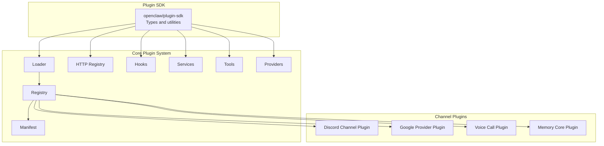
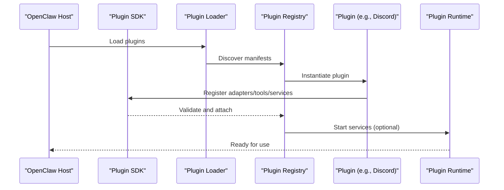
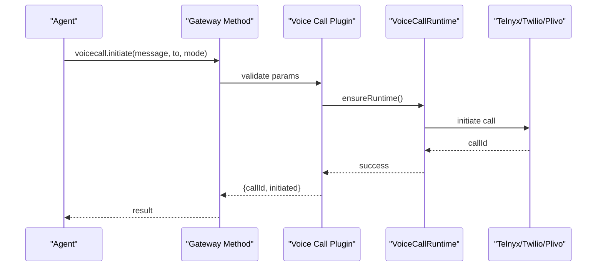
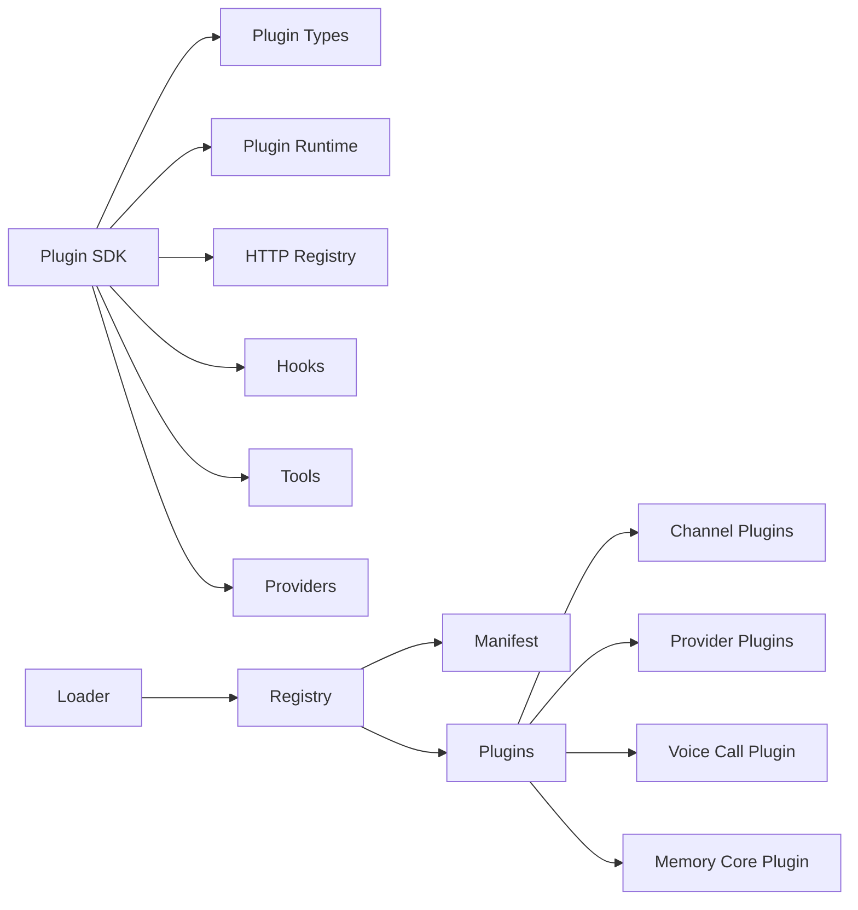

# Plugin Types

<cite>
**Referenced Files in This Document**
- [src/plugin-sdk/index.ts](file://src/plugin-sdk/index.ts)
- [src/plugins/types.ts](file://src/plugins/types.ts)
- [src/channels/plugins/types.plugin.ts](file://src/channels/plugins/types.plugin.ts)
- [src/plugins/runtime/types.ts](file://src/plugins/runtime/types.ts)
- [extensions/discord/index.ts](file://extensions/discord/index.ts)
- [extensions/discord/openclaw.plugin.json](file://extensions/discord/openclaw.plugin.json)
- [extensions/google/index.ts](file://extensions/google/index.ts)
- [extensions/google/openclaw.plugin.json](file://extensions/google/openclaw.plugin.json)
- [extensions/voice-call/index.ts](file://extensions/voice-call/index.ts)
- [extensions/voice-call/openclaw.plugin.json](file://extensions/voice-call/openclaw.plugin.json)
- [extensions/memory-core/index.ts](file://extensions/memory-core/index.ts)
- [extensions/memory-core/openclaw.plugin.json](file://extensions/memory-core/openclaw.plugin.json)
- [extensions/shared/runtime.ts](file://extensions/shared/runtime.ts)
- [src/plugins/runtime/index.ts](file://src/plugins/runtime/index.ts)
- [src/plugins/loader.ts](file://src/plugins/loader.ts)
- [src/plugins/manifest.ts](file://src/plugins/manifest.ts)
- [src/plugins/registry.ts](file://src/plugins/registry.ts)
- [src/plugins/config-schema.ts](file://src/plugins/config-schema.ts)
- [src/plugins/http-registry.ts](file://src/plugins/http-registry.ts)
- [src/plugins/hooks.ts](file://src/plugins/hooks.ts)
- [src/plugins/services.ts](file://src/plugins/services.ts)
- [src/plugins/tools.ts](file://src/plugins/tools.ts)
- [src/plugins/interactive.ts](file://src/plugins/interactive.ts)
- [src/plugins/providers.ts](file://src/plugins/providers.ts)
- [src/plugins/provider-runtime.ts](file://src/plugins/provider-runtime.ts)
- [src/plugins/provider-wizard.ts](file://src/plugins/provider-wizard.ts)
- [src/plugins/web-search-providers.ts](file://src/plugins/web-search-providers.ts)
- [src/plugins/enable.ts](file://src/plugins/enable.ts)
- [src/plugins/install.ts](file://src/plugins/install.ts)
- [src/plugins/update.ts](file://src/plugins/update.ts)
- [src/plugins/uninstall.ts](file://src/plugins/uninstall.ts)
- [src/plugins/status.ts](file://src/plugins/status.ts)
- [src/plugins/conversation-binding.ts](file://src/plugins/conversation-binding.ts)
- [src/plugins/bundle-manifest.ts](file://src/plugins/bundle-manifest.ts)
- [src/plugins/bundled-sources.ts](file://src/plugins/bundled-sources.ts)
- [src/plugins/bundled-provider-auth-env-vars.ts](file://src/plugins/bundled-provider-auth-env-vars.ts)
- [src/plugins/bundled-runtime-deps.ts](file://src/plugins/bundled-runtime-deps.ts)
- [src/plugins/bundled-compat.ts](file://src/plugins/bundled-compat.ts)
- [src/plugins/bundled-dir.ts](file://src/plugins/bundled-dir.ts)
- [src/plugins/path-safety.ts](file://src/plugins/path-safety.ts)
- [src/plugins/source-display.ts](file://src/plugins/source-display.ts)
- [src/plugins/toggle-config.ts](file://src/plugins/toggle-config.ts)
- [src/plugins/commands.ts](file://src/plugins/commands.ts)
- [src/plugins/cli.ts](file://src/plugins/cli.ts)
- [src/plugins/manifest-registry.ts](file://src/plugins/manifest-registry.ts)
- [src/plugins/discovery.ts](file://src/plugins/discovery.ts)
- [src/plugins/provider-discovery.ts](file://src/plugins/provider-discovery.ts)
- [src/plugins/provider-validation.ts](file://src/plugins/provider-validation.ts)
- [src/plugins/provider-runtime.runtime.ts](file://src/plugins/provider-runtime.runtime.ts)
- [src/plugins/provider-runtime.test.ts](file://src/plugins/provider-runtime.test.ts)
- [src/plugins/provider-wizard.test.ts](file://src/plugins/provider-wizard.test.ts)
- [src/plugins/web-search-providers.test.ts](file://src/plugins/web-search-providers.test.ts)
- [src/plugins/voice-call.plugin.test.ts](file://src/plugins/voice-call.plugin.test.ts)
- [src/plugins/tools.optional.test.ts](file://src/plugins/tools.optional.test.ts)
- [src/plugins/wired-hooks-before-agent-start.test.ts](file://src/plugins/wired-hooks-before-agent-start.test.ts)
- [src/plugins/wired-hooks-phase-hooks.test.ts](file://src/plugins/wired-hooks-phase-hooks.test.ts)
- [src/plugins/wired-hooks-session.test.ts](file://src/plugins/wired-hooks-session.test.ts)
- [src/plugins/wired-hooks-subagent.test.ts](file://src/plugins/wired-hooks-subagent.test.ts)
- [src/plugins/wired-hooks-gateway.test.ts](file://src/plugins/wired-hooks-gateway.test.ts)
- [src/plugins/wired-hooks-llm.test.ts](file://src/plugins/wired-hooks-llm.test.ts)
- [src/plugins/wired-hooks-message.test.ts](file://src/plugins/wired-hooks-message.test.ts)
- [src/plugins/wired-hooks-inbound-claim.test.ts](file://src/plugins/wired-hooks-inbound-claim.test.ts)
- [src/plugins/wired-hooks-after-tool-call.e2e.test.ts](file://src/plugins/wired-hooks-after-tool-call.e2e.test.ts)
- [src/plugins/wired-hooks-compaction.test.ts](file://src/plugins/wired-hooks-compaction.test.ts)
- [src/plugins/wired-hooks-model-override-wiring.test.ts](file://src/plugins/wired-hooks-model-override-wiring.test.ts)
- [src/plugins/wired-hooks-subagent.test.ts](file://src/plugins/wired-hooks-subagent.test.ts)
- [src/plugins/wired-hooks-gateway.test.ts](file://src/plugins/wired-hooks-gateway.test.ts)
- [src/plugins/wired-hooks-llm.test.ts](file://src/plugins/wired-hooks-llm.test.ts)
- [src/plugins/wired-hooks-message.test.ts](file://src/plugins/wired-hooks-message.test.ts)
- [src/plugins/wired-hooks-session.test.ts](file://src/plugins/wired-hooks-session.test.ts)
- [src/plugins/wired-hooks-subagent.test.ts](file://src/plugins/wired-hooks-subagent.test.ts)
- [src/plugins/wired-hooks-phase-hooks.test.ts](file://src/plugins/wired-hooks-phase-hooks.test.ts)
- [src/plugins/wired-hooks-before-agent-start.test.ts](file://src/plugins/wired-hooks-before-agent-start.test.ts)
- [src/plugins/wired-hooks-inbound-claim.test.ts](file://src/plugins/wired-hooks-inbound-claim.test.ts)
- [src/plugins/wired-hooks-after-tool-call.e2e.test.ts](file://src/plugins/wired-hooks-after-tool-call.e2e.test.ts)
- [src/plugins/wired-hooks-compaction.test.ts](file://src/plugins/wired-hooks-compaction.test.ts)
- [src/plugins/wired-hooks-model-override-wiring.test.ts](file://src/plugins/wired-hooks-model-override-wiring.test.ts)
- [src/plugins/wired-hooks-subagent.test.ts](file://src/plugins/wired-hooks-subagent.test.ts)
- [src/plugins/wired-hooks-gateway.test.ts](file://src/plugins/wired-hooks-gateway.test.ts)
- [src/plugins/wired-hooks-llm.test.ts](file://src/plugins/wired-hooks-llm.test.ts)
- [src/plugins/wired-hooks-message.test.ts](file://src/plugins/wired-hooks-message.test.ts)
- [src/plugins/wired-hooks-session.test.ts](file://src/plugins/wired-hooks-session.test.ts)
- [src/plugins/wired-hooks-subagent.test.ts](file://src/plugins/wired-hooks-subagent.test.ts)
- [src/plugins/wired-hooks-phase-hooks.test.ts](file://src/plugins/wired-hooks-phase-hooks.test.ts)
- [src/plugins/wired-hooks-before-agent-start.test.ts](file://src/plugins/wired-hooks-before-agent-start.test.ts)
- [src/plugins/wired-hooks-inbound-claim.test.ts](file://src/plugins/wired-hooks-inbound-claim.test.ts)
- [src/plugins/wired-hooks-after-tool-call.e2e.test.ts](file://src/plugins/wired-hooks-after-tool-call.e2e.test.ts)
- [src/plugins/wired-hooks-compaction.test.ts](file://src/plugins/wired-hooks-compaction.test.ts)
- [src/plugins/wired-hooks-model-override-wiring.test.ts](file://src/plugins/wired-hooks-model-override-wiring.test.ts)
- [src/plugins/wired-hooks-subagent.test.ts](file://src/plugins/wired-hooks-subagent.test.ts)
- [src/plugins/wired-hooks-gateway.test.ts](file://src/plugins/wired-hooks-gateway.test.ts)
- [src/plugins/wired-hooks-llm.test.ts](file://src/plugins/wired-hooks-llm.test.ts)
- [src/plugins/wired-hooks-message.test.ts](file://src/plugins/wired-hooks-message.test.ts)
- [src/plugins/wired-hooks-session.test.ts](file://src/plugins/wired-hooks-session.test.ts)
- [src/plugins/wired-hooks-subagent.test.ts](file://src/plugins/wired-hooks-subagent.test.ts)
- [src/plugins/wired-hooks-phase-hooks.test.ts](file://src/plugins/wired-hooks-phase-hooks.test.ts)
- [src/plugins/wired-hooks-before-agent-start.test.ts](file://src/plugins/wired-hooks-before-agent-start.test.ts)
- [src/plugins/wired-hooks-inbound-claim.test.ts](file://src/plugins/wired-hooks-inbound-claim.test.ts)
- [src/plugins/wired-hooks-after-tool-call.e2e.test.ts](file://src/plugins/wired-hooks-after-tool-call.e2e.test.ts)
- [src/plugins/wired-hooks-compaction.test.ts](file://src/plugins/wired-hooks-compaction.test.ts)
- [src/plugins/wired-hooks-model-override-wiring.test.ts](file://src/plugins/wired-hooks-model-override-wiring.test.ts)
- [src/plugins/wired-hooks-subagent.test.ts](file://src/plugins/wired-hooks-subagent.test.ts)
- [src/plugins/wired-hooks-gateway.test.ts](file://src/plugins/wired-hooks-gateway.test.ts)
- [src/plugins/wired-hooks-llm.test.ts](file://src/plugins/wired-hooks-llm.test.ts)
- [src/plugins/wired-hooks-message.test.ts](file://src/plugins/wired-hooks-message.test.ts)
- [src/plugins/wired-hooks-session.test.ts](file://src/plugins/wired-hooks-session.test.ts)
- [src/plugins/wired-hooks-subagent.test.ts](file://src/plugins/wired-hooks-subagent.test.ts)
- [src/plugins/wired-hooks-phase-hooks.test.ts](file://src/plugins/wired-hooks-phase-hooks.test.ts)
- [src/plugins/wired-hooks-before-agent-start.test.ts](file://src/plugins/wired-hooks-before-agent-start.test.ts)
- [src/plugins/wired-hooks-inbound-claim.test.ts](file://src/plugins/wired-hooks-inbound-claim.test.ts)
- [src/plugins/wired-hooks-after-tool-call.e2e.test.ts](file://src/plugins/wired-hooks-after-tool-call.e2e.test.ts)
- [src/plugins/wired-hooks-compaction.test.ts](file://src/plugins/wired-hooks-compaction.test.ts)
- [src/plugins/wired-hooks-model-override-wiring.test.ts](file://src/plugins/wired-hooks-model-override-wiring.test.ts)
- [src/plugins/wired-hooks-subagent.test.ts](file://src/plugins/wired-hooks-subagent.test.ts)
- [src/plugins/wired-hooks-gateway.test.ts](file://src/plugins/wired-hooks-gateway.test.ts)
- [src/plugins/wired-hooks-llm.test.ts](file://src/plugins/wired-hooks-llm.test.ts)
- [src/plugins/wired-hooks-message.test.ts](file://src/plugins/wired-hooks-message.test.ts)
- [src/plugins/wired-hooks-session.test.ts](file://src/plugins/wired-hooks-session.test.ts)
- [src/plugins/wired-hooks-subagent.test.ts](file://src/plugins/wired-hooks-subagent.test.ts)
- [src/plugins/wired-hooks-phase-hooks.test.ts](file://src/plugins/wired-hooks-phase-hooks.test.ts)
- [src/plugins/wired-hooks-before-agent-start.test.ts](file://src/plugins/wired-hooks-before-agent-start.test.ts)
- [src/plugins/wired-hooks-inbound-claim.test.ts](file://src/plugins/wired-hooks-inbound-claim.test.ts)
- [src/plugins/wired-hooks-after-tool-call.e2e.test.ts](file://src/plugins/wired-hooks-after-tool-call.e2e.test.ts)
- [src/plugins/wired-hooks-compaction.test.ts](file://src/plugins/wired-hooks-compaction.test.ts)
- [src/plugins/wired-hooks-model-override-wiring.test.ts](file://src/plugins/wired-hooks-model-override-wiring.test.ts)
- [src/plugins/wired-hooks-subagent.test.ts](file://src/plugins/wired-hooks-subagent.test.ts)
- [src/plugins/wired-hooks-gateway.test.ts](file://src/plugins/wired-hooks-gateway.test.ts)
- [src/plugins/wired-hooks-llm.test.ts](file://src/plugins/wired-hooks-llm.test.ts)
- [src/plugins/wired-hooks-message.test.ts](file://src/plugins/wired-hooks-message.test.ts)
- [src/plugins/wired-hooks-session.test.ts](file://src/plugins/wired-hooks-session.test.ts)
- [src/plugins/wired-hooks-subagent.test.ts](file://src/plugins/wired-hooks-subagent.test.ts)
- [src/plugins/wired-hooks-phase-hooks.test.ts](file://src/plugins/wired-hooks-phase-hooks.test.ts)
- [src/plugins/wired-hooks-before-agent-start.test.ts](file://src/plugins/wired-hooks-before-agent-start.test.ts)
- [src/plugins/wired-hooks-inbound-claim.test.ts](file://src/plugins/wired-hooks-inbound-claim.test.ts)
- [src/plugins/wired-hooks-after-tool-call.e2e.test.ts](file://src/plugins/wired-hooks-after-tool-call.e2e.test.ts)
- [src/plugins/wired-hooks-compaction.test.ts](file://src/plugins/wired-hooks-compaction.test.ts)
- [src/plugins/wired-hooks-model......](file://src/plugins/wired-hooks-model-override-wiring.test.ts)
</cite>

## Table of Contents
1. [Introduction](#introduction)
2. [Project Structure](#project-structure)
3. [Core Components](#core-components)
4. [Architecture Overview](#architecture-overview)
5. [Detailed Component Analysis](#detailed-component-analysis)
6. [Dependency Analysis](#dependency-analysis)
7. [Performance Considerations](#performance-considerations)
8. [Troubleshooting Guide](#troubleshooting-guide)
9. [Conclusion](#conclusion)
10. [Appendices](#appendices)

## Introduction
This document explains the plugin types available in OpenClaw’s ecosystem and how to implement them. It covers:
- Channel adapter plugins for integrating new messaging platforms
- Skill plugins for AI capability extensions
- Tool plugins for external service integration
- Authentication provider plugins for OAuth flows and token management
- Voice call plugins, browser automation plugins, and specialized tool integrations
- Implementation patterns, configuration requirements, lifecycle hooks, and compatibility considerations

The goal is to provide a practical guide for building, configuring, and integrating plugins while remaining accessible to readers with varying technical backgrounds.

## Project Structure
OpenClaw organizes plugin-related code across several subsystems:
- Plugin SDK and core types define the contracts and utilities used by all plugins
- Channel plugins implement adapters for specific chat platforms
- Provider plugins integrate model providers and authentication
- Specialized plugins implement voice calls, memory, and other capabilities
- Runtime and services orchestrate plugin lifecycles and HTTP routes

**Diagram sources**
- [src/plugin-sdk/index.ts:1-872](file://src/plugin-sdk/index.ts#L1-L872)
- [src/plugins/loader.ts](file://src/plugins/loader.ts)
- [src/plugins/registry.ts](file://src/plugins/registry.ts)
- [src/plugins/manifest.ts](file://src/plugins/manifest.ts)
- [src/plugins/http-registry.ts](file://src/plugins/http-registry.ts)
- [src/plugins/hooks.ts](file://src/plugins/hooks.ts)
- [src/plugins/services.ts](file://src/plugins/services.ts)
- [src/plugins/tools.ts](file://src/plugins/tools.ts)
- [src/plugins/providers.ts](file://src/plugins/providers.ts)
- [extensions/discord/index.ts:1-23](file://extensions/discord/index.ts#L1-L23)
- [extensions/google/index.ts:1-47](file://extensions/google/index.ts#L1-L47)
- [extensions/voice-call/index.ts:1-565](file://extensions/voice-call/index.ts#L1-L565)
- [extensions/memory-core/index.ts:1-39](file://extensions/memory-core/index.ts#L1-L39)

**Section sources**
- [src/plugin-sdk/index.ts:1-872](file://src/plugin-sdk/index.ts#L1-L872)
- [src/plugins/loader.ts](file://src/plugins/loader.ts)
- [src/plugins/registry.ts](file://src/plugins/registry.ts)
- [src/plugins/manifest.ts](file://src/plugins/manifest.ts)
- [src/plugins/http-registry.ts](file://src/plugins/http-registry.ts)
- [src/plugins/hooks.ts](file://src/plugins/hooks.ts)
- [src/plugins/services.ts](file://src/plugins/services.ts)
- [src/plugins/tools.ts](file://src/plugins/tools.ts)
- [src/plugins/providers.ts](file://src/plugins/providers.ts)

## Core Components
This section outlines the foundational types and runtime interfaces that all plugin categories rely on.

- Plugin SDK exports:
  - Channel adapter types and helpers
  - Provider plugin interfaces and auth contexts
  - Runtime types for subagents and channel operations
  - Utilities for HTTP routes, webhooks, status, and configuration
- Plugin runtime:
  - Subagent execution lifecycle (run, wait, get session messages, delete session)
  - Channel runtime integration
- Plugin core:
  - Registration, discovery, installation, updates, and status
  - HTTP route registration and conflict detection
  - Hook wiring and phase hooks
  - Tool and service registration

Key responsibilities:
- Define plugin kinds and configuration schemas
- Provide standardized auth flows and provider catalogs
- Expose consistent runtime APIs for tools and services
- Manage lifecycle hooks and service start/stop

**Section sources**
- [src/plugin-sdk/index.ts:1-872](file://src/plugin-sdk/index.ts#L1-L872)
- [src/plugins/runtime/types.ts:1-64](file://src/plugins/runtime/types.ts#L1-L64)
- [src/plugins/runtime/index.ts](file://src/plugins/runtime/index.ts)
- [src/plugins/loader.ts](file://src/plugins/loader.ts)
- [src/plugins/registry.ts](file://src/plugins/registry.ts)
- [src/plugins/http-registry.ts](file://src/plugins/http-registry.ts)
- [src/plugins/hooks.ts](file://src/plugins/hooks.ts)
- [src/plugins/tools.ts](file://src/plugins/tools.ts)
- [src/plugins/services.ts](file://src/plugins/services.ts)

## Architecture Overview
The plugin architecture centers on a plugin SDK that defines contracts and utilities, a core plugin system that discovers and registers plugins, and specialized plugin implementations that extend capabilities.

**Diagram sources**
- [src/plugin-sdk/index.ts:1-872](file://src/plugin-sdk/index.ts#L1-L872)
- [src/plugins/loader.ts](file://src/plugins/loader.ts)
- [src/plugins/registry.ts](file://src/plugins/registry.ts)
- [src/plugins/manifest.ts](file://src/plugins/manifest.ts)
- [extensions/discord/index.ts:1-23](file://extensions/discord/index.ts#L1-L23)

## Detailed Component Analysis

### Channel Adapter Plugins
Channel adapter plugins integrate new messaging platforms by implementing a channel plugin contract. They define configuration, setup, authentication, security, groups, mentions, outbound messaging, status, gateway methods, and more.

Implementation pattern:
- Export a plugin object with id, meta, capabilities, and adapters
- Provide a config schema and optional setup wizard
- Register adapters for auth, security, groups, mentions, outbound, status, gateway, commands, streaming, threading, messaging, directory, resolver, actions, and heartbeat
- Optionally expose agent tools for login flows

Example reference:
- Discord channel plugin registers adapters and sets runtime context

```mermaid
classDiagram
class ChannelPlugin {
+string id
+ChannelMeta meta
+ChannelCapabilities capabilities
+register()
}
class ChannelConfigAdapter
class ChannelAuthAdapter
class ChannelSecurityAdapter
class ChannelGroupAdapter
class ChannelMentionAdapter
class ChannelOutboundAdapter
class ChannelStatusAdapter
class ChannelGatewayAdapter
class ChannelCommandAdapter
class ChannelStreamingAdapter
class ChannelThreadingAdapter
class ChannelMessagingAdapter
class ChannelDirectoryAdapter
class ChannelResolverAdapter
class ChannelMessageActionAdapter
class ChannelHeartbeatAdapter
ChannelPlugin --> ChannelConfigAdapter
ChannelPlugin --> ChannelAuthAdapter
ChannelPlugin --> ChannelSecurityAdapter
ChannelPlugin --> ChannelGroupAdapter
ChannelPlugin --> ChannelMentionAdapter
ChannelPlugin --> ChannelOutboundAdapter
ChannelPlugin --> ChannelStatusAdapter
ChannelPlugin --> ChannelGatewayAdapter
ChannelPlugin --> ChannelCommandAdapter
ChannelPlugin --> ChannelStreamingAdapter
ChannelPlugin --> ChannelThreadingAdapter
ChannelPlugin --> ChannelMessagingAdapter
ChannelPlugin --> ChannelDirectoryAdapter
ChannelPlugin --> ChannelResolverAdapter
ChannelPlugin --> ChannelMessageActionAdapter
ChannelPlugin --> ChannelHeartbeatAdapter
```

**Diagram sources**
- [src/channels/plugins/types.plugin.ts:49-84](file://src/channels/plugins/types.plugin.ts#L49-L84)
- [src/channels/plugins/types.adapters.js](file://src/channels/plugins/types.adapters.js)
- [src/channels/plugins/types.core.js](file://src/channels/plugins/types.core.js)

Configuration requirements:
- Provide a config schema compatible with OpenClaw’s configuration system
- Use UI hints for sensitive or advanced fields
- Support multi-account and allowlist configurations

Integration patterns:
- Use normalized target IDs and messaging targets
- Implement status probes and audit helpers
- Integrate with setup wizards and pairing flows

**Section sources**
- [src/channels/plugins/types.plugin.ts:1-85](file://src/channels/plugins/types.plugin.ts#L1-L85)
- [extensions/discord/index.ts:1-23](file://extensions/discord/index.ts#L1-L23)
- [extensions/discord/openclaw.plugin.json:1-10](file://extensions/discord/openclaw.plugin.json#L1-L10)
- [src/plugin-sdk/index.ts:640-710](file://src/plugin-sdk/index.ts#L640-L710)

### Skill Plugins
Skill plugins extend AI capabilities by registering tools and interactive handlers. They can expose:
- Tools that agents can invoke
- Interactive handlers for platform-specific UI events
- Configuration schemas for skill parameters

Implementation pattern:
- Define tool factories that receive a context with session, agent, and runtime information
- Register tools with names and optional metadata
- Optionally register interactive handlers for supported platforms

Configuration requirements:
- Provide a config schema for skill parameters
- Use UI hints for sensitive or advanced fields

Integration patterns:
- Use runtime tools to create memory search/get tools
- Leverage CLI registration for skill-specific commands

**Section sources**
- [src/plugins/types.ts:89-91](file://src/plugins/types.ts#L89-L91)
- [extensions/memory-core/index.ts:1-39](file://extensions/memory-core/index.ts#L1-L39)
- [extensions/memory-core/openclaw.plugin.json:1-10](file://extensions/memory-core/openclaw.plugin.json#L1-L10)
- [src/plugins/tools.ts](file://src/plugins/tools.ts)
- [src/plugins/interactive.ts](file://src/plugins/interactive.ts)

### Tool Plugins
Tool plugins integrate external services by exposing tools that agents can execute. They encapsulate:
- API wrappers and authentication
- Data transformation and validation
- Error handling and retries

Implementation pattern:
- Build tools that accept structured parameters
- Use runtime services for HTTP, media, and logging
- Register tools with OpenClaw’s tool registry

Configuration requirements:
- Define parameter schemas for tool execution
- Support environment variables and secret references
- Provide UI hints for sensitive inputs

Integration patterns:
- Use runtime HTTP helpers and webhook guards
- Apply SSRF and rate-limit protections
- Transform provider responses into unified payloads

**Section sources**
- [src/plugins/types.ts:742-766](file://src/plugins/types.ts#L742-L766)
- [src/plugins/tools.ts](file://src/plugins/tools.ts)
- [src/plugins/http-registry.ts](file://src/plugins/http-registry.ts)
- [src/plugin-sdk/index.ts:164-214](file://src/plugin-sdk/index.ts#L164-L214)

### Authentication Provider Plugins
Authentication provider plugins implement OAuth flows, token management, and credential handling. They define:
- Provider auth methods (OAuth, API key, token, device code, custom)
- Non-interactive auth resolution
- Usage/billing auth and snapshot fetching
- Model catalog augmentation and policy overrides

Implementation pattern:
- Implement ProviderPlugin with auth methods and catalog hooks
- Use wizard helpers for setup and model picker
- Provide runtime auth preparation and usage auth resolution

Configuration requirements:
- Declare environment variables for provider credentials
- Support non-interactive auth via flags and environment
- Provide provider-specific model policies and thinking toggles

Integration patterns:
- Use runtime OAuth handlers and token refresh
- Normalize resolved models and prepare stream wrappers
- Fetch usage snapshots and format provider-specific responses

**Section sources**
- [src/plugins/types.ts:106-193](file://src/plugins/types.ts#L106-L193)
- [src/plugins/types.ts:214-738](file://src/plugins/types.ts#L214-L738)
- [extensions/google/index.ts:1-47](file://extensions/google/index.ts#L1-L47)
- [extensions/google/openclaw.plugin.json:1-13](file://extensions/google/openclaw.plugin.json#L1-L13)
- [src/plugins/providers.ts](file://src/plugins/providers.ts)
- [src/plugins/provider-wizard.ts](file://src/plugins/provider-wizard.ts)
- [src/plugins/provider-runtime.ts](file://src/plugins/provider-runtime.ts)

### Voice Call Plugins
Voice call plugins enable outbound and inbound voice communication via Telnyx, Twilio, Plivo, or mock providers. They expose:
- Gateway methods for initiating, continuing, speaking, ending, and querying call status
- A tool for voice call actions
- CLI commands for voice call management
- Service lifecycle for runtime startup and shutdown

Implementation pattern:
- Parse and validate configuration
- Create a runtime that manages call lifecycle and media streaming
- Register gateway methods and tools with parameter validation
- Provide service start/stop hooks

Configuration requirements:
- Provider selection (telnyx, twilio, plivo, mock)
- Credentials for selected provider
- Inbound policy and allowlist
- Streaming and TTS provider overrides
- Tunneling and webhook security settings

Integration patterns:
- Use runtime logger backed by OpenClaw logger
- Enforce signature verification and webhook guards
- Manage concurrent calls and timeouts

**Diagram sources**
- [extensions/voice-call/index.ts:261-292](file://extensions/voice-call/index.ts#L261-L292)
- [extensions/voice-call/index.ts:376-374](file://extensions/voice-call/index.ts#L376-L374)
- [extensions/voice-call/index.ts:399-519](file://extensions/voice-call/index.ts#L399-L519)
- [extensions/voice-call/openclaw.plugin.json:162-612](file://extensions/voice-call/openclaw.plugin.json#L162-L612)

**Section sources**
- [extensions/voice-call/index.ts:1-565](file://extensions/voice-call/index.ts#L1-L565)
- [extensions/voice-call/openclaw.plugin.json:1-612](file://extensions/voice-call/openclaw.plugin.json#L1-L612)
- [extensions/shared/runtime.ts:1-15](file://extensions/shared/runtime.ts#L1-L15)
- [src/plugin-sdk/index.ts:164-214](file://src/plugin-sdk/index.ts#L164-L214)

### Browser Automation Plugins
Browser automation plugins enable headless browser control for tasks like login flows, scraping, and UI automation. They typically:
- Provide tools and CLI commands for browser actions
- Manage browser instances and sessions
- Integrate with OpenClaw’s runtime for sandboxing and security

Implementation pattern:
- Use runtime browser helpers and sandboxing
- Register tools and CLI commands for automation tasks
- Apply security policies and resource limits

Configuration requirements:
- Browser executable paths and flags
- Sandbox and security settings
- Proxy and network policies

Integration patterns:
- Use runtime media and outbound helpers
- Apply webhook guards and SSRF protections
- Manage temporary downloads and media URLs

[No sources needed since this section provides conceptual guidance]

### Specialized Tool Integrations
Specialized tool integrations include memory search, web search providers, and other domain-specific capabilities. Examples:
- Memory core plugin registers memory search and get tools
- Web search provider plugins integrate with Gemini and other providers

Implementation pattern:
- Use runtime tools to create domain-specific tools
- Register CLI commands for administration
- Provide provider-backed web search tools

Configuration requirements:
- Environment variables for provider credentials
- UI hints for sensitive inputs
- Provider-specific parameters and models

Integration patterns:
- Use runtime HTTP helpers and webhook guards
- Apply usage auth and snapshot fetching
- Transform provider responses into unified payloads

**Section sources**
- [extensions/memory-core/index.ts:1-39](file://extensions/memory-core/index.ts#L1-L39)
- [extensions/memory-core/openclaw.plugin.json:1-10](file://extensions/memory-core/openclaw.plugin.json#L1-L10)
- [src/plugins/web-search-providers.ts](file://src/plugins/web-search-providers.ts)
- [src/plugins/providers.ts](file://src/plugins/providers.ts)

## Dependency Analysis
Plugins depend on the Plugin SDK for types and utilities, and on the core plugin system for discovery, registration, and lifecycle management.

**Diagram sources**
- [src/plugin-sdk/index.ts:1-872](file://src/plugin-sdk/index.ts#L1-L872)
- [src/plugins/loader.ts](file://src/plugins/loader.ts)
- [src/plugins/registry.ts](file://src/plugins/registry.ts)
- [src/plugins/manifest.ts](file://src/plugins/manifest.ts)
- [src/plugins/http-registry.ts](file://src/plugins/http-registry.ts)
- [src/plugins/hooks.ts](file://src/plugins/hooks.ts)
- [src/plugins/tools.ts](file://src/plugins/tools.ts)
- [src/plugins/providers.ts](file://src/plugins/providers.ts)

**Section sources**
- [src/plugin-sdk/index.ts:1-872](file://src/plugin-sdk/index.ts#L1-L872)
- [src/plugins/loader.ts](file://src/plugins/loader.ts)
- [src/plugins/registry.ts](file://src/plugins/registry.ts)
- [src/plugins/manifest.ts](file://src/plugins/manifest.ts)
- [src/plugins/http-registry.ts](file://src/plugins/http-registry.ts)
- [src/plugins/hooks.ts](file://src/plugins/hooks.ts)
- [src/plugins/tools.ts](file://src/plugins/tools.ts)
- [src/plugins/providers.ts](file://src/plugins/providers.ts)

## Performance Considerations
- Use runtime HTTP guards and webhook memory guards to prevent abuse and resource exhaustion
- Apply SSRF protections and hostname allowlists for outbound requests
- Limit concurrent calls and manage timeouts for voice call plugins
- Cache provider metadata and model catalogs where appropriate
- Use keyed async queues for task concurrency control

[No sources needed since this section provides general guidance]

## Troubleshooting Guide
Common issues and resolutions:
- Plugin not loading: verify manifest and registration
- Configuration errors: check config schema and UI hints
- HTTP route conflicts: review registered routes and overlap detection
- Authentication failures: validate provider credentials and non-interactive auth resolution
- Voice call runtime errors: ensure provider credentials and tunnel settings are correct

**Section sources**
- [src/plugins/manifest.ts](file://src/plugins/manifest.ts)
- [src/plugins/registry.ts](file://src/plugins/registry.ts)
- [src/plugins/http-registry.ts](file://src/plugins/http-registry.ts)
- [src/plugins/config-schema.ts](file://src/plugins/config-schema.ts)
- [src/plugins/providers.ts](file://src/plugins/providers.ts)
- [src/plugins/provider-runtime.ts](file://src/plugins/provider-runtime.ts)
- [src/plugins/voice-call.plugin.test.ts](file://src/plugins/voice-call.plugin.test.ts)

## Conclusion
OpenClaw’s plugin system provides a robust, extensible framework for integrating messaging platforms, AI providers, tools, and specialized capabilities. By adhering to the SDK contracts, leveraging the core plugin system, and following the implementation patterns outlined here, developers can build reliable, secure, and maintainable plugins tailored to diverse use cases.

[No sources needed since this section summarizes without analyzing specific files]

## Appendices

### Plugin Type-Specific APIs and Lifecycle Hooks
- Channel plugins: implement adapters for auth, security, groups, mentions, outbound, status, gateway, commands, streaming, threading, messaging, directory, resolver, actions, and heartbeat
- Provider plugins: implement auth methods, catalog hooks, runtime auth preparation, usage auth resolution, and model policy overrides
- Tool plugins: define tool factories and parameter schemas; register tools and CLI commands
- Voice call plugins: register gateway methods, tools, CLI commands, and service lifecycle
- Runtime: expose subagent execution APIs and channel runtime integration

**Section sources**
- [src/channels/plugins/types.plugin.ts:49-84](file://src/channels/plugins/types.plugin.ts#L49-L84)
- [src/plugins/types.ts:545-738](file://src/plugins/types.ts#L545-L738)
- [src/plugins/runtime/types.ts:51-63](file://src/plugins/runtime/types.ts#L51-L63)
- [extensions/discord/index.ts:1-23](file://extensions/discord/index.ts#L1-L23)
- [extensions/google/index.ts:1-47](file://extensions/google/index.ts#L1-L47)
- [extensions/voice-call/index.ts:146-565](file://extensions/voice-call/index.ts#L146-L565)
- [extensions/memory-core/index.ts:1-39](file://extensions/memory-core/index.ts#L1-L39)