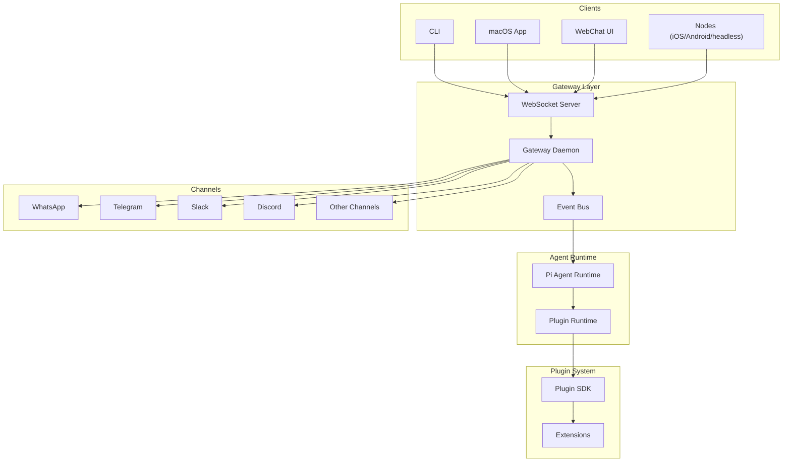
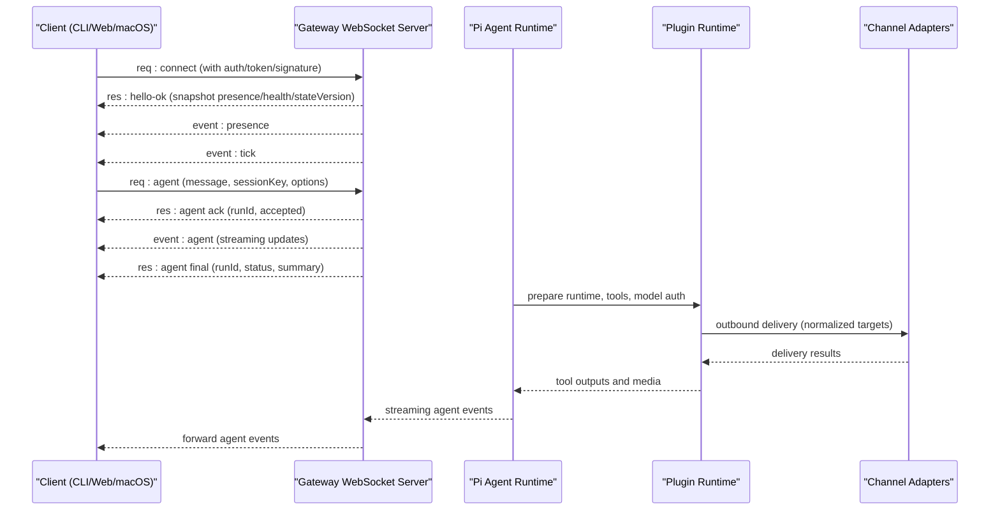
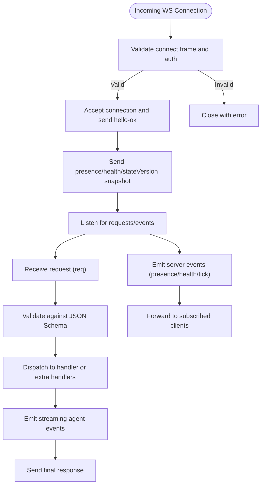
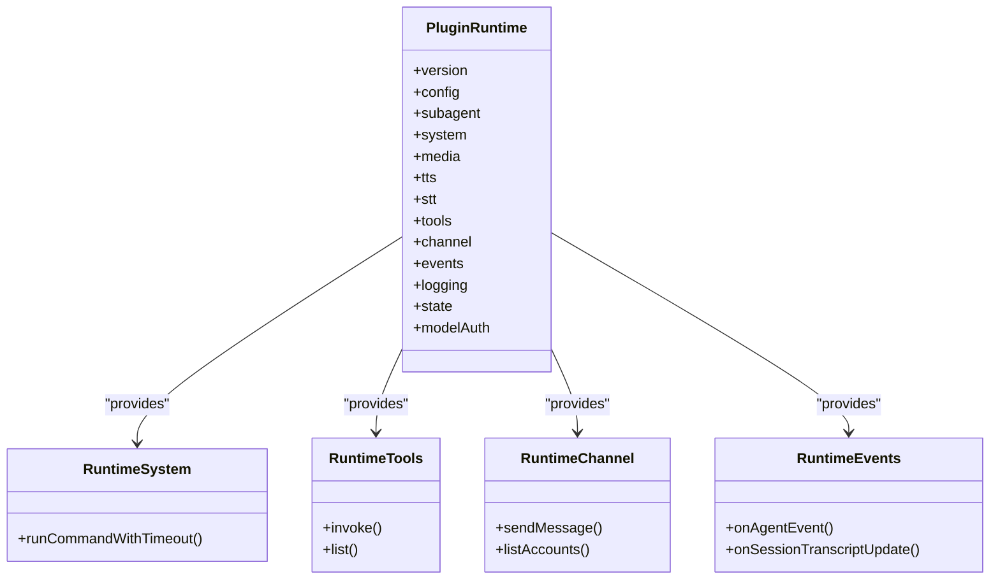
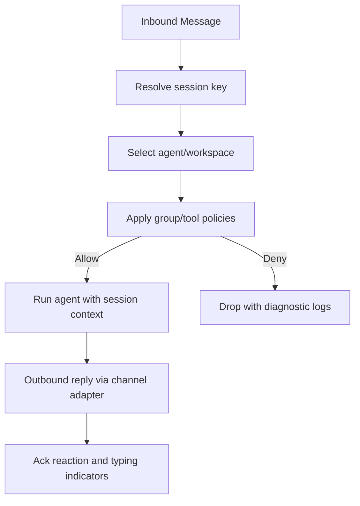
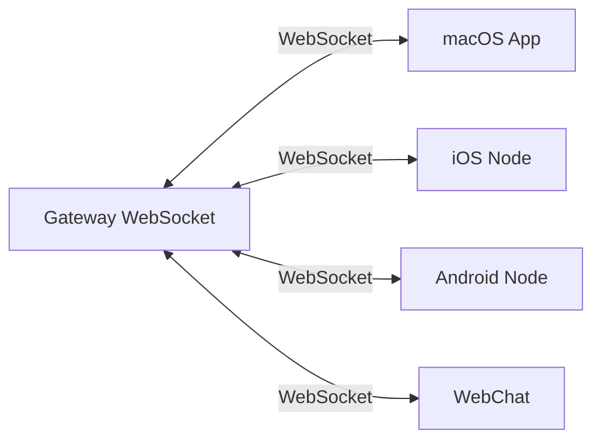
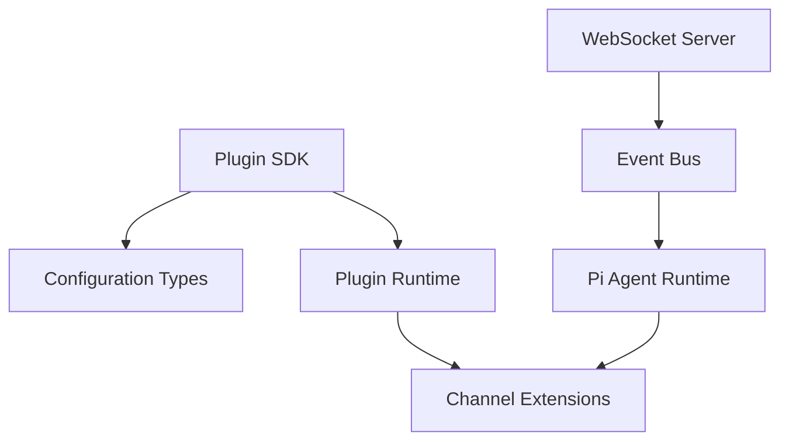

# Architecture Overview

<cite>
**Referenced Files in This Document**
- [README.md](file://README.md)
- [architecture.md](file://docs/concepts/architecture.md)
- [index.ts](file://src/plugin-sdk/index.ts)
- [package.json](file://package.json)
- [ws-connection.ts](file://src/gateway/server/ws-connection.ts)
- [message-handler.ts](file://src/gateway/server/ws-connection/message-handler.ts)
- [client.ts](file://src/gateway/client.ts)
- [runtime.ts](file://src/plugins/runtime/index.ts)
</cite>

## Table of Contents
1. [Introduction](#introduction)
2. [Project Structure](#project-structure)
3. [Core Components](#core-components)
4. [Architecture Overview](#architecture-overview)
5. [Detailed Component Analysis](#detailed-component-analysis)
6. [Dependency Analysis](#dependency-analysis)
7. [Performance Considerations](#performance-considerations)
8. [Troubleshooting Guide](#troubleshooting-guide)
9. [Conclusion](#conclusion)

## Introduction
OpenClaw is a personal AI assistant designed to run locally on user devices, providing a unified control plane for multi-channel messaging, agent orchestration, and cross-platform applications. At its heart is a WebSocket-based gateway that serves as the central control plane, coordinating clients, nodes, agents, channels, tools, and sessions. The system emphasizes local-first operation, strong security defaults, and multi-agent isolation, while supporting a wide range of platforms and messaging channels.

## Project Structure
The repository is organized around several major layers:
- Gateway: WebSocket control plane, event broadcasting, and request handling
- Agents: Orchestration and runtime for conversational AI
- Channels: Integrations for multiple messaging platforms
- Plugins: Extensible SDK for building tools and integrations
- Cross-platform apps: Companion applications for macOS, iOS, Android, and web
- Shared libraries: Plugin SDK, runtime utilities, and infrastructure

**Diagram sources**
- [architecture.md:12-26](file://docs/concepts/architecture.md#L12-L26)
- [ws-connection.ts:93-139](file://src/gateway/server/ws-connection.ts#L93-L139)
- [index.ts:1-200](file://src/plugin-sdk/index.ts#L1-L200)

**Section sources**
- [README.md:185-212](file://README.md#L185-L212)
- [architecture.md:12-26](file://docs/concepts/architecture.md#L12-L26)

## Core Components
- Gateway WebSocket control plane: Single long-lived daemon that owns messaging surfaces, validates frames, and emits typed events.
- Clients: macOS app, CLI, web UI, and automations connect over WebSocket to the gateway.
- Nodes: Device-based connections (role: node) with explicit capabilities and commands.
- Agent runtime: Pi agent runtime in RPC mode with tool streaming and block streaming.
- Plugin system: Rich SDK enabling extensions and tools across channels and capabilities.
- Cross-platform applications: Companion apps for macOS, iOS, Android, and web chat.

Key architectural characteristics:
- Local-first design with loopback binding by default and optional remote exposure via Tailscale or SSH tunnels.
- Multi-agent routing and session isolation for group and channel contexts.
- Strong security defaults including device pairing, signature verification, and sandboxing for non-main sessions.

**Section sources**
- [architecture.md:12-26](file://docs/concepts/architecture.md#L12-L26)
- [README.md:126-136](file://README.md#L126-L136)
- [README.md:332-339](file://README.md#L332-L339)

## Architecture Overview
The gateway acts as the central orchestrator, managing:
- WebSocket connections from clients and nodes
- Typed request/response and event streams
- Session routing and multi-agent isolation
- Channel integrations and outbound delivery
- Plugin runtime and tool execution
- Canvas hosting and A2UI

**Diagram sources**
- [architecture.md:59-78](file://docs/concepts/architecture.md#L59-L78)
- [message-handler.ts:132-172](file://src/gateway/server/ws-connection/message-handler.ts#L132-L172)
- [client.ts:78-122](file://src/gateway/client.ts#L78-L122)

**Section sources**
- [architecture.md:27-47](file://docs/concepts/architecture.md#L27-L47)
- [ws-connection.ts:93-139](file://src/gateway/server/ws-connection.ts#L93-L139)

## Detailed Component Analysis

### WebSocket Control Plane
The gateway maintains a WebSocket server that:
- Enforces mandatory handshake and validates frames against JSON Schema
- Supports requests/responses and server-pushed events
- Provides idempotent deduplication for side-effecting methods
- Manages presence, health, and heartbeat snapshots
- Handles device pairing and signature verification

**Diagram sources**
- [architecture.md:80-92](file://docs/concepts/architecture.md#L80-L92)
- [ws-connection.ts:115-139](file://src/gateway/server/ws-connection.ts#L115-L139)
- [message-handler.ts:132-172](file://src/gateway/server/ws-connection/message-handler.ts#L132-L172)

**Section sources**
- [architecture.md:80-92](file://docs/concepts/architecture.md#L80-L92)
- [ws-connection.ts:93-139](file://src/gateway/server/ws-connection.ts#L93-L139)
- [message-handler.ts:132-172](file://src/gateway/server/ws-connection/message-handler.ts#L132-L172)

### Agent Runtime and Plugin System
The agent runtime integrates with:
- Pi agent core for conversational loops and tool streaming
- Plugin runtime exposing system, media, tools, channel, events, logging, and model auth
- Subagent capabilities for inter-session coordination

**Diagram sources**
- [runtime.ts:48-89](file://src/plugins/runtime/index.ts#L48-L89)

**Section sources**
- [runtime.ts:48-89](file://src/plugins/runtime/index.ts#L48-L89)
- [README.md:144-148](file://README.md#L144-L148)

### Multi-Agent Isolation and Sessions
Sessions encapsulate conversation state and isolation:
- Session keys route messages to specific agents
- Group and channel contexts enforce allowlists and group policies
- Sandbox mode isolates non-main sessions for group/channel safety

**Diagram sources**
- [architecture.md:135-140](file://docs/concepts/architecture.md#L135-L140)
- [README.md:332-339](file://README.md#L332-L339)

**Section sources**
- [README.md:332-339](file://README.md#L332-L339)
- [architecture.md:135-140](file://docs/concepts/architecture.md#L135-L140)

### Cross-Platform Applications
Companion applications leverage the gateway protocol:
- macOS app: menu bar control, voice wake, talk mode, webchat, and remote control
- iOS/Android nodes: device pairing, canvas, camera, screen recording, and device commands
- WebChat: static UI using the gateway WebSocket API

**Diagram sources**
- [architecture.md:117-128](file://docs/concepts/architecture.md#L117-L128)

**Section sources**
- [architecture.md:117-128](file://docs/concepts/architecture.md#L117-L128)
- [README.md:289-311](file://README.md#L289-L311)

## Dependency Analysis
The system relies on a modular dependency structure:
- Plugin SDK exports channel adapters, runtime utilities, and configuration schemas
- Gateway depends on WebSocket server, JSON Schema validation, and event broadcasting
- Agent runtime integrates with plugin runtime and model authentication
- Extensions provide channel-specific adapters and capabilities

**Diagram sources**
- [index.ts:1-200](file://src/plugin-sdk/index.ts#L1-L200)
- [package.json:347-404](file://package.json#L347-L404)

**Section sources**
- [index.ts:1-200](file://src/plugin-sdk/index.ts#L1-L200)
- [package.json:347-404](file://package.json#L347-L404)

## Performance Considerations
- WebSocket streaming: minimize latency by batching and coalescing events where appropriate
- Rate limiting: protect against auth brute-force and request flooding
- Sandbox isolation: containerized execution for non-main sessions reduces overhead while maintaining safety
- Canvas hosting: share the gateway port for reduced network complexity
- Scaling: horizontal scaling via multiple gateways is supported; however, the design favors a single gateway per host for channel session ownership

[No sources needed since this section provides general guidance]

## Troubleshooting Guide
Common operational issues and resolutions:
- Authentication failures: verify token, device token, and signature verification
- Connection drops: check close codes and reconnection behavior
- Remote access: ensure Tailscale or SSH tunnel configuration matches gateway auth settings
- Diagnostics: use diagnostic events and logs to trace message flow and session states

**Section sources**
- [client.ts:111-122](file://src/gateway/client.ts#L111-L122)
- [architecture.md:117-128](file://docs/concepts/architecture.md#L117-L128)

## Conclusion
OpenClaw’s architecture centers on a robust WebSocket-based gateway that unifies clients, nodes, agents, channels, tools, and sessions. Its local-first design, strong security model, and multi-agent isolation enable reliable, scalable personal AI assistance across diverse platforms and messaging channels. The plugin SDK and extension ecosystem further enhance extensibility, while the gateway’s event-driven design supports efficient real-time interactions.