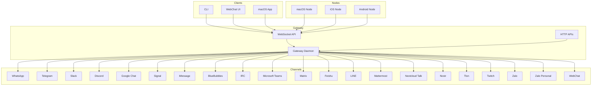
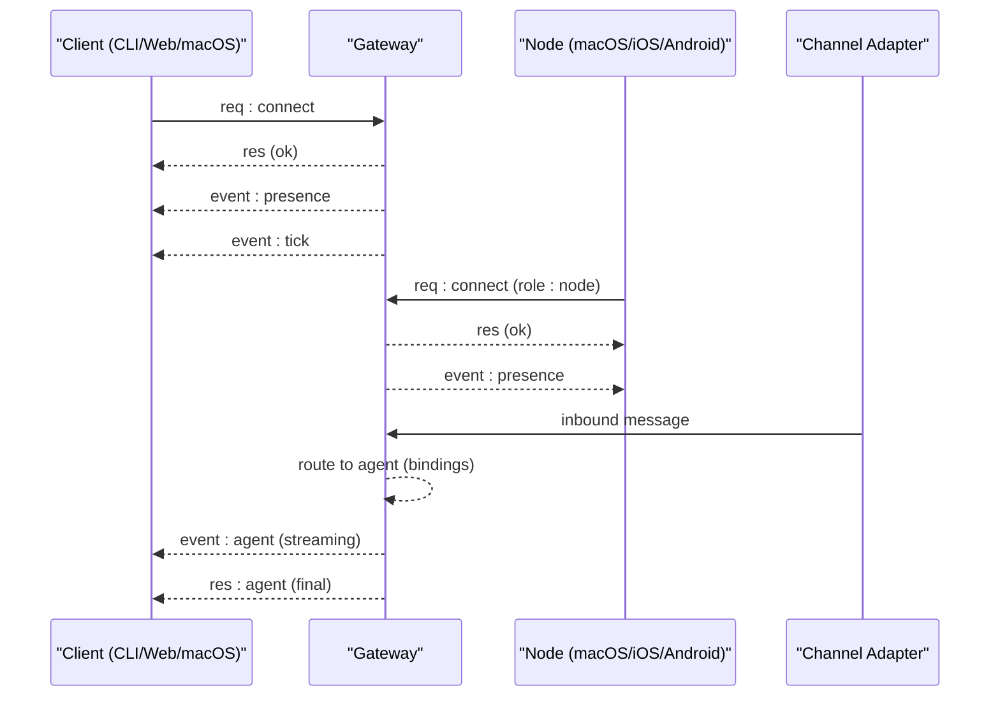
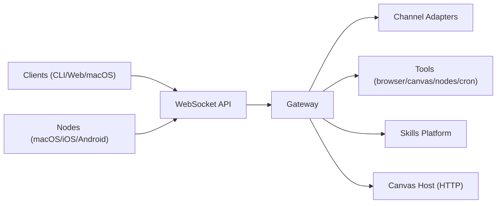

# Core Features

<cite>
**Referenced Files in This Document**
- [README.md](file://README.md)
- [VISION.md](file://VISION.md)
- [docs/concepts/architecture.md](file://docs/concepts/architecture.md)
- [docs/gateway/index.md](file://docs/gateway/index.md)
- [docs/channels/index.md](file://docs/channels/index.md)
- [docs/nodes/index.md](file://docs/nodes/index.md)
- [docs/nodes/voicewake.md](file://docs/nodes/voicewake.md)
- [docs/nodes/talk.md](file://docs/nodes/talk.md)
- [docs/tools/index.md](file://docs/tools/index.md)
- [docs/tools/skills.md](file://docs/tools/skills.md)
- [docs/concepts/multi-agent.md](file://docs/concepts/multi-agent.md)
</cite>

## Table of Contents
1. [Introduction](#introduction)
2. [Project Structure](#project-structure)
3. [Core Components](#core-components)
4. [Architecture Overview](#architecture-overview)
5. [Detailed Component Analysis](#detailed-component-analysis)
6. [Dependency Analysis](#dependency-analysis)
7. [Performance Considerations](#performance-considerations)
8. [Troubleshooting Guide](#troubleshooting-guide)
9. [Conclusion](#conclusion)

## Introduction
OpenClaw is a personal AI assistant that runs on your devices and integrates with the channels you already use. It emphasizes a local-first gateway architecture, multi-agent routing, voice control, live Canvas, and a first-class tools ecosystem. This document focuses on the platform’s core capabilities and how they work together to create a unified personal AI assistant experience.

## Project Structure
OpenClaw is organized around a central Gateway that acts as a control plane for sessions, channels, tools, and events. Clients (macOS app, CLI, web UI) and nodes (devices) connect over WebSocket to the Gateway. The platform supports a broad set of messaging channels and provides tools for browser control, Canvas rendering, nodes, and automation.

**Diagram sources**
- [docs/concepts/architecture.md:12-26](file://docs/concepts/architecture.md#L12-L26)
- [docs/gateway/index.md:68-77](file://docs/gateway/index.md#L68-L77)
- [docs/channels/index.md:14-38](file://docs/channels/index.md#L14-L38)

**Section sources**
- [README.md:21-26](file://README.md#L21-L26)
- [docs/concepts/architecture.md:12-26](file://docs/concepts/architecture.md#L12-L26)
- [docs/gateway/index.md:68-77](file://docs/gateway/index.md#L68-L77)
- [docs/channels/index.md:14-38](file://docs/channels/index.md#L14-L38)

## Core Components
- Local-first Gateway: A single always-on process that owns channel connections, routes messages, and exposes a WebSocket control plane for clients and nodes.
- Multi-channel messaging: Seamless integration with dozens of platforms (WhatsApp, Telegram, Slack, Discord, Google Chat, Signal, iMessage, BlueBubbles, IRC, Microsoft Teams, Matrix, Feishu, LINE, Mattermost, Nextcloud Talk, Nostr, Synology Chat, Tlon, Twitch, Zalo, Zalo Personal, WebChat).
- Multi-agent routing: Isolated agents with distinct workspaces, sessions, and tool policies, each capable of receiving and responding to messages according to bindings.
- Voice wake and talk mode: Global voice wake word management and continuous voice conversation with ElevenLabs TTS and interruptible playback.
- Live Canvas: Agent-driven visual workspace with A2UI host and node-based Canvas rendering.
- First-class tools: Browser control, Canvas, Nodes, Cron, Sessions, and messaging tools; skills platform for managed and workspace skills.
- Companion apps and nodes: macOS menu bar app, iOS/Android nodes, and headless node hosts for device-local actions.

**Section sources**
- [README.md:126-136](file://README.md#L126-L136)
- [docs/concepts/architecture.md:12-26](file://docs/concepts/architecture.md#L12-L26)
- [docs/channels/index.md:14-38](file://docs/channels/index.md#L14-L38)
- [docs/concepts/multi-agent.md:10-39](file://docs/concepts/multi-agent.md#L10-L39)
- [docs/nodes/voicewake.md:9-17](file://docs/nodes/voicewake.md#L9-L17)
- [docs/nodes/talk.md:9-17](file://docs/nodes/talk.md#L9-L17)
- [docs/tools/index.md:9-14](file://docs/tools/index.md#L9-L14)
- [docs/tools/skills.md:9-12](file://docs/tools/skills.md#L9-L12)

## Architecture Overview
The Gateway is the central control plane. Clients (CLI, web UI, macOS app) and nodes (devices) connect over WebSocket. The Gateway maintains provider connections, validates frames, emits events, and routes messages to agents. The Canvas host is served by the Gateway’s HTTP server on the same port.

**Diagram sources**
- [docs/concepts/architecture.md:59-78](file://docs/concepts/architecture.md#L59-L78)
- [docs/concepts/architecture.md:80-92](file://docs/concepts/architecture.md#L80-L92)

**Section sources**
- [docs/concepts/architecture.md:12-26](file://docs/concepts/architecture.md#L12-L26)
- [docs/concepts/architecture.md:59-78](file://docs/concepts/architecture.md#L59-L78)
- [docs/concepts/architecture.md:80-92](file://docs/concepts/architecture.md#L80-L92)

## Detailed Component Analysis

### Multi-channel Messaging System
OpenClaw connects to a wide variety of messaging platforms through the Gateway. Each channel integrates with the same control plane, ensuring consistent behavior and routing. The platform supports text, media, and reactions depending on the channel.

- Supported channels include BlueBubbles (iMessage), Discord, Feishu, Google Chat, iMessage (legacy), IRC, LINE, Matrix, Mattermost, Microsoft Teams, Nextcloud Talk, Nostr, Signal, Slack, Telegram, Tlon, Twitch, WebChat, WhatsApp, Zalo, and Zalo Personal.
- Channels can run simultaneously; group and DM behaviors vary by platform and are governed by security and allowlist settings.

Practical demonstration highlights:
- Cross-platform communication: Messages sent via the Gateway reach the intended channel and are routed to the correct agent based on bindings.
- Group routing: Mention gating, reply tags, and per-channel chunking ensure proper context and safety.
- Channel-specific configurations: Each channel’s configuration (tokens, allowlists, policies) is managed centrally and enforced by the Gateway.

**Section sources**
- [docs/channels/index.md:14-38](file://docs/channels/index.md#L14-L38)
- [README.md:129-130](file://README.md#L129-L130)

### Local-first Gateway Architecture
The Gateway is the single control plane for sessions, channels, tools, and events. It runs as a long-lived process, exposes a WebSocket API, and serves HTTP endpoints for Canvas and tools.

Key characteristics:
- Single port for WebSocket control/RPC, HTTP APIs, and UI surfaces.
- Default bind mode is loopback; remote access is enabled via Tailscale or SSH tunnel.
- Auth is required by default; token/password or environment variables are used for authentication.
- Hot reload modes support safe changes without restarts.

Operational highlights:
- Start and supervise the Gateway with launchd/systemd.
- Use the CLI to check status, logs, and channel readiness.
- Remote access patterns: Tailscale Serve/Funnel or SSH tunnel to localhost.

**Section sources**
- [docs/gateway/index.md:68-77](file://docs/gateway/index.md#L68-L77)
- [docs/gateway/index.md:108-123](file://docs/gateway/index.md#L108-L123)
- [docs/gateway/index.md:125-169](file://docs/gateway/index.md#L125-L169)
- [docs/concepts/architecture.md:12-26](file://docs/concepts/architecture.md#L12-L26)

### Multi-agent Routing System
OpenClaw supports multiple isolated agents, each with its own workspace, state directory, and session store. Inbound messages are routed deterministically based on bindings.

Routing rules (most-specific wins):
- Peer match (DM/group/channel id)
- Parent peer match (thread inheritance)
- Guild/team roles and ids
- Account-level match
- Channel-level wildcard match
- Fallback to default agent

Agent configuration:
- Each agent has a dedicated workspace and agentDir.
- Multiple channel accounts can be configured per agent.
- Tool policies and sandbox settings can be configured per agent.

Real-world scenarios:
- Split by channel: Route WhatsApp to a fast everyday agent and Telegram to a higher-capability agent.
- Same channel, selective peers: Keep most traffic on a fast agent but route specific DMs or groups to a specialized agent.
- Family agent bound to a group: Enforce mention gating and restrict tools for a family group.

**Section sources**
- [docs/concepts/multi-agent.md:10-39](file://docs/concepts/multi-agent.md#L10-L39)
- [docs/concepts/multi-agent.md:172-186](file://docs/concepts/multi-agent.md#L172-L186)
- [docs/concepts/multi-agent.md:379-406](file://docs/concepts/multi-agent.md#L379-L406)
- [docs/concepts/multi-agent.md:413-443](file://docs/concepts/multi-agent.md#L413-L443)
- [docs/concepts/multi-agent.md:447-493](file://docs/concepts/multi-agent.md#L447-L493)

### Voice Wake Capabilities
Voice wake is treated as a single global list owned by the Gateway. Any client or node can edit the list; changes are persisted by the Gateway and broadcast to all clients and nodes.

Behavior:
- Global list storage on the Gateway host.
- Methods: voicewake.get and voicewake.set.
- Events: voicewake.changed broadcast to all clients and nodes.
- Client behavior: macOS and iOS keep local toggles; Android uses manual mic capture in the Voice tab.

**Section sources**
- [docs/nodes/voicewake.md:9-17](file://docs/nodes/voicewake.md#L9-L17)
- [docs/nodes/voicewake.md:18-28](file://docs/nodes/voicewake.md#L18-L28)
- [docs/nodes/voicewake.md:30-44](file://docs/nodes/voicewake.md#L30-L44)
- [docs/nodes/voicewake.md:51-66](file://docs/nodes/voicewake.md#L51-L66)

### Talk Mode (Continuous Voice Conversations)
Talk mode enables a continuous voice conversation loop with streaming TTS playback and interruptible speech.

Highlights:
- Listening → Thinking → Speaking phases with short-pause transcript submission.
- Interrupt on speech by default; replies are written to WebChat.
- Voice directives in replies to control voice settings for a single reply or as a default.
- Configurable voice, model, output format, silence timeout, and interrupt behavior.

**Section sources**
- [docs/nodes/talk.md:9-17](file://docs/nodes/talk.md#L9-L17)
- [docs/nodes/talk.md:26-41](file://docs/nodes/talk.md#L26-L41)
- [docs/nodes/talk.md:50-73](file://docs/nodes/talk.md#L50-L73)
- [docs/nodes/talk.md:85-93](file://docs/nodes/talk.md#L85-L93)

### Live Canvas Functionality
The Gateway serves a Canvas host and A2UI host on the same port as the WebSocket. Nodes can present, evaluate, and snapshot Canvas content, and the macOS app can drive Canvas overlays.

Capabilities:
- Present, hide, navigate, and evaluate Canvas content.
- Snapshot images and A2UI JSONL push/reset.
- Node-based Canvas rendering and control.

**Section sources**
- [docs/concepts/architecture.md:22-25](file://docs/concepts/architecture.md#L22-L25)
- [docs/tools/index.md:335-351](file://docs/tools/index.md#L335-L351)
- [docs/nodes/index.md:189-201](file://docs/nodes/index.md#L189-L201)

### First-class Tools Ecosystem
OpenClaw exposes typed, first-class tools for browser control, Canvas, Nodes, Cron, and messaging. These replace legacy skills and integrate directly with the agent.

Tool categories:
- Browser: manage profiles, tabs, actions, screenshots, and uploads.
- Canvas: present, evaluate, snapshot, and A2UI control.
- Nodes: discover, target, notify, run, capture camera/screen, get location.
- Cron: manage jobs and wakeups.
- Messaging: send, react, poll, search, and channel actions.
- Sessions: list, history, spawn, and send between sessions.

Safety and policy:
- Tool allowlists/denylists and profiles.
- Provider-specific tool policies.
- Loop detection and process management for background tasks.

**Section sources**
- [docs/tools/index.md:9-14](file://docs/tools/index.md#L9-L14)
- [docs/tools/index.md:179-578](file://docs/tools/index.md#L179-L578)

### Skills Platform
Skills are AgentSkills-compatible directories with YAML frontmatter and instructions. OpenClaw loads bundled, managed/local, and workspace skills with precedence and gating rules.

Highlights:
- Locations and precedence: workspace > managed/local > bundled.
- Per-agent vs shared skills.
- Gating: bins, env, config, OS, and installers.
- Config overrides and environment injection per agent run.
- Managed skills lifecycle and ClawHub integration.

**Section sources**
- [docs/tools/skills.md:9-12](file://docs/tools/skills.md#L9-L12)
- [docs/tools/skills.md:13-27](file://docs/tools/skills.md#L13-L27)
- [docs/tools/skills.md:106-137](file://docs/tools/skills.md#L106-L137)
- [docs/tools/skills.md:189-229](file://docs/tools/skills.md#L189-L229)
- [docs/tools/skills.md:230-247](file://docs/tools/skills.md#L230-L247)

### Companion Applications and Nodes
OpenClaw provides optional companion apps and nodes to extend functionality across platforms.

- macOS app: menu bar control, Voice Wake overlay, WebChat, debug tools, and remote gateway control.
- iOS node: pairs over WebSocket, forwards voice triggers, and exposes Canvas.
- Android node: Connect/Chat/Voice tabs, Canvas, Camera, Screen capture, and Android device commands.
- Headless node host: runs on Linux/Windows to expose system.run/system.which for exec approvals.

**Section sources**
- [README.md:156-162](file://README.md#L156-L162)
- [docs/nodes/index.md:16-22](file://docs/nodes/index.md#L16-L22)
- [docs/nodes/index.md:382-386](file://docs/nodes/index.md#L382-L386)

### Practical Demonstrations

#### Cross-platform Communication
- Send a message from CLI to a specific channel; the Gateway routes it to the correct adapter and returns a final response.
- Use channel-specific commands (e.g., polls, reactions) that are routed via the Gateway for supported channels.

**Section sources**
- [docs/tools/index.md:410-431](file://docs/tools/index.md#L410-L431)
- [docs/channels/index.md:14-38](file://docs/channels/index.md#L14-L38)

#### Agent Orchestration
- Configure multiple agents with distinct workspaces and routing bindings.
- Route specific DMs or groups to specialized agents; enforce mention gating and tool restrictions.

**Section sources**
- [docs/concepts/multi-agent.md:413-443](file://docs/concepts/multi-agent.md#L413-L443)
- [docs/concepts/multi-agent.md:447-493](file://docs/concepts/multi-agent.md#L447-L493)

#### Voice Control Features
- Set global voice wake words; changes propagate to all clients and nodes.
- Enable Talk mode with configurable voice, model, and interrupt behavior.

**Section sources**
- [docs/nodes/voicewake.md:18-28](file://docs/nodes/voicewake.md#L18-L28)
- [docs/nodes/talk.md:50-73](file://docs/nodes/talk.md#L50-L73)

#### Companion Applications
- Use the macOS app for Voice Wake overlay and Canvas control.
- Pair iOS/Android nodes to access device-local actions and media.

**Section sources**
- [README.md:156-162](file://README.md#L156-L162)
- [docs/nodes/index.md:16-22](file://docs/nodes/index.md#L16-L22)

#### Skills and Automation
- Install and manage skills via ClawHub; gate skills by environment and configuration.
- Use tools like browser, canvas, nodes, and cron to automate tasks and workflows.

**Section sources**
- [docs/tools/skills.md:50-68](file://docs/tools/skills.md#L50-L68)
- [docs/tools/index.md:179-578](file://docs/tools/index.md#L179-L578)

## Dependency Analysis
OpenClaw’s components are tightly integrated around the Gateway:
- Clients depend on the Gateway’s WebSocket API for control and events.
- Nodes depend on the Gateway for device pairing, permissions, and command execution.
- Channels depend on the Gateway for routing and safety policies.
- Tools depend on the Gateway for execution and permissions.
- Skills depend on the agent runtime and are injected into prompts.

**Diagram sources**
- [docs/concepts/architecture.md:12-26](file://docs/concepts/architecture.md#L12-L26)
- [docs/gateway/index.md:68-77](file://docs/gateway/index.md#L68-L77)

**Section sources**
- [docs/concepts/architecture.md:12-26](file://docs/concepts/architecture.md#L12-L26)
- [docs/gateway/index.md:68-77](file://docs/gateway/index.md#L68-L77)

## Performance Considerations
- Gateway binds to loopback by default; remote access uses Tailscale or SSH tunnel to preserve security and performance.
- WebSocket events are not replayed; clients should refresh state on gaps.
- Browser tool profiles and node routing can optimize resource usage.
- Tool policies and sandboxing reduce unnecessary overhead and improve safety.

[No sources needed since this section provides general guidance]

## Troubleshooting Guide
Common operational checks:
- Liveness: connect over WebSocket and expect hello-ok snapshot.
- Readiness: use CLI commands to check Gateway status, channel readiness, and health.
- Gap recovery: refresh state on sequence gaps as events are not replayed.

Failure signatures:
- Unauthorized connect due to auth mismatch.
- Another Gateway instance already listening (port conflict).
- Gateway start blocked due to remote mode configuration.
- Non-loopback bind without token/password.

**Section sources**
- [docs/gateway/index.md:216-234](file://docs/gateway/index.md#L216-L234)
- [docs/gateway/index.md:235-244](file://docs/gateway/index.md#L235-L244)

## Conclusion
OpenClaw’s core features—local-first gateway, multi-channel messaging, multi-agent routing, voice wake and talk mode, live Canvas, and a first-class tools ecosystem—work together to deliver a unified personal AI assistant experience. The platform’s architecture ensures security, scalability, and flexibility across devices and channels, while the skills and automation capabilities enable powerful, real-world workflows.

[No sources needed since this section summarizes without analyzing specific files]