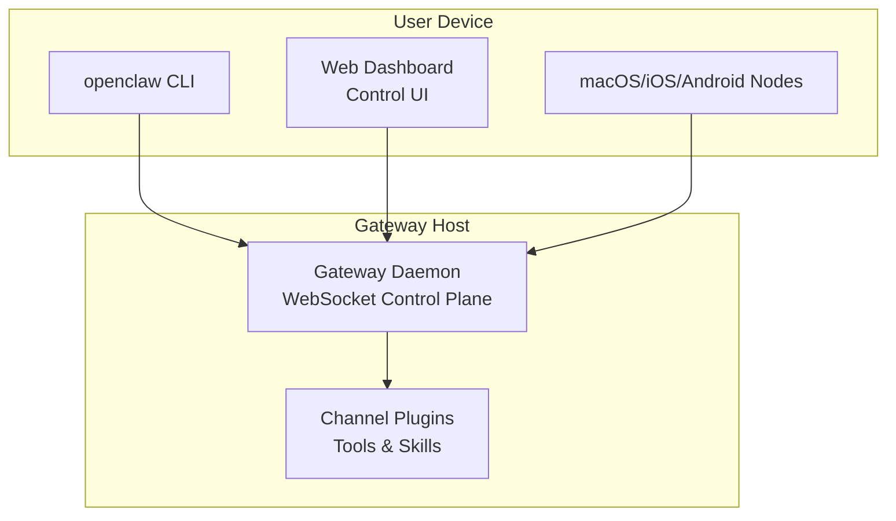
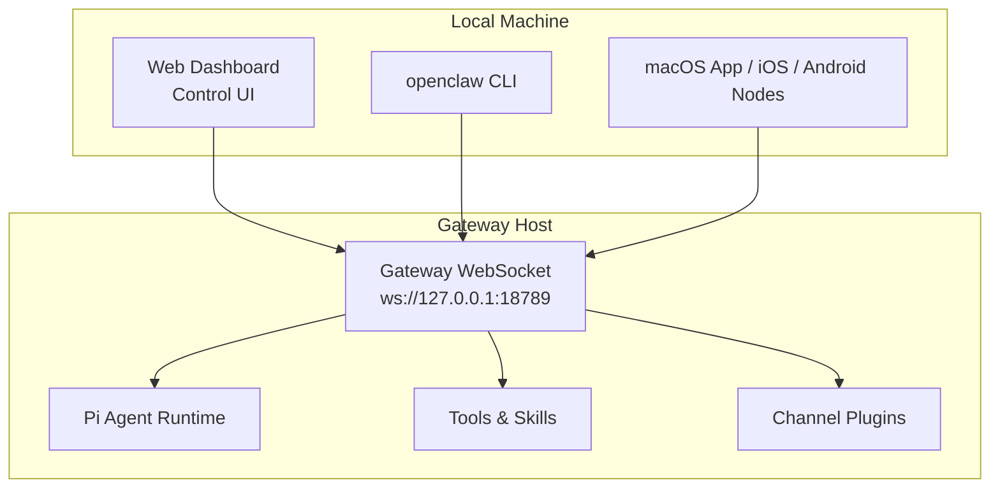
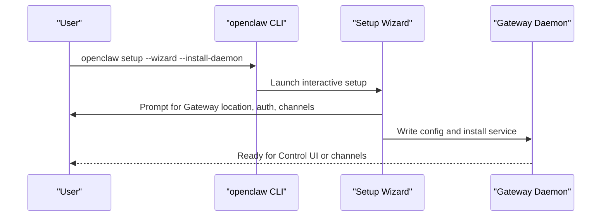
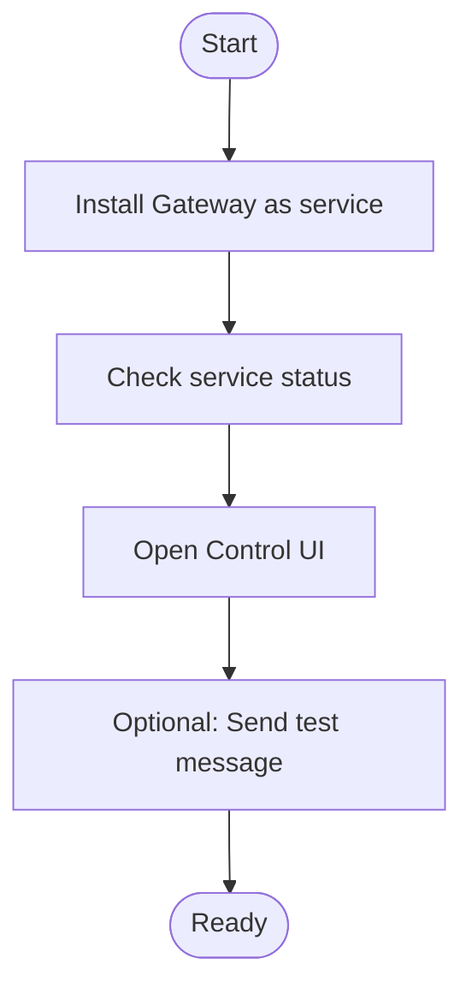
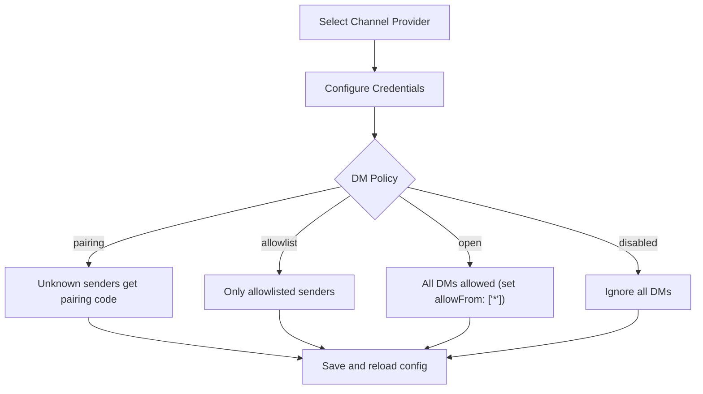
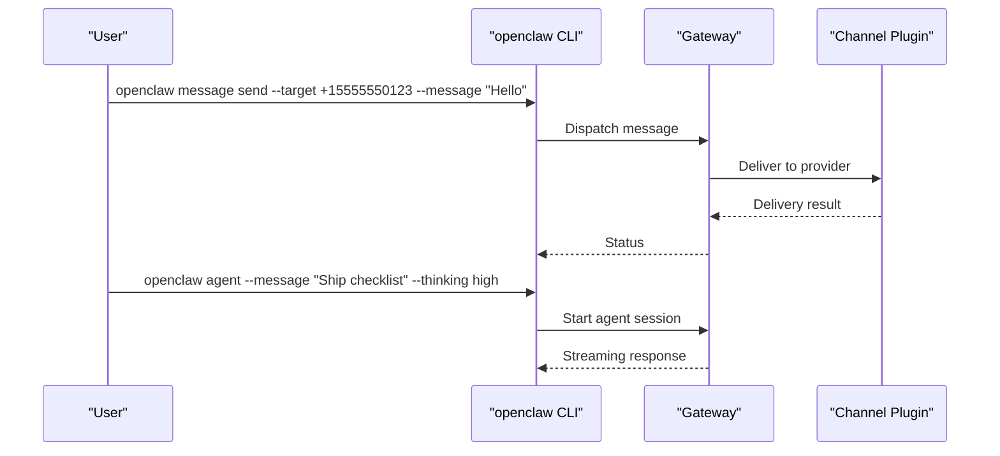
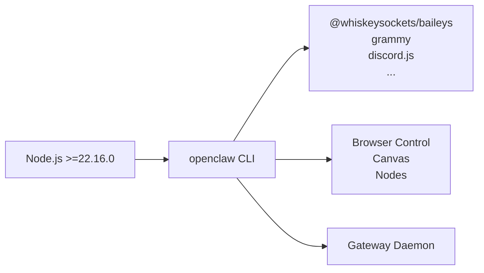

# Getting Started

<cite>
**Referenced Files in This Document**
- [README.md](file://README.md)
- [package.json](file://package.json)
- [docs/start/getting-started.md](file://docs/start/getting-started.md)
- [docs/start/onboarding.md](file://docs/start/onboarding.md)
- [docs/install/index.md](file://docs/install/index.md)
- [docs/cli/onboard.md](file://docs/cli/onboard.md)
- [docs/gateway/configuration.md](file://docs/gateway/configuration.md)
- [docs/platforms/windows.md](file://docs/platforms/windows.md)
- [docs/platforms/macos.md](file://docs/platforms/macos.md)
- [docs/platforms/linux.md](file://docs/platforms/linux.md)
</cite>

## Table of Contents
1. [Introduction](#introduction)
2. [Project Structure](#project-structure)
3. [Core Components](#core-components)
4. [Architecture Overview](#architecture-overview)
5. [Detailed Component Analysis](#detailed-component-analysis)
6. [Dependency Analysis](#dependency-analysis)
7. [Performance Considerations](#performance-considerations)
8. [Troubleshooting Guide](#troubleshooting-guide)
9. [Conclusion](#conclusion)
10. [Appendices](#appendices)

## Introduction
This guide helps new users quickly install OpenClaw, run the onboarding wizard, and begin using the personal AI assistant. You will learn how to install via npm, pnpm, or bun with Node.js ≥22, run the setup wizard, start the Gateway daemon, configure channels, and send your first messages. We also cover practical examples for the agent interface, voice wake features, platform-specific setup notes, and security considerations for a local-first experience.

## Project Structure
OpenClaw is a multi-platform personal AI assistant with a Gateway control plane, CLI, and optional companion apps. The CLI binary is named openclaw and is distributed via npm. The repository includes:
- CLI entry and scripts
- Gateway daemon and runtime
- Channel integrations and plugins
- Documentation for installation, configuration, and onboarding

**Diagram sources**
- [README.md:185-202](file://README.md#L185-L202)
- [docs/start/getting-started.md:14-18](file://docs/start/getting-started.md#L14-L18)

**Section sources**
- [README.md:21-27](file://README.md#L21-L27)
- [README.md:185-202](file://README.md#L185-L202)

## Core Components
- CLI: The openclaw command-line interface provides subcommands for setup, configuration, gateway control, agent interaction, and channel management.
- Gateway: A WebSocket-based control plane that orchestrates sessions, tools, channels, and events.
- Channels: Integrations for WhatsApp, Telegram, Slack, Discord, Google Chat, Signal, iMessage, BlueBubbles, IRC, Microsoft Teams, Matrix, Feishu, LINE, Mattermost, Nextcloud Talk, Nostr, Synology Chat, Tlon, Twitch, Zalo, Zalo Personal, and WebChat.
- Voice Wake and Talk: Voice wake features and talk mode for macOS/iOS and continuous voice on Android.
- Security: Defaults treat DMs as untrusted input and provide pairing and allowlisting policies.

**Section sources**
- [README.md:50-81](file://README.md#L50-L81)
- [README.md:128-135](file://README.md#L128-L135)
- [README.md:112-125](file://README.md#L112-L125)

## Architecture Overview
OpenClaw’s architecture centers around a local Gateway that exposes a WebSocket control plane. Clients (CLI, Web Dashboard, companion apps) connect to the Gateway to orchestrate the agent, tools, and channels. The Gateway runs on the user’s device or a remote host reachable via Tailscale or SSH tunnel.

**Diagram sources**
- [README.md:185-202](file://README.md#L185-L202)
- [docs/start/getting-started.md:14-18](file://docs/start/getting-started.md#L14-L18)

**Section sources**
- [README.md:185-202](file://README.md#L185-L202)

## Detailed Component Analysis

### Installation and Runtime Requirements
- Node.js requirement: Node ≥22 is required. The repository specifies engines >=22.16.0. The installer script can install Node 24 if missing.
- Supported package managers: npm, pnpm, bun.
- Recommended: Use the installer script for a streamlined setup on macOS/Linux/WSL2 or PowerShell on Windows.

Practical steps:
- macOS/Linux/WSL2: curl the installer script and run it.
- Windows: use the PowerShell installer.
- Verify Node version and install via npm/pnpm as needed.

Common issues and fixes:
- PATH not finding the global binary: ensure $(npm prefix -g)/bin is in PATH.
- sharp build errors on macOS: set SHARP_IGNORE_GLOBAL_LIBVIPS=1 or install build tools.

**Section sources**
- [docs/install/index.md:14-22](file://docs/install/index.md#L14-L22)
- [docs/install/index.md:72-114](file://docs/install/index.md#L72-L114)
- [docs/install/index.md:191-214](file://docs/install/index.md#L191-L214)
- [package.json:437-439](file://package.json#L437-L439)

### Onboarding Wizard Workflow
- Legacy alias: openclaw onboard is an alias for openclaw setup --wizard.
- The wizard guides you through:
  - Selecting where the Gateway runs (local or remote)
  - Connecting authentication
  - Configuring channels
  - Bootstrapping the agent
- Benefits for first-time users:
  - Interactive configuration reduces friction
  - Ensures proper defaults for tools.profile and sandboxing
  - Generates tokens and writes credentials securely

**Diagram sources**
- [docs/cli/onboard.md:8-18](file://docs/cli/onboard.md#L8-L18)
- [docs/start/getting-started.md:55-77](file://docs/start/getting-started.md#L55-L77)

**Section sources**
- [docs/cli/onboard.md:8-18](file://docs/cli/onboard.md#L8-L18)
- [docs/start/onboarding.md:17-91](file://docs/start/onboarding.md#L17-L91)
- [docs/start/getting-started.md:55-77](file://docs/start/getting-started.md#L55-L77)

### Gateway Daemon and Initial Configuration
- Install the Gateway as a user service during onboarding.
- Verify the service status and open the Control UI.
- Optional: run the Gateway in the foreground for testing or troubleshooting.

**Diagram sources**
- [docs/start/getting-started.md:64-102](file://docs/start/getting-started.md#L64-L102)

**Section sources**
- [docs/start/getting-started.md:64-102](file://docs/start/getting-started.md#L64-L102)

### Basic Channel Setup
- Use the wizard or configure channels manually in the Control UI or JSON config.
- Common channels include WhatsApp, Telegram, Discord, Slack, Signal, iMessage, BlueBubbles, Google Chat, and others.
- DM policy patterns:
  - pairing: unknown senders get a pairing code
  - allowlist/open: only allowlisted senders or all DMs respectively
  - disabled: ignore all DMs

**Diagram sources**
- [docs/gateway/configuration.md:90-146](file://docs/gateway/configuration.md#L90-L146)

**Section sources**
- [docs/gateway/configuration.md:77-146](file://docs/gateway/configuration.md#L77-L146)

### Practical Examples: Sending Messages and Using the Agent Interface
- Send a test message to a configured channel.
- Use the agent interface to chat with the assistant.
- Access the Control UI for dashboard and configuration.

**Diagram sources**
- [README.md:74-79](file://README.md#L74-L79)
- [docs/start/getting-started.md:94-102](file://docs/start/getting-started.md#L94-L102)

**Section sources**
- [README.md:74-79](file://README.md#L74-L79)
- [docs/start/getting-started.md:94-102](file://docs/start/getting-started.md#L94-L102)

### Voice Wake Features
- Voice wake and talk mode are supported on macOS/iOS and continuous voice on Android.
- These features rely on the Gateway protocol and node capabilities.

**Section sources**
- [README.md:131-132](file://README.md#L131-L132)

### Platform-Specific Setup Notes
- Windows: Use WSL2 for best compatibility.
- macOS: Permissions and security notices are part of the onboarding flow.
- Linux: The Gateway runs well on small instances; remote access via Tailscale or SSH tunnels.

**Section sources**
- [docs/install/index.md:20-22](file://docs/install/index.md#L20-L22)
- [docs/platforms/windows.md](file://docs/platforms/windows.md)
- [docs/platforms/macos.md](file://docs/platforms/macos.md)
- [docs/platforms/linux.md](file://docs/platforms/linux.md)

### Development vs Production Paths
- Development: Build from source using pnpm, link the CLI, and run onboarding.
- Production: Use installer script or package manager installs with the wizard and service installation.

**Section sources**
- [docs/install/index.md:117-149](file://docs/install/index.md#L117-L149)
- [docs/install/index.md:34-70](file://docs/install/index.md#L34-L70)

### Security Considerations
- Treat inbound DMs as untrusted input by default.
- Use pairing or allowlisting to control who can message the bot.
- Run the doctor command to surface risky/misconfigured DM policies.
- Local-first architecture keeps data on your devices; enforce strong model tiers and sandboxing for untrusted content.

**Section sources**
- [README.md:112-125](file://README.md#L112-L125)
- [docs/gateway/configuration.md:67-73](file://docs/gateway/configuration.md#L67-L73)

## Dependency Analysis
OpenClaw’s CLI depends on Node.js ≥22 and integrates with numerous channel providers and tools. The package.json lists dependencies and peer dependencies, including optional local model runtimes.

**Diagram sources**
- [package.json:437-439](file://package.json#L437-L439)
- [package.json:347-404](file://package.json#L347-L404)

**Section sources**
- [package.json:437-439](file://package.json#L437-L439)
- [package.json:347-404](file://package.json#L347-L404)

## Performance Considerations
- Keep the Gateway on the same machine as the UI for low latency.
- Use Tailscale or SSH tunnels for remote access without exposing the Gateway publicly.
- Tune session and media settings to balance responsiveness and resource usage.

[No sources needed since this section provides general guidance]

## Troubleshooting Guide
- openclaw not found: Add $(npm prefix -g)/bin to PATH on macOS/Linux or $(npm prefix -g) on Windows.
- sharp build errors: Set SHARP_IGNORE_GLOBAL_LIBVIPS=1 or install build tools.
- Validation failures: Use doctor to diagnose and fix configuration issues.

**Section sources**
- [docs/install/index.md:191-214](file://docs/install/index.md#L191-L214)
- [docs/install/index.md:82-90](file://docs/install/index.md#L82-L90)
- [docs/gateway/configuration.md:67-73](file://docs/gateway/configuration.md#L67-L73)

## Conclusion
You are now ready to install OpenClaw, run the onboarding wizard, start the Gateway, and begin chatting with the assistant. Use the wizard for guided setup, configure channels with appropriate DM policies, and explore the Control UI and agent interface. For multi-user or shared environments, enable sandboxing and strict tool policies. Enjoy the local-first, secure, and extensible personal AI assistant.

[No sources needed since this section summarizes without analyzing specific files]

## Appendices

### Quick Start Commands
- Install and run wizard:
  - macOS/Linux/WSL2: curl the installer script and run it.
  - Windows: use the PowerShell installer.
- Start the Gateway and open the dashboard:
  - openclaw setup --wizard --install-daemon
  - openclaw gateway status
  - openclaw dashboard
- Send a test message:
  - openclaw message send --target +15555550123 --message "Hello from OpenClaw"
- Chat with the agent:
  - openclaw agent --message "Ship checklist" --thinking high

**Section sources**
- [docs/start/getting-started.md:28-102](file://docs/start/getting-started.md#L28-L102)
- [README.md:74-79](file://README.md#L74-L79)