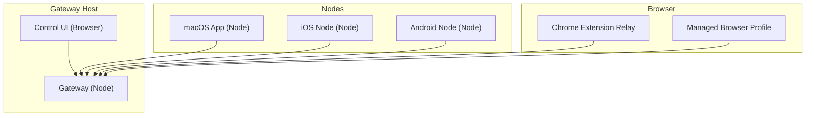
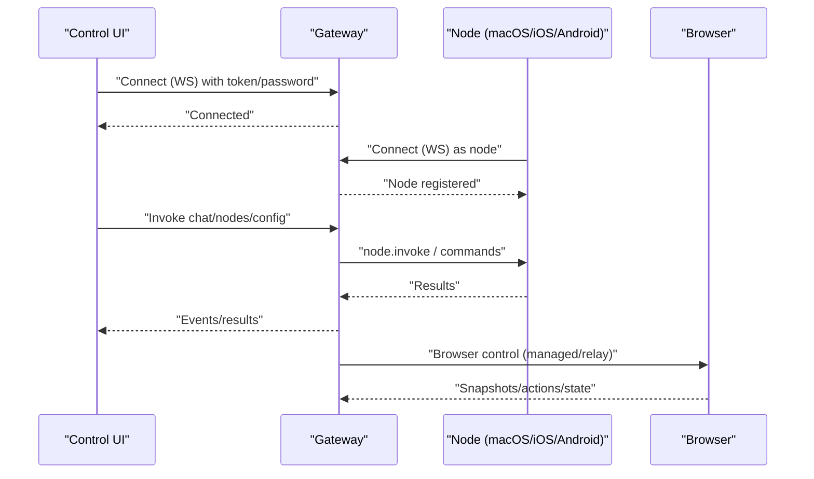
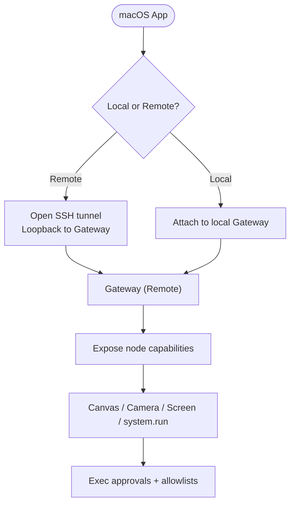
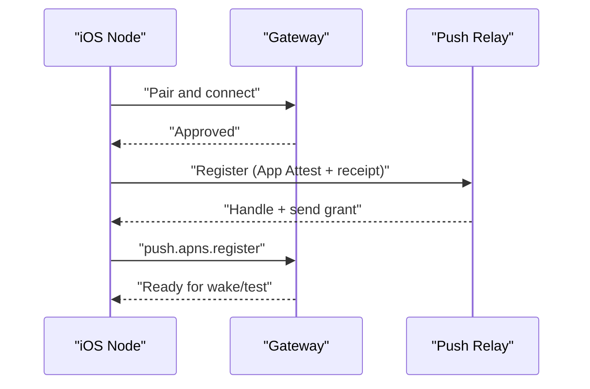
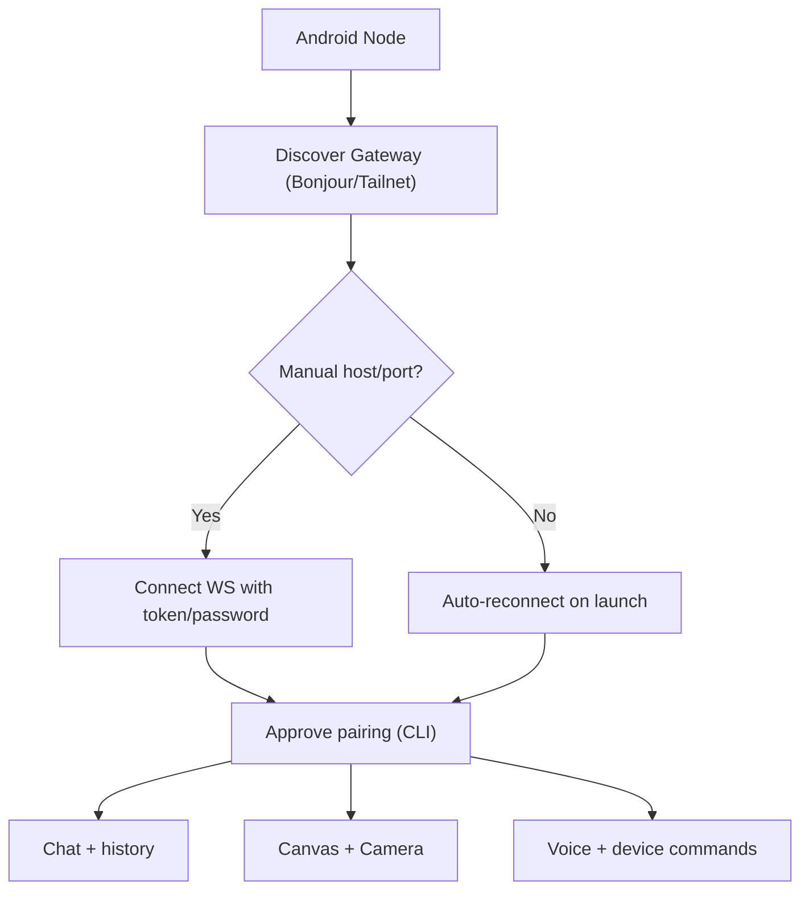
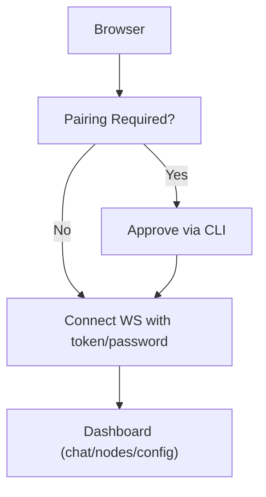
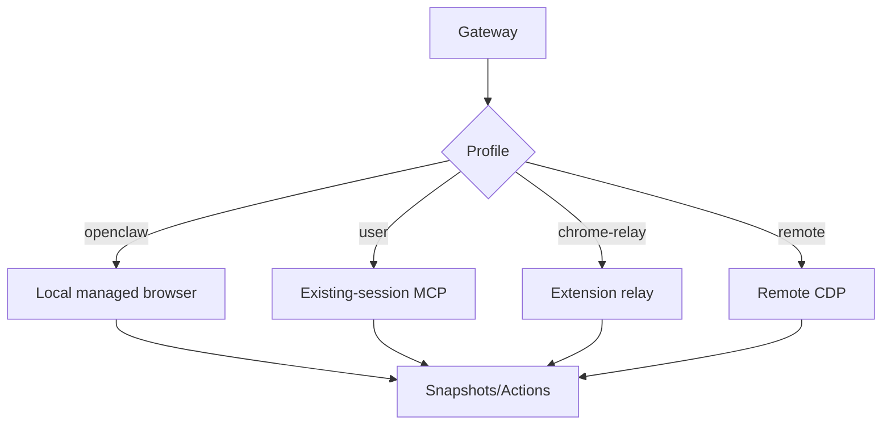
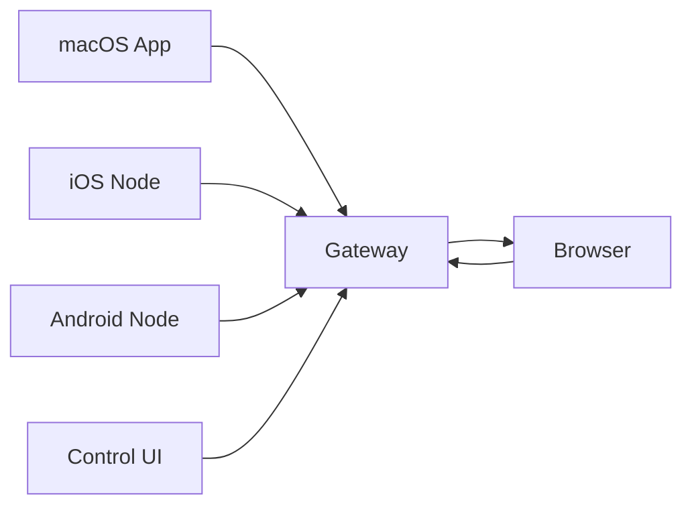

# Platform Support

<cite>
**Referenced Files in This Document**
- [docs/platforms/index.md](file://docs/platforms/index.md)
- [docs/platforms/macos.md](file://docs/platforms/macos.md)
- [docs/platforms/ios.md](file://docs/platforms/ios.md)
- [docs/platforms/android.md](file://docs/platforms/android.md)
- [docs/platforms/windows.md](file://docs/platforms/windows.md)
- [docs/platforms/linux.md](file://docs/platforms/linux.md)
- [docs/platforms/mac/permissions.md](file://docs/platforms/mac/permissions.md)
- [docs/platforms/mac/canvas.md](file://docs/platforms/mac/canvas.md)
- [docs/platforms/mac/remote.md](file://docs/platforms/mac/remote.md)
- [docs/web/control-ui.md](file://docs/web/control-ui.md)
- [assets/chrome-extension/README.md](file://assets/chrome-extension/README.md)
- [docs/tools/browser.md](file://docs/tools/browser.md)
- [docs/install/nix.md](file://docs/install/nix.md)
- [docs/help/troubleshooting.md](file://docs/help/troubleshooting.md)
</cite>

## Table of Contents
1. [Introduction](#introduction)
2. [Project Structure](#project-structure)
3. [Core Components](#core-components)
4. [Architecture Overview](#architecture-overview)
5. [Detailed Component Analysis](#detailed-component-analysis)
6. [Dependency Analysis](#dependency-analysis)
7. [Performance Considerations](#performance-considerations)
8. [Troubleshooting Guide](#troubleshooting-guide)
9. [Conclusion](#conclusion)
10. [Appendices](#appendices)

## Introduction
This document describes OpenClaw’s multi-platform support and capabilities. It covers the macOS menu-bar companion, iOS and Android node apps, the web-based Control UI, browser automation, and platform-specific runtime and installation guidance. It also outlines permissions, security considerations, and troubleshooting steps to help you choose the right platform combination for your needs.

## Project Structure
OpenClaw’s platform support spans:
- macOS companion app (menu bar, permissions, Canvas, Screen Recording, Camera, system.run)
- iOS node app (Canvas, Voice wake, Talk mode, notifications, push relay)
- Android node app (Canvas, Camera, device permissions, voice)
- Web Control UI (browser-based dashboard)
- Browser automation (managed or relayed Chrome/Chromium)
- Gateway service (Node recommended) with systemd/LaunchAgent control
- Windows via WSL2 and Linux with systemd user services
- Nix mode for declarative installs

**Diagram sources**
- [docs/platforms/macos.md:15-33](file://docs/platforms/macos.md#L15-L33)
- [docs/platforms/ios.md:14-18](file://docs/platforms/ios.md#L14-L18)
- [docs/platforms/android.md:10-21](file://docs/platforms/android.md#L10-L21)
- [docs/web/control-ui.md:9-16](file://docs/web/control-ui.md#L9-L16)
- [assets/chrome-extension/README.md:1-3](file://assets/chrome-extension/README.md#L1-L3)
- [docs/tools/browser.md:10-23](file://docs/tools/browser.md#L10-L23)

**Section sources**
- [docs/platforms/index.md:9-16](file://docs/platforms/index.md#L9-L16)
- [docs/platforms/linux.md:9-14](file://docs/platforms/linux.md#L9-L14)
- [docs/platforms/windows.md:9-17](file://docs/platforms/windows.md#L9-L17)

## Core Components
- macOS companion app
  - Menu bar status, TCC prompts, local/remote Gateway control, node capabilities (Canvas, Camera, Screen Recording, system.run), Exec approvals, deep links, SSH tunneling for remote mode.
- iOS node app
  - Connects to Gateway, Canvas, Screen snapshot, Camera capture, Location, Talk mode, Voice wake; supports push relay and official build constraints.
- Android node app
  - Connects to Gateway, Canvas, Camera, voice; device permissions and commands vary by device and permissions.
- Web Control UI
  - Browser dashboard for chat, nodes, config, channels, cron, skills, logs, and updates; supports Tailnet and HTTPS via Tailscale Serve.
- Browser automation
  - Managed profile, existing-session MCP, Chrome extension relay, remote CDP, and hosted providers; supports snapshots, actions, and state manipulation.
- Gateway service
  - Node recommended runtime; systemd (Linux) or LaunchAgent (macOS); Windows via WSL2; Nix mode for declarative installs.

**Section sources**
- [docs/platforms/macos.md:15-65](file://docs/platforms/macos.md#L15-L65)
- [docs/platforms/ios.md:14-27](file://docs/platforms/ios.md#L14-L27)
- [docs/platforms/android.md:10-21](file://docs/platforms/android.md#L10-L21)
- [docs/web/control-ui.md:9-16](file://docs/web/control-ui.md#L9-L16)
- [docs/tools/browser.md:10-33](file://docs/tools/browser.md#L10-L33)
- [docs/platforms/linux.md:32-63](file://docs/platforms/linux.md#L32-L63)
- [docs/platforms/windows.md:63-94](file://docs/platforms/windows.md#L63-L94)
- [docs/install/nix.md:46-81](file://docs/install/nix.md#L46-L81)

## Architecture Overview
The platform architecture centers on the Gateway as the control plane, with nodes (macOS, iOS, Android) and the web UI (Control UI) connecting over WebSocket. Browser automation can run locally or remotely via node host proxying or remote CDP endpoints. macOS supports SSH tunneling for remote Gateway control.

**Diagram sources**
- [docs/web/control-ui.md:26-31](file://docs/web/control-ui.md#L26-L31)
- [docs/platforms/macos.md:66-73](file://docs/platforms/macos.md#L66-L73)
- [docs/tools/browser.md:519-531](file://docs/tools/browser.md#L519-L531)

**Section sources**
- [docs/web/control-ui.md:118-141](file://docs/web/control-ui.md#L118-L141)
- [docs/platforms/macos.md:200-220](file://docs/platforms/macos.md#L200-L220)

## Detailed Component Analysis

### macOS Companion App
- Capabilities
  - Menu bar notifications, TCC ownership, Gateway attach/connect, macOS-only tools (Canvas, Camera, Screen Recording, system.run), optional PeekabooBridge, CLI install.
  - Local vs remote mode; remote mode uses SSH tunnel or direct WS/WSS; node host service runs remotely in remote mode.
- Node capabilities
  - Canvas, Camera, Screen Recording, system.run; permissions map reported to agents; system.run controlled by Exec approvals with allowlists and environment filtering.
- Deep links
  - openclaw://agent for triggering agent requests with optional unattended mode key.
- Remote connection plumbing
  - SSH tunnel for control-plane; loopback IP seen by Gateway; optional direct transport for real client IP.
- Permissions
  - TCC stability depends on path, bundle ID, and consistent signing; recovery steps and tccutil resets provided.

**Diagram sources**
- [docs/platforms/macos.md:26-33](file://docs/platforms/macos.md#L26-L33)
- [docs/platforms/macos.md:50-65](file://docs/platforms/macos.md#L50-L65)
- [docs/platforms/macos.md:200-220](file://docs/platforms/macos.md#L200-L220)

**Section sources**
- [docs/platforms/macos.md:15-65](file://docs/platforms/macos.md#L15-L65)
- [docs/platforms/macos.md:112-138](file://docs/platforms/macos.md#L112-L138)
- [docs/platforms/macos.md:200-220](file://docs/platforms/macos.md#L200-L220)
- [docs/platforms/mac/permissions.md:10-25](file://docs/platforms/mac/permissions.md#L10-L25)
- [docs/platforms/mac/canvas.md:10-42](file://docs/platforms/mac/canvas.md#L10-L42)

### iOS Node App
- Connectivity
  - Bonjour LAN, Tailnet unicast DNS-SD, or manual host/port; supports push relay for official builds and direct APNs for local builds.
- Canvas and A2UI
  - WKWebView canvas; Gateway advertises canvas host URL; navigate, eval, snapshot; A2UI push/reset.
- Voice wake and talk mode
  - Available in Settings; best-effort when app is not active.
- Common errors
  - NODE_BACKGROUND_UNAVAILABLE, A2UI_HOST_NOT_CONFIGURED, pairing prompt issues, re-install re-pairing.

**Diagram sources**
- [docs/platforms/ios.md:52-94](file://docs/platforms/ios.md#L52-L94)
- [docs/platforms/ios.md:100-158](file://docs/platforms/ios.md#L100-L158)

**Section sources**
- [docs/platforms/ios.md:14-51](file://docs/platforms/ios.md#L14-L51)
- [docs/platforms/ios.md:175-209](file://docs/platforms/ios.md#L175-L209)
- [docs/platforms/ios.md:205-211](file://docs/platforms/ios.md#L205-L211)

### Android Node App
- Connectivity
  - mDNS/NSD LAN, Tailnet Wide-Area Bonjour, or manual host/port; foreground service for persistent connection; auto-reconnect after pairing.
- Canvas and Camera
  - Gateway Canvas host; navigate to hosted HTML; A2UI; camera snap/clip (foreground and permission-gated).
- Voice and commands
  - Voice on/off flow with transcript capture and TTS; additional device commands depend on device and permissions.

**Diagram sources**
- [docs/platforms/android.md:26-88](file://docs/platforms/android.md#L26-L88)
- [docs/platforms/android.md:123-155](file://docs/platforms/android.md#L123-L155)

**Section sources**
- [docs/platforms/android.md:26-114](file://docs/platforms/android.md#L26-L114)
- [docs/platforms/android.md:123-168](file://docs/platforms/android.md#L123-L168)

### Web Control UI
- Access
  - Default http://<host>:18789/ or optional basePath; authenticates via token/password in WS connect params.
- Pairing
  - First connection requires device pairing approval; local connections auto-approved; Tailnet requires explicit approval.
- Capabilities
  - Chat, channels, instances, sessions, cron, skills, nodes, exec approvals, config, status/health/logs, updates.
- Tailnet access
  - Tailscale Serve preferred; HTTPS magic DNS; tokenless Serve requires trusted gateway host; insecure HTTP blocks WebCrypto.

**Diagram sources**
- [docs/web/control-ui.md:33-62](file://docs/web/control-ui.md#L33-L62)
- [docs/web/control-ui.md:118-153](file://docs/web/control-ui.md#L118-L153)

**Section sources**
- [docs/web/control-ui.md:9-31](file://docs/web/control-ui.md#L9-L31)
- [docs/web/control-ui.md:154-200](file://docs/web/control-ui.md#L154-L200)

### Browser Automation
- Profiles
  - openclaw (managed), user (existing-session MCP), chrome-relay (extension), remote CDP.
- Local vs remote
  - Local control via loopback; remote via node host proxy or remote CDP; hosted providers (Browserless, Browserbase).
- Security
  - Loopback-only by default; treat remote CDP tokens as secrets; strict SSRF policy; Playwright requirement for advanced actions.

**Diagram sources**
- [docs/tools/browser.md:47-63](file://docs/tools/browser.md#L47-L63)
- [docs/tools/browser.md:163-178](file://docs/tools/browser.md#L163-L178)

**Section sources**
- [docs/tools/browser.md:46-127](file://docs/tools/browser.md#L46-L127)
- [docs/tools/browser.md:303-360](file://docs/tools/browser.md#L303-L360)
- [assets/chrome-extension/README.md:1-24](file://assets/chrome-extension/README.md#L1-L24)

### Gateway Service and Runtime
- Linux
  - systemd user service by default; optional system service for shared servers; minimal unit example included.
- macOS
  - LaunchAgent service; local vs remote mode; SSH tunnel for remote control.
- Windows
  - Recommended via WSL2; native Windows CLI improves but WSL2 remains recommended; Scheduled Tasks fallback; auto-start via linger and WSL boot task.
- Nix mode
  - Deterministic installs; disables auto-install flows; sets OPENCLAW_NIX_MODE; config/state paths via environment.

**Section sources**
- [docs/platforms/linux.md:65-95](file://docs/platforms/linux.md#L65-L95)
- [docs/platforms/macos.md:35-48](file://docs/platforms/macos.md#L35-L48)
- [docs/platforms/windows.md:68-94](file://docs/platforms/windows.md#L68-L94)
- [docs/platforms/windows.md:96-139](file://docs/platforms/windows.md#L96-L139)
- [docs/install/nix.md:46-81](file://docs/install/nix.md#L46-L81)

## Dependency Analysis
- Platform dependencies
  - macOS: TCC, LaunchAgent, SSH for remote mode, optional signing for stable permissions.
  - iOS: Bonjour/Tailnet discovery, push relay for official builds, APNs credentials for local builds.
  - Android: mDNS/NSD, Tailnet DNS-SD, foreground service, device permissions.
  - Web UI: WebSocket handshake with token/password; Tailnet Serve for HTTPS.
  - Browser: Managed profile or relay; Playwright for advanced actions; remote CDP endpoints.
- Coupling and cohesion
  - Nodes depend on Gateway discovery and pairing; remote mode increases coupling to SSH/Tailscale.
  - Browser automation is cohesive around CDP and optional Playwright; profiles isolate environments.

**Diagram sources**
- [docs/platforms/macos.md:26-33](file://docs/platforms/macos.md#L26-L33)
- [docs/platforms/ios.md:20-27](file://docs/platforms/ios.md#L20-L27)
- [docs/platforms/android.md:26-39](file://docs/platforms/android.md#L26-L39)
- [docs/web/control-ui.md:11-16](file://docs/web/control-ui.md#L11-L16)
- [docs/tools/browser.md:10-14](file://docs/tools/browser.md#L10-L14)

**Section sources**
- [docs/platforms/macos.md:26-33](file://docs/platforms/macos.md#L26-L33)
- [docs/platforms/ios.md:160-174](file://docs/platforms/ios.md#L160-L174)
- [docs/platforms/android.md:66-74](file://docs/platforms/android.md#L66-L74)
- [docs/web/control-ui.md:118-153](file://docs/web/control-ui.md#L118-L153)
- [docs/tools/browser.md:163-178](file://docs/tools/browser.md#L163-L178)

## Performance Considerations
- Use Tailnet with Tailscale Serve for secure, low-latency remote access to the Control UI and Gateway.
- Prefer local managed browser profiles for deterministic performance; extension relay and remote CDP introduce network latency.
- Optimize Canvas and A2UI by serving from Gateway HTTP to reduce cross-device overhead.
- Keep Gateway and nodes on the same network or reliable Tailnet to minimize discovery and reconnection delays.

## Troubleshooting Guide
- First 60 seconds triage
  - Run status, gateway probe/status, doctor, channels probe, and logs to diagnose connectivity and auth issues.
- Common symptoms
  - No replies: check channel connectivity and pairing.
  - Dashboard/UI not connecting: device identity and token/password mismatches.
  - Gateway not running: service status and port conflicts.
  - Channel messages not flowing: mention gating, allowlist, or token issues.
  - Cron/heartbeat not firing: scheduler disabled or quiet hours.
  - Node tools fail: foreground requirement, missing permissions, exec approvals.
  - Browser tool fails: CDP launch, extension attach, attach-only profile constraints.
- Platform-specific tips
  - macOS: TCC resets, SSH tunnel stability, remote transport choice.
  - iOS: push relay configuration, APNs credentials for local builds, pairing prompt.
  - Android: discovery via Tailnet DNS-SD, foreground service, device permissions.
  - Web UI: HTTPS for WebCrypto, Tailnet Serve, device identity requirements.
  - Browser: Playwright availability, remote CDP tokens, strict SSRF policy.

**Section sources**
- [docs/help/troubleshooting.md:13-36](file://docs/help/troubleshooting.md#L13-L36)
- [docs/help/troubleshooting.md:68-88](file://docs/help/troubleshooting.md#L68-L88)
- [docs/help/troubleshooting.md:239-266](file://docs/help/troubleshooting.md#L239-L266)
- [docs/help/troubleshooting.md:269-296](file://docs/help/troubleshooting.md#L269-L296)

## Conclusion
OpenClaw offers a robust multi-platform ecosystem: a macOS menu-bar companion, iOS and Android nodes, a web Control UI, and flexible browser automation. Choose the platform combination that aligns with your environment and security posture—use WSL2 on Windows, systemd on Linux, and leverage Tailnet for secure remote access. Apply the troubleshooting steps and security guidance to maintain reliability and safety across platforms.

## Appendices

### Platform Requirements and Installation Quick Reference
- macOS
  - LaunchAgent service; TCC permissions; SSH tunnel for remote mode; CLI install via npm/pnpm.
- iOS
  - Bonjour/Tailnet discovery; push relay for official builds; APNs credentials for local builds.
- Android
  - mDNS/NSD or Tailnet DNS-SD; foreground service; device permissions; voice and camera commands.
- Web UI
  - Token/password auth; Tailnet Serve recommended; HTTPS for WebCrypto.
- Browser
  - Managed profile or relay; Playwright for advanced actions; remote CDP endpoints.
- Linux
  - systemd user service; optional system service; Node recommended runtime.
- Windows
  - WSL2 recommended; native Windows CLI; Scheduled Tasks fallback; auto-start via linger and WSL boot task.
- Nix
  - OPENCLAW_NIX_MODE; deterministic installs; config/state paths via environment.

**Section sources**
- [docs/platforms/macos.md:35-48](file://docs/platforms/macos.md#L35-L48)
- [docs/platforms/ios.md:52-94](file://docs/platforms/ios.md#L52-L94)
- [docs/platforms/android.md:66-88](file://docs/platforms/android.md#L66-L88)
- [docs/web/control-ui.md:118-153](file://docs/web/control-ui.md#L118-L153)
- [docs/tools/browser.md:163-178](file://docs/tools/browser.md#L163-L178)
- [docs/platforms/linux.md:65-95](file://docs/platforms/linux.md#L65-L95)
- [docs/platforms/windows.md:68-94](file://docs/platforms/windows.md#L68-L94)
- [docs/install/nix.md:46-81](file://docs/install/nix.md#L46-L81)