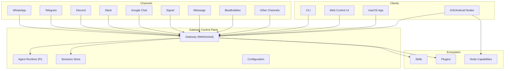
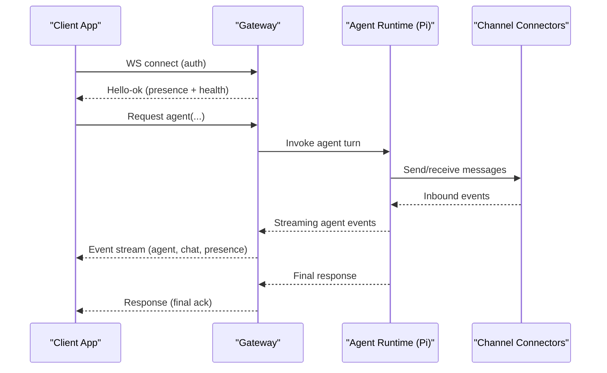
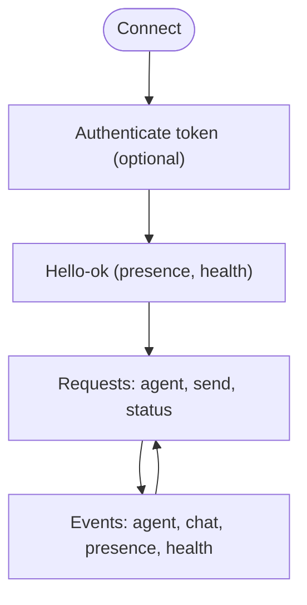
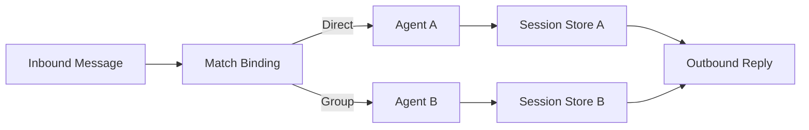
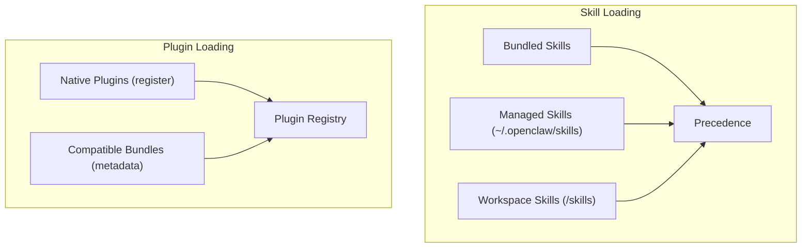
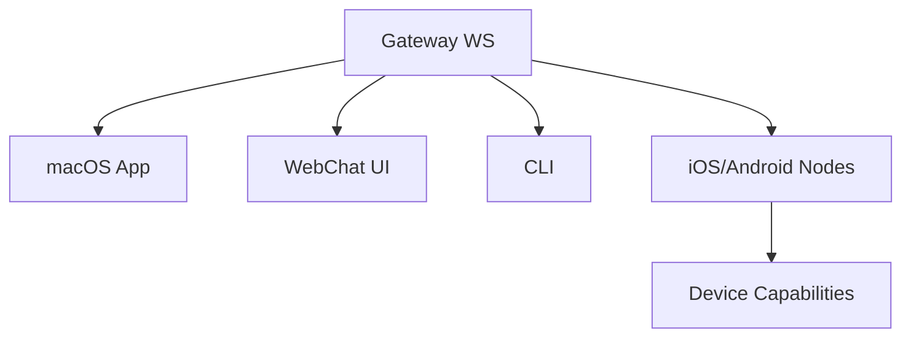
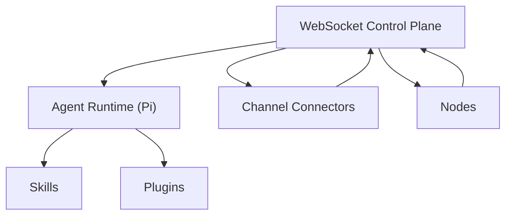

# Project Overview

<cite>
**Referenced Files in This Document**
- [README.md](file://README.md)
- [VISION.md](file://VISION.md)
- [docs/index.md](file://docs/index.md)
- [docs/start/openclaw.md](file://docs/start/openclaw.md)
- [docs/concepts/architecture.md](file://docs/concepts/architecture.md)
- [docs/concepts/agent.md](file://docs/concepts/agent.md)
- [docs/concepts/session.md](file://docs/concepts/session.md)
- [docs/tools/skills.md](file://docs/tools/skills.md)
- [docs/tools/plugin.md](file://docs/tools/plugin.md)
- [docs/concepts/multi-agent.md](file://docs/concepts/multi-agent.md)
</cite>

## Table of Contents
1. [Introduction](#introduction)
2. [Project Structure](#project-structure)
3. [Core Components](#core-components)
4. [Architecture Overview](#architecture-overview)
5. [Detailed Component Analysis](#detailed-component-analysis)
6. [Dependency Analysis](#dependency-analysis)
7. [Performance Considerations](#performance-considerations)
8. [Troubleshooting Guide](#troubleshooting-guide)
9. [Conclusion](#conclusion)
10. [Appendices](#appendices)

## Introduction
OpenClaw is a personal AI assistant platform that runs on your devices and acts as a multi-channel gateway connecting users across dozens of messaging platforms. It provides a local-first control plane (the Gateway), an agent runtime, and a comprehensive ecosystem of skills and plugins. Users can operate a single always-on assistant that respects privacy and security, while leveraging a robust WebSocket-based control plane, multi-agent routing, and cross-platform applications.

Key value propositions:
- Local-first design: runs on your hardware, your rules
- Multi-channel connectivity: one Gateway serves many platforms simultaneously
- Multi-agent support: isolated agents, sessions, and workspaces
- Comprehensive platform coverage: WhatsApp, Telegram, Discord, Google Chat, Signal, iMessage, BlueBubbles, IRC, Microsoft Teams, Matrix, Feishu, LINE, Mattermost, Nextcloud Talk, Nostr, Synology Chat, Tlon, Twitch, Zalo, Zalo Personal, WebChat, and more
- Rich ecosystem: skills, plugins, nodes, and companion apps

## Project Structure
OpenClaw is organized around a central Gateway that manages sessions, channels, tools, and events. The platform includes:
- A WebSocket-based control plane for clients, tools, and events
- An agent runtime (Pi) with workspace and session management
- A skills and plugins system for extensibility
- Cross-platform applications (macOS app, iOS/Android nodes)
- A web dashboard and WebChat interface

**Diagram sources**
- [docs/concepts/architecture.md:12-26](file://docs/concepts/architecture.md#L12-L26)
- [docs/index.md:59-70](file://docs/index.md#L59-L70)

**Section sources**
- [README.md:21-26](file://README.md#L21-L26)
- [docs/index.md:44-71](file://docs/index.md#L44-L71)

## Core Components
- Gateway: single control plane for sessions, routing, channels, tools, and events. Operates a WebSocket server and serves the Canvas host and Web surfaces.
- Agents: embedded Pi runtime with workspace, session management, and tool wiring. Each agent has its own workspace, state directory, and session store.
- Sessions: persistent chat transcripts and routing state, with configurable scopes and maintenance policies.
- Skills: AgentSkills-compatible skill folders teaching the agent how to use tools; loaded from bundled, managed, and workspace locations.
- Plugins: native and compatible extension packages that register tools, channels, provider flows, and services into the Gateway registry.
- Channels: connectors for messaging platforms (WhatsApp, Telegram, Discord, Slack, Google Chat, Signal, iMessage, BlueBubbles, and many others).
- Nodes: companion apps and device capabilities (Canvas, camera, screen recording, voice, location) that connect over WebSocket and expose device commands.

Practical examples:
- Multi-channel messaging: route incoming messages to different agents or personas via bindings; manage DMs and group chats with mention gating and allowlists.
- Voice wake and talk mode: wake word detection and continuous voice on macOS/iOS and Android via nodes.
- Live Canvas: agent-driven visual workspace rendered via the Gateway’s Canvas host and A2UI.
- Companion apps: macOS menu bar app, iOS/Android nodes for device-local actions.

**Section sources**
- [docs/concepts/architecture.md:12-26](file://docs/concepts/architecture.md#L12-L26)
- [docs/concepts/agent.md:10-36](file://docs/concepts/agent.md#L10-L36)
- [docs/concepts/session.md:57-73](file://docs/concepts/session.md#L57-L73)
- [docs/tools/skills.md:9-27](file://docs/tools/skills.md#L9-L27)
- [docs/tools/plugin.md:60-87](file://docs/tools/plugin.md#L60-L87)
- [README.md:126-136](file://README.md#L126-L136)

## Architecture Overview
The Gateway is the single source of truth for sessions, routing, and channel connections. Clients (CLI, Web UI, macOS app, nodes) connect over WebSocket to the Gateway, which validates frames, emits events, and orchestrates agent runs. Nodes connect with explicit device identity and capabilities, enabling device-local actions.

**Diagram sources**
- [docs/concepts/architecture.md:59-78](file://docs/concepts/architecture.md#L59-L78)

**Section sources**
- [docs/concepts/architecture.md:12-26](file://docs/concepts/architecture.md#L12-L26)
- [docs/concepts/architecture.md:80-92](file://docs/concepts/architecture.md#L80-L92)

## Detailed Component Analysis

### Gateway WebSocket Control Plane
- Transport: WebSocket with JSON payloads; first frame must be connect; auth token required when configured.
- Protocol: typed requests/responses and server-push events; idempotent methods require dedupe keys.
- Security: device-based pairing, challenge signing, and local trust; remote access via Tailscale or SSH tunnel.
- Operations: health, supervision via launchd/systemd, and remote exposure patterns.

**Diagram sources**
- [docs/concepts/architecture.md:80-92](file://docs/concepts/architecture.md#L80-L92)

**Section sources**
- [docs/concepts/architecture.md:80-140](file://docs/concepts/architecture.md#L80-L140)

### Multi-Agent Routing and Sessions
- Agents are fully scoped with workspace, state directory, and session store.
- Bindings route inbound messages deterministically by channel, account, peer, and roles.
- Sessions are owned by the Gateway; transcripts and metadata stored per agent; maintenance policies keep stores bounded.
- DM isolation modes and identity linking enable secure multi-user setups.

**Diagram sources**
- [docs/concepts/multi-agent.md:172-186](file://docs/concepts/multi-agent.md#L172-L186)
- [docs/concepts/session.md:189-206](file://docs/concepts/session.md#L189-L206)

**Section sources**
- [docs/concepts/multi-agent.md:10-39](file://docs/concepts/multi-agent.md#L10-L39)
- [docs/concepts/multi-agent.md:172-215](file://docs/concepts/multi-agent.md#L172-L215)
- [docs/concepts/session.md:57-73](file://docs/concepts/session.md#L57-L73)
- [docs/concepts/session.md:177-188](file://docs/concepts/session.md#L177-L188)

### Skills and Plugin Ecosystem
- Skills: AgentSkills-compatible folders with YAML frontmatter; loaded from bundled, managed, and workspace locations with precedence rules.
- Plugins: native OpenClaw plugins (TypeScript) and compatible bundles; register tools, channels, provider flows, HTTP routes, CLI commands, and services.
- Provider runtime hooks: catalog, model resolution, stream wrapping, usage snapshots, and more, enabling provider-specific behavior without custom transports.

**Diagram sources**
- [docs/tools/skills.md:13-27](file://docs/tools/skills.md#L13-L27)
- [docs/tools/plugin.md:60-87](file://docs/tools/plugin.md#L60-L87)

**Section sources**
- [docs/tools/skills.md:9-27](file://docs/tools/skills.md#L9-L27)
- [docs/tools/skills.md:106-137](file://docs/tools/skills.md#L106-L137)
- [docs/tools/plugin.md:60-87](file://docs/tools/plugin.md#L60-L87)
- [docs/tools/plugin.md:129-148](file://docs/tools/plugin.md#L129-L148)

### Cross-Platform Applications and Nodes
- Companion apps: macOS menu bar app, iOS/Android nodes for Canvas, camera, screen recording, voice, and device commands.
- Nodes connect over WebSocket with role=node and capabilities; device pairing and approval govern access.
- Remote access: SSH tunnel or Tailscale; optional TLS pinning for remote WebSocket.

**Diagram sources**
- [docs/concepts/architecture.md:12-26](file://docs/concepts/architecture.md#L12-L26)
- [docs/concepts/architecture.md:117-128](file://docs/concepts/architecture.md#L117-L128)

**Section sources**
- [docs/concepts/architecture.md:12-26](file://docs/concepts/architecture.md#L12-L26)
- [docs/concepts/architecture.md:117-128](file://docs/concepts/architecture.md#L117-L128)

### Conceptual Overview
Beginner-friendly explanation:
- OpenClaw is a personal AI assistant you run on your own devices.
- It connects to your favorite messaging apps (WhatsApp, Telegram, Discord, iMessage, and many more) and speaks back to you through an always-available AI agent.
- You can keep your data private and control what the assistant can access.
- It supports multi-agent routing so you can have different personas or separate assistants for different tasks.
- It includes a web dashboard, companion apps, and device nodes for advanced workflows.

Developer-focused technical highlights:
- The Gateway is a WebSocket control plane that owns sessions, routing, and channel connections.
- The agent runtime is Pi (embedded), with workspace, bootstrap files, and session management.
- Skills and plugins extend capabilities; plugins can register tools, channels, provider flows, and HTTP routes.
- Nodes connect over WebSocket with device identity and capabilities; pairing and approval govern access.
- Security is a first-class concern with defaults, allowlists, and sandboxing options.

**Section sources**
- [docs/index.md:44-56](file://docs/index.md#L44-L56)
- [docs/concepts/architecture.md:12-26](file://docs/concepts/architecture.md#L12-L26)
- [docs/concepts/agent.md:10-36](file://docs/concepts/agent.md#L10-L36)
- [docs/tools/skills.md:9-27](file://docs/tools/skills.md#L9-L27)
- [docs/tools/plugin.md:60-87](file://docs/tools/plugin.md#L60-L87)

## Dependency Analysis
OpenClaw’s runtime depends on:
- WebSocket control plane for client communication and event streaming
- Agent runtime (Pi) for orchestration and tool execution
- Skills and plugins for extended capabilities
- Channel connectors for platform-specific integrations
- Nodes for device-local actions and capabilities

**Diagram sources**
- [docs/concepts/architecture.md:12-26](file://docs/concepts/architecture.md#L12-L26)
- [docs/tools/plugin.md:60-87](file://docs/tools/plugin.md#L60-L87)
- [docs/tools/skills.md:9-27](file://docs/tools/skills.md#L9-L27)

**Section sources**
- [docs/concepts/architecture.md:12-26](file://docs/concepts/architecture.md#L12-L26)
- [docs/tools/plugin.md:60-87](file://docs/tools/plugin.md#L60-L87)
- [docs/tools/skills.md:9-27](file://docs/tools/skills.md#L9-L27)

## Performance Considerations
- Session maintenance: tune pruneAfter, maxEntries, rotateBytes, and disk budgets to keep stores bounded and responsive.
- Streaming and chunking: adjust block streaming and coalescing to balance responsiveness and bandwidth.
- Sandbox overhead: per-agent sandboxing improves security but adds containerization costs; use judiciously.
- Provider runtime hooks: leverage catalog and stream wrapping to minimize redundant logic in core.

[No sources needed since this section provides general guidance]

## Troubleshooting Guide
- Gateway health and status: use health snapshots and status commands to diagnose connectivity and configuration.
- Security audits: verify DM policies, allowlists, and pairing approvals; use security audit commands to detect risky configurations.
- Remote access: ensure proper Tailscale or SSH tunnel setup; verify auth token and TLS pinning when applicable.
- Channel-specific issues: consult channel guides for platform-specific setup and troubleshooting.

**Section sources**
- [docs/start/openclaw.md:195-205](file://docs/start/openclaw.md#L195-L205)
- [docs/concepts/architecture.md:117-128](file://docs/concepts/architecture.md#L117-L128)

## Conclusion
OpenClaw delivers a local-first, multi-agent, multi-channel AI assistant platform centered on a robust WebSocket control plane. Its agent runtime, skills, plugins, and nodes enable powerful, secure, and extensible personal assistance across devices and platforms. Whether you want a simple always-on assistant or a sophisticated multi-agent system with advanced workflows, OpenClaw provides the foundation to build and operate it yourself.

[No sources needed since this section summarizes without analyzing specific files]

## Appendices
- Practical examples:
  - Multi-channel messaging: route different channels or peers to distinct agents via bindings; manage group mentions and allowlists.
  - Voice wake and talk mode: enable wake word detection and continuous voice on supported platforms via nodes.
  - Live Canvas: render and control an agent-driven visual workspace through the Canvas host and A2UI.
  - Companion apps: use the macOS app, iOS/Android nodes, and WebChat for a seamless experience.

**Section sources**
- [docs/concepts/multi-agent.md:172-215](file://docs/concepts/multi-agent.md#L172-L215)
- [docs/concepts/architecture.md:12-26](file://docs/concepts/architecture.md#L12-L26)
- [README.md:126-136](file://README.md#L126-L136)