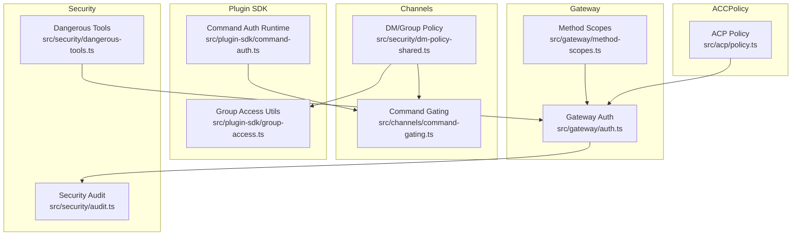
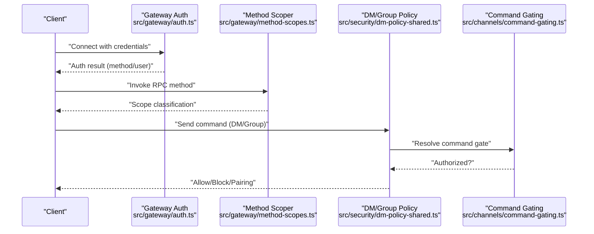
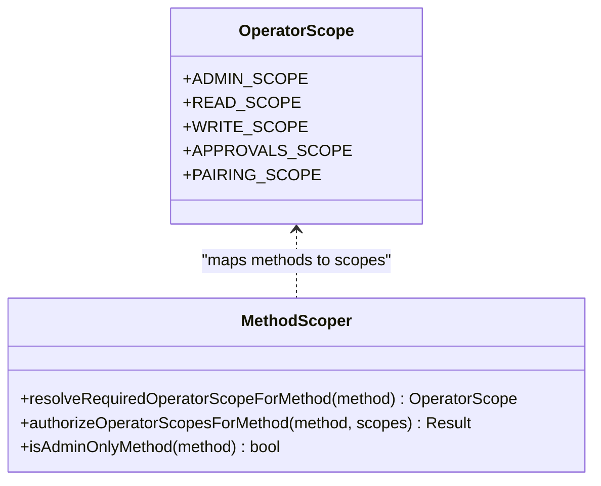
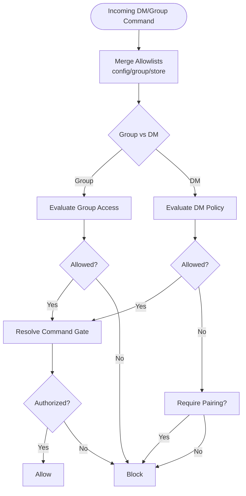
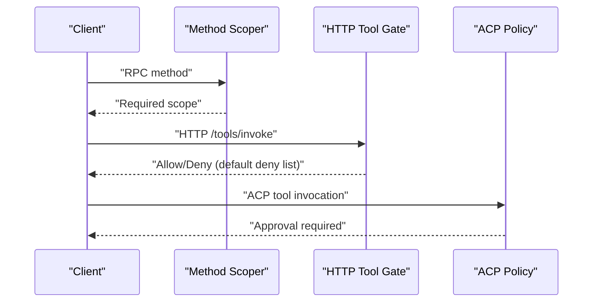
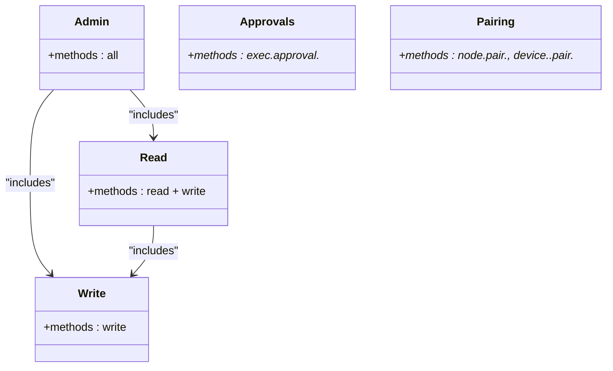
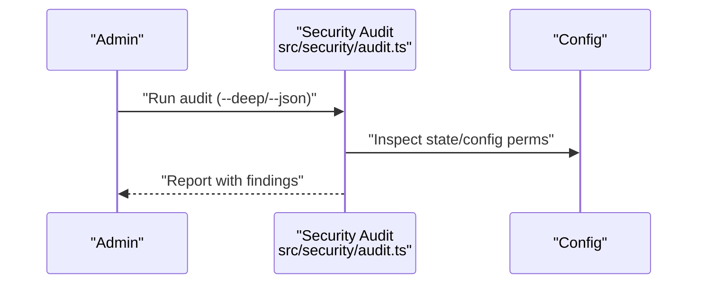
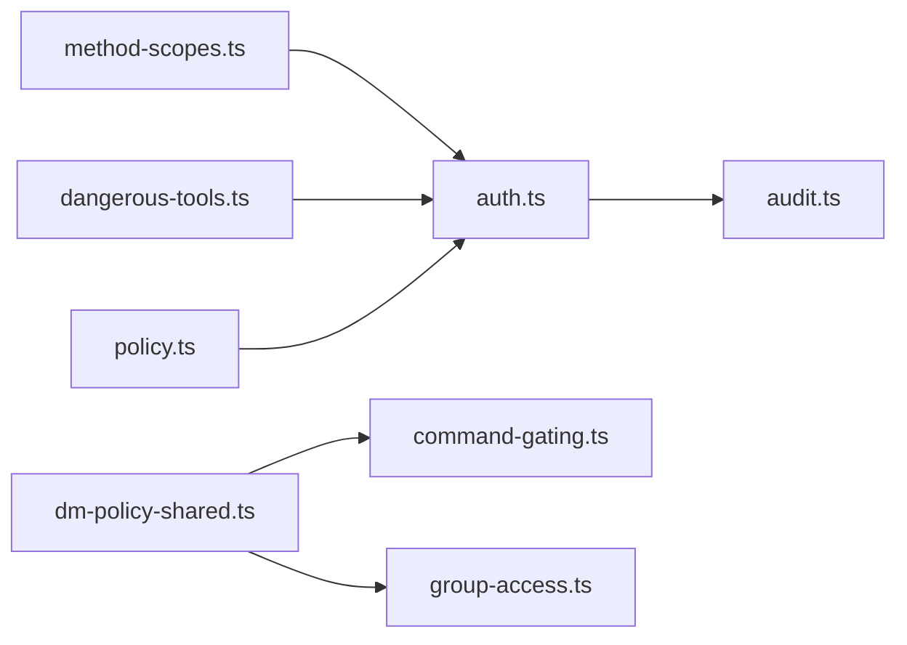

# Access Control & Permissions

<cite>
**Referenced Files in This Document**
- [method-scopes.ts](file://src/gateway/method-scopes.ts)
- [auth.ts](file://src/gateway/auth.ts)
- [command-gating.ts](file://src/channels/command-gating.ts)
- [dm-policy-shared.ts](file://src/security/dm-policy-shared.ts)
- [group-access.ts](file://src/plugin-sdk/group-access.ts)
- [command-auth.ts](file://src/plugin-sdk/command-auth.ts)
- [dangerous-tools.ts](file://src/security/dangerous-tools.ts)
- [audit.ts](file://src/security/audit.ts)
- [operator-scope-compat.ts](file://src/shared/operator-scope-compat.ts)
- [GatewayScopes.swift](file://apps/macos/Sources/OpenClawMacCLI/GatewayScopes.swift)
- [policy.ts](file://src/acp/policy.ts)
- [security.md](file://SECURITY.md)
- [security.md (CLI docs)](file://docs/cli/security.md)
</cite>

## Table of Contents
1. [Introduction](#introduction)
2. [Project Structure](#project-structure)
3. [Core Components](#core-components)
4. [Architecture Overview](#architecture-overview)
5. [Detailed Component Analysis](#detailed-component-analysis)
6. [Dependency Analysis](#dependency-analysis)
7. [Performance Considerations](#performance-considerations)
8. [Troubleshooting Guide](#troubleshooting-guide)
9. [Conclusion](#conclusion)
10. [Appendices](#appendices)

## Introduction
This document explains OpenClaw’s access control and permissions model across three pillars:
- Role-based access control (RBAC) using operator scopes
- Attribute-based access control (ABAC) via dynamic allowlists and group policies
- Method-level permissions enforcing least privilege for RPC methods

It covers security scopes, role policies, path-based restrictions, authorization matrices, delegation, and audit trail requirements. It also provides configuration guidance, troubleshooting steps for unauthorized access, and examples of policy setups.

## Project Structure
OpenClaw’s access control spans several modules:
- Gateway method scoping and authorization
- Channel-level command gating and DM/group access
- Operator scope compatibility and CLI defaults
- Dangerous tool lists and HTTP restrictions
- Security auditing and hardening
- ACP policy controls

**Diagram sources**
- [method-scopes.ts](file://src/gateway/method-scopes.ts#L1-L217)
- [auth.ts](file://src/gateway/auth.ts#L1-L504)
- [command-gating.ts](file://src/channels/command-gating.ts#L1-L46)
- [dm-policy-shared.ts](file://src/security/dm-policy-shared.ts#L1-L333)
- [group-access.ts](file://src/plugin-sdk/group-access.ts#L1-L209)
- [command-auth.ts](file://src/plugin-sdk/command-auth.ts#L1-L114)
- [dangerous-tools.ts](file://src/security/dangerous-tools.ts#L1-L40)
- [audit.ts](file://src/security/audit.ts#L1-L1254)
- [policy.ts](file://src/acp/policy.ts#L1-L71)

**Section sources**
- [method-scopes.ts](file://src/gateway/method-scopes.ts#L1-L217)
- [auth.ts](file://src/gateway/auth.ts#L1-L504)
- [command-gating.ts](file://src/channels/command-gating.ts#L1-L46)
- [dm-policy-shared.ts](file://src/security/dm-policy-shared.ts#L1-L333)
- [group-access.ts](file://src/plugin-sdk/group-access.ts#L1-L209)
- [command-auth.ts](file://src/plugin-sdk/command-auth.ts#L1-L114)
- [dangerous-tools.ts](file://src/security/dangerous-tools.ts#L1-L40)
- [audit.ts](file://src/security/audit.ts#L1-L1254)
- [policy.ts](file://src/acp/policy.ts#L1-L71)

## Core Components
- Operator scopes and method classification
  - Operator scopes include admin, read, write, approvals, and pairing. Methods are mapped to scopes or classified as admin-only by prefix.
  - Authorization enforces least privilege: admin scope overrides; read scope implies read/write; write scope implies write-only.
- Channel command gating and DM/group policy
  - Dynamic allowlists (owner/group) and pairing store integration govern who can send commands in DMs and groups.
  - Control commands can be gated by access groups and authorizers.
- Dangerous tools and HTTP restrictions
  - Default HTTP denial list for high-risk tools; ACP tools always require explicit approval.
- Security auditing and hardening
  - Automated checks for config exposure, wildcard allowlists, and risky flags.
- ACP policy controls
  - Global enable/disable and dispatch policy state.

**Section sources**
- [method-scopes.ts](file://src/gateway/method-scopes.ts#L1-L217)
- [dm-policy-shared.ts](file://src/security/dm-policy-shared.ts#L1-L333)
- [command-gating.ts](file://src/channels/command-gating.ts#L1-L46)
- [dangerous-tools.ts](file://src/security/dangerous-tools.ts#L1-L40)
- [audit.ts](file://src/security/audit.ts#L1-L1254)
- [policy.ts](file://src/acp/policy.ts#L1-L71)

## Architecture Overview
The access control architecture combines RBAC scopes with ABAC-style allowlists and ACP policy gates.

**Diagram sources**
- [auth.ts](file://src/gateway/auth.ts#L378-L503)
- [method-scopes.ts](file://src/gateway/method-scopes.ts#L178-L216)
- [dm-policy-shared.ts](file://src/security/dm-policy-shared.ts#L227-L292)
- [command-gating.ts](file://src/channels/command-gating.ts#L31-L45)

## Detailed Component Analysis

### Role-Based Access Control (RBAC) with Operator Scopes
- Scopes
  - admin, read, write, approvals, pairing.
- Least privilege enforcement
  - Admin scope overrides; read implies read/write; write implies write-only; unclassified methods default deny.
- CLI defaults
  - CLI typically grants all operator scopes unless constrained.

**Diagram sources**
- [method-scopes.ts](file://src/gateway/method-scopes.ts#L1-L217)
- [operator-scope-compat.ts](file://src/shared/operator-scope-compat.ts#L1-L49)
- [GatewayScopes.swift](file://apps/macos/Sources/OpenClawMacCLI/GatewayScopes.swift#L1-L7)

**Section sources**
- [method-scopes.ts](file://src/gateway/method-scopes.ts#L1-L217)
- [operator-scope-compat.ts](file://src/shared/operator-scope-compat.ts#L1-L49)
- [GatewayScopes.swift](file://apps/macos/Sources/OpenClawMacCLI/GatewayScopes.swift#L1-L7)

### Attribute-Based Access Control (ABAC) and Path-Based Restrictions
- DM/group policy decisions
  - Owner allowlist, group allowlist, and pairing store integration.
  - Decisions: allow, block, pairing-required.
- Command gating
  - Control commands gated by access groups and authorizers; supports modes when access groups are off.
- Effective allowlists
  - Merging config, group, and store allowlists; normalization and deduplication.

**Diagram sources**
- [dm-policy-shared.ts](file://src/security/dm-policy-shared.ts#L105-L196)
- [dm-policy-shared.ts](file://src/security/dm-policy-shared.ts#L227-L292)
- [command-gating.ts](file://src/channels/command-gating.ts#L8-L29)

**Section sources**
- [dm-policy-shared.ts](file://src/security/dm-policy-shared.ts#L1-L333)
- [command-gating.ts](file://src/channels/command-gating.ts#L1-L46)
- [group-access.ts](file://src/plugin-sdk/group-access.ts#L1-L209)

### Method-Level Permissions and Security Paths
- Classification
  - Methods mapped to scopes; admin prefixes imply admin-only.
- Authorization
  - Enforces least privilege; admin overrides.
- HTTP restrictions
  - Default deny list for high-risk tools on HTTP; ACP tools require approval.

**Diagram sources**
- [method-scopes.ts](file://src/gateway/method-scopes.ts#L178-L216)
- [dangerous-tools.ts](file://src/security/dangerous-tools.ts#L9-L20)
- [policy.ts](file://src/acp/policy.ts#L11-L28)

**Section sources**
- [method-scopes.ts](file://src/gateway/method-scopes.ts#L1-L217)
- [dangerous-tools.ts](file://src/security/dangerous-tools.ts#L1-L40)
- [policy.ts](file://src/acp/policy.ts#L1-L71)

### Authorization Matrix for Roles and Methods
- Admin scope
  - Can invoke all methods; overrides read/write.
- Read scope
  - Can invoke read methods and implicitly write methods.
- Write scope
  - Can invoke write methods only.
- Approvals scope
  - Can invoke approval methods.
- Pairing scope
  - Can invoke pairing and device token methods.

**Diagram sources**
- [method-scopes.ts](file://src/gateway/method-scopes.ts#L32-L133)

**Section sources**
- [method-scopes.ts](file://src/gateway/method-scopes.ts#L1-L217)

### Policy Configuration, Inheritance, and Privilege Escalation Controls
- Policy configuration
  - DM policy: disabled, open, allowlist, pairing.
  - Group policy: open, disabled, allowlist.
  - Access groups and authorizers for command gating.
- Inheritance
  - Group policy can fall back to open when group allowlist is empty; otherwise group policy determines access.
- Privilege escalation controls
  - Admin scope overrides; read implies write; explicit scope required otherwise.
  - Dangerous tools require approval; HTTP default deny list reduces blast radius.

**Section sources**
- [dm-policy-shared.ts](file://src/security/dm-policy-shared.ts#L105-L196)
- [group-access.ts](file://src/plugin-sdk/group-access.ts#L43-L51)
- [operator-scope-compat.ts](file://src/shared/operator-scope-compat.ts#L18-L29)
- [dangerous-tools.ts](file://src/security/dangerous-tools.ts#L26-L39)

### Cross-Component Authorization, Delegated Permissions, and Audit Trail
- Cross-component authorization
  - Gateway auth validates credentials; method scoper enforces scope; DM/group policy enforces allowlists; command gating enforces access groups.
- Delegated permissions
  - Trusted proxy mode delegates identity to upstream; Tailscale header auth allowed on control UI surface.
- Audit trail
  - Security audit collects findings for config exposure, wildcard allowlists, and dangerous flags; supports JSON output and fixes.

**Diagram sources**
- [audit.ts](file://src/security/audit.ts#L1093-L1129)
- [audit.ts](file://src/security/audit.ts#L339-L686)

**Section sources**
- [auth.ts](file://src/gateway/auth.ts#L378-L503)
- [audit.ts](file://src/security/audit.ts#L1-L1254)
- [security.md (CLI docs)](file://docs/cli/security.md#L43-L72)

## Dependency Analysis
- Coupling
  - Method scoper depends on operator scope definitions; DM policy depends on command gating and group access utilities.
  - Gateway auth integrates with rate limiting and trusted proxy/Tailscale flows.
- External dependencies
  - Security audit integrates with filesystem inspection, gateway probing, and plugin scanning.

**Diagram sources**
- [method-scopes.ts](file://src/gateway/method-scopes.ts#L1-L217)
- [auth.ts](file://src/gateway/auth.ts#L1-L504)
- [command-gating.ts](file://src/channels/command-gating.ts#L1-L46)
- [dm-policy-shared.ts](file://src/security/dm-policy-shared.ts#L1-L333)
- [group-access.ts](file://src/plugin-sdk/group-access.ts#L1-L209)
- [dangerous-tools.ts](file://src/security/dangerous-tools.ts#L1-L40)
- [audit.ts](file://src/security/audit.ts#L1-L1254)
- [policy.ts](file://src/acp/policy.ts#L1-L71)

**Section sources**
- [method-scopes.ts](file://src/gateway/method-scopes.ts#L1-L217)
- [auth.ts](file://src/gateway/auth.ts#L1-L504)
- [command-gating.ts](file://src/channels/command-gating.ts#L1-L46)
- [dm-policy-shared.ts](file://src/security/dm-policy-shared.ts#L1-L333)
- [group-access.ts](file://src/plugin-sdk/group-access.ts#L1-L209)
- [dangerous-tools.ts](file://src/security/dangerous-tools.ts#L1-L40)
- [audit.ts](file://src/security/audit.ts#L1-L1254)
- [policy.ts](file://src/acp/policy.ts#L1-L71)

## Performance Considerations
- Least privilege checks are constant-time lookups against maps and sets.
- Allowlist normalization and merging are linear in the size of allowlist entries.
- Security audit scans are bounded by filesystem and plugin counts; deep probes add latency.

## Troubleshooting Guide
Common unauthorized access issues and resolutions:
- Unauthorized due to insufficient operator scopes
  - Verify the caller holds the required scope; admin scope overrides.
- DM/Group access blocked
  - Check DM policy and allowlists; wildcard allowlists are flagged as critical; consider switching to pairing or allowlist.
- Control command blocked
  - Confirm access groups and authorizers; review modeWhenAccessGroupsOff behavior.
- HTTP tool invocation denied
  - High-risk tools are on the default deny list; enable only on loopback or with strict exposure; ACP tools require approval.
- Security audit warnings
  - Fix critical findings (e.g., world-writable state/config, wildcard allowlists) and rerun audit.

**Section sources**
- [method-scopes.ts](file://src/gateway/method-scopes.ts#L191-L209)
- [dm-policy-shared.ts](file://src/security/dm-policy-shared.ts#L163-L195)
- [command-gating.ts](file://src/channels/command-gating.ts#L8-L29)
- [dangerous-tools.ts](file://src/security/dangerous-tools.ts#L9-L20)
- [audit.ts](file://src/security/audit.ts#L821-L847)
- [security.md](file://SECURITY.md#L112-L130)

## Conclusion
OpenClaw’s access control combines RBAC scopes, ABAC allowlists, and ACP policy gates to enforce least privilege and reduce blast radius. Administrators should:
- Use admin/read/write scopes appropriately
- Configure DM/group policies and access groups
- Restrict HTTP tool usage and approve dangerous tools
- Monitor security audit findings and harden exposure

## Appendices

### Examples of Access Control Configurations
- Operator scopes
  - Grant admin scope to trusted operators; use read/write for general tasks.
- DM policy
  - Prefer pairing or allowlist for DMs; avoid wildcard allowlists.
- Access groups and authorizers
  - Enable access groups and configure authorizers for control commands; choose modeWhenAccessGroupsOff carefully.
- HTTP tool policy
  - Keep default deny list; only enable specific tools on loopback.

**Section sources**
- [method-scopes.ts](file://src/gateway/method-scopes.ts#L1-L217)
- [dm-policy-shared.ts](file://src/security/dm-policy-shared.ts#L1-L333)
- [command-gating.ts](file://src/channels/command-gating.ts#L1-L46)
- [dangerous-tools.ts](file://src/security/dangerous-tools.ts#L1-L40)
- [audit.ts](file://src/security/audit.ts#L1-L1254)