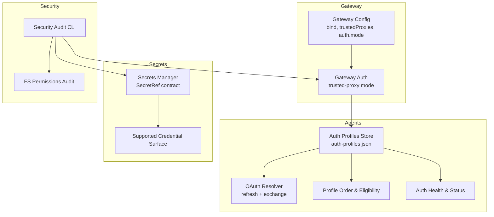
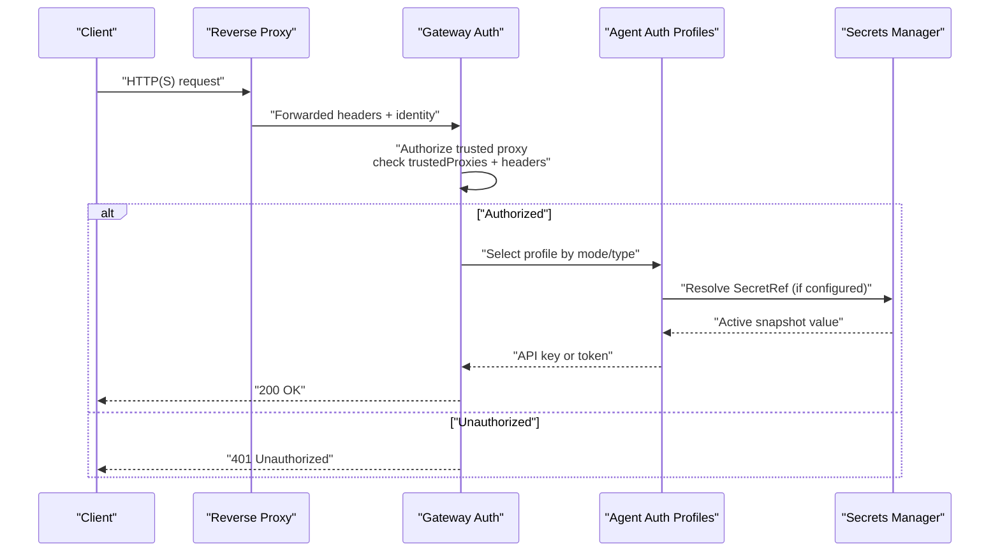
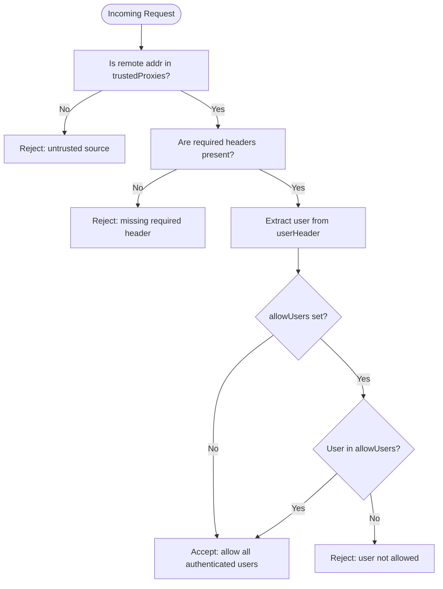
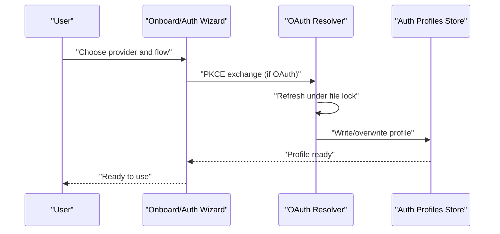
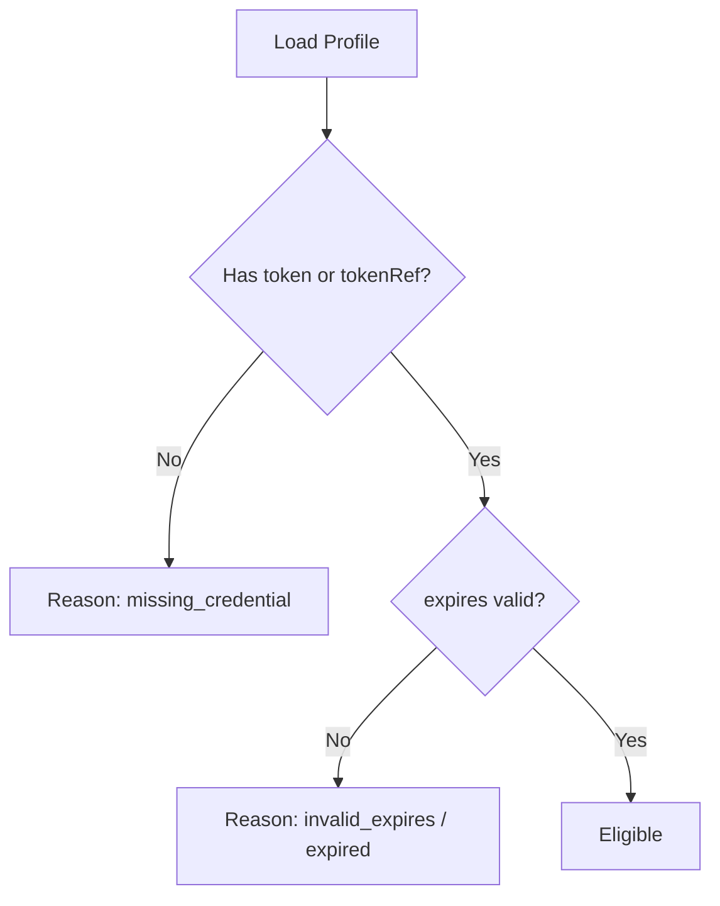
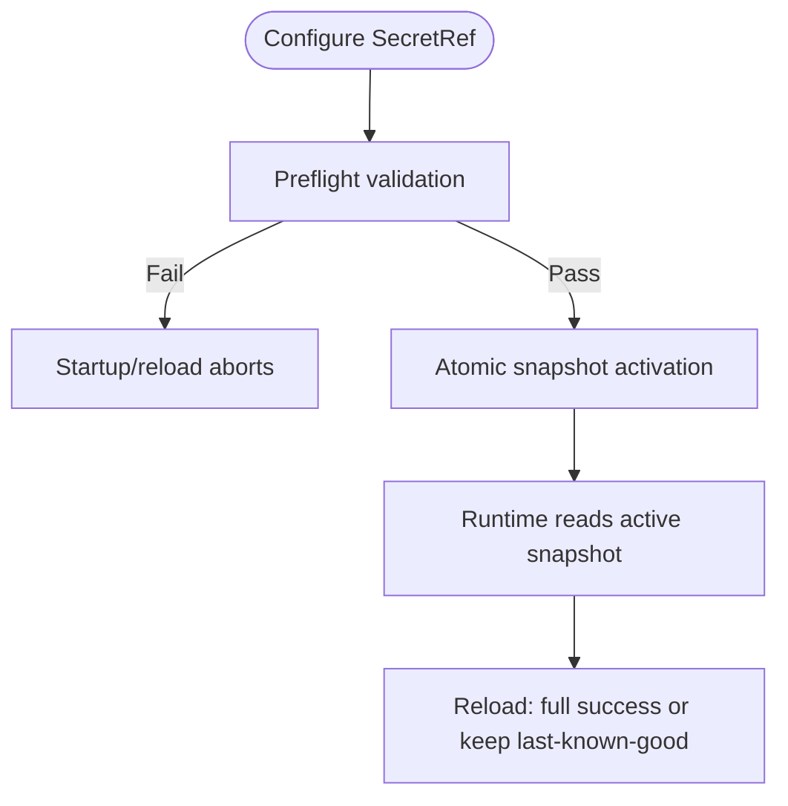
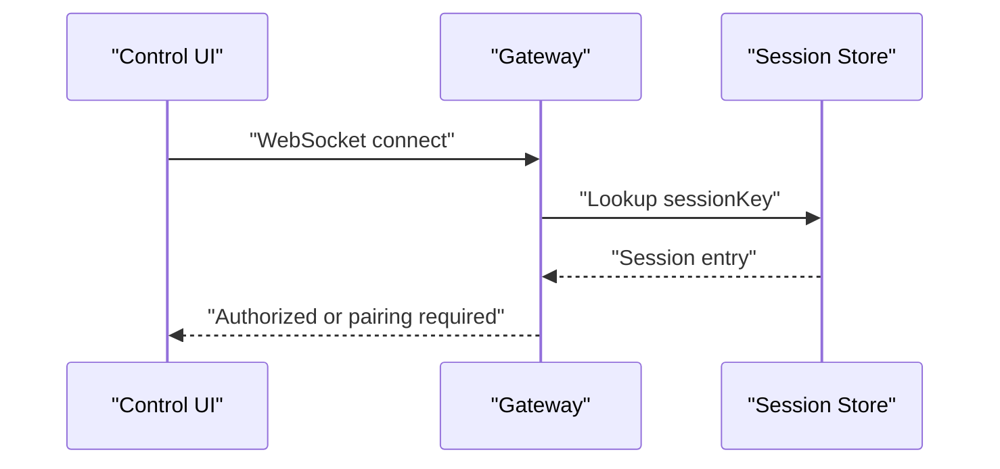
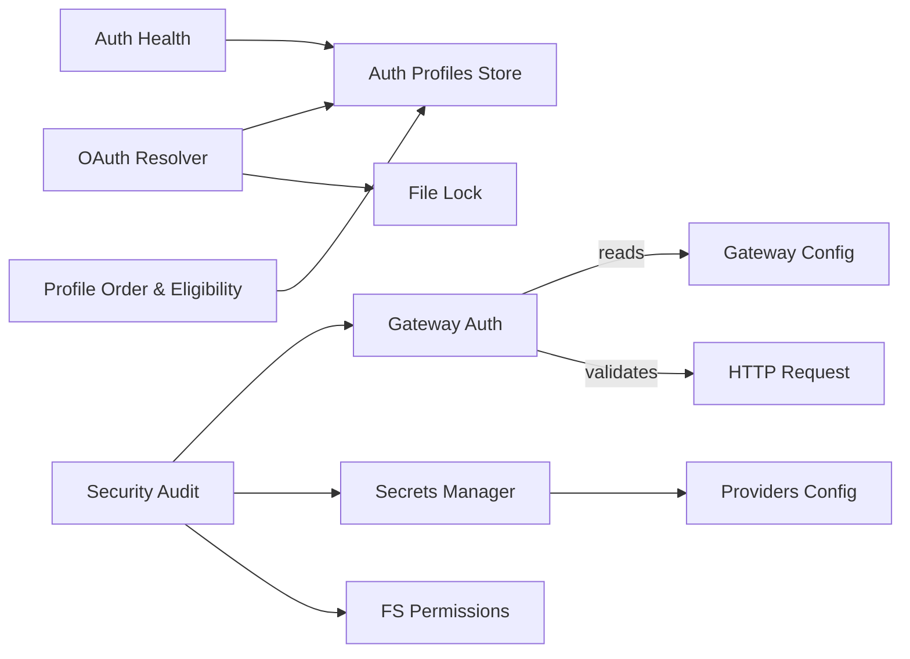

# Authentication & Authorization

<cite>
**Referenced Files in This Document**
- [docs/gateway/authentication.md](file://docs/gateway/authentication.md)
- [docs/gateway/trusted-proxy-auth.md](file://docs/gateway/trusted-proxy-auth.md)
- [docs/concepts/oauth.md](file://docs/concepts/oauth.md)
- [docs/auth-credential-semantics.md](file://docs/auth-credential-semantics.md)
- [docs/gateway/secrets.md](file://docs/gateway/secrets.md)
- [docs/reference/secretref-credential-surface.md](file://docs/reference/secretref-credential-surface.md)
- [docs/cli/security.md](file://docs/cli/security.md)
- [src/gateway/auth.ts](file://src/gateway/auth.ts)
- [src/agents/auth-profiles/oauth.ts](file://src/agents/auth-profiles/oauth.ts)
- [src/agents/auth-profiles/order.ts](file://src/agents/auth-profiles/order.ts)
- [src/agents/auth-health.ts](file://src/agents/auth-health.ts)
- [src/security/audit-extra.async.ts](file://src/security/audit-extra.async.ts)
- [src/sessions/session-id.ts](file://src/sessions/session-id.ts)
</cite>

## Table of Contents
1. [Introduction](#introduction)
2. [Project Structure](#project-structure)
3. [Core Components](#core-components)
4. [Architecture Overview](#architecture-overview)
5. [Detailed Component Analysis](#detailed-component-analysis)
6. [Dependency Analysis](#dependency-analysis)
7. [Performance Considerations](#performance-considerations)
8. [Troubleshooting Guide](#troubleshooting-guide)
9. [Conclusion](#conclusion)
10. [Appendices](#appendices)

## Introduction
This document describes OpenClaw’s authentication and authorization system with a focus on practical operation and security. It covers:
- Authentication mechanisms: API keys, OAuth (including PKCE), and setup-token flows
- Authorization patterns: trusted proxy delegation, allowlists, and session scoping
- Credential management: SecretRef-based storage, rotation, and validation
- Gateway, channel, and device authentication contexts
- Security policies for credential handling, token management, and session security
- Multi-factor authentication, trusted proxy authentication, and secure credential transmission
- Implementation examples and best practices

## Project Structure
OpenClaw’s authentication and authorization spans documentation and implementation across several areas:
- Gateway authentication and trusted proxy mode
- OAuth token exchange and storage
- Agent-level auth profiles and credential eligibility
- Secrets management with SecretRef
- Security auditing and hardening guidance

**Diagram sources**
- [src/gateway/auth.ts](file://src/gateway/auth.ts#L331-L372)
- [src/agents/auth-profiles/oauth.ts](file://src/agents/auth-profiles/oauth.ts#L154-L428)
- [src/agents/auth-profiles/order.ts](file://src/agents/auth-profiles/order.ts#L25-L65)
- [src/agents/auth-health.ts](file://src/agents/auth-health.ts#L98-L163)
- [docs/gateway/secrets.md](file://docs/gateway/secrets.md#L1-L452)
- [docs/reference/secretref-credential-surface.md](file://docs/reference/secretref-credential-surface.md#L1-L24)
- [docs/cli/security.md](file://docs/cli/security.md#L1-L72)
- [src/security/audit-extra.async.ts](file://src/security/audit-extra.async.ts#L983-L1026)

**Section sources**
- [docs/gateway/authentication.md](file://docs/gateway/authentication.md#L1-L180)
- [docs/gateway/trusted-proxy-auth.md](file://docs/gateway/trusted-proxy-auth.md#L1-L330)
- [docs/concepts/oauth.md](file://docs/concepts/oauth.md#L1-L159)
- [docs/auth-credential-semantics.md](file://docs/auth-credential-semantics.md#L1-L46)
- [docs/gateway/secrets.md](file://docs/gateway/secrets.md#L1-L452)
- [docs/reference/secretref-credential-surface.md](file://docs/reference/secretref-credential-surface.md#L1-L24)
- [docs/cli/security.md](file://docs/cli/security.md#L1-L72)
- [src/gateway/auth.ts](file://src/gateway/auth.ts#L331-L372)
- [src/agents/auth-profiles/oauth.ts](file://src/agents/auth-profiles/oauth.ts#L154-L428)
- [src/agents/auth-profiles/order.ts](file://src/agents/auth-profiles/order.ts#L25-L65)
- [src/agents/auth-health.ts](file://src/agents/auth-health.ts#L98-L163)
- [src/security/audit-extra.async.ts](file://src/security/audit-extra.async.ts#L983-L1026)

## Core Components
- Gateway authentication and trusted proxy mode
  - Delegates identity to a reverse proxy and enforces allowlists and required headers
  - Validates request origin against configured trusted proxies
- OAuth and API key flows
  - OAuth with PKCE and refresh logic; API keys for long-lived gateways
  - Profile-based routing and per-session overrides
- Secrets management
  - SecretRef contract supporting env, file, and exec sources
  - Atomic activation, inactive-surface filtering, and audit-grade safety
- Credential semantics and health
  - Eligibility rules, resolution semantics, and health reporting
- Security audit and hardening
  - CLI audit with remediation guidance and filesystem permission checks

**Section sources**
- [docs/gateway/authentication.md](file://docs/gateway/authentication.md#L11-L180)
- [docs/gateway/trusted-proxy-auth.md](file://docs/gateway/trusted-proxy-auth.md#L30-L90)
- [docs/concepts/oauth.md](file://docs/concepts/oauth.md#L17-L159)
- [docs/auth-credential-semantics.md](file://docs/auth-credential-semantics.md#L12-L46)
- [docs/gateway/secrets.md](file://docs/gateway/secrets.md#L16-L75)
- [docs/cli/security.md](file://docs/cli/security.md#L17-L72)

## Architecture Overview
The authentication system integrates three layers:
- Gateway-level enforcement (trusted proxy or token-based)
- Agent-level credential storage and selection (auth profiles)
- Secrets manager for secure, runtime-resolved credentials

**Diagram sources**
- [src/gateway/auth.ts](file://src/gateway/auth.ts#L331-L372)
- [src/agents/auth-profiles/oauth.ts](file://src/agents/auth-profiles/oauth.ts#L154-L428)
- [docs/gateway/secrets.md](file://docs/gateway/secrets.md#L16-L75)

## Detailed Component Analysis

### Gateway Authentication and Trusted Proxy Mode
- Purpose: Delegate authentication to a trusted reverse proxy and enforce allowlists and required headers
- Key behaviors:
  - Validates request origin against configured trusted proxies
  - Extracts user identity from a configured header
  - Enforces allowlist of users and optional required headers
  - Impacts Control UI pairing behavior when enabled
- Configuration highlights:
  - Bind mode, trusted proxies array, auth mode, user header, required headers, allowlist
- Security checklist:
  - Proxy is the only path, minimal trusted proxies, header stripping, TLS termination, allowlist set

**Diagram sources**
- [src/gateway/auth.ts](file://src/gateway/auth.ts#L331-L372)
- [docs/gateway/trusted-proxy-auth.md](file://docs/gateway/trusted-proxy-auth.md#L50-L90)

**Section sources**
- [docs/gateway/trusted-proxy-auth.md](file://docs/gateway/trusted-proxy-auth.md#L12-L90)
- [src/gateway/auth.ts](file://src/gateway/auth.ts#L331-L372)

### OAuth, API Keys, and Setup-Token
- OAuth (PKCE) for supported providers:
  - Token exchange and storage in agent-scoped auth profiles
  - Automatic refresh under file locks and health reporting
- API keys:
  - Recommended for long-lived gateways; priority-based rotation
- Setup-token (Anthropic subscription):
  - Subscription-based token for Claude; use cautiously due to provider restrictions
- Profile routing:
  - Global ordering, per-session overrides, and status probing

**Diagram sources**
- [docs/concepts/oauth.md](file://docs/concepts/oauth.md#L83-L122)
- [src/agents/auth-profiles/oauth.ts](file://src/agents/auth-profiles/oauth.ts#L154-L428)
- [docs/gateway/authentication.md](file://docs/gateway/authentication.md#L105-L113)

**Section sources**
- [docs/concepts/oauth.md](file://docs/concepts/oauth.md#L13-L159)
- [docs/gateway/authentication.md](file://docs/gateway/authentication.md#L21-L113)
- [src/agents/auth-profiles/oauth.ts](file://src/agents/auth-profiles/oauth.ts#L154-L428)

### Credential Semantics, Eligibility, and Health
- Stable reason codes for eligibility and resolution
- Token credentials support inline values and SecretRef
- Health reporting distinguishes static vs token profiles and expiration states
- Eligibility rules prevent invalid or expired profiles from being used

**Diagram sources**
- [docs/auth-credential-semantics.md](file://docs/auth-credential-semantics.md#L20-L37)
- [src/agents/auth-health.ts](file://src/agents/auth-health.ts#L98-L163)
- [src/agents/auth-profiles/order.ts](file://src/agents/auth-profiles/order.ts#L25-L65)

**Section sources**
- [docs/auth-credential-semantics.md](file://docs/auth-credential-semantics.md#L12-L46)
- [src/agents/auth-health.ts](file://src/agents/auth-health.ts#L98-L163)
- [src/agents/auth-profiles/order.ts](file://src/agents/auth-profiles/order.ts#L25-L65)

### Secrets Management and Rotation
- SecretRef contract:
  - env, file, exec sources with validation and provider configuration
- Runtime model:
  - Eager resolution into an in-memory snapshot; atomic activation and reload
  - Inactive-surface filtering to avoid blocking startup for unused credentials
- Audit-grade safety:
  - Preflight validation, last-known-good fallback, and one-way scrubbing policy
- Supported credential surface:
  - Canonical list of SecretRef-enabled credentials; excludes runtime-minted or rotating materials

**Diagram sources**
- [docs/gateway/secrets.md](file://docs/gateway/secrets.md#L16-L75)
- [docs/reference/secretref-credential-surface.md](file://docs/reference/secretref-credential-surface.md#L14-L17)

**Section sources**
- [docs/gateway/secrets.md](file://docs/gateway/secrets.md#L16-L151)
- [docs/reference/secretref-credential-surface.md](file://docs/reference/secretref-credential-surface.md#L14-L17)

### Session Scoping and Device Authentication
- Session ID format and validation
- Session-scoped auth profile overrides and compaction
- Device pairing and Control UI behavior under trusted proxy mode

**Diagram sources**
- [src/sessions/session-id.ts](file://src/sessions/session-id.ts#L1-L5)
- [docs/gateway/trusted-proxy-auth.md](file://docs/gateway/trusted-proxy-auth.md#L38-L48)

**Section sources**
- [src/sessions/session-id.ts](file://src/sessions/session-id.ts#L1-L5)
- [docs/gateway/trusted-proxy-auth.md](file://docs/gateway/trusted-proxy-auth.md#L38-L48)

### Security Policies and Hardening
- Security audit CLI:
  - Detects risky configurations and suggests safe fixes (permissions, defaults, exposure)
- Filesystem permission checks:
  - Audits credentials directories for world/group writability/readability
- Recommendations:
  - Prefer trusted proxy with strict allowlists and TLS termination at the proxy
  - Tighten permissions on state/config and sensitive files
  - Use SecretRef to avoid plaintext at rest

**Section sources**
- [docs/cli/security.md](file://docs/cli/security.md#L17-L72)
- [src/security/audit-extra.async.ts](file://src/security/audit-extra.async.ts#L983-L1026)

## Dependency Analysis
- Gateway trusted-proxy mode depends on:
  - Configuration arrays for trusted proxies and allowlist
  - Request headers for identity and required attributes
- OAuth resolver depends on:
  - Auth profiles store and file locking for safe refresh
  - Eligibility and health modules for status reporting
- Secrets manager depends on:
  - Provider configuration and validation rules
  - Audit and CLI commands for lifecycle management

**Diagram sources**
- [src/gateway/auth.ts](file://src/gateway/auth.ts#L331-L372)
- [src/agents/auth-profiles/oauth.ts](file://src/agents/auth-profiles/oauth.ts#L154-L428)
- [src/agents/auth-health.ts](file://src/agents/auth-health.ts#L98-L163)
- [src/agents/auth-profiles/order.ts](file://src/agents/auth-profiles/order.ts#L25-L65)
- [docs/gateway/secrets.md](file://docs/gateway/secrets.md#L117-L151)
- [docs/cli/security.md](file://docs/cli/security.md#L17-L72)
- [src/security/audit-extra.async.ts](file://src/security/audit-extra.async.ts#L983-L1026)

**Section sources**
- [src/gateway/auth.ts](file://src/gateway/auth.ts#L331-L372)
- [src/agents/auth-profiles/oauth.ts](file://src/agents/auth-profiles/oauth.ts#L154-L428)
- [src/agents/auth-health.ts](file://src/agents/auth-health.ts#L98-L163)
- [src/agents/auth-profiles/order.ts](file://src/agents/auth-profiles/order.ts#L25-L65)
- [docs/gateway/secrets.md](file://docs/gateway/secrets.md#L117-L151)
- [docs/cli/security.md](file://docs/cli/security.md#L17-L72)
- [src/security/audit-extra.async.ts](file://src/security/audit-extra.async.ts#L983-L1026)

## Performance Considerations
- OAuth refresh under file lock prevents concurrent writes and ensures consistency
- Secrets activation is eager and atomic, keeping hot paths free from provider outages
- Inactive-surface filtering avoids unnecessary resolution for unused credentials
- Priority-based API key rotation reduces latency by trying the most likely working key first

[No sources needed since this section provides general guidance]

## Troubleshooting Guide
- Trusted proxy errors:
  - Untrusted source: verify proxy IP and firewall rules
  - Missing user header or required headers: confirm proxy forwarding
  - User not allowed: adjust allowlist
- OAuth and API key issues:
  - No credentials found or expiring/expired: re-run provider login or rotate keys
  - Token rotation behavior: ensure proper priority order and deduplication
- Security audit findings:
  - Writable credentials directories: tighten permissions
  - Unsafe defaults or exposure: apply suggested fixes

**Section sources**
- [docs/gateway/trusted-proxy-auth.md](file://docs/gateway/trusted-proxy-auth.md#L276-L322)
- [docs/gateway/authentication.md](file://docs/gateway/authentication.md#L160-L180)
- [docs/cli/security.md](file://docs/cli/security.md#L17-L72)
- [src/security/audit-extra.async.ts](file://src/security/audit-extra.async.ts#L983-L1026)

## Conclusion
OpenClaw’s authentication and authorization system balances flexibility and security:
- Use trusted proxy mode for centralized identity and simplified gateway auth
- Employ SecretRef for secure, runtime-resolved credentials with strong safety guarantees
- Manage OAuth and API keys with clear eligibility rules, health reporting, and rotation behavior
- Harden deployments with security audits and permission tightening

[No sources needed since this section summarizes without analyzing specific files]

## Appendices

### Implementation Examples and Best Practices
- API key setup and rotation:
  - Export provider keys to environment or .env and restart the daemon
  - Prefer SecretRef-backed env/file/exec sources for production
- OAuth login and refresh:
  - Use PKCE flows and rely on automatic refresh under file locks
  - Keep profiles ordered and use per-session overrides when needed
- Trusted proxy configuration:
  - Set bind to loopback or LAN depending on deployment, configure trustedProxies, userHeader, and allowUsers
  - Terminate TLS at the proxy and apply HSTS there
- Security hardening:
  - Run security audit and apply safe fixes
  - Audit filesystem permissions for credentials directories

**Section sources**
- [docs/gateway/authentication.md](file://docs/gateway/authentication.md#L21-L113)
- [docs/concepts/oauth.md](file://docs/concepts/oauth.md#L83-L122)
- [docs/gateway/trusted-proxy-auth.md](file://docs/gateway/trusted-proxy-auth.md#L50-L136)
- [docs/gateway/secrets.md](file://docs/gateway/secrets.md#L16-L75)
- [docs/cli/security.md](file://docs/cli/security.md#L17-L72)