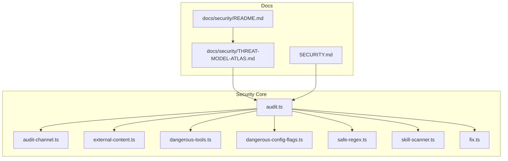
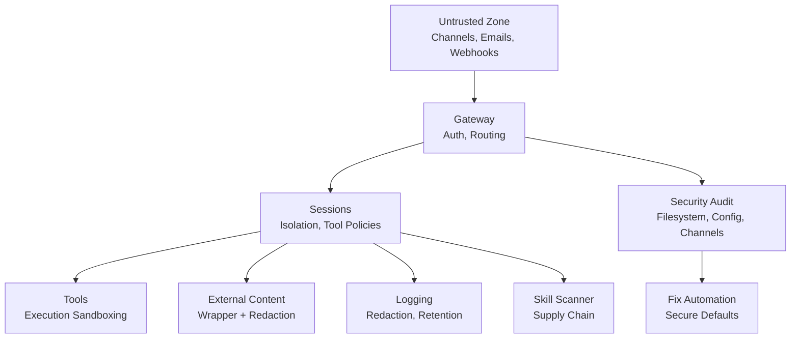
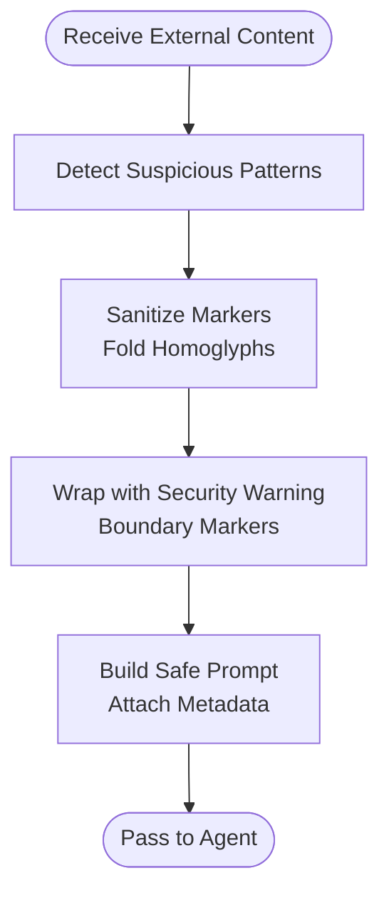
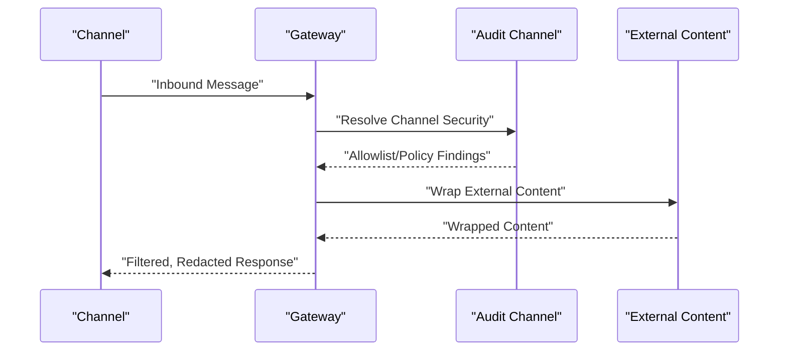
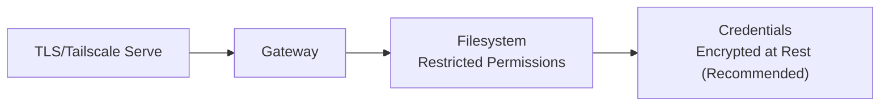
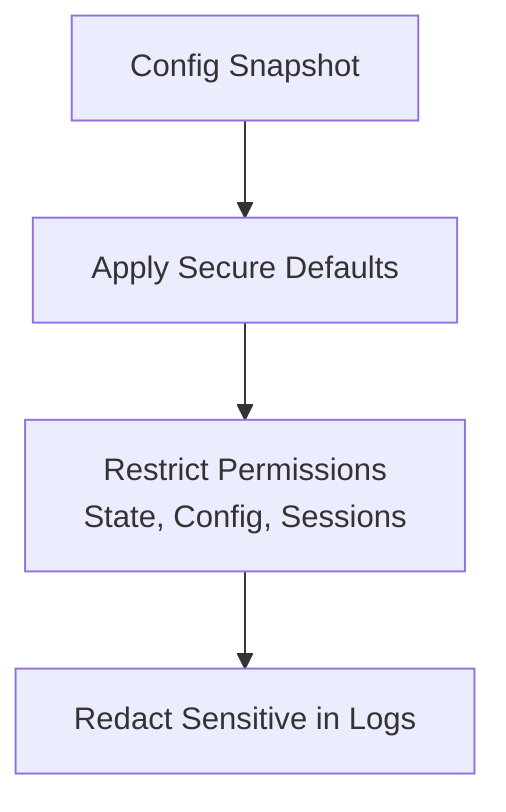
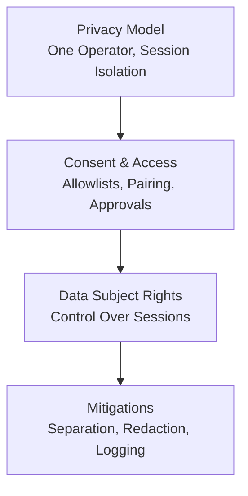
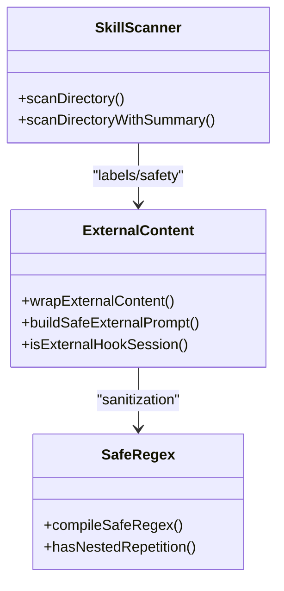
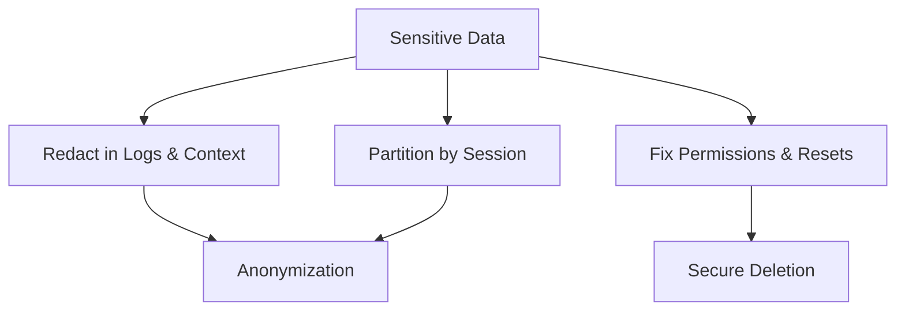
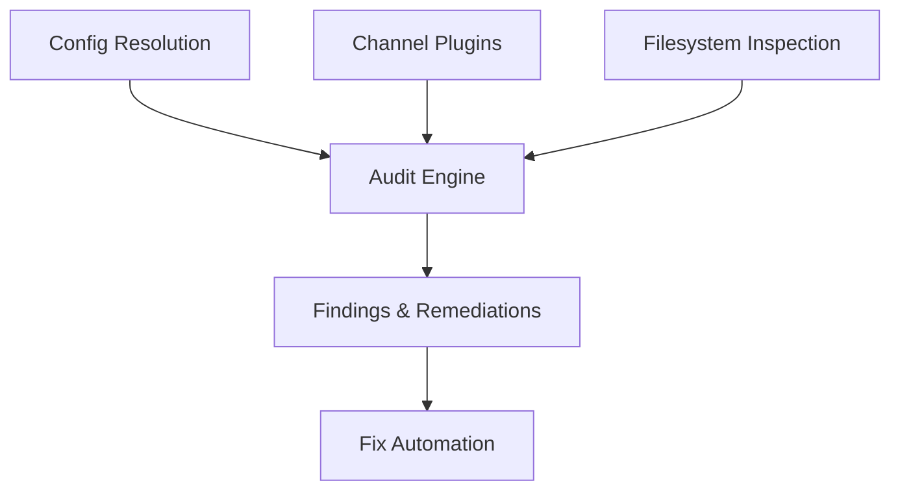

# Data Protection & Privacy

<cite>
**Referenced Files in This Document**
- [SECURITY.md](file://SECURITY.md)
- [docs/security/README.md](file://docs/security/README.md)
- [docs/security/THREAT-MODEL-ATLAS.md](file://docs/security/THREAT-MODEL-ATLAS.md)
- [src/security/audit.ts](file://src/security/audit.ts)
- [src/security/audit-channel.ts](file://src/security/audit-channel.ts)
- [src/security/audit-extra.ts](file://src/security/audit-extra.ts)
- [src/security/external-content.ts](file://src/security/external-content.ts)
- [src/security/dangerous-tools.ts](file://src/security/dangerous-tools.ts)
- [src/security/dangerous-config-flags.ts](file://src/security/dangerous-config-flags.ts)
- [src/security/fix.ts](file://src/security/fix.ts)
- [src/security/safe-regex.ts](file://src/security/safe-regex.ts)
- [src/security/skill-scanner.ts](file://src/security/skill-scanner.ts)
</cite>

## Table of Contents
1. [Introduction](#introduction)
2. [Project Structure](#project-structure)
3. [Core Components](#core-components)
4. [Architecture Overview](#architecture-overview)
5. [Detailed Component Analysis](#detailed-component-analysis)
6. [Dependency Analysis](#dependency-analysis)
7. [Performance Considerations](#performance-considerations)
8. [Troubleshooting Guide](#troubleshooting-guide)
9. [Conclusion](#conclusion)
10. [Appendices](#appendices)

## Introduction
This document consolidates OpenClaw’s data protection and privacy controls grounded in the repository’s security code and documentation. It explains how the system sanitizes data, redacts sensitive content, secures attachments and external content, enforces data leakage prevention, applies encryption at rest and in transit, manages data retention and privacy controls, and aligns with privacy-by-design principles. It also outlines compliance considerations, data subject rights, consent management, data classification, automated protection workflows, secure deletion, anonymization techniques, and privacy impact assessments.

## Project Structure
Security-related capabilities are implemented across:
- Security audit and hardening utilities
- External content wrapping and redaction
- Dangerous tool and config flag detection
- Regex safety and supply chain scanning
- Fix automation for secure defaults
- Threat model and trust boundaries

**Diagram sources**
- [src/security/audit.ts](file://src/security/audit.ts#L1-L1254)
- [src/security/audit-channel.ts](file://src/security/audit-channel.ts#L1-L726)
- [src/security/external-content.ts](file://src/security/external-content.ts#L1-L346)
- [src/security/dangerous-tools.ts](file://src/security/dangerous-tools.ts#L1-L40)
- [src/security/dangerous-config-flags.ts](file://src/security/dangerous-config-flags.ts#L1-L29)
- [src/security/safe-regex.ts](file://src/security/safe-regex.ts#L1-L333)
- [src/security/skill-scanner.ts](file://src/security/skill-scanner.ts#L1-L584)
- [src/security/fix.ts](file://src/security/fix.ts#L1-L478)
- [docs/security/README.md](file://docs/security/README.md#L1-L18)
- [docs/security/THREAT-MODEL-ATLAS.md](file://docs/security/THREAT-MODEL-ATLAS.md#L1-L604)
- [SECURITY.md](file://SECURITY.md#L1-L286)

**Section sources**
- [src/security/audit.ts](file://src/security/audit.ts#L1-L1254)
- [src/security/audit-channel.ts](file://src/security/audit-channel.ts#L1-L726)
- [src/security/external-content.ts](file://src/security/external-content.ts#L1-L346)
- [src/security/dangerous-tools.ts](file://src/security/dangerous-tools.ts#L1-L40)
- [src/security/dangerous-config-flags.ts](file://src/security/dangerous-config-flags.ts#L1-L29)
- [src/security/safe-regex.ts](file://src/security/safe-regex.ts#L1-L333)
- [src/security/skill-scanner.ts](file://src/security/skill-scanner.ts#L1-L584)
- [src/security/fix.ts](file://src/security/fix.ts#L1-L478)
- [docs/security/README.md](file://docs/security/README.md#L1-L18)
- [docs/security/THREAT-MODEL-ATLAS.md](file://docs/security/THREAT-MODEL-ATLAS.md#L1-L604)
- [SECURITY.md](file://SECURITY.md#L1-L286)

## Core Components
- Security audit engine: central orchestrator for discovering misconfigurations, exposure risks, and policy violations across filesystem, gateway, channels, and plugins.
- External content wrapper: sanitizes and bounds untrusted inputs (emails, webhooks, web fetches) with warnings and boundary markers.
- Dangerous tool and config flag detectors: identifies high-risk tool usage and insecure configuration toggles.
- Regex safety: detects nested repetition patterns to mitigate performance and safety risks.
- Skill scanner: scans uploaded skills for suspicious patterns and potential data exfiltration vectors.
- Fix automation: applies secure defaults to permissions, credentials, and channel policies.

**Section sources**
- [src/security/audit.ts](file://src/security/audit.ts#L1-L1254)
- [src/security/external-content.ts](file://src/security/external-content.ts#L1-L346)
- [src/security/dangerous-tools.ts](file://src/security/dangerous-tools.ts#L1-L40)
- [src/security/dangerous-config-flags.ts](file://src/security/dangerous-config-flags.ts#L1-L29)
- [src/security/safe-regex.ts](file://src/security/safe-regex.ts#L1-L333)
- [src/security/skill-scanner.ts](file://src/security/skill-scanner.ts#L1-L584)
- [src/security/fix.ts](file://src/security/fix.ts#L1-L478)

## Architecture Overview
OpenClaw’s data protection architecture is layered around trust boundaries and continuous auditing:

**Diagram sources**
- [docs/security/THREAT-MODEL-ATLAS.md](file://docs/security/THREAT-MODEL-ATLAS.md#L56-L123)
- [src/security/audit.ts](file://src/security/audit.ts#L1-L1254)
- [src/security/external-content.ts](file://src/security/external-content.ts#L1-L346)
- [src/security/skill-scanner.ts](file://src/security/skill-scanner.ts#L1-L584)
- [src/security/fix.ts](file://src/security/fix.ts#L1-L478)

**Section sources**
- [docs/security/THREAT-MODEL-ATLAS.md](file://docs/security/THREAT-MODEL-ATLAS.md#L56-L123)
- [src/security/audit.ts](file://src/security/audit.ts#L1-L1254)

## Detailed Component Analysis

### Data Sanitization and External Content Redaction
- Untrusted content is wrapped with boundary markers and a security warning to prevent prompt-injection and social engineering.
- Suspicious patterns are detected and logged; content is still wrapped safely.
- Marker spoofing is mitigated by folding Unicode homoglyphs and sanitizing legacy markers.
- Web search/fetch content receives a simplified wrapper when appropriate.

**Diagram sources**
- [src/security/external-content.ts](file://src/security/external-content.ts#L17-L82)
- [src/security/external-content.ts](file://src/security/external-content.ts#L154-L210)
- [src/security/external-content.ts](file://src/security/external-content.ts#L239-L303)

**Section sources**
- [src/security/external-content.ts](file://src/security/external-content.ts#L1-L346)

### Attachment Security and Content Filtering
- External content is treated as untrusted and wrapped with explicit warnings and boundaries.
- Channel-specific allowlists and policies govern sender authorization and command access to minimize unauthorized actions.
- Regex safety checks prevent nested repetition patterns that could lead to performance or denial-of-service risks.

**Diagram sources**
- [src/security/audit-channel.ts](file://src/security/audit-channel.ts#L119-L725)
- [src/security/external-content.ts](file://src/security/external-content.ts#L239-L303)

**Section sources**
- [src/security/audit-channel.ts](file://src/security/audit-channel.ts#L1-L726)
- [src/security/external-content.ts](file://src/security/external-content.ts#L1-L346)
- [src/security/safe-regex.ts](file://src/security/safe-regex.ts#L299-L333)

### Encryption at Rest and in Transit
- In-transit: Gateway and related components rely on TLS-backed transports (e.g., HTTPS/TLS for remote CDP, Tailscale serve) and reverse proxy configurations.
- At-rest: Credentials and state are protected by restrictive filesystem permissions; token encryption at rest is identified as a recommendation in the threat model.

**Diagram sources**
- [src/security/audit.ts](file://src/security/audit.ts#L785-L797)
- [docs/security/THREAT-MODEL-ATLAS.md](file://docs/security/THREAT-MODEL-ATLAS.md#L420-L421)

**Section sources**
- [src/security/audit.ts](file://src/security/audit.ts#L785-L797)
- [docs/security/THREAT-MODEL-ATLAS.md](file://docs/security/THREAT-MODEL-ATLAS.md#L420-L421)

### Data Retention and Privacy Controls
- Logging redaction is configurable; the fix engine normalizes overly permissive settings to safer defaults.
- Session transcripts and agent state are protected by restrictive permissions; sensitive log entries are redacted by policy.

**Diagram sources**
- [src/security/fix.ts](file://src/security/fix.ts#L276-L303)
- [src/security/fix.ts](file://src/security/fix.ts#L305-L384)

**Section sources**
- [src/security/fix.ts](file://src/security/fix.ts#L1-L478)

### Compliance with Privacy Regulations, Rights, and Consent
- The repository emphasizes a “personal assistant” trust model with one trusted operator and session-based isolation. Mixed-trust or adversarial users require strict separation.
- Consent and access controls are enforced via channel allowlists, pairing, and explicit approvals for sensitive tools.
- The security policy defines responsible disclosure and triage gates for vulnerability reports.

**Diagram sources**
- [SECURITY.md](file://SECURITY.md#L88-L151)
- [docs/security/THREAT-MODEL-ATLAS.md](file://docs/security/THREAT-MODEL-ATLAS.md#L58-L123)

**Section sources**
- [SECURITY.md](file://SECURITY.md#L88-L151)
- [docs/security/THREAT-MODEL-ATLAS.md](file://docs/security/THREAT-MODEL-ATLAS.md#L58-L123)

### Data Classification, Sensitivity Labeling, and Automated Workflows
- External content is labeled by source and metadata; a warning is injected to guide agents to ignore system-like instructions.
- Supply chain scanning flags suspicious constructs (e.g., dynamic code execution, environment harvesting, crypto-mining references).
- Regex safety flags nested repetition patterns to prevent performance degradation.

**Diagram sources**
- [src/security/external-content.ts](file://src/security/external-content.ts#L212-L303)
- [src/security/skill-scanner.ts](file://src/security/skill-scanner.ts#L147-L205)
- [src/security/safe-regex.ts](file://src/security/safe-regex.ts#L305-L333)

**Section sources**
- [src/security/external-content.ts](file://src/security/external-content.ts#L1-L346)
- [src/security/skill-scanner.ts](file://src/security/skill-scanner.ts#L1-L584)
- [src/security/safe-regex.ts](file://src/security/safe-regex.ts#L1-L333)

### Secure Deletion, Anonymization, and Privacy Impact Assessments
- Secure deletion workflows are supported by permission resets and file-mode adjustments applied by the fix engine.
- Anonymization techniques include redaction of sensitive content in logs and context, and session-based isolation to limit cross-user data exposure.
- Privacy impact assessments are supported by the threat model’s risk matrix and attack chains, guiding prioritization of mitigations.

**Diagram sources**
- [src/security/fix.ts](file://src/security/fix.ts#L305-L384)
- [src/security/audit.ts](file://src/security/audit.ts#L799-L800)
- [docs/security/THREAT-MODEL-ATLAS.md](file://docs/security/THREAT-MODEL-ATLAS.md#L485-L527)

**Section sources**
- [src/security/fix.ts](file://src/security/fix.ts#L1-L478)
- [src/security/audit.ts](file://src/security/audit.ts#L799-L800)
- [docs/security/THREAT-MODEL-ATLAS.md](file://docs/security/THREAT-MODEL-ATLAS.md#L485-L527)

### Implementation Guidelines for Privacy-by-Design
- Enforce least privilege: disable dangerous flags, restrict tool usage, and default to sandboxed execution.
- Apply secure defaults: use the fix engine to normalize permissions and logging redaction.
- Monitor and audit: run security audits regularly and act on findings.
- Supply chain hygiene: scan skills and moderate content; prefer signed updates and allowlists.

**Section sources**
- [src/security/dangerous-config-flags.ts](file://src/security/dangerous-config-flags.ts#L1-L29)
- [src/security/dangerous-tools.ts](file://src/security/dangerous-tools.ts#L1-L40)
- [src/security/fix.ts](file://src/security/fix.ts#L1-L478)
- [src/security/skill-scanner.ts](file://src/security/skill-scanner.ts#L1-L584)

## Dependency Analysis
Security components depend on configuration resolution, channel plugins, and filesystem inspection. The audit engine aggregates findings from multiple subsystems.

**Diagram sources**
- [src/security/audit.ts](file://src/security/audit.ts#L1-L1254)
- [src/security/audit-channel.ts](file://src/security/audit-channel.ts#L1-L726)
- [src/security/audit-extra.ts](file://src/security/audit-extra.ts#L1-L41)

**Section sources**
- [src/security/audit.ts](file://src/security/audit.ts#L1-L1254)
- [src/security/audit-channel.ts](file://src/security/audit-channel.ts#L1-L726)
- [src/security/audit-extra.ts](file://src/security/audit-extra.ts#L1-L41)

## Performance Considerations
- Regex safety checks bound input windows to prevent pathological matching.
- Skill scanning caches file and directory entries to limit I/O overhead.
- Audit engines avoid redundant I/O by caching snapshots and summaries.

[No sources needed since this section provides general guidance]

## Troubleshooting Guide
- Use the security audit to identify exposure risks, misconfigurations, and policy inconsistencies.
- Apply fixes to normalize permissions, logging redaction, and channel policies.
- Review findings by severity and remediate critical items first.

**Section sources**
- [src/security/audit.ts](file://src/security/audit.ts#L1-L1254)
- [src/security/fix.ts](file://src/security/fix.ts#L1-L478)

## Conclusion
OpenClaw’s security posture integrates external content wrapping, channel access control, regex safety, supply chain scanning, and automated hardening. The threat model and trust boundaries define clear responsibilities for data protection, while the audit and fix engines provide practical automation for privacy-by-design outcomes.

[No sources needed since this section summarizes without analyzing specific files]

## Appendices

### Appendix A: Security Audit and Hardening Checklist
- Run security audits to detect exposure risks and misconfigurations.
- Apply fixes to normalize permissions, logging redaction, and channel policies.
- Review findings by severity and prioritize critical items.

**Section sources**
- [src/security/audit.ts](file://src/security/audit.ts#L1-L1254)
- [src/security/fix.ts](file://src/security/fix.ts#L1-L478)

### Appendix B: Threat Model Highlights
- Trust boundaries separate untrusted channels, gateway, sessions, tool execution, and external content.
- Risk matrix and attack chains guide prioritization of mitigations.

**Section sources**
- [docs/security/THREAT-MODEL-ATLAS.md](file://docs/security/THREAT-MODEL-ATLAS.md#L56-L123)
- [docs/security/THREAT-MODEL-ATLAS.md](file://docs/security/THREAT-MODEL-ATLAS.md#L485-L527)