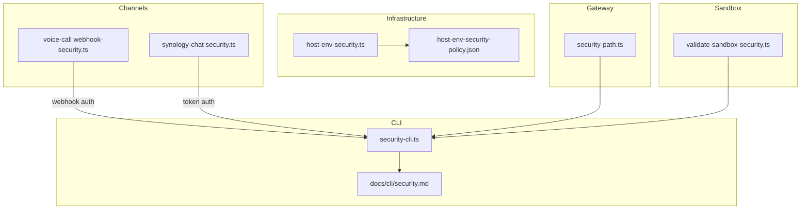
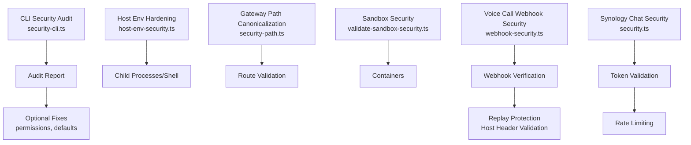
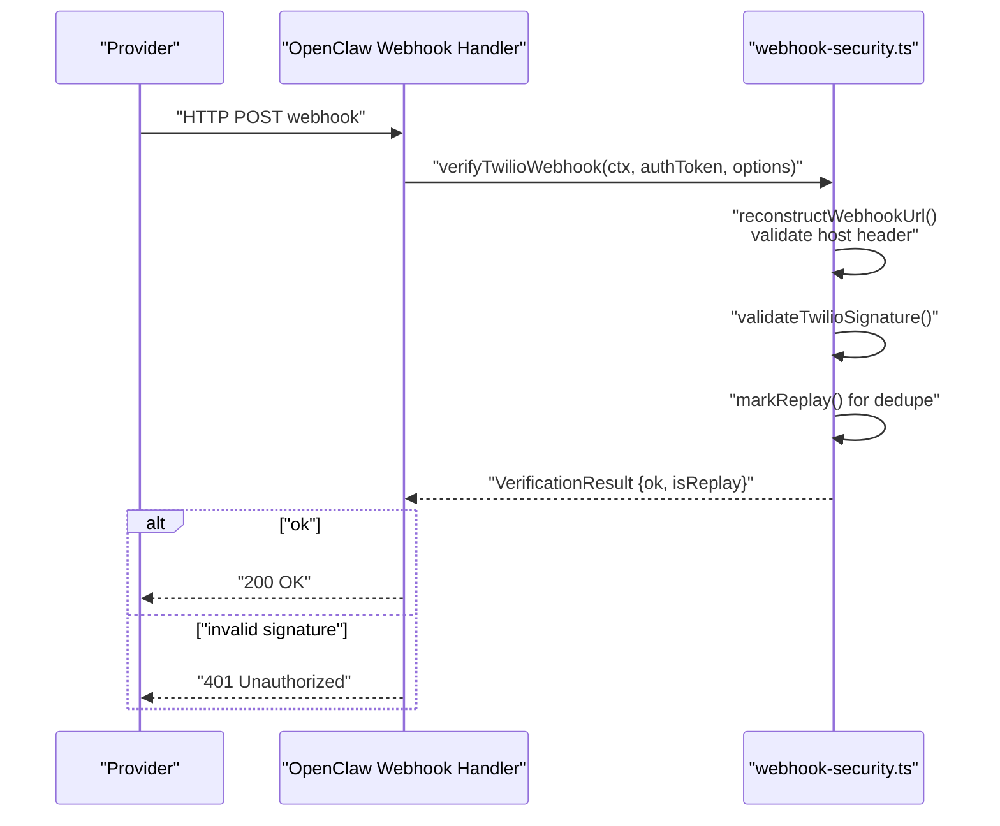
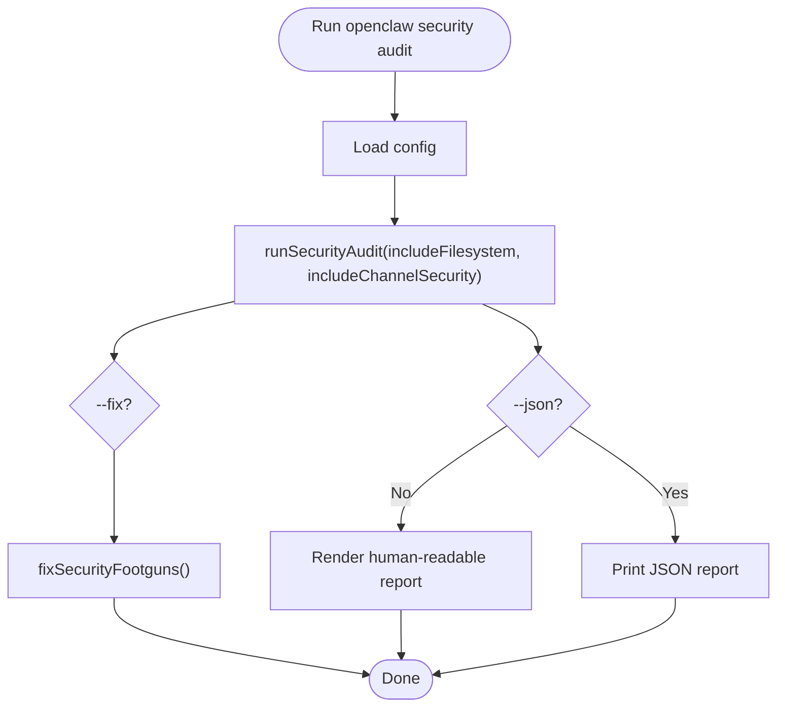
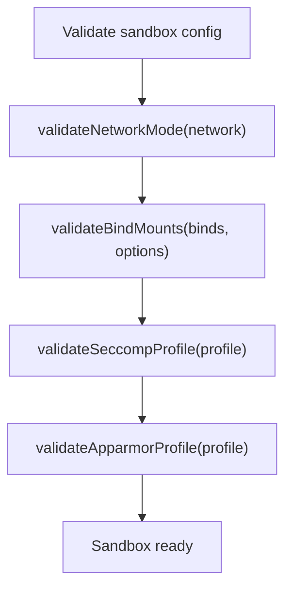
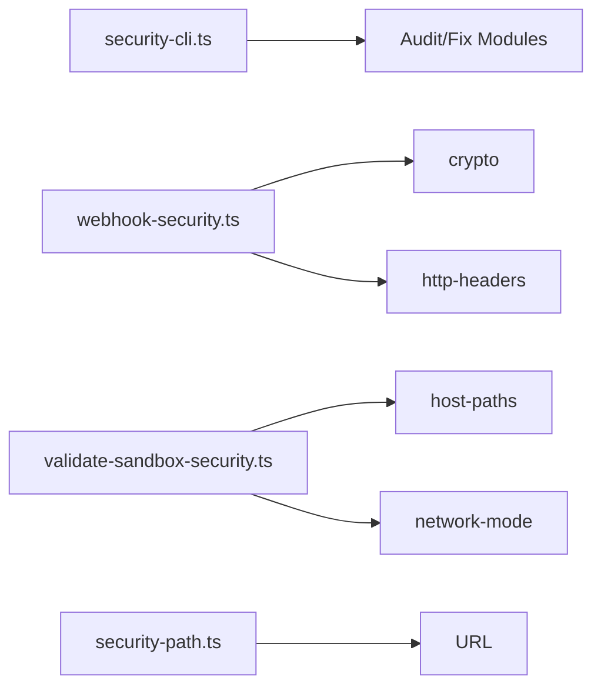

# Secure Communication Protocols

<cite>
**Referenced Files in This Document**
- [docs/cli/security.md](file://docs/cli/security.md)
- [src/cli/security-cli.ts](file://src/cli/security-cli.ts)
- [src/infra/host-env-security.ts](file://src/infra/host-env-security.ts)
- [src/infra/host-env-security-policy.json](file://src/infra/host-env-security-policy.json)
- [src/gateway/security-path.ts](file://src/gateway/security-path.ts)
- [src/agents/sandbox/validate-sandbox-security.ts](file://src/agents/sandbox/validate-sandbox-security.ts)
- [extensions/voice-call/src/webhook-security.ts](file://extensions/voice-call/src/webhook-security.ts)
- [extensions/synology-chat/src/security.ts](file://extensions/synology-chat/src/security.ts)
</cite>

## Table of Contents
1. [Introduction](#introduction)
2. [Project Structure](#project-structure)
3. [Core Components](#core-components)
4. [Architecture Overview](#architecture-overview)
5. [Detailed Component Analysis](#detailed-component-analysis)
6. [Dependency Analysis](#dependency-analysis)
7. [Performance Considerations](#performance-considerations)
8. [Troubleshooting Guide](#troubleshooting-guide)
9. [Conclusion](#conclusion)
10. [Appendices](#appendices)

## Introduction
This document explains how OpenClaw secures communication across HTTP, webhooks, and internal runtime boundaries. It covers HTTPS/TLS configuration posture, certificate management, secure socket communication, HTTP security headers, CORS and origin validation, authentication for HTTP endpoints, request validation, secure API communication, WebSocket security, message encryption for real-time communication, network boundary protection, firewall configuration, secure tunnel establishment, man-in-the-middle protection, certificate pinning, and secure inter-component communication. It also provides configuration examples and production hardening guidelines.

## Project Structure
OpenClaw’s security-related capabilities are distributed across CLI auditing, infrastructure-level environment hardening, gateway path canonicalization, sandbox security enforcement, and channel-specific webhook security utilities.

**Diagram sources**
- [src/cli/security-cli.ts](file://src/cli/security-cli.ts#L30-L165)
- [docs/cli/security.md](file://docs/cli/security.md#L1-L72)
- [src/infra/host-env-security.ts](file://src/infra/host-env-security.ts#L1-L158)
- [src/infra/host-env-security-policy.json](file://src/infra/host-env-security-policy.json#L1-L51)
- [src/gateway/security-path.ts](file://src/gateway/security-path.ts#L1-L162)
- [src/agents/sandbox/validate-sandbox-security.ts](file://src/agents/sandbox/validate-sandbox-security.ts#L1-L344)
- [extensions/voice-call/src/webhook-security.ts](file://extensions/voice-call/src/webhook-security.ts#L1-L981)
- [extensions/synology-chat/src/security.ts](file://extensions/synology-chat/src/security.ts#L1-L125)

**Section sources**
- [src/cli/security-cli.ts](file://src/cli/security-cli.ts#L30-L165)
- [docs/cli/security.md](file://docs/cli/security.md#L1-L72)
- [src/infra/host-env-security.ts](file://src/infra/host-env-security.ts#L1-L158)
- [src/infra/host-env-security-policy.json](file://src/infra/host-env-security-policy.json#L1-L51)
- [src/gateway/security-path.ts](file://src/gateway/security-path.ts#L1-L162)
- [src/agents/sandbox/validate-sandbox-security.ts](file://src/agents/sandbox/validate-sandbox-security.ts#L1-L344)
- [extensions/voice-call/src/webhook-security.ts](file://extensions/voice-call/src/webhook-security.ts#L1-L981)
- [extensions/synology-chat/src/security.ts](file://extensions/synology-chat/src/security.ts#L1-L125)

## Core Components
- CLI security audit: runs local audits and optional safe fixes for permissions and defaults.
- Host environment security: sanitizes environment variables passed to child processes and shells.
- Gateway path canonicalization: normalizes and validates request paths to mitigate traversal and encoding anomalies.
- Sandbox security: enforces safe bind mounts, network modes, and seccomp/AppArmor profiles.
- Channel webhook security: validates signatures, detects replays, reconstructs URLs securely, and enforces host header constraints.
- Channel token/rate-limiting: validates tokens via constant-time comparison, supports allowlists, and rate limits per user.

**Section sources**
- [src/cli/security-cli.ts](file://src/cli/security-cli.ts#L51-L163)
- [src/infra/host-env-security.ts](file://src/infra/host-env-security.ts#L83-L157)
- [src/gateway/security-path.ts](file://src/gateway/security-path.ts#L106-L161)
- [src/agents/sandbox/validate-sandbox-security.ts](file://src/agents/sandbox/validate-sandbox-security.ts#L234-L343)
- [extensions/voice-call/src/webhook-security.ts](file://extensions/voice-call/src/webhook-security.ts#L258-L347)
- [extensions/synology-chat/src/security.ts](file://extensions/synology-chat/src/security.ts#L19-L124)

## Architecture Overview
OpenClaw’s security architecture separates concerns across:
- Runtime environment hardening (env var filtering and overrides)
- Path normalization and protection (gateway route canonicalization)
- Container sandboxing (bind mounts, network, seccomp/AppArmor)
- Webhook authentication and replay protection (signature verification, host header validation)
- Token-based auth and rate limiting (channel integrations)

**Diagram sources**
- [src/cli/security-cli.ts](file://src/cli/security-cli.ts#L51-L163)
- [src/infra/host-env-security.ts](file://src/infra/host-env-security.ts#L83-L157)
- [src/gateway/security-path.ts](file://src/gateway/security-path.ts#L106-L161)
- [src/agents/sandbox/validate-sandbox-security.ts](file://src/agents/sandbox/validate-sandbox-security.ts#L234-L343)
- [extensions/voice-call/src/webhook-security.ts](file://extensions/voice-call/src/webhook-security.ts#L258-L347)
- [extensions/synology-chat/src/security.ts](file://extensions/synology-chat/src/security.ts#L19-L124)

## Detailed Component Analysis

### HTTPS/TLS Configuration and Certificate Management
- TLS termination and cipher suites are managed by upstream reverse proxies and gateways. OpenClaw focuses on validating inbound requests and enforcing secure headers when reconstructing URLs behind proxies.
- Certificate management is externalized; OpenClaw enforces secure URL reconstruction and trusts only validated forwarding headers from known proxies.

Practical guidance:
- Ensure TLS 1.2+ with modern cipher suites at the edge proxy.
- Use strong OCSP stapling and up-to-date CA bundles.
- Restrict allowed hosts and require trusted proxy IPs when using X-Forwarded-* headers.

**Section sources**
- [extensions/voice-call/src/webhook-security.ts](file://extensions/voice-call/src/webhook-security.ts#L258-L347)

### Secure Socket Communication
- OpenClaw does not implement raw TLS sockets internally. Instead, it validates webhook signatures and enforces secure URL reconstruction behind proxies. For internal sockets, follow standard TLS hardening at the transport layer.

[No sources needed since this section provides general guidance]

### HTTP Security Headers, CORS, and Origin Validation
- Origin validation and host header injection prevention are handled during URL reconstruction. Allowed hostnames must be explicitly whitelisted; otherwise, forwarding headers are ignored.
- CORS is enforced by the channel integrations’ own middleware; OpenClaw’s webhook utilities focus on signature verification and host validation.

Recommendations:
- Configure allowedHosts for each channel webhook endpoint.
- Enforce trusted proxy IP lists for X-Forwarded-* headers.
- Treat X-Forwarded-Proto consistently with the edge TLS termination.

**Section sources**
- [extensions/voice-call/src/webhook-security.ts](file://extensions/voice-call/src/webhook-security.ts#L138-L165)
- [extensions/voice-call/src/webhook-security.ts](file://extensions/voice-call/src/webhook-security.ts#L258-L347)

### Authentication for HTTP Endpoints and Request Validation
- Voice call webhook authentication uses provider-specific cryptographic signatures (HMAC-SHA1 for Twilio, Ed25519 for Telnyx) with timing-safe comparisons and replay detection.
- Synology Chat uses constant-time token comparison and allowlists for DM authorization.
- Gateway path canonicalization ensures safe route handling and rejects malformed encodings.

**Diagram sources**
- [extensions/voice-call/src/webhook-security.ts](file://extensions/voice-call/src/webhook-security.ts#L565-L696)

**Section sources**
- [extensions/voice-call/src/webhook-security.ts](file://extensions/voice-call/src/webhook-security.ts#L79-L133)
- [extensions/voice-call/src/webhook-security.ts](file://extensions/voice-call/src/webhook-security.ts#L497-L560)
- [extensions/voice-call/src/webhook-security.ts](file://extensions/voice-call/src/webhook-security.ts#L565-L696)
- [extensions/synology-chat/src/security.ts](file://extensions/synology-chat/src/security.ts#L19-L62)
- [src/gateway/security-path.ts](file://src/gateway/security-path.ts#L106-L161)

### Secure API Communication
- OpenClaw’s CLI provides a security audit that flags insecure settings (e.g., auth mode none, permissive group policies, unsafe sandbox Docker settings). It can optionally apply safe fixes (e.g., tightening permissions, flipping open group policies to allowlist).
- The audit integrates with runtime configuration and channel security policies.

**Diagram sources**
- [src/cli/security-cli.ts](file://src/cli/security-cli.ts#L51-L163)

**Section sources**
- [docs/cli/security.md](file://docs/cli/security.md#L17-L72)
- [src/cli/security-cli.ts](file://src/cli/security-cli.ts#L51-L163)

### WebSocket Security and Real-Time Communication Protection
- OpenClaw does not implement WebSocket servers in the analyzed files. For secure WebSocket deployments:
  - Terminate TLS at the edge proxy and enforce modern TLS versions.
  - Validate origins and enforce Subprotocol negotiation.
  - Use short-lived, rotating tokens for authentication.
  - Apply rate limiting and input sanitization similar to HTTP endpoints.

[No sources needed since this section provides general guidance]

### Network Boundary Protection, Firewall Configuration, and Secure Tunnel Establishment
- Sandbox security denies dangerous Docker network modes and bind mounts, and enforces seccomp/AppArmor profiles to strengthen container isolation.
- Host environment hardening restricts environment variable propagation to prevent command injection and path manipulation.

**Diagram sources**
- [src/agents/sandbox/validate-sandbox-security.ts](file://src/agents/sandbox/validate-sandbox-security.ts#L283-L343)

**Section sources**
- [src/agents/sandbox/validate-sandbox-security.ts](file://src/agents/sandbox/validate-sandbox-security.ts#L18-L34)
- [src/agents/sandbox/validate-sandbox-security.ts](file://src/agents/sandbox/validate-sandbox-security.ts#L283-L343)
- [src/infra/host-env-security.ts](file://src/infra/host-env-security.ts#L83-L157)
- [src/infra/host-env-security-policy.json](file://src/infra/host-env-security-policy.json#L1-L51)

### Man-in-the-Middle Protection, Certificate Pinning, and Inter-Component Communication
- OpenClaw does not implement certificate pinning in the analyzed files. For production deployments:
  - Use pinned CAs at the edge proxy and enforce certificate validation.
  - For inter-component communication, prefer mutual TLS with short-lived certificates and strict SAN validation.
  - Restrict allowed hosts and trusted proxy IPs to minimize exposure.

[No sources needed since this section provides general guidance]

## Dependency Analysis
OpenClaw’s security stack exhibits low coupling and high cohesion:
- CLI depends on audit and fix modules.
- Webhook security utilities depend on HTTP header parsing and cryptographic primitives.
- Sandbox security depends on host path normalization and network mode validation.
- Gateway path canonicalization is standalone and used by route handlers.

**Diagram sources**
- [src/cli/security-cli.ts](file://src/cli/security-cli.ts#L1-L165)
- [extensions/voice-call/src/webhook-security.ts](file://extensions/voice-call/src/webhook-security.ts#L1-L981)
- [src/agents/sandbox/validate-sandbox-security.ts](file://src/agents/sandbox/validate-sandbox-security.ts#L1-L344)
- [src/gateway/security-path.ts](file://src/gateway/security-path.ts#L1-L162)

**Section sources**
- [src/cli/security-cli.ts](file://src/cli/security-cli.ts#L1-L165)
- [extensions/voice-call/src/webhook-security.ts](file://extensions/voice-call/src/webhook-security.ts#L1-L981)
- [src/agents/sandbox/validate-sandbox-security.ts](file://src/agents/sandbox/validate-sandbox-security.ts#L1-L344)
- [src/gateway/security-path.ts](file://src/gateway/security-path.ts#L1-L162)

## Performance Considerations
- Webhook verification performs hashing and timing-safe comparisons; keep caches bounded (e.g., replay caches) to avoid memory growth.
- Rate limiting in channel integrations uses fixed-window counters; tune limits and tracked keys for expected traffic.
- Path canonicalization uses iterative decoding with a pass limit; keep inputs reasonable to avoid hitting limits.

[No sources needed since this section provides general guidance]

## Troubleshooting Guide
Common issues and mitigations:
- Host header injection attempts: ensure allowedHosts is configured for webhook endpoints; otherwise, forwarding headers are ignored.
- Signature verification failures: verify proxy URL reconstruction and port handling; consider ngrok free-tier compatibility mode only for development.
- Replay detection: inspect replay caches and pruning intervals; adjust window sizes if legitimate retries occur.
- Sandbox bind mount errors: review blocked paths and allowed roots; use absolute paths and avoid reserved container targets.
- Unsafe environment variables: confirm env overrides are allowed; only whitelisted keys are permitted for shell wrappers.

**Section sources**
- [extensions/voice-call/src/webhook-security.ts](file://extensions/voice-call/src/webhook-security.ts#L258-L347)
- [extensions/voice-call/src/webhook-security.ts](file://extensions/voice-call/src/webhook-security.ts#L565-L696)
- [src/agents/sandbox/validate-sandbox-security.ts](file://src/agents/sandbox/validate-sandbox-security.ts#L96-L117)
- [src/agents/sandbox/validate-sandbox-security.ts](file://src/agents/sandbox/validate-sandbox-security.ts#L234-L281)
- [src/infra/host-env-security.ts](file://src/infra/host-env-security.ts#L131-L157)

## Conclusion
OpenClaw’s security posture centers on robust webhook authentication, secure URL reconstruction, environment hardening, gateway path canonicalization, and sandbox enforcement. For production, complement these with edge TLS hardening, strict allowed host and proxy IP policies, and inter-component mutual TLS. The CLI security audit helps identify and remediate common misconfigurations quickly.

[No sources needed since this section summarizes without analyzing specific files]

## Appendices

### Configuration Examples and Production Hardening Guidelines
- Allowed hosts and trusted proxies for webhooks:
  - Configure allowedHosts to whitelist domain names and require trustedProxyIPs for X-Forwarded-* validation.
- Sandbox hardening:
  - Avoid host and container namespace join network modes; prefer bridge or none.
  - Block seccomp/apparmor unconfined profiles; use minimal profiles.
  - Restrict bind mounts to allowed roots and avoid reserved container targets.
- Environment hardening:
  - Review host-env-security-policy.json for blocked keys and prefixes; ensure overrides are minimal and whitelisted.
- Audit and fix:
  - Use the CLI to audit and apply safe fixes for permissions and defaults.

**Section sources**
- [extensions/voice-call/src/webhook-security.ts](file://extensions/voice-call/src/webhook-security.ts#L138-L165)
- [extensions/voice-call/src/webhook-security.ts](file://extensions/voice-call/src/webhook-security.ts#L258-L347)
- [src/agents/sandbox/validate-sandbox-security.ts](file://src/agents/sandbox/validate-sandbox-security.ts#L283-L343)
- [src/infra/host-env-security-policy.json](file://src/infra/host-env-security-policy.json#L1-L51)
- [docs/cli/security.md](file://docs/cli/security.md#L17-L72)