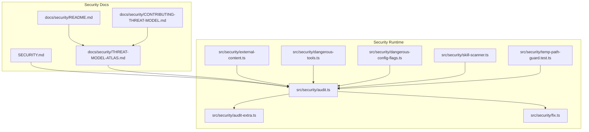
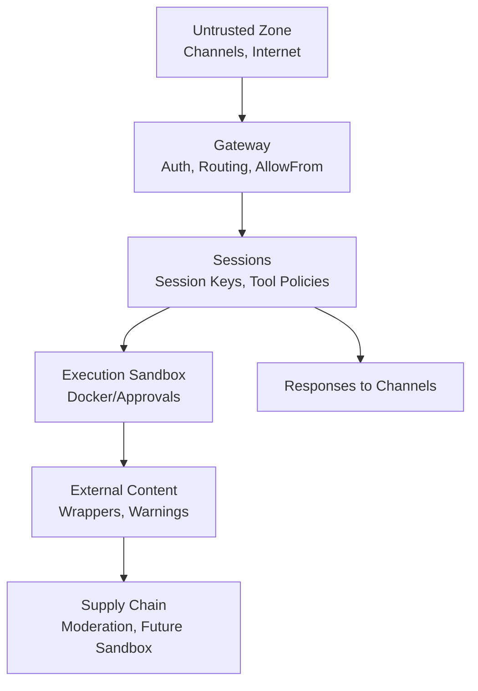
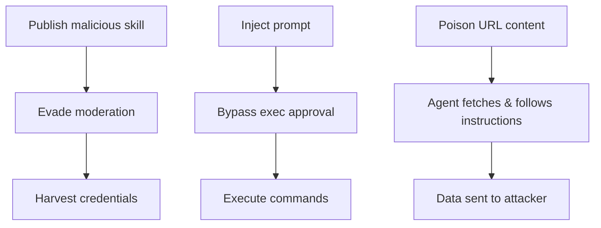
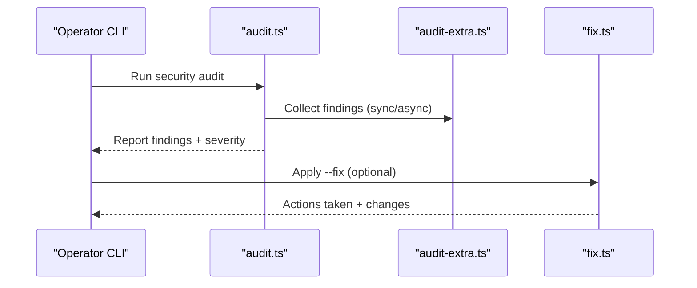
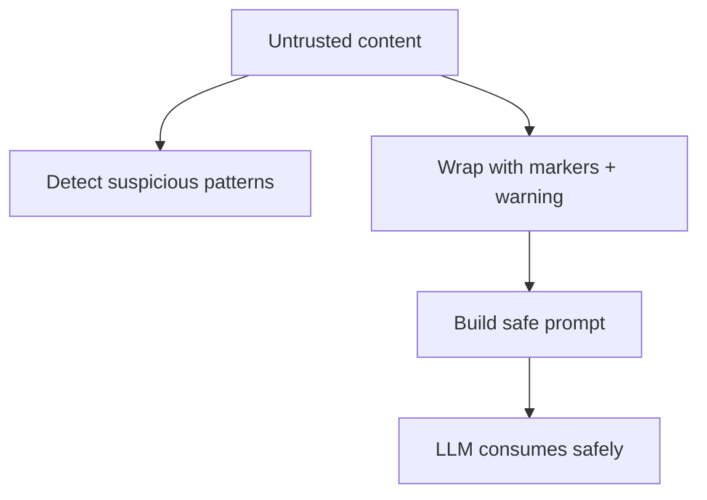
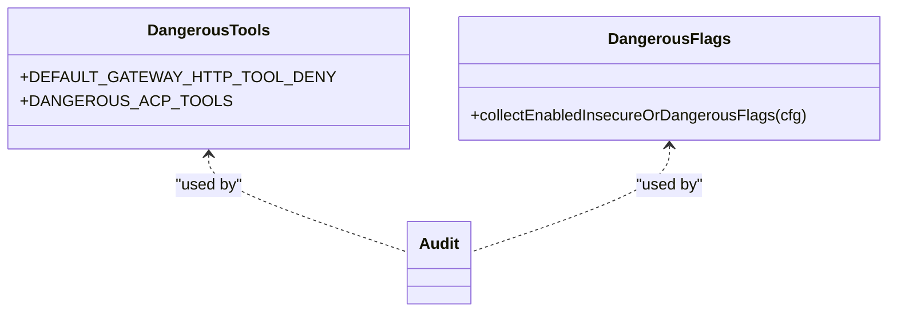
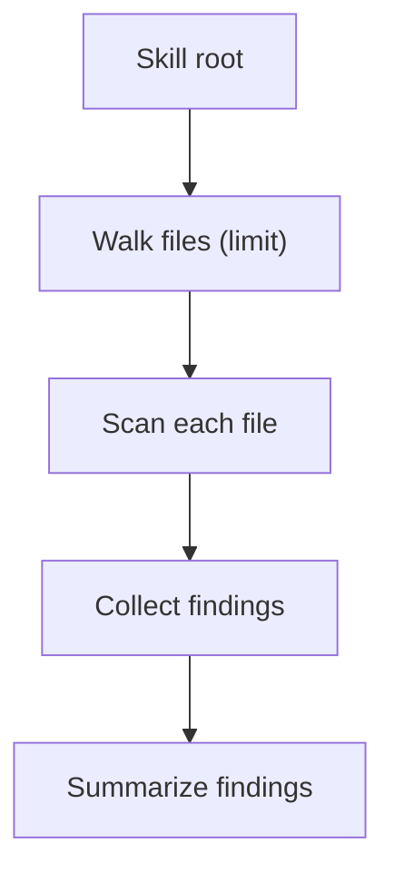
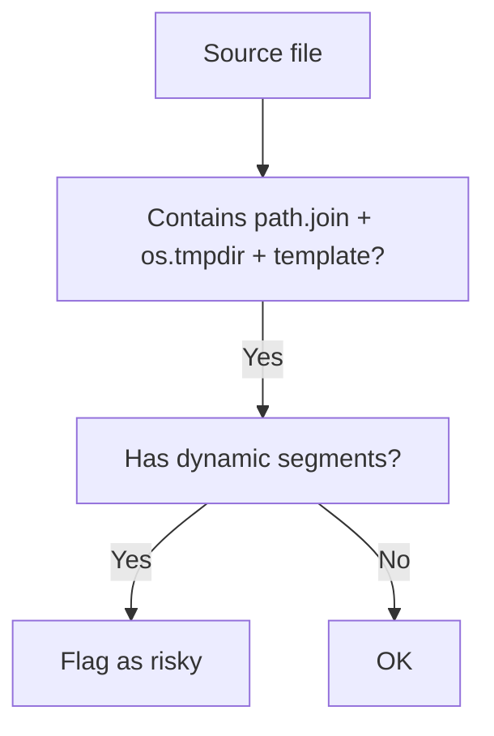
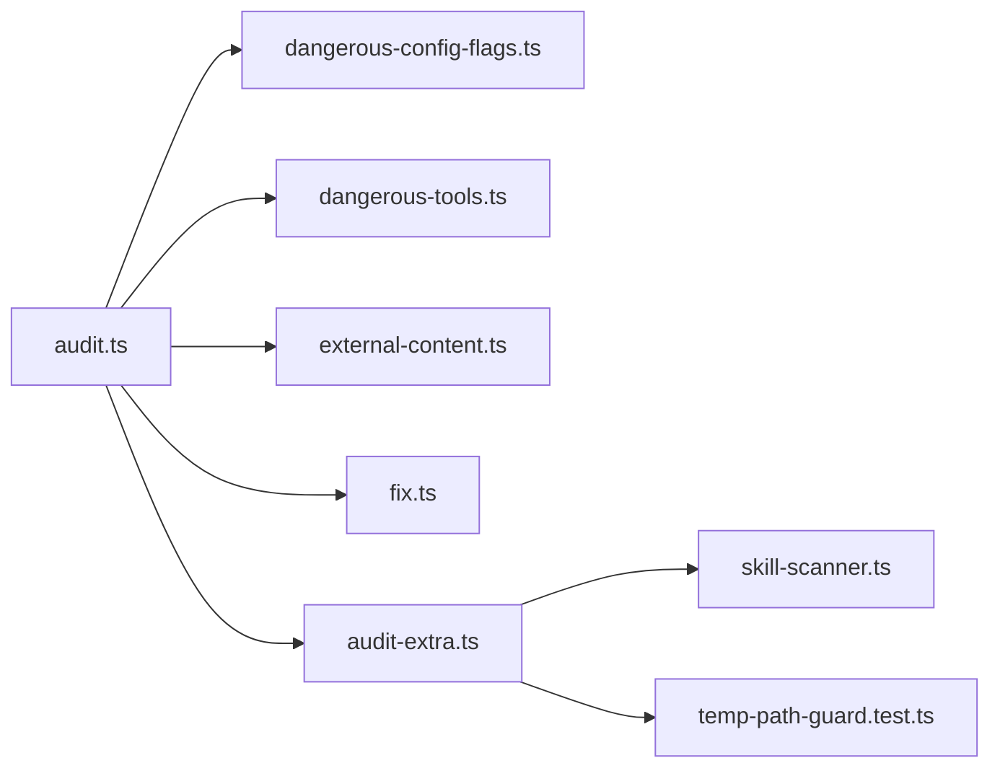

# Security Framework

<cite>
**Referenced Files in This Document**
- [SECURITY.md](file://SECURITY.md)
- [docs/security/README.md](file://docs/security/README.md)
- [docs/security/THREAT-MODEL-ATLAS.md](file://docs/security/THREAT-MODEL-ATLAS.md)
- [docs/security/CONTRIBUTING-THREAT-MODEL.md](file://docs/security/CONTRIBUTING-THREAT-MODEL.md)
- [src/security/audit.ts](file://src/security/audit.ts)
- [src/security/audit-extra.ts](file://src/security/audit-extra.ts)
- [src/security/fix.ts](file://src/security/fix.ts)
- [src/security/external-content.ts](file://src/security/external-content.ts)
- [src/security/dangerous-tools.ts](file://src/security/dangerous-tools.ts)
- [src/security/dangerous-config-flags.ts](file://src/security/dangerous-config-flags.ts)
- [src/security/skill-scanner.ts](file://src/security/skill-scanner.ts)
- [src/security/temp-path-guard.test.ts](file://src/security/temp-path-guard.test.ts)
</cite>

## Table of Contents
1. [Introduction](#introduction)
2. [Project Structure](#project-structure)
3. [Core Components](#core-components)
4. [Architecture Overview](#architecture-overview)
5. [Detailed Component Analysis](#detailed-component-analysis)
6. [Dependency Analysis](#dependency-analysis)
7. [Performance Considerations](#performance-considerations)
8. [Troubleshooting Guide](#troubleshooting-guide)
9. [Conclusion](#conclusion)
10. [Appendices](#appendices)

## Introduction
This document presents OpenClaw’s security framework and threat assessment. It explains the security architecture, authentication and authorization patterns, access control systems, and operational protections. It also documents DM pairing security, channel authentication, and gateway protection measures, along with best practices, vulnerability assessment, incident response, monitoring, auditing, and compliance considerations. The goal is to provide a practical, code-backed guide for securing OpenClaw deployments and operations.

## Project Structure
OpenClaw’s security model is implemented across several cohesive areas:
- Security policy and trust model
- Threat model and risk matrix
- Security audit and remediation tooling
- External content safety wrappers
- Dangerous tool and configuration safeguards
- Skill supply-chain scanning
- Platform-specific guardrails

**Diagram sources**
- [SECURITY.md](file://SECURITY.md#L1-L286)
- [docs/security/README.md](file://docs/security/README.md#L1-L18)
- [docs/security/THREAT-MODEL-ATLAS.md](file://docs/security/THREAT-MODEL-ATLAS.md#L1-L604)
- [docs/security/CONTRIBUTING-THREAT-MODEL.md](file://docs/security/CONTRIBUTING-THREAT-MODEL.md#L1-L91)
- [src/security/audit.ts](file://src/security/audit.ts#L1-L800)
- [src/security/audit-extra.ts](file://src/security/audit-extra.ts#L1-L41)
- [src/security/fix.ts](file://src/security/fix.ts#L1-L478)
- [src/security/external-content.ts](file://src/security/external-content.ts#L1-L346)
- [src/security/dangerous-tools.ts](file://src/security/dangerous-tools.ts#L1-L40)
- [src/security/dangerous-config-flags.ts](file://src/security/dangerous-config-flags.ts#L1-L29)
- [src/security/skill-scanner.ts](file://src/security/skill-scanner.ts#L1-L584)
- [src/security/temp-path-guard.test.ts](file://src/security/temp-path-guard.test.ts#L1-L250)

**Section sources**
- [SECURITY.md](file://SECURITY.md#L1-L286)
- [docs/security/README.md](file://docs/security/README.md#L1-L18)
- [docs/security/THREAT-MODEL-ATLAS.md](file://docs/security/THREAT-MODEL-ATLAS.md#L1-L604)
- [docs/security/CONTRIBUTING-THREAT-MODEL.md](file://docs/security/CONTRIBUTING-THREAT-MODEL.md#L1-L91)

## Core Components
- Security policy and trust model: defines operator trust assumptions, scope, and out-of-scope conditions.
- Threat model: MITRE ATLAS-based analysis of risks across channels, gateway, agent sessions, tool execution, external content, and supply chain.
- Security audit and remediation: automated checks for gateway exposure, auth, control UI, filesystem permissions, and plugin/code safety; optional fixes.
- External content safety: wrapper and warning system for untrusted inputs (emails, webhooks, web fetch/search).
- Dangerous tool and config safeguards: default HTTP deny lists, dangerous ACP tools, and detection of insecure flags.
- Skill scanner: static analysis for risky patterns in published skills.
- Platform guardrails: runtime guardrails for temp path usage and weak randomness.

**Section sources**
- [SECURITY.md](file://SECURITY.md#L88-L180)
- [docs/security/THREAT-MODEL-ATLAS.md](file://docs/security/THREAT-MODEL-ATLAS.md#L56-L123)
- [src/security/audit.ts](file://src/security/audit.ts#L339-L687)
- [src/security/fix.ts](file://src/security/fix.ts#L387-L478)
- [src/security/external-content.ts](file://src/security/external-content.ts#L1-L346)
- [src/security/dangerous-tools.ts](file://src/security/dangerous-tools.ts#L1-L40)
- [src/security/dangerous-config-flags.ts](file://src/security/dangerous-config-flags.ts#L1-L29)
- [src/security/skill-scanner.ts](file://src/security/skill-scanner.ts#L1-L584)
- [src/security/temp-path-guard.test.ts](file://src/security/temp-path-guard.test.ts#L190-L248)

## Architecture Overview
OpenClaw’s security architecture is layered around trust boundaries and defensive controls:

- Trust boundaries:
  - Channel access: validated via AllowFrom and channel-specific identity checks.
  - Session isolation: per-session keys and tool policies.
  - Execution sandbox: Docker sandbox or host execution with approvals.
  - External content: wrapped with warnings and markers.
  - Supply chain: moderation and future sandboxing for skills.

- Data flows:
  - Messages from channels to gateway, routed to agents.
  - Tool invocations gated by policy and approvals.
  - SSRF protections for outbound web requests.
  - Skill code delivery from marketplace to agent runtime.

**Diagram sources**
- [docs/security/THREAT-MODEL-ATLAS.md](file://docs/security/THREAT-MODEL-ATLAS.md#L58-L123)
- [src/security/external-content.ts](file://src/security/external-content.ts#L239-L303)
- [src/security/dangerous-tools.ts](file://src/security/dangerous-tools.ts#L9-L20)

**Section sources**
- [docs/security/THREAT-MODEL-ATLAS.md](file://docs/security/THREAT-MODEL-ATLAS.md#L56-L135)

## Detailed Component Analysis

### Security Policy and Trust Model
- Operator trust model: one trusted operator per gateway; session keys are routing controls, not per-user authorization boundaries.
- Multi-tenant sharing is not modeled; use separate gateways per trust boundary.
- Plugins are trusted code; only install trusted plugins and prefer allowlists.
- Workspace memory is trusted operator state; isolation requires separate gateways.

**Section sources**
- [SECURITY.md](file://SECURITY.md#L88-L180)

### Threat Model and Risk Matrix
- MITRE ATLAS-based analysis with attack chains and prioritized recommendations.
- Critical-path chains include skill-based data theft, prompt injection to RCE, and indirect injection via fetched content.
- Recommendations emphasize VirusTotal integration, skill sandboxing, output validation, rate limiting, token encryption, exec approval UX improvements, and URL allowlisting.

**Diagram sources**
- [docs/security/THREAT-MODEL-ATLAS.md](file://docs/security/THREAT-MODEL-ATLAS.md#L507-L526)

**Section sources**
- [docs/security/THREAT-MODEL-ATLAS.md](file://docs/security/THREAT-MODEL-ATLAS.md#L485-L556)

### Security Audit and Remediation
- Audit collects findings across gateway exposure, auth, control UI, filesystem permissions, plugins, and code safety.
- Remediation includes fixing permissions, tightening CORS/origin policies, disabling dangerous flags, and applying config hardening.

**Diagram sources**
- [src/security/audit.ts](file://src/security/audit.ts#L1-L120)
- [src/security/audit-extra.ts](file://src/security/audit-extra.ts#L1-L41)
- [src/security/fix.ts](file://src/security/fix.ts#L387-L478)

**Section sources**
- [src/security/audit.ts](file://src/security/audit.ts#L339-L687)
- [src/security/fix.ts](file://src/security/fix.ts#L387-L478)

### External Content Safety
- Detects suspicious patterns and sanitizes boundary markers.
- Wraps external content with unique markers, warnings, and metadata.
- Provides safe prompts for web search/fetch and hook-derived content.

**Diagram sources**
- [src/security/external-content.ts](file://src/security/external-content.ts#L17-L45)
- [src/security/external-content.ts](file://src/security/external-content.ts#L239-L303)

**Section sources**
- [src/security/external-content.ts](file://src/security/external-content.ts#L1-L346)

### Dangerous Tools and Config Safeguards
- Default HTTP deny list for high-risk tools invoked over gateway HTTP.
- Dangerous ACP tools require explicit user approval.
- Detection of insecure or dangerous flags (e.g., control UI toggles, unsafe external content allowances).

**Diagram sources**
- [src/security/dangerous-tools.ts](file://src/security/dangerous-tools.ts#L1-L40)
- [src/security/dangerous-config-flags.ts](file://src/security/dangerous-config-flags.ts#L1-L29)
- [src/security/audit.ts](file://src/security/audit.ts#L403-L427)

**Section sources**
- [src/security/dangerous-tools.ts](file://src/security/dangerous-tools.ts#L1-L40)
- [src/security/dangerous-config-flags.ts](file://src/security/dangerous-config-flags.ts#L1-L29)
- [src/security/audit.ts](file://src/security/audit.ts#L403-L427)

### Skill Scanner (Supply Chain)
- Scans JavaScript/TypeScript sources for dangerous patterns (exec, dynamic code, crypto-mining, env harvesting, obfuscation).
- Enforces file size and count limits, caches results, and aggregates findings.

**Diagram sources**
- [src/security/skill-scanner.ts](file://src/security/skill-scanner.ts#L323-L353)
- [src/security/skill-scanner.ts](file://src/security/skill-scanner.ts#L521-L541)

**Section sources**
- [src/security/skill-scanner.ts](file://src/security/skill-scanner.ts#L1-L584)

### Platform Guardrails (Temp Paths)
- Runtime guardrails detect dynamic temp path joins with weak randomness on the same line, flagging potential sandbox escape vectors.
- Tests enforce that dynamic temp path construction is avoided in runtime sources.

**Diagram sources**
- [src/security/temp-path-guard.test.ts](file://src/security/temp-path-guard.test.ts#L160-L188)

**Section sources**
- [src/security/temp-path-guard.test.ts](file://src/security/temp-path-guard.test.ts#L190-L248)

## Dependency Analysis
Security components are loosely coupled and orchestrated by the audit pipeline:

**Diagram sources**
- [src/security/audit.ts](file://src/security/audit.ts#L1-L120)
- [src/security/audit-extra.ts](file://src/security/audit-extra.ts#L1-L41)
- [src/security/fix.ts](file://src/security/fix.ts#L1-L60)
- [src/security/external-content.ts](file://src/security/external-content.ts#L1-L40)
- [src/security/dangerous-tools.ts](file://src/security/dangerous-tools.ts#L1-L40)
- [src/security/dangerous-config-flags.ts](file://src/security/dangerous-config-flags.ts#L1-L29)
- [src/security/skill-scanner.ts](file://src/security/skill-scanner.ts#L1-L60)
- [src/security/temp-path-guard.test.ts](file://src/security/temp-path-guard.test.ts#L1-L40)

**Section sources**
- [src/security/audit.ts](file://src/security/audit.ts#L1-L120)
- [src/security/audit-extra.ts](file://src/security/audit-extra.ts#L1-L41)

## Performance Considerations
- Audit caching: filesystem permission checks and directory entry caches reduce repeated I/O.
- Skill scanner limits: max files and per-file byte limits bound CPU/memory usage.
- Default HTTP deny lists minimize risk without impacting normal operations.

[No sources needed since this section provides general guidance]

## Troubleshooting Guide
- Use the security audit to identify gateway exposure, auth misconfigurations, and filesystem permission issues.
- Apply fixes selectively with the fixer to adjust permissions and tighten config flags.
- Monitor for external content suspicious patterns and review audit findings with remediations.

**Section sources**
- [src/security/audit.ts](file://src/security/audit.ts#L134-L148)
- [src/security/fix.ts](file://src/security/fix.ts#L387-L478)
- [src/security/external-content.ts](file://src/security/external-content.ts#L37-L45)

## Conclusion
OpenClaw’s security framework combines a clear trust model, a robust threat assessment, and practical runtime protections. By enforcing strict gateway auth and exposure controls, wrapping external content, safeguarding dangerous tools and configs, scanning skills, and applying platform-specific guardrails, operators can deploy OpenClaw securely across diverse environments.

[No sources needed since this section summarizes without analyzing specific files]

## Appendices

### Security Best Practices
- Bind gateway to loopback by default; use Tailscale serve or SSH tunnel for remote access.
- Enforce strict origin policies for the Control UI; avoid wildcard origins.
- Disable dangerous flags; rotate tokens; encrypt secrets at rest.
- Prefer sandbox mode for execution; keep tool policies minimal.
- Scan and sandbox skills; monitor for suspicious patterns.

**Section sources**
- [SECURITY.md](file://SECURITY.md#L225-L242)
- [src/security/audit.ts](file://src/security/audit.ts#L428-L505)
- [src/security/dangerous-config-flags.ts](file://src/security/dangerous-config-flags.ts#L1-L29)

### Vulnerability Assessment and Reporting
- Report vulnerabilities privately with required details; use triage fast-path items to expedite review.
- Out-of-scope scenarios include prompt-injection-only, operator-controlled features, and multi-tenant sharing expectations.

**Section sources**
- [SECURITY.md](file://SECURITY.md#L20-L67)

### Incident Response Procedures
- Identify the attack vector (e.g., gateway exposure, token theft, prompt injection).
- Contain by tightening auth, disabling risky flags, and applying fixes.
- Investigate by reviewing audit findings and external content wrappers.
- Communicate per policy and update threat model as needed.

**Section sources**
- [SECURITY.md](file://SECURITY.md#L1-L18)
- [docs/security/CONTRIBUTING-THREAT-MODEL.md](file://docs/security/CONTRIBUTING-THREAT-MODEL.md#L1-L33)

### Security Monitoring and Auditing
- Use the security audit to continuously monitor gateway exposure, auth, and filesystem permissions.
- Track findings by severity and remediate promptly.
- Leverage external content warnings and pattern detection for anomaly monitoring.

**Section sources**
- [src/security/audit.ts](file://src/security/audit.ts#L134-L148)
- [src/security/external-content.ts](file://src/security/external-content.ts#L17-L45)

### Compliance Considerations
- Treat workspace memory and plugin code as trusted operator state; isolate per boundary.
- Encrypt tokens at rest; rotate credentials regularly.
- Document and justify deviations from defaults; maintain audit trails.

**Section sources**
- [SECURITY.md](file://SECURITY.md#L171-L180)
- [SECURITY.md](file://SECURITY.md#L205-L207)

### Platform-Specific Security Requirements
- Windows ACL resets and POSIX chmod adjustments are applied conditionally.
- Dynamic temp path joins and weak randomness are flagged by runtime guardrails.

**Section sources**
- [src/security/fix.ts](file://src/security/fix.ts#L43-L184)
- [src/security/temp-path-guard.test.ts](file://src/security/temp-path-guard.test.ts#L220-L248)

### Regulatory Compliance
- Follow organizational policies for token handling, data redaction, and access control.
- Maintain audit logs for configuration changes and security events.

**Section sources**
- [SECURITY.md](file://SECURITY.md#L205-L207)
- [src/security/audit.ts](file://src/security/audit.ts#L799-L800)

### Security Configuration Guidelines
- Gateway bind to loopback; enable token auth; restrict Control UI origins.
- Disable dangerous flags; tighten plugin allowlists; enforce sandbox mode.
- Apply filesystem permission fixes; scan skills; monitor external content.

**Section sources**
- [src/security/audit.ts](file://src/security/audit.ts#L339-L687)
- [src/security/fix.ts](file://src/security/fix.ts#L276-L303)
- [src/security/skill-scanner.ts](file://src/security/skill-scanner.ts#L147-L205)

### Security-Focused Deployment Recommendations
- Use Tailscale serve for tailnet-only exposure; avoid funnel mode.
- Keep the web Control UI loopback-only; disable device auth toggle.
- Harden Docker deployments with read-only filesystems and dropped capabilities.

**Section sources**
- [SECURITY.md](file://SECURITY.md#L259-L274)
- [src/security/audit.ts](file://src/security/audit.ts#L540-L555)