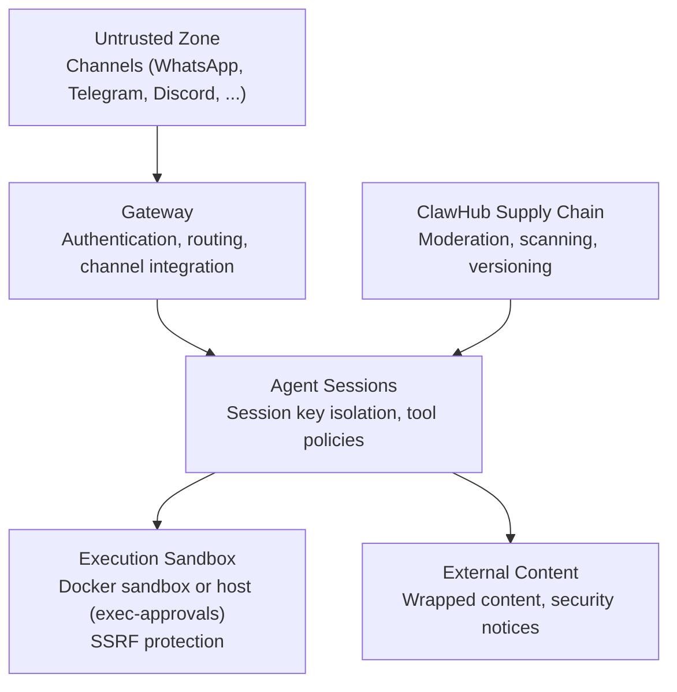
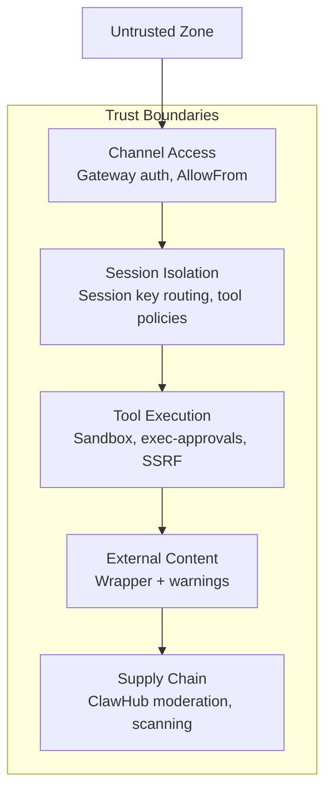
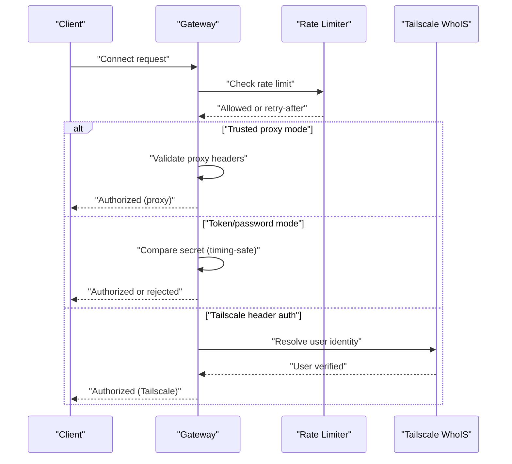
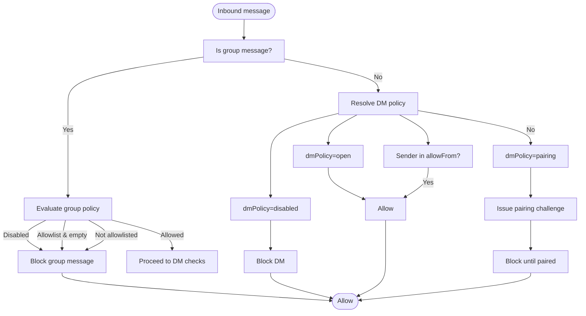
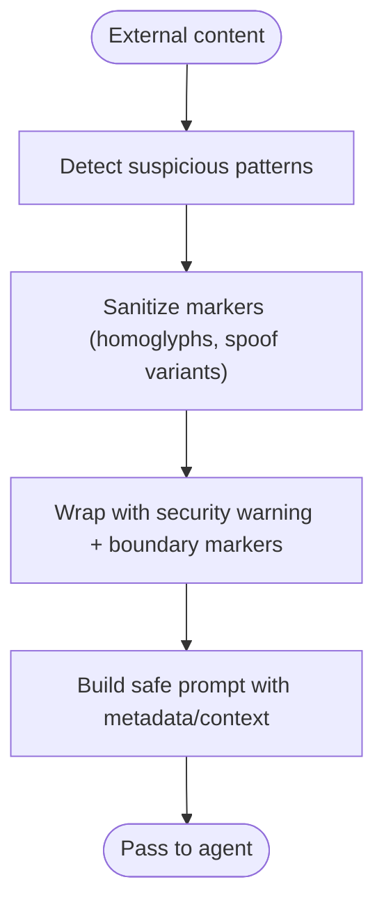
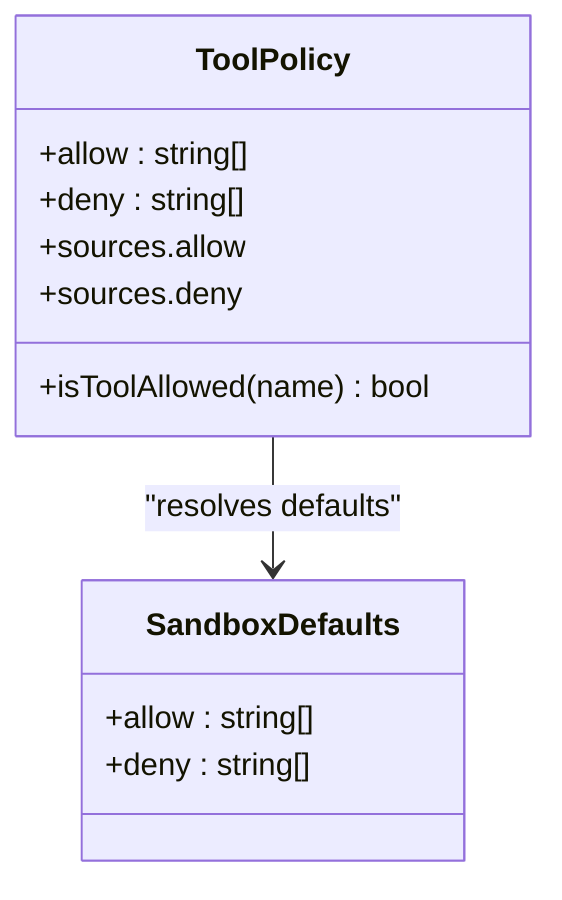
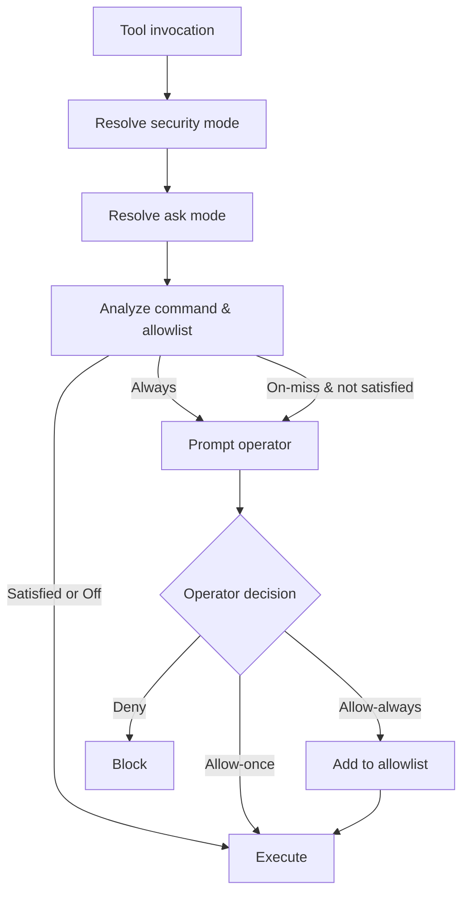
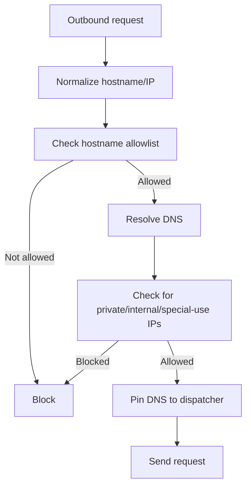
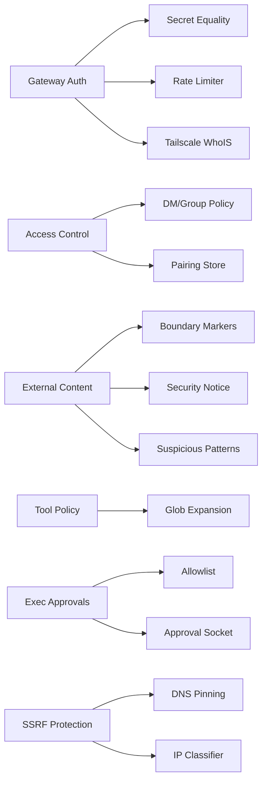

# Threat Model & Risk Assessment

<cite>
**Referenced Files in This Document**
- [docs/security/THREAT-MODEL-ATLAS.md](file://docs/security/THREAT-MODEL-ATLAS.md)
- [docs/security/README.md](file://docs/security/README.md)
- [docs/security/CONTRIBUTING-THREAT-MODEL.md](file://docs/security/CONTRIBUTING-THREAT-MODEL.md)
- [SECURITY.md](file://SECURITY.md)
- [src/security/external-content.ts](file://src/security/external-content.ts)
- [src/agents/sandbox/tool-policy.ts](file://src/agents/sandbox/tool-policy.ts)
- [src/gateway/auth.ts](file://src/gateway/auth.ts)
- [src/infra/exec-approvals.ts](file://src/infra/exec-approvals.ts)
- [src/infra/net/ssrf.ts](file://src/infra/net/ssrf.ts)
- [src/web/inbound/access-control.ts](file://src/web/inbound/access-control.ts)
- [src/security/dm-policy-shared.ts](file://src/security/dm-policy-shared.ts)
- [src/security/secret-equal.ts](file://src/security/secret-equal.ts)
</cite>

## Table of Contents
1. [Introduction](#introduction)
2. [Project Structure](#project-structure)
3. [Core Components](#core-components)
4. [Architecture Overview](#architecture-overview)
5. [Detailed Component Analysis](#detailed-component-analysis)
6. [Dependency Analysis](#dependency-analysis)
7. [Performance Considerations](#performance-considerations)
8. [Troubleshooting Guide](#troubleshooting-guide)
9. [Conclusion](#conclusion)
10. [Appendices](#appendices)

## Introduction
This document presents a comprehensive MITRE ATLAS-based threat model and risk assessment for the OpenClaw ecosystem. It identifies potential attack vectors, threat actors, and security risks across the agent runtime, gateway, channel integrations, ClawHub supply chain, and MCP servers. It explains the threat assessment methodology, risk scoring, and mitigation strategies, and details security boundaries, attack surfaces, and trust zones. It also provides guidance for contributing new threats, mitigations, and attack chains, along with practical steps for threat modeling exercises and security design reviews.

## Project Structure
OpenClaw’s security architecture is centered around layered trust boundaries and explicit separation of concerns:
- Untrusted zone: Channels (WhatsApp, Telegram, Discord, etc.)
- Trust boundary 1: Channel access control and gateway authentication
- Trust boundary 2: Session isolation and routing
- Trust boundary 3: Tool execution with sandboxing and approvals
- Trust boundary 4: External content handling
- Trust boundary 5: Supply chain for ClawHub skills

**Diagram sources**
- [docs/security/THREAT-MODEL-ATLAS.md](file://docs/security/THREAT-MODEL-ATLAS.md#L60-L123)

**Section sources**
- [docs/security/THREAT-MODEL-ATLAS.md](file://docs/security/THREAT-MODEL-ATLAS.md#L56-L123)

## Core Components
- Gateway authentication and authorization: token/password/Tailscale/trusted-proxy modes, rate limiting, and device auth.
- Channel access control: AllowFrom lists, pairing grace periods, and DM/group policy enforcement.
- External content handling: Suspicious pattern detection, boundary markers, security notices, and content wrapping.
- Tool policy and sandboxing: Glob-based allow/deny rules, image allowance, and sandbox defaults.
- Execution approvals: Allowlist-driven decisions, socket-based UI, timeouts, and security modes.
- SSRF protection: DNS pinning, hostname allowlists, blocked hostnames/IPs, and dispatcher pinning.

**Section sources**
- [src/gateway/auth.ts](file://src/gateway/auth.ts#L217-L292)
- [src/web/inbound/access-control.ts](file://src/web/inbound/access-control.ts#L41-L223)
- [src/security/external-content.ts](file://src/security/external-content.ts#L17-L346)
- [src/agents/sandbox/tool-policy.ts](file://src/agents/sandbox/tool-policy.ts#L16-L110)
- [src/infra/exec-approvals.ts](file://src/infra/exec-approvals.ts#L482-L588)
- [src/infra/net/ssrf.ts](file://src/infra/net/ssrf.ts#L276-L364)

## Architecture Overview
The MITRE ATLAS threat model organizes risks by tactics and techniques. OpenClaw’s trust model emphasizes:
- Operator trust model: authenticated callers are trusted operators for a given gateway instance; session keys are routing controls, not authorization boundaries.
- Separation of routing and execution: Gateway is control plane; Node is remote execution extension; exec approvals are operator guardrails.
- Explicit boundaries: Gateway auth, session isolation, sandboxing, external content wrapping, and supply chain moderation.

**Diagram sources**
- [docs/security/THREAT-MODEL-ATLAS.md](file://docs/security/THREAT-MODEL-ATLAS.md#L58-L123)
- [SECURITY.md](file://SECURITY.md#L88-L170)

**Section sources**
- [docs/security/THREAT-MODEL-ATLAS.md](file://docs/security/THREAT-MODEL-ATLAS.md#L58-L123)
- [SECURITY.md](file://SECURITY.md#L88-L170)

## Detailed Component Analysis

### Gateway Authentication and Authorization
- Modes: none/token/password/trusted-proxy; Tailscale support gated by mode and configuration.
- Rate limiting: shared-secret scope, retry-after handling.
- Device/Tailscale auth: verified via WhoIS and headers; loopback-only enforcement for local access.
- Security: constant-time comparison for secrets.

**Diagram sources**
- [src/gateway/auth.ts](file://src/gateway/auth.ts#L378-L485)
- [src/security/secret-equal.ts](file://src/security/secret-equal.ts#L3-L12)

**Section sources**
- [src/gateway/auth.ts](file://src/gateway/auth.ts#L217-L292)
- [src/gateway/auth.ts](file://src/gateway/auth.ts#L378-L485)
- [src/security/secret-equal.ts](file://src/security/secret-equal.ts#L3-L12)

### Channel Access Control (DM/Group Policies)
- DM policy modes: open, allowlist, disabled, pairing (default).
- Group policy modes: open, allowlist, disabled.
- AllowFrom lists: configurable, pairing-store-backed, and normalized.
- Pairing grace period: 30 seconds for initial pairing replies.
- Self-chat mode: secure default allowing owner to talk to themselves.

**Diagram sources**
- [src/web/inbound/access-control.ts](file://src/web/inbound/access-control.ts#L41-L223)
- [src/security/dm-policy-shared.ts](file://src/security/dm-policy-shared.ts#L105-L196)

**Section sources**
- [src/web/inbound/access-control.ts](file://src/web/inbound/access-control.ts#L41-L223)
- [src/security/dm-policy-shared.ts](file://src/security/dm-policy-shared.ts#L105-L196)

### External Content Handling
- Suspicious pattern detection for prompt injection attempts.
- Unique boundary markers with randomized IDs to prevent spoofing.
- Security notice injection and content wrapping for emails/webhooks/web tools.
- Homoglyph folding and marker sanitization to mitigate wrapper escapes.

**Diagram sources**
- [src/security/external-content.ts](file://src/security/external-content.ts#L17-L346)

**Section sources**
- [src/security/external-content.ts](file://src/security/external-content.ts#L17-L346)

### Tool Policy and Sandbox Controls
- Glob-based allow/deny rules with agent/global precedence.
- Default allowances include “image” for multimodal workflows unless explicitly denied.
- Tool policy resolution considers agent-level overrides and defaults.

**Diagram sources**
- [src/agents/sandbox/tool-policy.ts](file://src/agents/sandbox/tool-policy.ts#L16-L110)

**Section sources**
- [src/agents/sandbox/tool-policy.ts](file://src/agents/sandbox/tool-policy.ts#L16-L110)

### Execution Approvals and Sandboxing
- Security modes: deny, allowlist, full; Ask modes: off, on-miss, always.
- Allowlist entries with normalized patterns and usage tracking.
- Socket-based UI for interactive approvals with timeouts.
- Defaults include deny-by-default and on-miss behavior.

**Diagram sources**
- [src/infra/exec-approvals.ts](file://src/infra/exec-approvals.ts#L482-L588)

**Section sources**
- [src/infra/exec-approvals.ts](file://src/infra/exec-approvals.ts#L482-L588)

### SSRF Protection
- Hostname allowlists and blocked hostnames/IPs.
- DNS pinning and dispatcher pinning to prevent internal pivots.
- Private network toggles with explicit opt-in.

**Diagram sources**
- [src/infra/net/ssrf.ts](file://src/infra/net/ssrf.ts#L276-L364)

**Section sources**
- [src/infra/net/ssrf.ts](file://src/infra/net/ssrf.ts#L276-L364)

### Supply Chain (ClawHub) Moderation
- Current controls: GitHub account age, path sanitization, file type validation, size limits, pattern-based moderation, moderation status.
- Planned improvements: VirusTotal integration, community reporting, audit logging, badge system.
- Risk: Pattern-based moderation is easily bypassed; skills run with agent privileges.

**Section sources**
- [docs/security/THREAT-MODEL-ATLAS.md](file://docs/security/THREAT-MODEL-ATLAS.md#L438-L482)
- [docs/security/THREAT-MODEL-ATLAS.md](file://docs/security/THREAT-MODEL-ATLAS.md#L450-L473)

## Dependency Analysis
- Gateway auth depends on secret equality, rate limiting, and optional Tailscale integration.
- Channel access control depends on DM/group policy resolution and pairing store.
- External content handling depends on boundary markers, security notices, and pattern detection.
- Tool policy depends on glob expansion and agent/global configuration.
- Execution approvals depend on allowlist entries, socket communication, and security modes.
- SSRF protection depends on hostname/IP classifiers and pinned dispatchers.

**Diagram sources**
- [src/gateway/auth.ts](file://src/gateway/auth.ts#L378-L485)
- [src/security/secret-equal.ts](file://src/security/secret-equal.ts#L3-L12)
- [src/web/inbound/access-control.ts](file://src/web/inbound/access-control.ts#L41-L223)
- [src/security/dm-policy-shared.ts](file://src/security/dm-policy-shared.ts#L105-L196)
- [src/security/external-content.ts](file://src/security/external-content.ts#L17-L346)
- [src/agents/sandbox/tool-policy.ts](file://src/agents/sandbox/tool-policy.ts#L16-L110)
- [src/infra/exec-approvals.ts](file://src/infra/exec-approvals.ts#L482-L588)
- [src/infra/net/ssrf.ts](file://src/infra/net/ssrf.ts#L276-L364)

**Section sources**
- [src/gateway/auth.ts](file://src/gateway/auth.ts#L378-L485)
- [src/web/inbound/access-control.ts](file://src/web/inbound/access-control.ts#L41-L223)
- [src/security/external-content.ts](file://src/security/external-content.ts#L17-L346)
- [src/agents/sandbox/tool-policy.ts](file://src/agents/sandbox/tool-policy.ts#L16-L110)
- [src/infra/exec-approvals.ts](file://src/infra/exec-approvals.ts#L482-L588)
- [src/infra/net/ssrf.ts](file://src/infra/net/ssrf.ts#L276-L364)

## Performance Considerations
- External content wrapping adds CPU overhead for pattern detection and marker sanitization; batching and caching may help.
- DNS pinning and SSRF checks introduce latency; consider connection pooling and pinned dispatchers.
- Execution approvals add interactivity latency; tune ask modes and timeouts for UX vs. safety balance.
- Rate limiting and Tailscale WhoIS lookups add minimal overhead but are essential for security.

## Troubleshooting Guide
Common operational pitfalls and mitigations:
- Prompt-injection-only chains without boundary bypass are out of scope; ensure boundary crossings (auth, policy, sandbox) are demonstrated.
- Operator-enabled trusted surfaces (e.g., canvas eval, browser evaluate, node.invoke) are intentional when enabled; do not treat as vulnerabilities without a boundary bypass.
- Host-first exec defaults require explicit sandboxing for isolation; enable sandbox mode and strict tool policies.
- For multi-tenant setups, use separate gateways per user or strict host isolation; shared gateways with untrusted operators are out of scope.

**Section sources**
- [SECURITY.md](file://SECURITY.md#L48-L131)

## Conclusion
OpenClaw’s MITRE ATLAS-based threat model highlights critical risks in prompt injection, supply chain compromise, execution bypass, and external content handling. The model emphasizes operator trust, explicit trust boundaries, and layered defenses. Prioritized recommendations focus on completing VirusTotal integration, implementing skill sandboxing, strengthening exec approval UX/validation, and adding output validation for sensitive actions. Contributions to the threat model are welcomed via the documented process.

## Appendices

### Threat Assessment Methodology and Risk Scoring
- Likelihood vs. impact matrix drives risk levels: Critical, High, Medium, Low.
- Priority assignments (P0–P2) guide remediation sequencing.
- Attack chains illustrate realistic combinations of threats.

**Section sources**
- [docs/security/THREAT-MODEL-ATLAS.md](file://docs/security/THREAT-MODEL-ATLAS.md#L485-L527)

### Contribution Process for Threats, Mitigations, and Attack Chains
- Add a threat: open an issue describing the scenario; ATLAS mapping and risk assessment handled during review.
- Suggest a mitigation: specific and actionable; reference the threat.
- Propose an attack chain: narrative of chained steps.
- Fix/improve existing content: PRs welcome.

**Section sources**
- [docs/security/CONTRIBUTING-THREAT-MODEL.md](file://docs/security/CONTRIBUTING-THREAT-MODEL.md#L5-L91)

### Practical Guidance for Threat Modeling Exercises and Security Design Reviews
- Use the trust boundary matrix to triage risk quickly.
- Focus on boundary crossings: auth, policy, sandbox, and session isolation.
- Apply the operator trust model: authenticated callers are trusted operators; session keys are routing controls, not authorization boundaries.
- Enforce local-first defaults: loopback-only gateway, disable public exposure, and prefer sandboxing.

**Section sources**
- [docs/security/README.md](file://docs/security/README.md#L1-L18)
- [SECURITY.md](file://SECURITY.md#L205-L243)