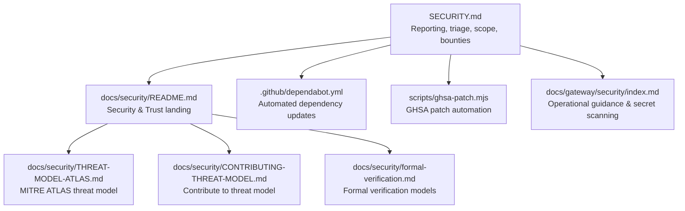
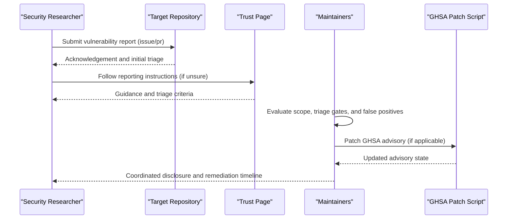
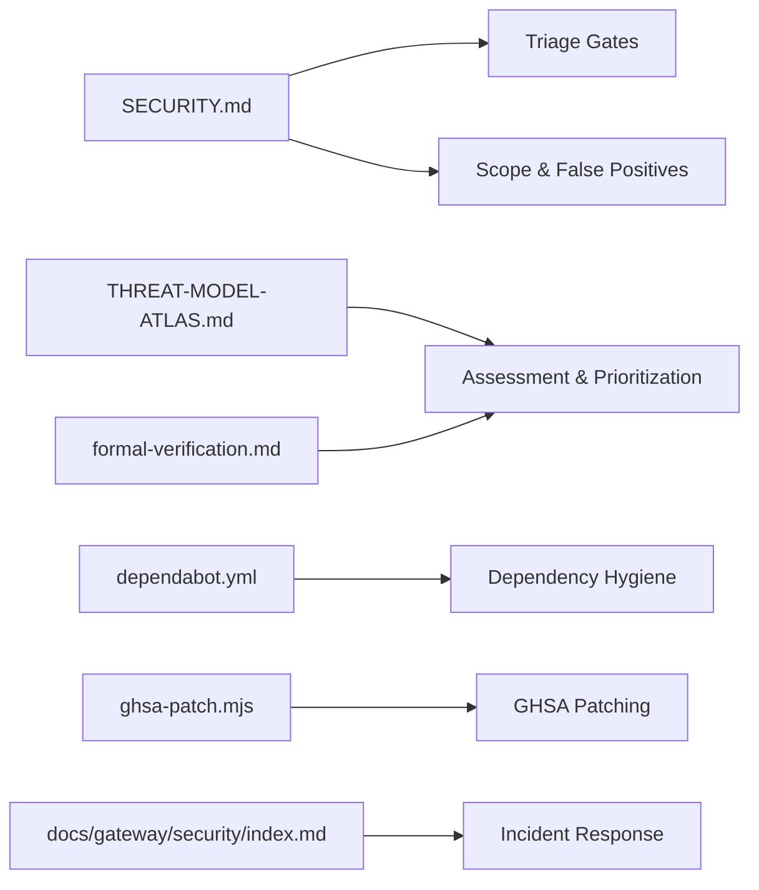

# Vulnerability Management & Reporting

<cite>
**Referenced Files in This Document**
- [SECURITY.md](file://SECURITY.md)
- [CONTRIBUTING.md](file://CONTRIBUTING.md)
- [docs/security/README.md](file://docs/security/README.md)
- [docs/security/CONTRIBUTING-THREAT-MODEL.md](file://docs/security/CONTRIBUTING-THREAT-MODEL.md)
- [docs/security/THREAT-MODEL-ATLAS.md](file://docs/security/THREAT-MODEL-ATLAS.md)
- [docs/security/formal-verification.md](file://docs/security/formal-verification.md)
- [.github/dependabot.yml](file://.github/dependabot.yml)
- [scripts/ghsa-patch.mjs](file://scripts/ghsa-patch.mjs)
- [docs/gateway/security/index.md](file://docs/gateway/security/index.md)
</cite>

## Table of Contents
1. [Introduction](#introduction)
2. [Project Structure](#project-structure)
3. [Core Components](#core-components)
4. [Architecture Overview](#architecture-overview)
5. [Detailed Component Analysis](#detailed-component-analysis)
6. [Dependency Analysis](#dependency-analysis)
7. [Performance Considerations](#performance-considerations)
8. [Troubleshooting Guide](#troubleshooting-guide)
9. [Conclusion](#conclusion)

## Introduction
This document defines OpenClaw’s vulnerability management and reporting procedures. It consolidates responsible disclosure channels, triage gates, assessment criteria, and operational guidance for researchers and contributors. It also outlines the threat model, formal verification efforts, and supply chain security controls that inform vulnerability assessment and remediation.

## Project Structure
Security-related materials are distributed across:
- A centralized vulnerability reporting and policy document
- A security-focused documentation hub
- A threat model and contribution guide
- Formal verification models
- Automation for dependency updates and GHSA patching
- Operational guidance for incident response and secret scanning

**Diagram sources**
- [SECURITY.md](file://SECURITY.md#L1-L286)
- [docs/security/README.md](file://docs/security/README.md#L1-L18)
- [docs/security/THREAT-MODEL-ATLAS.md](file://docs/security/THREAT-MODEL-ATLAS.md#L1-L604)
- [docs/security/CONTRIBUTING-THREAT-MODEL.md](file://docs/security/CONTRIBUTING-THREAT-MODEL.md#L1-L91)
- [docs/security/formal-verification.md](file://docs/security/formal-verification.md#L1-L168)
- [.github/dependabot.yml](file://.github/dependabot.yml#L1-L128)
- [scripts/ghsa-patch.mjs](file://scripts/ghsa-patch.mjs#L94-L168)
- [docs/gateway/security/index.md](file://docs/gateway/security/index.md#L1152-L1199)

**Section sources**
- [SECURITY.md](file://SECURITY.md#L1-L286)
- [docs/security/README.md](file://docs/security/README.md#L1-L18)

## Core Components
- Vulnerability reporting and triage gates
- Responsible disclosure and contact channels
- Scope, out-of-scope items, and false-positive patterns
- Trust model and operational guidance
- Threat model and contribution process
- Formal verification models
- Dependency update automation and GHSA patching
- Secret scanning and incident response guidance

**Section sources**
- [SECURITY.md](file://SECURITY.md#L3-L130)
- [docs/security/README.md](file://docs/security/README.md#L10-L17)
- [docs/security/THREAT-MODEL-ATLAS.md](file://docs/security/THREAT-MODEL-ATLAS.md#L1-L604)
- [docs/security/formal-verification.md](file://docs/security/formal-verification.md#L1-L168)
- [.github/dependabot.yml](file://.github/dependabot.yml#L1-L128)
- [scripts/ghsa-patch.mjs](file://scripts/ghsa-patch.mjs#L94-L168)
- [docs/gateway/security/index.md](file://docs/gateway/security/index.md#L1152-L1199)

## Architecture Overview
The vulnerability lifecycle integrates researcher submission, triage, assessment, remediation, and communication. The process is anchored by a central policy and supported by the threat model and formal verification models.

**Diagram sources**
- [SECURITY.md](file://SECURITY.md#L3-L86)
- [docs/security/README.md](file://docs/security/README.md#L10-L17)
- [scripts/ghsa-patch.mjs](file://scripts/ghsa-patch.mjs#L94-L168)

## Detailed Component Analysis

### Vulnerability Reporting and Responsible Disclosure
- Reporting channels:
  - Direct to the repository where the issue resides
  - General email for unclear cases
- Required report elements:
  - Title, severity assessment, impact, affected component
  - Technical reproduction, demonstrated impact, environment
  - Remediation advice
- Triage fast path:
  - Exact vulnerable path, tested version, reproducible PoC
  - Impact tied to documented trust boundaries
  - Proof of credential ownership for exposed-secret reports
  - Scope check and boundary-bypass requirement for parity-only claims
- Duplicate handling:
  - Search existing advisories and include likely GHSA IDs
  - Canonical reports preferred

**Section sources**
- [SECURITY.md](file://SECURITY.md#L3-L86)
- [CONTRIBUTING.md](file://CONTRIBUTING.md#L162-L187)

### Scope, Out-of-Scope, and False Positives
- Out of scope:
  - Public internet exposure, misuse of documented guidance
  - Multi-tenant assumptions on shared gateway host/config
  - Prompt-injection-only without boundary bypass
  - Operator-controlled state and explicit trusted-operator surfaces
  - Heuristic/parity differences without boundary bypass
  - Availability impacts dependent on trusted operator configuration
- False positives:
  - Scanner-only stale claims, missing HSTS on loopback-only deployments
  - Slack/Discord webhook signature findings when verified by existing mechanisms
  - Microsoft Teams upload URL claims without authenticated event context

**Section sources**
- [SECURITY.md](file://SECURITY.md#L112-L131)
- [SECURITY.md](file://SECURITY.md#L48-L68)

### Trust Model and Operational Guidance
- Trust model:
  - One trusted operator per gateway; session identifiers are routing controls
  - Gateway callers treated as trusted; exec behavior host-first by default
- Operational guidance:
  - Web UI intended for local use; bind loopback by default
  - Sub-agent delegation hardening and tool filesystem restrictions
  - Runtime requirements and Docker security recommendations

**Section sources**
- [SECURITY.md](file://SECURITY.md#L88-L170)
- [SECURITY.md](file://SECURITY.md#L205-L286)

### Threat Model and Contribution
- MITRE ATLAS-based threat model with attack chains and risk matrix
- Contribution pathways:
  - Add threats, suggest mitigations, propose attack chains, improve content
- Review process:
  - Triage, assessment, documentation, merge
- Recognition for contributors to the threat model

**Section sources**
- [docs/security/THREAT-MODEL-ATLAS.md](file://docs/security/THREAT-MODEL-ATLAS.md#L1-L604)
- [docs/security/CONTRIBUTING-THREAT-MODEL.md](file://docs/security/CONTRIBUTING-THREAT-MODEL.md#L1-L91)

### Formal Verification Models
- Executable security regression suite using TLA+/TLC
- Claims around gateway exposure, nodes.run pipeline, pairing store, ingress gating, and routing/session isolation
- Caveats: models are not the full codebase; bounded by explored state space

**Section sources**
- [docs/security/formal-verification.md](file://docs/security/formal-verification.md#L1-L168)

### Dependency Updates and GHSA Patching
- Automated dependency updates via Dependabot across ecosystems
- GHSA patch script for updating advisories with proper API headers

**Section sources**
- [.github/dependabot.yml](file://.github/dependabot.yml#L1-L128)
- [scripts/ghsa-patch.mjs](file://scripts/ghsa-patch.mjs#L94-L168)

### Secret Scanning and Incident Response
- Secret scanning with detect-secrets in CI and local workflows
- Incident response steps:
  - Contain, rotate secrets, review artifacts, re-run audit
- Operational guidance for hardening and deployment assumptions

**Section sources**
- [docs/gateway/security/index.md](file://docs/gateway/security/index.md#L1152-L1199)
- [SECURITY.md](file://SECURITY.md#L275-L286)

## Dependency Analysis
The vulnerability management stack relies on:
- Centralized policy and triage criteria
- Threat model and formal verification for assessment
- Automation for dependency hygiene and GHSA updates
- Operational guidance for incident response and secret scanning

**Diagram sources**
- [SECURITY.md](file://SECURITY.md#L3-L130)
- [docs/security/THREAT-MODEL-ATLAS.md](file://docs/security/THREAT-MODEL-ATLAS.md#L1-L604)
- [docs/security/formal-verification.md](file://docs/security/formal-verification.md#L1-L168)
- [.github/dependabot.yml](file://.github/dependabot.yml#L1-L128)
- [scripts/ghsa-patch.mjs](file://scripts/ghsa-patch.mjs#L94-L168)
- [docs/gateway/security/index.md](file://docs/gateway/security/index.md#L1152-L1199)

**Section sources**
- [SECURITY.md](file://SECURITY.md#L3-L130)
- [docs/security/THREAT-MODEL-ATLAS.md](file://docs/security/THREAT-MODEL-ATLAS.md#L1-L604)
- [docs/security/formal-verification.md](file://docs/security/formal-verification.md#L1-L168)
- [.github/dependabot.yml](file://.github/dependabot.yml#L1-L128)
- [scripts/ghsa-patch.mjs](file://scripts/ghsa-patch.mjs#L94-L168)
- [docs/gateway/security/index.md](file://docs/gateway/security/index.md#L1152-L1199)

## Performance Considerations
- Use the triage fast path to expedite evaluation and reduce maintenance overhead
- Prefer boundary-bypass demonstrations to avoid false positives and reduce noise
- Apply the threat model and formal verification insights to focus remediation on high-impact attack chains

[No sources needed since this section provides general guidance]

## Troubleshooting Guide
Common triage pitfalls and resolutions:
- Missing reproduction steps or remediation advice: prioritize quality reports
- Boundary-bypass requirements for parity-only claims: demonstrate auth/approval/sandbox bypass
- Scope exclusions: confirm deployments align with documented trust model and assumptions
- Secret scanning failures: reproduce locally, audit false positives, update baseline

**Section sources**
- [SECURITY.md](file://SECURITY.md#L33-L86)
- [SECURITY.md](file://SECURITY.md#L112-L131)
- [docs/gateway/security/index.md](file://docs/gateway/security/index.md#L1152-L1199)

## Conclusion
OpenClaw’s vulnerability management integrates a clear reporting policy, rigorous triage gates, and a robust threat model and formal verification foundation. Researchers are encouraged to follow the fast-path triage criteria, provide boundary-bypass demonstrations, and coordinate disclosures. Maintainers leverage automated dependency updates, GHSA patching, and operational guidance to remediate and communicate fixes efficiently.