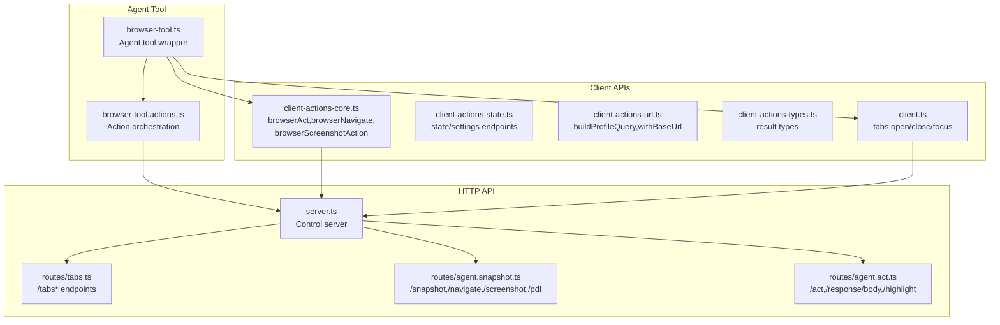
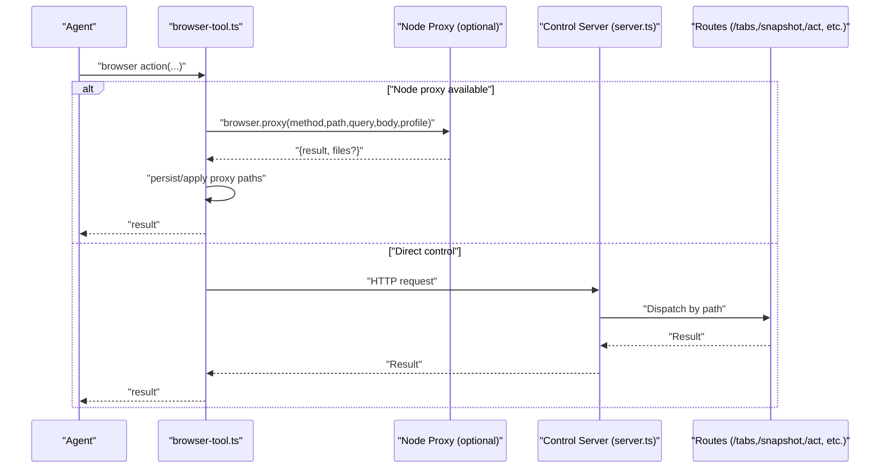
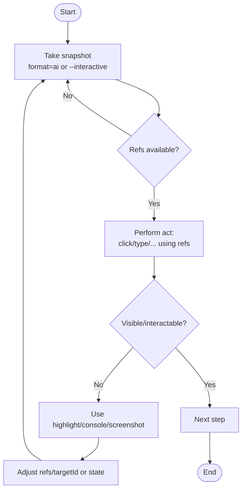
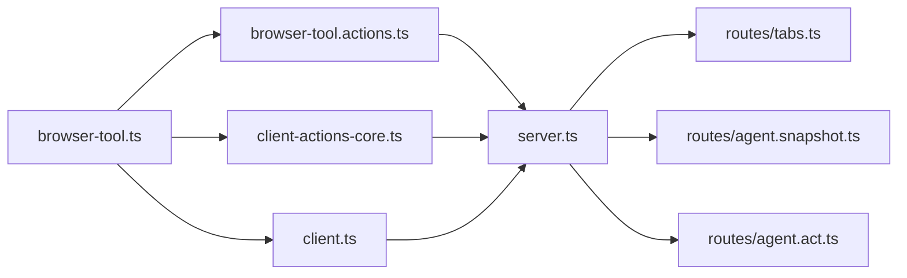

# Browser Actions

<cite>
**Referenced Files in This Document**
- [browser.md](file://docs/tools/browser.md)
- [browser-login.md](file://docs/tools/browser-login.md)
- [browser-tool.ts](file://src/agents/tools/browser-tool.ts)
- [browser-tool.actions.ts](file://src/agents/tools/browser-tool.actions.ts)
- [client-actions-core.ts](file://src/browser/client-actions-core.ts)
- [client-actions-state.ts](file://src/browser/client-actions-state.ts)
- [client-actions-url.ts](file://src/browser/client-actions-url.ts)
- [client-actions-types.ts](file://src/browser/client-actions-types.ts)
- [client.ts](file://src/browser/client.ts)
- [agent.act.ts](file://src/browser/routes/agent.act.ts)
- [agent.snapshot.ts](file://src/browser/routes/agent.snapshot.ts)
- [tabs.ts](file://src/browser/routes/tabs.ts)
- [server.ts](file://src/browser/server.ts)
</cite>

## Table of Contents
1. [Introduction](#introduction)
2. [Project Structure](#project-structure)
3. [Core Components](#core-components)
4. [Architecture Overview](#architecture-overview)
5. [Detailed Component Analysis](#detailed-component-analysis)
6. [Dependency Analysis](#dependency-analysis)
7. [Performance Considerations](#performance-considerations)
8. [Troubleshooting Guide](#troubleshooting-guide)
9. [Conclusion](#conclusion)

## Introduction
This document explains browser automation actions in OpenClaw. It covers the agent tool and underlying HTTP API for controlling a managed or relayed browser, including status, lifecycle, tabs, navigation, snapshots, screenshots, actions, and console inspection. It also documents UI interaction patterns using snapshot references, element selection, action chaining, conditional execution, limitations, and best practices for reliable automation.

## Project Structure
OpenClaw exposes a single agent tool named browser that maps to a local or proxied HTTP control plane. The tool orchestrates requests to routes under / for lifecycle/status, /tabs for tab management, /snapshot and /screenshot for inspection, /navigate and /act for interactions, and /console for diagnostics.

**Diagram sources**
- [browser-tool.ts](file://src/agents/tools/browser-tool.ts#L281-L660)
- [browser-tool.actions.ts](file://src/agents/tools/browser-tool.actions.ts#L88-L289)
- [server.ts](file://src/browser/server.ts#L20-L100)
- [tabs.ts](file://src/browser/routes/tabs.ts#L102-L223)
- [agent.snapshot.ts](file://src/browser/routes/agent.snapshot.ts#L88-L343)
- [agent.act.ts](file://src/browser/routes/agent.act.ts#L21-L381)
- [client-actions-core.ts](file://src/browser/client-actions-core.ts#L1-L260)
- [client-actions-state.ts](file://src/browser/client-actions-state.ts#L1-L279)
- [client-actions-url.ts](file://src/browser/client-actions-url.ts#L1-L12)
- [client-actions-types.ts](file://src/browser/client-actions-types.ts#L1-L17)
- [client.ts](file://src/browser/client.ts#L218-L276)

**Section sources**
- [browser.md](file://docs/tools/browser.md#L369-L431)
- [server.ts](file://src/browser/server.ts#L20-L100)

## Core Components
- Agent tool: browser
  - Action categories: status, start, stop, tabs, open, focus, close, snapshot, screenshot, navigate, act, console, pdf, upload, dialog
  - Supports target selection (sandbox, host, node) and profile selection (openclaw, chrome, remote CDP)
  - Can auto-route to a node-hosted browser proxy when available
- HTTP control plane
  - Loopback-only server exposing endpoints for lifecycle, tabs, snapshots, screenshots, navigation, actions, state, and diagnostics
- Client APIs
  - Typed request/response shapes for actions and state operations
  - Helpers for building profile queries and base URLs

**Section sources**
- [browser-tool.ts](file://src/agents/tools/browser-tool.ts#L281-L660)
- [client-actions-core.ts](file://src/browser/client-actions-core.ts#L1-L260)
- [client-actions-state.ts](file://src/browser/client-actions-state.ts#L1-L279)
- [client-actions-url.ts](file://src/browser/client-actions-url.ts#L1-L12)
- [client-actions-types.ts](file://src/browser/client-actions-types.ts#L1-L17)
- [client.ts](file://src/browser/client.ts#L218-L276)

## Architecture Overview
The browser tool translates high-level actions into HTTP requests against the control server. The server validates inputs, resolves target tabs, optionally uses Playwright for advanced operations, and returns structured results. Proxy mode allows routing to a node-hosted browser when available.

**Diagram sources**
- [browser-tool.ts](file://src/agents/tools/browser-tool.ts#L321-L358)
- [server.ts](file://src/browser/server.ts#L53-L61)
- [tabs.ts](file://src/browser/routes/tabs.ts#L102-L223)
- [agent.snapshot.ts](file://src/browser/routes/agent.snapshot.ts#L88-L343)
- [agent.act.ts](file://src/browser/routes/agent.act.ts#L21-L381)

## Detailed Component Analysis

### Action Reference: status
- Purpose: Query browser control server status and running state
- Parameters
  - profile: string (optional)
- Returns
  - JSON object indicating running state and metadata (e.g., PID, CDP URL/port)
- Usage pattern
  - Call before start/open to confirm readiness
- Notes
  - In proxy mode, the proxy returns the upstream status

**Section sources**
- [browser-tool.ts](file://src/agents/tools/browser-tool.ts#L361-L371)
- [browser.md](file://docs/tools/browser.md#L436-L440)

### Action Reference: start
- Purpose: Start the browser (managed or relayed)
- Parameters
  - profile: string (optional)
- Returns
  - Updated status after start
- Usage pattern
  - Use after status indicates not running
- Notes
  - In proxy mode, start is routed to the node and followed by a status refresh

**Section sources**
- [browser-tool.ts](file://src/agents/tools/browser-tool.ts#L372-L388)
- [browser.md](file://docs/tools/browser.md#L438-L440)

### Action Reference: stop
- Purpose: Stop the browser
- Parameters
  - profile: string (optional)
- Returns
  - Updated status after stop
- Usage pattern
  - Use to clean up after automation
- Notes
  - In proxy mode, stop is routed to the node and followed by a status refresh

**Section sources**
- [browser-tool.ts](file://src/agents/tools/browser-tool.ts#L389-L405)
- [browser.md](file://docs/tools/browser.md#L439-L440)

### Action Reference: tabs
- Purpose: List tabs or perform tab actions
- Parameters
  - action: "list" | "new" | "close" | "select"
  - index: number (for select/new/close)
  - profile: string (optional)
- Returns
  - For list: array of tabs with targetId/url
  - For new/close/select: ok
- Usage pattern
  - Use list to enumerate tabs, select to focus, new to open blank tab, close to dispose
- Notes
  - In proxy mode, list is routed to the node

**Section sources**
- [browser-tool.ts](file://src/agents/tools/browser-tool.ts#L415-L416)
- [tabs.ts](file://src/browser/routes/tabs.ts#L102-L223)
- [browser.md](file://docs/tools/browser.md#L441-L448)

### Action Reference: open
- Purpose: Open a URL in a new tab
- Parameters
  - url: string (required)
  - profile: string (optional)
- Returns
  - Tab object with targetId and URL
- Usage pattern
  - Use after start; track targetId for subsequent actions
- Notes
  - Session tracking records the new tab for cleanup

**Section sources**
- [browser-tool.ts](file://src/agents/tools/browser-tool.ts#L417-L436)
- [client.ts](file://src/browser/client.ts#L218-L230)
- [browser.md](file://docs/tools/browser.md#L446-L447)

### Action Reference: focus
- Purpose: Focus a specific tab by targetId
- Parameters
  - targetId: string (required)
  - profile: string (optional)
- Returns
  - ok
- Usage pattern
  - Switch between tabs before acting

**Section sources**
- [browser-tool.ts](file://src/agents/tools/browser-tool.ts#L437-L452)
- [client.ts](file://src/browser/client.ts#L232-L244)
- [browser.md](file://docs/tools/browser.md#L447-L448)

### Action Reference: close
- Purpose: Close a tab or close current page
- Parameters
  - targetId: string (optional)
  - profile: string (optional)
- Returns
  - ok
- Usage pattern
  - Close specific tab by targetId or close current page if omitted
- Notes
  - Session tracking removed on tab close

**Section sources**
- [browser-tool.ts](file://src/agents/tools/browser-tool.ts#L453-L482)
- [client.ts](file://src/browser/client.ts#L246-L256)
- [browser.md](file://docs/tools/browser.md#L448-L449)

### Action Reference: snapshot
- Purpose: Capture a UI snapshot for inspection and ref-based actions
- Parameters
  - profile: string (optional)
  - targetId: string (optional)
  - format: "ai" | "aria" (default "ai" when Playwright available)
  - interactive: boolean (role snapshot)
  - compact: boolean (role snapshot)
  - depth: number (role snapshot)
  - selector: string (role snapshot scope)
  - frame: string (role snapshot scope)
  - labels: boolean (overlay labels on viewport screenshot)
  - efficient: boolean (preset for role snapshot)
  - limit: number (ARIA limit)
  - refs: "role" | "aria" (default "aria")
- Returns
  - Snapshot payload with refs, stats, and optionally labels image path
- Usage pattern
  - Use refs from snapshot to drive click/type/etc
  - Keep targetId stable across calls for reliable refs
- Notes
  - AI snapshots default to numeric refs; role snapshots default to aria refs
  - Refs are not stable across navigations

**Section sources**
- [browser-tool.ts](file://src/agents/tools/browser-tool.ts#L483-L489)
- [agent.snapshot.ts](file://src/browser/routes/agent.snapshot.ts#L212-L343)
- [browser.md](file://docs/tools/browser.md#L534-L553)

### Action Reference: screenshot
- Purpose: Capture a screenshot (full page or element)
- Parameters
  - targetId: string (optional)
  - fullPage: boolean (cannot be used with element/refs)
  - ref: string (element ref from snapshot)
  - element: string (CSS selector for element)
  - type: "png" | "jpeg" (default "png")
  - profile: string (optional)
- Returns
  - Path to saved image file
- Usage pattern
  - Combine with snapshot labels for visual debugging

**Section sources**
- [browser-tool.ts](file://src/agents/tools/browser-tool.ts#L490-L522)
- [client-actions-core.ts](file://src/browser/client-actions-core.ts#L235-L259)
- [agent.snapshot.ts](file://src/browser/routes/agent.snapshot.ts#L148-L210)
- [browser.md](file://docs/tools/browser.md#L549-L553)

### Action Reference: navigate
- Purpose: Navigate the current tab to a URL
- Parameters
  - url: string (required)
  - targetId: string (optional)
  - profile: string (optional)
- Returns
  - TargetId and URL after navigation
- Usage pattern
  - Use after snapshot to ensure targetId stability

**Section sources**
- [browser-tool.ts](file://src/agents/tools/browser-tool.ts#L523-L545)
- [client-actions-core.ts](file://src/browser/client-actions-core.ts#L108-L123)
- [agent.snapshot.ts](file://src/browser/routes/agent.snapshot.ts#L92-L120)
- [browser.md](file://docs/tools/browser.md#L567-L575)

### Action Reference: act
- Purpose: Perform UI interactions using refs from snapshot
- Parameters (kind-specific)
  - click
    - ref: string (required)
    - targetId: string (optional)
    - doubleClick: boolean
    - button: "left"|"right"|"middle"
    - modifiers: string[]
    - timeoutMs: number
  - type
    - ref: string (required)
    - text: string (required)
    - targetId: string (optional)
    - submit: boolean
    - slowly: boolean
    - timeoutMs: number
  - press
    - key: string (required)
    - targetId: string (optional)
    - delayMs: number
  - hover
    - ref: string (required)
    - targetId: string (optional)
    - timeoutMs: number
  - scrollIntoView
    - ref: string (required)
    - targetId: string (optional)
    - timeoutMs: number
  - drag
    - startRef: string (required)
    - endRef: string (required)
    - targetId: string (optional)
    - timeoutMs: number
  - select
    - ref: string (required)
    - values: string[] (required)
    - targetId: string (optional)
    - timeoutMs: number
  - fill
    - fields: array of { ref, type, value? }
    - targetId: string (optional)
    - timeoutMs: number
  - resize
    - width: number (required)
    - height: number (required)
    - targetId: string (optional)
  - wait
    - timeMs: number
    - text: string
    - textGone: string
    - selector: string
    - url: string (glob)
    - loadState: "load"|"domcontentloaded"|"networkidle"
    - fn: string (JS predicate)
    - timeoutMs: number
  - evaluate
    - fn: string (JS predicate)
    - ref: string (optional)
    - targetId: string (optional)
    - timeoutMs: number
  - close
    - targetId: string (optional)
- Returns
  - ok, targetId, url (when applicable)
- Usage patterns
  - Use refs from snapshot to click/type/hover/etc
  - Prefer snapshot+act over wait; use wait only when no reliable UI state exists
  - Use evaluate cautiously; it executes arbitrary JS in page context
- Notes
  - Some Chrome relay targetIds can go stale; the tool retries read-only actions without targetId when exactly one tab remains

**Section sources**
- [browser-tool.ts](file://src/agents/tools/browser-tool.ts#L642-L653)
- [client-actions-core.ts](file://src/browser/client-actions-core.ts#L15-L76)
- [agent.act.ts](file://src/browser/routes/agent.act.ts#L21-L381)
- [browser-tool.actions.ts](file://src/agents/tools/browser-tool.actions.ts#L57-L86)
- [browser.md](file://docs/tools/browser.md#L554-L576)

### Action Reference: console
- Purpose: Retrieve console messages for debugging
- Parameters
  - level: "info"|"warn"|"error"|"debug" (optional)
  - targetId: string (optional)
  - profile: string (optional)
- Returns
  - Messages array and targetId
- Usage pattern
  - Clear and inspect console after failures

**Section sources**
- [browser-tool.ts](file://src/agents/tools/browser-tool.ts#L546-L552)
- [browser-tool.actions.ts](file://src/agents/tools/browser-tool.actions.ts#L242-L289)
- [browser.md](file://docs/tools/browser.md#L463-L463)

### Action Reference: pdf
- Purpose: Save current page as PDF
- Parameters
  - targetId: string (optional)
  - profile: string (optional)
- Returns
  - Path to saved PDF file
- Usage pattern
  - Use after snapshot/navigation for archival

**Section sources**
- [browser-tool.ts](file://src/agents/tools/browser-tool.ts#L553-L567)
- [agent.snapshot.ts](file://src/browser/routes/agent.snapshot.ts#L122-L146)
- [browser.md](file://docs/tools/browser.md#L466-L466)

### Action Reference: upload
- Purpose: Arm a file chooser to select local files
- Parameters
  - paths: string[] (required; must be within uploads root)
  - ref: string (optional; element ref)
  - inputRef: string (optional; input ref)
  - element: string (optional; CSS selector)
  - targetId: string (optional)
  - timeoutMs: number
  - profile: string (optional)
- Returns
  - ok
- Usage pattern
  - Arm before triggering click/press that opens the chooser

**Section sources**
- [browser-tool.ts](file://src/agents/tools/browser-tool.ts#L568-L613)
- [client-actions-core.ts](file://src/browser/client-actions-core.ts#L149-L175)
- [browser.md](file://docs/tools/browser.md#L514-L516)

### Action Reference: dialog
- Purpose: Arm a dialog handler (accept or dismiss)
- Parameters
  - accept: boolean (required)
  - promptText: string (optional; match dialog text)
  - targetId: string (optional)
  - timeoutMs: number
  - profile: string (optional)
- Returns
  - ok
- Usage pattern
  - Arm before triggering action that opens a dialog

**Section sources**
- [browser-tool.ts](file://src/agents/tools/browser-tool.ts#L614-L641)
- [client-actions-core.ts](file://src/browser/client-actions-core.ts#L125-L147)
- [browser.md](file://docs/tools/browser.md#L514-L516)

### Action Reference: State and Environment
- Cookies
  - get: list cookies
  - set: set cookie
  - clear: clear cookies
- Storage
  - local/session get/set/clear
- Settings
  - offline, headers, credentials, geolocation, media, timezone, locale, device
- Parameters
  - targetId: string (optional)
  - profile: string (optional)
- Returns
  - ok, targetId

**Section sources**
- [client-actions-state.ts](file://src/browser/client-actions-state.ts#L70-L279)
- [browser.md](file://docs/tools/browser.md#L607-L622)

### UI Interaction Patterns Using Snapshot References
- Stable refs
  - Use refs from snapshot; avoid CSS selectors for actions
  - Keep targetId consistent across snapshot and act calls
- Element selection
  - Use role-based refs (e12) or numeric refs (AI snapshots)
  - Scope role snapshots to frames or selectors for nested contexts
- Automated actions
  - Click/type/hover/scrollIntoView/drag/select/fill/resize
  - Use evaluate sparingly; ensure evaluateEnabled is permitted

**Diagram sources**
- [agent.snapshot.ts](file://src/browser/routes/agent.snapshot.ts#L212-L343)
- [agent.act.ts](file://src/browser/routes/agent.act.ts#L21-L381)
- [browser.md](file://docs/tools/browser.md#L534-L553)

**Section sources**
- [agent.snapshot.ts](file://src/browser/routes/agent.snapshot.ts#L212-L343)
- [agent.act.ts](file://src/browser/routes/agent.act.ts#L21-L381)
- [browser.md](file://docs/tools/browser.md#L534-L553)

### Common Workflows
- Form filling
  - snapshot --interactive
  - act fill with fields[{ref,type,value}]
  - act click submit button by ref
- Button clicking
  - snapshot --interactive
  - act click by ref
- Navigation sequences
  - open URL
  - snapshot
  - act navigate (optional)
  - act click/type/etc using refs
- Conditional execution
  - act wait with url/loadState/fn/text/selector
  - snapshot to confirm state

**Section sources**
- [browser.md](file://docs/tools/browser.md#L469-L492)
- [agent.act.ts](file://src/browser/routes/agent.act.ts#L223-L276)

### Action Chaining and Conditional Execution
- Chain actions by passing targetId from snapshot response into subsequent act calls
- Use act wait to synchronize on UI changes when necessary
- Prefer snapshot+act over act wait for deterministic UI-driven flows

**Section sources**
- [browser-tool.ts](file://src/agents/tools/browser-tool.ts#L298-L303)
- [agent.act.ts](file://src/browser/routes/agent.act.ts#L223-L276)

### Limitations and Best Practices
- Ref stability
  - Refs change after navigation; re-snapshot and re-use refs
- Selector support
  - Actions require refs from snapshot; CSS selectors are intentionally unsupported
- Evaluate risk
  - Arbitrary JS execution; disable if not needed
- Chrome relay reliability
  - TargetId can become stale; the tool retries read-only actions without targetId when exactly one tab remains
- Sandbox/host control
  - Host control may require allowHostControl or target="host" depending on sandbox policy

**Section sources**
- [browser.md](file://docs/tools/browser.md#L623-L632)
- [browser-tool.actions.ts](file://src/agents/tools/browser-tool.actions.ts#L57-L86)
- [browser-login.md](file://docs/tools/browser-login.md#L40-L68)

## Dependency Analysis
The browser tool depends on client APIs and routes to implement actions. The server enforces auth and dispatches to route handlers. Proxy mode introduces indirection via node.invoke.

**Diagram sources**
- [browser-tool.ts](file://src/agents/tools/browser-tool.ts#L281-L660)
- [browser-tool.actions.ts](file://src/agents/tools/browser-tool.actions.ts#L88-L289)
- [client-actions-core.ts](file://src/browser/client-actions-core.ts#L1-L260)
- [client.ts](file://src/browser/client.ts#L218-L276)
- [server.ts](file://src/browser/server.ts#L53-L61)
- [tabs.ts](file://src/browser/routes/tabs.ts#L102-L223)
- [agent.snapshot.ts](file://src/browser/routes/agent.snapshot.ts#L88-L343)
- [agent.act.ts](file://src/browser/routes/agent.act.ts#L21-L381)

**Section sources**
- [browser-tool.ts](file://src/agents/tools/browser-tool.ts#L281-L660)
- [server.ts](file://src/browser/server.ts#L53-L61)

## Performance Considerations
- Prefer role snapshots for interactive lists; use efficient mode for compact payloads
- Avoid full-page screenshots when element screenshots suffice
- Use evaluate and wait judiciously; they can increase latency
- Keep Playwright installed for richer snapshot and action capabilities

[No sources needed since this section provides general guidance]

## Troubleshooting Guide
- “Browser disabled”
  - Enable via config and restart Gateway
- “Not visible” or “strict mode violation”
  - Re-snapshot, use highlight to inspect, adjust refs/targetId
- Console errors
  - Use console action to retrieve messages
- Chrome extension relay
  - Ensure extension is attached to a tab; use profile="chrome"
- Proxy mode
  - Confirm node-hosted browser is connected and selected

**Section sources**
- [browser.md](file://docs/tools/browser.md#L43-L44)
- [browser.md](file://docs/tools/browser.md#L577-L591)
- [browser-login.md](file://docs/tools/browser-login.md#L19-L34)

## Conclusion
OpenClaw’s browser tool provides a deterministic, ref-based automation surface backed by a local or proxied control server. By combining snapshot-based references with targeted actions, agents can reliably automate UI tasks. Use state and environment controls to tailor the browser behavior, and follow best practices to ensure robust, maintainable automation.