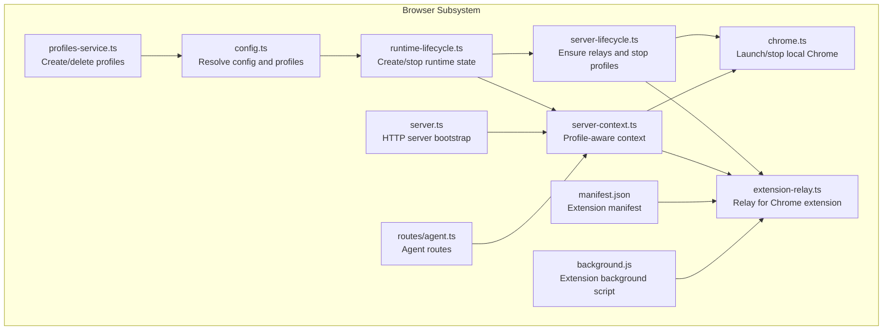
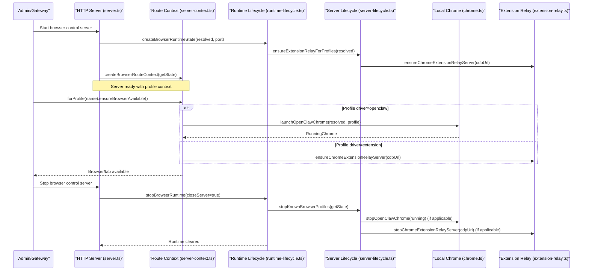
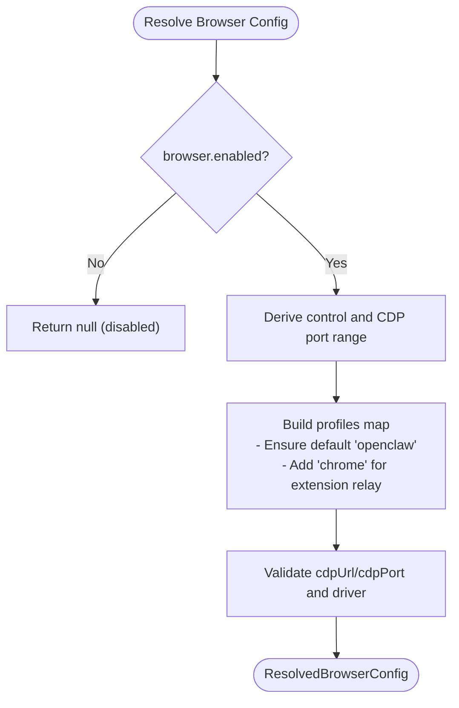
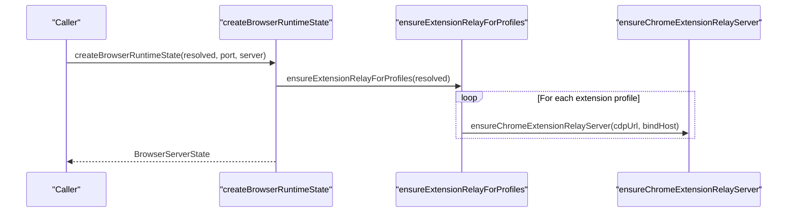
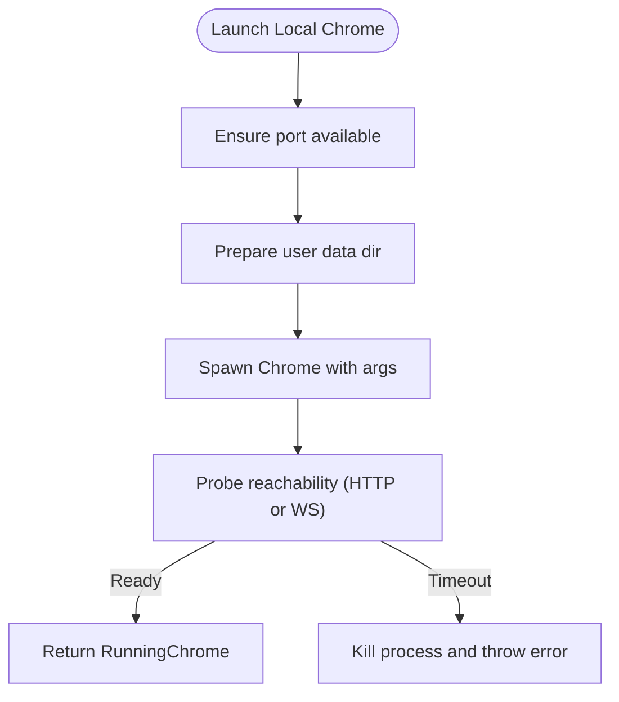
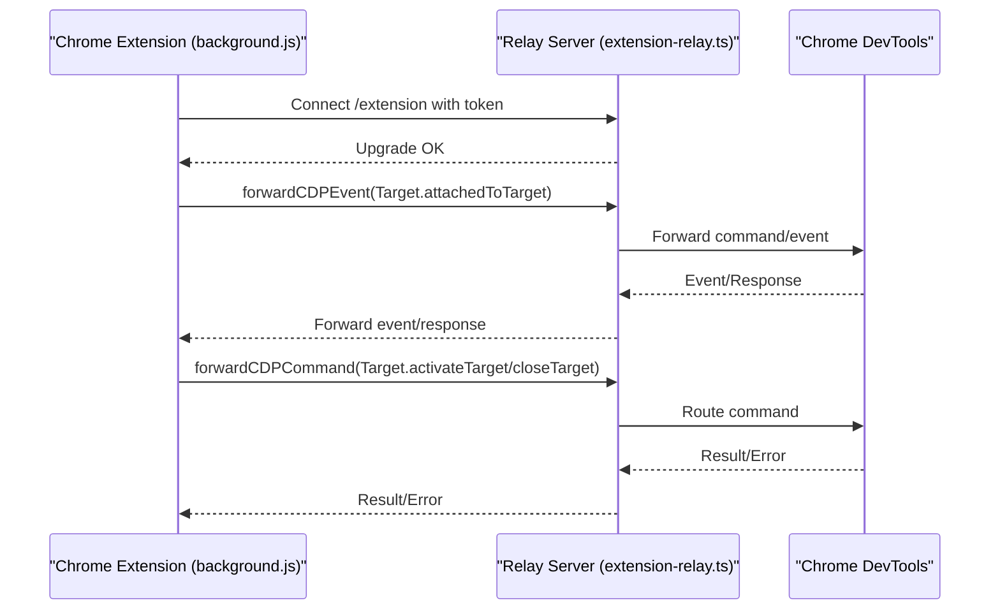
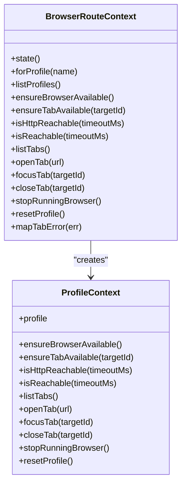
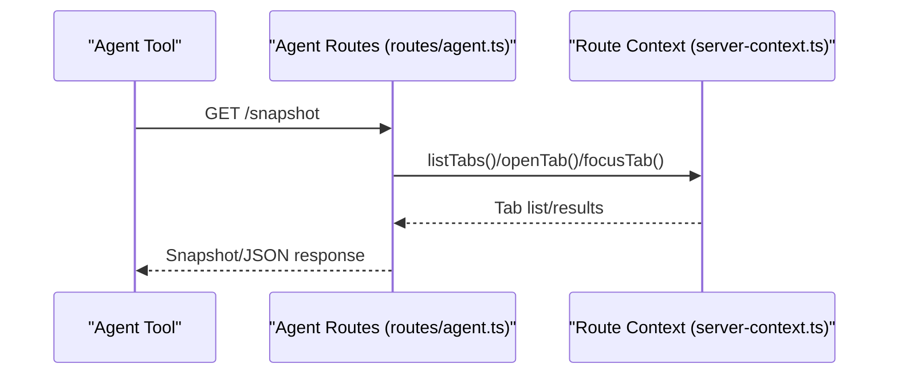
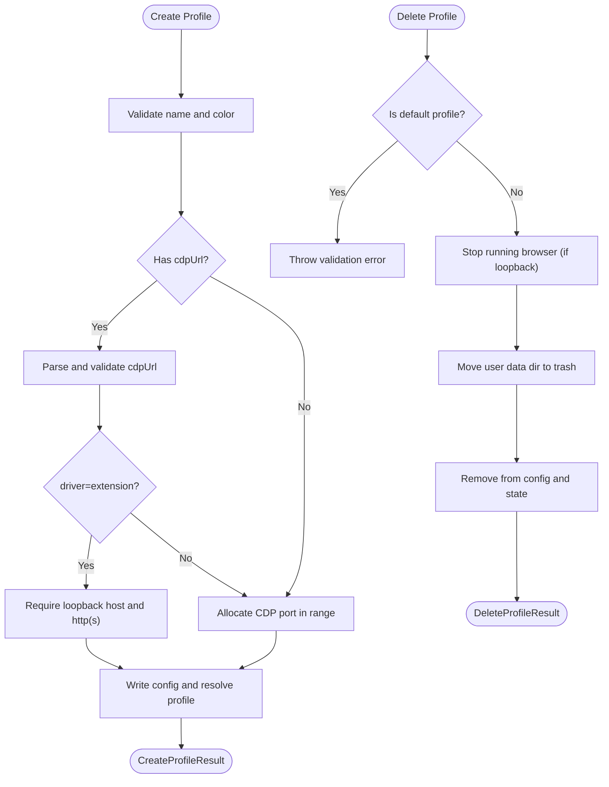
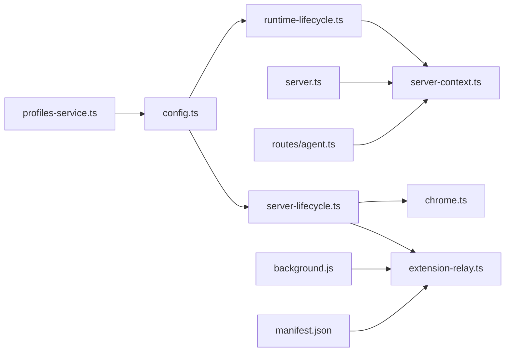

# Browser Lifecycle

<cite>
**Referenced Files in This Document**
- [config.ts](file://src/browser/config.ts)
- [chrome.ts](file://src/browser/chrome.ts)
- [extension-relay.ts](file://src/browser/extension-relay.ts)
- [server-context.ts](file://src/browser/server-context.ts)
- [server-lifecycle.ts](file://src/browser/server-lifecycle.ts)
- [runtime-lifecycle.ts](file://src/browser/runtime-lifecycle.ts)
- [control-service.ts](file://src/browser/control-service.ts)
- [server.ts](file://src/browser/server.ts)
- [routes/agent.ts](file://src/browser/routes/agent.ts)
- [profiles-service.ts](file://src/browser/profiles-service.ts)
- [manifest.json](file://assets/chrome-extension/manifest.json)
- [background.js](file://assets/chrome-extension/background.js)
</cite>

## Table of Contents
1. [Introduction](#introduction)
2. [Project Structure](#project-structure)
3. [Core Components](#core-components)
4. [Architecture Overview](#architecture-overview)
5. [Detailed Component Analysis](#detailed-component-analysis)
6. [Dependency Analysis](#dependency-analysis)
7. [Performance Considerations](#performance-considerations)
8. [Troubleshooting Guide](#troubleshooting-guide)
9. [Conclusion](#conclusion)
10. [Appendices](#appendices)

## Introduction
This document explains the browser lifecycle in OpenClaw, covering status checking, startup, shutdown, and state management. It clarifies the differences between OpenClaw-managed browsers and Chrome extension relay modes, details profile management and multi-profile configurations, and describes remote CDP connections. It also documents browser state persistence, recovery mechanisms, and error handling during lifecycle transitions, with practical examples of startup sequences, profile switching, and shutdown procedures.

## Project Structure
OpenClaw’s browser subsystem is organized around:
- Configuration resolution and profile definition
- Runtime lifecycle orchestration (start/stop)
- Local browser management (launch/stop)
- Chrome extension relay for attaching to existing Chrome tabs
- Server-side route context for profile-aware operations
- Agent-facing routes for snapshots, actions, and storage

**Diagram sources**
- [config.ts](file://src/browser/config.ts#L212-L319)
- [runtime-lifecycle.ts](file://src/browser/runtime-lifecycle.ts#L6-L25)
- [server-lifecycle.ts](file://src/browser/server-lifecycle.ts#L14-L30)
- [server-context.ts](file://src/browser/server-context.ts#L118-L145)
- [chrome.ts](file://src/browser/chrome.ts#L238-L415)
- [extension-relay.ts](file://src/browser/extension-relay.ts#L225-L337)
- [server.ts](file://src/browser/server.ts#L25-L61)
- [routes/agent.ts](file://src/browser/routes/agent.ts#L8-L13)
- [profiles-service.ts](file://src/browser/profiles-service.ts#L74-L170)
- [manifest.json](file://assets/chrome-extension/manifest.json#L1-L26)
- [background.js](file://assets/chrome-extension/background.js#L166-L227)

**Section sources**
- [config.ts](file://src/browser/config.ts#L212-L319)
- [runtime-lifecycle.ts](file://src/browser/runtime-lifecycle.ts#L6-L25)
- [server-lifecycle.ts](file://src/browser/server-lifecycle.ts#L14-L30)
- [server-context.ts](file://src/browser/server-context.ts#L118-L145)
- [chrome.ts](file://src/browser/chrome.ts#L238-L415)
- [extension-relay.ts](file://src/browser/extension-relay.ts#L225-L337)
- [server.ts](file://src/browser/server.ts#L25-L61)
- [routes/agent.ts](file://src/browser/routes/agent.ts#L8-L13)
- [profiles-service.ts](file://src/browser/profiles-service.ts#L74-L170)
- [manifest.json](file://assets/chrome-extension/manifest.json#L1-L26)
- [background.js](file://assets/chrome-extension/background.js#L166-L227)

## Core Components
- Configuration and Profiles
  - Resolves browser settings, default profile, and per-profile CDP endpoints.
  - Ensures default “openclaw” and “chrome” profiles, and validates CDP URLs/ports.
- Runtime Lifecycle
  - Creates browser runtime state and ensures Chrome extension relays for extension-driven profiles.
  - Stops all known profiles and cleans up server resources.
- Local Browser Management
  - Launches/stops local Chrome instances, checks reachability, and handles readiness.
- Chrome Extension Relay
  - Bridges CDP commands/events between the extension and a remote/local Chrome instance.
- Server Context
  - Provides profile-scoped operations (availability, tab ops, reset), and hot-reload of config.
- Agent Routes
  - Exposes snapshot, act, debug, and storage endpoints for agent tooling.
- Profiles Service
  - Dynamically creates/deletes profiles and manages CDP port/color allocation.

**Section sources**
- [config.ts](file://src/browser/config.ts#L19-L51)
- [runtime-lifecycle.ts](file://src/browser/runtime-lifecycle.ts#L6-L25)
- [server-lifecycle.ts](file://src/browser/server-lifecycle.ts#L14-L30)
- [chrome.ts](file://src/browser/chrome.ts#L69-L76)
- [extension-relay.ts](file://src/browser/extension-relay.ts#L114-L122)
- [server-context.ts](file://src/browser/server-context.ts#L45-L116)
- [routes/agent.ts](file://src/browser/routes/agent.ts#L8-L13)
- [profiles-service.ts](file://src/browser/profiles-service.ts#L74-L170)

## Architecture Overview
The browser subsystem orchestrates three primary modes:
- OpenClaw-managed browser: Launches and controls a local Chrome instance per profile.
- Chrome extension relay: Attaches to an existing Chrome tab via a local relay server.
- Remote CDP: Operates against external CDP endpoints (loopback or non-loopback).

**Diagram sources**
- [server.ts](file://src/browser/server.ts#L25-L61)
- [runtime-lifecycle.ts](file://src/browser/runtime-lifecycle.ts#L6-L25)
- [server-lifecycle.ts](file://src/browser/server-lifecycle.ts#L14-L30)
- [server-context.ts](file://src/browser/server-context.ts#L45-L116)
- [chrome.ts](file://src/browser/chrome.ts#L238-L415)
- [extension-relay.ts](file://src/browser/extension-relay.ts#L225-L337)

## Detailed Component Analysis

### Configuration and Profiles
- Resolved configuration includes control port, CDP host/port/protocol, timeouts, default profile, and profiles map.
- Profiles support:
  - Local managed driver (“openclaw”) with dedicated CDP port and user data dir.
  - Extension driver (“extension”) pointing to a relay CDP endpoint.
  - Remote CDP endpoints (loopback or non-loopback) for attach-only scenarios.
- Default profiles:
  - Ensures a default “openclaw” profile if none provided.
  - Adds a built-in “chrome” profile for extension relay when appropriate.

**Diagram sources**
- [config.ts](file://src/browser/config.ts#L212-L319)

**Section sources**
- [config.ts](file://src/browser/config.ts#L19-L51)
- [config.ts](file://src/browser/config.ts#L212-L319)

### Runtime Lifecycle
- Creation:
  - Initializes runtime state with resolved config and optional HTTP server.
  - Ensures Chrome extension relay servers for extension profiles.
- Stopping:
  - Iterates known profiles and stops either local Chrome or extension relay.
  - Optionally closes the HTTP server and clears runtime state.
  - Ensures Playwright browser connection closure if loaded.

**Diagram sources**
- [runtime-lifecycle.ts](file://src/browser/runtime-lifecycle.ts#L6-L25)
- [server-lifecycle.ts](file://src/browser/server-lifecycle.ts#L14-L30)
- [extension-relay.ts](file://src/browser/extension-relay.ts#L225-L337)

**Section sources**
- [runtime-lifecycle.ts](file://src/browser/runtime-lifecycle.ts#L6-L25)
- [server-lifecycle.ts](file://src/browser/server-lifecycle.ts#L14-L30)

### Local Browser Management (OpenClaw-managed)
- Launch:
  - Validates port availability and executable path.
  - Prepares user data directory and profile decoration.
  - Spawns Chrome with flags and waits for CDP readiness.
  - Captures stderr for diagnostics on failure.
- Stop:
  - Sends SIGTERM and probes until unreachable or timeout.
  - Falls back to SIGKILL if needed.

**Diagram sources**
- [chrome.ts](file://src/browser/chrome.ts#L238-L415)

**Section sources**
- [chrome.ts](file://src/browser/chrome.ts#L69-L76)
- [chrome.ts](file://src/browser/chrome.ts#L238-L415)

### Chrome Extension Relay Mode
- Purpose: Attach OpenClaw to an existing Chrome tab via a local relay server.
- Behavior:
  - Validates loopback host requirement for extension driver.
  - Starts a relay server bound to a loopback address/port.
  - Maintains extension connection state, reconnects with backoff, and forwards CDP commands/events.
  - Supports graceful cleanup and pending request handling.

**Diagram sources**
- [extension-relay.ts](file://src/browser/extension-relay.ts#L225-L337)
- [extension-relay.ts](file://src/browser/extension-relay.ts#L751-L895)
- [extension-relay.ts](file://src/browser/extension-relay.ts#L976-L1051)
- [background.js](file://assets/chrome-extension/background.js#L166-L227)
- [background.js](file://assets/chrome-extension/background.js#L410-L493)

**Section sources**
- [extension-relay.ts](file://src/browser/extension-relay.ts#L114-L122)
- [extension-relay.ts](file://src/browser/extension-relay.ts#L225-L337)
- [extension-relay.ts](file://src/browser/extension-relay.ts#L751-L895)
- [extension-relay.ts](file://src/browser/extension-relay.ts#L976-L1051)
- [background.js](file://assets/chrome-extension/background.js#L166-L227)
- [background.js](file://assets/chrome-extension/background.js#L410-L493)

### Server Context and Profile Operations
- Provides profile-scoped operations:
  - Availability checks (reachability, HTTP reachability).
  - Tab operations (list/open/focus/close).
  - Reset operations (stop and optionally remove user data).
- Hot reload of configuration allows dynamic profile changes without restart.

**Diagram sources**
- [server-context.ts](file://src/browser/server-context.ts#L118-L145)
- [server-context.ts](file://src/browser/server-context.ts#L45-L116)

**Section sources**
- [server-context.ts](file://src/browser/server-context.ts#L45-L116)
- [server-context.ts](file://src/browser/server-context.ts#L118-L145)

### Agent Routes and State Persistence
- Agent routes expose:
  - Snapshot endpoints for visual/state capture.
  - Act endpoints for interactive operations.
  - Debug endpoints for diagnostics.
  - Storage endpoints for local/session storage manipulation.
- State persistence:
  - Extension background script persists attached tab state across service worker restarts.
  - On reconnect, it reannounces attached tabs and resumes operations.

**Diagram sources**
- [routes/agent.ts](file://src/browser/routes/agent.ts#L8-L13)
- [server-context.ts](file://src/browser/server-context.ts#L147-L205)

**Section sources**
- [routes/agent.ts](file://src/browser/routes/agent.ts#L8-L13)
- [server-context.ts](file://src/browser/server-context.ts#L147-L205)

### Profiles Service and Multi-Profile Configurations
- Create profile:
  - Validates name and color, allocates CDP port or accepts explicit CDP URL.
  - Enforces extension driver constraints (loopback HTTP(S)).
  - Writes updated config and resolves profile.
- Delete profile:
  - Prevents deletion of default profile.
  - Stops running browser if loopback and removes user data directory.
  - Updates config and clears runtime state.

**Diagram sources**
- [profiles-service.ts](file://src/browser/profiles-service.ts#L79-L170)
- [profiles-service.ts](file://src/browser/profiles-service.ts#L172-L228)

**Section sources**
- [profiles-service.ts](file://src/browser/profiles-service.ts#L74-L170)
- [profiles-service.ts](file://src/browser/profiles-service.ts#L172-L228)

### Startup Sequences and Examples
- Example: Start OpenClaw-managed browser for a profile
  - Resolve config and ensure default “openclaw” profile.
  - Create runtime state and ensure extension relays for extension profiles.
  - For the target profile, ensure browser available (launch local Chrome if needed).
  - Use agent routes to list/open/focus tabs.
- Example: Switch profile
  - Use route context forProfile(name) to operate under a different profile.
  - For extension driver, ensure relay server is running for that profile.
- Example: Remote CDP connection
  - Configure a profile with a remote cdpUrl (loopback or non-loopback).
  - Use ensureBrowserAvailable to probe reachability and operate via CDP.

**Section sources**
- [runtime-lifecycle.ts](file://src/browser/runtime-lifecycle.ts#L6-L25)
- [server-lifecycle.ts](file://src/browser/server-lifecycle.ts#L14-L30)
- [server-context.ts](file://src/browser/server-context.ts#L129-L145)
- [chrome.ts](file://src/browser/chrome.ts#L238-L415)

### Shutdown Procedures and Recovery
- Proper shutdown
  - Stop all known profiles: local Chrome or extension relay.
  - Close HTTP server if applicable.
  - Clear runtime state and close Playwright connection if loaded.
- Recovery
  - Extension relay supports reconnect with exponential backoff.
  - Background script persists attached tab state and reannounces on reconnect.

**Section sources**
- [runtime-lifecycle.ts](file://src/browser/runtime-lifecycle.ts#L27-L60)
- [server-lifecycle.ts](file://src/browser/server-lifecycle.ts#L32-L67)
- [extension-relay.ts](file://src/browser/extension-relay.ts#L293-L315)
- [background.js](file://assets/chrome-extension/background.js#L256-L291)
- [background.js](file://assets/chrome-extension/background.js#L294-L362)

## Dependency Analysis

**Diagram sources**
- [config.ts](file://src/browser/config.ts#L212-L319)
- [runtime-lifecycle.ts](file://src/browser/runtime-lifecycle.ts#L6-L25)
- [server-lifecycle.ts](file://src/browser/server-lifecycle.ts#L14-L30)
- [server-context.ts](file://src/browser/server-context.ts#L118-L145)
- [chrome.ts](file://src/browser/chrome.ts#L238-L415)
- [extension-relay.ts](file://src/browser/extension-relay.ts#L225-L337)
- [server.ts](file://src/browser/server.ts#L25-L61)
- [routes/agent.ts](file://src/browser/routes/agent.ts#L8-L13)
- [profiles-service.ts](file://src/browser/profiles-service.ts#L74-L170)
- [manifest.json](file://assets/chrome-extension/manifest.json#L1-L26)
- [background.js](file://assets/chrome-extension/background.js#L166-L227)

**Section sources**
- [config.ts](file://src/browser/config.ts#L212-L319)
- [runtime-lifecycle.ts](file://src/browser/runtime-lifecycle.ts#L6-L25)
- [server-lifecycle.ts](file://src/browser/server-lifecycle.ts#L14-L30)
- [server-context.ts](file://src/browser/server-context.ts#L118-L145)
- [chrome.ts](file://src/browser/chrome.ts#L238-L415)
- [extension-relay.ts](file://src/browser/extension-relay.ts#L225-L337)
- [server.ts](file://src/browser/server.ts#L25-L61)
- [routes/agent.ts](file://src/browser/routes/agent.ts#L8-L13)
- [profiles-service.ts](file://src/browser/profiles-service.ts#L74-L170)
- [manifest.json](file://assets/chrome-extension/manifest.json#L1-L26)
- [background.js](file://assets/chrome-extension/background.js#L166-L227)

## Performance Considerations
- Port allocation and reuse:
  - Use derived CDP port ranges to avoid conflicts with the control port.
  - Prefer loopback-only relays for minimal latency and security.
- Reliability:
  - Extension relay employs reconnect backoff and pending request queuing.
  - Local Chrome launch includes readiness probing and diagnostic stderr capture.
- Resource limits:
  - Headless mode reduces overhead; sandbox flags can be toggled for containerized environments.

[No sources needed since this section provides general guidance]

## Troubleshooting Guide
- Local Chrome fails to start
  - Symptoms: Launch readiness timeout, stderr captured.
  - Actions: Enable no-sandbox for containers; verify port availability; inspect stderr hints.
- Extension relay not reachable
  - Symptoms: HEAD / returns 4xx; WebSocket upgrade fails.
  - Actions: Verify relay bind host and port; confirm token auth; check firewall.
- Profile not found
  - Symptoms: Error indicating profile missing from config.
  - Actions: Use profiles service to create/update profile; ensure hot-reload is enabled.
- Tab attachment issues
  - Symptoms: No attached tab for method; missing target error.
  - Actions: Reconnect extension; reannounce attached tabs; validate tab existence.

**Section sources**
- [chrome.ts](file://src/browser/chrome.ts#L379-L396)
- [extension-relay.ts](file://src/browser/extension-relay.ts#L538-L686)
- [server-context.ts](file://src/browser/server-context.ts#L138-L143)
- [background.js](file://assets/chrome-extension/background.js#L231-L254)

## Conclusion
OpenClaw’s browser lifecycle integrates configuration-driven profiles, runtime orchestration, local browser management, and a robust Chrome extension relay. It supports both OpenClaw-managed and extension relay modes, multi-profile setups, and remote CDP endpoints. The subsystem emphasizes reliability via readiness checks, graceful shutdown, and recovery mechanisms such as reconnect backoff and state persistence.

[No sources needed since this section summarizes without analyzing specific files]

## Appendices

### Differences: OpenClaw-managed vs Chrome Extension Relay Modes
- OpenClaw-managed
  - Launches and controls a local Chrome instance per profile.
  - Uses user data directories and CDP ports derived from configuration.
- Chrome extension relay
  - Attaches to an existing Chrome tab via a local relay server.
  - Requires loopback HTTP(S) CDP URL for extension driver.
  - Uses extension background script to manage attach/detach and reconnect.

**Section sources**
- [config.ts](file://src/browser/config.ts#L188-L211)
- [extension-relay.ts](file://src/browser/extension-relay.ts#L225-L337)
- [background.js](file://assets/chrome-extension/background.js#L510-L551)