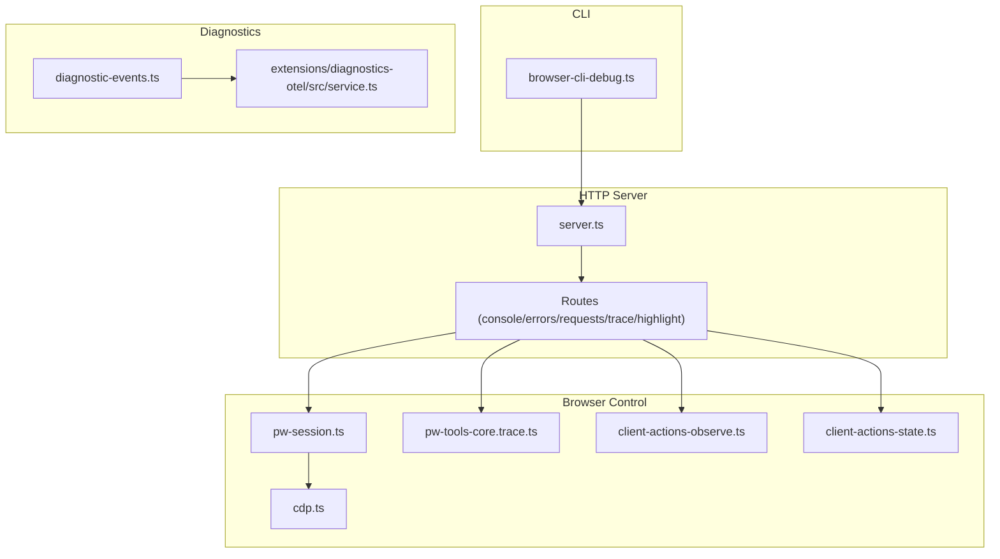
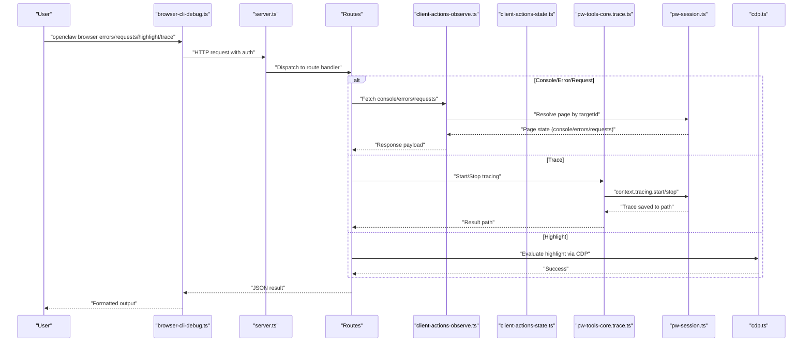
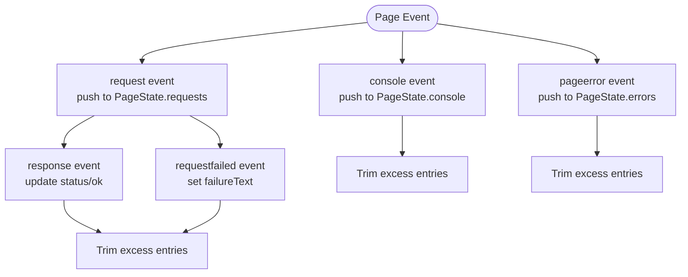
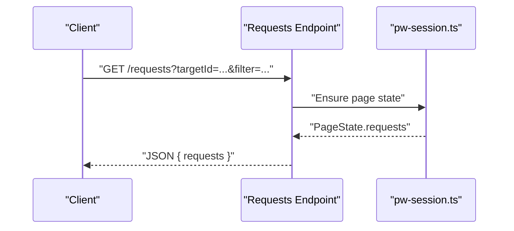
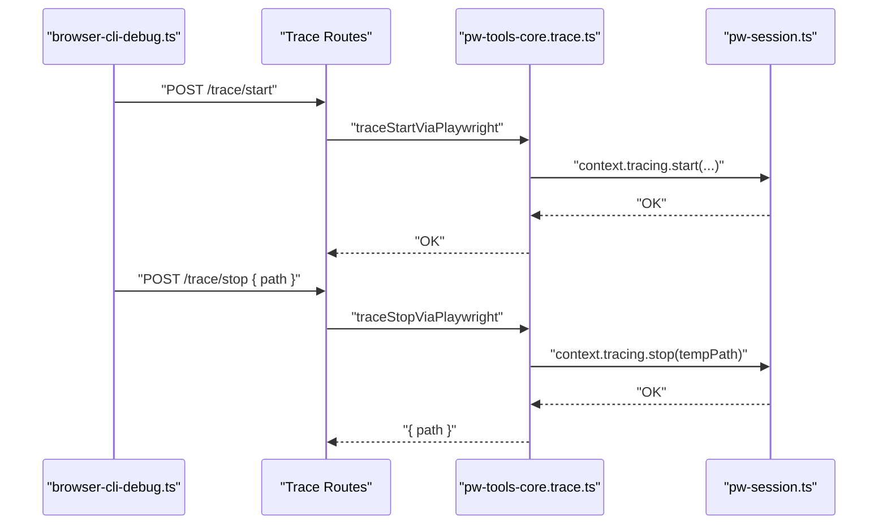
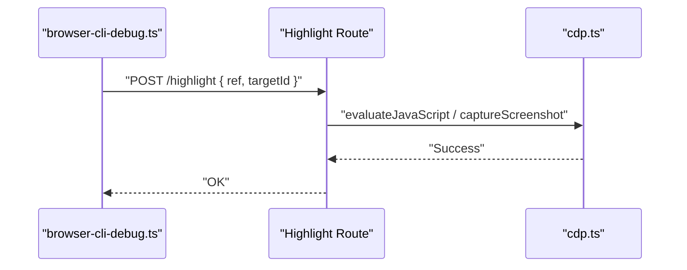
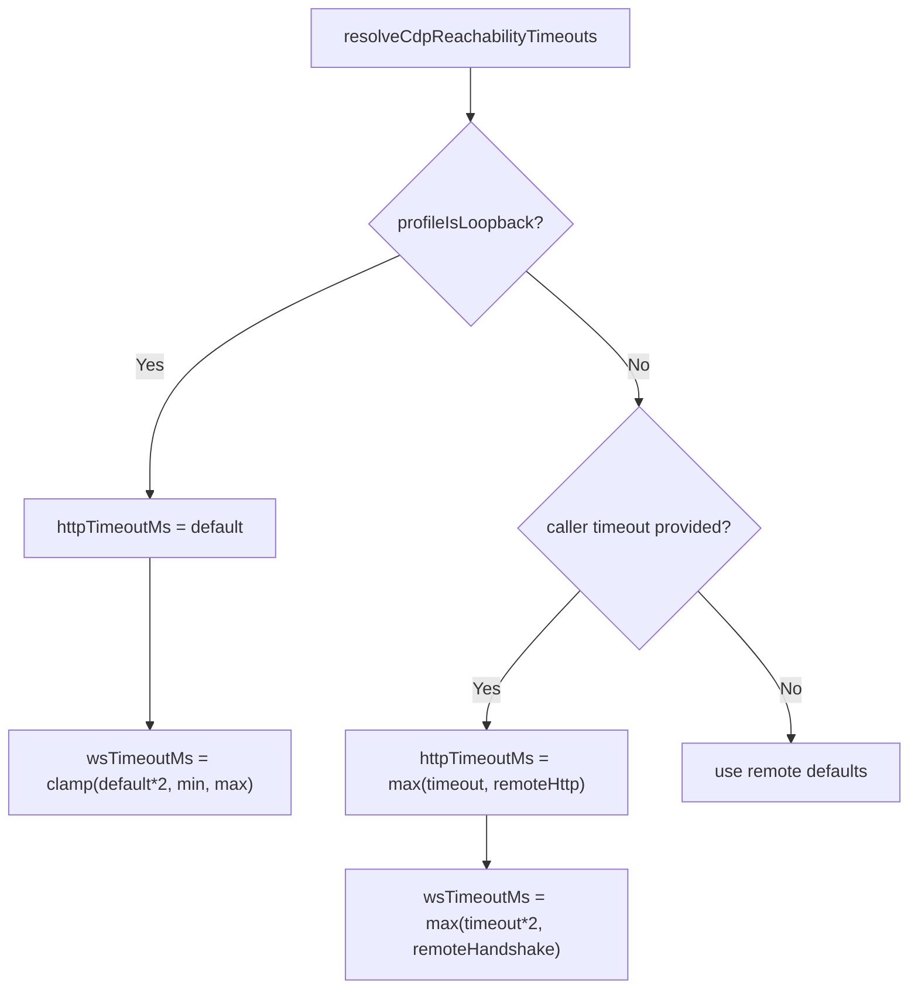
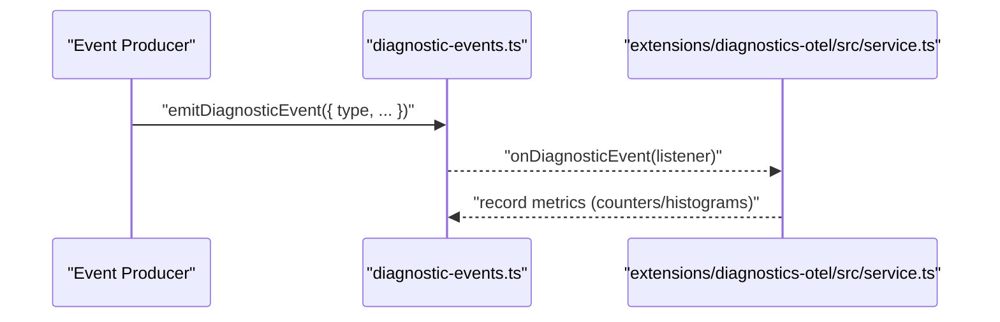
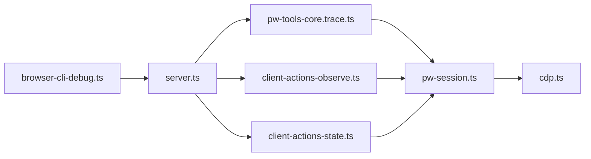

# Debugging and Profiling

<cite>
**Referenced Files in This Document**
- [cdp.ts](file://src/browser/cdp.ts)
- [cdp-timeouts.ts](file://src/browser/cdp-timeouts.ts)
- [pw-session.ts](file://src/browser/pw-session.ts)
- [pw-tools-core.trace.ts](file://src/browser/pw-tools-core.trace.ts)
- [client-actions-observe.ts](file://src/browser/client-actions-observe.ts)
- [client-actions-state.ts](file://src/browser/client-actions-state.ts)
- [browser-cli-debug.ts](file://src/cli/browser-cli-debug.ts)
- [server.ts](file://src/browser/server.ts)
- [diagnostic-events.ts](file://src/infra/diagnostic-events.ts)
- [extensions/diagnostics-otel/src/service.ts](file://extensions/diagnostics-otel/src/service.ts)
- [cdp-timeouts.test.ts](file://src/browser/cdp-timeouts.test.ts)
- [profiles.test.ts](file://src/browser/profiles.test.ts)
</cite>

## Table of Contents
1. [Introduction](#introduction)
2. [Project Structure](#project-structure)
3. [Core Components](#core-components)
4. [Architecture Overview](#architecture-overview)
5. [Detailed Component Analysis](#detailed-component-analysis)
6. [Dependency Analysis](#dependency-analysis)
7. [Performance Considerations](#performance-considerations)
8. [Troubleshooting Guide](#troubleshooting-guide)
9. [Conclusion](#conclusion)
10. [Appendices](#appendices)

## Introduction
This document explains the debugging and profiling capabilities in OpenClaw browser automation. It covers console inspection, error tracking, request monitoring, and performance profiling. It also documents trace recording, download management, highlight operations, and debugging workflows. Additional topics include timeout configuration, CDP connection monitoring, and diagnostic tools. Practical examples and optimization techniques are included to help troubleshoot common automation issues.

## Project Structure
OpenClaw’s browser automation stack centers around a Playwright-based control plane with a local HTTP server exposing debugging endpoints. The CLI integrates with these endpoints to support interactive debugging and tracing. Core modules handle CDP connectivity, session lifecycle, and observability.

**Diagram sources**
- [browser-cli-debug.ts](file://src/cli/browser-cli-debug.ts#L71-L232)
- [server.ts](file://src/browser/server.ts#L20-L100)
- [pw-session.ts](file://src/browser/pw-session.ts#L1-L800)
- [pw-tools-core.trace.ts](file://src/browser/pw-tools-core.trace.ts#L1-L46)
- [client-actions-observe.ts](file://src/browser/client-actions-observe.ts#L1-L185)
- [client-actions-state.ts](file://src/browser/client-actions-state.ts#L1-L279)
- [cdp.ts](file://src/browser/cdp.ts#L1-L486)
- [diagnostic-events.ts](file://src/infra/diagnostic-events.ts#L171-L242)
- [extensions/diagnostics-otel/src/service.ts](file://extensions/diagnostics-otel/src/service.ts#L560-L587)

**Section sources**
- [browser-cli-debug.ts](file://src/cli/browser-cli-debug.ts#L71-L232)
- [server.ts](file://src/browser/server.ts#L20-L100)

## Core Components
- CDP connectivity and evaluation: Provides screenshot capture, DOM/AX snapshots, JavaScript evaluation, and URL normalization for CDP endpoints.
- Session lifecycle and observability: Tracks console messages, page errors, and network requests per page/context; supports forced disconnection and target resolution.
- Trace recording: Starts/stops Playwright tracing with atomic output to a stable path.
- HTTP endpoints for debugging: Exposes console, errors, requests, highlight, and trace controls via the local browser control server.
- CLI debugging commands: Wraps HTTP calls to inspect console, errors, requests, and manage traces.
- Diagnostics and telemetry: Event bus with recursion guards and optional OTLP exporter.

**Section sources**
- [cdp.ts](file://src/browser/cdp.ts#L1-L486)
- [pw-session.ts](file://src/browser/pw-session.ts#L1-L800)
- [pw-tools-core.trace.ts](file://src/browser/pw-tools-core.trace.ts#L1-L46)
- [client-actions-observe.ts](file://src/browser/client-actions-observe.ts#L1-L185)
- [client-actions-state.ts](file://src/browser/client-actions-state.ts#L1-L279)
- [browser-cli-debug.ts](file://src/cli/browser-cli-debug.ts#L71-L232)
- [diagnostic-events.ts](file://src/infra/diagnostic-events.ts#L171-L242)
- [extensions/diagnostics-otel/src/service.ts](file://extensions/diagnostics-otel/src/service.ts#L560-L587)

## Architecture Overview
The debugging pipeline connects CLI commands to the browser control server, which orchestrates Playwright sessions and CDP operations. Observability data is aggregated per page and context, and tracing is managed through Playwright’s tracing API.

**Diagram sources**
- [browser-cli-debug.ts](file://src/cli/browser-cli-debug.ts#L71-L232)
- [server.ts](file://src/browser/server.ts#L20-L100)
- [client-actions-observe.ts](file://src/browser/client-actions-observe.ts#L25-L185)
- [pw-tools-core.trace.ts](file://src/browser/pw-tools-core.trace.ts#L5-L46)
- [pw-session.ts](file://src/browser/pw-session.ts#L505-L529)
- [cdp.ts](file://src/browser/cdp.ts#L103-L140)

## Detailed Component Analysis

### Console Inspection and Error Tracking
- Console messages: Collected per page and capped at a fixed buffer size. Exposed via HTTP GET to the console endpoint with optional filtering by level and targetId.
- Page errors: Captured on pageerror events and exposed via HTTP GET to the errors endpoint with optional clearing.
- Network requests: Observed via request/response/requestfailed events and exposed via HTTP GET to the requests endpoint with optional filtering and clearing.

**Diagram sources**
- [pw-session.ts](file://src/browser/pw-session.ts#L231-L298)

**Section sources**
- [client-actions-observe.ts](file://src/browser/client-actions-observe.ts#L25-L90)
- [pw-session.ts](file://src/browser/pw-session.ts#L31-L54)
- [pw-session.ts](file://src/browser/pw-session.ts#L211-L301)

### Request Monitoring and Response Body Retrieval
- Requests are tracked with id generation, timestamps, method, URL, and resource type. Status and ok flags are updated on response; failureText is set on requestfailed.
- Response body retrieval is supported via a dedicated endpoint that evaluates a script in the target page and returns sanitized body content with truncation limits.

**Diagram sources**
- [client-actions-observe.ts](file://src/browser/client-actions-observe.ts#L70-L90)
- [pw-session.ts](file://src/browser/pw-session.ts#L254-L293)

**Section sources**
- [client-actions-observe.ts](file://src/browser/client-actions-observe.ts#L70-L90)
- [pw-session.ts](file://src/browser/pw-session.ts#L115-L118)
- [pw-session.ts](file://src/browser/pw-session.ts#L254-L293)

### Trace Recording and Download Management
- Trace recording is controlled via Playwright tracing APIs. Starting a trace sets a flag in context state; stopping writes the trace to a stable path using atomic sibling temp writing.
- Downloads are managed via Playwright’s download APIs and can be captured during tracing.

**Diagram sources**
- [browser-cli-debug.ts](file://src/cli/browser-cli-debug.ts#L178-L232)
- [pw-tools-core.trace.ts](file://src/browser/pw-tools-core.trace.ts#L5-L46)
- [pw-session.ts](file://src/browser/pw-session.ts#L101-L103)

**Section sources**
- [pw-tools-core.trace.ts](file://src/browser/pw-tools-core.trace.ts#L1-L46)
- [pw-session.ts](file://src/browser/pw-session.ts#L101-L103)

### Highlight Operations and Element Interaction
- Highlighting uses CDP to draw overlays on elements identified by refs. The operation is invoked via a POST to the highlight endpoint.
- JavaScript evaluation and DOM/AX snapshots are available for deeper inspection.

**Diagram sources**
- [browser-cli-debug.ts](file://src/cli/browser-cli-debug.ts#L75-L96)
- [client-actions-observe.ts](file://src/browser/client-actions-observe.ts#L129-L140)
- [cdp.ts](file://src/browser/cdp.ts#L159-L187)

**Section sources**
- [client-actions-observe.ts](file://src/browser/client-actions-observe.ts#L129-L140)
- [cdp.ts](file://src/browser/cdp.ts#L159-L187)

### Timeout Configuration and CDP Connection Monitoring
- CDP timeouts are configurable and clamped to sane ranges. Loopback vs remote profiles receive different defaults and min/max constraints.
- Connection monitoring includes retries, header injection, and forced disconnection to recover from stuck operations.

**Diagram sources**
- [cdp-timeouts.ts](file://src/browser/cdp-timeouts.ts#L28-L54)

**Section sources**
- [cdp-timeouts.ts](file://src/browser/cdp-timeouts.ts#L1-L55)
- [pw-session.ts](file://src/browser/pw-session.ts#L332-L385)
- [pw-session.ts](file://src/browser/pw-session.ts#L695-L724)

### Diagnostics and Telemetry
- A global diagnostic event bus emits structured events with sequence numbers and timestamps, guarded against recursion and listener errors.
- An optional OTLP exporter records queue and session metrics.

**Diagram sources**
- [diagnostic-events.ts](file://src/infra/diagnostic-events.ts#L195-L227)
- [extensions/diagnostics-otel/src/service.ts](file://extensions/diagnostics-otel/src/service.ts#L560-L587)

**Section sources**
- [diagnostic-events.ts](file://src/infra/diagnostic-events.ts#L171-L242)
- [extensions/diagnostics-otel/src/service.ts](file://extensions/diagnostics-otel/src/service.ts#L560-L587)

## Dependency Analysis
- CLI depends on the browser control server for all operations.
- Server routes depend on observation/state utilities and tracing helpers.
- Tracing depends on Playwright context state and atomic file writing.
- CDP utilities depend on socket helpers and URL normalization.

**Diagram sources**
- [browser-cli-debug.ts](file://src/cli/browser-cli-debug.ts#L71-L232)
- [server.ts](file://src/browser/server.ts#L20-L100)
- [client-actions-observe.ts](file://src/browser/client-actions-observe.ts#L1-L185)
- [client-actions-state.ts](file://src/browser/client-actions-state.ts#L1-L279)
- [pw-tools-core.trace.ts](file://src/browser/pw-tools-core.trace.ts#L1-L46)
- [pw-session.ts](file://src/browser/pw-session.ts#L1-L800)
- [cdp.ts](file://src/browser/cdp.ts#L1-L486)

**Section sources**
- [browser-cli-debug.ts](file://src/cli/browser-cli-debug.ts#L71-L232)
- [server.ts](file://src/browser/server.ts#L20-L100)
- [pw-session.ts](file://src/browser/pw-session.ts#L1-L800)

## Performance Considerations
- Limit snapshot sizes: AX and DOM snapshots are bounded to avoid excessive memory usage.
- Cap buffered logs: Console messages, page errors, and requests are trimmed to fixed sizes.
- Atomic trace writes: Ensures consistent trace artifacts and avoids partial writes.
- Timeout tuning: Adjust loopback vs remote defaults and enforce minimums to balance responsiveness and reliability.

[No sources needed since this section provides general guidance]

## Troubleshooting Guide
- No pages available: Occurs when the connected browser has no open pages; ensure a page exists or pass a valid targetId.
- Unknown ref: Using a ref that was not present in the latest snapshot; regenerate the snapshot and use a ref from that snapshot.
- Trace already running/already stopped: Ensure proper start/stop ordering; the context state tracks active tracing.
- Stuck operations: Use forced disconnection to terminate execution and recover; this disconnects the CDP connection and allows a fresh one.
- Authentication failures: The browser control server requires either token or password; if auto-configuration fails, configure auth explicitly.

**Section sources**
- [pw-session.ts](file://src/browser/pw-session.ts#L511-L513)
- [pw-session.ts](file://src/browser/pw-session.ts#L548-L551)
- [pw-tools-core.trace.ts](file://src/browser/pw-tools-core.trace.ts#L15-L17)
- [pw-session.ts](file://src/browser/pw-session.ts#L695-L724)
- [server.ts](file://src/browser/server.ts#L44-L51)

## Conclusion
OpenClaw provides a robust debugging and profiling toolkit centered on a local browser control server and CLI. Developers can inspect console messages, track page errors and network requests, record Playwright traces, and highlight elements using refs. Under-the-hood mechanisms include strict timeouts, connection resilience, and diagnostic telemetry to support reliable automation at scale.

[No sources needed since this section summarizes without analyzing specific files]

## Appendices

### Example Debugging Workflows
- Inspect console and errors:
  - Use the CLI to fetch console messages and page errors for a given targetId.
  - Clear buffers after inspection to keep logs manageable.
- Monitor requests:
  - Filter by substring to focus on specific domains or endpoints.
  - Combine with error inspection to correlate failures.
- Record a trace:
  - Start tracing with screenshots and snapshots enabled.
  - Stop tracing and retrieve the output path for later analysis.
- Highlight elements:
  - Take an AX/DOM snapshot, select a ref, and highlight it in the browser.

**Section sources**
- [browser-cli-debug.ts](file://src/cli/browser-cli-debug.ts#L75-L176)
- [pw-tools-core.trace.ts](file://src/browser/pw-tools-core.trace.ts#L5-L46)
- [client-actions-observe.ts](file://src/browser/client-actions-observe.ts#L25-L90)

### Timeout Configuration Reference
- Loopback profiles:
  - HTTP reachability default and WebSocket handshake range are clamped to safe min/max values.
- Remote profiles:
  - Defaults honor remote endpoints; caller-provided timeouts are enforced with minimums.
- Chrome lifecycle:
  - Separate timeouts govern reachability, readiness, and shutdown phases.

**Section sources**
- [cdp-timeouts.ts](file://src/browser/cdp-timeouts.ts#L1-L55)
- [cdp-timeouts.test.ts](file://src/browser/cdp-timeouts.test.ts#L1-L69)

### Port Allocation and Exhaustion
- Ports are allocated sequentially within a predefined range; gaps are preferred to minimize conflicts.
- When all ports are exhausted, allocation returns null.

**Section sources**
- [profiles.test.ts](file://src/browser/profiles.test.ts#L54-L94)