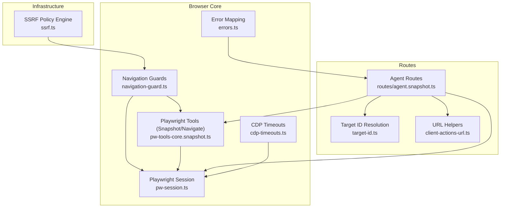
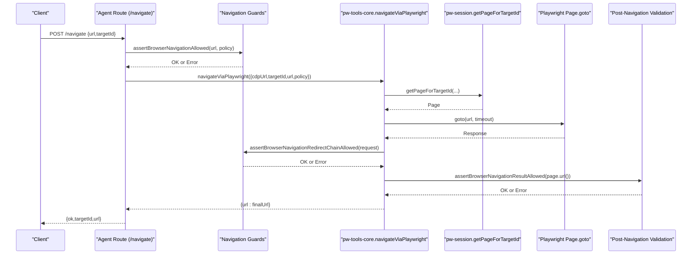
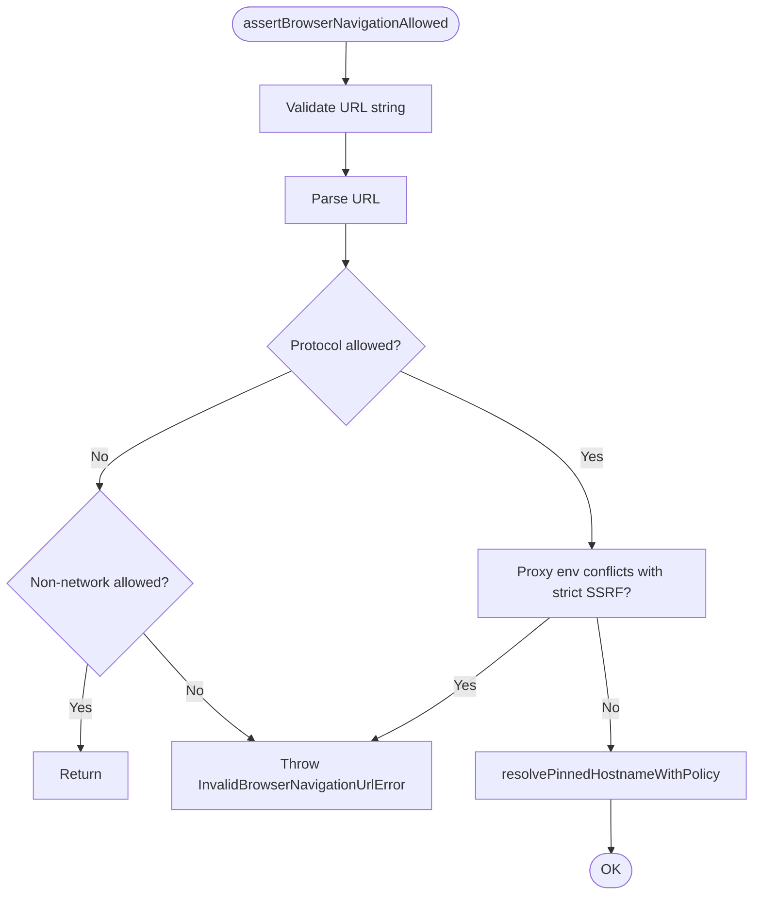
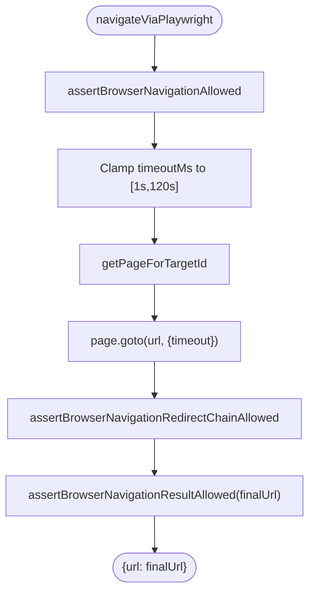
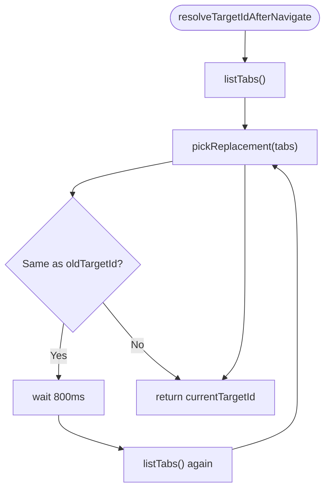
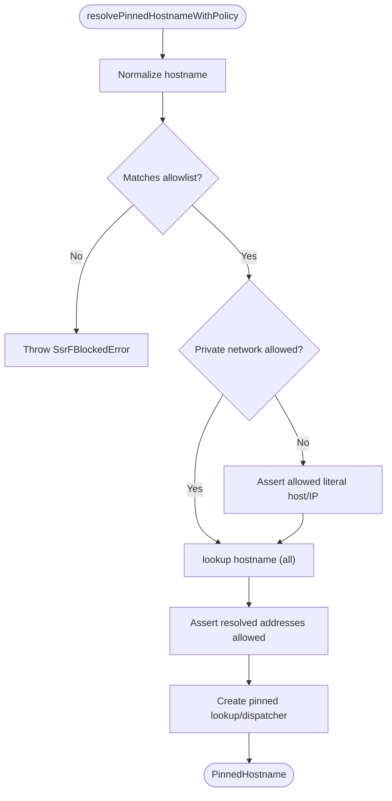
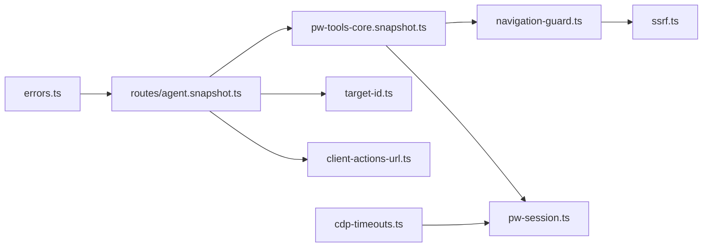

# Navigation Operations

<cite>
**Referenced Files in This Document**
- [navigation-guard.ts](file://src/browser/navigation-guard.ts)
- [pw-tools-core.snapshot.ts](file://src/browser/pw-tools-core.snapshot.ts)
- [pw-session.ts](file://src/browser/pw-session.ts)
- [server-context.ts](file://src/browser/server-context.ts)
- [ssrf.ts](file://src/infra/net/ssrf.ts)
- [errors.ts](file://src/browser/errors.ts)
- [cdp-timeouts.ts](file://src/browser/cdp-timeouts.ts)
- [client-actions-url.ts](file://src/browser/client-actions-url.ts)
- [target-id.ts](file://src/browser/target-id.ts)
- [agent.snapshot.ts](file://src/browser/routes/agent.snapshot.ts)
- [navigation-guard.test.ts](file://src/browser/navigation-guard.test.ts)
- [pw-tools-core.snapshot.navigate-guard.test.ts](file://src/browser/pw-tools-core.snapshot.navigate-guard.test.ts)
- [remote-http.ts](file://src/memory/remote-http.ts)
</cite>

## Table of Contents
1. [Introduction](#introduction)
2. [Project Structure](#project-structure)
3. [Core Components](#core-components)
4. [Architecture Overview](#architecture-overview)
5. [Detailed Component Analysis](#detailed-component-analysis)
6. [Dependency Analysis](#dependency-analysis)
7. [Performance Considerations](#performance-considerations)
8. [Troubleshooting Guide](#troubleshooting-guide)
9. [Conclusion](#conclusion)

## Introduction
This document explains navigation operations in OpenClaw browser automation. It covers URL navigation, refresh operations, navigation state management, and navigation guards. It also documents URL validation, SSRF protections, timeout handling, workflows, error recovery strategies, and navigation state persistence. Practical examples and security considerations are included to guide both developers and operators.

## Project Structure
OpenClaw’s browser navigation spans several modules:
- SSRF and URL validation live under infrastructure networking.
- Navigation guards enforce allowed protocols and private network policies.
- Playwright-based navigation and state management reside in browser session and tools modules.
- Route handlers orchestrate navigation and persist state transitions.
- Utilities provide URL manipulation and target ID resolution.

**Diagram sources**
- [ssrf.ts](file://src/infra/net/ssrf.ts#L32-L364)
- [navigation-guard.ts](file://src/browser/navigation-guard.ts#L24-L135)
- [pw-tools-core.snapshot.ts](file://src/browser/pw-tools-core.snapshot.ts#L169-L229)
- [pw-session.ts](file://src/browser/pw-session.ts#L766-L800)
- [server-context.ts](file://src/browser/server-context.ts#L118-L241)
- [target-id.ts](file://src/browser/target-id.ts#L1-L31)
- [client-actions-url.ts](file://src/browser/client-actions-url.ts#L1-L12)

**Section sources**
- [navigation-guard.ts](file://src/browser/navigation-guard.ts#L1-L135)
- [pw-tools-core.snapshot.ts](file://src/browser/pw-tools-core.snapshot.ts#L1-L263)
- [pw-session.ts](file://src/browser/pw-session.ts#L1-L858)
- [server-context.ts](file://src/browser/server-context.ts#L1-L242)
- [ssrf.ts](file://src/infra/net/ssrf.ts#L1-L364)
- [errors.ts](file://src/browser/errors.ts#L1-L83)
- [cdp-timeouts.ts](file://src/browser/cdp-timeouts.ts#L1-L55)
- [client-actions-url.ts](file://src/browser/client-actions-url.ts#L1-L12)
- [target-id.ts](file://src/browser/target-id.ts#L1-L31)
- [agent.snapshot.ts](file://src/browser/routes/agent.snapshot.ts#L88-L120)

## Core Components
- Navigation guards validate URLs and enforce SSRF policies before and after navigation.
- Playwright-based navigation wraps goto with policy checks, redirect validation, and result verification.
- Route handlers coordinate navigation, update target IDs after renderer swaps, and return normalized results.
- SSRF policy engine enforces hostname allowlists, private network allowances, and IP classification.
- Error mapping translates internal errors into HTTP responses for clients.

Key responsibilities:
- URL validation and protocol gating
- Private network and hostname allowlist enforcement
- Redirect chain validation
- Final result URL validation
- Timeout clamping and retry on transient failures
- Target ID resolution after navigation

**Section sources**
- [navigation-guard.ts](file://src/browser/navigation-guard.ts#L43-L135)
- [pw-tools-core.snapshot.ts](file://src/browser/pw-tools-core.snapshot.ts#L169-L229)
- [agent.snapshot.ts](file://src/browser/routes/agent.snapshot.ts#L112-L118)
- [ssrf.ts](file://src/infra/net/ssrf.ts#L66-L323)
- [errors.ts](file://src/browser/errors.ts#L68-L82)

## Architecture Overview
The navigation pipeline integrates route orchestration, SSRF validation, Playwright navigation, and state updates.

**Diagram sources**
- [agent.snapshot.ts](file://src/browser/routes/agent.snapshot.ts#L92-L120)
- [pw-tools-core.snapshot.ts](file://src/browser/pw-tools-core.snapshot.ts#L169-L229)
- [navigation-guard.ts](file://src/browser/navigation-guard.ts#L43-L135)
- [pw-session.ts](file://src/browser/pw-session.ts#L505-L529)

## Detailed Component Analysis

### Navigation Guards
The navigation guard module enforces:
- Required and valid URL parsing
- Allowed protocols (http/https) and safe non-network exceptions (e.g., about:blank)
- Env proxy conflict detection
- Pre- and post-navigation validation
- Redirect chain traversal validation

**Diagram sources**
- [navigation-guard.ts](file://src/browser/navigation-guard.ts#L43-L84)
- [ssrf.ts](file://src/infra/net/ssrf.ts#L276-L323)

**Section sources**
- [navigation-guard.ts](file://src/browser/navigation-guard.ts#L43-L135)
- [ssrf.ts](file://src/infra/net/ssrf.ts#L66-L323)

### Playwright Navigation Workflow
The Playwright navigation function:
- Validates input URL and policy
- Clamps timeout to a bounded range
- Retrieves the target page
- Executes goto with timeout
- Validates redirect chain and final URL
- Returns the final URL

**Diagram sources**
- [pw-tools-core.snapshot.ts](file://src/browser/pw-tools-core.snapshot.ts#L169-L229)
- [pw-session.ts](file://src/browser/pw-session.ts#L505-L529)
- [navigation-guard.ts](file://src/browser/navigation-guard.ts#L115-L135)

**Section sources**
- [pw-tools-core.snapshot.ts](file://src/browser/pw-tools-core.snapshot.ts#L169-L229)
- [pw-session.ts](file://src/browser/pw-session.ts#L766-L800)

### Target ID Resolution After Navigation
After navigation, renderer swaps or tab updates may change the underlying target. The resolver:
- Compares current tabs against the old target and navigated URL
- Prefers staying on the original target when unambiguous
- Retries after a short delay to allow tab lists to stabilize
- Falls back to the original target if ambiguity persists

**Diagram sources**
- [agent.snapshot.ts](file://src/browser/routes/agent.snapshot.ts#L51-L86)

**Section sources**
- [agent.snapshot.ts](file://src/browser/routes/agent.snapshot.ts#L51-L86)

### SSRF Protection Mechanisms
The SSRF policy engine:
- Normalizes hostnames and allowlists
- Determines whether private networks are allowed
- Blocks private/internal/special-use IPs and certain hostnames
- Validates both literal hostnames/IPs and DNS-resolved addresses
- Supports pinned DNS lookups and pinned HTTP dispatchers

**Diagram sources**
- [ssrf.ts](file://src/infra/net/ssrf.ts#L276-L323)

**Section sources**
- [ssrf.ts](file://src/infra/net/ssrf.ts#L32-L364)

### URL Validation and Manipulation
- URL validation ensures only http/https are permitted for navigation, with explicit allowance for about:blank.
- URL helpers provide base URL composition and profile query building for route construction.

**Section sources**
- [navigation-guard.ts](file://src/browser/navigation-guard.ts#L9-L15)
- [client-actions-url.ts](file://src/browser/client-actions-url.ts#L1-L12)

### Navigation State Management and Persistence
- Page state tracking captures console messages, page errors, and network requests.
- Role references are cached per target to maintain stability across renderer swaps.
- Target ID resolution prefers deterministic matches and falls back to original target on ambiguity.

**Section sources**
- [pw-session.ts](file://src/browser/pw-session.ts#L75-L301)
- [pw-session.ts](file://src/browser/pw-session.ts#L140-L210)
- [agent.snapshot.ts](file://src/browser/routes/agent.snapshot.ts#L51-L86)

### Timeout Handling
- Navigation timeouts are clamped to a safe range to prevent excessive waits.
- CDP reachability and handshake timeouts are tuned per profile type (loopback vs remote).
- Stuck operations can be interrupted by forcing a reconnect and optionally terminating execution.

**Section sources**
- [pw-tools-core.snapshot.ts](file://src/browser/pw-tools-core.snapshot.ts#L197-L198)
- [cdp-timeouts.ts](file://src/browser/cdp-timeouts.ts#L21-L54)
- [pw-session.ts](file://src/browser/pw-session.ts#L695-L724)

### Error Recovery Strategies
- Retry navigation on transient errors such as detached frames or closed targets.
- Force reconnect to refresh page handles and retry once.
- Map domain-specific errors to HTTP responses for clients.

**Section sources**
- [pw-tools-core.snapshot.ts](file://src/browser/pw-tools-core.snapshot.ts#L176-L218)
- [errors.ts](file://src/browser/errors.ts#L68-L82)
- [server-context.ts](file://src/browser/server-context.ts#L210-L222)

### Examples of Navigation Patterns
- Basic navigation via route handler:
  - Client posts to /navigate with url and optional targetId.
  - Route invokes pw-tools-core.navigateViaPlaywright with SSRF policy.
  - Returns { ok, targetId, url }.
- URL manipulation:
  - Build profile-aware query strings and compose base URLs for routes.

**Section sources**
- [agent.snapshot.ts](file://src/browser/routes/agent.snapshot.ts#L92-L120)
- [client-actions-url.ts](file://src/browser/client-actions-url.ts#L1-L12)

### Security Considerations
- Strict SSRF enforcement blocks private/internal/special-use addresses and disallows unsupported protocols.
- Env proxy variables can bypass destination binding; navigation is blocked when strict mode is required but proxies are configured.
- Remote HTTP requests can be constrained to a base URL’s hostname to prevent cross-host SSRF.

**Section sources**
- [navigation-guard.ts](file://src/browser/navigation-guard.ts#L74-L78)
- [ssrf.ts](file://src/infra/net/ssrf.ts#L147-L172)
- [remote-http.ts](file://src/memory/remote-http.ts#L4-L20)

## Dependency Analysis

**Diagram sources**
- [navigation-guard.ts](file://src/browser/navigation-guard.ts#L1-L135)
- [pw-tools-core.snapshot.ts](file://src/browser/pw-tools-core.snapshot.ts#L1-L263)
- [pw-session.ts](file://src/browser/pw-session.ts#L1-L858)
- [agent.snapshot.ts](file://src/browser/routes/agent.snapshot.ts#L1-L343)
- [target-id.ts](file://src/browser/target-id.ts#L1-L31)
- [client-actions-url.ts](file://src/browser/client-actions-url.ts#L1-L12)
- [errors.ts](file://src/browser/errors.ts#L1-L83)
- [cdp-timeouts.ts](file://src/browser/cdp-timeouts.ts#L1-L55)

**Section sources**
- [navigation-guard.ts](file://src/browser/navigation-guard.ts#L1-L135)
- [pw-tools-core.snapshot.ts](file://src/browser/pw-tools-core.snapshot.ts#L1-L263)
- [pw-session.ts](file://src/browser/pw-session.ts#L1-L858)
- [agent.snapshot.ts](file://src/browser/routes/agent.snapshot.ts#L1-L343)
- [target-id.ts](file://src/browser/target-id.ts#L1-L31)
- [client-actions-url.ts](file://src/browser/client-actions-url.ts#L1-L12)
- [errors.ts](file://src/browser/errors.ts#L1-L83)
- [cdp-timeouts.ts](file://src/browser/cdp-timeouts.ts#L1-L55)

## Performance Considerations
- Clamp navigation timeouts to avoid long blocking operations.
- Prefer pinned DNS and dispatchers to reduce retries and improve reliability.
- Cache role references per target to minimize repeated snapshots.
- Use targeted retries only on known transient errors to avoid unnecessary delays.

## Troubleshooting Guide
Common issues and resolutions:
- Invalid URL or unsupported protocol:
  - Ensure URL is non-empty and uses http/https; about:blank is allowed for initial load.
- Strict SSRF policy blocked:
  - Review ssrfPolicy configuration; disable env proxies or adjust allowlists.
- Private network navigation blocked:
  - Enable private network allowance in policy or whitelist the target hostname.
- Navigation fails intermittently:
  - Transient errors like detached frames trigger a reconnect and single retry.
- Target ID ambiguity after navigation:
  - The resolver prefers staying on the original target; if ambiguous, it falls back.

**Section sources**
- [navigation-guard.test.ts](file://src/browser/navigation-guard.test.ts#L21-L51)
- [pw-tools-core.snapshot.navigate-guard.test.ts](file://src/browser/pw-tools-core.snapshot.navigate-guard.test.ts#L14-L30)
- [pw-tools-core.snapshot.navigate-guard.test.ts](file://src/browser/pw-tools-core.snapshot.navigate-guard.test.ts#L32-L44)
- [pw-tools-core.snapshot.ts](file://src/browser/pw-tools-core.snapshot.ts#L176-L218)
- [agent.snapshot.ts](file://src/browser/routes/agent.snapshot.ts#L51-L86)

## Conclusion
OpenClaw’s navigation system combines strict SSRF protections, robust URL validation, and resilient Playwright-based navigation with careful state management. By enforcing policies early, validating redirect chains, and recovering gracefully from transient failures, it provides a secure and reliable foundation for browser automation tasks.