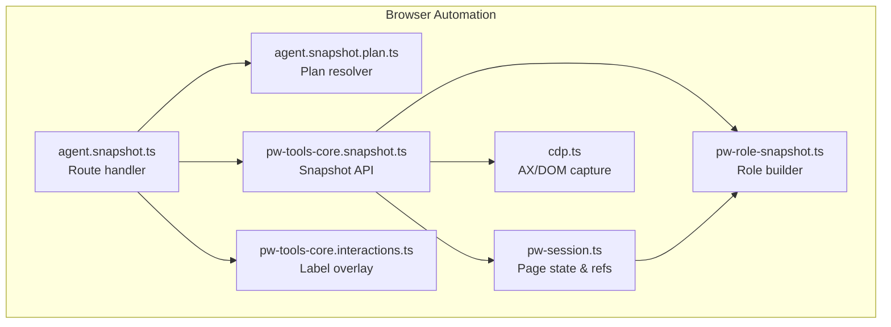
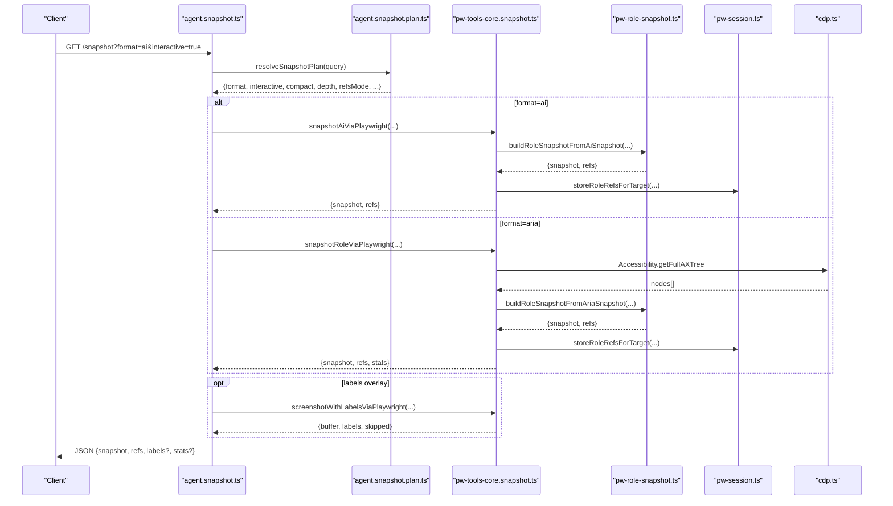
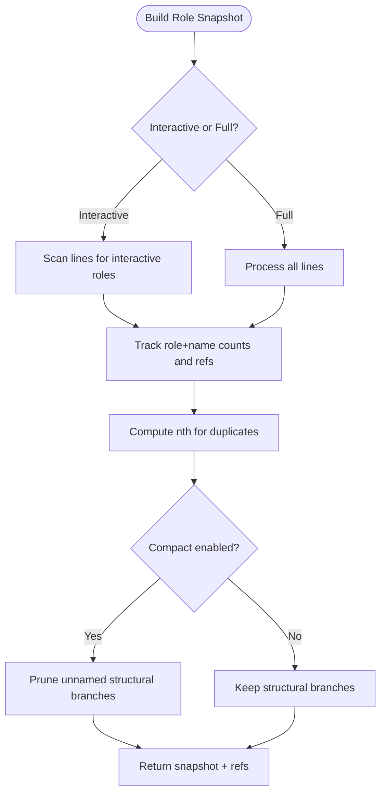
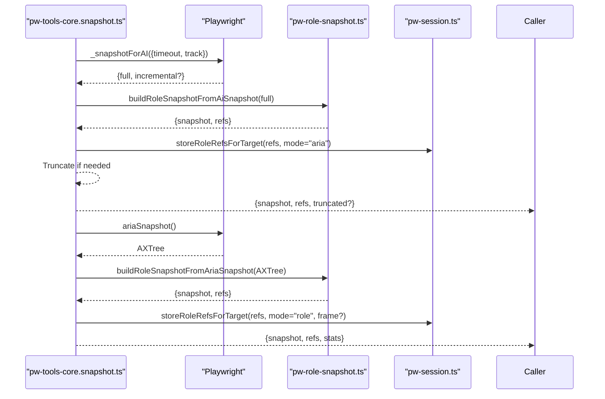
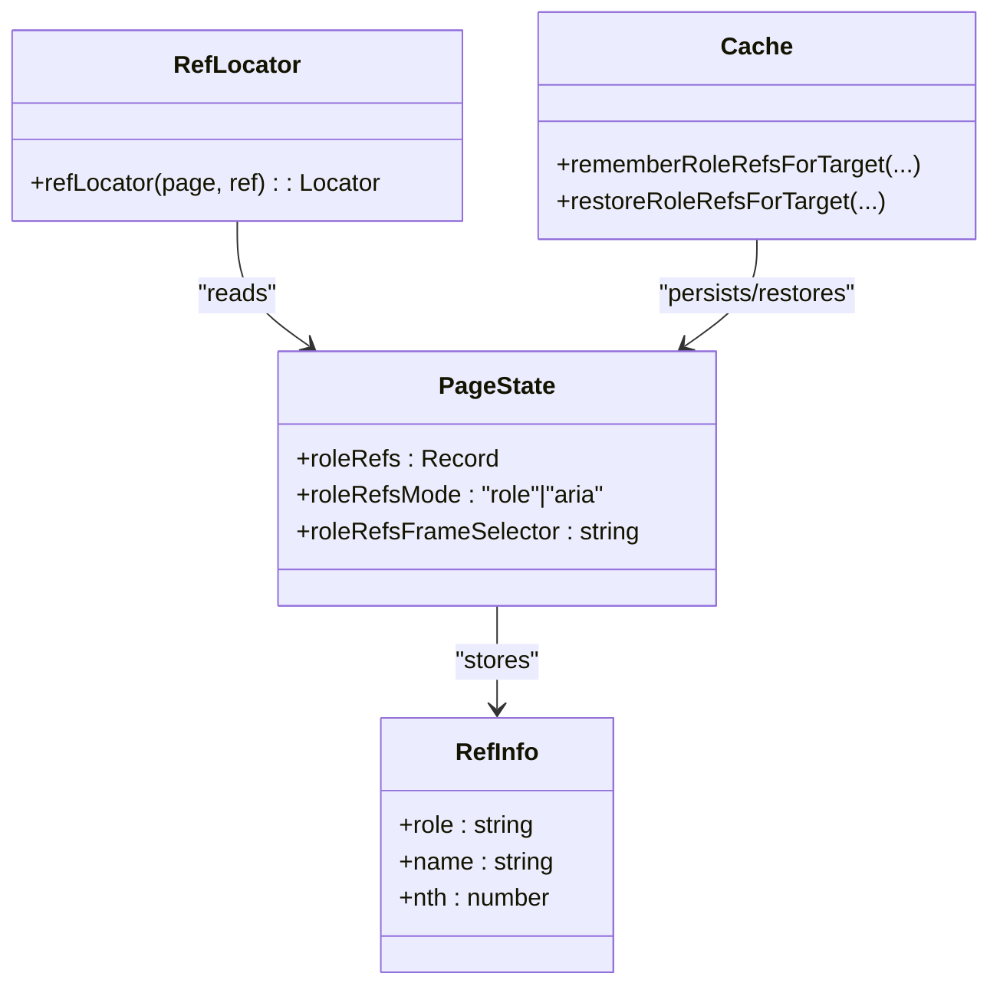
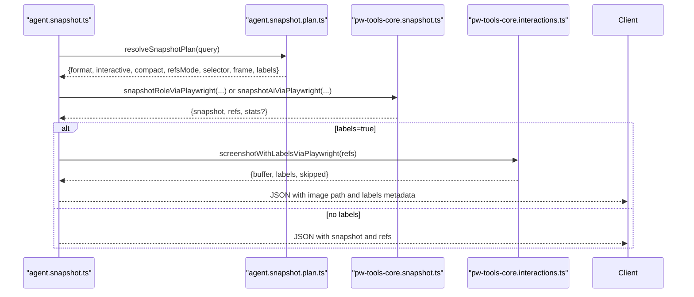
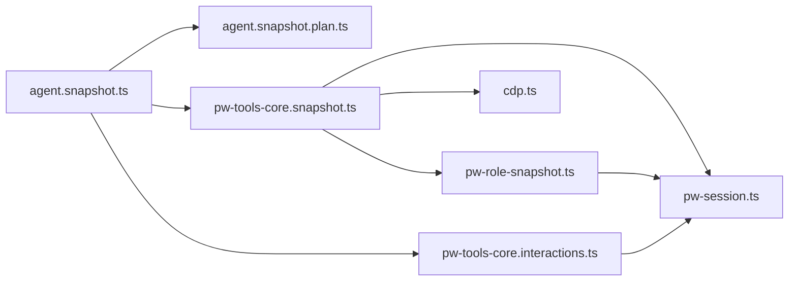

# Snapshot and Reference System

<cite>
**Referenced Files in This Document**
- [pw-role-snapshot.ts](file://src/browser/pw-role-snapshot.ts)
- [pw-tools-core.snapshot.ts](file://src/browser/pw-tools-core.snapshot.ts)
- [pw-session.ts](file://src/browser/pw-session.ts)
- [agent.snapshot.ts](file://src/browser/routes/agent.snapshot.ts)
- [agent.snapshot.plan.ts](file://src/browser/routes/agent.snapshot.plan.ts)
- [cdp.ts](file://src/browser/cdp.ts)
- [pw-ai.ts](file://src/browser/pw-ai.ts)
- [pw-tools-core.interactions.ts](file://src/browser/pw-tools-core.interactions.ts)
</cite>

## Table of Contents
1. [Introduction](#introduction)
2. [Project Structure](#project-structure)
3. [Core Components](#core-components)
4. [Architecture Overview](#architecture-overview)
5. [Detailed Component Analysis](#detailed-component-analysis)
6. [Dependency Analysis](#dependency-analysis)
7. [Performance Considerations](#performance-considerations)
8. [Troubleshooting Guide](#troubleshooting-guide)
9. [Conclusion](#conclusion)

## Introduction
This document explains the snapshot and reference system used by OpenClaw’s browser automation. It covers:
- AI snapshots with numeric references (e12 format)
- Role snapshots with role references
- Snapshot formats, reference resolution mechanisms, and stability guarantees
- Interactive snapshots, compact snapshots, frame-scoped snapshots, and label overlays
- Usage patterns, reference selection strategies, and troubleshooting
- Performance considerations and optimization techniques

## Project Structure
The snapshot system spans several modules:
- Role parsing and building: role snapshot builder and reference tracker
- Playwright integration: snapshot capture and reference caching
- Route orchestration: route handlers that assemble snapshots and optional overlays
- CDP utilities: low-level AX tree and DOM capture
- Interactions: label overlay rendering on screenshots

**Diagram sources**
- [agent.snapshot.ts](file://src/browser/routes/agent.snapshot.ts#L88-L343)
- [agent.snapshot.plan.ts](file://src/browser/routes/agent.snapshot.plan.ts#L29-L95)
- [pw-tools-core.snapshot.ts](file://src/browser/pw-tools-core.snapshot.ts#L25-L167)
- [pw-role-snapshot.ts](file://src/browser/pw-role-snapshot.ts#L322-L454)
- [pw-session.ts](file://src/browser/pw-session.ts#L140-L210)
- [cdp.ts](file://src/browser/cdp.ts#L282-L295)
- [pw-tools-core.interactions.ts](file://src/browser/pw-tools-core.interactions.ts#L474-L599)

**Section sources**
- [agent.snapshot.ts](file://src/browser/routes/agent.snapshot.ts#L88-L343)
- [agent.snapshot.plan.ts](file://src/browser/routes/agent.snapshot.plan.ts#L29-L95)
- [pw-tools-core.snapshot.ts](file://src/browser/pw-tools-core.snapshot.ts#L25-L167)
- [pw-role-snapshot.ts](file://src/browser/pw-role-snapshot.ts#L322-L454)
- [pw-session.ts](file://src/browser/pw-session.ts#L140-L210)
- [cdp.ts](file://src/browser/cdp.ts#L282-L295)
- [pw-tools-core.interactions.ts](file://src/browser/pw-tools-core.interactions.ts#L474-L599)

## Core Components
- Role snapshot builder: parses ARIA trees, assigns numeric references (e12), tracks duplicates, supports interactive/compact modes, and builds role snapshots with optional label overlays.
- Playwright snapshot API: captures AI snapshots and role snapshots, enforces limits, and stores references for later resolution.
- Page state and reference caching: persists role references per target, supports frame scoping, and restores references across requests.
- Route orchestrator: selects snapshot format and options, optionally adds label overlays, and returns structured results.
- CDP utilities: low-level AX tree and DOM capture for fallback scenarios.
- Label overlay: renders reference labels onto screenshots for visual debugging.

**Section sources**
- [pw-role-snapshot.ts](file://src/browser/pw-role-snapshot.ts#L1-L455)
- [pw-tools-core.snapshot.ts](file://src/browser/pw-tools-core.snapshot.ts#L25-L167)
- [pw-session.ts](file://src/browser/pw-session.ts#L75-L210)
- [agent.snapshot.ts](file://src/browser/routes/agent.snapshot.ts#L212-L341)
- [cdp.ts](file://src/browser/cdp.ts#L282-L295)
- [pw-tools-core.interactions.ts](file://src/browser/pw-tools-core.interactions.ts#L474-L599)

## Architecture Overview
The system integrates Playwright and CDP to produce two primary snapshot formats:
- AI snapshot: produced by Playwright’s internal AI snapshot engine, includes numeric references (e13) and can be truncated.
- Role snapshot: produced from ARIA snapshots, includes role-based references with optional interactive/compact filtering.

References are stored per target and can be resolved either via aria-ref attributes (aria mode) or Playwright’s getByRole locators (role mode). Label overlays can annotate screenshots with reference labels.

**Diagram sources**
- [agent.snapshot.ts](file://src/browser/routes/agent.snapshot.ts#L212-L304)
- [agent.snapshot.plan.ts](file://src/browser/routes/agent.snapshot.plan.ts#L29-L95)
- [pw-tools-core.snapshot.ts](file://src/browser/pw-tools-core.snapshot.ts#L53-L167)
- [pw-role-snapshot.ts](file://src/browser/pw-role-snapshot.ts#L322-L454)
- [pw-session.ts](file://src/browser/pw-session.ts#L165-L187)
- [cdp.ts](file://src/browser/cdp.ts#L282-L295)
- [pw-tools-core.interactions.ts](file://src/browser/pw-tools-core.interactions.ts#L474-L599)

## Detailed Component Analysis

### Role Snapshot Builder
Responsibilities:
- Parse ARIA trees and build role snapshots with indentation and reference markers.
- Assign numeric references (e12) and track duplicates to compute nth indices.
- Support interactive-only mode (buttons, links, inputs), compact mode (remove unnamed structural elements), and depth limits.
- Preserve Playwright’s own aria-ref ids when building from AI snapshots to enable self-resolving references.

Key behaviors:
- Interactive roles whitelist determines which elements receive references.
- Duplicate role+name combinations are disambiguated with nth.
- Compact mode prunes structural branches without names.
- AI snapshot mode extracts references from [ref=...] suffixes.

**Diagram sources**
- [pw-role-snapshot.ts](file://src/browser/pw-role-snapshot.ts#L322-L454)

**Section sources**
- [pw-role-snapshot.ts](file://src/browser/pw-role-snapshot.ts#L17-L88)
- [pw-role-snapshot.ts](file://src/browser/pw-role-snapshot.ts#L207-L267)
- [pw-role-snapshot.ts](file://src/browser/pw-role-snapshot.ts#L322-L454)

### Playwright Snapshot API
Responsibilities:
- Capture AI snapshots via Playwright’s internal _snapshotForAI and convert to role snapshots with numeric refs.
- Capture role snapshots via ariaSnapshot and convert to role snapshots with role refs.
- Enforce limits (maxChars for AI snapshots) and truncate when needed.
- Store references in page state and a target-scoped cache for stability.

Highlights:
- AI snapshots support truncation and preserve Playwright’s aria-ref ids.
- Role snapshots support frame selectors and selector scoping.
- References are stored with mode ("role" vs "aria"), optional frame selector, and restored on subsequent requests.

**Diagram sources**
- [pw-tools-core.snapshot.ts](file://src/browser/pw-tools-core.snapshot.ts#L53-L167)
- [pw-role-snapshot.ts](file://src/browser/pw-role-snapshot.ts#L322-L454)
- [pw-session.ts](file://src/browser/pw-session.ts#L165-L187)

**Section sources**
- [pw-tools-core.snapshot.ts](file://src/browser/pw-tools-core.snapshot.ts#L25-L95)
- [pw-tools-core.snapshot.ts](file://src/browser/pw-tools-core.snapshot.ts#L97-L167)

### Page State and Reference Caching
Responsibilities:
- Maintain per-page role references and mode.
- Persist references across requests using a target-scoped cache with LRU-like eviction.
- Restore references on page reuse and resolve references via aria-ref or getByRole.

Key points:
- Mode "aria": references are aria-ref ids; resolution uses aria-ref selectors.
- Mode "role": references are role+name+optional nth; resolution uses Playwright’s getByRole with exact name matching and nth indexing.
- Frame scoping: references can be scoped to a frame selector for accurate resolution.

**Diagram sources**
- [pw-session.ts](file://src/browser/pw-session.ts#L75-L92)
- [pw-session.ts](file://src/browser/pw-session.ts#L140-L210)
- [pw-session.ts](file://src/browser/pw-session.ts#L531-L568)

**Section sources**
- [pw-session.ts](file://src/browser/pw-session.ts#L75-L92)
- [pw-session.ts](file://src/browser/pw-session.ts#L140-L210)
- [pw-session.ts](file://src/browser/pw-session.ts#L531-L568)

### Route Orchestration and Label Overlays
Responsibilities:
- Resolve snapshot plan from query parameters (format, mode, interactive, compact, depth, refs mode, selector, frame).
- Choose AI vs role snapshot based on capabilities and defaults.
- Optionally attach label overlays to screenshots by rendering reference labels on top of the image.
- Return structured results including snapshot text, refs, stats, and optional image path.

Label overlay mechanism:
- Restores refs for the target.
- Computes bounding boxes for visible references within viewport.
- Injects temporary DOM overlays with labels and takes a screenshot.
- Cleans up overlays afterward.

**Diagram sources**
- [agent.snapshot.ts](file://src/browser/routes/agent.snapshot.ts#L212-L304)
- [agent.snapshot.plan.ts](file://src/browser/routes/agent.snapshot.plan.ts#L29-L95)
- [pw-tools-core.interactions.ts](file://src/browser/pw-tools-core.interactions.ts#L474-L599)

**Section sources**
- [agent.snapshot.ts](file://src/browser/routes/agent.snapshot.ts#L212-L341)
- [agent.snapshot.plan.ts](file://src/browser/routes/agent.snapshot.plan.ts#L14-L95)
- [pw-tools-core.interactions.ts](file://src/browser/pw-tools-core.interactions.ts#L474-L599)

### Low-Level CDP Utilities
Responsibilities:
- Provide AX tree and DOM snapshots via CDP for fallback scenarios.
- Enable evaluation-driven queries and DOM text extraction.

Usage in snapshot flow:
- Used when Playwright-based snapshots are unavailable or when AX trees are needed directly.

**Section sources**
- [cdp.ts](file://src/browser/cdp.ts#L282-L295)
- [cdp.ts](file://src/browser/cdp.ts#L199-L280)

## Dependency Analysis
The following diagram shows key dependencies among components involved in snapshot creation and reference resolution.

**Diagram sources**
- [agent.snapshot.ts](file://src/browser/routes/agent.snapshot.ts#L88-L343)
- [agent.snapshot.plan.ts](file://src/browser/routes/agent.snapshot.plan.ts#L29-L95)
- [pw-tools-core.snapshot.ts](file://src/browser/pw-tools-core.snapshot.ts#L25-L167)
- [pw-role-snapshot.ts](file://src/browser/pw-role-snapshot.ts#L322-L454)
- [pw-session.ts](file://src/browser/pw-session.ts#L140-L210)
- [cdp.ts](file://src/browser/cdp.ts#L282-L295)
- [pw-tools-core.interactions.ts](file://src/browser/pw-tools-core.interactions.ts#L474-L599)

**Section sources**
- [pw-tools-core.snapshot.ts](file://src/browser/pw-tools-core.snapshot.ts#L1-L263)
- [pw-role-snapshot.ts](file://src/browser/pw-role-snapshot.ts#L1-L455)
- [pw-session.ts](file://src/browser/pw-session.ts#L1-L858)
- [agent.snapshot.ts](file://src/browser/routes/agent.snapshot.ts#L1-L343)
- [agent.snapshot.plan.ts](file://src/browser/routes/agent.snapshot.plan.ts#L1-L98)
- [cdp.ts](file://src/browser/cdp.ts#L1-L486)
- [pw-tools-core.interactions.ts](file://src/browser/pw-tools-core.interactions.ts#L474-L599)

## Performance Considerations
- AI snapshot truncation: Cap the AI snapshot length to avoid oversized payloads; the API truncates with a sentinel notice.
- Interactive and compact modes: Reduce snapshot size by limiting to interactive elements and pruning unnamed structural branches.
- Depth limits: Restrict traversal depth to reduce processing cost.
- Target-scoped reference cache: Avoid recomputation across requests by caching refs per target and evicting older entries.
- Label overlays: Limit the number of rendered labels and skip off-screen elements to keep overlay generation efficient.
- Playwright fallback: Prefer Playwright’s native snapshot when available; otherwise fall back to CDP-based AX trees.

[No sources needed since this section provides general guidance]

## Troubleshooting Guide
Common issues and resolutions:
- Unknown reference error: Occurs when a reference is not present in the current page state. Ensure a recent snapshot was taken and the reference exists in the stored refs.
- Mixed modes: Using aria refs with role-mode resolution (or vice versa) can cause mismatches. Confirm refsMode aligns with how references were captured.
- Frame scoping: If references are scoped to a frame, ensure the frame selector is consistent across snapshot and interaction steps.
- Renderer swaps: After navigation, target IDs may change. Use the provided target resolution helper to reconcile the new target ID.
- Large snapshots: Use interactive/compact/depth options or AI truncation to reduce payload sizes.
- Label overlay failures: Verify that references are visible and within the viewport; off-screen elements are skipped.

**Section sources**
- [pw-session.ts](file://src/browser/pw-session.ts#L531-L568)
- [agent.snapshot.ts](file://src/browser/routes/agent.snapshot.ts#L52-L86)
- [pw-tools-core.interactions.ts](file://src/browser/pw-tools-core.interactions.ts#L474-L599)

## Conclusion
OpenClaw’s snapshot and reference system provides robust, stable, and efficient ways to capture and interact with browser content:
- AI snapshots offer concise, numeric references (e12) suitable for large pages.
- Role snapshots provide role-based references with precise disambiguation via nth.
- Reference caching and restoration ensure stability across requests.
- Optional label overlays aid visual debugging.
- Practical controls (interactive, compact, depth, truncation) balance fidelity and performance.