# State and Environment Management

<cite>
**Referenced Files in This Document**
- [client-actions-state.ts](file://src/browser/client-actions-state.ts)
- [agent.storage.ts](file://src/browser/routes/agent.storage.ts)
- [server-context.ts](file://src/browser/server-context.ts)
- [pw-session.ts](file://src/browser/pw-session.ts)
- [constants.ts](file://src/browser/constants.ts)
- [server-browser.ts](file://src/gateway/server-browser.ts)
- [client-actions-types.ts](file://src/browser/client-actions-types.ts)
- [client-actions-url.ts](file://src/browser/client-actions-url.ts)
- [browser-cli-shared.ts](file://src/cli/browser-cli-shared.ts)
</cite>

## Table of Contents
1. [Introduction](#introduction)
2. [Project Structure](#project-structure)
3. [Core Components](#core-components)
4. [Architecture Overview](#architecture-overview)
5. [Detailed Component Analysis](#detailed-component-analysis)
6. [Dependency Analysis](#dependency-analysis)
7. [Performance Considerations](#performance-considerations)
8. [Troubleshooting Guide](#troubleshooting-guide)
9. [Conclusion](#conclusion)

## Introduction
This document explains how OpenClaw manages browser state and environment across profiles and tabs. It covers cookie management, local/session storage operations, offline mode toggles, HTTP header customization, credential management, geolocation simulation, media preferences, timezone and locale settings, device emulation, viewport manipulation, network state control, and environment customization. It also provides examples of state manipulation workflows, environment setup patterns, and troubleshooting guidance for state-related issues.

## Project Structure
OpenClaw’s browser state and environment management spans several modules:
- Client action APIs that expose state and environment controls to callers
- Route handlers that translate HTTP requests into Playwright/C DP operations
- Runtime context that orchestrates profiles, tabs, and lifecycle
- Session utilities that connect to browsers via CDP and operate on pages
- Gateway integration that exposes browser control as a service

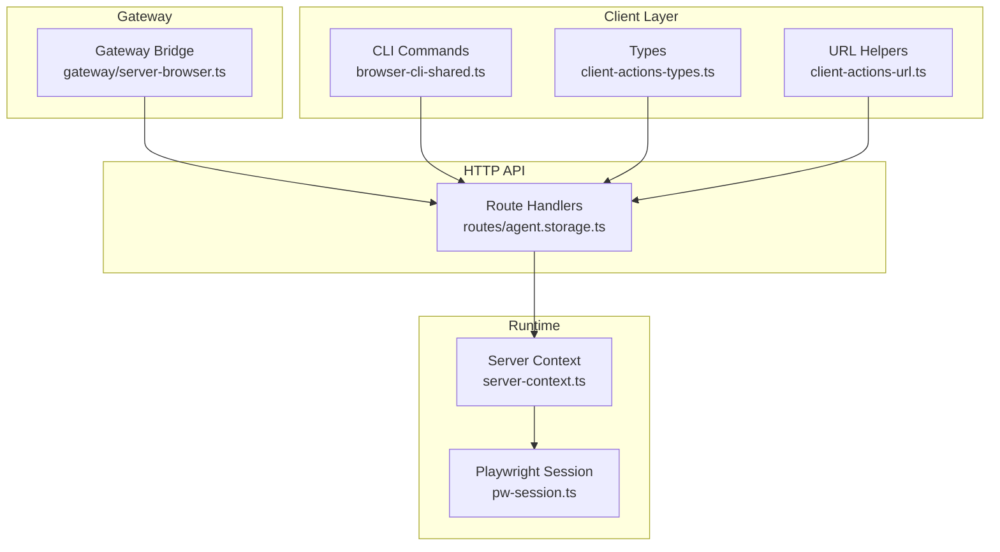

**Diagram sources**
- [client-actions-state.ts](file://src/browser/client-actions-state.ts#L1-L279)
- [agent.storage.ts](file://src/browser/routes/agent.storage.ts#L66-L451)
- [server-context.ts](file://src/browser/server-context.ts#L118-L241)
- [pw-session.ts](file://src/browser/pw-session.ts#L332-L385)
- [server-browser.ts](file://src/gateway/server-browser.ts#L7-L31)
- [client-actions-types.ts](file://src/browser/client-actions-types.ts#L1-L17)
- [client-actions-url.ts](file://src/browser/client-actions-url.ts#L1-L12)
- [browser-cli-shared.ts](file://src/cli/browser-cli-shared.ts#L30-L62)

**Section sources**
- [client-actions-state.ts](file://src/browser/client-actions-state.ts#L1-L279)
- [agent.storage.ts](file://src/browser/routes/agent.storage.ts#L66-L451)
- [server-context.ts](file://src/browser/server-context.ts#L118-L241)
- [pw-session.ts](file://src/browser/pw-session.ts#L332-L385)
- [server-browser.ts](file://src/gateway/server-browser.ts#L7-L31)
- [client-actions-types.ts](file://src/browser/client-actions-types.ts#L1-L17)
- [client-actions-url.ts](file://src/browser/client-actions-url.ts#L1-L12)
- [browser-cli-shared.ts](file://src/cli/browser-cli-shared.ts#L30-L62)

## Core Components
- Client action APIs: Provide typed functions to manipulate cookies, storage, offline mode, headers, credentials, geolocation, media, timezone, locale, device, and permissions. These functions build queries and dispatch HTTP requests.
- Route handlers: Expose endpoints under /cookies, /storage/:kind, /set/* for state/environment mutations. They validate inputs, resolve targetId/profile, and invoke Playwright/C DP operations.
- Server context: Manages profile lifecycles, availability, tab selection, and resets. It ensures a browser is reachable and a tab is available for operations.
- Playwright session: Connects to browsers via CDP, lists/creates/focuses/closes pages, and executes CDP commands for state/environment changes.
- Gateway integration: Starts the browser control service and exposes it to clients via the gateway.

**Section sources**
- [client-actions-state.ts](file://src/browser/client-actions-state.ts#L70-L279)
- [agent.storage.ts](file://src/browser/routes/agent.storage.ts#L66-L451)
- [server-context.ts](file://src/browser/server-context.ts#L45-L116)
- [pw-session.ts](file://src/browser/pw-session.ts#L332-L385)
- [server-browser.ts](file://src/gateway/server-browser.ts#L7-L31)

## Architecture Overview
The state and environment management pipeline:
- Clients call client action APIs or HTTP endpoints
- Requests are routed through agent storage handlers
- Handlers resolve targetId/profile and run within a Playwright context
- Operations are executed against the target tab via CDP
- Responses are returned with targetId and status

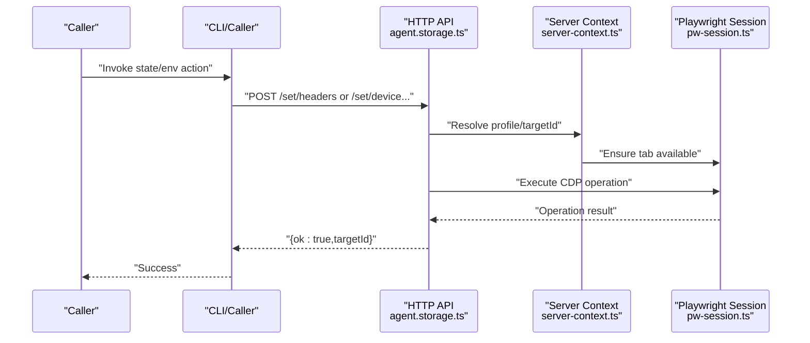

**Diagram sources**
- [client-actions-state.ts](file://src/browser/client-actions-state.ts#L168-L267)
- [agent.storage.ts](file://src/browser/routes/agent.storage.ts#L255-L288)
- [server-context.ts](file://src/browser/server-context.ts#L78-L93)
- [pw-session.ts](file://src/browser/pw-session.ts#L496-L503)

## Detailed Component Analysis

### Cookie Management
- Retrieve cookies for a target tab
- Set a cookie with structured attributes
- Clear cookies for a target tab

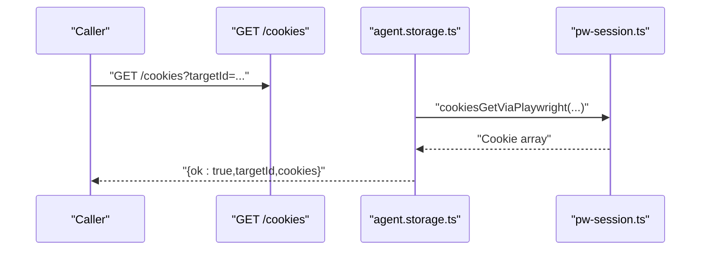

**Diagram sources**
- [agent.storage.ts](file://src/browser/routes/agent.storage.ts#L70-L86)
- [client-actions-state.ts](file://src/browser/client-actions-state.ts#L70-L80)

**Section sources**
- [client-actions-state.ts](file://src/browser/client-actions-state.ts#L70-L106)
- [agent.storage.ts](file://src/browser/routes/agent.storage.ts#L70-L149)

### Local and Session Storage
- Get storage entries (optionally filtered by key)
- Set a key/value pair
- Clear all entries for a kind

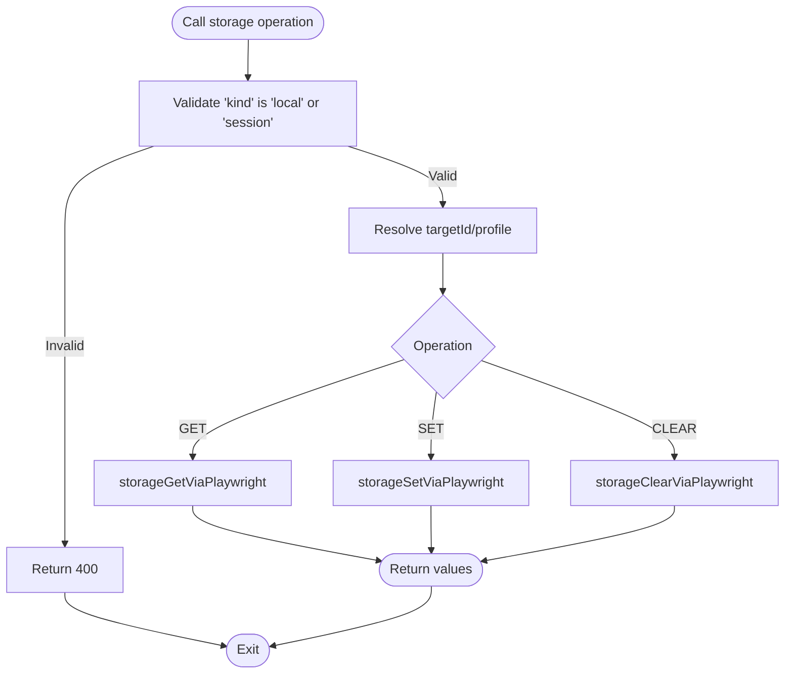

**Diagram sources**
- [agent.storage.ts](file://src/browser/routes/agent.storage.ts#L151-L228)
- [client-actions-state.ts](file://src/browser/client-actions-state.ts#L108-L155)

**Section sources**
- [client-actions-state.ts](file://src/browser/client-actions-state.ts#L108-L155)
- [agent.storage.ts](file://src/browser/routes/agent.storage.ts#L151-L228)

### Offline Mode Toggle
- Toggle offline flag for a target tab

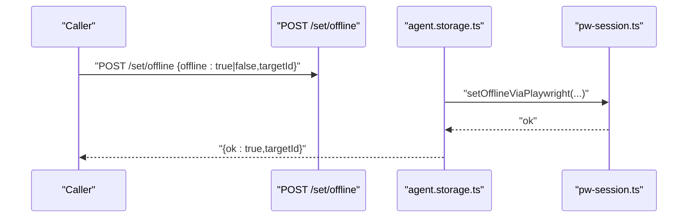

**Diagram sources**
- [agent.storage.ts](file://src/browser/routes/agent.storage.ts#L230-L253)
- [client-actions-state.ts](file://src/browser/client-actions-state.ts#L157-L166)

**Section sources**
- [client-actions-state.ts](file://src/browser/client-actions-state.ts#L157-L166)
- [agent.storage.ts](file://src/browser/routes/agent.storage.ts#L230-L253)

### Header Customization
- Set extra HTTP headers for a target tab

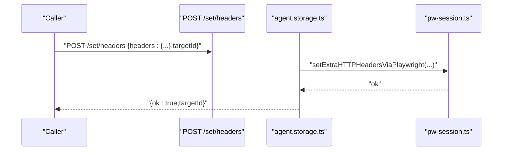

**Diagram sources**
- [agent.storage.ts](file://src/browser/routes/agent.storage.ts#L255-L288)
- [client-actions-state.ts](file://src/browser/client-actions-state.ts#L168-L181)

**Section sources**
- [client-actions-state.ts](file://src/browser/client-actions-state.ts#L168-L181)
- [agent.storage.ts](file://src/browser/routes/agent.storage.ts#L255-L288)

### Credential Management
- Set HTTP credentials (username/password) or clear them

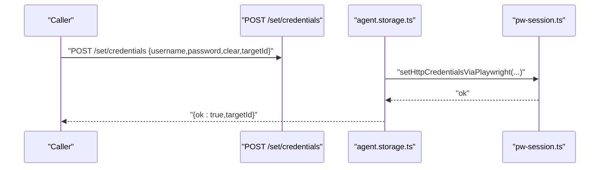

**Diagram sources**
- [agent.storage.ts](file://src/browser/routes/agent.storage.ts#L290-L314)
- [client-actions-state.ts](file://src/browser/client-actions-state.ts#L183-L196)

**Section sources**
- [client-actions-state.ts](file://src/browser/client-actions-state.ts#L183-L196)
- [agent.storage.ts](file://src/browser/routes/agent.storage.ts#L290-L314)

### Geolocation Simulation
- Set or clear geolocation for a target tab

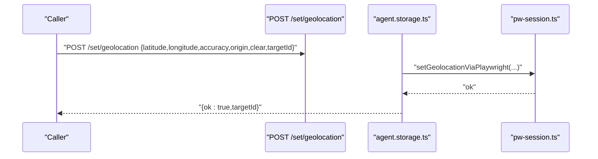

**Diagram sources**
- [agent.storage.ts](file://src/browser/routes/agent.storage.ts#L316-L344)
- [client-actions-state.ts](file://src/browser/client-actions-state.ts#L198-L213)

**Section sources**
- [client-actions-state.ts](file://src/browser/client-actions-state.ts#L198-L213)
- [agent.storage.ts](file://src/browser/routes/agent.storage.ts#L316-L344)

### Media Preferences
- Emulate media color scheme for a target tab

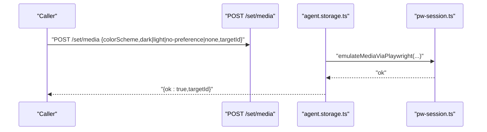

**Diagram sources**
- [agent.storage.ts](file://src/browser/routes/agent.storage.ts#L346-L375)
- [client-actions-state.ts](file://src/browser/client-actions-state.ts#L215-L231)

**Section sources**
- [client-actions-state.ts](file://src/browser/client-actions-state.ts#L215-L231)
- [agent.storage.ts](file://src/browser/routes/agent.storage.ts#L346-L375)

### Timezone and Locale Settings
- Set timezoneId for a target tab
- Set locale for a target tab

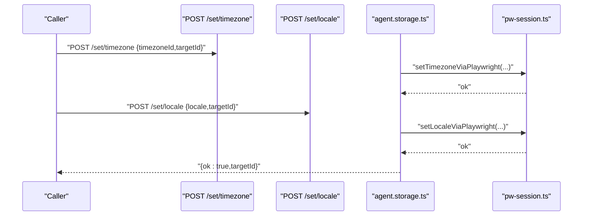

**Diagram sources**
- [agent.storage.ts](file://src/browser/routes/agent.storage.ts#L377-L425)
- [client-actions-state.ts](file://src/browser/client-actions-state.ts#L233-L256)

**Section sources**
- [client-actions-state.ts](file://src/browser/client-actions-state.ts#L233-L256)
- [agent.storage.ts](file://src/browser/routes/agent.storage.ts#L377-L425)

### Device Emulation
- Set device by name for a target tab

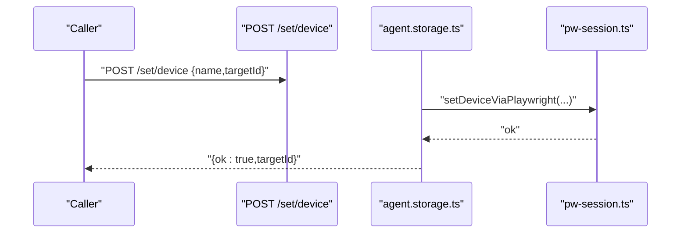

**Diagram sources**
- [agent.storage.ts](file://src/browser/routes/agent.storage.ts#L427-L450)
- [client-actions-state.ts](file://src/browser/client-actions-state.ts#L258-L267)

**Section sources**
- [client-actions-state.ts](file://src/browser/client-actions-state.ts#L258-L267)
- [agent.storage.ts](file://src/browser/routes/agent.storage.ts#L427-L450)

### Permissions Reset
- Clear geolocation permission for a target tab

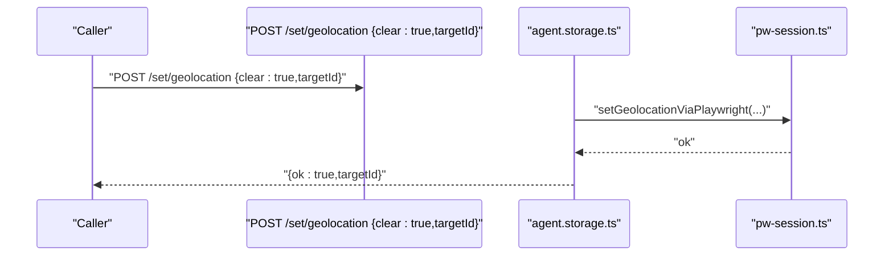

**Diagram sources**
- [agent.storage.ts](file://src/browser/routes/agent.storage.ts#L316-L344)
- [client-actions-state.ts](file://src/browser/client-actions-state.ts#L269-L279)

**Section sources**
- [client-actions-state.ts](file://src/browser/client-actions-state.ts#L269-L279)
- [agent.storage.ts](file://src/browser/routes/agent.storage.ts#L316-L344)

### Viewport Manipulation
- Resize the browser window for a given profile and optional targetId
- Implemented via CLI request to the gateway

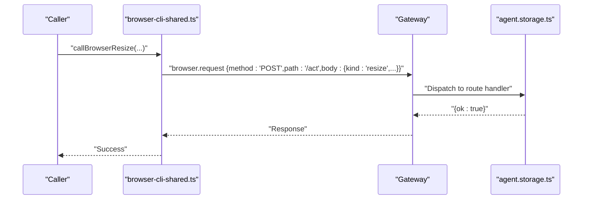

**Diagram sources**
- [browser-cli-shared.ts](file://src/cli/browser-cli-shared.ts#L64-L84)
- [agent.storage.ts](file://src/browser/routes/agent.storage.ts#L66-L86)

**Section sources**
- [browser-cli-shared.ts](file://src/cli/browser-cli-shared.ts#L64-L84)
- [agent.storage.ts](file://src/browser/routes/agent.storage.ts#L66-L86)

## Dependency Analysis
- Client action APIs depend on URL helpers and typed responses
- Route handlers depend on server context for profile/target resolution and Playwright session for CDP operations
- Gateway integration lazily starts the browser control service and delegates to the server module

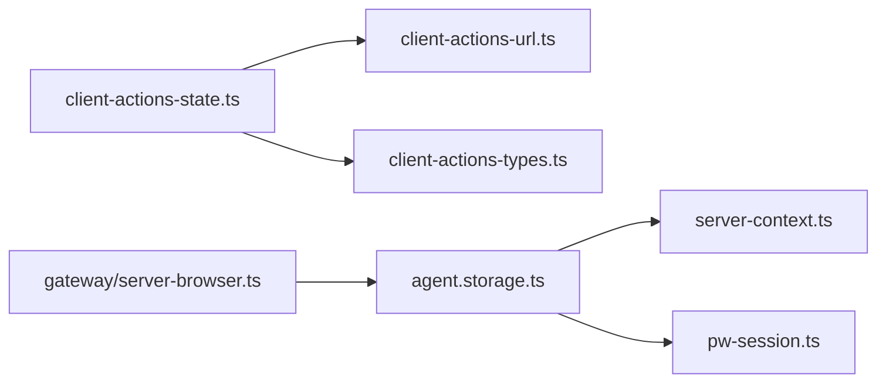

**Diagram sources**
- [client-actions-state.ts](file://src/browser/client-actions-state.ts#L1-L279)
- [client-actions-url.ts](file://src/browser/client-actions-url.ts#L1-L12)
- [client-actions-types.ts](file://src/browser/client-actions-types.ts#L1-L17)
- [agent.storage.ts](file://src/browser/routes/agent.storage.ts#L66-L451)
- [server-context.ts](file://src/browser/server-context.ts#L118-L241)
- [pw-session.ts](file://src/browser/pw-session.ts#L332-L385)
- [server-browser.ts](file://src/gateway/server-browser.ts#L7-L31)

**Section sources**
- [client-actions-state.ts](file://src/browser/client-actions-state.ts#L1-L279)
- [agent.storage.ts](file://src/browser/routes/agent.storage.ts#L66-L451)
- [server-context.ts](file://src/browser/server-context.ts#L118-L241)
- [pw-session.ts](file://src/browser/pw-session.ts#L332-L385)
- [server-browser.ts](file://src/gateway/server-browser.ts#L7-L31)

## Performance Considerations
- CDP connection reuse: Persistent connections reduce overhead; avoid frequent reconnects.
- Target resolution: Prefer explicit targetId to minimize ambiguity and fallback logic.
- Batch operations: Group related state/env changes to reduce round trips.
- Timeout tuning: Adjust timeouts for slow environments or remote profiles.
- Memory footprint: Limit retained logs/errors/requests buffers in long-lived sessions.

[No sources needed since this section provides general guidance]

## Troubleshooting Guide
Common issues and resolutions:
- Profile not found: Ensure the profile exists and is configured; verify default profile settings.
- Tab not available: Confirm the browser is reachable and a page exists; use tab selection helpers.
- CDP connectivity failures: Validate CDP URL/host reachability; check firewall/proxy settings.
- Invalid input errors: Ensure required fields (e.g., timezoneId, locale, colorScheme) are provided and valid.
- Permission errors: Some operations require the browser to be reachable and the tab to be focused.

Operational checks:
- Verify gateway exposure of the browser control service
- Confirm profile availability and tab counts
- Validate targetId resolution and existence

**Section sources**
- [server-context.ts](file://src/browser/server-context.ts#L138-L144)
- [server-context.ts](file://src/browser/server-context.ts#L166-L202)
- [pw-session.ts](file://src/browser/pw-session.ts#L496-L503)
- [agent.storage.ts](file://src/browser/routes/agent.storage.ts#L380-L383)
- [agent.storage.ts](file://src/browser/routes/agent.storage.ts#L405-L408)
- [agent.storage.ts](file://src/browser/routes/agent.storage.ts#L356-L358)

## Conclusion
OpenClaw provides a cohesive, HTTP-driven interface to manage browser state and environment across profiles and tabs. Client action APIs and route handlers encapsulate validations and CDP operations, while server context and Playwright session orchestrate availability and lifecycle. By following the workflows and patterns outlined here, users can reliably manipulate cookies, storage, offline mode, headers, credentials, geolocation, media, timezone/locale, device emulation, and viewport sizing, and troubleshoot state-related issues effectively.