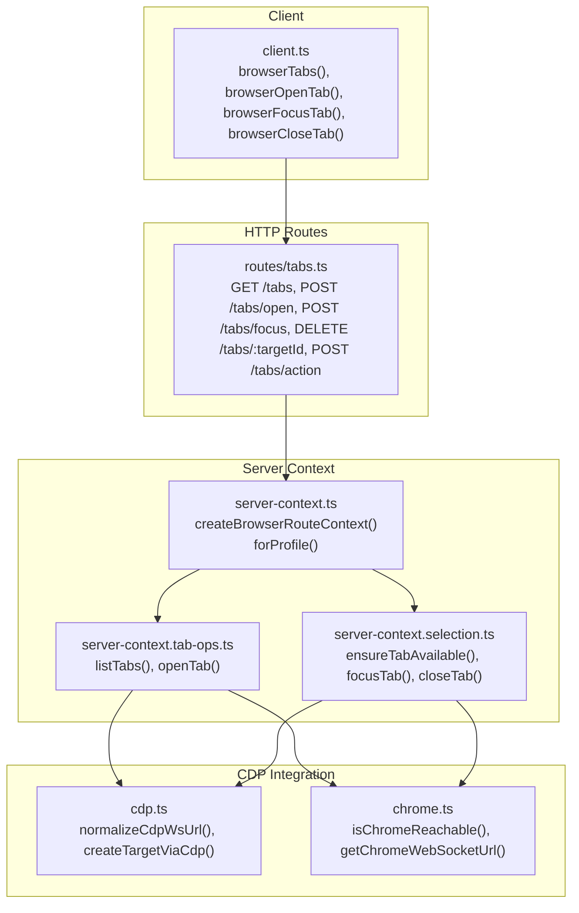
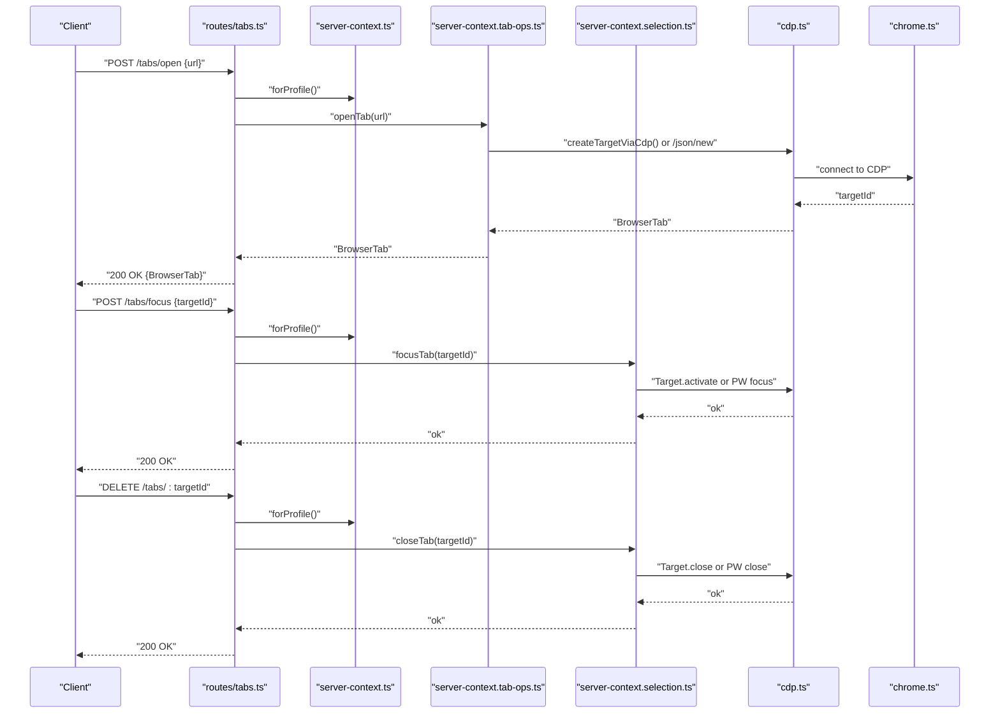
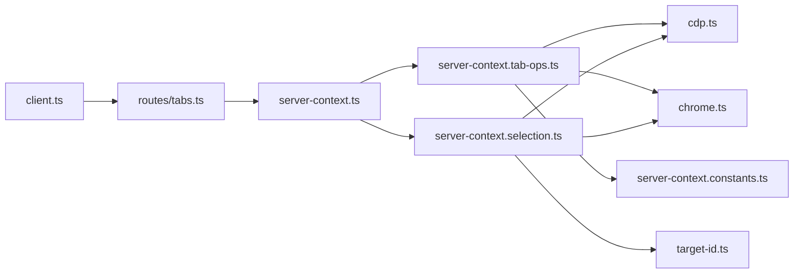
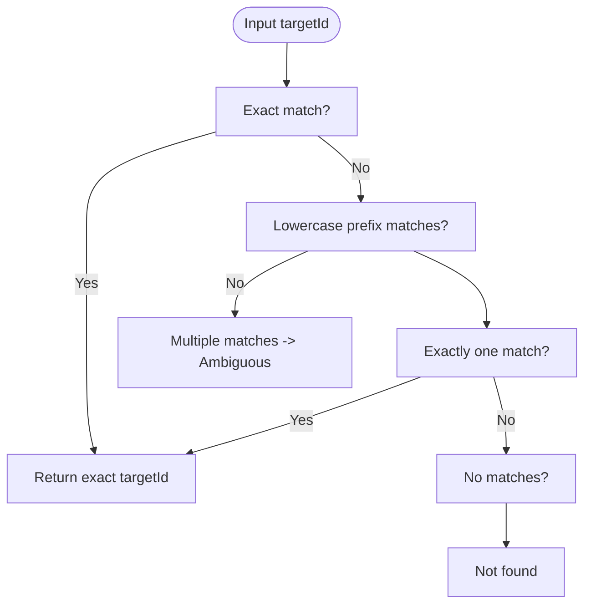

# Tab Management

<cite>
**Referenced Files in This Document**
- [client.ts](file://src/browser/client.ts)
- [routes/tabs.ts](file://src/browser/routes/tabs.ts)
- [server-context.ts](file://src/browser/server-context.ts)
- [server-context.tab-ops.ts](file://src/browser/server-context.tab-ops.ts)
- [server-context.selection.ts](file://src/browser/server-context.selection.ts)
- [cdp.ts](file://src/browser/cdp.ts)
- [chrome.ts](file://src/browser/chrome.ts)
- [errors.ts](file://src/browser/errors.ts)
- [target-id.ts](file://src/browser/target-id.ts)
- [server-context.constants.ts](file://src/browser/server-context.constants.ts)
- [server-context.loopback-direct-ws.test.ts](file://src/browser/server-context.loopback-direct-ws.test.ts)
- [server-context.remote-profile-tab-ops.test.ts](file://src/browser/server-context.remote-profile-tab-ops.test.ts)
- [pw-session.browserless.live.test.ts](file://src/browser/pw-session.browserless.live.test.ts)
- [browser.md](file://docs/zh-CN/cli/browser.md)
- [browser-linux-troubleshooting.md](file://docs/tools/browser-linux-troubleshooting.md)
</cite>

## Table of Contents
1. [Introduction](#introduction)
2. [Project Structure](#project-structure)
3. [Core Components](#core-components)
4. [Architecture Overview](#architecture-overview)
5. [Detailed Component Analysis](#detailed-component-analysis)
6. [Dependency Analysis](#dependency-analysis)
7. [Performance Considerations](#performance-considerations)
8. [Troubleshooting Guide](#troubleshooting-guide)
9. [Conclusion](#conclusion)
10. [Appendices](#appendices)

## Introduction
This document explains tab management in OpenClaw browser automation. It covers listing tabs, opening new tabs, focusing specific tabs, closing tabs, and selecting tabs by targetId. It also documents tab lifecycle management, state tracking, isolation guarantees, and differences across browser profiles (OpenClaw-managed, Chrome extension relay, and remote CDP). Practical workflow patterns, error handling, and best practices for robust tab operations are included.

## Project Structure
OpenClaw’s tab management spans client APIs, HTTP routes, and profile-specific implementations:
- Client API: thin wrappers around HTTP endpoints for listing, opening, focusing, and closing tabs.
- Routes: HTTP handlers that validate requests, ensure availability, and delegate to profile contexts.
- Server context: orchestrates profile-aware operations, manages runtime state, and selects the correct backend (CDP vs Playwright).
- CDP integration: low-level Chrome Debugging Protocol operations for tab listing, creation, activation, and closure.
- Profiles and capabilities: profile resolution, capability detection, and profile-specific behaviors.

**Diagram sources**
- [client.ts](file://src/browser/client.ts#L206-L276)
- [routes/tabs.ts](file://src/browser/routes/tabs.ts#L102-L222)
- [server-context.ts](file://src/browser/server-context.ts#L118-L241)
- [server-context.tab-ops.ts](file://src/browser/server-context.tab-ops.ts#L59-L229)
- [server-context.selection.ts](file://src/browser/server-context.selection.ts#L25-L159)
- [cdp.ts](file://src/browser/cdp.ts#L19-L140)
- [chrome.ts](file://src/browser/chrome.ts#L96-L149)

**Section sources**
- [client.ts](file://src/browser/client.ts#L206-L276)
- [routes/tabs.ts](file://src/browser/routes/tabs.ts#L102-L222)
- [server-context.ts](file://src/browser/server-context.ts#L118-L241)

## Core Components
- Client API: Provides typed functions for tab operations and profile scoping.
- Route handlers: Enforce validation, reachability, and map domain-specific errors.
- Profile context: Encapsulates profile-aware tab operations and state.
- Tab operations: Implements listing and creation via CDP or Playwright.
- Selection operations: Ensures a tab is available, resolves targetId, focuses, and closes.
- CDP helpers: Normalize WebSocket URLs, create targets, and evaluate JavaScript.
- Target ID resolution: Ambiguity-safe resolution of target identifiers.

**Section sources**
- [client.ts](file://src/browser/client.ts#L44-L50)
- [routes/tabs.ts](file://src/browser/routes/tabs.ts#L64-L78)
- [server-context.tab-ops.ts](file://src/browser/server-context.tab-ops.ts#L59-L229)
- [server-context.selection.ts](file://src/browser/server-context.selection.ts#L25-L159)
- [cdp.ts](file://src/browser/cdp.ts#L19-L140)
- [target-id.ts](file://src/browser/target-id.ts#L1-L31)

## Architecture Overview
End-to-end tab operation flow from client to browser:

**Diagram sources**
- [routes/tabs.ts](file://src/browser/routes/tabs.ts#L119-L168)
- [server-context.ts](file://src/browser/server-context.ts#L129-L145)
- [server-context.tab-ops.ts](file://src/browser/server-context.tab-ops.ts#L134-L223)
- [server-context.selection.ts](file://src/browser/server-context.selection.ts#L111-L152)
- [cdp.ts](file://src/browser/cdp.ts#L103-L140)
- [chrome.ts](file://src/browser/chrome.ts#L96-L149)

## Detailed Component Analysis

### Client API: Tab Operations
- Listing tabs: fetches running state and tab list for a profile.
- Opening tabs: posts a URL to create a new tab.
- Focusing tabs: activates a tab by targetId.
- Closing tabs: deletes a tab by targetId.
- Action-based operations: list/new/close/select via a single endpoint with an action parameter.

Key behaviors:
- Profile scoping via query parameter.
- Timeouts tailored to operation sensitivity.
- Unified JSON transport.

**Section sources**
- [client.ts](file://src/browser/client.ts#L206-L276)

### HTTP Routes: Validation and Delegation
- GET /tabs: checks reachability and returns running state plus tabs.
- POST /tabs/open: validates URL, ensures browser availability, opens tab.
- POST /tabs/focus: validates targetId, ensures browser availability, focuses tab.
- DELETE /tabs/:targetId: validates targetId, ensures browser availability, closes tab.
- POST /tabs/action: supports list/new/close/select with index-based selection.

Error handling:
- Maps domain-specific errors to HTTP status codes.
- Returns structured JSON errors for malformed inputs.

**Section sources**
- [routes/tabs.ts](file://src/browser/routes/tabs.ts#L102-L222)

### Server Context: Profile-Aware Operations
- Creates a profile-scoped context for all operations.
- Exposes methods to ensure browser/tab availability, list, open, focus, and close.
- Maintains runtime state including last selected targetId for sticky selection.

**Section sources**
- [server-context.ts](file://src/browser/server-context.ts#L118-L241)

### Tab Operations: Listing and Creation
- Listing tabs:
  - Uses Playwright persistent mode when supported.
  - Falls back to CDP /json/list.
  - Normalizes WebSocket URLs for accessibility.
- Creating tabs:
  - Uses Playwright when supported.
  - Otherwise uses Target.createTarget or /json/new.
  - Enforces navigation policies and SSRF checks.
  - Tracks last targetId and enforces managed tab limits.

Managed tab limit:
- Limits concurrent page tabs for managed browsers.
- Best-effort cleanup of excess tabs.

**Section sources**
- [server-context.tab-ops.ts](file://src/browser/server-context.tab-ops.ts#L67-L223)
- [server-context.constants.ts](file://src/browser/server-context.constants.ts#L1-L9)

### Selection Operations: Availability, Focus, and Close
- ensureTabAvailable:
  - Ensures browser is available.
  - If no tabs exist and profile requires attachment, waits briefly for extension relay to reconnect.
  - Otherwise opens a blank tab.
  - Resolves targetId (exact match or prefix), preferring last targetId or a real page tab.
- focusTab:
  - Resolves targetId and activates via Playwright or CDP.
  - Updates last targetId.
- closeTab:
  - Resolves targetId and closes via Playwright or CDP.

Target ID resolution:
- Supports exact match and single-prefix match.
- Returns ambiguity errors when multiple matches exist.

**Section sources**
- [server-context.selection.ts](file://src/browser/server-context.selection.ts#L35-L152)
- [target-id.ts](file://src/browser/target-id.ts#L5-L31)

### CDP Integration: Low-Level Operations
- normalizeCdpWsUrl: Rewrites wildcard or loopback WebSocket URLs to externally reachable ones.
- createTargetViaCdp: Establishes a WebSocket to CDP and creates a target.
- Additional utilities for screenshots and evaluation are available for advanced scenarios.

**Section sources**
- [cdp.ts](file://src/browser/cdp.ts#L19-L140)

### Profiles and Capabilities
- Profiles support different drivers and capabilities:
  - Managed browser (OpenClaw-managed) with loopback CDP.
  - Extension relay (Chrome extension) requiring attached tabs.
  - Remote CDP (e.g., browserless) using persistent Playwright connections.
- Capability detection influences tab operations (e.g., persistent Playwright for remote profiles).

**Section sources**
- [server-context.tab-ops.ts](file://src/browser/server-context.tab-ops.ts#L65-L80)
- [server-context.selection.ts](file://src/browser/server-context.selection.ts#L32-L33)
- [chrome.ts](file://src/browser/chrome.ts#L96-L149)

### Examples: Workflow Patterns
- List tabs and open a new tab:
  - Call list tabs to discover current tabs.
  - Open a new tab with a URL.
  - Optionally focus the newly created tab by targetId.
- Close a specific tab:
  - Resolve targetId if needed.
  - Close the tab and optionally select another tab by index.
- Remote CDP workflow:
  - Use Playwright-backed operations for listing, focusing, and closing tabs.
  - Validate CDP connectivity before operations.

**Section sources**
- [server-context.loopback-direct-ws.test.ts](file://src/browser/server-context.loopback-direct-ws.test.ts#L127-L142)
- [pw-session.browserless.live.test.ts](file://src/browser/pw-session.browserless.live.test.ts#L15-L32)

## Dependency Analysis
Tab operations depend on profile capabilities and CDP semantics. The following diagram shows key dependencies:

**Diagram sources**
- [client.ts](file://src/browser/client.ts#L206-L276)
- [routes/tabs.ts](file://src/browser/routes/tabs.ts#L102-L222)
- [server-context.ts](file://src/browser/server-context.ts#L118-L241)
- [server-context.tab-ops.ts](file://src/browser/server-context.tab-ops.ts#L59-L229)
- [server-context.selection.ts](file://src/browser/server-context.selection.ts#L25-L159)
- [cdp.ts](file://src/browser/cdp.ts#L19-L140)
- [chrome.ts](file://src/browser/chrome.ts#L96-L149)
- [target-id.ts](file://src/browser/target-id.ts#L1-L31)
- [server-context.constants.ts](file://src/browser/server-context.constants.ts#L1-L9)

**Section sources**
- [server-context.ts](file://src/browser/server-context.ts#L72-L115)
- [server-context.tab-ops.ts](file://src/browser/server-context.tab-ops.ts#L65-L80)
- [server-context.selection.ts](file://src/browser/server-context.selection.ts#L32-L33)

## Performance Considerations
- Discovery polling: New tab discovery uses bounded polling with short intervals and a windowed timeout to balance responsiveness and overhead.
- Managed tab limit enforcement: Best-effort cleanup avoids excessive resource usage in managed browsers.
- Persistent connections: Remote CDP profiles leverage Playwright’s persistent connection to reduce overhead for frequent operations.

**Section sources**
- [server-context.constants.ts](file://src/browser/server-context.constants.ts#L3-L9)
- [server-context.tab-ops.ts](file://src/browser/server-context.tab-ops.ts#L102-L132)

## Troubleshooting Guide
Common issues and resolutions:
- Browser not running:
  - Ensure the browser is started for the chosen profile.
  - Use the CLI to start the managed browser or attach the extension relay.
- Tab not found:
  - For extension relay, ensure the toolbar icon is active on the desired tab.
  - Use targetId resolution to disambiguate prefixes.
- Ambiguous targetId:
  - Provide a longer unique prefix or exact targetId.
- Remote CDP connectivity:
  - Verify CDP URL and credentials.
  - Confirm persistent connection availability for remote profiles.

Operational references:
- CLI browser profile usage and defaults.
- Linux troubleshooting guidance for managed vs extension relay modes.

**Section sources**
- [routes/tabs.ts](file://src/browser/routes/tabs.ts#L52-L62)
- [server-context.selection.ts](file://src/browser/server-context.selection.ts#L52-L58)
- [target-id.ts](file://src/browser/target-id.ts#L26-L29)
- [browser.md](file://docs/zh-CN/cli/browser.md#L43-L48)
- [browser-linux-troubleshooting.md](file://docs/tools/browser-linux-troubleshooting.md#L129-L140)

## Conclusion
OpenClaw’s tab management provides a consistent, profile-aware interface across OpenClaw-managed, Chrome extension relay, and remote CDP environments. The design emphasizes robust error handling, targetId resolution, and capability-driven operation selection. By leveraging sticky selection and managed tab limits, workflows remain predictable and resource-efficient.

## Appendices

### Error Types and Status Codes
- Validation and configuration errors map to 400.
- Not found and ambiguous target errors map to 404 and 409 respectively.
- Unavailable or conflicting states map to 409.
- Resource exhaustion maps to 507.

**Section sources**
- [errors.ts](file://src/browser/errors.ts#L14-L82)

### Target Resolution Flow

**Diagram sources**
- [target-id.ts](file://src/browser/target-id.ts#L5-L31)