# UI Interaction Actions

<cite>
**Referenced Files in This Document**
- [pw-tools-core.interactions.ts](file://src/browser/pw-tools-core.interactions.ts)
- [agent.act.ts](file://src/browser/routes/agent.act.ts)
- [pw-tools-core.shared.ts](file://src/browser/pw-tools-core.shared.ts)
- [pw-session.ts](file://src/browser/pw-session.ts)
- [register.element.ts](file://src/cli/browser-cli-actions-input/register.element.ts)
- [client-actions-core.ts](file://src/browser/client-actions-core.ts)
- [agent.act.shared.ts](file://src/browser/routes/agent.act.shared.ts)
- [pw-role-snapshot.ts](file://src/browser/pw-role-snapshot.ts)
- [web-fetch-visibility.ts](file://src/agents/tools/web-fetch-visibility.ts)
</cite>

## Table of Contents
1. [Introduction](#introduction)
2. [Project Structure](#project-structure)
3. [Core Components](#core-components)
4. [Architecture Overview](#architecture-overview)
5. [Detailed Component Analysis](#detailed-component-analysis)
6. [Dependency Analysis](#dependency-analysis)
7. [Performance Considerations](#performance-considerations)
8. [Troubleshooting Guide](#troubleshooting-guide)
9. [Conclusion](#conclusion)
10. [Appendices](#appendices)

## Introduction
This document explains UI interaction actions in OpenClaw browser automation. It covers click actions (single and double), typing, hover, drag-and-drop, and element selection. It also documents how actions target elements using numeric refs and role refs, how to chain actions and conditionally execute them, and how visibility detection, strict mode handling, and failure recovery work. Practical examples and best practices are included to help you build reliable UI automation flows.

## Project Structure
OpenClaw’s browser automation is implemented as a layered system:
- Route handlers accept action requests and validate parameters.
- Action implementations call Playwright wrappers to perform UI interactions.
- Session utilities manage Playwright pages, role-based references, and timeouts.
- CLI commands provide convenient ways to trigger actions from the terminal.

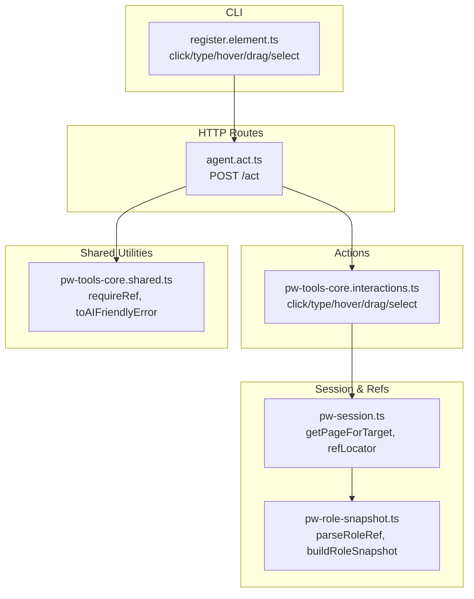

**Diagram sources**
- [agent.act.ts](file://src/browser/routes/agent.act.ts#L21-L322)
- [pw-tools-core.interactions.ts](file://src/browser/pw-tools-core.interactions.ts#L45-L195)
- [pw-session.ts](file://src/browser/pw-session.ts#L505-L568)
- [pw-role-snapshot.ts](file://src/browser/pw-role-snapshot.ts#L309-L320)
- [register.element.ts](file://src/cli/browser-cli-actions-input/register.element.ts#L41-L195)
- [pw-tools-core.shared.ts](file://src/browser/pw-tools-core.shared.ts#L22-L70)

**Section sources**
- [agent.act.ts](file://src/browser/routes/agent.act.ts#L21-L322)
- [pw-tools-core.interactions.ts](file://src/browser/pw-tools-core.interactions.ts#L45-L195)
- [pw-session.ts](file://src/browser/pw-session.ts#L505-L568)
- [pw-role-snapshot.ts](file://src/browser/pw-role-snapshot.ts#L309-L320)
- [register.element.ts](file://src/cli/browser-cli-actions-input/register.element.ts#L41-L195)
- [pw-tools-core.shared.ts](file://src/browser/pw-tools-core.shared.ts#L22-L70)

## Core Components
- Action router: Validates action kinds and parameters, then dispatches to Playwright wrappers.
- Playwright wrappers: Perform actual UI interactions with robust error translation.
- Reference resolution: Converts role refs (e.g., e1) and role names into Playwright locators.
- CLI commands: Provide convenient command-line entry points for common actions.

Key capabilities:
- Click: supports single-click, double-click, mouse button, and modifier keys.
- Type: fills or types into inputs; optionally submits or types slowly.
- Hover: moves the pointer over an element.
- Drag-and-drop: drags from one element ref to another.
- Select: chooses option(s) in select/combobox elements.
- Wait: waits for text, URL changes, load states, or evaluates conditions.
- Evaluate: runs JavaScript in the page context with timeout protection.

**Section sources**
- [agent.act.ts](file://src/browser/routes/agent.act.ts#L46-L311)
- [pw-tools-core.interactions.ts](file://src/browser/pw-tools-core.interactions.ts#L59-L195)
- [pw-session.ts](file://src/browser/pw-session.ts#L531-L568)
- [pw-tools-core.shared.ts](file://src/browser/pw-tools-core.shared.ts#L22-L70)
- [register.element.ts](file://src/cli/browser-cli-actions-input/register.element.ts#L41-L195)

## Architecture Overview
The action pipeline follows a consistent flow: validate and parse request → resolve target and page → translate ref to locator → execute action → return structured response.

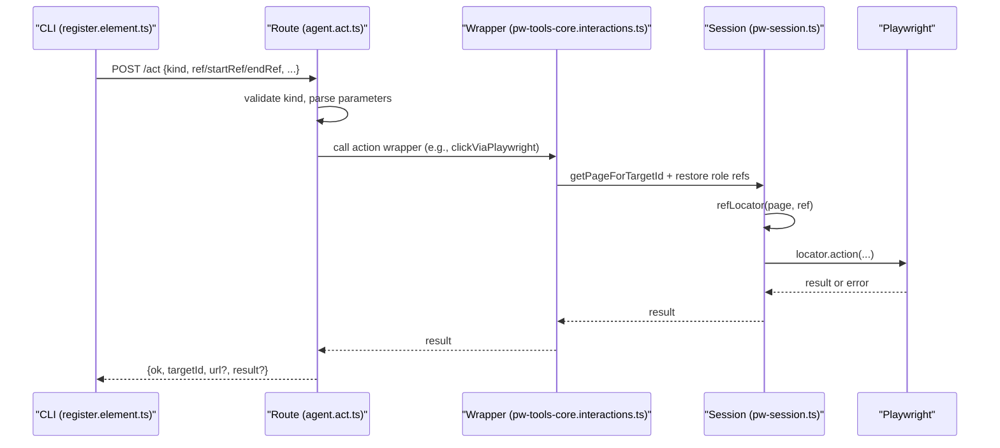

**Diagram sources**
- [register.element.ts](file://src/cli/browser-cli-actions-input/register.element.ts#L41-L195)
- [agent.act.ts](file://src/browser/routes/agent.act.ts#L25-L322)
- [pw-tools-core.interactions.ts](file://src/browser/pw-tools-core.interactions.ts#L59-L195)
- [pw-session.ts](file://src/browser/pw-session.ts#L505-L568)

## Detailed Component Analysis

### Click Actions
- Supported modes: single-click and double-click.
- Options: mouse button (left/right/middle), keyboard modifiers (Alt, Control, ControlOrMeta, Meta, Shift), and timeout.
- Behavior: resolves ref to a locator and invokes Playwright’s click or dblclick with validated parameters.

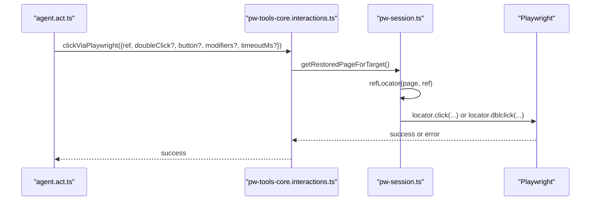

**Diagram sources**
- [agent.act.ts](file://src/browser/routes/agent.act.ts#L46-L83)
- [pw-tools-core.interactions.ts](file://src/browser/pw-tools-core.interactions.ts#L59-L89)
- [pw-session.ts](file://src/browser/pw-session.ts#L505-L568)

**Section sources**
- [agent.act.ts](file://src/browser/routes/agent.act.ts#L46-L83)
- [pw-tools-core.interactions.ts](file://src/browser/pw-tools-core.interactions.ts#L59-L89)
- [agent.act.shared.ts](file://src/browser/routes/agent.act.shared.ts#L25-L52)

### Typing Operations
- Supports filling text into inputs and optionally submitting (Enter) or typing slowly (human-like).
- Uses locator.fill or click + type with a delay.

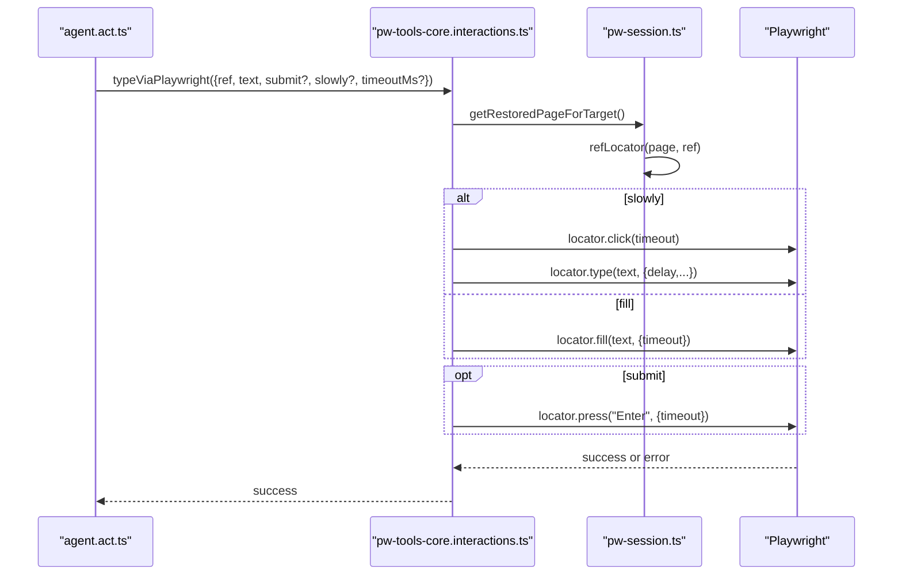

**Diagram sources**
- [agent.act.ts](file://src/browser/routes/agent.act.ts#L84-L108)
- [pw-tools-core.interactions.ts](file://src/browser/pw-tools-core.interactions.ts#L168-L195)
- [pw-session.ts](file://src/browser/pw-session.ts#L505-L568)

**Section sources**
- [agent.act.ts](file://src/browser/routes/agent.act.ts#L84-L108)
- [pw-tools-core.interactions.ts](file://src/browser/pw-tools-core.interactions.ts#L168-L195)

### Hover Interactions
- Moves the pointer over an element identified by ref.

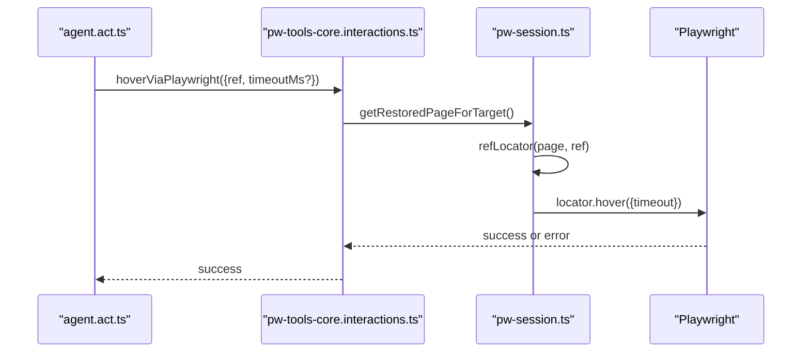

**Diagram sources**
- [agent.act.ts](file://src/browser/routes/agent.act.ts#L124-L137)
- [pw-tools-core.interactions.ts](file://src/browser/pw-tools-core.interactions.ts#L91-L106)
- [pw-session.ts](file://src/browser/pw-session.ts#L505-L568)

**Section sources**
- [agent.act.ts](file://src/browser/routes/agent.act.ts#L124-L137)
- [pw-tools-core.interactions.ts](file://src/browser/pw-tools-core.interactions.ts#L91-L106)

### Drag-and-Drop
- Drags from a start element ref to an end element ref.

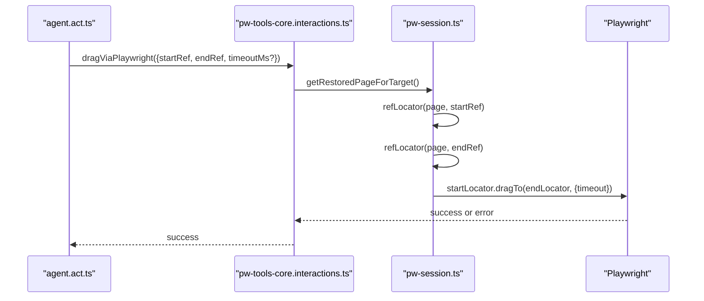

**Diagram sources**
- [agent.act.ts](file://src/browser/routes/agent.act.ts#L155-L170)
- [pw-tools-core.interactions.ts](file://src/browser/pw-tools-core.interactions.ts#L108-L128)
- [pw-session.ts](file://src/browser/pw-session.ts#L505-L568)

**Section sources**
- [agent.act.ts](file://src/browser/routes/agent.act.ts#L155-L170)
- [pw-tools-core.interactions.ts](file://src/browser/pw-tools-core.interactions.ts#L108-L128)

### Element Selection
- Selects option(s) in select/combobox elements by their values.

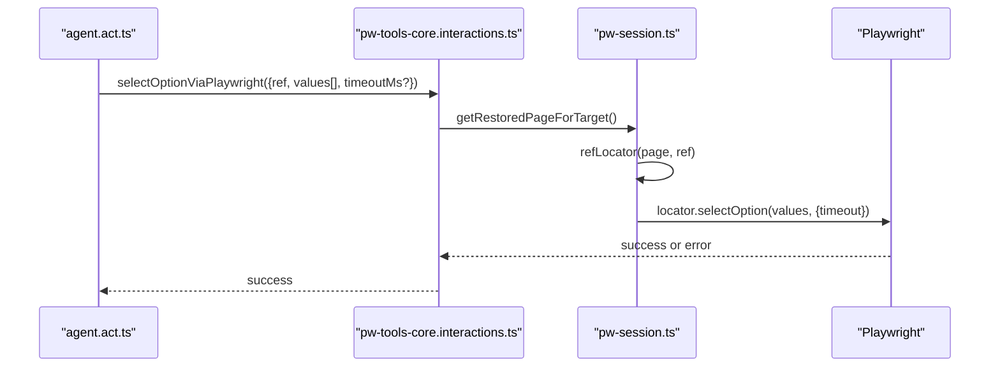

**Diagram sources**
- [agent.act.ts](file://src/browser/routes/agent.act.ts#L171-L186)
- [pw-tools-core.interactions.ts](file://src/browser/pw-tools-core.interactions.ts#L130-L149)
- [pw-session.ts](file://src/browser/pw-session.ts#L505-L568)

**Section sources**
- [agent.act.ts](file://src/browser/routes/agent.act.ts#L171-L186)
- [pw-tools-core.interactions.ts](file://src/browser/pw-tools-core.interactions.ts#L130-L149)

### Action Chaining and Conditional Execution
- Chaining: Issue multiple /act requests sequentially; each returns immediately upon completion or failure.
- Conditional execution: Use wait actions to pause until a condition is met (text appears/disappears, URL changes, load state, or a function evaluates to truthy).
- Wait action supports multiple conditions simultaneously; it validates that at least one condition is provided.

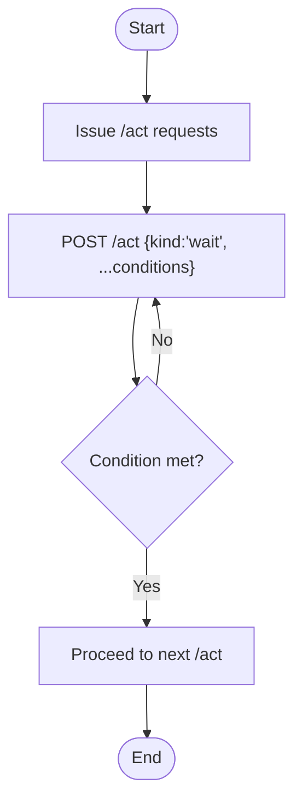

**Diagram sources**
- [agent.act.ts](file://src/browser/routes/agent.act.ts#L223-L276)

**Section sources**
- [agent.act.ts](file://src/browser/routes/agent.act.ts#L223-L276)

### Action Parameter Specifications
Common parameters across actions:
- kind: action type (e.g., click, type, hover, drag, select, wait, evaluate).
- ref/startRef/endRef: element identifiers (role ref or aria-ref).
- targetId: optional CDP target identifier for multi-tab scenarios.
- timeoutMs: per-action timeout clamped to safe bounds.
- Additional kind-specific parameters (e.g., button, modifiers for click; values for select; text for type).

Representative request shapes are defined in the client action core.

**Section sources**
- [client-actions-core.ts](file://src/browser/client-actions-core.ts#L15-L76)
- [agent.act.shared.ts](file://src/browser/routes/agent.act.shared.ts#L1-L53)

### Action Targeting: Numeric Refs and Role Refs
- Numeric refs: OpenClaw assigns numeric refs (e.g., e1, e2) during role snapshots. These are stable across requests and resolve to Playwright locators.
- Role refs: Support both Playwright aria-ref ids and role/name pairs. The session resolver selects the appropriate mode and scope.
- Reference parsing: Accepts raw forms like e12, @e12, or ref=e12 and normalizes them.

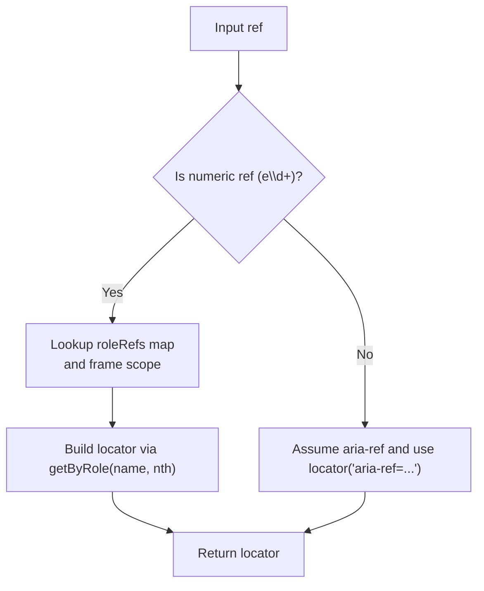

**Diagram sources**
- [pw-session.ts](file://src/browser/pw-session.ts#L531-L568)
- [pw-role-snapshot.ts](file://src/browser/pw-role-snapshot.ts#L309-L320)

**Section sources**
- [pw-session.ts](file://src/browser/pw-session.ts#L531-L568)
- [pw-role-snapshot.ts](file://src/browser/pw-role-snapshot.ts#L309-L320)

### Visibility Detection and Strict Mode Handling
- Visibility: Actions report friendly errors when elements are not visible or not interactable (e.g., overlapped or off-screen).
- Strict mode: When a ref resolves to multiple elements, the system reports a strict mode violation and suggests refreshing the snapshot or refining the ref.
- Visibility filtering: Separate tools can sanitize HTML by removing invisible elements based on CSS properties and classes.

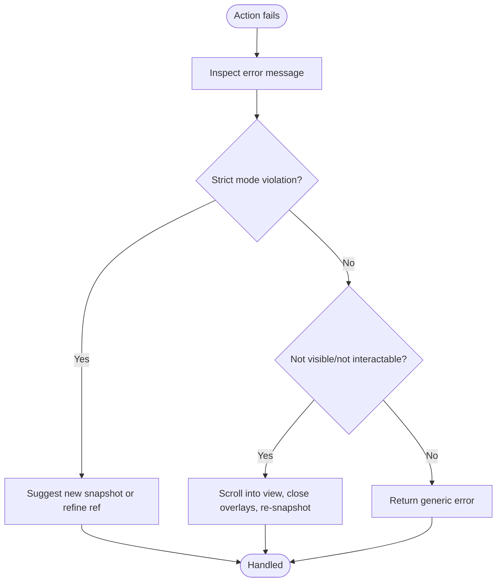

**Diagram sources**
- [pw-tools-core.shared.ts](file://src/browser/pw-tools-core.shared.ts#L36-L70)
- [web-fetch-visibility.ts](file://src/agents/tools/web-fetch-visibility.ts#L1-L86)

**Section sources**
- [pw-tools-core.shared.ts](file://src/browser/pw-tools-core.shared.ts#L36-L70)
- [web-fetch-visibility.ts](file://src/agents/tools/web-fetch-visibility.ts#L1-L86)

### Action Failure Recovery
- Evaluate timeouts: Long-running evaluate is protected by an injected race against a timeout; aborts can terminate execution via CDP.
- General failures: Errors are translated into user-friendly messages; consider retrying with adjusted conditions or re-snapshotting.

**Section sources**
- [pw-tools-core.interactions.ts](file://src/browser/pw-tools-core.interactions.ts#L237-L365)

## Dependency Analysis
The following diagram highlights key dependencies among components involved in UI interactions.

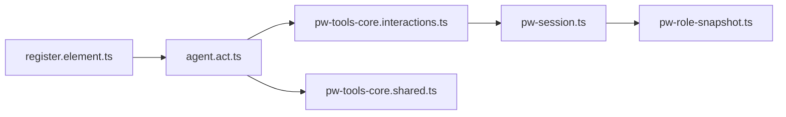

**Diagram sources**
- [agent.act.ts](file://src/browser/routes/agent.act.ts#L21-L322)
- [pw-tools-core.interactions.ts](file://src/browser/pw-tools-core.interactions.ts#L1-L651)
- [pw-session.ts](file://src/browser/pw-session.ts#L1-L858)
- [pw-role-snapshot.ts](file://src/browser/pw-role-snapshot.ts#L1-L455)
- [pw-tools-core.shared.ts](file://src/browser/pw-tools-core.shared.ts#L1-L71)
- [register.element.ts](file://src/cli/browser-cli-actions-input/register.element.ts#L1-L196)

**Section sources**
- [agent.act.ts](file://src/browser/routes/agent.act.ts#L21-L322)
- [pw-tools-core.interactions.ts](file://src/browser/pw-tools-core.interactions.ts#L1-L651)
- [pw-session.ts](file://src/browser/pw-session.ts#L1-L858)
- [pw-role-snapshot.ts](file://src/browser/pw-role-snapshot.ts#L1-L455)
- [pw-tools-core.shared.ts](file://src/browser/pw-tools-core.shared.ts#L1-L71)
- [register.element.ts](file://src/cli/browser-cli-actions-input/register.element.ts#L1-L196)

## Performance Considerations
- Timeout bounds: Per-action timeouts are normalized to a safe range to avoid blocking the Playwright command queue.
- Evaluate safety: Long-running evaluate is bounded and can be aborted; aborts trigger a forced disconnection and reconnection to unstick the browser.
- Human-like typing: Slow typing introduces delays to mimic realistic input patterns.

[No sources needed since this section provides general guidance]

## Troubleshooting Guide
Common issues and resolutions:
- Selector not found or not visible: Re-run a snapshot to refresh refs; ensure the element is visible and not overlapped.
- Not interactable (hidden or covered): Scroll into view, close overlays, or re-snapshot.
- Strict mode violation: The ref matched multiple elements; refine the ref or use a different one.
- Evaluate hangs: Aborting the request terminates execution via CDP and reconnects Playwright.

**Section sources**
- [pw-tools-core.shared.ts](file://src/browser/pw-tools-core.shared.ts#L36-L70)
- [pw-session.ts](file://src/browser/pw-session.ts#L695-L724)

## Conclusion
OpenClaw’s UI interaction system provides a robust, typed, and resilient set of actions for browser automation. By leveraging role-based refs, strict error handling, and friendly error messages, it enables reliable automation workflows. Combine wait actions and evaluate for conditional execution, and use slow typing and scroll-into-view to improve realism and reliability.

[No sources needed since this section summarizes without analyzing specific files]

## Appendices

### Example Workflows
- Single-click a button by ref, then type into an input, then submit:
  - POST /act: { kind: "click", ref: "e12" }
  - POST /act: { kind: "type", ref: "e34", text: "hello", submit: true }
- Double-click a row to edit, then drag to reorder:
  - POST /act: { kind: "click", ref: "e56", doubleClick: true }
  - POST /act: { kind: "drag", startRef: "e78", endRef: "e90" }
- Wait for a modal to appear, then select an option:
  - POST /act: { kind: "wait", text: "Confirm", timeoutMs: 10000 }
  - POST /act: { kind: "select", ref: "e21", values: ["yes"] }

[No sources needed since this section provides general guidance]