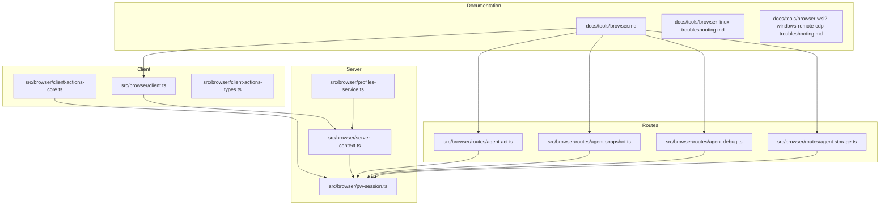
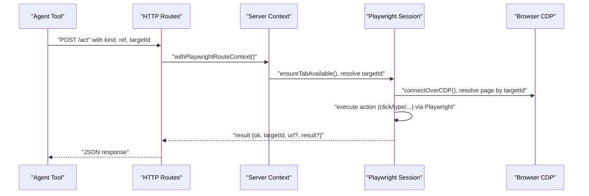
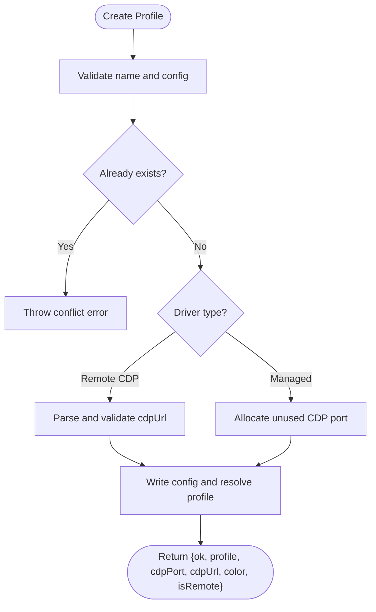
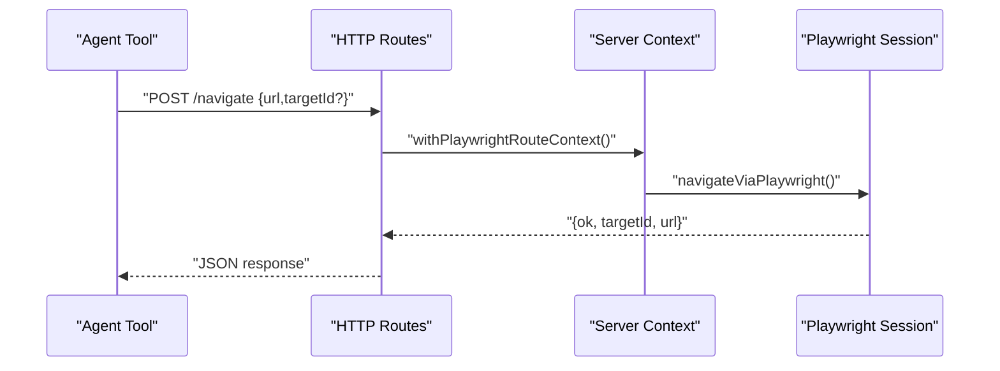
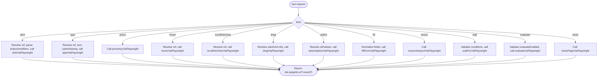
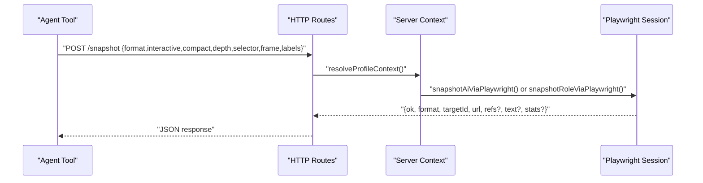
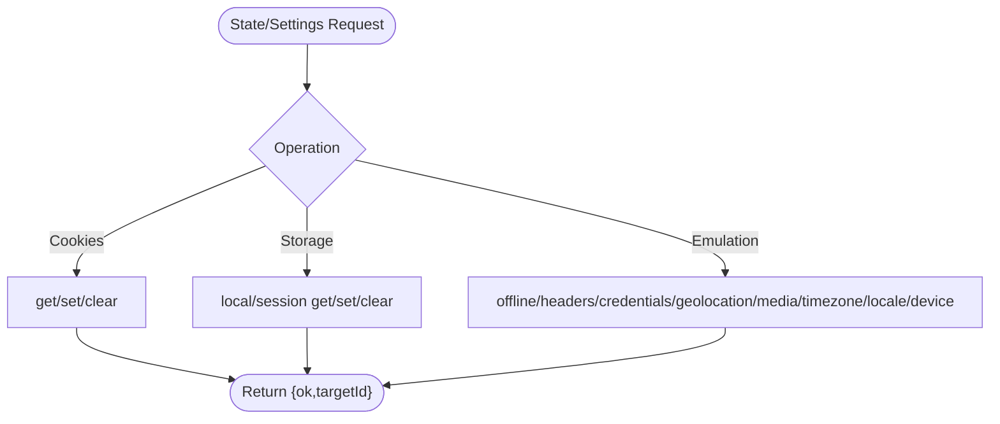
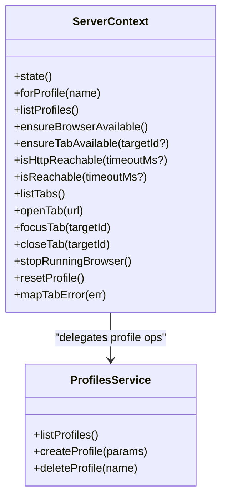
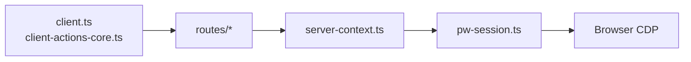

# Browser Automation

<cite>
**Referenced Files in This Document**
- [browser.md](file://docs/tools/browser.md)
- [browser-linux-troubleshooting.md](file://docs/tools/browser-linux-troubleshooting.md)
- [browser-wsl2-windows-remote-cdp-troubleshooting.md](file://docs/tools/browser-wsl2-windows-remote-cdp-troubleshooting.md)
- [client.ts](file://src/browser/client.ts)
- [client-actions-core.ts](file://src/browser/client-actions-core.ts)
- [client-actions-types.ts](file://src/browser/client-actions-types.ts)
- [profiles-service.ts](file://src/browser/profiles-service.ts)
- [server-context.ts](file://src/browser/server-context.ts)
- [pw-session.ts](file://src/browser/pw-session.ts)
- [agent.act.ts](file://src/browser/routes/agent.act.ts)
- [agent.snapshot.ts](file://src/browser/routes/agent.snapshot.ts)
- [agent.debug.ts](file://src/browser/routes/agent.debug.ts)
- [agent.storage.ts](file://src/browser/routes/agent.storage.ts)
</cite>

## Table of Contents
1. [Introduction](#introduction)
2. [Project Structure](#project-structure)
3. [Core Components](#core-components)
4. [Architecture Overview](#architecture-overview)
5. [Detailed Component Analysis](#detailed-component-analysis)
6. [Dependency Analysis](#dependency-analysis)
7. [Performance Considerations](#performance-considerations)
8. [Troubleshooting Guide](#troubleshooting-guide)
9. [Conclusion](#conclusion)
10. [Appendices](#appendices)

## Introduction
This document explains OpenClaw’s browser automation capabilities. It covers the browser control system, including profile management, tab operations, UI interactions, and screenshot functionality. It documents the browser tool’s actions (status, start, stop, tabs, open, focus, close, snapshot, screenshot, act, navigate, console, pdf, upload, dialog), along with detailed parameter specifications. It also explains how to create, delete, and manage browser profiles, including port allocation and multi-instance support. Finally, it provides troubleshooting guidance for Linux startup issues and WSL2 remote Chrome CDP problems, along with examples of common browser automation workflows and security considerations.

## Project Structure
OpenClaw’s browser automation spans documentation, client libraries, HTTP routes, and Playwright-backed operations:
- Documentation defines configuration, profiles, actions, and troubleshooting.
- Client modules define typed HTTP APIs for browser control.
- Route handlers implement the browser tool endpoints and orchestrate Playwright operations.
- Server context manages profile availability, tab selection, and lifecycle.

**Diagram sources**
- [browser.md](file://docs/tools/browser.md#L1-L674)
- [client.ts](file://src/browser/client.ts#L113-L276)
- [client-actions-core.ts](file://src/browser/client-actions-core.ts#L1-L260)
- [client-actions-types.ts](file://src/browser/client-actions-types.ts#L1-L17)
- [server-context.ts](file://src/browser/server-context.ts#L1-L242)
- [profiles-service.ts](file://src/browser/profiles-service.ts#L1-L236)
- [pw-session.ts](file://src/browser/pw-session.ts#L1-L858)
- [agent.act.ts](file://src/browser/routes/agent.act.ts#L1-L381)
- [agent.snapshot.ts](file://src/browser/routes/agent.snapshot.ts#L1-L343)
- [agent.debug.ts](file://src/browser/routes/agent.debug.ts#L1-L148)
- [agent.storage.ts](file://src/browser/routes/agent.storage.ts#L1-L452)

**Section sources**
- [browser.md](file://docs/tools/browser.md#L1-L674)
- [client.ts](file://src/browser/client.ts#L113-L276)
- [server-context.ts](file://src/browser/server-context.ts#L1-L242)

## Core Components
- Client HTTP API: Provides typed functions for status, start/stop, profile CRUD, tabs, snapshot, screenshot, navigate, act, console, pdf, upload, dialog, and state/settings.
- Server context: Manages profile availability, tab selection, and lifecycle; resolves profiles with hot reload and SSRF policy enforcement.
- Playwright session: Connects to CDP, resolves pages by targetId, executes actions, and handles snapshots, screenshots, PDFs, tracing, and state.
- Route handlers: Expose the browser tool endpoints and enforce feature gating and validation.

Key client functions and types:
- Status/profiles: browserProfiles, browserStart, browserStop, browserResetProfile, browserCreateProfile, browserDeleteProfile
- Tabs: browserTabs, browserOpenTab, browserFocusTab, browserCloseTab, browserTabAction
- Actions: browserAct, browserNavigate, browserScreenshotAction, browserArmDialog, browserArmFileChooser, browserDownload, browserWaitForDownload
- Types: BrowserActionOk, BrowserActionTabResult, BrowserActionPathResult

**Section sources**
- [client.ts](file://src/browser/client.ts#L113-L276)
- [client-actions-core.ts](file://src/browser/client-actions-core.ts#L1-L260)
- [client-actions-types.ts](file://src/browser/client-actions-types.ts#L1-L17)
- [server-context.ts](file://src/browser/server-context.ts#L1-L242)
- [pw-session.ts](file://src/browser/pw-session.ts#L1-L858)

## Architecture Overview
OpenClaw runs a loopback-only browser control service. Agents call the browser tool, which routes to the appropriate profile (managed, extension relay, or remote CDP). For advanced operations, the server uses Playwright on top of CDP.

**Diagram sources**
- [agent.act.ts](file://src/browser/routes/agent.act.ts#L25-L322)
- [server-context.ts](file://src/browser/server-context.ts#L118-L241)
- [pw-session.ts](file://src/browser/pw-session.ts#L493-L529)

## Detailed Component Analysis

### Client API: Profiles and Lifecycle
- Status/profiles: list profiles, start/stop, reset profile, create/delete profiles.
- Multi-profile support: named profiles with color and CDP port or URL.
- Port allocation: managed profiles auto-allocate ports within a derived range; remote profiles specify cdpUrl.

**Diagram sources**
- [profiles-service.ts](file://src/browser/profiles-service.ts#L79-L170)

**Section sources**
- [client.ts](file://src/browser/client.ts#L113-L204)
- [profiles-service.ts](file://src/browser/profiles-service.ts#L74-L170)

### Client API: Tabs and Navigation
- List, open, focus, close tabs; action router supports list/new/close/select.
- Navigation enforces SSRF policy and resolves targetId after navigation.

**Diagram sources**
- [agent.snapshot.ts](file://src/browser/routes/agent.snapshot.ts#L92-L120)
- [pw-session.ts](file://src/browser/pw-session.ts#L766-L817)

**Section sources**
- [client.ts](file://src/browser/client.ts#L206-L276)
- [agent.snapshot.ts](file://src/browser/routes/agent.snapshot.ts#L92-L120)
- [pw-session.ts](file://src/browser/pw-session.ts#L766-L817)

### Client API: Actions (click/type/press/hover/drag/select/fill/wait/evaluate/close)
- Actions require a ref from a snapshot; CSS selectors are intentionally unsupported.
- Evaluate and wait --fn require Playwright and can be disabled by configuration.

**Diagram sources**
- [agent.act.ts](file://src/browser/routes/agent.act.ts#L25-L322)
- [pw-session.ts](file://src/browser/pw-session.ts#L1-L858)

**Section sources**
- [client-actions-core.ts](file://src/browser/client-actions-core.ts#L15-L260)
- [agent.act.ts](file://src/browser/routes/agent.act.ts#L25-L322)
- [pw-session.ts](file://src/browser/pw-session.ts#L1-L858)

### Client API: Snapshot, Screenshot, PDF, Console, Requests, Trace
- Snapshot: AI snapshot (numeric refs) or ARIA snapshot (role refs like e12); optional labels overlay.
- Screenshot: Full-page or element screenshots; normalized to max bytes/side.
- PDF: Export current page to PDF.
- Debug: console messages, page errors, network requests; trace start/stop with configurable artifacts.

**Diagram sources**
- [agent.snapshot.ts](file://src/browser/routes/agent.snapshot.ts#L212-L342)
- [pw-session.ts](file://src/browser/pw-session.ts#L1-L858)

**Section sources**
- [agent.snapshot.ts](file://src/browser/routes/agent.snapshot.ts#L148-L210)
- [agent.debug.ts](file://src/browser/routes/agent.debug.ts#L15-L148)
- [pw-session.ts](file://src/browser/pw-session.ts#L1-L858)

### Client API: State and Environment Controls
- Cookies: get, set, clear.
- Storage: local/session get/set/clear.
- Emulation: offline, headers, HTTP credentials, geolocation, media color scheme, timezone, locale, device.

**Diagram sources**
- [agent.storage.ts](file://src/browser/routes/agent.storage.ts#L70-L451)

**Section sources**
- [agent.storage.ts](file://src/browser/routes/agent.storage.ts#L70-L451)

### Server Context and Profile Management
- Hot-reload resolved config; availability checks for local/remote profiles; tab operations; reset profile.
- Error mapping for tab operations and SSRF navigation guard.

**Diagram sources**
- [server-context.ts](file://src/browser/server-context.ts#L118-L241)
- [profiles-service.ts](file://src/browser/profiles-service.ts#L74-L235)

**Section sources**
- [server-context.ts](file://src/browser/server-context.ts#L118-L241)
- [profiles-service.ts](file://src/browser/profiles-service.ts#L74-L235)

## Dependency Analysis
- Routes depend on server context for profile resolution and tab availability.
- Playwright session depends on CDP connectivity and targetId resolution.
- Client modules depend on typed request/response shapes and profile query building.

**Diagram sources**
- [client.ts](file://src/browser/client.ts#L113-L276)
- [client-actions-core.ts](file://src/browser/client-actions-core.ts#L1-L260)
- [agent.act.ts](file://src/browser/routes/agent.act.ts#L1-L381)
- [agent.snapshot.ts](file://src/browser/routes/agent.snapshot.ts#L1-L343)
- [agent.debug.ts](file://src/browser/routes/agent.debug.ts#L1-L148)
- [agent.storage.ts](file://src/browser/routes/agent.storage.ts#L1-L452)
- [server-context.ts](file://src/browser/server-context.ts#L1-L242)
- [pw-session.ts](file://src/browser/pw-session.ts#L1-L858)

**Section sources**
- [client.ts](file://src/browser/client.ts#L113-L276)
- [agent.act.ts](file://src/browser/routes/agent.act.ts#L1-L381)
- [agent.snapshot.ts](file://src/browser/routes/agent.snapshot.ts#L1-L343)
- [agent.debug.ts](file://src/browser/routes/agent.debug.ts#L1-L148)
- [agent.storage.ts](file://src/browser/routes/agent.storage.ts#L1-L452)
- [server-context.ts](file://src/browser/server-context.ts#L1-L242)
- [pw-session.ts](file://src/browser/pw-session.ts#L1-L858)

## Performance Considerations
- Prefer role snapshots for interactive automation to reduce payload size and improve stability.
- Use efficient snapshot modes and depth limits to constrain output size.
- Limit screenshot sizes and use PNG/JPEG quality tuning to balance fidelity and throughput.
- Leverage Playwright only when required (advanced actions, AI snapshots, element screenshots, PDF) to minimize overhead.
- For remote CDP, ensure low-latency network paths and appropriate timeouts.

## Troubleshooting Guide

### Linux Startup Issues (snap Chromium)
Symptoms:
- Failure to start Chrome CDP on the managed port.

Root cause:
- snap confinement interferes with process spawning and monitoring.

Solutions:
- Install a non-snap Chromium variant (e.g., Google Chrome) and set executablePath accordingly.
- Alternatively, run in attach-only mode and start Chromium manually with remote-debugging-port and user-data-dir.

Verification steps:
- Check status and test tab listing after start.

**Section sources**
- [browser-linux-troubleshooting.md](file://docs/tools/browser-linux-troubleshooting.md#L1-L140)

### WSL2 + Windows Remote Chrome CDP
Common pitfalls:
- WSL2 cannot reach Windows Chrome CDP endpoint.
- Control UI origin mismatch or missing auth.
- Misconfigured cdpUrl or relayBindHost.

Layered validation:
- Confirm Windows Chrome serves CDP endpoints.
- Verify WSL2 reachability of the configured cdpUrl.
- Ensure correct profile configuration and optional relayBindHost for cross-namespace extension relay.
- Validate Control UI origin and auth.

**Section sources**
- [browser-wsl2-windows-remote-cdp-troubleshooting.md](file://docs/tools/browser-wsl2-windows-remote-cdp-troubleshooting.md#L1-L243)

## Conclusion
OpenClaw’s browser automation provides a robust, deterministic interface for agent-driven browser tasks. With profile management, tab control, and Playwright-backed actions, it supports reliable UI interactions, snapshots, screenshots, PDF generation, and debugging. Proper configuration, especially around CDP endpoints and SSRF policies, ensures secure and stable operation across diverse environments.

## Appendices

### Action Reference: Parameters and Behaviors
- status: Lists profiles and their running state and tab counts.
- start: Starts the browser for a given profile.
- stop: Stops the browser for a given profile.
- reset-profile: Resets profile data (managed profiles only).
- create-profile: Creates a new profile with name, optional color, driver, and cdpUrl.
- delete-profile: Deletes a profile and removes its data directory.
- tabs: Lists tabs for a profile.
- open: Opens a new tab with a URL.
- focus: Focuses a tab by targetId.
- close: Closes a tab by targetId.
- snapshot: Returns AI or ARIA snapshot with optional refs, labels, and scoping.
- screenshot: Captures full-page or element screenshot; returns saved path.
- navigate: Navigates to a URL with SSRF policy enforcement.
- act: Executes actions (click, type, press, hover, drag, select, fill, resize, wait, evaluate, close).
- console: Retrieves console messages optionally filtered by level.
- pdf: Exports current page to PDF and returns saved path.
- upload: Arms a file chooser hook for future element interactions.
- dialog: Arms a dialog hook for accept/reject scenarios.
- response/body: Reads response body for a matching URL.
- highlight: Highlights an element by ref for debugging.
- cookies/storage/state: Get/set/clear cookies and storage; set offline/headers/credentials/geolocation/media/timezone/locale/device.

Notes:
- Actions require refs from snapshots; CSS selectors are intentionally unsupported.
- Evaluate and wait --fn require Playwright and can be disabled by configuration.
- Paths for downloads/traces are constrained to OpenClaw temp roots.

**Section sources**
- [browser.md](file://docs/tools/browser.md#L369-L674)
- [client.ts](file://src/browser/client.ts#L113-L276)
- [client-actions-core.ts](file://src/browser/client-actions-core.ts#L15-L260)
- [agent.act.ts](file://src/browser/routes/agent.act.ts#L25-L322)
- [agent.snapshot.ts](file://src/browser/routes/agent.snapshot.ts#L148-L342)
- [agent.debug.ts](file://src/browser/routes/agent.debug.ts#L15-L148)
- [agent.storage.ts](file://src/browser/routes/agent.storage.ts#L70-L451)