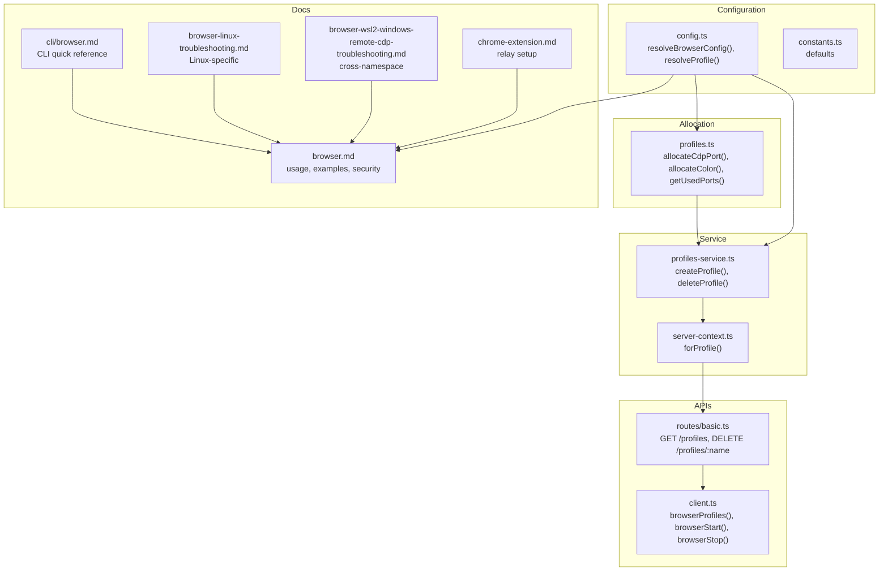
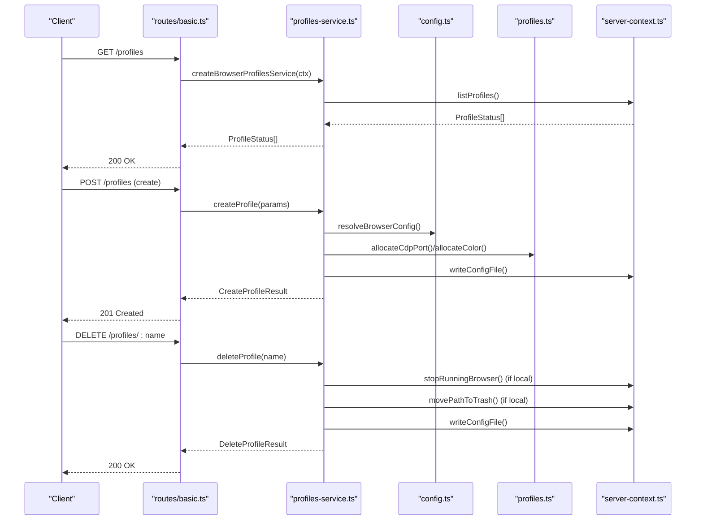
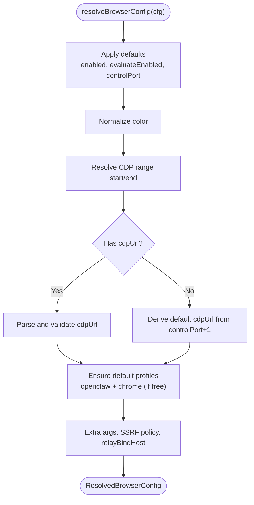
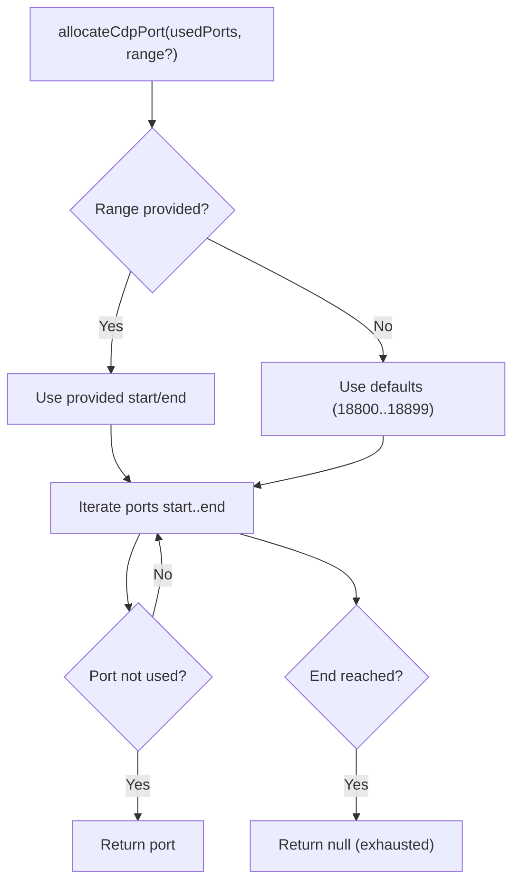
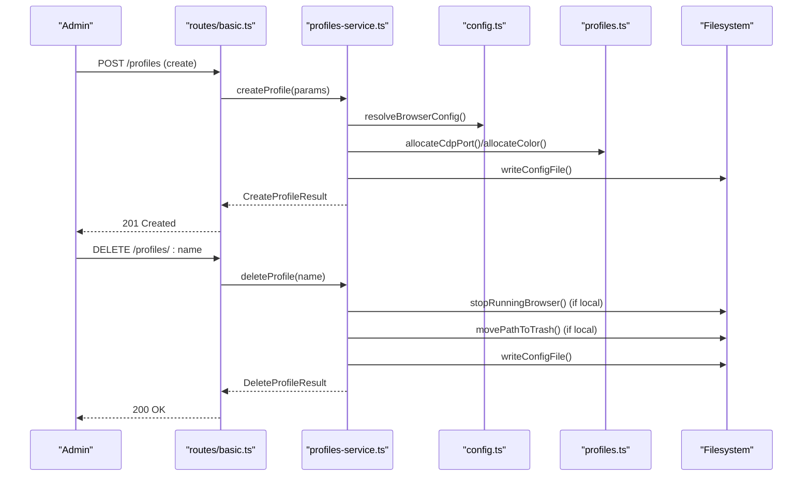
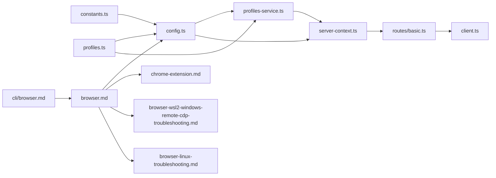

# Browser Profiles

<cite>
**Referenced Files in This Document**
- [profiles.ts](file://src/browser/profiles.ts)
- [config.ts](file://src/browser/config.ts)
- [constants.ts](file://src/browser/constants.ts)
- [profiles-service.ts](file://src/browser/profiles-service.ts)
- [server-context.ts](file://src/browser/server-context.ts)
- [client.ts](file://src/browser/client.ts)
- [routes/basic.ts](file://src/browser/routes/basic.ts)
- [browser.md](file://docs/tools/browser.md)
- [browser-linux-troubleshooting.md](file://docs/tools/browser-linux-troubleshooting.md)
- [browser-wsl2-windows-remote-cdp-troubleshooting.md](file://docs/tools/browser-wsl2-windows-remote-cdp-troubleshooting.md)
- [chrome-extension.md](file://docs/tools/chrome-extension.md)
- [browser.md](file://docs/cli/browser.md)
</cite>

## Table of Contents
1. [Introduction](#introduction)
2. [Project Structure](#project-structure)
3. [Core Components](#core-components)
4. [Architecture Overview](#architecture-overview)
5. [Detailed Component Analysis](#detailed-component-analysis)
6. [Dependency Analysis](#dependency-analysis)
7. [Performance Considerations](#performance-considerations)
8. [Troubleshooting Guide](#troubleshooting-guide)
9. [Conclusion](#conclusion)
10. [Appendices](#appendices)

## Introduction
This document explains the OpenClaw browser profiles system. It covers the three profile types (openclaw-managed, remote CDP, and Chrome extension relay), configuration options (CDP port allocation, executable path, color customization), lifecycle management (creation, deletion, switching), multi-profile support, and practical examples. It also includes troubleshooting guidance for conflicts and port allocation issues.

## Project Structure
The browser profiles system spans configuration resolution, profile allocation, service APIs, and documentation. The key areas are:
- Configuration resolution and defaults
- Profile allocation and validation
- Profiles service for CRUD operations
- Server context and route bindings
- Client APIs and CLI integration
- Documentation for usage and troubleshooting

**Diagram sources**
- [config.ts](file://src/browser/config.ts#L212-L361)
- [profiles.ts](file://src/browser/profiles.ts#L27-L113)
- [profiles-service.ts](file://src/browser/profiles-service.ts#L79-L228)
- [server-context.ts](file://src/browser/server-context.ts#L118-L145)
- [routes/basic.ts](file://src/browser/routes/basic.ts#L173-L192)
- [client.ts](file://src/browser/client.ts#L113-L160)
- [browser.md](file://docs/tools/browser.md#L260-L343)
- [chrome-extension.md](file://docs/tools/chrome-extension.md#L1-L197)
- [browser-wsl2-windows-remote-cdp-troubleshooting.md](file://docs/tools/browser-wsl2-windows-remote-cdp-troubleshooting.md#L1-L243)
- [browser-linux-troubleshooting.md](file://docs/tools/browser-linux-troubleshooting.md#L129-L140)
- [browser.md](file://docs/cli/browser.md#L1-L108)

**Section sources**
- [config.ts](file://src/browser/config.ts#L212-L361)
- [profiles.ts](file://src/browser/profiles.ts#L1-L114)
- [profiles-service.ts](file://src/browser/profiles-service.ts#L74-L236)
- [server-context.ts](file://src/browser/server-context.ts#L118-L145)
- [routes/basic.ts](file://src/browser/routes/basic.ts#L173-L192)
- [client.ts](file://src/browser/client.ts#L113-L160)
- [browser.md](file://docs/tools/browser.md#L260-L343)
- [chrome-extension.md](file://docs/tools/chrome-extension.md#L1-L197)
- [browser-wsl2-windows-remote-cdp-troubleshooting.md](file://docs/tools/browser-wsl2-windows-remote-cdp-troubleshooting.md#L1-L243)
- [browser-linux-troubleshooting.md](file://docs/tools/browser-linux-troubleshooting.md#L129-L140)
- [browser.md](file://docs/cli/browser.md#L1-L108)

## Core Components
- Profile types
  - openclaw-managed: a dedicated Chromium-based browser instance with its own user data directory and CDP port.
  - remote: an explicit CDP URL pointing to a Chromium-based browser running elsewhere.
  - extension relay: your existing Chrome tab(s) via the local relay + Chrome extension.
- Configuration options
  - CDP port range allocation and overrides
  - Executable path selection for local browser launch
  - Color customization for UI tinting
  - Remote CDP timeouts and SSRF policy
- Lifecycle management
  - Creation of profiles with automatic port/color allocation
  - Deletion of profiles with optional cleanup of local data
  - Switching between profiles via CLI and tool calls

**Section sources**
- [browser.md](file://docs/tools/browser.md#L260-L343)
- [config.ts](file://src/browser/config.ts#L212-L319)
- [profiles.ts](file://src/browser/profiles.ts#L1-L114)
- [profiles-service.ts](file://src/browser/profiles-service.ts#L79-L228)
- [constants.ts](file://src/browser/constants.ts#L1-L9)

## Architecture Overview
The browser profiles system resolves configuration, allocates resources, and exposes a service to manage profiles. Clients (CLI, web UI, agents) call endpoints to list, create, and delete profiles. The server context resolves the active profile and ensures availability.

**Diagram sources**
- [routes/basic.ts](file://src/browser/routes/basic.ts#L173-L192)
- [profiles-service.ts](file://src/browser/profiles-service.ts#L79-L228)
- [config.ts](file://src/browser/config.ts#L212-L319)
- [profiles.ts](file://src/browser/profiles.ts#L27-L113)
- [server-context.ts](file://src/browser/server-context.ts#L118-L145)

## Detailed Component Analysis

### Profile Types and Defaults
- openclaw-managed
  - A dedicated browser instance with its own user data directory and CDP port.
  - Automatically created if missing.
- remote
  - Explicit CDP URL to a Chromium-based browser running elsewhere.
  - Supports HTTP(S) and WebSocket endpoints.
- extension relay
  - Built-in profile for the Chrome extension relay (points at a loopback relay by default).
  - Requires attaching a tab via the extension toolbar button.

**Section sources**
- [browser.md](file://docs/tools/browser.md#L260-L343)
- [config.ts](file://src/browser/config.ts#L157-L211)
- [constants.ts](file://src/browser/constants.ts#L3-L5)

### Configuration Resolution and Defaults
- Default profile selection order
  - If a default is configured, use it.
  - Otherwise prefer a named default profile, then the openclaw-managed profile, else the extension relay profile.
- CDP URL derivation
  - If unset, defaults to a loopback endpoint derived from the control port.
  - If a legacy CDP URL is provided (especially WebSocket), it is preserved for reconstruction.
- Executable path
  - Optional override for local browser launch; otherwise detected automatically.
- Color normalization
  - Accepts hex colors with or without leading hash; invalid values fall back to default.
- Remote CDP timeouts
  - Separate HTTP and WebSocket handshake timeouts configurable.

**Diagram sources**
- [config.ts](file://src/browser/config.ts#L212-L319)

**Section sources**
- [config.ts](file://src/browser/config.ts#L212-L319)
- [browser.md](file://docs/tools/browser.md#L54-L103)

### Port Allocation and Validation
- Default range
  - Ports 18800–18899 are reserved for local profiles.
- Allocation algorithm
  - Allocates the first available port within the configured range.
  - Ignores out-of-range ports when computing used ports.
- Validation
  - Rejects invalid ranges or start values outside 1..65535.
  - Throws when the range window exceeds port limits.

**Diagram sources**
- [profiles.ts](file://src/browser/profiles.ts#L27-L45)

**Section sources**
- [profiles.ts](file://src/browser/profiles.ts#L1-L114)
- [config.ts](file://src/browser/config.ts#L70-L89)

### Color Allocation and Validation
- Palette
  - Predefined set of brand-safe colors.
- Allocation
  - Picks the first unused color from the palette; cycles if all are used.
- Validation
  - Accepts hex colors with or without leading hash; invalid inputs fall back to default.

**Section sources**
- [profiles.ts](file://src/browser/profiles.ts#L81-L104)
- [config.ts](file://src/browser/config.ts#L53-L63)

### Profile Lifecycle Management
- Create
  - Validates name format and uniqueness.
  - Allocates a CDP port or accepts a remote CDP URL.
  - Writes configuration and updates in-memory state.
- Delete
  - Prevents deleting the default profile.
  - Stops local browser if applicable and trashes the user data directory.
  - Removes profile from configuration and state.
- Switching
  - CLI flag and tool parameter accept a profile name.
  - Server context resolves the active profile for each request.

**Diagram sources**
- [routes/basic.ts](file://src/browser/routes/basic.ts#L173-L192)
- [profiles-service.ts](file://src/browser/profiles-service.ts#L79-L228)
- [config.ts](file://src/browser/config.ts#L212-L319)
- [profiles.ts](file://src/browser/profiles.ts#L27-L113)

**Section sources**
- [profiles-service.ts](file://src/browser/profiles-service.ts#L79-L228)
- [routes/basic.ts](file://src/browser/routes/basic.ts#L173-L192)
- [server-context.ts](file://src/browser/server-context.ts#L118-L145)
- [client.ts](file://src/browser/client.ts#L113-L160)

### Multi-Profile Support and Examples
- Work and remote profiles
  - Define multiple named profiles with distinct CDP ports or remote CDP URLs.
  - Switch between profiles via CLI or tool calls.
- Example configurations
  - Managed profiles with explicit ports and colors.
  - Remote CDP profiles pointing to external endpoints.
  - Extension relay profile for controlling existing Chrome tabs.

**Section sources**
- [browser.md](file://docs/tools/browser.md#L54-L103)
- [browser.md](file://docs/tools/browser.md#L260-L343)

### Chrome Extension Relay
- Built-in profile
  - The `chrome` profile targets a loopback relay by default.
- Installation and usage
  - Install the extension, attach to a tab, and control via the normal browser tool.
- Cross-namespace setups
  - For WSL2/Windows scenarios, adjust relay binding host and ensure correct gateway token configuration.

**Section sources**
- [browser.md](file://docs/tools/browser.md#L277-L343)
- [chrome-extension.md](file://docs/tools/chrome-extension.md#L1-L197)
- [browser-wsl2-windows-remote-cdp-troubleshooting.md](file://docs/tools/browser-wsl2-windows-remote-cdp-troubleshooting.md#L148-L171)

## Dependency Analysis
The following diagram shows how core modules depend on each other in the browser profiles subsystem.

**Diagram sources**
- [constants.ts](file://src/browser/constants.ts#L1-L9)
- [config.ts](file://src/browser/config.ts#L212-L319)
- [profiles.ts](file://src/browser/profiles.ts#L1-L114)
- [profiles-service.ts](file://src/browser/profiles-service.ts#L74-L236)
- [server-context.ts](file://src/browser/server-context.ts#L118-L145)
- [routes/basic.ts](file://src/browser/routes/basic.ts#L173-L192)
- [client.ts](file://src/browser/client.ts#L113-L160)
- [browser.md](file://docs/tools/browser.md#L260-L343)
- [chrome-extension.md](file://docs/tools/chrome-extension.md#L1-L197)
- [browser-wsl2-windows-remote-cdp-troubleshooting.md](file://docs/tools/browser-wsl2-windows-remote-cdp-troubleshooting.md#L1-L243)
- [browser-linux-troubleshooting.md](file://docs/tools/browser-linux-troubleshooting.md#L129-L140)
- [browser.md](file://docs/cli/browser.md#L1-L108)

**Section sources**
- [config.ts](file://src/browser/config.ts#L212-L319)
- [profiles.ts](file://src/browser/profiles.ts#L1-L114)
- [profiles-service.ts](file://src/browser/profiles-service.ts#L74-L236)
- [server-context.ts](file://src/browser/server-context.ts#L118-L145)
- [routes/basic.ts](file://src/browser/routes/basic.ts#L173-L192)
- [client.ts](file://src/browser/client.ts#L113-L160)
- [browser.md](file://docs/tools/browser.md#L260-L343)
- [chrome-extension.md](file://docs/tools/chrome-extension.md#L1-L197)
- [browser-wsl2-windows-remote-cdp-troubleshooting.md](file://docs/tools/browser-wsl2-windows-remote-cdp-troubleshooting.md#L1-L243)
- [browser-linux-troubleshooting.md](file://docs/tools/browser-linux-troubleshooting.md#L129-L140)
- [browser.md](file://docs/cli/browser.md#L1-L108)

## Performance Considerations
- Port allocation is O(N) over the range width; with a fixed 100-port window, this is negligible.
- Color allocation is O(M) over used colors; with a small palette, this is also negligible.
- Remote CDP operations depend on network latency and remote service responsiveness; tune timeouts accordingly.

## Troubleshooting Guide
- Profile conflicts
  - Creating a profile with an existing name or invalid name format raises validation errors.
- Port allocation issues
  - If all ports in the default range are used, allocation returns null; adjust the range or reduce active profiles.
- Linux-specific issues
  - Prefer managed mode or extension relay depending on environment; see dedicated troubleshooting notes.
- WSL2/Windows remote CDP
  - Validate reachability from WSL2 to the Windows Chrome endpoint, configure the correct profile address, and ensure the Control UI origin and auth are correct.
- Extension relay connectivity
  - Ensure the Gateway is running, the extension is installed and pinned, and the relay port and gateway token are configured correctly.

**Section sources**
- [profiles-service.ts](file://src/browser/profiles-service.ts#L84-L100)
- [profiles.ts](file://src/browser/profiles.ts#L27-L45)
- [browser-linux-troubleshooting.md](file://docs/tools/browser-linux-troubleshooting.md#L129-L140)
- [browser-wsl2-windows-remote-cdp-troubleshooting.md](file://docs/tools/browser-wsl2-windows-remote-cdp-troubleshooting.md#L209-L242)
- [chrome-extension.md](file://docs/tools/chrome-extension.md#L105-L115)

## Conclusion
OpenClaw’s browser profiles system provides flexible, secure, and deterministic browser automation across local, remote, and extension-driven contexts. With robust configuration resolution, resource allocation, and lifecycle management, teams can safely operate multiple profiles for different use cases while maintaining isolation and operational simplicity.

## Appendices

### Practical Configuration Examples
- Managed profiles
  - Define multiple profiles with explicit ports and colors.
- Remote CDP profiles
  - Point to external endpoints with optional authentication.
- Extension relay
  - Use the built-in profile or create a custom one for your relay.

**Section sources**
- [browser.md](file://docs/tools/browser.md#L54-L103)
- [browser.md](file://docs/tools/browser.md#L140-L244)

### CLI and Tooling Integration
- List, create, and delete profiles via CLI and HTTP endpoints.
- Switch profiles using the CLI flag or tool parameters.

**Section sources**
- [browser.md](file://docs/cli/browser.md#L36-L54)
- [client.ts](file://src/browser/client.ts#L113-L160)
- [routes/basic.ts](file://src/browser/routes/basic.ts#L173-L192)