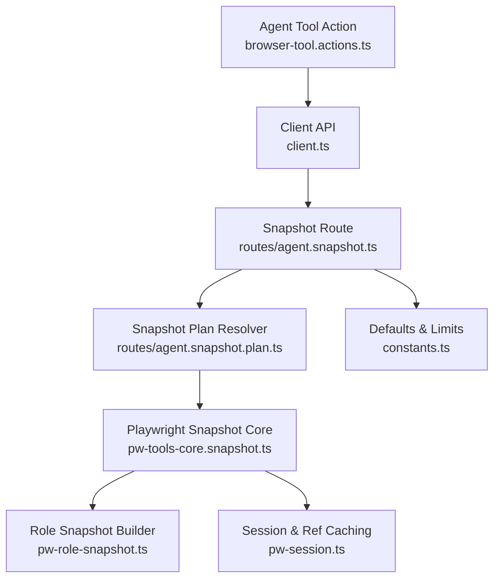
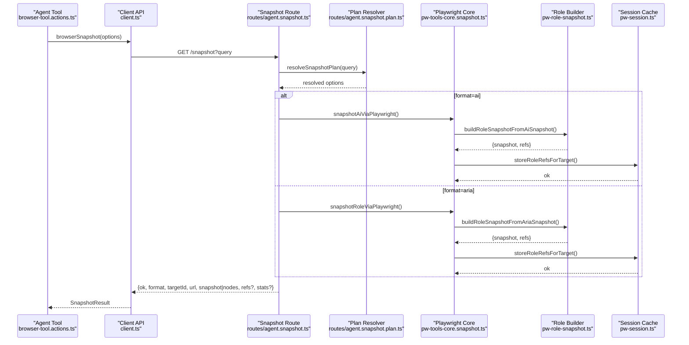
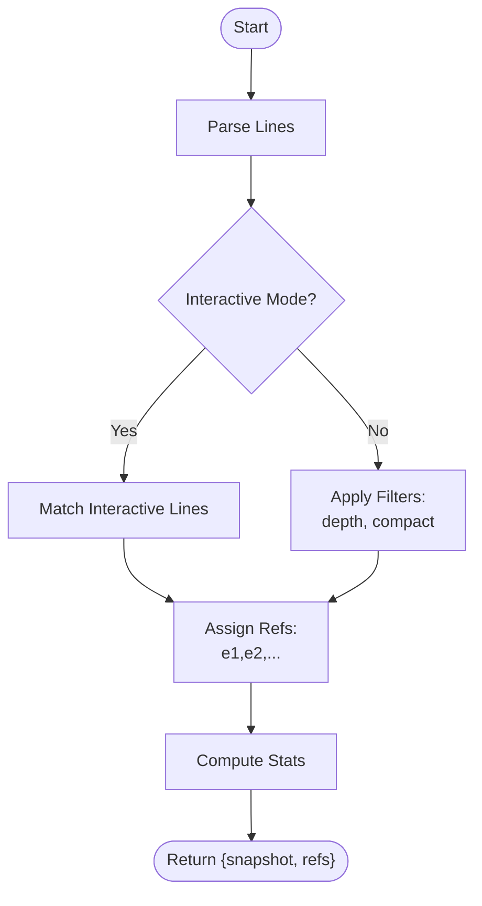
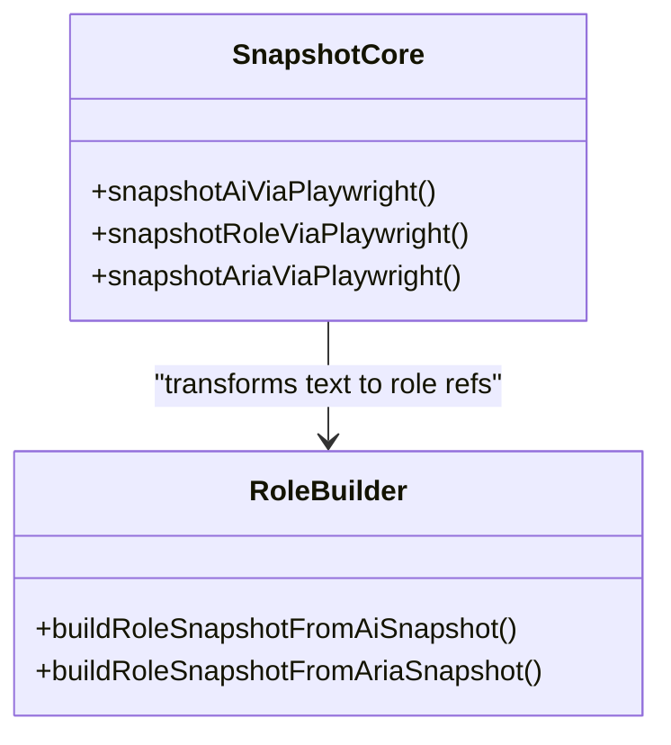
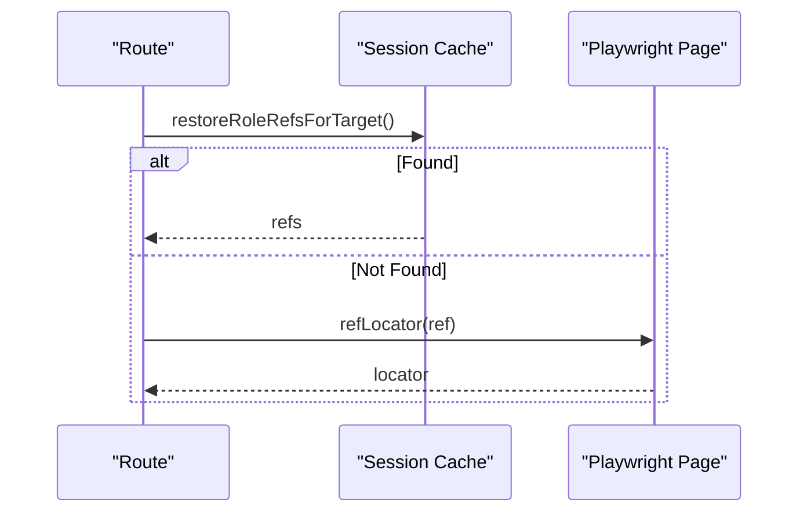
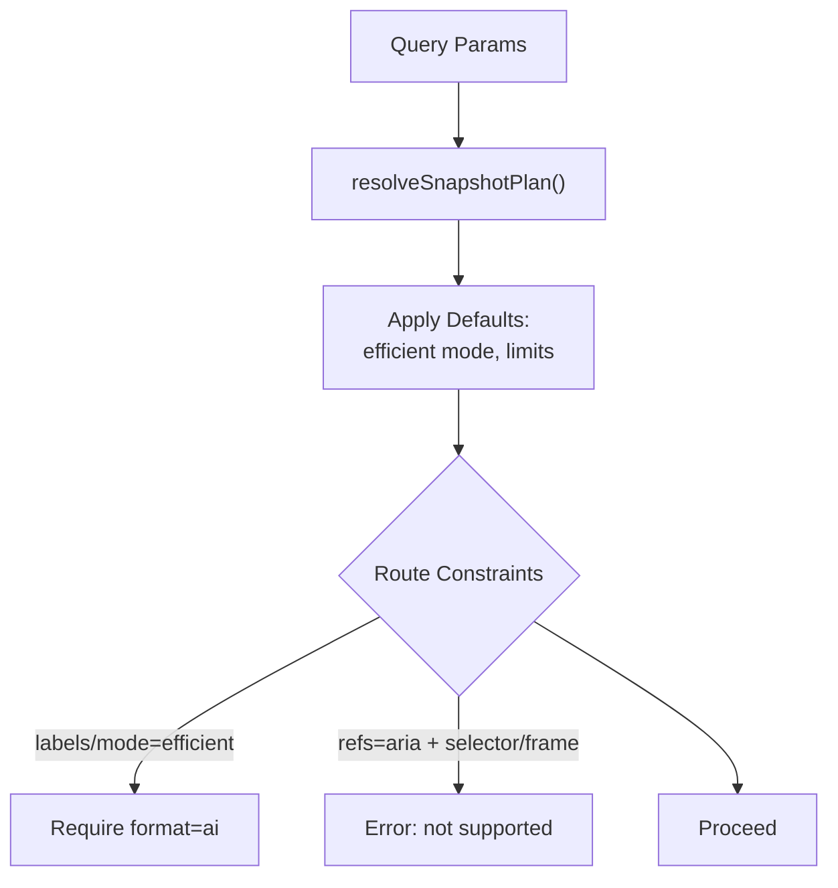
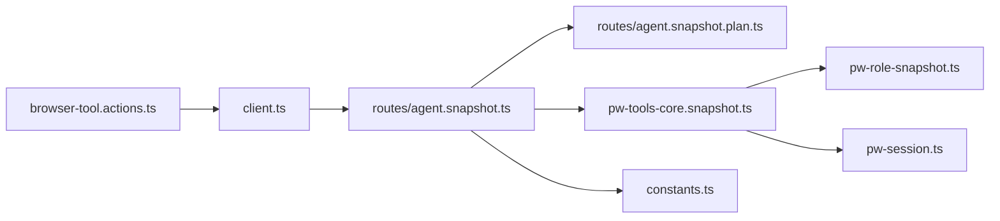

# Browser Snapshots

<cite>
**Referenced Files in This Document**
- [pw-role-snapshot.ts](file://src/browser/pw-role-snapshot.ts)
- [pw-tools-core.snapshot.ts](file://src/browser/pw-tools-core.snapshot.ts)
- [client.ts](file://src/browser/client.ts)
- [routes/agent.snapshot.ts](file://src/browser/routes/agent.snapshot.ts)
- [routes/agent.snapshot.plan.ts](file://src/browser/routes/agent.snapshot.plan.ts)
- [pw-session.ts](file://src/browser/pw-session.ts)
- [constants.ts](file://src/browser/constants.ts)
- [browser-tool.actions.ts](file://src/agents/tools/browser-tool.actions.ts)
- [browser-tool.test.ts](file://src/agents/tools/browser-tool.test.ts)
</cite>

## Table of Contents
1. [Introduction](#introduction)
2. [Project Structure](#project-structure)
3. [Core Components](#core-components)
4. [Architecture Overview](#architecture-overview)
5. [Detailed Component Analysis](#detailed-component-analysis)
6. [Dependency Analysis](#dependency-analysis)
7. [Performance Considerations](#performance-considerations)
8. [Troubleshooting Guide](#troubleshooting-guide)
9. [Conclusion](#conclusion)

## Introduction
This document explains OpenClaw’s browser snapshot functionality, focusing on how the system captures and represents page accessibility trees for UI automation and debugging. It covers:
- Two snapshot types: AI snapshots (unstructured text) and ARIA snapshots (structured AX tree).
- Two reference systems: numeric refs (e.g., e12) and role-based refs (e.g., aria-ref attributes).
- Snapshot options: interactive mode, compact mode, depth limits, and frame scoping.
- Ref resolution mechanisms across navigations and page updates.
- Stability considerations and best practices for reliable element targeting.

## Project Structure
The snapshot pipeline spans client, route, planner, and Playwright integration layers:
- Client: exposes a high-level API to request snapshots with various options.
- Route: parses query parameters, selects the appropriate snapshot strategy, and returns results.
- Planner: resolves defaults and options (including “efficient” mode).
- Core: orchestrates Playwright-based snapshots and transforms them into role-based refs.
- Session: caches and restores role refs to maintain stability across navigations.

**Diagram sources**
- [client.ts](file://src/browser/client.ts#L278-L341)
- [routes/agent.snapshot.ts](file://src/browser/routes/agent.snapshot.ts#L212-L341)
- [routes/agent.snapshot.plan.ts](file://src/browser/routes/agent.snapshot.plan.ts#L29-L95)
- [pw-tools-core.snapshot.ts](file://src/browser/pw-tools-core.snapshot.ts#L25-L167)
- [pw-role-snapshot.ts](file://src/browser/pw-role-snapshot.ts#L17-L25)
- [pw-session.ts](file://src/browser/pw-session.ts#L140-L210)
- [constants.ts](file://src/browser/constants.ts#L6-L9)
- [browser-tool.actions.ts](file://src/agents/tools/browser-tool.actions.ts#L107-L136)

**Section sources**
- [client.ts](file://src/browser/client.ts#L278-L341)
- [routes/agent.snapshot.ts](file://src/browser/routes/agent.snapshot.ts#L212-L341)
- [routes/agent.snapshot.plan.ts](file://src/browser/routes/agent.snapshot.plan.ts#L29-L95)
- [pw-tools-core.snapshot.ts](file://src/browser/pw-tools-core.snapshot.ts#L25-L167)
- [pw-role-snapshot.ts](file://src/browser/pw-role-snapshot.ts#L17-L25)
- [pw-session.ts](file://src/browser/pw-session.ts#L140-L210)
- [constants.ts](file://src/browser/constants.ts#L6-L9)
- [browser-tool.actions.ts](file://src/agents/tools/browser-tool.actions.ts#L107-L136)

## Core Components
- Snapshot formats:
  - AI snapshot: unstructured text representation produced by Playwright’s internal AI snapshot engine.
  - ARIA snapshot: structured Accessibility Inspector-style tree with roles and names.
- Reference systems:
  - Numeric refs: e1, e2, … generated from ARIA snapshots; stable within a single snapshot lifecycle.
  - Role-based refs: aria-ref attributes; can be resolved directly by the browser.
- Options:
  - interactive: include only interactive elements (buttons, links, inputs).
  - compact: prune unnamed structural nodes and empty branches.
  - depth: limit traversal depth.
  - selector/frame: scope snapshot to a subtree.
  - labels/mode: efficient mode and labeled screenshot generation.

**Section sources**
- [pw-role-snapshot.ts](file://src/browser/pw-role-snapshot.ts#L17-L25)
- [pw-role-snapshot.ts](file://src/browser/pw-role-snapshot.ts#L322-L379)
- [pw-role-snapshot.ts](file://src/browser/pw-role-snapshot.ts#L390-L454)
- [client.ts](file://src/browser/client.ts#L278-L341)
- [routes/agent.snapshot.plan.ts](file://src/browser/routes/agent.snapshot.plan.ts#L14-L27)

## Architecture Overview
The snapshot flow begins at the client, which forwards options to the route. The route resolves a plan and delegates to Playwright-based snapshot functions. Role refs are generated and optionally cached to improve stability across navigations.

**Diagram sources**
- [browser-tool.actions.ts](file://src/agents/tools/browser-tool.actions.ts#L107-L136)
- [client.ts](file://src/browser/client.ts#L278-L341)
- [routes/agent.snapshot.ts](file://src/browser/routes/agent.snapshot.ts#L212-L341)
- [routes/agent.snapshot.plan.ts](file://src/browser/routes/agent.snapshot.plan.ts#L29-L95)
- [pw-tools-core.snapshot.ts](file://src/browser/pw-tools-core.snapshot.ts#L53-L167)
- [pw-role-snapshot.ts](file://src/browser/pw-role-snapshot.ts#L322-L454)
- [pw-session.ts](file://src/browser/pw-session.ts#L165-L187)

## Detailed Component Analysis

### Role Snapshot Builder
The builder transforms raw snapshot text into a role-based representation with refs. It supports:
- Interactive mode: only interactive roles receive refs.
- Compact mode: unnamed structural roles are pruned.
- Depth limiting: traversal stops beyond a given level.
- Ref generation: assigns e1, e2, … to interactive and named content roles.
- Duplicate handling: tracks role+name pairs and adds nth indices when needed.

**Diagram sources**
- [pw-role-snapshot.ts](file://src/browser/pw-role-snapshot.ts#L207-L267)
- [pw-role-snapshot.ts](file://src/browser/pw-role-snapshot.ts#L322-L379)
- [pw-role-snapshot.ts](file://src/browser/pw-role-snapshot.ts#L390-L454)

**Section sources**
- [pw-role-snapshot.ts](file://src/browser/pw-role-snapshot.ts#L17-L25)
- [pw-role-snapshot.ts](file://src/browser/pw-role-snapshot.ts#L80-L88)
- [pw-role-snapshot.ts](file://src/browser/pw-role-snapshot.ts#L207-L267)
- [pw-role-snapshot.ts](file://src/browser/pw-role-snapshot.ts#L322-L379)
- [pw-role-snapshot.ts](file://src/browser/pw-role-snapshot.ts#L390-L454)

### AI vs ARIA Snapshots
- AI snapshot:
  - Uses Playwright’s internal AI snapshot engine.
  - Optionally truncated to a configurable character limit.
  - Can preserve aria-ref ids from the original snapshot for self-resolving refs.
- ARIA snapshot:
  - Generated via Playwright’s ariaSnapshot on a scoped locator.
  - Numeric refs are assigned sequentially.

**Diagram sources**
- [pw-tools-core.snapshot.ts](file://src/browser/pw-tools-core.snapshot.ts#L53-L167)
- [pw-role-snapshot.ts](file://src/browser/pw-role-snapshot.ts#L322-L454)

**Section sources**
- [pw-tools-core.snapshot.ts](file://src/browser/pw-tools-core.snapshot.ts#L53-L95)
- [pw-tools-core.snapshot.ts](file://src/browser/pw-tools-core.snapshot.ts#L97-L167)
- [pw-role-snapshot.ts](file://src/browser/pw-role-snapshot.ts#L322-L379)
- [pw-role-snapshot.ts](file://src/browser/pw-role-snapshot.ts#L390-L454)

### Ref Resolution and Stability
- Numeric refs (e.g., e12):
  - Stored in page state and optionally cached by targetId.
  - Can be resolved via getByRole(name/exact) or aria-ref selectors depending on mode.
- Role-based refs (aria-ref):
  - Resolved directly via aria-ref selectors.
- Stability across navigations:
  - Role refs are cached keyed by cdpUrl + targetId.
  - On navigation, targetId may change; the route attempts to resolve a replacement.

**Diagram sources**
- [pw-session.ts](file://src/browser/pw-session.ts#L189-L210)
- [pw-session.ts](file://src/browser/pw-session.ts#L531-L568)
- [routes/agent.snapshot.ts](file://src/browser/routes/agent.snapshot.ts#L52-L86)

**Section sources**
- [pw-session.ts](file://src/browser/pw-session.ts#L85-L92)
- [pw-session.ts](file://src/browser/pw-session.ts#L140-L187)
- [pw-session.ts](file://src/browser/pw-session.ts#L189-L210)
- [pw-session.ts](file://src/browser/pw-session.ts#L531-L568)
- [routes/agent.snapshot.ts](file://src/browser/routes/agent.snapshot.ts#L52-L86)

### Snapshot Options and Defaults
- Client options:
  - format: ai or aria.
  - refs: role or aria.
  - interactive, compact, depth, selector, frame, labels, mode, maxChars, limit, profile.
- Planner defaults:
  - Efficient mode sets interactive=true, compact=true, depth=DEFAULT_AI_SNAPSHOT_EFFICIENT_DEPTH.
  - AI snapshot default maxChars depends on mode.
- Route enforcement:
  - labels and mode=efficient require format=ai.
  - refs=aria does not support selector/frame snapshots.

**Diagram sources**
- [routes/agent.snapshot.plan.ts](file://src/browser/routes/agent.snapshot.plan.ts#L29-L95)
- [constants.ts](file://src/browser/constants.ts#L6-L9)
- [routes/agent.snapshot.ts](file://src/browser/routes/agent.snapshot.ts#L227-L229)
- [routes/agent.snapshot.ts](file://src/browser/routes/agent.snapshot.ts#L115-L140)

**Section sources**
- [client.ts](file://src/browser/client.ts#L278-L341)
- [routes/agent.snapshot.plan.ts](file://src/browser/routes/agent.snapshot.plan.ts#L29-L95)
- [constants.ts](file://src/browser/constants.ts#L6-L9)
- [routes/agent.snapshot.ts](file://src/browser/routes/agent.snapshot.ts#L227-L229)
- [routes/agent.snapshot.ts](file://src/browser/routes/agent.snapshot.ts#L115-L140)

### Using Snapshots for Automation and Debugging
- UI automation:
  - Use refs to target elements reliably. Numeric refs are ideal for programmatic targeting; aria-ref is useful when working with native attributes.
  - Scope snapshots to frames or subtrees using selector and frame options.
- Debugging:
  - Enable labels to overlay refs on a screenshot for visual inspection.
  - Use interactive mode to focus on actionable elements.
  - Apply compact mode to reduce noise and improve readability.

Examples (conceptual):
- Snapshot with interactive mode and compact mode to highlight clickable elements.
- Snapshot with labels to produce a labeled PNG for visual debugging.
- Snapshot scoped to a frame and selector to isolate a widget subtree.

**Section sources**
- [pw-role-snapshot.ts](file://src/browser/pw-role-snapshot.ts#L17-L25)
- [routes/agent.snapshot.ts](file://src/browser/routes/agent.snapshot.ts#L265-L296)
- [browser-tool.actions.ts](file://src/agents/tools/browser-tool.actions.ts#L107-L136)

## Dependency Analysis
- Client depends on route handlers and constants for defaults.
- Route depends on planner and core snapshot functions.
- Core depends on role snapshot builder and session caching.
- Agent tool integrates client calls and passes defaults.

**Diagram sources**
- [browser-tool.actions.ts](file://src/agents/tools/browser-tool.actions.ts#L107-L136)
- [client.ts](file://src/browser/client.ts#L278-L341)
- [routes/agent.snapshot.ts](file://src/browser/routes/agent.snapshot.ts#L212-L341)
- [routes/agent.snapshot.plan.ts](file://src/browser/routes/agent.snapshot.plan.ts#L29-L95)
- [pw-tools-core.snapshot.ts](file://src/browser/pw-tools-core.snapshot.ts#L25-L167)
- [pw-role-snapshot.ts](file://src/browser/pw-role-snapshot.ts#L17-L25)
- [pw-session.ts](file://src/browser/pw-session.ts#L140-L187)
- [constants.ts](file://src/browser/constants.ts#L6-L9)

**Section sources**
- [browser-tool.actions.ts](file://src/agents/tools/browser-tool.actions.ts#L107-L136)
- [client.ts](file://src/browser/client.ts#L278-L341)
- [routes/agent.snapshot.ts](file://src/browser/routes/agent.snapshot.ts#L212-L341)
- [routes/agent.snapshot.plan.ts](file://src/browser/routes/agent.snapshot.plan.ts#L29-L95)
- [pw-tools-core.snapshot.ts](file://src/browser/pw-tools-core.snapshot.ts#L25-L167)
- [pw-role-snapshot.ts](file://src/browser/pw-role-snapshot.ts#L17-L25)
- [pw-session.ts](file://src/browser/pw-session.ts#L140-L187)
- [constants.ts](file://src/browser/constants.ts#L6-L9)

## Performance Considerations
- Efficient mode:
  - Reduces snapshot size by limiting depth and enabling compact mode.
  - Uses smaller maxChars for AI snapshots to minimize payload.
- Truncation:
  - AI snapshots can be truncated to a configured limit to avoid oversized responses.
- Scoped snapshots:
  - Using selector and frame reduces work and improves responsiveness.
- Caching:
  - Role refs are cached per target to avoid recomputation across requests.

**Section sources**
- [routes/agent.snapshot.plan.ts](file://src/browser/routes/agent.snapshot.plan.ts#L53-L60)
- [constants.ts](file://src/browser/constants.ts#L6-L9)
- [pw-tools-core.snapshot.ts](file://src/browser/pw-tools-core.snapshot.ts#L76-L84)
- [pw-session.ts](file://src/browser/pw-session.ts#L140-L187)

## Troubleshooting Guide
- Unknown ref error:
  - Occurs when a numeric ref is not present in the current page state. Recreate the snapshot to refresh refs.
- refs=aria with selector/frame:
  - Not supported; switch to refs=role or remove selector/frame.
- Missing Playwright _snapshotForAI:
  - Upgrade Playwright to a version exposing the internal AI snapshot API.
- Navigation issues:
  - The route attempts to resolve a new targetId after navigation; if ambiguous, it falls back to the previous targetId.

**Section sources**
- [pw-session.ts](file://src/browser/pw-session.ts#L546-L551)
- [routes/agent.snapshot.ts](file://src/browser/routes/agent.snapshot.ts#L115-L140)
- [pw-tools-core.snapshot.ts](file://src/browser/pw-tools-core.snapshot.ts#L65-L68)
- [routes/agent.snapshot.ts](file://src/browser/routes/agent.snapshot.ts#L52-L86)

## Conclusion
OpenClaw’s browser snapshot system provides robust, flexible ways to capture and reason about page content. By combining AI and ARIA snapshots with role-based and numeric refs, it enables both human-readable debugging and precise automation. Use efficient mode, truncation, and scoping to optimize performance, and rely on ref caching for stability across navigations.