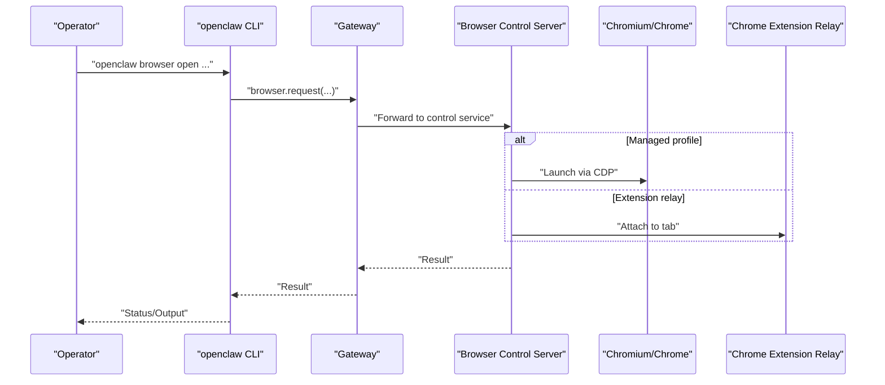
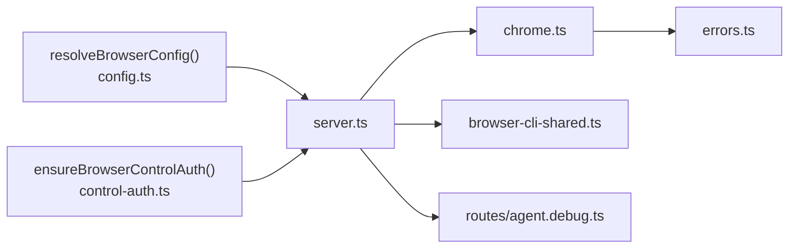

# Browser Troubleshooting

<cite>
**Referenced Files in This Document**
- [browser-linux-troubleshooting.md](file://docs/tools/browser-linux-troubleshooting.md)
- [browser-wsl2-windows-remote-cdp-troubleshooting.md](file://docs/tools/browser-wsl2-windows-remote-cdp-troubleshooting.md)
- [browser.md](file://docs/tools/browser.md)
- [gateway/troubleshooting.md](file://docs/gateway/troubleshooting.md)
- [chrome.ts](file://src/browser/chrome.ts)
- [config.ts](file://src/browser/config.ts)
- [client-fetch.ts](file://src/browser/client-fetch.ts)
- [errors.ts](file://src/browser/errors.ts)
- [pw-session.ts](file://src/browser/pw-session.ts)
- [routes/agent.debug.ts](file://src/browser/routes/agent.debug.ts)
- [proxy-env.ts](file://src/infra/net/proxy-env.ts)
- [cdp-proxy-bypass.ts](file://src/browser/cdp-proxy-bypass.ts)
- [browser-cli-shared.ts](file://src/cli/browser-cli-shared.ts)
- [client-actions-observe.ts](file://src/browser/client-actions-observe.ts)
- [client-actions-core.ts](file://src/browser/client-actions-core.ts)
- [control-auth.ts](file://src/browser/control-auth.ts)
- [server.ts](file://src/browser/server.ts)
</cite>

## Table of Contents
1. [Introduction](#introduction)
2. [Project Structure](#project-structure)
3. [Core Components](#core-components)
4. [Architecture Overview](#architecture-overview)
5. [Detailed Component Analysis](#detailed-component-analysis)
6. [Dependency Analysis](#dependency-analysis)
7. [Performance Considerations](#performance-considerations)
8. [Troubleshooting Guide](#troubleshooting-guide)
9. [Conclusion](#conclusion)
10. [Appendices](#appendices)

## Introduction
This document provides comprehensive troubleshooting guidance for OpenClaw browser automation issues across Linux, WSL2/Windows remote Chrome CDP, and browser permission scenarios. It consolidates diagnostic techniques using browser console, error logs, request tracing, and CLI workflows, and offers step-by-step resolutions for common failures. It also covers network connectivity, proxy configuration pitfalls, and browser compatibility concerns, with debugging workflows to identify and resolve automation bottlenecks.

## Project Structure
OpenClaw’s browser subsystem consists of:
- A managed browser control service (loopback-only) that launches and manages a dedicated Chromium-based profile
- An extension relay to attach to an existing system Chrome tab
- Remote CDP profiles to connect to external browsers (including WSL2/Windows setups)
- CLI and HTTP APIs for automation, inspection, and debugging
- Built-in SSRF protections and proxy-awareness for safe navigation and network access

```mermaid
graph TB
subgraph "Gateway"
GW_CFG["Browser config<br/>resolveBrowserConfig()"]
GW_SRV["Browser control server<br/>server.ts"]
GW_AUTH["Browser control auth<br/>control-auth.ts"]
end
subgraph "Local/Managed"
MC["Managed Chrome launcher<br/>chrome.ts"]
MP["Profiles resolver<br/>config.ts"]
end
subgraph "Remote/WSL2"
RC["Remote CDP endpoint<br/>Windows Chrome 9222"]
WSL["WSL2 Gateway<br/>127.0.0.1:18789"]
end
subgraph "CLI"
CLI["Browser CLI<br/>browser-cli-shared.ts"]
end
CLI --> GW_SRV
GW_CFG --> GW_SRV
GW_AUTH --> GW_SRV
GW_SRV --> MC
GW_SRV --> MP
GW_SRV --> RC
WSL --> RC
```

**Diagram sources**
- [server.ts](file://src/browser/server.ts#L25-L61)
- [config.ts](file://src/browser/config.ts#L212-L319)
- [chrome.ts](file://src/browser/chrome.ts#L69-L71)
- [browser-cli-shared.ts](file://src/cli/browser-cli-shared.ts#L30-L62)

**Section sources**
- [browser.md](file://docs/tools/browser.md#L10-L44)
- [browser.md](file://docs/tools/browser.md#L46-L103)

## Core Components
- Managed browser control service
  - Launches a dedicated Chromium-based profile and exposes a loopback HTTP API
  - Uses CDP for tab control and Playwright for advanced actions
- Extension relay
  - Attaches to an existing Chrome tab via a local relay and Chrome extension
- Remote CDP profiles
  - Connect to external browsers (e.g., Windows Chrome from WSL2) using HTTP or WebSocket endpoints
- CLI and HTTP debugging endpoints
  - Inspect console, errors, network requests, and record traces
- SSRF and proxy safeguards
  - Enforce safe navigation and respect proxy environments

**Section sources**
- [browser.md](file://docs/tools/browser.md#L10-L44)
- [browser.md](file://docs/tools/browser.md#L246-L260)
- [browser.md](file://docs/tools/browser.md#L369-L403)

## Architecture Overview
The browser subsystem integrates with the Gateway to provide deterministic, agent-friendly automation. It supports:
- Local managed mode (default)
- Extension relay to system Chrome
- Remote CDP connections (including cross-namespace setups)



**Diagram sources**
- [browser.md](file://docs/tools/browser.md#L418-L430)
- [server.ts](file://src/browser/server.ts#L25-L61)
- [chrome.ts](file://src/browser/chrome.ts#L353-L415)

## Detailed Component Analysis

### Linux Startup Issues with snap Chromium
Symptoms:
- Failure to start managed browser with CDP on the default port
- AppArmor confinement interfering with process spawning/monitoring

Root causes:
- Default Chromium on many Linux distros is a snap package that redirects to a stub
- Snap confinement prevents OpenClaw from launching/monitoring the browser reliably

Resolutions:
- Install a non-snap Chromium variant (e.g., Google Chrome)
- Configure OpenClaw to use a non-snap executable path and enable no-sandbox mode
- Alternatively, use attach-only mode to manually start Chromium with remote debugging enabled

Verification steps:
- Confirm the control service responds and lists tabs
- Validate CDP reachability via loopback curl commands

**Section sources**
- [browser-linux-troubleshooting.md](file://docs/tools/browser-linux-troubleshooting.md#L9-L28)
- [browser-linux-troubleshooting.md](file://docs/tools/browser-linux-troubleshooting.md#L30-L51)
- [browser-linux-troubleshooting.md](file://docs/tools/browser-linux-troubleshooting.md#L53-L97)
- [browser-linux-troubleshooting.md](file://docs/tools/browser-linux-troubleshooting.md#L98-L140)

### WSL2 Remote Chrome CDP Connectivity
Symptoms:
- Remote CDP unreachable from WSL2
- Confusion between UI origin security, token/pairing, and CDP reachability

Root causes:
- Port exposure/firewall rules not allowing WSL2 to reach Windows Chrome
- Misconfigured cdpUrl or relayBindHost for cross-namespace extension relay
- Control UI opened from a non-secure origin causing auth/UI errors

Resolution workflow:
- Validate Windows Chrome CDP endpoint locally
- Verify WSL2 can reach the same endpoint
- Configure the correct browser profile with attachOnly and the WSL2-reachable address
- If using extension relay across namespaces, set relayBindHost appropriately
- Confirm Control UI origin and allowed origins

**Section sources**
- [browser-wsl2-windows-remote-cdp-troubleshooting.md](file://docs/tools/browser-wsl2-windows-remote-cdp-troubleshooting.md#L12-L67)
- [browser-wsl2-windows-remote-cdp-troubleshooting.md](file://docs/tools/browser-wsl2-windows-remote-cdp-troubleshooting.md#L83-L121)
- [browser-wsl2-windows-remote-cdp-troubleshooting.md](file://docs/tools/browser-wsl2-windows-remote-cdp-troubleshooting.md#L122-L171)
- [browser-wsl2-windows-remote-cdp-troubleshooting.md](file://docs/tools/browser-wsl2-windows-remote-cdp-troubleshooting.md#L172-L208)
- [browser-wsl2-windows-remote-cdp-troubleshooting.md](file://docs/tools/browser-wsl2-windows-remote-cdp-troubleshooting.md#L209-L243)

### Browser Permission Errors and Authentication
Symptoms:
- “Chrome extension relay is running, but no tab is connected”
- “Browser attachOnly is enabled … not reachable”
- “browser.executablePath not found”

Root causes:
- Extension relay profile selected but no tab is attached
- Attach-only profile configured without a reachable target
- Invalid executable path configured

Resolutions:
- For extension relay: install the extension, open a tab, and click the extension icon to attach
- For attach-only: ensure the external browser is launched with the correct remote debugging port and user data directory
- For executable path: verify the configured path exists and is executable

**Section sources**
- [browser-linux-troubleshooting.md](file://docs/tools/browser-linux-troubleshooting.md#L124-L140)
- [gateway/troubleshooting.md](file://docs/gateway/troubleshooting.md#L263-L293)

### Network Connectivity and Proxy Configuration
Symptoms:
- Navigation failures behind corporate proxies
- Unexpected SSRF or private network access denials

Root causes:
- Proxy environment variables present but misconfigured
- Strict SSRF policy blocking internal/private destinations
- NO_PROXY not scoped to loopback CDP URLs

Resolutions:
- Review proxy environment variables and adjust NO_PROXY for loopback targets
- Configure browser SSRF policy to allow private networks or set an allowlist
- Use scoped NO_PROXY bypass around CDP calls

**Section sources**
- [proxy-env.ts](file://src/infra/net/proxy-env.ts#L1-L18)
- [cdp-proxy-bypass.ts](file://src/browser/cdp-proxy-bypass.ts#L144-L151)
- [config.ts](file://src/browser/config.ts#L101-L128)
- [browser.md](file://docs/tools/browser.md#L633-L645)

### Browser Compatibility and Execution
Symptoms:
- Launch failures on specific platforms or configurations
- Timeout during CDP handshake or WebSocket connection

Root causes:
- Platform-specific executable detection issues
- Insufficient sandbox/no-sandbox flags
- Slow/unreliable remote endpoints

Resolutions:
- Override executable path explicitly
- Adjust no-sandbox and headless flags
- Increase remote CDP timeouts for slow endpoints

**Section sources**
- [chrome.ts](file://src/browser/chrome.ts#L69-L71)
- [chrome.ts](file://src/browser/chrome.ts#L353-L415)
- [config.ts](file://src/browser/config.ts#L221-L225)
- [browser.md](file://docs/tools/browser.md#L94-L98)

### Diagnostics Using Browser Console, Logs, and Request Tracing
Diagnostic endpoints:
- Console and page errors collection
- Network request inspection and filtering
- Trace recording for reproduction and analysis

Typical workflow:
- Snapshot and highlight suspected elements
- Inspect console and page errors
- Filter and review network requests
- Record a trace to capture timing and state leading up to failure

**Section sources**
- [pw-session.ts](file://src/browser/pw-session.ts#L229-L270)
- [routes/agent.debug.ts](file://src/browser/routes/agent.debug.ts#L44-L89)
- [client-actions-observe.ts](file://src/browser/client-actions-observe.ts#L70-L140)
- [browser.md](file://docs/tools/browser.md#L577-L591)

### Error Handling and Classification
OpenClaw defines typed browser errors and converts them to HTTP responses. Common categories:
- Validation and configuration errors
- Target not found or ambiguous
- Profile unavailable or reset unsupported
- Resource exhaustion

**Section sources**
- [errors.ts](file://src/browser/errors.ts#L1-L82)

## Dependency Analysis
The browser subsystem depends on:
- Gateway configuration and authentication for control service startup
- Platform-specific executable resolution
- CDP reachability and WebSocket handshakes
- CLI and HTTP clients for automation and debugging



**Diagram sources**
- [config.ts](file://src/browser/config.ts#L212-L319)
- [server.ts](file://src/browser/server.ts#L25-L61)
- [control-auth.ts](file://src/browser/control-auth.ts#L40-L98)
- [chrome.ts](file://src/browser/chrome.ts#L353-L415)
- [errors.ts](file://src/browser/errors.ts#L68-L82)

**Section sources**
- [server.ts](file://src/browser/server.ts#L25-L61)
- [control-auth.ts](file://src/browser/control-auth.ts#L40-L98)
- [chrome.ts](file://src/browser/chrome.ts#L353-L415)

## Performance Considerations
- Prefer managed profiles for deterministic performance isolation
- Use efficient snapshot modes for heavy UIs
- Limit trace and download sizes to reduce I/O overhead
- Tune remote CDP timeouts for unreliable networks

[No sources needed since this section provides general guidance]

## Troubleshooting Guide

### Step-by-Step Resolution for Linux Startup Issues
1. Confirm snap Chromium interference
   - Check if the installed Chromium is a stub redirecting to snap
2. Install a non-snap Chromium variant
   - Configure executable path and enable no-sandbox
3. Verify managed browser control service
   - Check status and list tabs via loopback endpoints
4. If snap is unavoidable, use attach-only mode
   - Manually start Chromium with remote debugging and user data directory
   - Optionally create a systemd user service to auto-start

**Section sources**
- [browser-linux-troubleshooting.md](file://docs/tools/browser-linux-troubleshooting.md#L9-L28)
- [browser-linux-troubleshooting.md](file://docs/tools/browser-linux-troubleshooting.md#L30-L51)
- [browser-linux-troubleshooting.md](file://docs/tools/browser-linux-troubleshooting.md#L53-L97)
- [browser-linux-troubleshooting.md](file://docs/tools/browser-linux-troubleshooting.md#L98-L140)

### Step-by-Step Resolution for WSL2 Remote Chrome CDP
1. Validate Windows Chrome CDP locally
   - Confirm /json/version and /json/list endpoints
2. Verify WSL2 reachability
   - Use curl from WSL2 to the Windows endpoint
3. Configure the correct browser profile
   - Point to the WSL2-reachable address with attachOnly
4. If using extension relay across namespaces
   - Set relayBindHost to an explicit bind address
5. Validate Control UI origin and allowed origins
   - Open UI from Windows localhost and confirm auth/pairing

**Section sources**
- [browser-wsl2-windows-remote-cdp-troubleshooting.md](file://docs/tools/browser-wsl2-windows-remote-cdp-troubleshooting.md#L83-L121)
- [browser-wsl2-windows-remote-cdp-troubleshooting.md](file://docs/tools/browser-wsl2-windows-remote-cdp-troubleshooting.md#L122-L171)
- [browser-wsl2-windows-remote-cdp-troubleshooting.md](file://docs/tools/browser-wsl2-windows-remote-cdp-troubleshooting.md#L172-L208)
- [browser-wsl2-windows-remote-cdp-troubleshooting.md](file://docs/tools/browser-wsl2-windows-remote-cdp-troubleshooting.md#L209-L243)

### Step-by-Step Resolution for Browser Permission Errors
1. For extension relay profile
   - Install extension, open a tab, and attach via the extension icon
2. For attach-only profile
   - Ensure external browser is launched with remote debugging enabled and reachable
3. For executable path errors
   - Verify the configured path exists and is executable

**Section sources**
- [browser-linux-troubleshooting.md](file://docs/tools/browser-linux-troubleshooting.md#L124-L140)
- [gateway/troubleshooting.md](file://docs/gateway/troubleshooting.md#L263-L293)

### Step-by-Step Resolution for Network and Proxy Issues
1. Detect proxy environment
   - Check HTTP(S)_PROXY/all_proxy variables
2. Scope NO_PROXY for loopback CDP
   - Use scoped bypass around CDP calls
3. Configure SSRF policy
   - Allow private networks or set an allowlist as needed

**Section sources**
- [proxy-env.ts](file://src/infra/net/proxy-env.ts#L1-L18)
- [cdp-proxy-bypass.ts](file://src/browser/cdp-proxy-bypass.ts#L144-L151)
- [config.ts](file://src/browser/config.ts#L101-L128)
- [browser.md](file://docs/tools/browser.md#L633-L645)

### Step-by-Step Resolution for Browser Compatibility
1. Override executable path if auto-detection fails
2. Adjust no-sandbox and headless flags for platform constraints
3. Increase remote CDP timeouts for slow/unreliable endpoints

**Section sources**
- [chrome.ts](file://src/browser/chrome.ts#L69-L71)
- [chrome.ts](file://src/browser/chrome.ts#L353-L415)
- [config.ts](file://src/browser/config.ts#L221-L225)
- [browser.md](file://docs/tools/browser.md#L94-L98)

### Debugging Workflows for Automation Bottlenecks
1. Snapshot and highlight suspected elements
2. Inspect console and page errors
3. Filter and review network requests
4. Record a trace to reproduce and analyze timing/state
5. Use CLI commands to verify tab control and lifecycle

**Section sources**
- [pw-session.ts](file://src/browser/pw-session.ts#L229-L270)
- [routes/agent.debug.ts](file://src/browser/routes/agent.debug.ts#L44-L89)
- [client-actions-observe.ts](file://src/browser/client-actions-observe.ts#L70-L140)
- [browser.md](file://docs/tools/browser.md#L577-L591)

## Conclusion
OpenClaw’s browser subsystem provides robust, deterministic automation across managed, relay, and remote CDP configurations. By following layered diagnostics—validating local CDP, remote reachability, authentication, and proxy/network settings—you can quickly isolate and resolve most automation failures. Use the built-in inspection and tracing tools to capture evidence and iterate toward a stable configuration.

[No sources needed since this section summarizes without analyzing specific files]

## Appendices

### Quick Reference: Common Messages and Remedies
- “Failed to start Chrome CDP on port …”
  - Install non-snap Chromium or use attach-only mode
- “Chrome extension relay is running, but no tab is connected”
  - Install extension, open a tab, and attach
- “browser.executablePath not found”
  - Verify configured path exists and is executable
- “Remote CDP for profile … is not reachable”
  - Confirm WSL2 can reach the configured endpoint; adjust cdpUrl
- “gateway timeout after 1500ms”
  - Likely CDP reachability or slow endpoint; increase timeouts

**Section sources**
- [gateway/troubleshooting.md](file://docs/gateway/troubleshooting.md#L263-L293)
- [browser-wsl2-windows-remote-cdp-troubleshooting.md](file://docs/tools/browser-wsl2-windows-remote-cdp-troubleshooting.md#L209-L225)