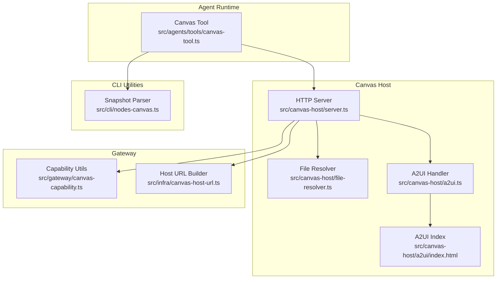
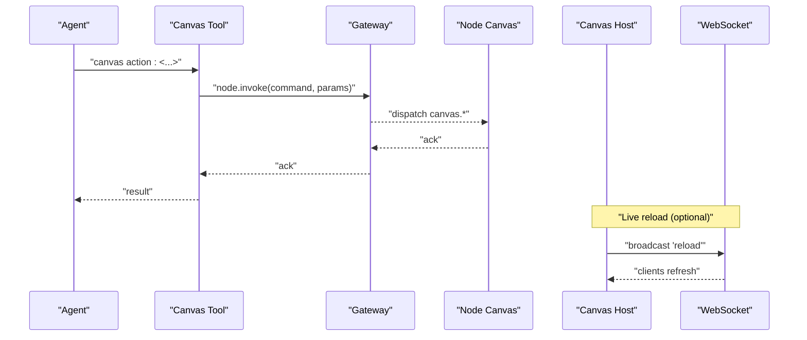
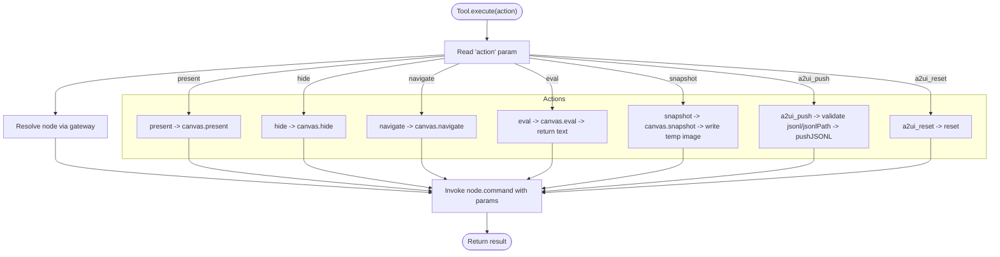
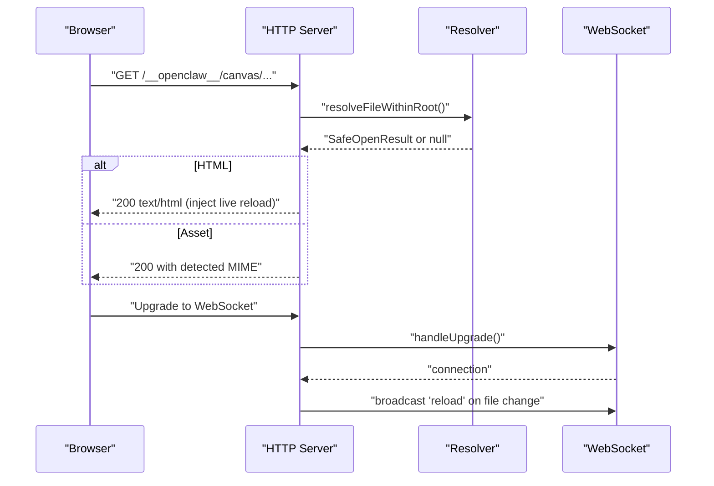
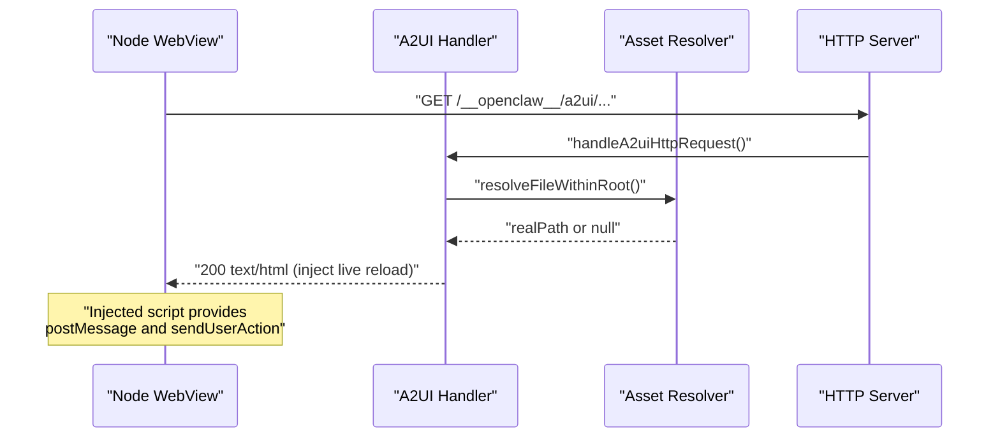
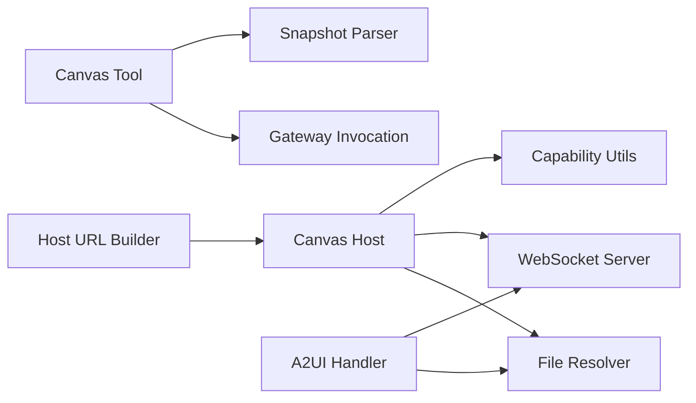

# Canvas Rendering

<cite>
**Referenced Files in This Document**
- [canvas-tool.ts](file://src/agents/tools/canvas-tool.ts)
- [SKILL.md](file://skills/canvas/SKILL.md)
- [a2ui.ts](file://src/canvas-host/a2ui.ts)
- [server.ts](file://src/canvas-host/server.ts)
- [file-resolver.ts](file://src/canvas-host/file-resolver.ts)
- [canvas-capability.ts](file://src/gateway/canvas-capability.ts)
- [nodes-canvas.ts](file://src/cli/nodes-canvas.ts)
- [canvas-host-url.ts](file://src/infra/canvas-host-url.ts)
- [index.html](file://src/canvas-host/a2ui/index.html)
</cite>

## Table of Contents
1. [Introduction](#introduction)
2. [Project Structure](#project-structure)
3. [Core Components](#core-components)
4. [Architecture Overview](#architecture-overview)
5. [Detailed Component Analysis](#detailed-component-analysis)
6. [Dependency Analysis](#dependency-analysis)
7. [Performance Considerations](#performance-considerations)
8. [Troubleshooting Guide](#troubleshooting-guide)
9. [Conclusion](#conclusion)
10. [Appendices](#appendices)

## Introduction
This document explains OpenClaw’s canvas rendering system: how the Canvas Tool controls node canvases, how the Canvas Host serves HTML content and supports live reload, how A2UI integrates with iOS and Android nodes, and how capability-scoped URLs enable secure access. It covers supported actions, parameter specifications, node routing, A2UI integration specifics, and practical troubleshooting.

## Project Structure
The canvas rendering functionality spans three main areas:
- Agent tool: the Canvas Tool that agents invoke to control node canvases.
- Canvas Host: an embedded HTTP server serving HTML/CSS/JS with optional live reload and A2UI support.
- A2UI integration: a dedicated A2UI asset server and runtime injection enabling user action bridging on iOS and Android.

**Diagram sources**
- [canvas-tool.ts](file://src/agents/tools/canvas-tool.ts#L80-L215)
- [server.ts](file://src/canvas-host/server.ts#L205-L397)
- [file-resolver.ts](file://src/canvas-host/file-resolver.ts#L11-L50)
- [a2ui.ts](file://src/canvas-host/a2ui.ts#L14-L209)
- [index.html](file://src/canvas-host/a2ui/index.html#L1-L308)
- [canvas-capability.ts](file://src/gateway/canvas-capability.ts#L1-L88)
- [canvas-host-url.ts](file://src/infra/canvas-host-url.ts#L57-L93)
- [nodes-canvas.ts](file://src/cli/nodes-canvas.ts#L10-L24)

**Section sources**
- [canvas-tool.ts](file://src/agents/tools/canvas-tool.ts#L1-L216)
- [server.ts](file://src/canvas-host/server.ts#L1-L479)
- [a2ui.ts](file://src/canvas-host/a2ui.ts#L1-L210)
- [file-resolver.ts](file://src/canvas-host/file-resolver.ts#L1-L51)
- [canvas-capability.ts](file://src/gateway/canvas-capability.ts#L1-L88)
- [nodes-canvas.ts](file://src/cli/nodes-canvas.ts#L1-L25)
- [canvas-host-url.ts](file://src/infra/canvas-host-url.ts#L1-L94)
- [index.html](file://src/canvas-host/a2ui/index.html#L1-L308)

## Core Components
- Canvas Tool: exposes actions to present, hide, navigate, evaluate JS, take snapshots, and push/reset A2UI JSONL. It resolves the target node via gateway and invokes node commands.
- Canvas Host: serves files under a reserved path, injects live reload for HTML, and optionally upgrades requests to WebSocket for live reload broadcasts.
- A2UI Handler: serves A2UI assets, injects a live reload script into HTML, and resolves A2UI root from multiple deployment locations.
- Capability Utilities: build scoped URLs and tokens to restrict access to hosted content.
- Snapshot Parser: validates and parses snapshot payloads from node invocations.

**Section sources**
- [canvas-tool.ts](file://src/agents/tools/canvas-tool.ts#L80-L215)
- [server.ts](file://src/canvas-host/server.ts#L205-L397)
- [a2ui.ts](file://src/canvas-host/a2ui.ts#L14-L209)
- [canvas-capability.ts](file://src/gateway/canvas-capability.ts#L20-L87)
- [nodes-canvas.ts](file://src/cli/nodes-canvas.ts#L10-L24)

## Architecture Overview
Canvas rendering is a three-tier pipeline:
- Presentation: Agent invokes a canvas action; the tool resolves the node and sends a command to the node’s canvas subsystem.
- Hosting: The Canvas Host serves HTML/CSS/JS from a configured root directory with optional live reload.
- Interaction: A2UI enables bidirectional user action bridging on iOS and Android via injected handlers and WebSocket live reload.

**Diagram sources**
- [canvas-tool.ts](file://src/agents/tools/canvas-tool.ts#L99-L105)
- [server.ts](file://src/canvas-host/server.ts#L227-L258)
- [server.ts](file://src/canvas-host/server.ts#L287-L299)

## Detailed Component Analysis

### Canvas Tool: Actions, Parameters, and Behavior
Supported actions:
- present: show the canvas with optional URL and placement (x, y, width, height). Accepts either target or url for compatibility.
- hide: hide the canvas.
- navigate: navigate to a new URL (accepts target or url).
- eval: execute JavaScript and return the result text if present.
- snapshot: capture a screenshot; returns an image result with MIME type and details.
- a2ui_push: push A2UI JSONL; accepts inline jsonl or jsonlPath.
- a2ui_reset: reset A2UI state.

Parameter specifications:
- action: required string from the action set.
- gatewayUrl, gatewayToken, timeoutMs: optional gateway call options.
- node: required node identifier; resolved to a specific connected node.
- target/url: optional string for present/navigate.
- x, y, width, height: optional numbers for present placement.
- javaScript: required string for eval.
- outputFormat: optional png or jpeg; defaults to png.
- maxWidth, quality: optional numbers for snapshot.
- delayMs: snapshot delay (supported by underlying node).
- jsonl or jsonlPath: required for a2ui_push.

Behavior highlights:
- Automatic node resolution via gateway.
- Snapshot writes a temporary file and returns an image result.
- A2UI push reads JSONL from path if needed and validates inputs.
- Eval returns a structured result with optional text content.

**Diagram sources**
- [canvas-tool.ts](file://src/agents/tools/canvas-tool.ts#L88-L214)

**Section sources**
- [canvas-tool.ts](file://src/agents/tools/canvas-tool.ts#L18-L26)
- [canvas-tool.ts](file://src/agents/tools/canvas-tool.ts#L54-L78)
- [canvas-tool.ts](file://src/agents/tools/canvas-tool.ts#L107-L214)
- [nodes-canvas.ts](file://src/cli/nodes-canvas.ts#L10-L24)

### Canvas Host: Serving, Live Reload, and WebSocket Upgrade
Responsibilities:
- Serve files from a configured root directory under a reserved base path.
- Inject live reload script into HTML when enabled.
- Upgrade HTTP requests to WebSocket for live reload broadcasts.
- Resolve files safely within the root and prevent directory traversal.
- Provide HEAD/GET handling and appropriate MIME types.

Key behaviors:
- Default index HTML is created if missing.
- Live reload uses chokidar to watch the root directory and broadcast “reload” to connected WebSockets.
- Base path normalization allows hosting under custom prefixes.
- Capability-aware URL rewriting and scoped paths are handled by gateway utilities.

**Diagram sources**
- [server.ts](file://src/canvas-host/server.ts#L301-L379)
- [file-resolver.ts](file://src/canvas-host/file-resolver.ts#L11-L50)
- [server.ts](file://src/canvas-host/server.ts#L227-L258)
- [server.ts](file://src/canvas-host/server.ts#L287-L299)

**Section sources**
- [server.ts](file://src/canvas-host/server.ts#L205-L397)
- [file-resolver.ts](file://src/canvas-host/file-resolver.ts#L1-L51)

### A2UI Integration: Assets, Injection, and Platform Bridges
A2UI provides a framework for interactive UIs served by the Canvas Host:
- A2UI assets are resolved from multiple possible locations to support various deployment modes.
- HTML responses are augmented with a live reload snippet and cross-platform action bridges for iOS and Android.
- The A2UI index defines a shadow DOM host element and canvas for status overlays.

Integration specifics:
- Cross-platform message handlers are injected for iOS (WKWebView) and Android (WebView).
- WebSocket live reload is injected into HTML pages served under the A2UI path.
- The A2UI index sets up a canvas and status UI for debugging and feedback.

**Diagram sources**
- [a2ui.ts](file://src/canvas-host/a2ui.ts#L142-L209)
- [file-resolver.ts](file://src/canvas-host/file-resolver.ts#L11-L50)
- [index.html](file://src/canvas-host/a2ui/index.html#L1-L308)

**Section sources**
- [a2ui.ts](file://src/canvas-host/a2ui.ts#L14-L209)
- [index.html](file://src/canvas-host/a2ui/index.html#L1-L308)

### Capability-Scoped URLs and Secure Access
Capability tokens and scoped paths:
- Capability tokens are randomly generated and embedded into URLs to scope access.
- Scoped URLs rewrite /__openclaw__/cap/:token/path to path with oc_cap query parameter.
- The gateway utilities normalize and validate scoped URLs.

Compatibility and limitations:
- Scoped paths require a valid capability token; malformed paths are rejected.
- Capability tokens expire after a TTL; ensure timely use.

**Section sources**
- [canvas-capability.ts](file://src/gateway/canvas-capability.ts#L20-L87)

### Snapshot Handling and Image Results
Snapshot behavior:
- The tool invokes canvas.snapshot and expects a payload with format and base64.
- The CLI utility validates the payload and constructs a temporary file path.
- The tool writes the base64 image to disk and returns an image result with MIME type and details.

**Section sources**
- [canvas-tool.ts](file://src/agents/tools/canvas-tool.ts#L162-L193)
- [nodes-canvas.ts](file://src/cli/nodes-canvas.ts#L10-L24)

### Node Routing and Automatic Target Resolution
- The Canvas Tool resolves the target node via gateway options and parameters.
- The tool constructs a node invocation with an idempotency key and forwards parameters to the node’s canvas subsystem.

**Section sources**
- [canvas-tool.ts](file://src/agents/tools/canvas-tool.ts#L93-L105)

## Dependency Analysis
High-level dependencies:
- Canvas Tool depends on gateway invocation utilities and node resolution.
- Canvas Host depends on file resolver and MIME detection; optionally on WebSocket server for live reload.
- A2UI Handler depends on file resolver and MIME detection; injects live reload into HTML.
- Capability utilities are used by the gateway to build scoped URLs.
- Snapshot parsing is used by the tool to validate node responses.

**Diagram sources**
- [canvas-tool.ts](file://src/agents/tools/canvas-tool.ts#L99-L105)
- [server.ts](file://src/canvas-host/server.ts#L227-L258)
- [a2ui.ts](file://src/canvas-host/a2ui.ts#L14-L209)
- [canvas-capability.ts](file://src/gateway/canvas-capability.ts#L20-L87)
- [canvas-host-url.ts](file://src/infra/canvas-host-url.ts#L57-L93)
- [nodes-canvas.ts](file://src/cli/nodes-canvas.ts#L10-L24)

**Section sources**
- [canvas-tool.ts](file://src/agents/tools/canvas-tool.ts#L1-L216)
- [server.ts](file://src/canvas-host/server.ts#L1-L479)
- [a2ui.ts](file://src/canvas-host/a2ui.ts#L1-L210)
- [canvas-capability.ts](file://src/gateway/canvas-capability.ts#L1-L88)
- [canvas-host-url.ts](file://src/infra/canvas-host-url.ts#L1-L94)
- [nodes-canvas.ts](file://src/cli/nodes-canvas.ts#L1-L25)

## Performance Considerations
- Live reload: chokidar watches the canvas root; stability thresholds and polling intervals are tuned for responsiveness and resource usage. Disable live reload in production or when serving large directories.
- WebSocket broadcasting: only one upgrade path exists for live reload; ensure minimal overhead by avoiding unnecessary concurrent connections.
- File serving: MIME detection and safe open operations prevent excessive I/O; avoid deep directory structures under the canvas root.
- Snapshot generation: consider quality and max width to balance fidelity and file size.

[No sources needed since this section provides general guidance]

## Troubleshooting Guide
Common issues and resolutions:
- White screen or content not loading:
  - Cause: URL mismatch between server bind and node expectation.
  - Steps: check gateway bind mode, confirm port binding, curl the exact URL, and use the correct hostname for the bind mode.
- “node required” error:
  - Always specify node:<node-id>.
- “node not connected” error:
  - Node is offline; list nodes to find online targets.
- Content not updating:
  - Verify live reload is enabled, file is inside the canvas root, and there are no watcher errors in logs.
- A2UI assets not found:
  - Ensure A2UI bundle and index exist in the resolved A2UI root; the handler returns 503 if assets are missing.
- Capability-scoped URL invalid:
  - Ensure a valid capability token is present; malformed scoped paths are rejected.

**Section sources**
- [SKILL.md](file://skills/canvas/SKILL.md#L151-L199)
- [a2ui.ts](file://src/canvas-host/a2ui.ts#L165-L171)
- [canvas-capability.ts](file://src/gateway/canvas-capability.ts#L42-L87)

## Conclusion
OpenClaw’s canvas rendering system combines a flexible Canvas Tool, a robust Canvas Host with live reload, and A2UI integration for interactive UIs on iOS and Android. By understanding actions, parameters, capability-scoped URLs, and deployment nuances, you can build reliable visual workflows and troubleshoot common issues effectively.

[No sources needed since this section summarizes without analyzing specific files]

## Appendices

### Canvas-Based Visual Workflows
- Present a static HTML page on a node canvas, then navigate to dynamic content, and capture a snapshot for reporting.
- Use A2UI to push JSONL describing UI actions; validate with live reload and inspect status overlays.
- Develop iteratively with live reload enabled; keep HTML self-contained and test the default index page.

[No sources needed since this section provides general guidance]