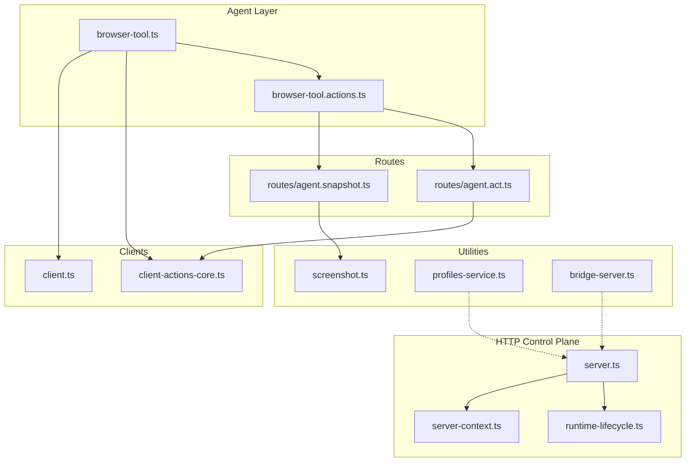
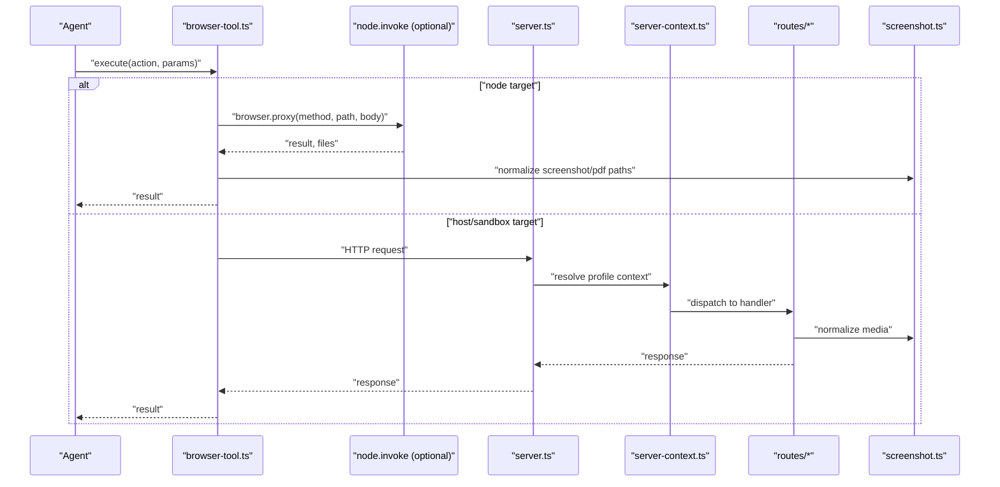
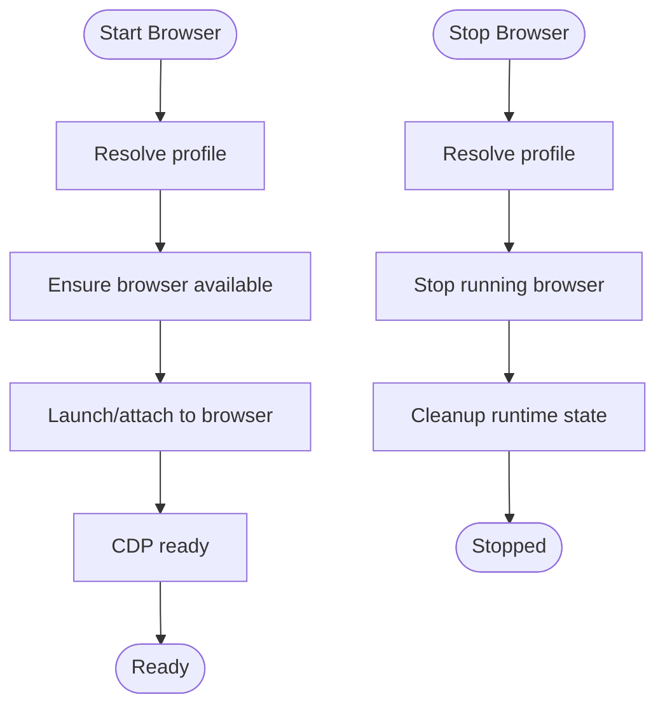
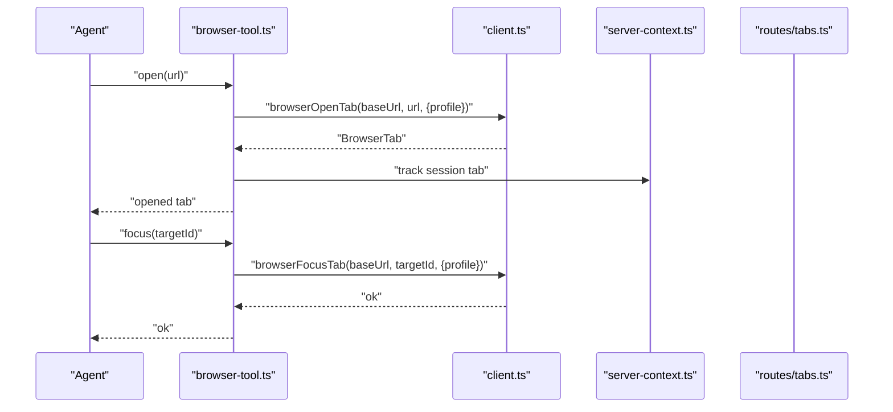
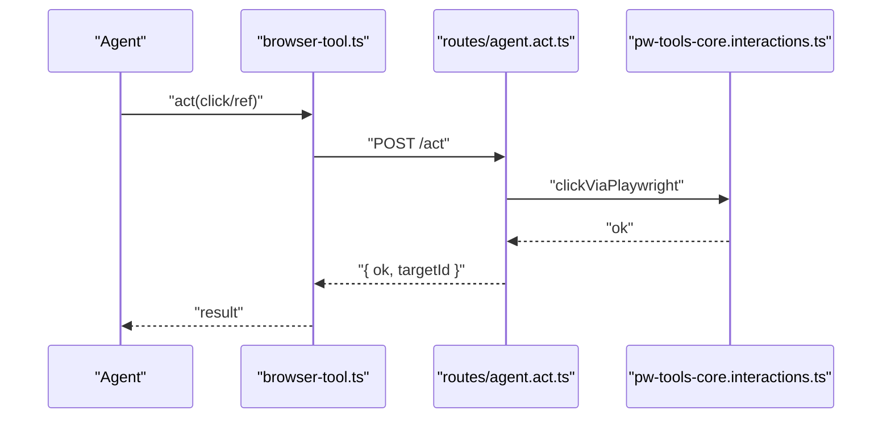
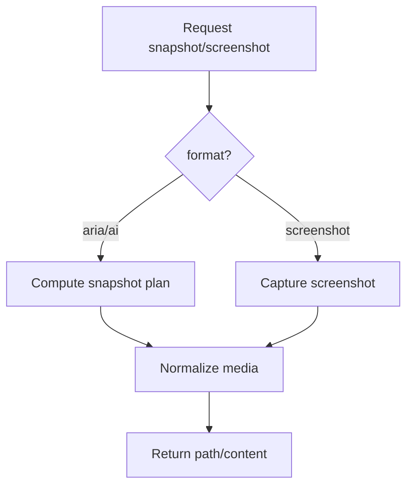
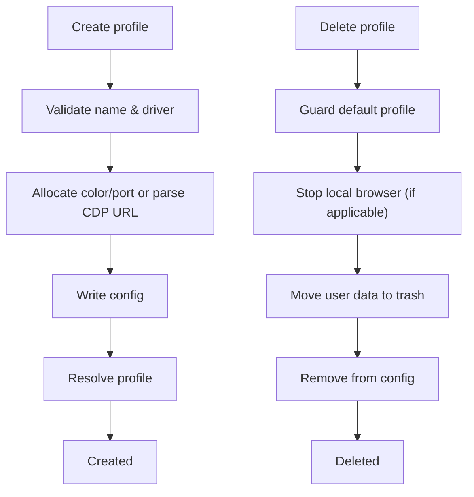
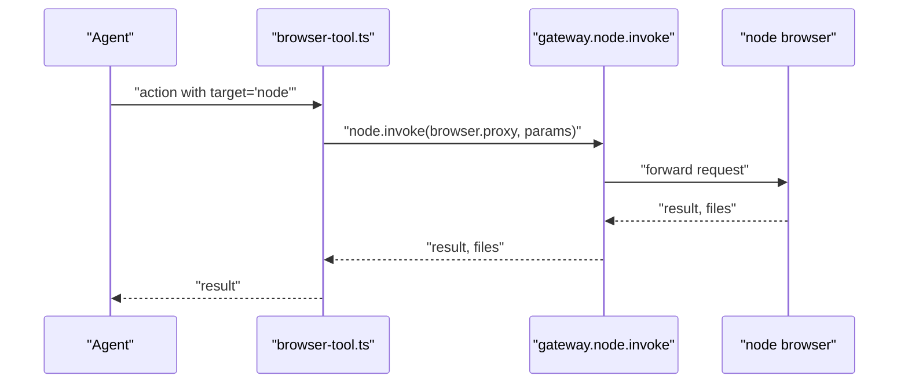
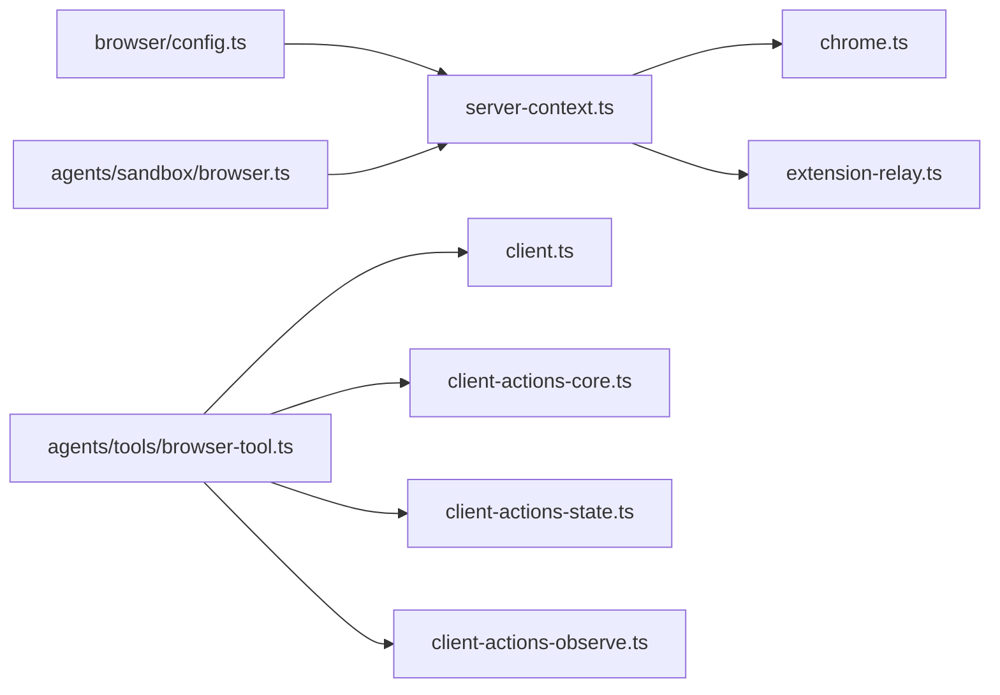

# Browser Tool

<cite>
**Referenced Files in This Document**
- [client.ts](file://src/browser/client.ts)
- [client-actions-core.ts](file://src/browser/client-actions-core.ts)
- [server.ts](file://src/browser/server.ts)
- [server-context.ts](file://src/browser/server-context.ts)
- [runtime-lifecycle.ts](file://src/browser/runtime-lifecycle.ts)
- [profiles-service.ts](file://src/browser/profiles-service.ts)
- [screenshot.ts](file://src/browser/screenshot.ts)
- [browser-tool.ts](file://src/agents/tools/browser-tool.ts)
- [browser-tool.actions.ts](file://src/agents/tools/browser-tool.actions.ts)
- [routes/agent.snapshot.ts](file://src/browser/routes/agent.snapshot.ts)
- [routes/agent.act.ts](file://src/browser/routes/agent.act.ts)
- [pw-tools-core.interactions.ts](file://src/browser/pw-tools-core.interactions.ts)
- [bridge-server.ts](file://src/browser/bridge-server.ts)
- [docs-zh/工具和技能/内置工具/浏览器控制工具.md](file://docs-zh/工具和技能/内置工具/浏览器控制工具.md)
- [docs-zh/核心概念/安全模型.md](file://docs-zh/核心概念/安全模型.md)
- [docs-zh/网关系统/认证与安全.md](file://docs-zh/网关系统/认证与安全.md)
- [docs-zh/部署和运维/安全加固.md](file://docs-zh/部署和运维/安全加固.md)
</cite>

## Table of Contents
1. [Introduction](#introduction)
2. [Project Structure](#project-structure)
3. [Core Components](#core-components)
4. [Architecture Overview](#architecture-overview)
5. [Detailed Component Analysis](#detailed-component-analysis)
6. [Dependency Analysis](#dependency-analysis)
7. [Performance Considerations](#performance-considerations)
8. [Troubleshooting Guide](#troubleshooting-guide)
9. [Conclusion](#conclusion)
10. [Appendices](#appendices)

## Introduction
This document describes the OpenClaw Browser Tool, which automates web browsing via a secure, configurable control plane. It covers browser lifecycle management (start, stop, status), tab operations (open, close, focus), UI interaction commands (click, type, evaluate), screenshot and snapshot functionality, profile management, and node integration. It also explains browser profile configuration, multi-instance support, remote browser connections, and security considerations. Practical automation workflows and troubleshooting guidance are included to help you build reliable web scraping and automation tasks.

## Project Structure
The Browser Tool spans several layers:
- Agent tool wrapper that exposes a unified action surface to agents and supports node-based remote execution.
- HTTP control server that hosts browser control endpoints and manages runtime state.
- Route handlers for read-only and mutating operations (status, profiles, tabs, snapshot, screenshot, actions).
- Client APIs for programmatic control from agents and tooling.
- Utilities for screenshots, Playwright-backed interactions, and profile lifecycle.

**Diagram sources**
- [browser-tool.ts](file://src/agents/tools/browser-tool.ts#L281-L660)
- [browser-tool.actions.ts](file://src/agents/tools/browser-tool.actions.ts#L107-L222)
- [server.ts](file://src/browser/server.ts#L20-L100)
- [server-context.ts](file://src/browser/server-context.ts#L118-L242)
- [runtime-lifecycle.ts](file://src/browser/runtime-lifecycle.ts#L6-L61)
- [routes/agent.snapshot.ts](file://src/browser/routes/agent.snapshot.ts#L212-L246)
- [routes/agent.act.ts](file://src/browser/routes/agent.act.ts#L37-L58)
- [client.ts](file://src/browser/client.ts#L103-L342)
- [client-actions-core.ts](file://src/browser/client-actions-core.ts#L108-L260)
- [screenshot.ts](file://src/browser/screenshot.ts#L11-L59)
- [profiles-service.ts](file://src/browser/profiles-service.ts#L74-L236)
- [bridge-server.ts](file://src/browser/bridge-server.ts#L59-L75)

**Section sources**
- [browser-tool.ts](file://src/agents/tools/browser-tool.ts#L281-L660)
- [server.ts](file://src/browser/server.ts#L20-L100)
- [client.ts](file://src/browser/client.ts#L103-L342)

## Core Components
- Agent tool and actions: Unified entry point for agents to control browsers, including status, lifecycle, tabs, snapshot, screenshot, navigation, console, PDF, uploads, dialogs, and UI act commands.
- HTTP control server: Starts/stops the browser control HTTP server bound to loopback, installs auth middleware, registers routes, and manages runtime state.
- Route context: Provides profile-aware contexts for availability, tab selection, and operations; resolves profiles with hot reload and computes status.
- Clients: HTTP clients for status, lifecycle, profiles, tabs, snapshot, screenshot, and action requests.
- Profiles service: Validates, creates, deletes, and reconciles browser profiles; allocates ports/colors and persists configuration.
- Screenshots: Normalizes screenshots to meet size/bytes constraints and returns JPEG when needed.
- Node integration: Optional remote execution via gateway node.invoke with browser.proxy; supports sandbox bridges and host control policies.

**Section sources**
- [browser-tool.ts](file://src/agents/tools/browser-tool.ts#L305-L657)
- [server.ts](file://src/browser/server.ts#L20-L100)
- [server-context.ts](file://src/browser/server-context.ts#L118-L242)
- [client.ts](file://src/browser/client.ts#L103-L342)
- [profiles-service.ts](file://src/browser/profiles-service.ts#L74-L236)
- [screenshot.ts](file://src/browser/screenshot.ts#L11-L59)

## Architecture Overview
The Browser Tool follows a layered architecture:
- Agent tool orchestrates operations and optionally proxies to remote nodes.
- Control server exposes endpoints for browser control and snapshot/screenshot.
- Route handlers coordinate with profile contexts to ensure availability and tab selection.
- Clients encapsulate HTTP calls and timeouts.
- Profiles service manages configuration and runtime reconciliation.
- Screenshots normalize output for downstream consumption.

**Diagram sources**
- [browser-tool.ts](file://src/agents/tools/browser-tool.ts#L305-L657)
- [server.ts](file://src/browser/server.ts#L20-L100)
- [server-context.ts](file://src/browser/server-context.ts#L118-L242)
- [routes/agent.snapshot.ts](file://src/browser/routes/agent.snapshot.ts#L212-L246)
- [screenshot.ts](file://src/browser/screenshot.ts#L11-L59)

## Detailed Component Analysis

### Browser Lifecycle Management
- Status: Retrieve browser status including enabled flag, running state, CDP readiness, PID, CDP port/URL, chosen/executable paths, headless mode, and attach-only mode.
- Start/Stop: Start or stop a browser instance for a given profile; optional profile query parameter.
- Reset profile: Reset a profile’s user data and return moved-from/moved-to paths.
- Multi-instance: Multiple profiles can run concurrently; each has its own CDP port/color and can be local or remote.

**Diagram sources**
- [client.ts](file://src/browser/client.ts#L103-L151)
- [server-context.ts](file://src/browser/server-context.ts#L78-L116)
- [runtime-lifecycle.ts](file://src/browser/runtime-lifecycle.ts#L6-L61)

**Section sources**
- [client.ts](file://src/browser/client.ts#L103-L151)
- [server-context.ts](file://src/browser/server-context.ts#L78-L116)
- [runtime-lifecycle.ts](file://src/browser/runtime-lifecycle.ts#L6-L61)

### Tab Operations
- List tabs: Enumerate tabs for a profile.
- Open tab: Open a URL in a new tab; tracks session tab for later focus/close.
- Focus tab: Bring a tab into focus by targetId.
- Close tab: Close a tab by targetId or issue a close action if no targetId is provided.
- Tab selection: Ensures availability and handles last-target preference and navigation guards.

**Diagram sources**
- [browser-tool.ts](file://src/agents/tools/browser-tool.ts#L417-L452)
- [client.ts](file://src/browser/client.ts#L206-L256)
- [server-context.ts](file://src/browser/server-context.ts#L87-L116)

**Section sources**
- [client.ts](file://src/browser/client.ts#L206-L256)
- [browser-tool.ts](file://src/agents/tools/browser-tool.ts#L417-L452)
- [server-context.ts](file://src/browser/server-context.ts#L87-L116)

### UI Interaction Commands (click, type, evaluate)
- Act requests: Unified act interface supporting click, type, press, hover, scrollIntoView, drag, select, fill, resize, wait, evaluate, and close.
- Playwright-backed interactions: Click, type, select, and keyboard press leverage Playwright for robust DOM interaction.
- Evaluate: Execute arbitrary JavaScript in the page context; respects evaluateEnabled policy.

**Diagram sources**
- [browser-tool.ts](file://src/agents/tools/browser-tool.ts#L642-L653)
- [routes/agent.act.ts](file://src/browser/routes/agent.act.ts#L37-L58)
- [pw-tools-core.interactions.ts](file://src/browser/pw-tools-core.interactions.ts#L130-L195)

**Section sources**
- [client-actions-core.ts](file://src/browser/client-actions-core.ts#L15-L76)
- [routes/agent.act.ts](file://src/browser/routes/agent.act.ts#L37-L58)
- [pw-tools-core.interactions.ts](file://src/browser/pw-tools-core.interactions.ts#L130-L195)

### Screenshot and Snapshot Functionality
- Snapshot: Produce an accessibility tree (aria) or an AI-friendly text snapshot with optional refs, labels, and image output.
- Screenshot: Capture a PNG/JPEG screenshot of the viewport or an element; normalizes size/bytes and returns file path.
- Media normalization: Enforces max side and max bytes; converts to JPEG when necessary.

**Diagram sources**
- [routes/agent.snapshot.ts](file://src/browser/routes/agent.snapshot.ts#L212-L246)
- [screenshot.ts](file://src/browser/screenshot.ts#L11-L59)

**Section sources**
- [routes/agent.snapshot.ts](file://src/browser/routes/agent.snapshot.ts#L212-L246)
- [screenshot.ts](file://src/browser/screenshot.ts#L11-L59)

### Profile Management
- Create profile: Validates name, assigns color/port, supports explicit CDP URL (loopback for extension driver), writes config, and resolves profile.
- Delete profile: Prevents deletion of default profile, stops local browsers, trashes user data, updates config, and removes from runtime.
- List profiles: Computes running state and tab counts by probing reachability and listing tabs.

**Diagram sources**
- [profiles-service.ts](file://src/browser/profiles-service.ts#L79-L170)
- [profiles-service.ts](file://src/browser/profiles-service.ts#L172-L228)

**Section sources**
- [profiles-service.ts](file://src/browser/profiles-service.ts#L74-L236)

### Node Integration
- Remote execution: When a node with browser capability is available, the tool can proxy requests via gateway.node.invoke with browser.proxy.
- Target selection: Supports host, sandbox, or node targets; enforces policy and raises helpful errors when disabled or ambiguous.
- Sandbox bridge: Optional sandbox bridge URL can force sandbox target; otherwise defaults to host if allowed.

**Diagram sources**
- [browser-tool.ts](file://src/agents/tools/browser-tool.ts#L131-L199)
- [browser-tool.ts](file://src/agents/tools/browser-tool.ts#L201-L241)

**Section sources**
- [browser-tool.ts](file://src/agents/tools/browser-tool.ts#L131-L199)
- [browser-tool.ts](file://src/agents/tools/browser-tool.ts#L201-L241)

## Dependency Analysis
The Browser Tool integrates tightly with configuration resolution, route context, and runtime lifecycle. The dependency graph below reflects the primary relationships among key modules.

**Diagram sources**
- [docs-zh/工具和技能/内置工具/浏览器控制工具.md](file://docs-zh/工具和技能/内置工具/浏览器控制工具.md#L321-L338)

**Section sources**
- [docs-zh/工具和技能/内置工具/浏览器控制工具.md](file://docs-zh/工具和技能/内置工具/浏览器控制工具.md#L321-L338)

## Performance Considerations
- Timeouts: Client calls specify conservative timeouts for start/stop, tabs, snapshot, and actions to avoid hanging operations.
- Media normalization: Screenshot normalization reduces size/bytes efficiently; choose appropriate maxSide/maxBytes to balance fidelity and throughput.
- Wait strategies: Prefer stable UI state checks (refs, selectors, loadState) over generic waits to minimize delays.
- Port allocation: Allocate CDP ports per profile to avoid conflicts; ensure control port and CDP ranges do not overlap.

[No sources needed since this section provides general guidance]

## Troubleshooting Guide
- Authentication failures: If the browser control server fails to start due to missing or failing auth bootstrap, review the auth configuration and generated tokens.
- Port binding: If the server cannot bind to the control port, verify port availability and range configuration.
- Remote profile connectivity: For remote profiles, ensure CDP URL is reachable and matches driver expectations (loopback for extension driver).
- Chrome extension relay: When using profile="chrome", ensure a tab is attached (badge ON) and the extension relay is active.
- Node proxy issues: When targeting a node, confirm the node is connected, supports browser capability, and the gateway allows browser.proxy.

**Section sources**
- [server.ts](file://src/browser/server.ts#L31-L51)
- [server.ts](file://src/browser/server.ts#L63-L70)
- [profiles-service.ts](file://src/browser/profiles-service.ts#L107-L130)
- [browser-tool.ts](file://src/agents/tools/browser-tool.ts#L294-L299)

## Conclusion
The OpenClaw Browser Tool provides a secure, extensible framework for browser automation. Its layered design enables local control, sandbox bridging, and node-based remote execution. With robust lifecycle management, tab operations, UI interactions, snapshot/screenshot capabilities, and profile management, it supports reliable web scraping and automation workflows. Adhering to the security and operational guidance herein ensures safe and maintainable deployments.

[No sources needed since this section summarizes without analyzing specific files]

## Appendices

### Common Automation Workflows
- Snapshot then act: Use snapshot with refs to capture UI structure, then feed refs into act commands for precise interactions.
- Upload files: Arm a file chooser hook with local paths, then trigger UI actions that open the chooser.
- Dialog handling: Arm dialog hooks to accept or dismiss prompts before proceeding with automation.
- Multi-tab orchestration: Open multiple tabs, focus/select by targetId, and close tabs when finished.

[No sources needed since this section provides general guidance]

### Security Considerations
- Authentication modes: The control server supports token/password/off modes; ensure appropriate configuration and avoid exposing loopback-only endpoints externally.
- Transport security: Loopback binding prevents external exposure; when using node bridges, rely on gateway trust and TLS pinning.
- Policy gates: Evaluate evaluateEnabled and other feature gates to prevent unintended script execution.

**Section sources**
- [docs-zh/核心概念/安全模型.md](file://docs-zh/核心概念/安全模型.md#L104-L377)
- [docs-zh/网关系统/认证与安全.md](file://docs-zh/网关系统/认证与安全.md#L271-L274)
- [docs-zh/部署和运维/安全加固.md](file://docs-zh/部署和运维/安全加固.md#L92-L289)