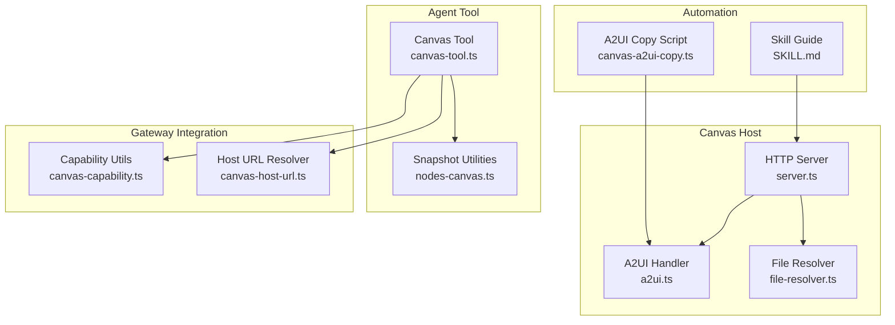
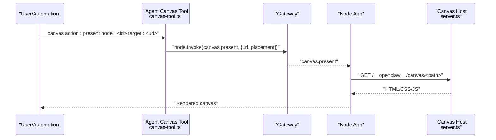
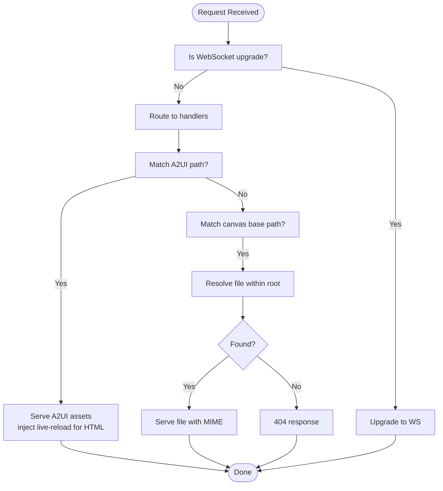
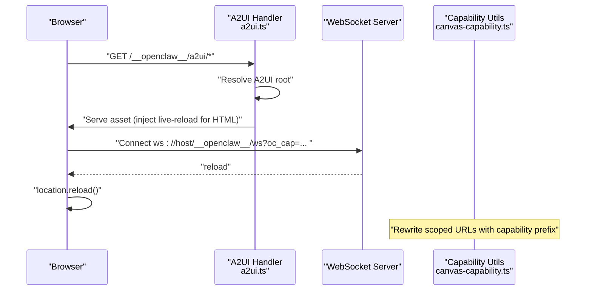
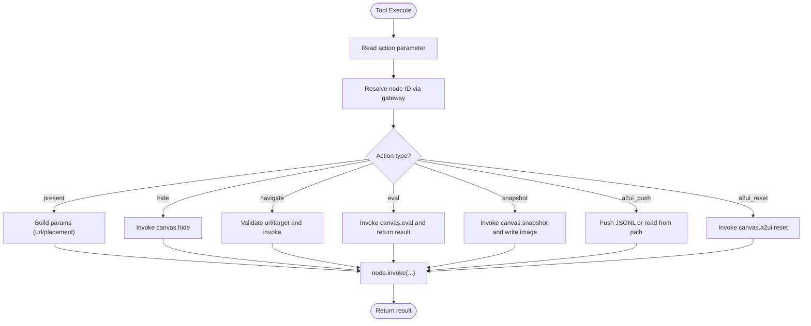
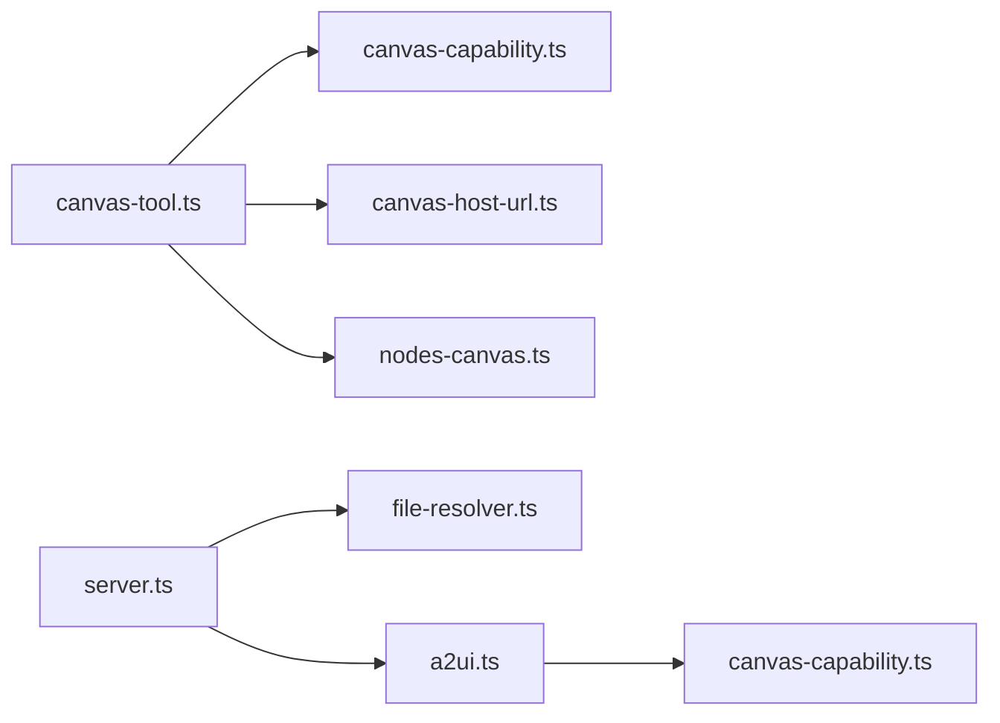

# Canvas Tool

<cite>
**Referenced Files in This Document**
- [a2ui.ts](file://src/canvas-host/a2ui.ts)
- [server.ts](file://src/canvas-host/server.ts)
- [file-resolver.ts](file://src/canvas-host/file-resolver.ts)
- [canvas-tool.ts](file://src/agents/tools/canvas-tool.ts)
- [nodes-canvas.ts](file://src/cli/nodes-canvas.ts)
- [canvas-capability.ts](file://src/gateway/canvas-capability.ts)
- [canvas-host-url.ts](file://src/infra/canvas-host-url.ts)
- [canvas-a2ui-copy.ts](file://scripts/canvas-a2ui-copy.ts)
- [SKILL.md](file://skills/canvas/SKILL.md)
</cite>

## Table of Contents
1. [Introduction](#introduction)
2. [Project Structure](#project-structure)
3. [Core Components](#core-components)
4. [Architecture Overview](#architecture-overview)
5. [Detailed Component Analysis](#detailed-component-analysis)
6. [Dependency Analysis](#dependency-analysis)
7. [Performance Considerations](#performance-considerations)
8. [Troubleshooting Guide](#troubleshooting-guide)
9. [Conclusion](#conclusion)
10. [Appendices](#appendices)

## Introduction
This document explains the OpenClaw Canvas Tool: a node-based rendering and visualization system that serves HTML/CSS/JS content to connected OpenClaw nodes (macOS, iOS, Android). It covers canvas presentation and hiding, navigation controls, evaluation commands, snapshot functionality, and A2UI integration. It also documents node hosting requirements, capability-scoped URLs, surface management via the gateway’s node system, automation workflows, A2UI usage patterns, and best practices for efficient rendering and visualization tasks.

## Project Structure
The Canvas Tool spans several modules:
- Canvas Host: an embedded HTTP server serving static assets and optionally live-reloading via WebSocket.
- A2UI integration: a dedicated route for serving A2UI assets and injecting a live-reload script.
- Agent Tool: a typed tool exposing actions (present/hide/navigate/eval/snapshot/A2UI push/reset) invoked against a selected node.
- Capability scoping: capability tokens for secure, scoped access to canvas routes.
- URL resolution: logic to derive public canvas host URLs from gateway binding and proxy contexts.
- Automation and documentation: skill guide and CLI utilities for snapshots.

**Diagram sources**
- [server.ts](file://src/canvas-host/server.ts#L399-L479)
- [a2ui.ts](file://src/canvas-host/a2ui.ts#L14-L210)
- [file-resolver.ts](file://src/canvas-host/file-resolver.ts#L1-L51)
- [canvas-tool.ts](file://src/agents/tools/canvas-tool.ts#L80-L216)
- [nodes-canvas.ts](file://src/cli/nodes-canvas.ts#L1-L25)
- [canvas-capability.ts](file://src/gateway/canvas-capability.ts#L1-L88)
- [canvas-host-url.ts](file://src/infra/canvas-host-url.ts#L57-L94)
- [SKILL.md](file://skills/canvas/SKILL.md#L1-L199)
- [canvas-a2ui-copy.ts](file://scripts/canvas-a2ui-copy.ts#L1-L41)

**Section sources**
- [server.ts](file://src/canvas-host/server.ts#L1-L479)
- [a2ui.ts](file://src/canvas-host/a2ui.ts#L1-L210)
- [file-resolver.ts](file://src/canvas-host/file-resolver.ts#L1-L51)
- [canvas-tool.ts](file://src/agents/tools/canvas-tool.ts#L1-L216)
- [nodes-canvas.ts](file://src/cli/nodes-canvas.ts#L1-L25)
- [canvas-capability.ts](file://src/gateway/canvas-capability.ts#L1-L88)
- [canvas-host-url.ts](file://src/infra/canvas-host-url.ts#L1-L94)
- [SKILL.md](file://skills/canvas/SKILL.md#L1-L199)
- [canvas-a2ui-copy.ts](file://scripts/canvas-a2ui-copy.ts#L1-L41)

## Core Components
- Canvas Host HTTP Server
  - Serves files from a configured root directory under a fixed base path.
  - Supports live reload via WebSocket and file watching.
  - Provides a default index page for testing and bridge diagnostics.
- A2UI Handler
  - Serves A2UI assets from a discoverable directory and injects a live-reload script into HTML.
  - Handles GET/HEAD requests and validates asset presence.
- File Resolver
  - Safely resolves requested paths within the root, preventing directory traversal and symlink bypass.
- Agent Canvas Tool
  - Exposes actions: present, hide, navigate, eval, snapshot, a2ui_push, a2ui_reset.
  - Invokes gateway commands targeting a specific node.
  - Supports snapshot output to temporary files with sanitized image limits.
- Capability Scoping
  - Generates capability tokens and rewrites scoped URLs to avoid exposing internal paths.
- Canvas Host URL Resolver
  - Derives public canvas host URLs considering host overrides, forwarded protocols, and proxy ports.
- Automation and Snapshot Utilities
  - Defines snapshot payload shape and temp file naming.
  - Skill guide documents typical workflows and debugging.

**Section sources**
- [server.ts](file://src/canvas-host/server.ts#L22-L56)
- [a2ui.ts](file://src/canvas-host/a2ui.ts#L142-L210)
- [file-resolver.ts](file://src/canvas-host/file-resolver.ts#L11-L51)
- [canvas-tool.ts](file://src/agents/tools/canvas-tool.ts#L18-L26)
- [canvas-capability.ts](file://src/gateway/canvas-capability.ts#L20-L87)
- [canvas-host-url.ts](file://src/infra/canvas-host-url.ts#L57-L94)
- [nodes-canvas.ts](file://src/cli/nodes-canvas.ts#L5-L24)
- [SKILL.md](file://skills/canvas/SKILL.md#L48-L199)

## Architecture Overview
The Canvas Tool integrates three layers:
- Canvas Host: an HTTP server that serves static assets and optionally live-reloads them.
- Node Bridge: the gateway’s node system that routes commands to connected nodes.
- Node Apps: macOS/iOS/Android apps that render the served content in a WebView.

**Diagram sources**
- [canvas-tool.ts](file://src/agents/tools/canvas-tool.ts#L107-L134)
- [server.ts](file://src/canvas-host/server.ts#L301-L379)

## Detailed Component Analysis

### Canvas Host HTTP Server
Responsibilities:
- Normalize base path and resolve root directory.
- Serve static assets with MIME detection and cache control.
- Inject live-reload script for HTML responses when enabled.
- Watch file changes and broadcast reload signals via WebSocket.
- Upgrade HTTP requests to WebSocket for live reload.

Key behaviors:
- Environment gating disables the server in tests unless explicitly allowed.
- Default index page includes bridge diagnostics and demo actions.
- Live reload is configurable and optimized for test vs. normal environments.

**Diagram sources**
- [server.ts](file://src/canvas-host/server.ts#L416-L442)
- [a2ui.ts](file://src/canvas-host/a2ui.ts#L142-L210)
- [file-resolver.ts](file://src/canvas-host/file-resolver.ts#L11-L51)

**Section sources**
- [server.ts](file://src/canvas-host/server.ts#L205-L397)
- [server.ts](file://src/canvas-host/server.ts#L399-L479)

### A2UI Handler and Live Reload
Responsibilities:
- Discover A2UI assets across multiple candidate locations.
- Serve A2UI files and inject a live-reload script into HTML.
- Establish WebSocket connection for live reload when capability-scoped URLs are used.

Integration points:
- Capability-scoped URLs rewrite path segments to a capability prefix and append a query param for verification.
- Live reload script posts user actions to native bridges and listens for reload signals.

**Diagram sources**
- [a2ui.ts](file://src/canvas-host/a2ui.ts#L19-L79)
- [a2ui.ts](file://src/canvas-host/a2ui.ts#L142-L210)
- [canvas-capability.ts](file://src/gateway/canvas-capability.ts#L42-L87)

**Section sources**
- [a2ui.ts](file://src/canvas-host/a2ui.ts#L14-L210)
- [canvas-capability.ts](file://src/gateway/canvas-capability.ts#L1-L88)

### File Resolution and Security
Responsibilities:
- Normalize URL paths and prevent directory traversal.
- Safely open files within the configured root and reject symlinks or directories without index fallbacks.

Security considerations:
- Rejects attempts to escape the root via “..” segments.
- Ensures safe file opening and closes handles promptly.

**Section sources**
- [file-resolver.ts](file://src/canvas-host/file-resolver.ts#L5-L51)

### Agent Canvas Tool
Capabilities:
- present: show canvas with optional URL and placement (x/y/width/height).
- hide: hide the canvas.
- navigate: navigate to a new URL.
- eval: evaluate JavaScript and return the result.
- snapshot: capture a screenshot and write to a temporary image file.
- a2ui_push: push A2UI JSONL events to the node.
- a2ui_reset: reset A2UI state.

Execution flow:
- Resolves node ID via gateway options.
- Invokes node.invoke with a unique idempotency key.
- Parses snapshot payload and writes image to a temp path with appropriate MIME.

**Diagram sources**
- [canvas-tool.ts](file://src/agents/tools/canvas-tool.ts#L88-L215)

**Section sources**
- [canvas-tool.ts](file://src/agents/tools/canvas-tool.ts#L18-L26)
- [canvas-tool.ts](file://src/agents/tools/canvas-tool.ts#L80-L216)

### Snapshot Functionality
- Payload parsing enforces required fields.
- Temporary file naming follows a deterministic pattern.
- Image sanitization limits are applied when returning images.

**Section sources**
- [nodes-canvas.ts](file://src/cli/nodes-canvas.ts#L5-L24)
- [canvas-tool.ts](file://src/agents/tools/canvas-tool.ts#L162-L193)

### Capability-Scoped URLs
- Capability tokens minted securely and embedded into URLs.
- Scoped URL normalization rewrites path-based capability segments and ensures canonical query param presence.

**Section sources**
- [canvas-capability.ts](file://src/gateway/canvas-capability.ts#L20-L87)

### Canvas Host URL Resolution
- Derives public canvas host URL from gateway binding, host overrides, forwarded protocol, and request host/port.
- Adjusts exposed port when behind reverse proxies (e.g., Tailscale Serve).

**Section sources**
- [canvas-host-url.ts](file://src/infra/canvas-host-url.ts#L57-L94)

### A2UI Asset Packaging and Discovery
- A2UI assets are copied from a source directory to a distribution directory during build.
- The A2UI handler discovers assets across multiple locations to support various deployment modes.

**Section sources**
- [canvas-a2ui-copy.ts](file://scripts/canvas-a2ui-copy.ts#L7-L28)
- [a2ui.ts](file://src/canvas-host/a2ui.ts#L19-L79)

## Dependency Analysis
High-level dependencies:
- Canvas Tool depends on the gateway to target nodes and on capability utilities for secure URLs.
- Canvas Host depends on file resolver for safe file access and on A2UI handler for serving assets.
- Snapshot utilities depend on CLI helpers for temp paths and image MIME inference.

**Diagram sources**
- [canvas-tool.ts](file://src/agents/tools/canvas-tool.ts#L1-L216)
- [canvas-capability.ts](file://src/gateway/canvas-capability.ts#L1-L88)
- [canvas-host-url.ts](file://src/infra/canvas-host-url.ts#L1-L94)
- [nodes-canvas.ts](file://src/cli/nodes-canvas.ts#L1-L25)
- [server.ts](file://src/canvas-host/server.ts#L1-L479)
- [file-resolver.ts](file://src/canvas-host/file-resolver.ts#L1-L51)
- [a2ui.ts](file://src/canvas-host/a2ui.ts#L1-L210)

**Section sources**
- [canvas-tool.ts](file://src/agents/tools/canvas-tool.ts#L1-L216)
- [server.ts](file://src/canvas-host/server.ts#L1-L479)
- [a2ui.ts](file://src/canvas-host/a2ui.ts#L1-L210)
- [file-resolver.ts](file://src/canvas-host/file-resolver.ts#L1-L51)
- [canvas-capability.ts](file://src/gateway/canvas-capability.ts#L1-L88)
- [canvas-host-url.ts](file://src/infra/canvas-host-url.ts#L1-L94)
- [nodes-canvas.ts](file://src/cli/nodes-canvas.ts#L1-L25)

## Performance Considerations
- Live reload
  - Debounce and write-stability thresholds reduce unnecessary reloads.
  - Polling mode is used in tests; production defaults to filesystem watchers.
- File serving
  - MIME detection avoids misreported content types.
  - HEAD requests supported for metadata-only retrieval.
- Snapshot generation
  - Writes captured frames to temporary files; ensure adequate disk space and permissions.
- WebSocket upgrades
  - Dedicated WS server for live reload; non-upgrade requests return 426 when live reload is enabled.

[No sources needed since this section provides general guidance]

## Troubleshooting Guide
Common issues and resolutions:
- White screen or content not loading
  - Cause: URL mismatch between server bind mode and node expectation.
  - Steps: verify gateway bind mode, confirm port binding, curl the canvas URL directly.
  - Resolution: use the full hostname matching your bind mode, not localhost.
- “node required” or “node not connected”
  - Always specify a valid node ID; ensure the node is online.
- Content not updating with live reload
  - Verify liveReload is enabled, file is inside the canvas root, and there are no watcher errors.
- A2UI assets not found
  - Ensure A2UI bundle assets exist and are copied to the distribution directory.
- Capability-scoped URL malformed
  - Confirm capability token is properly encoded and present in the path or query.

**Section sources**
- [SKILL.md](file://skills/canvas/SKILL.md#L151-L199)
- [a2ui.ts](file://src/canvas-host/a2ui.ts#L165-L171)
- [canvas-a2ui-copy.ts](file://scripts/canvas-a2ui-copy.ts#L13-L28)
- [canvas-capability.ts](file://src/gateway/canvas-capability.ts#L42-L87)

## Conclusion
The OpenClaw Canvas Tool provides a robust, node-based rendering pipeline with secure, capability-scoped access, live-reload support, and integration with the gateway’s node system. By leveraging the Agent Canvas Tool, capability utilities, and the Canvas Host server, teams can build interactive visualizations, dashboards, and demos that render consistently across macOS, iOS, and Android nodes.

[No sources needed since this section summarizes without analyzing specific files]

## Appendices

### A2UI Usage Patterns
- Push JSONL events to the node’s A2UI surface for dynamic updates.
- Reset A2UI state when switching contexts.
- Use capability-scoped URLs to securely share A2UI targets.

**Section sources**
- [canvas-tool.ts](file://src/agents/tools/canvas-tool.ts#L194-L210)
- [canvas-capability.ts](file://src/gateway/canvas-capability.ts#L20-L87)

### Automation Workflows
- Prepare HTML content in the canvas root directory.
- Determine the canvas host URL based on gateway bind mode.
- Present content to a specific node, then navigate or snapshot as needed.

**Section sources**
- [SKILL.md](file://skills/canvas/SKILL.md#L86-L149)