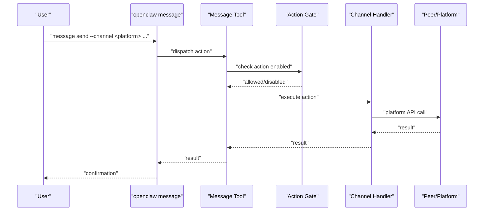
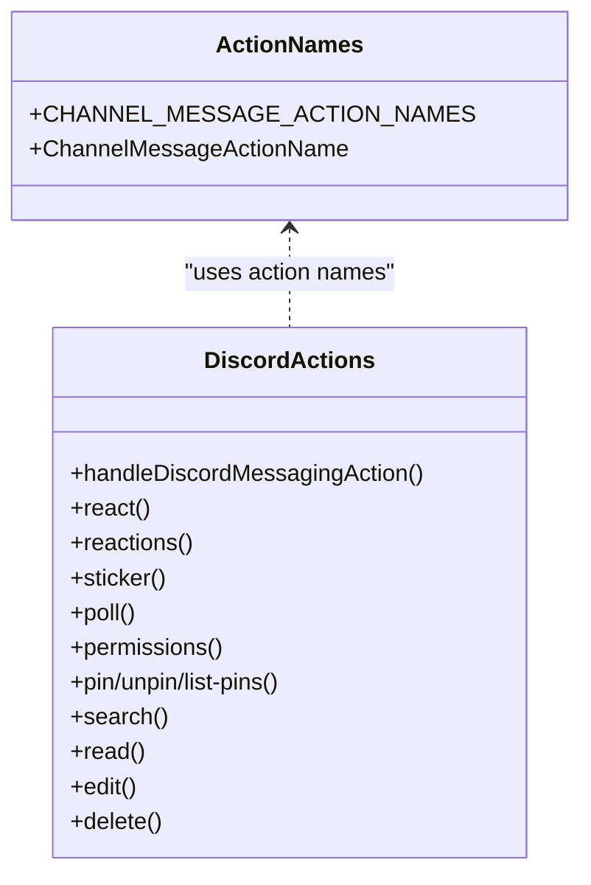
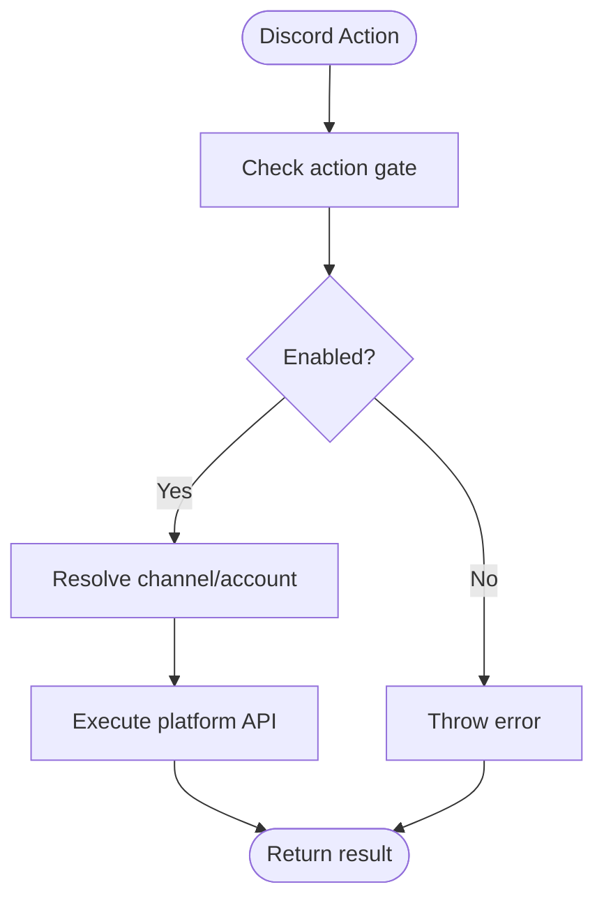
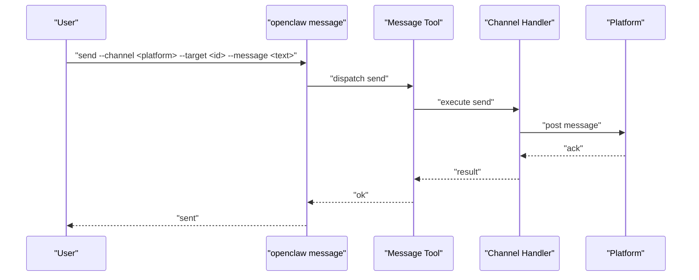
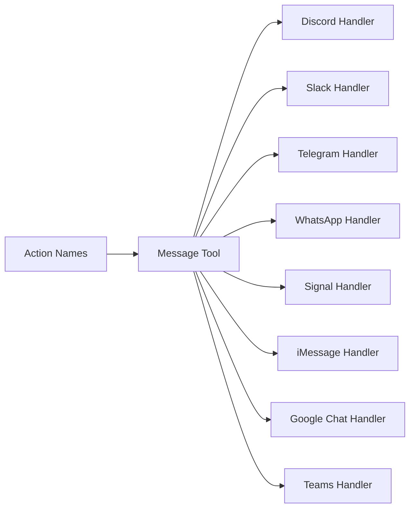

# Communication Tools

<cite>
**Referenced Files in This Document**
- [message-action-names.ts](file://src/channels/plugins/message-action-names.ts)
- [discord-actions-messaging.ts](file://src/agents/tools/discord-actions-messaging.ts)
- [discord.md](file://docs/channels/discord.md)
- [googlechat.md](file://docs/channels/googlechat.md)
- [slack.md](file://docs/channels/slack.md)
- [telegram.md](file://docs/channels/telegram.md)
- [whatsapp.md](file://docs/channels/whatsapp.md)
- [signal.md](file://docs/channels/signal.md)
- [imessage.md](file://docs/channels/imessage.md)
- [msteams.md](file://docs/channels/msteams.md)
- [index.md](file://docs/channels/index.md)
- [message.md](file://docs/cli/message.md)
- [messages.md](file://docs/concepts/messages.md)
- [channel-routing.md](file://docs/channels/channel-routing.md)
</cite>

## Table of Contents
1. [Introduction](#introduction)
2. [Project Structure](#project-structure)
3. [Core Components](#core-components)
4. [Architecture Overview](#architecture-overview)
5. [Detailed Component Analysis](#detailed-component-analysis)
6. [Dependency Analysis](#dependency-analysis)
7. [Performance Considerations](#performance-considerations)
8. [Troubleshooting Guide](#troubleshooting-guide)
9. [Conclusion](#conclusion)
10. [Appendices](#appendices)

## Introduction
This document describes OpenClaw’s communication tools for building, routing, and automating outbound messages across multiple platforms. It covers the message tool’s extensive action set, channel-specific capabilities, authentication and access controls, and practical workflows. Cross-platform support includes Discord, Google Chat, Slack, Telegram, WhatsApp, Signal, iMessage, and Microsoft Teams. The documentation emphasizes deterministic reply routing, session scoping, and platform-specific features such as threads, polls, reactions, pins, and moderation.

## Project Structure
OpenClaw organizes messaging capabilities around:
- A unified message tool that exposes a consistent set of actions across channels
- Channel-specific implementations and documentation
- Configuration-driven access control and routing policies
- CLI reference for sending messages and invoking actions

```mermaid
graph TB
subgraph "CLI"
CLI["openclaw message"]
end
subgraph "Agent Tools"
Tool["Message Tool Actions"]
Names["Action Names Registry"]
end
subgraph "Channels"
Discord["Discord"]
GoogleChat["Google Chat"]
Slack["Slack"]
Telegram["Telegram"]
WhatsApp["WhatsApp"]
Signal["Signal"]
iMessage["iMessage"]
Teams["Microsoft Teams"]
end
CLI --> Tool
Tool --> Names
Tool --> Discord
Tool --> GoogleChat
Tool --> Slack
Tool --> Telegram
Tool --> WhatsApp
Tool --> Signal
Tool --> iMessage
Tool --> Teams
```

**Diagram sources**
- [message.md](file://docs/cli/message.md#L1-L261)
- [message-action-names.ts](file://src/channels/plugins/message-action-names.ts#L1-L58)
- [discord-actions-messaging.ts](file://src/agents/tools/discord-actions-messaging.ts#L59-L179)

**Section sources**
- [message.md](file://docs/cli/message.md#L1-L261)
- [message-action-names.ts](file://src/channels/plugins/message-action-names.ts#L1-L58)
- [index.md](file://docs/channels/index.md#L1-L48)

## Core Components
- Message tool action registry defines the canonical set of actions (send, react, read, edit, delete, pin/unpin/list-pins, permissions, thread operations, search, sticker management, member/role/channel operations, moderation).
- Channel-specific implementations implement actions for each platform, gated by configuration.
- CLI provides a single entry point to send messages and invoke actions across channels.
- Routing ensures replies return deterministically to the originating channel.

Key action categories:
- Core messaging: send, read, edit, delete, reply
- Interactions: react, reactions, stickers, polls
- Threads: create, list, reply
- Administration: permissions, member/role/channel info, emoji/sticker upload, moderation (timeout/kick/ban)
- Discovery/search: search, list-pins
- Utilities: download-file

**Section sources**
- [message-action-names.ts](file://src/channels/plugins/message-action-names.ts#L1-L58)
- [message.md](file://docs/cli/message.md#L53-L177)

## Architecture Overview
OpenClaw’s messaging architecture centers on deterministic routing and consistent action semantics across channels. The message tool validates parameters, enforces action gating, and delegates to channel-specific handlers. Sessions isolate context per channel and peer, and reply routing ensures replies return to the originating channel.



**Diagram sources**
- [message.md](file://docs/cli/message.md#L14-L52)
- [discord-actions-messaging.ts](file://src/agents/tools/discord-actions-messaging.ts#L59-L179)

**Section sources**
- [messages.md](file://docs/concepts/messages.md#L15-L31)
- [channel-routing.md](file://docs/channels/channel-routing.md#L10-L12)

## Detailed Component Analysis

### Message Tool and Action Registry
- Canonical actions are defined centrally and used by CLI, agent tools, and channel handlers.
- Actions include send, broadcast, poll, react, reactions, read, edit, delete, pin/unpin/list-pins, permissions, thread-create/list/reply, search, sticker/send-sticker-search, member-info/role-info, emoji-list/upload, sticker-upload, role-add/remove, channel-info/list/create/edit/delete/move, category-create/edit/delete, topic-create, voice-status, event-list/create, timeout/kick/ban, set-presence, download-file.



**Diagram sources**
- [message-action-names.ts](file://src/channels/plugins/message-action-names.ts#L1-L58)
- [discord-actions-messaging.ts](file://src/agents/tools/discord-actions-messaging.ts#L59-L179)

**Section sources**
- [message-action-names.ts](file://src/channels/plugins/message-action-names.ts#L1-L58)
- [discord-actions-messaging.ts](file://src/agents/tools/discord-actions-messaging.ts#L59-L179)

### Cross-Platform Support and Capabilities

#### Discord
- Supports DMs, guild channels, forum threads, and interactive components.
- Actions: send, react, reactions, sticker, poll, permissions, pin/unpin/list-pins, search, thread-create/list/reply, member-info/role-info, emoji-list/upload, sticker-upload, moderation (timeout/kick/ban), set-presence.
- Authentication: Bot token and OAuth scopes; privileged intents required.
- Access control: DM policy (pairing/allowlist/open/disabled), guild allowlists, role-based routing, mention gating.
- Limits and streaming: text chunking, media caps, live stream preview, draft editing.



**Diagram sources**
- [discord-actions-messaging.ts](file://src/agents/tools/discord-actions-messaging.ts#L59-L179)
- [discord.md](file://docs/channels/discord.md#L368-L460)

**Section sources**
- [discord.md](file://docs/channels/discord.md#L1-L800)
- [discord-actions-messaging.ts](file://src/agents/tools/discord-actions-messaging.ts#L59-L179)

#### Google Chat
- HTTP webhook-based integration with service account auth and audience verification.
- Actions: send, react (when enabled), read, edit, delete, pin/unpin/list-pins, permissions, search, thread-create/list/reply, member-info/role-info, emoji-list/upload, sticker-upload, moderation (timeout/kick/ban), set-presence.
- Authentication: service account file or SecretRef, audience type/url or project number.
- Access control: DM policy (pairing/allowlist/open/disabled), group allowlists, mention gating via bot user.

**Section sources**
- [googlechat.md](file://docs/channels/googlechat.md#L1-L262)

#### Slack
- Socket Mode and HTTP Events API modes; supports DMs, channels, and groups.
- Actions: send, react, reactions, read, edit, delete, pin/unpin/list-pins, permissions, search, thread-create/list/reply, member-info/role-info, emoji-list/upload, sticker-upload, moderation (timeout/kick/ban), set-presence.
- Authentication: app token + bot token (Socket Mode) or bot token + signing secret (HTTP).
- Access control: DM policy (pairing/allowlist/open/disabled), channel allowlists, mention gating, per-channel tools and sender policies.

**Section sources**
- [slack.md](file://docs/channels/slack.md#L1-L555)

#### Telegram
- Long polling and optional webhook; supports DMs and groups with forum topics.
- Actions: send, react, reactions, read, edit, delete, pin/unpin/list-pins, permissions, search, thread-create/list/reply, member-info/role-info, emoji-list/upload, sticker-upload, moderation (timeout/kick/ban), set-presence.
- Authentication: bot token; DM policy (pairing/allowlist/open/disabled), group allowlists, mention gating, inline buttons capability gating.
- Limits: text chunking, media caps, poll durations, forum topics.

**Section sources**
- [telegram.md](file://docs/channels/telegram.md#L1-L800)

#### WhatsApp
- Web-based integration via Baileys; QR pairing for linking.
- Actions: send, react, read, edit, delete, pin/unpin/list-pins, permissions, search, thread-create/list/reply, member-info/role-info, emoji-list/upload, sticker-upload, moderation (timeout/kick/ban), set-presence.
- Authentication: multi-account credentials, pairing approvals, self-chat safeguards.
- Access control: DM policy (pairing/allowlist/open/disabled), group allowlists, mention gating, read receipts.

**Section sources**
- [whatsapp.md](file://docs/channels/whatsapp.md#L1-L446)

#### Signal
- External CLI integration via signal-cli over HTTP JSON-RPC + SSE.
- Actions: send, react (group reactions require target author), read, edit, delete, pin/unpin/list-pins, permissions, search, thread-create/list/reply, member-info/role-info, emoji-list/upload, sticker-upload, moderation (timeout/kick/ban), set-presence.
- Authentication: account number, CLI path, optional daemon URL, pairing approvals.
- Access control: DM policy (pairing/allowlist/open/disabled), group allowlists, mention gating.

**Section sources**
- [signal.md](file://docs/channels/signal.md#L1-L326)

#### iMessage (Legacy)
- External CLI integration via imsg over stdio; BlueBubbles recommended for new setups.
- Actions: send, react, read, edit, delete, pin/unpin/list-pins, permissions, search, thread-create/list/reply, member-info/role-info, emoji-list/upload, sticker-upload, moderation (timeout/kick/ban), set-presence.
- Authentication: CLI path, database path, optional remote host for attachments.
- Access control: DM policy (pairing/allowlist/open/disabled), group allowlists, mention gating via patterns.

**Section sources**
- [imessage.md](file://docs/channels/imessage.md#L1-L368)

#### Microsoft Teams
- Plugin-based integration; requires Azure Bot registration and Teams app manifest with RSC permissions.
- Actions: send, react, read, edit, delete, pin/unpin/list-pins, permissions, search, thread-create/list/reply, member-info/role-info, emoji-list/upload, sticker-upload, moderation (timeout/kick/ban), set-presence.
- Authentication: app ID, app password, tenant ID, webhook endpoint.
- Access control: DM policy (pairing/allowlist/open/disabled), team/channel allowlists, mention gating, reply style (threads vs posts), file sharing via SharePoint.

**Section sources**
- [msteams.md](file://docs/channels/msteams.md#L1-L777)

### Channel-Specific Features and Workflows
- Threads: Discord forum threads, Slack threads, Telegram forum topics, Teams threads.
- Polls: Platform-native or Adaptive Cards (Teams).
- Reactions: Cross-platform support with platform-specific semantics (Signal group reactions require target author).
- Pins: Pin/unpin/list-pins supported on Discord and Slack.
- Moderation: Timeout/kick/ban on Discord and Slack; similar moderation actions exposed via actions registry.
- Permissions: Channel permission inspection on Discord; role-based routing and allowlists.
- Search: Message search on Discord; read pagination on Discord/Slack.

**Section sources**
- [discord-actions-messaging.ts](file://src/agents/tools/discord-actions-messaging.ts#L180-L468)
- [discord.md](file://docs/channels/discord.md#L553-L800)
- [slack.md](file://docs/channels/slack.md#L284-L340)
- [telegram.md](file://docs/channels/telegram.md#L394-L471)
- [msteams.md](file://docs/channels/msteams.md#L602-L692)

### Authentication and Access Controls
- Channel-specific credentials and tokens are configured per channel and account.
- Access policies include DM policy (pairing/allowlist/open/disabled), group/channel allowlists, mention gating, and per-sender tool policies.
- Secrets management supports environment variables, file-based, and SecretRef providers.

**Section sources**
- [discord.md](file://docs/channels/discord.md#L368-L460)
- [googlechat.md](file://docs/channels/googlechat.md#L163-L207)
- [slack.md](file://docs/channels/slack.md#L136-L205)
- [telegram.md](file://docs/channels/telegram.md#L105-L220)
- [whatsapp.md](file://docs/channels/whatsapp.md#L134-L200)
- [signal.md](file://docs/channels/signal.md#L182-L243)
- [imessage.md](file://docs/channels/imessage.md#L134-L185)
- [msteams.md](file://docs/channels/msteams.md#L85-L141)

### Common Communication Workflows
- Send a reply to a Discord message with components and attachments.
- Create a poll in Telegram with forum topic support and auto-close timing.
- React in Slack with ephemeral acknowledgments and per-user reaction notifications.
- Send a Teams proactive message or Adaptive Card to a user or conversation.
- Approve a pairing code for Signal or iMessage DMs.
- Pin/unpin messages in Discord and Slack; list pins for moderation reviews.



**Diagram sources**
- [message.md](file://docs/cli/message.md#L185-L261)

**Section sources**
- [message.md](file://docs/cli/message.md#L185-L261)

## Dependency Analysis
- The message tool depends on the action names registry and per-channel handlers.
- Channel handlers depend on platform SDKs or external daemons (signal-cli, imsg, Baileys).
- Routing and sessions depend on configuration and bindings.



**Diagram sources**
- [message-action-names.ts](file://src/channels/plugins/message-action-names.ts#L1-L58)
- [discord-actions-messaging.ts](file://src/agents/tools/discord-actions-messaging.ts#L59-L179)

**Section sources**
- [message-action-names.ts](file://src/channels/plugins/message-action-names.ts#L1-L58)
- [discord-actions-messaging.ts](file://src/agents/tools/discord-actions-messaging.ts#L59-L179)

## Performance Considerations
- Chunking and streaming: Many channels support text chunking and streaming previews to improve perceived latency.
- Media handling: Channel-specific media caps and optimization reduce payload sizes.
- Debouncing and queueing: Inbound deduplication and queueing modes control agent runs and reduce redundant processing.
- Limits: Respect platform limits (text length, media size, rate limits) to avoid throttling.

[No sources needed since this section provides general guidance]

## Troubleshooting Guide
- Channel not configured or plugin disabled: verify channel configuration and plugin status.
- Authentication errors: check tokens, audiences, and webhook paths; ensure proper scopes and permissions.
- No replies: verify DM/group policies, mention gating, and allowlists.
- Slow responses: adjust streaming and chunking settings; consider reducing media size.
- Platform-specific issues: consult channel-specific troubleshooting sections.

**Section sources**
- [discord.md](file://docs/channels/discord.md#L209-L256)
- [googlechat.md](file://docs/channels/googlechat.md#L209-L262)
- [slack.md](file://docs/channels/slack.md#L433-L490)
- [telegram.md](file://docs/channels/telegram.md#L793-L800)
- [whatsapp.md](file://docs/channels/whatsapp.md#L374-L424)
- [signal.md](file://docs/channels/signal.md#L251-L286)
- [imessage.md](file://docs/channels/imessage.md#L304-L360)
- [msteams.md](file://docs/channels/msteams.md#L745-L777)

## Conclusion
OpenClaw’s communication tools provide a unified, action-rich interface across diverse messaging platforms. With deterministic routing, robust access controls, and channel-specific capabilities, teams can automate workflows, moderate conversations, and integrate seamlessly across Discord, Google Chat, Slack, Telegram, WhatsApp, Signal, iMessage, and Microsoft Teams.

[No sources needed since this section summarizes without analyzing specific files]

## Appendices

### Channel Index and Setup Highlights
- Overview of supported channels and quick setup notes.

**Section sources**
- [index.md](file://docs/channels/index.md#L1-L48)

### CLI Reference: Actions and Flags
- Comprehensive list of actions, flags, and examples for the message tool.

**Section sources**
- [message.md](file://docs/cli/message.md#L1-L261)

### Routing and Sessions
- Deterministic routing rules and session key shapes across channels.

**Section sources**
- [channel-routing.md](file://docs/channels/channel-routing.md#L1-L135)