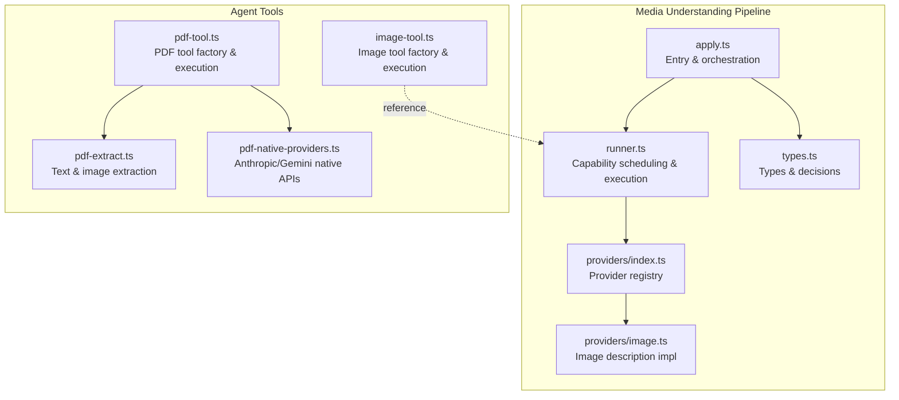
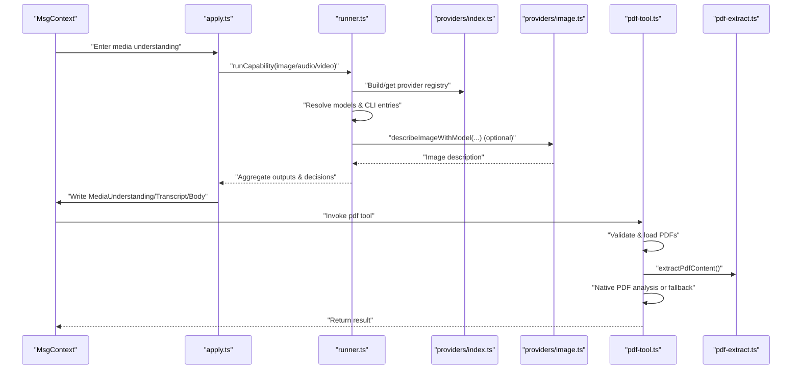
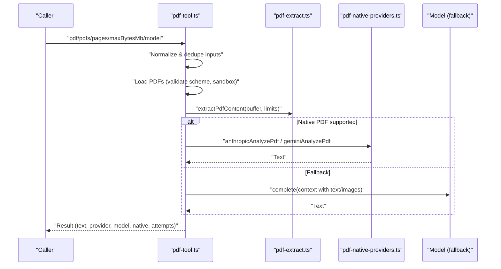
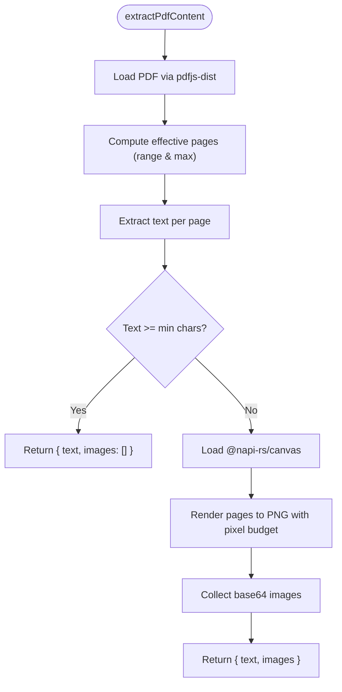
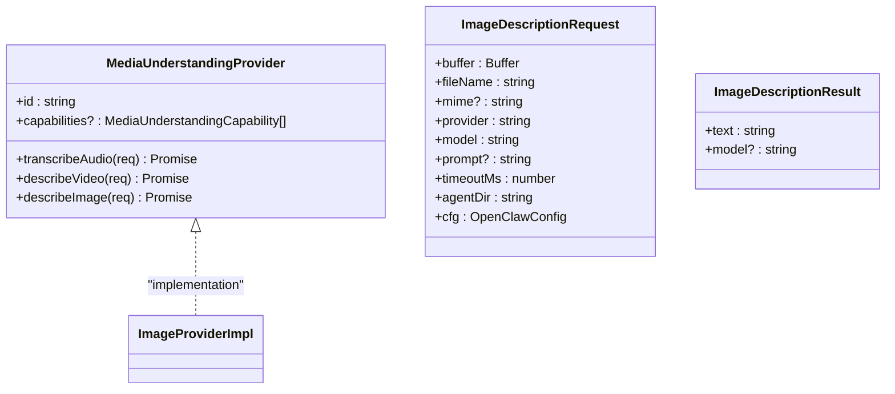
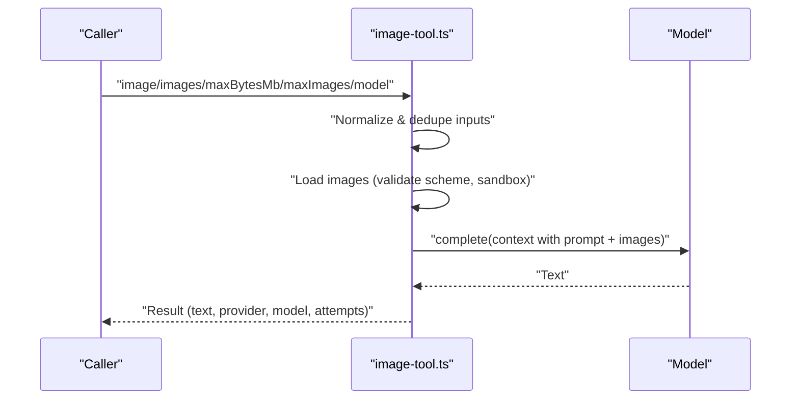
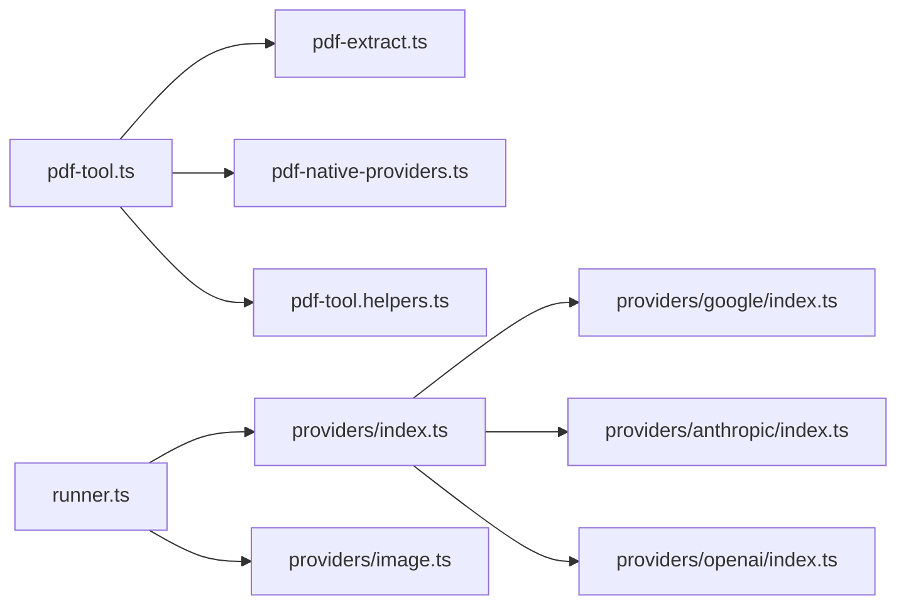

# Media Tools

<cite>
**Referenced Files in This Document**
- [pdf-tool.ts](file://src/agents/tools/pdf-tool.ts)
- [pdf-extract.ts](file://src/media/pdf-extract.ts)
- [pdf-native-providers.ts](file://src/agents/tools/pdf-native-providers.ts)
- [pdf-tool.helpers.ts](file://src/agents/tools/pdf-tool.helpers.ts)
- [apply.ts](file://src/media-understanding/apply.ts)
- [runner.ts](file://src/media-understanding/runner.ts)
- [types.ts](file://src/media-understanding/types.ts)
- [providers/index.ts](file://src/media-understanding/providers/index.ts)
- [providers/image.ts](file://src/media-understanding/providers/image.ts)
- [image-tool.ts](file://src/agents/tools/image-tool.ts)
</cite>

## Table of Contents
1. [Introduction](#introduction)
2. [Project Structure](#project-structure)
3. [Core Components](#core-components)
4. [Architecture Overview](#architecture-overview)
5. [Detailed Component Analysis](#detailed-component-analysis)
6. [Dependency Analysis](#dependency-analysis)
7. [Performance Considerations](#performance-considerations)
8. [Troubleshooting Guide](#troubleshooting-guide)
9. [Conclusion](#conclusion)
10. [Appendices](#appendices)

## Introduction
This document describes OpenClaw’s media processing tools with a focus on:
- Image analysis: configurable models, prompt customization, size limitations, and model selection
- PDF processing: document analysis, text extraction, and content summarization
- Media file handling, security considerations, performance optimization, and integration with the broader tool ecosystem

It provides practical guidance for configuring and operating these tools, along with workflows, troubleshooting tips, and best practices.

## Project Structure
OpenClaw organizes media capabilities across two primary subsystems:
- Media Understanding pipeline: automatic, concurrent analysis of images, audio, and video attachments
- Agent tools: explicit, user-invoked tools for image and PDF processing

**Diagram sources**
- [apply.ts](file://src/media-understanding/apply.ts#L466-L581)
- [runner.ts](file://src/media-understanding/runner.ts#L659-L800)
- [types.ts](file://src/media-understanding/types.ts#L1-L116)
- [providers/index.ts](file://src/media-understanding/providers/index.ts#L34-L63)
- [providers/image.ts](file://src/media-understanding/providers/image.ts#L19-L79)
- [pdf-tool.ts](file://src/agents/tools/pdf-tool.ts#L295-L559)
- [pdf-extract.ts](file://src/media/pdf-extract.ts#L42-L105)
- [pdf-native-providers.ts](file://src/agents/tools/pdf-native-providers.ts#L36-L105)
- [image-tool.ts](file://src/agents/tools/image-tool.ts#L270-L512)

**Section sources**
- [apply.ts](file://src/media-understanding/apply.ts#L1-L581)
- [runner.ts](file://src/media-understanding/runner.ts#L1-L806)
- [types.ts](file://src/media-understanding/types.ts#L1-L116)
- [providers/index.ts](file://src/media-understanding/providers/index.ts#L1-L64)
- [providers/image.ts](file://src/media-understanding/providers/image.ts#L1-L79)
- [pdf-tool.ts](file://src/agents/tools/pdf-tool.ts#L1-L559)
- [pdf-extract.ts](file://src/media/pdf-extract.ts#L1-L105)
- [pdf-native-providers.ts](file://src/agents/tools/pdf-native-providers.ts#L1-L180)
- [image-tool.ts](file://src/agents/tools/image-tool.ts#L1-L512)

## Core Components
- Media Understanding pipeline
  - Orchestrates image, audio, and video analysis concurrently
  - Selects appropriate providers and models, records decisions, and writes results into message context
- PDF tool
  - Accepts single or multiple PDFs, optional page ranges, and a user prompt
  - Prefers native PDF analysis when supported by providers; otherwise extracts text/images and feeds them to a model
- Image tool
  - Accepts single or multiple images, with configurable size and count limits
  - Builds multimodal context and runs model fallback chain

**Section sources**
- [apply.ts](file://src/media-understanding/apply.ts#L466-L581)
- [runner.ts](file://src/media-understanding/runner.ts#L659-L800)
- [pdf-tool.ts](file://src/agents/tools/pdf-tool.ts#L295-L559)
- [image-tool.ts](file://src/agents/tools/image-tool.ts#L270-L512)

## Architecture Overview
The system integrates media understanding with explicit tools. The pipeline runs automatically on incoming messages, while users can explicitly invoke tools for images and PDFs.

**Diagram sources**
- [apply.ts](file://src/media-understanding/apply.ts#L466-L581)
- [runner.ts](file://src/media-understanding/runner.ts#L659-L800)
- [providers/index.ts](file://src/media-understanding/providers/index.ts#L34-L63)
- [providers/image.ts](file://src/media-understanding/providers/image.ts#L19-L79)
- [pdf-tool.ts](file://src/agents/tools/pdf-tool.ts#L357-L559)
- [pdf-extract.ts](file://src/media/pdf-extract.ts#L42-L105)

## Detailed Component Analysis

### PDF Tool
- Purpose: Analyze one or more PDFs with a model, preferring native PDF input when supported
- Inputs and constraints
  - pdf or pdfs (single or array, up to 10)
  - pages (page range parsing)
  - model (override)
  - maxBytesMb (per-document size limit)
- Execution flow
  - Validates and loads PDFs (local paths, file:// URLs, http(s) URLs, data URLs)
  - Extracts text and images (with pixel budget and minimum text threshold)
  - Chooses native PDF analysis for Anthropic/Gemini when applicable; otherwise constructs a multimodal context and calls the model
  - Returns unified result with provider, model, native flag, and attempt details

**Diagram sources**
- [pdf-tool.ts](file://src/agents/tools/pdf-tool.ts#L357-L559)
- [pdf-extract.ts](file://src/media/pdf-extract.ts#L42-L105)
- [pdf-native-providers.ts](file://src/agents/tools/pdf-native-providers.ts#L36-L105)

**Section sources**
- [pdf-tool.ts](file://src/agents/tools/pdf-tool.ts#L42-L559)
- [pdf-extract.ts](file://src/media/pdf-extract.ts#L42-L105)
- [pdf-native-providers.ts](file://src/agents/tools/pdf-native-providers.ts#L36-L105)
- [pdf-tool.helpers.ts](file://src/agents/tools/pdf-tool.helpers.ts#L21-L56)

### PDF Extraction
- Text extraction: iterates pages, collects textual content
- Early exit: if sufficient text is found, returns empty images
- Image extraction: renders pages to PNG with a pixel budget, emitting base64 images
- Dependencies: pdfjs-dist and @napi-rs/canvas (optional dependency handling)

**Diagram sources**
- [pdf-extract.ts](file://src/media/pdf-extract.ts#L42-L105)

**Section sources**
- [pdf-extract.ts](file://src/media/pdf-extract.ts#L1-L105)

### Media Understanding Pipeline
- Concurrent capability execution: image, audio, video
- Provider registry: built from registered providers; supports overrides
- Decision recording: tracks attempts, chosen provider/model, outcomes
- Automatic image skipping: when the active model supports vision natively, the pipeline skips image understanding and injects images directly into the model context

**Diagram sources**
- [types.ts](file://src/media-understanding/types.ts#L109-L116)
- [providers/index.ts](file://src/media-understanding/providers/index.ts#L34-L63)
- [providers/image.ts](file://src/media-understanding/providers/image.ts#L19-L79)

**Section sources**
- [apply.ts](file://src/media-understanding/apply.ts#L466-L581)
- [runner.ts](file://src/media-understanding/runner.ts#L659-L800)
- [types.ts](file://src/media-understanding/types.ts#L1-L116)
- [providers/index.ts](file://src/media-understanding/providers/index.ts#L1-L64)
- [providers/image.ts](file://src/media-understanding/providers/image.ts#L1-L79)

### Image Tool
- Purpose: Analyze one or more images with a configured model
- Inputs and constraints
  - image or images (single or array, up to 20)
  - model (override)
  - maxBytesMb and maxImages
- Execution flow
  - Validates and loads images (supports file paths, file:// URLs, data URLs, http(s) URLs)
  - Builds multimodal context and runs model fallback chain
  - Returns unified result with provider, model, and attempt details

**Diagram sources**
- [image-tool.ts](file://src/agents/tools/image-tool.ts#L321-L512)

**Section sources**
- [image-tool.ts](file://src/agents/tools/image-tool.ts#L270-L512)

## Dependency Analysis
- PDF tool depends on:
  - pdf-extract for text and image extraction
  - pdf-native-providers for Anthropic/Gemini native APIs
  - model resolution and fallback utilities
- Media Understanding pipeline depends on:
  - provider registry and provider implementations
  - model catalog and authentication resolution
  - attachment caching and normalization

**Diagram sources**
- [pdf-tool.ts](file://src/agents/tools/pdf-tool.ts#L1-L559)
- [pdf-extract.ts](file://src/media/pdf-extract.ts#L1-L105)
- [pdf-native-providers.ts](file://src/agents/tools/pdf-native-providers.ts#L1-L180)
- [pdf-tool.helpers.ts](file://src/agents/tools/pdf-tool.helpers.ts#L1-L110)
- [runner.ts](file://src/media-understanding/runner.ts#L1-L806)
- [providers/index.ts](file://src/media-understanding/providers/index.ts#L1-L64)
- [providers/image.ts](file://src/media-understanding/providers/image.ts#L1-L79)

**Section sources**
- [pdf-tool.ts](file://src/agents/tools/pdf-tool.ts#L1-L559)
- [pdf-extract.ts](file://src/media/pdf-extract.ts#L1-L105)
- [pdf-native-providers.ts](file://src/agents/tools/pdf-native-providers.ts#L1-L180)
- [pdf-tool.helpers.ts](file://src/agents/tools/pdf-tool.helpers.ts#L1-L110)
- [runner.ts](file://src/media-understanding/runner.ts#L1-L806)
- [providers/index.ts](file://src/media-understanding/providers/index.ts#L1-L64)
- [providers/image.ts](file://src/media-understanding/providers/image.ts#L1-L79)

## Performance Considerations
- Concurrency and batching
  - Media understanding executes capabilities concurrently to reduce latency
- Resource limits
  - PDF: maximum pages, pixel budget per page, minimum text threshold
  - Files: maximum bytes, timeouts, MIME whitelisting
- Model selection and fallback
  - Prefer native PDF analysis for Anthropic/Gemini to avoid image transmission and compute
  - Skip image understanding when the active model supports vision natively
- I/O and caching
  - Attachment cache reduces repeated reads; cleanup ensures resource recovery

[No sources needed since this section provides general guidance]

## Troubleshooting Guide
Common issues and resolutions:
- Unsupported PDF reference
  - Ensure the reference is a file path, file:// URL, http(s) URL, or data URL
- Remote URLs in sandbox mode
  - Sandbox PDF tool disallows http(s) URLs; use local paths or data URLs
- No extractable text and model does not support images
  - Provide text-extractable PDFs or use a model that supports images
- Page range errors
  - Use valid page ranges like "1-5,7"; invalid ranges cause errors
- Missing optional dependencies
  - @napi-rs/canvas and pdfjs-dist are required for image extraction; ensure installation

Operational checks:
- Verify provider credentials for Anthropic/Gemini/OpenAI/Anthropic
- Confirm model fallback configuration when primary model lacks vision support
- Review attempt logs recorded in results for provider/model failures

**Section sources**
- [pdf-tool.ts](file://src/agents/tools/pdf-tool.ts#L437-L451)
- [pdf-tool.ts](file://src/agents/tools/pdf-tool.ts#L512-L538)
- [pdf-tool.helpers.ts](file://src/agents/tools/pdf-tool.helpers.ts#L28-L56)
- [pdf-extract.ts](file://src/media/pdf-extract.ts#L7-L29)
- [runner.ts](file://src/media-understanding/runner.ts#L707-L741)

## Conclusion
OpenClaw’s media tools combine a robust media understanding pipeline with explicit agent tools for images and PDFs. The design emphasizes:
- Flexible model selection and fallback
- Native PDF support when available
- Practical safeguards for size, scope, and sandboxing
- Clear decision logging and result formatting

These capabilities enable efficient, secure, and scalable media analysis across diverse environments.

[No sources needed since this section summarizes without analyzing specific files]

## Appendices

### Configuration and Limits Reference
- PDF tool
  - Defaults: maximum PDFs (10), maximum bytes per PDF (default from agent defaults), maximum pages (default from agent defaults)
  - Native PDF providers: Anthropic, Google
  - Page range parsing supports comma-separated lists and hyphenated ranges
- Image tool
  - Defaults: maximum images (20), maximum bytes per image (from agent defaults)
  - Model fallback prefers same provider when possible; falls back to OpenAI/Anthropic if available
- Media understanding pipeline
  - Capability order: image, audio, video
  - Skips image understanding when the active model supports vision natively
  - Automatic transcription echo for audio outputs

**Section sources**
- [pdf-tool.ts](file://src/agents/tools/pdf-tool.ts#L42-L328)
- [pdf-tool.helpers.ts](file://src/agents/tools/pdf-tool.helpers.ts#L21-L56)
- [image-tool.ts](file://src/agents/tools/image-tool.ts#L66-L158)
- [apply.ts](file://src/media-understanding/apply.ts#L466-L581)
- [runner.ts](file://src/media-understanding/runner.ts#L707-L741)