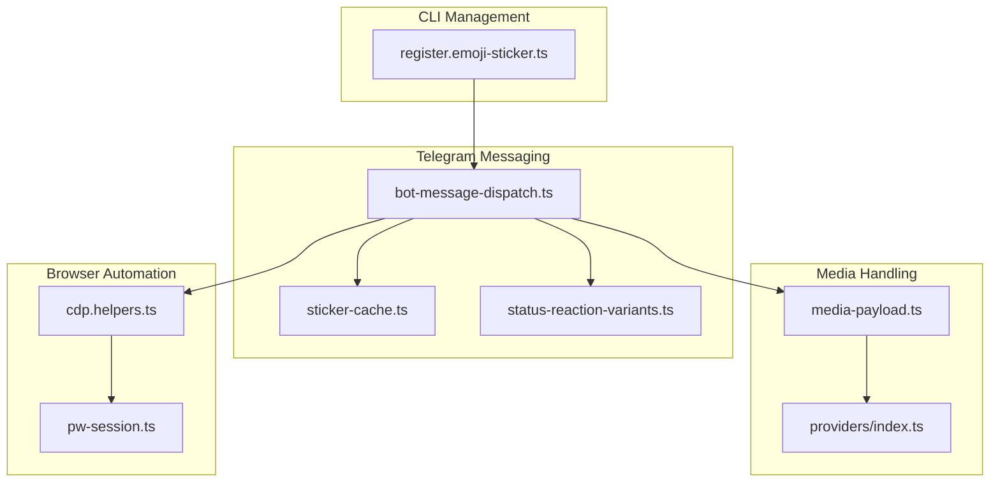
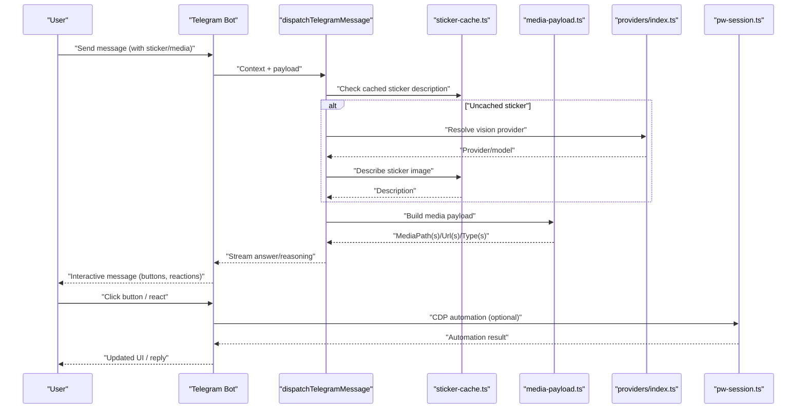
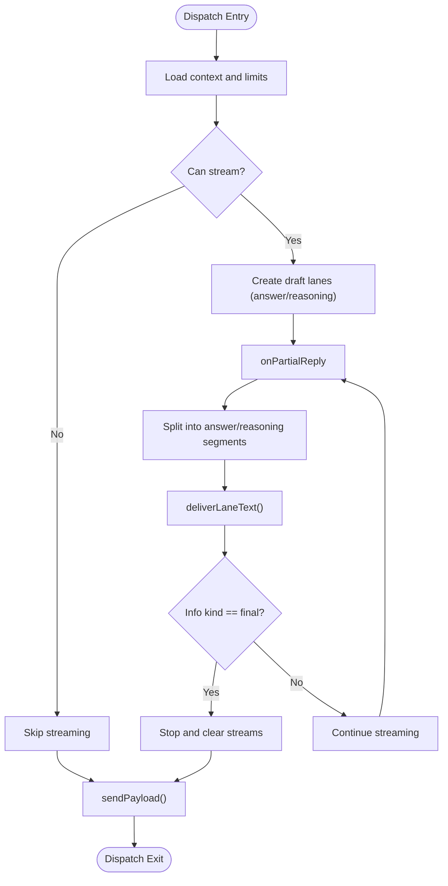
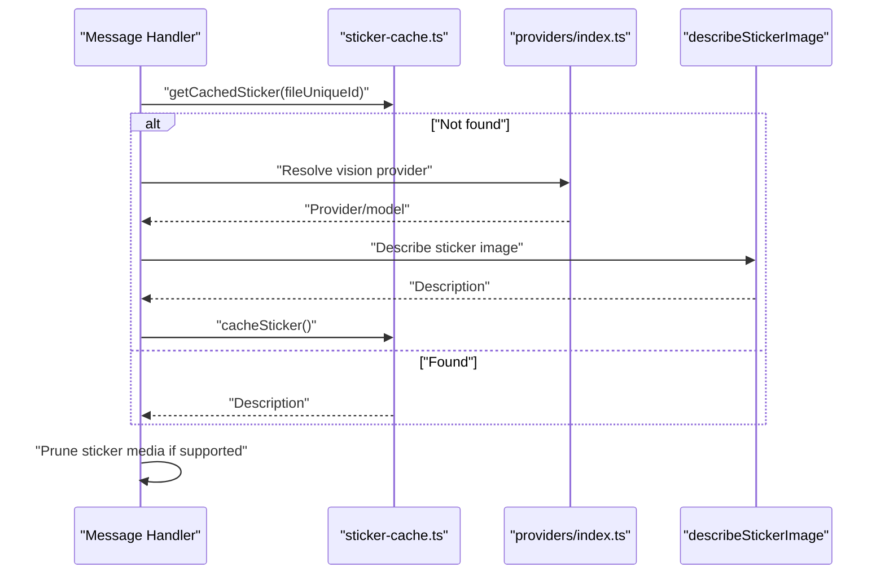
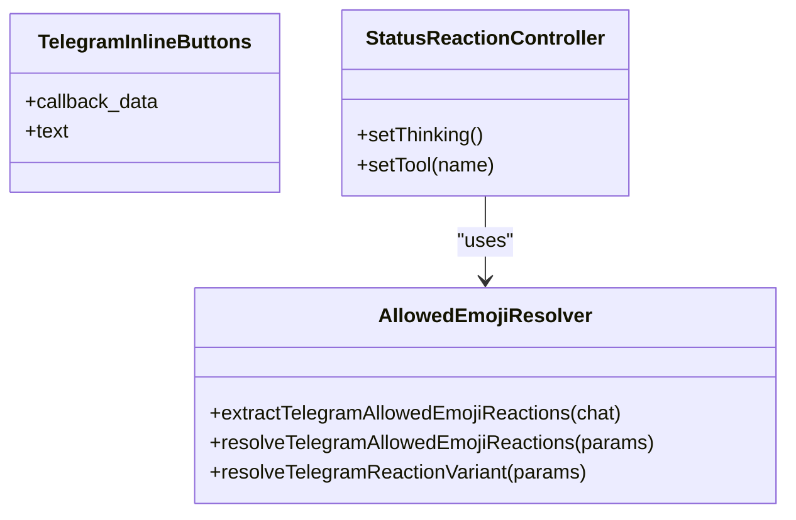
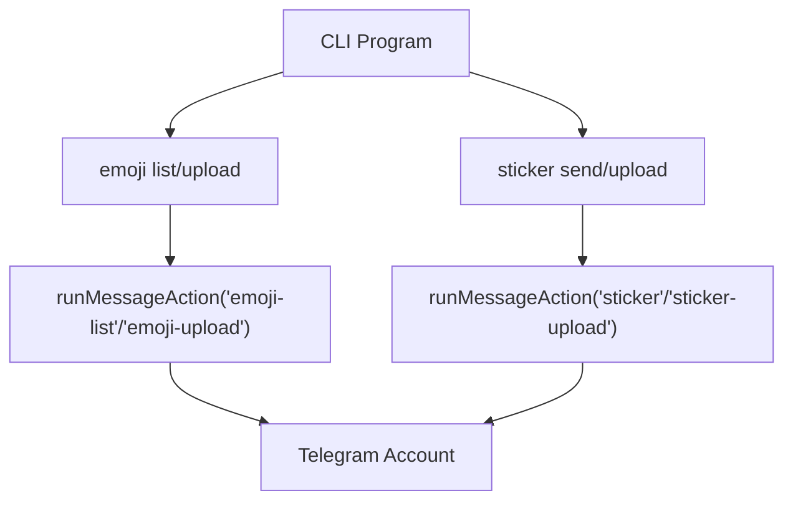
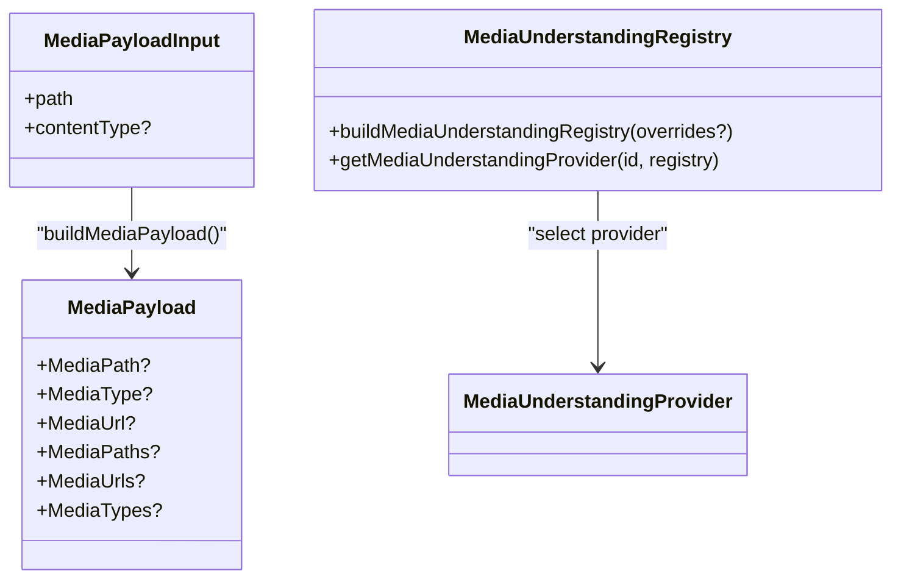
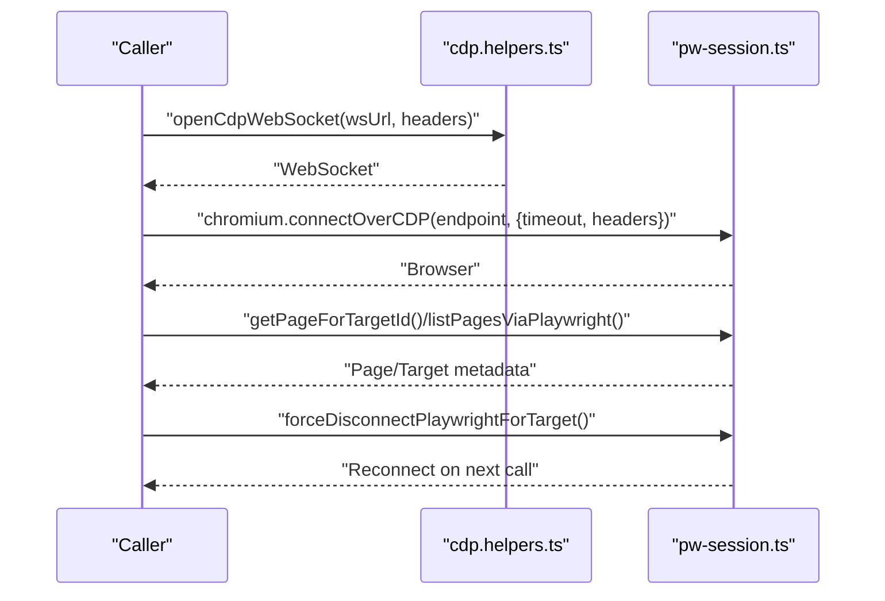
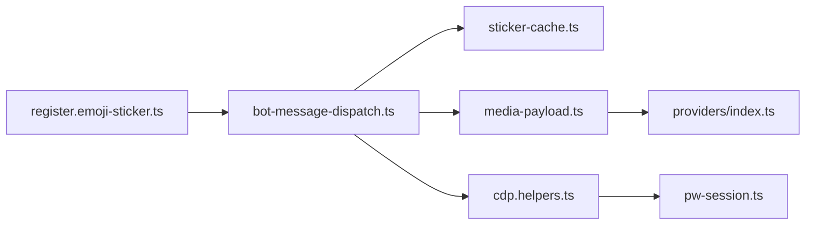

# Advanced Features

<cite>
**Referenced Files in This Document**
- [bot-message-dispatch.ts](file://src/telegram/bot-message-dispatch.ts)
- [sticker-cache.ts](file://src/telegram/sticker-cache.ts)
- [register.emoji-sticker.ts](file://src/cli/program/message/register.emoji-sticker.ts)
- [media-payload.ts](file://src/channels/plugins/media-payload.ts)
- [providers/index.ts](file://src/media-understanding/providers/index.ts)
- [cdp.helpers.ts](file://src/browser/cdp.helpers.ts)
- [pw-session.ts](file://src/browser/pw-session.ts)
- [bot-message-dispatch.sticker-media.test.ts](file://src/telegram/bot-message-dispatch.sticker-media.test.ts)
- [status-reaction-variants.ts](file://src/telegram/status-reaction-variants.ts)
- [channel-send-result.ts](file://src/plugin-sdk/channel-send-result.ts)
- [server-shared.ts](file://src/gateway/server-shared.ts)
</cite>

## Table of Contents
1. [Introduction](#introduction)
2. [Project Structure](#project-structure)
3. [Core Components](#core-components)
4. [Architecture Overview](#architecture-overview)
5. [Detailed Component Analysis](#detailed-component-analysis)
6. [Dependency Analysis](#dependency-analysis)
7. [Performance Considerations](#performance-considerations)
8. [Troubleshooting Guide](#troubleshooting-guide)
9. [Conclusion](#conclusion)

## Introduction
This document explains advanced message tool features across interactive components, stickers and emojis, media handling, and browser automation integration. It covers rich message formatting, custom components, sticker and emoji management, media processing capabilities, and integration with external services. It also documents platform-specific advanced features, performance considerations, and best practices for complex message operations.

## Project Structure
The advanced message features span several subsystems:
- Telegram message dispatch pipeline with streaming, reasoning lanes, and sticker handling
- Sticker caching and vision-based description
- CLI for emoji and sticker management
- Media payload building and media understanding providers
- Browser automation via CDP and Playwright
- Channel send result normalization and gateway deduplication

**Diagram sources**
- [bot-message-dispatch.ts](file://src/telegram/bot-message-dispatch.ts#L137-L800)
- [sticker-cache.ts](file://src/telegram/sticker-cache.ts#L1-L268)
- [status-reaction-variants.ts](file://src/telegram/status-reaction-variants.ts#L175-L226)
- [register.emoji-sticker.ts](file://src/cli/program/message/register.emoji-sticker.ts#L1-L58)
- [media-payload.ts](file://src/channels/plugins/media-payload.ts#L1-L34)
- [providers/index.ts](file://src/media-understanding/providers/index.ts#L1-L64)
- [cdp.helpers.ts](file://src/browser/cdp.helpers.ts#L1-L242)
- [pw-session.ts](file://src/browser/pw-session.ts#L1-L800)

**Section sources**
- [bot-message-dispatch.ts](file://src/telegram/bot-message-dispatch.ts#L1-L841)
- [sticker-cache.ts](file://src/telegram/sticker-cache.ts#L1-L268)
- [register.emoji-sticker.ts](file://src/cli/program/message/register.emoji-sticker.ts#L1-L58)
- [media-payload.ts](file://src/channels/plugins/media-payload.ts#L1-L34)
- [providers/index.ts](file://src/media-understanding/providers/index.ts#L1-L64)
- [cdp.helpers.ts](file://src/browser/cdp.helpers.ts#L1-L242)
- [pw-session.ts](file://src/browser/pw-session.ts#L1-L858)

## Core Components
- Telegram message dispatch with streaming drafts, reasoning lanes, and preview lifecycle management
- Sticker caching and vision-based description for sticker-aware conversations
- Interactive components via inline buttons and status reactions
- Media payload construction and media understanding provider registry
- Browser automation via CDP helpers and Playwright session management
- CLI for emoji and sticker upload/list operations

**Section sources**
- [bot-message-dispatch.ts](file://src/telegram/bot-message-dispatch.ts#L137-L800)
- [sticker-cache.ts](file://src/telegram/sticker-cache.ts#L64-L268)
- [status-reaction-variants.ts](file://src/telegram/status-reaction-variants.ts#L175-L226)
- [media-payload.ts](file://src/channels/plugins/media-payload.ts#L15-L34)
- [providers/index.ts](file://src/media-understanding/providers/index.ts#L34-L64)
- [cdp.helpers.ts](file://src/browser/cdp.helpers.ts#L70-L242)
- [pw-session.ts](file://src/browser/pw-session.ts#L343-L377)
- [register.emoji-sticker.ts](file://src/cli/program/message/register.emoji-sticker.ts#L5-L58)

## Architecture Overview
The advanced message pipeline integrates Telegram dispatch, sticker vision, media understanding, and browser automation. The flow below maps the major components and their interactions.

**Diagram sources**
- [bot-message-dispatch.ts](file://src/telegram/bot-message-dispatch.ts#L385-L434)
- [sticker-cache.ts](file://src/telegram/sticker-cache.ts#L167-L267)
- [media-payload.ts](file://src/channels/plugins/media-payload.ts#L15-L34)
- [providers/index.ts](file://src/media-understanding/providers/index.ts#L34-L64)
- [pw-session.ts](file://src/browser/pw-session.ts#L343-L377)

## Detailed Component Analysis

### Telegram Message Dispatch and Streaming
The Telegram message dispatch orchestrates streaming drafts, reasoning lanes, and preview lifecycle management. It supports:
- Draft streams with minimum initial character thresholds
- Answer and reasoning lanes with segmentation and rotation
- Preview archival and cleanup
- Conditional reasoning suppression and final answer buffering

**Diagram sources**
- [bot-message-dispatch.ts](file://src/telegram/bot-message-dispatch.ts#L137-L785)

**Section sources**
- [bot-message-dispatch.ts](file://src/telegram/bot-message-dispatch.ts#L137-L785)

### Sticker Handling and Vision Description
Stickers can be cached and described using vision providers. The system:
- Detects sticker context and prunes sticker media when vision is supported
- Describes sticker images and caches descriptions for reuse
- Supports fuzzy search over cached stickers

**Diagram sources**
- [sticker-cache.ts](file://src/telegram/sticker-cache.ts#L56-L123)
- [sticker-cache.ts](file://src/telegram/sticker-cache.ts#L167-L267)
- [providers/index.ts](file://src/media-understanding/providers/index.ts#L34-L64)
- [bot-message-dispatch.ts](file://src/telegram/bot-message-dispatch.ts#L385-L434)

**Section sources**
- [sticker-cache.ts](file://src/telegram/sticker-cache.ts#L56-L123)
- [sticker-cache.ts](file://src/telegram/sticker-cache.ts#L167-L267)
- [bot-message-dispatch.ts](file://src/telegram/bot-message-dispatch.ts#L385-L434)
- [bot-message-dispatch.sticker-media.test.ts](file://src/telegram/bot-message-dispatch.sticker-media.test.ts#L22-L36)

### Interactive Components: Buttons and Reactions
The system supports interactive components:
- Inline buttons via Telegram inline keyboard props
- Status reactions with emoji variant resolution and allowed-emoji lookup

**Diagram sources**
- [bot-message-dispatch.ts](file://src/telegram/bot-message-dispatch.ts#L553-L555)
- [status-reaction-variants.ts](file://src/telegram/status-reaction-variants.ts#L192-L226)

**Section sources**
- [bot-message-dispatch.ts](file://src/telegram/bot-message-dispatch.ts#L553-L555)
- [status-reaction-variants.ts](file://src/telegram/status-reaction-variants.ts#L175-L226)

### Emoji and Sticker Management CLI
The CLI provides commands to manage emojis and stickers:
- List emojis and upload emojis (Discord guild-scoped)
- Send stickers and upload stickers (Discord guild-scoped)

**Diagram sources**
- [register.emoji-sticker.ts](file://src/cli/program/message/register.emoji-sticker.ts#L5-L58)

**Section sources**
- [register.emoji-sticker.ts](file://src/cli/program/message/register.emoji-sticker.ts#L5-L58)

### Media Payload Construction and Provider Registry
Media payloads unify single or multiple media inputs into a standardized shape. The media understanding provider registry enables dynamic provider selection and capability merging.

**Diagram sources**
- [media-payload.ts](file://src/channels/plugins/media-payload.ts#L1-L34)
- [providers/index.ts](file://src/media-understanding/providers/index.ts#L34-L64)

**Section sources**
- [media-payload.ts](file://src/channels/plugins/media-payload.ts#L15-L34)
- [providers/index.ts](file://src/media-understanding/providers/index.ts#L34-L64)

### Browser Automation Integration
Browser automation integrates via CDP helpers and Playwright sessions:
- CDP helpers normalize endpoints, attach auth headers, and wrap WebSocket communication
- Playwright session connects over CDP, manages pages, and provides safe termination/cancellation

**Diagram sources**
- [cdp.helpers.ts](file://src/browser/cdp.helpers.ts#L191-L242)
- [pw-session.ts](file://src/browser/pw-session.ts#L343-L377)
- [pw-session.ts](file://src/browser/pw-session.ts#L505-L529)
- [pw-session.ts](file://src/browser/pw-session.ts#L695-L724)

**Section sources**
- [cdp.helpers.ts](file://src/browser/cdp.helpers.ts#L70-L242)
- [pw-session.ts](file://src/browser/pw-session.ts#L343-L377)
- [pw-session.ts](file://src/browser/pw-session.ts#L505-L529)
- [pw-session.ts](file://src/browser/pw-session.ts#L695-L724)

## Dependency Analysis
The advanced features rely on cohesive internal dependencies:
- Telegram dispatch depends on sticker cache, media payload builder, and media understanding providers
- CLI actions feed into Telegram dispatch and sticker/emoji management
- Browser automation underpins external service integrations

**Diagram sources**
- [register.emoji-sticker.ts](file://src/cli/program/message/register.emoji-sticker.ts#L5-L58)
- [bot-message-dispatch.ts](file://src/telegram/bot-message-dispatch.ts#L137-L800)
- [sticker-cache.ts](file://src/telegram/sticker-cache.ts#L1-L268)
- [media-payload.ts](file://src/channels/plugins/media-payload.ts#L1-L34)
- [providers/index.ts](file://src/media-understanding/providers/index.ts#L1-L64)
- [cdp.helpers.ts](file://src/browser/cdp.helpers.ts#L1-L242)
- [pw-session.ts](file://src/browser/pw-session.ts#L1-L858)

**Section sources**
- [bot-message-dispatch.ts](file://src/telegram/bot-message-dispatch.ts#L137-L800)
- [sticker-cache.ts](file://src/telegram/sticker-cache.ts#L1-L268)
- [media-payload.ts](file://src/channels/plugins/media-payload.ts#L1-L34)
- [providers/index.ts](file://src/media-understanding/providers/index.ts#L1-L64)
- [cdp.helpers.ts](file://src/browser/cdp.helpers.ts#L1-L242)
- [pw-session.ts](file://src/browser/pw-session.ts#L1-L858)
- [register.emoji-sticker.ts](file://src/cli/program/message/register.emoji-sticker.ts#L5-L58)

## Performance Considerations
- Streaming and preview lifecycle: Draft lanes minimize duplicate previews and optimize finalization timing
- Sticker caching: Reduces repeated vision calls and improves response latency
- Media payload cardinality: Optional preservation of media type arrays balances fidelity vs. simplicity
- Browser automation retries and timeouts: Robust connection handling prevents cascading failures
- Gateway deduplication: Prevents redundant processing of identical requests

[No sources needed since this section provides general guidance]

## Troubleshooting Guide
Common issues and remedies:
- Sticker vision provider unavailable: The system gracefully falls back to text-only context
- Sticker media pruning: When vision is unsupported, sticker media is removed while preserving reply media
- Channel send failures: Normalized send results surface errors and message IDs for diagnostics
- Gateway deduplication: Dedupe entries capture outcomes and errors for observability

**Section sources**
- [sticker-cache.ts](file://src/telegram/sticker-cache.ts#L238-L241)
- [bot-message-dispatch.ts](file://src/telegram/bot-message-dispatch.ts#L412-L416)
- [channel-send-result.ts](file://src/plugin-sdk/channel-send-result.ts#L1-L14)
- [server-shared.ts](file://src/gateway/server-shared.ts#L3-L8)

## Conclusion
The advanced message toolset combines streaming Telegram dispatch, sticker vision and caching, interactive components, robust media handling, and browser automation. These features enable rich, responsive, and extensible messaging experiences across platforms, with strong performance characteristics and operational safety nets.