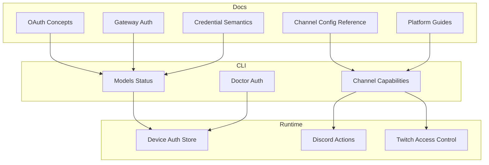
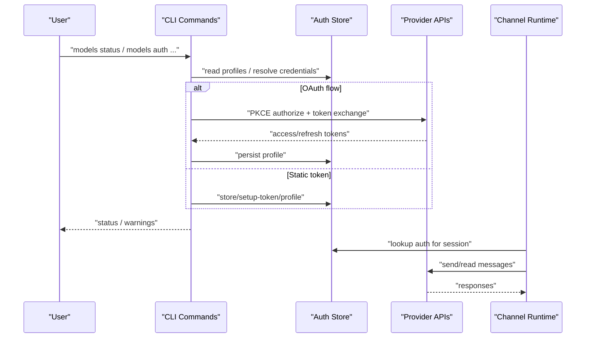
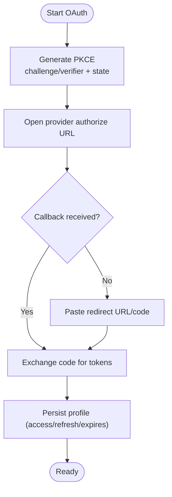
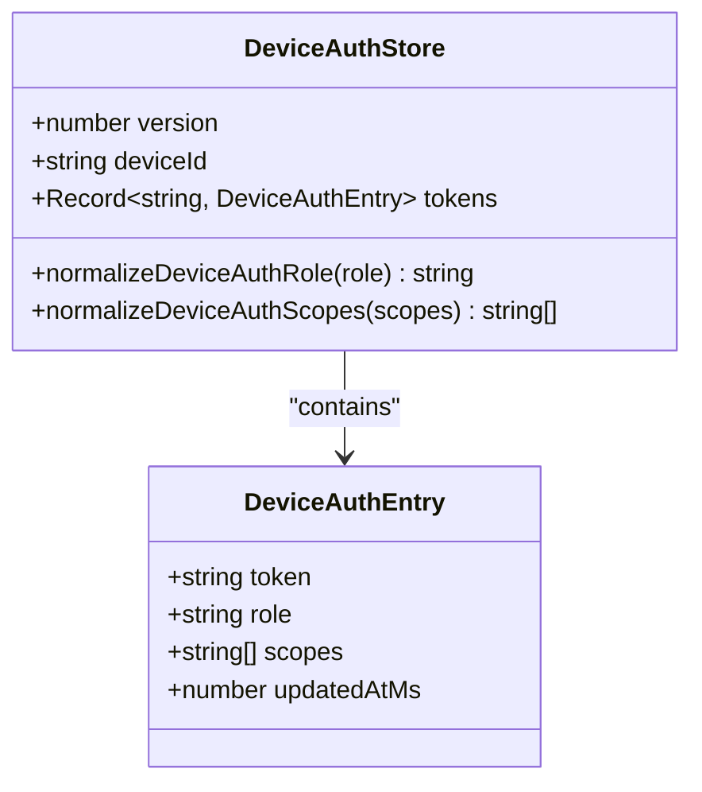
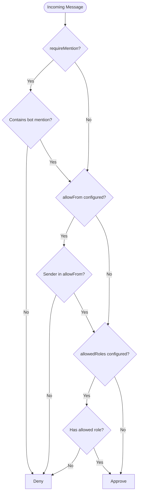
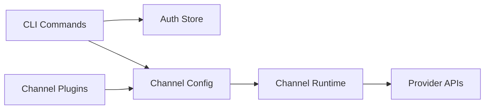

# Authentication & Permissions

<cite>
**Referenced Files in This Document**
- [docs/concepts/oauth.md](file://docs/concepts/oauth.md)
- [docs/gateway/authentication.md](file://docs/gateway/authentication.md)
- [docs/auth-credential-semantics.md](file://docs/auth-credential-semantics.md)
- [docs/gateway/configuration-reference.md](file://docs/gateway/configuration-reference.md)
- [docs/channels/discord.md](file://docs/channels/discord.md)
- [src/shared/device-auth.ts](file://src/shared/device-auth.ts)
- [src/commands/doctor-auth.ts](file://src/commands/doctor-auth.ts)
- [src/commands/models/list.status-command.ts](file://src/commands/models/list.status-command.ts)
- [src/agents/tools/discord-actions-messaging.ts](file://src/agents/tools/discord-actions-messaging.ts)
- [src/commands/channels/capabilities.ts](file://src/commands/channels/capabilities.ts)
- [src/discord/monitor.test.ts](file://src/discord/monitor.test.ts)
- [extensions/twitch/src/access-control.ts](file://extensions/twitch/src/access-control.ts)
- [docs/platforms/index.md](file://docs/platforms/index.md)
- [docs/platforms/android.md](file://docs/platforms/android.md)
- [docs/platforms/ios.md](file://docs/platforms/ios.md)
- [docs/security/README.md](file://docs/security/README.md)
- [extensions/discord/openclaw.plugin.json](file://extensions/discord/openclaw.plugin.json)
- [extensions/telegram/openclaw.plugin.json](file://extensions/telegram/openclaw.plugin.json)
- [extensions/slack/openclaw.plugin.json](file://extensions/slack/openclaw.plugin.json)
- [extensions/feishu/openclaw.plugin.json](file://extensions/feishu/openclaw.plugin.json)
</cite>

## Table of Contents
1. [Introduction](#introduction)
2. [Project Structure](#project-structure)
3. [Core Components](#core-components)
4. [Architecture Overview](#architecture-overview)
5. [Detailed Component Analysis](#detailed-component-analysis)
6. [Dependency Analysis](#dependency-analysis)
7. [Performance Considerations](#performance-considerations)
8. [Troubleshooting Guide](#troubleshooting-guide)
9. [Conclusion](#conclusion)
10. [Appendices](#appendices)

## Introduction
This document explains the authentication and permission system for the message tool across all supported platforms. It covers token management, OAuth flows, bot permissions, role-based access controls, platform-specific authentication methods, required permission scopes, and security considerations. It also includes configuration examples per platform and a troubleshooting guide for common authentication issues.

## Project Structure
Authentication and permissions span several layers:
- Conceptual and operational docs define OAuth, credential semantics, and platform setup.
- CLI commands orchestrate authentication checks, status, and remediation.
- Channel-specific implementations enforce allowlists, mentions, and role-based routing.
- Platform runtimes (macOS, iOS, Android) govern device pairing and secure connections.

**Diagram sources**
- [docs/concepts/oauth.md](file://docs/concepts/oauth.md#L1-L159)
- [docs/gateway/authentication.md](file://docs/gateway/authentication.md#L1-L180)
- [docs/auth-credential-semantics.md](file://docs/auth-credential-semantics.md#L1-L46)
- [docs/gateway/configuration-reference.md](file://docs/gateway/configuration-reference.md#L1-L800)
- [docs/platforms/index.md](file://docs/platforms/index.md#L1-L54)
- [src/commands/models/list.status-command.ts](file://src/commands/models/list.status-command.ts#L259-L278)
- [src/commands/doctor-auth.ts](file://src/commands/doctor-auth.ts#L286-L309)
- [src/commands/channels/capabilities.ts](file://src/commands/channels/capabilities.ts#L281-L329)
- [src/shared/device-auth.ts](file://src/shared/device-auth.ts#L1-L30)
- [src/agents/tools/discord-actions-messaging.ts](file://src/agents/tools/discord-actions-messaging.ts#L180-L189)
- [extensions/twitch/src/access-control.ts](file://extensions/twitch/src/access-control.ts#L41-L98)

**Section sources**
- [docs/concepts/oauth.md](file://docs/concepts/oauth.md#L1-L159)
- [docs/gateway/authentication.md](file://docs/gateway/authentication.md#L1-L180)
- [docs/auth-credential-semantics.md](file://docs/auth-credential-semantics.md#L1-L46)
- [docs/gateway/configuration-reference.md](file://docs/gateway/configuration-reference.md#L1-L800)
- [docs/platforms/index.md](file://docs/platforms/index.md#L1-L54)

## Core Components
- OAuth and token exchange: PKCE-based flows for supported providers; token sink storage; profile routing.
- Static credentials and secret refs: API keys, setup-token, and SecretRef-based auth.
- Device authentication store: per-agent token storage with roles and scopes normalization.
- Channel allowlists, mentions, and role-based routing: per-platform gating and routing.
- Platform pairing and secure transport: device pairing and discovery for companion nodes.

**Section sources**
- [docs/concepts/oauth.md](file://docs/concepts/oauth.md#L17-L159)
- [docs/gateway/authentication.md](file://docs/gateway/authentication.md#L11-L180)
- [src/shared/device-auth.ts](file://src/shared/device-auth.ts#L1-L30)
- [docs/gateway/configuration-reference.md](file://docs/gateway/configuration-reference.md#L22-L38)
- [docs/platforms/android.md](file://docs/platforms/android.md#L24-L100)
- [docs/platforms/ios.md](file://docs/platforms/ios.md#L20-L50)

## Architecture Overview
The authentication system integrates CLI-driven credential management with runtime enforcement across channels and platforms.

**Diagram sources**
- [docs/concepts/oauth.md](file://docs/concepts/oauth.md#L83-L122)
- [docs/gateway/authentication.md](file://docs/gateway/authentication.md#L116-L122)
- [src/commands/models/list.status-command.ts](file://src/commands/models/list.status-command.ts#L259-L278)
- [src/commands/doctor-auth.ts](file://src/commands/doctor-auth.ts#L286-L309)

## Detailed Component Analysis

### OAuth and Token Management
- Token exchange: PKCE for supported providers; callback handling and refresh flows; token sink to avoid mutual invalidation.
- Storage: per-agent auth-profiles.json; legacy compatibility; secrets management integration.
- Profiles and routing: multiple profiles per provider; per-session overrides; global ordering.

**Diagram sources**
- [docs/concepts/oauth.md](file://docs/concepts/oauth.md#L101-L111)

**Section sources**
- [docs/concepts/oauth.md](file://docs/concepts/oauth.md#L28-L122)
- [docs/gateway/authentication.md](file://docs/gateway/authentication.md#L116-L122)
- [docs/auth-credential-semantics.md](file://docs/auth-credential-semantics.md#L20-L38)

### Static Credentials and SecretRefs
- API keys and setup-token flows are supported for long-running gateways.
- SecretRef-based auth is integrated with credential resolution and probing.
- Rotation behavior and precedence for multi-key providers.

**Section sources**
- [docs/gateway/authentication.md](file://docs/gateway/authentication.md#L21-L56)
- [docs/auth-credential-semantics.md](file://docs/auth-credential-semantics.md#L12-L46)

### Device Authentication Store
- Per-agent token storage with normalized roles and scopes.
- Used by CLI and runtime to enforce access and permissions.

**Diagram sources**
- [src/shared/device-auth.ts](file://src/shared/device-auth.ts#L1-L30)

**Section sources**
- [src/shared/device-auth.ts](file://src/shared/device-auth.ts#L1-L30)

### Channel Allowlists, Mentions, and Role-Based Routing
- Allowlists and mention gating: require @mentions; allow-from lists; role-based routing.
- Discord permissions auditing and baseline scopes.
- Twitch role-based access control logic.

**Diagram sources**
- [extensions/twitch/src/access-control.ts](file://extensions/twitch/src/access-control.ts#L41-L98)

**Section sources**
- [docs/gateway/configuration-reference.md](file://docs/gateway/configuration-reference.md#L655-L677)
- [docs/channels/discord.md](file://docs/channels/discord.md#L509-L525)
- [src/commands/channels/capabilities.ts](file://src/commands/channels/capabilities.ts#L281-L329)
- [src/discord/monitor.test.ts](file://src/discord/monitor.test.ts#L735-L788)

### Platform-Specific Authentication Methods
- Discord: bot token, privileged intents, baseline permissions, role-based routing.
- Telegram: bot token, group policies, mention gating, actions.
- Slack: socket mode and HTTP modes, slash commands, reactions, pins, member info.
- Google Chat: service account, webhook audience, DM/group policies.
- Microsoft Teams: extension-backed configuration.
- IRC: nickserv registration and policies.
- iMessage: local RPC over stdio; no daemon required.
- Signal: account binding, pairing, reaction notifications.
- BlueBubbles: extension-backed iMessage path.

**Section sources**
- [docs/channels/discord.md](file://docs/channels/discord.md#L488-L529)
- [docs/gateway/configuration-reference.md](file://docs/gateway/configuration-reference.md#L214-L326)
- [docs/gateway/configuration-reference.md](file://docs/gateway/configuration-reference.md#L364-L432)
- [docs/gateway/configuration-reference.md](file://docs/gateway/configuration-reference.md#L329-L362)
- [docs/gateway/configuration-reference.md](file://docs/gateway/configuration-reference.md#L572-L591)
- [docs/gateway/configuration-reference.md](file://docs/gateway/configuration-reference.md#L592-L617)
- [docs/gateway/configuration-reference.md](file://docs/gateway/configuration-reference.md#L528-L562)
- [docs/gateway/configuration-reference.md](file://docs/gateway/configuration-reference.md#L482-L506)
- [docs/gateway/configuration-reference.md](file://docs/gateway/configuration-reference.md#L507-L527)

### Permission Scopes Required for Different Message Operations
- Discord: bot and applications.commands scopes; baseline permissions include view channels, send messages, embed links, attach files, read message history.
- Slack: bot token and app token for socket mode; HTTP mode requires signing secret; actions include reactions, messages, pins, member info, emoji list.
- Telegram: bot token; actions include reactions, sending messages.
- Google Chat: service account credentials; webhook audience configuration.
- Microsoft Teams: extension-backed; credentials and webhook configuration.
- IRC: channel join and messaging; optional nickserv registration.

**Section sources**
- [docs/channels/discord.md](file://docs/channels/discord.md#L509-L525)
- [docs/gateway/configuration-reference.md](file://docs/gateway/configuration-reference.md#L420-L427)
- [docs/gateway/configuration-reference.md](file://docs/gateway/configuration-reference.md#L419-L421)
- [docs/gateway/configuration-reference.md](file://docs/gateway/configuration-reference.md#L330-L362)
- [docs/gateway/configuration-reference.md](file://docs/gateway/configuration-reference.md#L572-L591)
- [docs/gateway/configuration-reference.md](file://docs/gateway/configuration-reference.md#L592-L617)

### Role-Based Access Controls
- Discord role-based agent routing via bindings.
- Twitch role-based access control enforcing allowed roles and allowlists.
- General mention gating and allowlists for group chats.

**Section sources**
- [docs/channels/discord.md](file://docs/channels/discord.md#L462-L486)
- [extensions/twitch/src/access-control.ts](file://extensions/twitch/src/access-control.ts#L76-L98)
- [docs/gateway/configuration-reference.md](file://docs/gateway/configuration-reference.md#L655-L677)

### Platform Pairing and Secure Transport
- Android/iOS companion nodes pair with the Gateway over WebSocket; discovery via mDNS/Bonjour or Tailscale; foreground service persistence.
- Gateway service installation and management differ by OS.

**Section sources**
- [docs/platforms/android.md](file://docs/platforms/android.md#L24-L100)
- [docs/platforms/ios.md](file://docs/platforms/ios.md#L20-L50)
- [docs/platforms/index.md](file://docs/platforms/index.md#L41-L54)

## Dependency Analysis
Authentication and permissions depend on:
- CLI commands for credential management and status checks.
- Channel configuration for allowlists, mentions, and actions.
- Provider-specific plugins and configuration schemas.

**Diagram sources**
- [src/commands/models/list.status-command.ts](file://src/commands/models/list.status-command.ts#L259-L278)
- [src/commands/doctor-auth.ts](file://src/commands/doctor-auth.ts#L286-L309)
- [docs/gateway/configuration-reference.md](file://docs/gateway/configuration-reference.md#L1-L800)
- [extensions/discord/openclaw.plugin.json](file://extensions/discord/openclaw.plugin.json#L1-L10)
- [extensions/telegram/openclaw.plugin.json](file://extensions/telegram/openclaw.plugin.json#L1-L10)
- [extensions/slack/openclaw.plugin.json](file://extensions/slack/openclaw.plugin.json#L1-L10)
- [extensions/feishu/openclaw.plugin.json](file://extensions/feishu/openclaw.plugin.json#L1-L11)

**Section sources**
- [src/commands/models/list.status-command.ts](file://src/commands/models/list.status-command.ts#L259-L278)
- [src/commands/doctor-auth.ts](file://src/commands/doctor-auth.ts#L286-L309)
- [docs/gateway/configuration-reference.md](file://docs/gateway/configuration-reference.md#L1-L800)

## Performance Considerations
- Automatic refresh under file locks reduces manual intervention.
- Credential resolution and probing align selection-time and runtime behavior.
- Rotation behavior retries with alternative keys only for rate-limit errors.

[No sources needed since this section provides general guidance]

## Troubleshooting Guide
Common issues and resolutions:
- No credentials found: run provider-specific setup (for example, setup-token for Anthropic) and re-check status.
- Token expiring/expired: confirm which profile is expiring and refresh or paste a new token.
- Missing bot token for Discord permission audit: ensure token is configured and passed to the capability checker.
- Role-based access denied: verify allowed roles and allowlists; ensure mention gating conditions are met.

**Section sources**
- [docs/gateway/authentication.md](file://docs/gateway/authentication.md#L160-L180)
- [src/commands/channels/capabilities.ts](file://src/commands/channels/capabilities.ts#L281-L329)
- [extensions/twitch/src/access-control.ts](file://extensions/twitch/src/access-control.ts#L41-L98)

## Conclusion
OpenClaw’s authentication and permission system combines robust OAuth flows, static credentials, and per-channel access controls. It supports role-based routing, mention gating, and platform-specific scopes while maintaining secure, auditable, and operable configurations across macOS, iOS, Android, and numerous messaging platforms.

[No sources needed since this section summarizes without analyzing specific files]

## Appendices

### Configuration Examples by Platform
- Discord
  - Token and actions: configure bot token and action groups; optionally enable permissions and messages actions.
  - Baseline permissions and OAuth scopes are documented in the Discord channel guide.
- Telegram
  - Bot token and group policies; mention gating and actions.
- Slack
  - Socket mode requires bot and app tokens; HTTP mode requires signing secret; actions include reactions, messages, pins, member info, emoji list.
- Google Chat
  - Service account credentials and webhook audience configuration.
- Microsoft Teams
  - Extension-backed; credentials and webhook configuration.
- IRC
  - Channel join and messaging; optional nickserv registration.

**Section sources**
- [docs/gateway/configuration-reference.md](file://docs/gateway/configuration-reference.md#L214-L326)
- [docs/gateway/configuration-reference.md](file://docs/gateway/configuration-reference.md#L364-L432)
- [docs/gateway/configuration-reference.md](file://docs/gateway/configuration-reference.md#L329-L362)
- [docs/gateway/configuration-reference.md](file://docs/gateway/configuration-reference.md#L572-L591)
- [docs/gateway/configuration-reference.md](file://docs/gateway/configuration-reference.md#L592-L617)
- [docs/channels/discord.md](file://docs/channels/discord.md#L509-L525)

### Security Considerations
- Use API keys for long-running gateways when feasible.
- Treat setup-token auth as a user-choice risk for providers that restrict it.
- Audit channel permissions and enforce allowlists and mention gating.
- Keep tokens refreshed and monitor expiration.

**Section sources**
- [docs/gateway/authentication.md](file://docs/gateway/authentication.md#L11-L27)
- [docs/concepts/oauth.md](file://docs/concepts/oauth.md#L57-L92)
- [docs/security/README.md](file://docs/security/README.md#L1-L18)