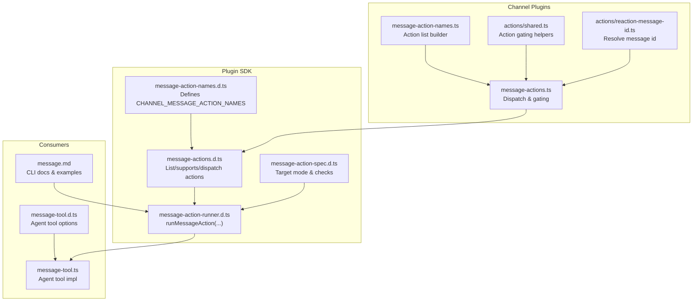
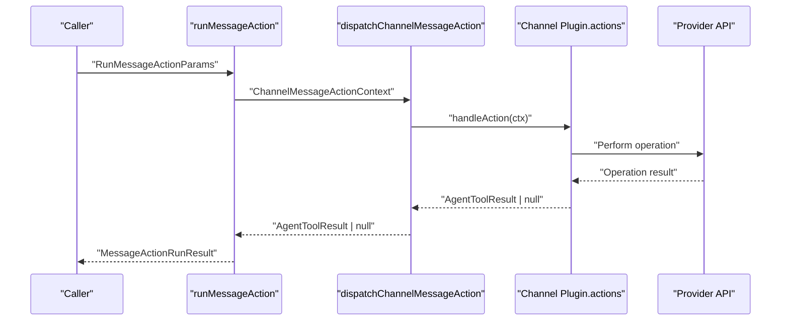
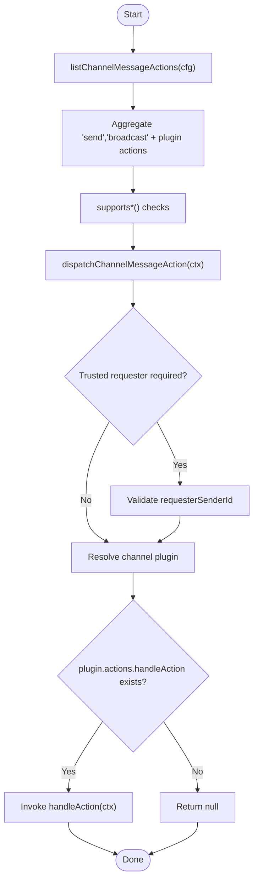
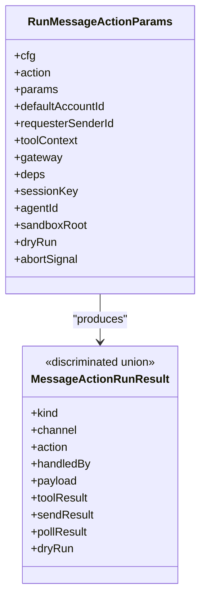
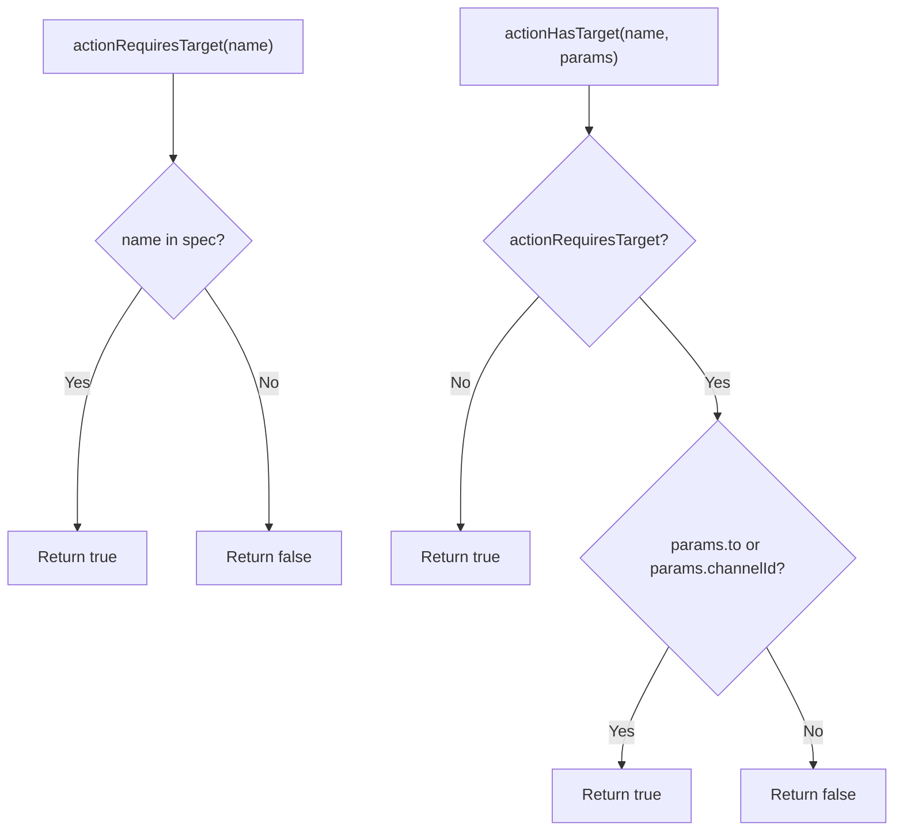
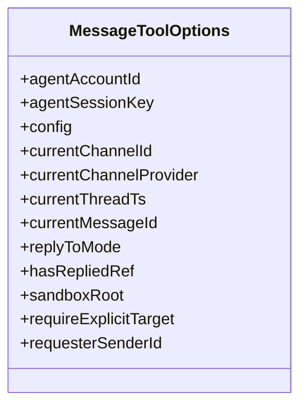
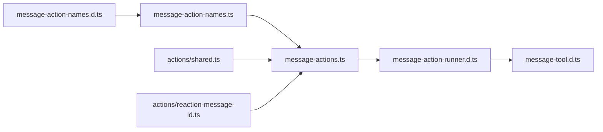

# Message Actions

<cite>
**Referenced Files in This Document**
- [message-actions.d.ts](file://dist/plugin-sdk/channels/plugins/message-actions.d.ts)
- [message-action-names.d.ts](file://dist/plugin-sdk/channels/plugins/message-action-names.d.ts)
- [message-action-runner.d.ts](file://dist/plugin-sdk/infra/outbound/message-action-runner.d.ts)
- [message-action-spec.d.ts](file://dist/plugin-sdk/infra/outbound/message-action-spec.d.ts)
- [message-actions.ts](file://src/channels/plugins/message-actions.ts)
- [message-action-names.ts](file://src/channels/plugins/message-action-names.ts)
- [shared.ts](file://src/channels/plugins/actions/shared.ts)
- [reaction-message-id.ts](file://src/channels/plugins/actions/reaction-message-id.ts)
- [message-tool.d.ts](file://dist/plugin-sdk/agents/tools/message-tool.d.ts)
- [message-tool.ts](file://src/agents/tools/message-tool.ts)
- [message.md](file://docs/cli/message.md)
</cite>

## Table of Contents
1. [Introduction](#introduction)
2. [Project Structure](#project-structure)
3. [Core Components](#core-components)
4. [Architecture Overview](#architecture-overview)
5. [Detailed Component Analysis](#detailed-component-analysis)
6. [Dependency Analysis](#dependency-analysis)
7. [Performance Considerations](#performance-considerations)
8. [Troubleshooting Guide](#troubleshooting-guide)
9. [Conclusion](#conclusion)
10. [Appendices](#appendices)

## Introduction
This document describes the unified message actions framework in the OpenClaw message tool. It covers supported operations (send, edit, delete, react, reactions, read, pin, unpin, list-pins, search, and thread operations), the shared interface across platforms, parameter specifications, return values, error handling, and platform-specific variations in formatting, attachments, and rich content. Practical examples show how to perform each action programmatically and via the CLI.

## Project Structure
The message actions system is implemented across three layers:
- Plugin SDK types and runner: define the canonical action names, dispatching, and execution contract.
- Channel plugin integration: aggregates per-channel capabilities and action handlers.
- CLI and agent tool: expose actions to users and agents with consistent UX.

**Diagram sources**
- [message-action-names.d.ts](file://dist/plugin-sdk/channels/plugins/message-action-names.d.ts#L1-L3)
- [message-actions.d.ts](file://dist/plugin-sdk/channels/plugins/message-actions.d.ts#L1-L16)
- [message-action-runner.d.ts](file://dist/plugin-sdk/infra/outbound/message-action-runner.d.ts#L1-L76)
- [message-action-spec.d.ts](file://dist/plugin-sdk/infra/outbound/message-action-spec.d.ts#L1-L6)
- [message-action-names.ts](file://src/channels/plugins/message-action-names.ts#L1-L58)
- [message-actions.ts](file://src/channels/plugins/message-actions.ts#L1-L104)
- [shared.ts](file://src/channels/plugins/actions/shared.ts#L1-L20)
- [reaction-message-id.ts](file://src/channels/plugins/actions/reaction-message-id.ts#L1-L13)
- [message-tool.d.ts](file://dist/plugin-sdk/agents/tools/message-tool.d.ts#L1-L21)
- [message-tool.ts](file://src/agents/tools/message-tool.ts#L1-L200)
- [message.md](file://docs/cli/message.md#L1-L261)

**Section sources**
- [message-actions.d.ts](file://dist/plugin-sdk/channels/plugins/message-actions.d.ts#L1-L16)
- [message-action-names.d.ts](file://dist/plugin-sdk/channels/plugins/message-action-names.d.ts#L1-L3)
- [message-action-runner.d.ts](file://dist/plugin-sdk/infra/outbound/message-action-runner.d.ts#L1-L76)
- [message-action-spec.d.ts](file://dist/plugin-sdk/infra/outbound/message-action-spec.d.ts#L1-L6)
- [message-actions.ts](file://src/channels/plugins/message-actions.ts#L1-L104)
- [message-action-names.ts](file://src/channels/plugins/message-action-names.ts#L1-L58)
- [shared.ts](file://src/channels/plugins/actions/shared.ts#L1-L20)
- [reaction-message-id.ts](file://src/channels/plugins/actions/reaction-message-id.ts#L1-L13)
- [message-tool.d.ts](file://dist/plugin-sdk/agents/tools/message-tool.d.ts#L1-L21)
- [message-tool.ts](file://src/agents/tools/message-tool.ts#L1-L200)
- [message.md](file://docs/cli/message.md#L1-L261)

## Core Components
- Canonical action names: a frozen set of action identifiers shared across the system.
- Action dispatcher: resolves the appropriate channel plugin and invokes its handler.
- Runner: executes actions with standardized parameters and returns structured results.
- Target mode spec: defines whether an action targets a user/channel or none.
- Agent tool: exposes a unified API surface for agents to trigger actions.
- CLI docs: enumerate supported actions, parameters, and examples per platform.

Key responsibilities:
- Action enumeration and validation
- Per-channel capability detection
- Requester identity gating for sensitive actions
- Structured results for send, broadcast, poll, and generic actions

**Section sources**
- [message-action-names.d.ts](file://dist/plugin-sdk/channels/plugins/message-action-names.d.ts#L1-L3)
- [message-actions.ts](file://src/channels/plugins/message-actions.ts#L19-L31)
- [message-actions.ts](file://src/channels/plugins/message-actions.ts#L87-L103)
- [message-action-runner.d.ts](file://dist/plugin-sdk/infra/outbound/message-action-runner.d.ts#L15-L29)
- [message-action-runner.d.ts](file://dist/plugin-sdk/infra/outbound/message-action-runner.d.ts#L30-L73)
- [message-action-spec.d.ts](file://dist/plugin-sdk/infra/outbound/message-action-spec.d.ts#L2-L6)
- [message-tool.d.ts](file://dist/plugin-sdk/agents/tools/message-tool.d.ts#L3-L18)

## Architecture Overview
The message actions architecture centers on a single entry point that routes actions to channel-specific implementations while preserving a uniform interface for callers.

**Diagram sources**
- [message-action-runner.d.ts](file://dist/plugin-sdk/infra/outbound/message-action-runner.d.ts#L75-L76)
- [message-actions.d.ts](file://dist/plugin-sdk/channels/plugins/message-actions.d.ts#L15-L16)
- [message-actions.ts](file://src/channels/plugins/message-actions.ts#L87-L103)

## Detailed Component Analysis

### Unified Action Names and Dispatch
- Canonical names: a fixed list of action identifiers ensures consistent behavior across channels.
- Listing actions: aggregates built-in actions plus plugin-defined actions.
- Capability checks: optional support flags for buttons/cards per channel.
- Dispatch: validates requester identity for sensitive actions and delegates to the channel plugin.

**Diagram sources**
- [message-action-names.ts](file://src/channels/plugins/message-action-names.ts#L1-L58)
- [message-actions.ts](file://src/channels/plugins/message-actions.ts#L19-L31)
- [message-actions.ts](file://src/channels/plugins/message-actions.ts#L33-L85)
- [message-actions.ts](file://src/channels/plugins/message-actions.ts#L87-L103)

**Section sources**
- [message-action-names.d.ts](file://dist/plugin-sdk/channels/plugins/message-action-names.d.ts#L1-L3)
- [message-action-names.ts](file://src/channels/plugins/message-action-names.ts#L1-L58)
- [message-actions.ts](file://src/channels/plugins/message-actions.ts#L6-L17)
- [message-actions.ts](file://src/channels/plugins/message-actions.ts#L87-L103)

### Runner Contract and Results
- Inputs: configuration, action name, parameters, requester identity, tool context, gateway options, and flags (dry-run, abort).
- Outputs: discriminated union describing the kind of action performed and the resulting payload/tool result.

**Diagram sources**
- [message-action-runner.d.ts](file://dist/plugin-sdk/infra/outbound/message-action-runner.d.ts#L15-L29)
- [message-action-runner.d.ts](file://dist/plugin-sdk/infra/outbound/message-action-runner.d.ts#L30-L73)

**Section sources**
- [message-action-runner.d.ts](file://dist/plugin-sdk/infra/outbound/message-action-runner.d.ts#L15-L29)
- [message-action-runner.d.ts](file://dist/plugin-sdk/infra/outbound/message-action-runner.d.ts#L30-L73)

### Target Mode Specification
- Target modes: "to", "channelId", or "none".
- Helpers: determine whether an action requires a target and whether a target is present in parameters.

**Diagram sources**
- [message-action-spec.d.ts](file://dist/plugin-sdk/infra/outbound/message-action-spec.d.ts#L2-L6)

**Section sources**
- [message-action-spec.d.ts](file://dist/plugin-sdk/infra/outbound/message-action-spec.d.ts#L2-L6)

### Agent Tool Integration
- Options: agent account/session keys, current channel/provider/thread/message context, reply mode, sandbox root, requester identity.
- Purpose: enable agents to call actions consistently with the runner and dispatcher.

**Diagram sources**
- [message-tool.d.ts](file://dist/plugin-sdk/agents/tools/message-tool.d.ts#L3-L18)

**Section sources**
- [message-tool.d.ts](file://dist/plugin-sdk/agents/tools/message-tool.d.ts#L1-L21)
- [message-tool.ts](file://src/agents/tools/message-tool.ts#L1-L200)

### Supported Operations and Platform Variations
The CLI documentation enumerates supported actions, parameters, and platform-specific behaviors. Below is a consolidated summary of the documented operations and their characteristics.

- Send
  - Platforms: most channels
  - Parameters: target, message or media, optional reply-to, thread-id, gif-playback (WhatsApp), inline buttons (Telegram), forum topic id (Telegram)
  - Notes: components and interactive elements are supported on specific providers

- Poll
  - Platforms: WhatsApp/Telegram/Discord/Matrix/MS Teams
  - Parameters: target, question, options (repeat), multi-select flag, duration, silent flag, anonymous/public (Telegram)
  - Notes: provider-specific duration units and defaults

- React
  - Platforms: Discord/Google Chat/Slack/Telegram/WhatsApp/Signal
  - Parameters: message-id, target, emoji, remove flag, participant (WhatsApp), from-me (WhatsApp), target-author/target-author-uuid (Signal group)
  - Notes: remove requires emoji; clearing own reactions where supported

- Reactions
  - Platforms: Discord/Google Chat/Slack
  - Parameters: message-id, target, limit

- Read
  - Platforms: Discord/Slack
  - Parameters: target, limit, before, after, around (Discord)

- Edit
  - Platforms: Discord/Slack
  - Parameters: message-id, message, target

- Delete
  - Platforms: Discord/Slack/Telegram
  - Parameters: message-id, target

- Pin / Unpin
  - Platforms: Discord/Slack
  - Parameters: message-id, target

- List Pins
  - Platforms: Discord/Slack
  - Parameters: target

- Search
  - Platforms: Discord
  - Parameters: guild-id, query, channel-id(s), author-id(s), limit

- Thread Operations
  - thread-create: Discord; parameters include thread-name, target (channel), optional message-id/message, auto-archive-min
  - thread-list: Discord; parameters include guild-id, channel-id, include-archived, before, limit
  - thread-reply: Discord; parameters include target (thread-id), message, media, reply-to

- Emojis
  - emoji list: Discord (guild-id), Slack (no extra flags)
  - emoji upload: Discord; guild-id, emoji-name, media, role-ids

- Stickers
  - sticker send: Discord; target, sticker-id(s), optional message
  - sticker upload: Discord; guild-id, sticker-name, description, tags, media

- Roles / Channels / Members / Voice
  - role info/add/remove: Discord
  - channel info/list: Discord
  - member info: Discord/Slack
  - voice status: Discord

- Events
  - event list: Discord
  - event create: Discord; guild-id, event-name, start-time, optional end-time, desc, channel-id, location, event-type

- Moderation (Discord)
  - timeout: guild-id, user-id, optional duration-min/until (omit both to clear)
  - kick: guild-id, user-id, reason
  - ban: guild-id, user-id, delete-days, reason

- Broadcast
  - Platforms: any configured channel; use channel=all to target all providers
  - Parameters: targets (repeat), message/media, dry-run

Practical examples (paths only):
- Send a Discord reply: [examples](file://docs/cli/message.md#L187-L192)
- Send a Discord message with components: [examples](file://docs/cli/message.md#L194-L202)
- Create a Discord poll: [examples](file://docs/cli/message.md#L204-L212)
- Create a Telegram poll: [examples](file://docs/cli/message.md#L214-L222)
- Send a Teams proactive message: [examples](file://docs/cli/message.md#L224-L229)
- Send a Teams poll: [examples](file://docs/cli/message.md#L231-L238)
- React in Slack: [examples](file://docs/cli/message.md#L240-L245)
- React in a Signal group: [examples](file://docs/cli/message.md#L247-L253)
- Send Telegram inline buttons: [examples](file://docs/cli/message.md#L255-L260)

**Section sources**
- [message.md](file://docs/cli/message.md#L53-L184)
- [message.md](file://docs/cli/message.md#L185-L261)

### Programmatic Usage Patterns
- Using the runner: pass configuration, action name, parameters, requester identity, and optional gateway settings. The runner returns a discriminated result indicating the kind of action and payload.
- Using the agent tool: configure tool options (including requester identity) and invoke actions through the tool’s API surface.

References:
- Runner input/output: [runner types](file://dist/plugin-sdk/infra/outbound/message-action-runner.d.ts#L15-L29), [result union](file://dist/plugin-sdk/infra/outbound/message-action-runner.d.ts#L30-L73)
- Agent tool options: [tool options](file://dist/plugin-sdk/agents/tools/message-tool.d.ts#L3-L18)

**Section sources**
- [message-action-runner.d.ts](file://dist/plugin-sdk/infra/outbound/message-action-runner.d.ts#L15-L29)
- [message-action-runner.d.ts](file://dist/plugin-sdk/infra/outbound/message-action-runner.d.ts#L30-L73)
- [message-tool.d.ts](file://dist/plugin-sdk/agents/tools/message-tool.d.ts#L3-L18)

### Platform-Specific Formatting, Attachments, and Rich Content
- Formatting: provider-specific markup and capabilities vary; components and interactive elements are documented for specific channels.
- Attachments: media and file uploads are supported where noted; durations and polling semantics differ by provider.
- Rich content: inline buttons (Telegram), stickers (Discord), and poll configurations include provider-specific constraints.

References:
- Formatting and components: [CLI docs](file://docs/cli/message.md#L194-L202)
- Telegram inline buttons: [CLI docs](file://docs/cli/message.md#L255-L260)
- Poll specifics (Telegram/Discord): [CLI docs](file://docs/cli/message.md#L66-L72)
- Stickers and emojis: [CLI docs](file://docs/cli/message.md#L134-L155)

**Section sources**
- [message.md](file://docs/cli/message.md#L57-L71)
- [message.md](file://docs/cli/message.md#L66-L72)
- [message.md](file://docs/cli/message.md#L134-L155)
- [message.md](file://docs/cli/message.md#L194-L202)
- [message.md](file://docs/cli/message.md#L255-L260)

## Dependency Analysis
- Action names are defined in two places but kept in sync: the plugin SDK types and the runtime action list builder.
- The dispatcher depends on channel plugins to implement actions and may gate sensitive actions based on requester identity.
- The runner composes inputs and normalizes outputs; it does not implement provider-specific logic itself.
- The agent tool integrates with the runner and supplies contextual metadata (current channel, thread, message, requester identity).

**Diagram sources**
- [message-action-names.d.ts](file://dist/plugin-sdk/channels/plugins/message-action-names.d.ts#L1-L3)
- [message-action-names.ts](file://src/channels/plugins/message-action-names.ts#L1-L58)
- [message-actions.ts](file://src/channels/plugins/message-actions.ts#L1-L104)
- [message-action-runner.d.ts](file://dist/plugin-sdk/infra/outbound/message-action-runner.d.ts#L1-L76)
- [message-tool.d.ts](file://dist/plugin-sdk/agents/tools/message-tool.d.ts#L1-L21)
- [shared.ts](file://src/channels/plugins/actions/shared.ts#L1-L20)
- [reaction-message-id.ts](file://src/channels/plugins/actions/reaction-message-id.ts#L1-L13)

**Section sources**
- [message-action-names.d.ts](file://dist/plugin-sdk/channels/plugins/message-action-names.d.ts#L1-L3)
- [message-action-names.ts](file://src/channels/plugins/message-action-names.ts#L1-L58)
- [message-actions.ts](file://src/channels/plugins/message-actions.ts#L1-L104)
- [message-action-runner.d.ts](file://dist/plugin-sdk/infra/outbound/message-action-runner.d.ts#L1-L76)
- [message-tool.d.ts](file://dist/plugin-sdk/agents/tools/message-tool.d.ts#L1-L21)
- [shared.ts](file://src/channels/plugins/actions/shared.ts#L1-L20)
- [reaction-message-id.ts](file://src/channels/plugins/actions/reaction-message-id.ts#L1-L13)

## Performance Considerations
- Centralized dispatch reduces duplication and improves maintainability.
- Dry-run mode allows safe experimentation without affecting production systems.
- Structured results enable consumers to optimize downstream processing (e.g., batching, caching).
- Provider-specific constraints (e.g., poll durations, attachment sizes) should be respected to avoid retries and failures.

## Troubleshooting Guide
Common issues and resolutions:
- Trusted requester identity required: Some actions require a validated requester identity in tool-driven contexts. Ensure requesterSenderId is provided when invoking sensitive actions.
- Unsupported action or channel: Verify that the channel plugin supports the requested action; otherwise, the dispatcher returns null.
- Missing target: Certain actions require a target (to/channelId). Use the target mode spec to confirm whether a target is required and present.
- Reaction resolution: For reactions, message-id can be supplied via arguments or inferred from tool context.

References:
- Requester identity gating: [dispatcher](file://src/channels/plugins/message-actions.ts#L87-L103)
- Action support checks: [dispatcher](file://src/channels/plugins/message-actions.ts#L96-L102)
- Target mode checks: [spec](file://dist/plugin-sdk/infra/outbound/message-action-spec.d.ts#L2-L6)
- Reaction message-id resolution: [resolver](file://src/channels/plugins/actions/reaction-message-id.ts#L7-L12)

**Section sources**
- [message-actions.ts](file://src/channels/plugins/message-actions.ts#L87-L103)
- [message-actions.ts](file://src/channels/plugins/message-actions.ts#L96-L102)
- [message-action-spec.d.ts](file://dist/plugin-sdk/infra/outbound/message-action-spec.d.ts#L2-L6)
- [reaction-message-id.ts](file://src/channels/plugins/actions/reaction-message-id.ts#L7-L12)

## Conclusion
OpenClaw’s message actions provide a unified, extensible framework for cross-platform messaging. The system defines canonical action names, centralizes dispatch and execution, and offers structured results and robust error handling. Platform-specific nuances are documented in the CLI reference, enabling consistent developer and operator experiences across channels.

## Appendices

### Appendix A: Action Parameter Reference (Selected)
- send
  - Required: target, message or media
  - Optional: media, reply-to, thread-id, gif-playback, buttons (Telegram), forum topic id (Telegram)
- poll
  - Required: target, question, options (repeat)
  - Optional: multi-select, duration, silent, anonymous/public (Telegram)
- react
  - Required: message-id, target
  - Optional: emoji, remove, participant (WhatsApp), from-me (WhatsApp), target-author/target-author-uuid (Signal group)
- reactions
  - Required: message-id, target
  - Optional: limit
- read
  - Required: target
  - Optional: limit, before, after, around
- edit
  - Required: message-id, message, target
- delete
  - Required: message-id, target
- pin/unpin
  - Required: message-id, target
- list-pins
  - Required: target
- search
  - Required: guild-id, query
  - Optional: channel-id(s), author-id(s), limit
- thread-create
  - Required: thread-name, target (channel-id)
  - Optional: message-id, message, auto-archive-min
- thread-list
  - Required: guild-id
  - Optional: channel-id, include-archived, before, limit
- thread-reply
  - Required: target (thread-id), message
  - Optional: media, reply-to

**Section sources**
- [message.md](file://docs/cli/message.md#L55-L184)